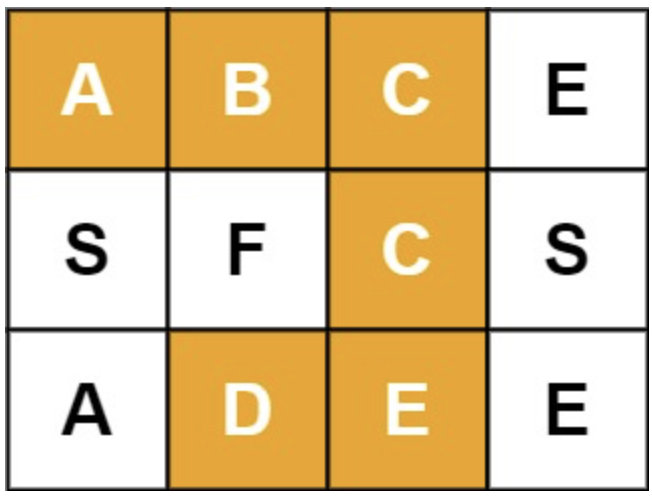
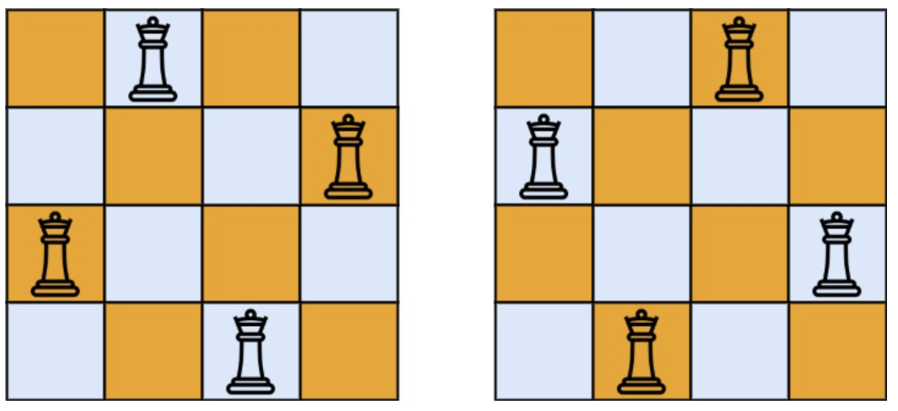
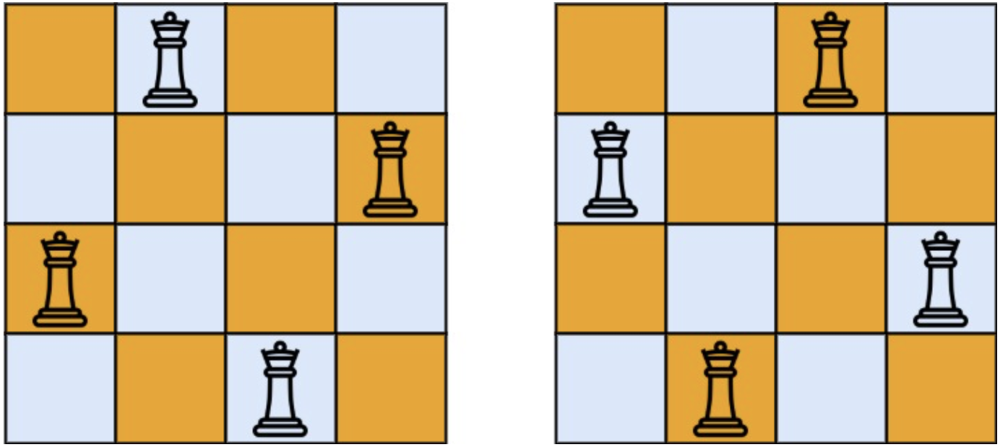

# 十、回溯
## 10.1 排列组合
### 全排列 ⭐️⭐️
给定一个不含重复数字的数组 `nums` ，返回其 所有可能的全排列 。你可以 按任意顺序 返回答案。

**示例**
- 输入：nums = [1,2,3]
- 输出：\[[1,2,3],[1,3,2],[2,1,3],[2,3,1],[3,1,2],[3,2,1]]

**思路**
- DFS。对当前需要填写的下标 `index` 进行搜索，填写当前分支中未访问过的一个数字。

**代码**
```java
class Solution {
    List<List<Integer>> ans = new ArrayList<>();

    void dfs(int index, int[] nums, boolean[] vis, List<Integer> res) {
        if (index == nums.length) {
            ans.add(new ArrayList<>(res));
            return;
        }
        for (int i = 0; i < nums.length; i++) {
            if (!vis[i]) {
                res.add(nums[i]);
                vis[i] = true;

                dfs(index + 1, nums, vis, res);

                res.remove(res.size() - 1);
                vis[i] = false;
            }
        }
    }

    public List<List<Integer>> permute(int[] nums) {
        boolean[] vis = new boolean[nums.length];
        dfs(0, nums, vis, new ArrayList<>());
        return ans;
    }
}
```

### 子集 ⭐️⭐️
给你一个整数数组 `nums` ，数组中的元素 互不相同 。返回该数组所有可能的
子集（幂集）。解集 不能 包含重复的子集。你可以按 任意顺序 返回解集。

**示例**
- 输入：nums = [1,2,3]
- 输出：\[[],[1],[2],[1,2],[3],[1,3],[2,3],[1,2,3]]

**思路**
- 注意到对于下标 `n`，有 `subset(n) = subset(n-1) U subset(n-1).forEachInsert(n)`，从 `nums.length-1` 向下回溯。

**代码**
```java
class Solution {
    List<List<Integer>> ans = new ArrayList<>();

    void dfs(int[] nums, int index) {
        if (index < 0) {
            ans.add(new ArrayList<>());
            return;
        }
        dfs(nums, index - 1);
        int size = ans.size();
        for (int i = 0; i < size; i++) {
            ans.add(new ArrayList<>(ans.get(i)));
            ans.get(i).add(nums[index]);
        }
    }

    public List<List<Integer>> subsets(int[] nums) {
        dfs(nums, nums.length - 1);
        return ans;
    }
}
```

### 电话号码的字母组合 ⭐️⭐️
给定一个仅包含数字 2-9 的字符串，返回所有它能表示的字母组合。答案可以按 任意顺序 返回。

给出数字到字母的映射如下（与电话按键相同）。注意 1 不对应任何字母。


**示例**
- 输入：digits = "23"
- 输出：["ad","ae","af","bd","be","bf","cd","ce","cf"]

**思路**
- 建立数字和字母的对应关系，然后 DFS 搜索数字串中各个位置可能对应的字母。

**代码**
```java
class Solution {
    List<String> ans = new ArrayList<>();
    char[][] digitList = new char[][]{
            {},
            {}, {'a', 'b', 'c'}, {'d', 'e', 'f'},
            {'g', 'h', 'i'}, {'j', 'k', 'l'}, {'m', 'n', 'o'},
            {'p', 'q', 'r', 's'}, {'t', 'u', 'v'}, {'w', 'x', 'y', 'z'}
    };

    void dfs(String digits, int index, List<Character> res) {
        if (index == digits.length()) {
            StringBuilder sb = new StringBuilder();
            for (char c : res) {
                sb.append(c);
            }
            ans.add(sb.toString());
            return;
        }
        int digit = Integer.parseInt(String.valueOf(digits.charAt(index)));
        for (int i = 0; i < digitList[digit].length; i++) {
            res.add(digitList[digit][i]);
            dfs(digits, index + 1, res);
            res.remove(res.size() - 1);
        }
    }

    public List<String> letterCombinations(String digits) {
        dfs(digits, 0, new ArrayList<>());
        return !digits.isEmpty() ? ans : new ArrayList<>();
    }
}
```

### 组合总和 ⭐️⭐️
给你一个 无重复元素 的整数数组 `candidates` 和一个目标整数 `target` ，找出 `candidates` 中可以使数字和为目标数 `target` 的 所有 不同组合 ，并以列表形式返回。你可以按 任意顺序 返回这些组合。

`candidates` 中的 同一个 数字可以 无限制重复被选取 。如果至少一个数字的被选数量不同，则两种组合是不同的。 

对于给定的输入，保证和为 `target` 的不同组合数少于 150 个。

**示例**
- 输入：candidates = [2,3,6,7], target = 7
- 输出：\[[2,2,3],[7]]
- 解释：
    - 2 和 3 可以形成一组候选，2 + 2 + 3 = 7 。注意 2 可以使用多次。
    - 7 也是一个候选， 7 = 7 。
    - 仅有这两种组合。

**思路**
- 扩展子节点的时候只需扩展该元素后面的元素，防止结果重复。
- dfs 搜索的过程中注意剪枝。

**代码**
```java
class Solution {
    List<List<Integer>> ans = new ArrayList<>();

    void dfs(int[] candidates, int index, int sum, int target, List<Integer> res) {
        // 剪枝
        if (sum > target) {
            return;
        }
        if (sum == target) {
            ans.add(new ArrayList<>(res));
            return;
        }
        for (int i = index; i < candidates.length; i++) {
            res.add(candidates[i]);
            dfs(candidates, i, sum + candidates[i], target, res);
            res.remove(res.size() - 1);
        }
    }

    public List<List<Integer>> combinationSum(int[] candidates, int target) {
        dfs(candidates, 0, 0, target, new ArrayList<>());
        return ans;
    }
}
```

### 组合 ⭐️⭐️
给定两个整数 `n` 和 `k`，返回范围 `[1, n]` 中所有可能的 k 个数的组合。

你可以按 任何顺序 返回答案。

**示例**
- 输入：n = 4, k = 2
- 输出：
```
[
  [2,4],
  [3,4],
  [2,3],
  [1,2],
  [1,3],
  [1,4],
]
```
**思路**
- dfs 搜索到满足数量后加入结果中。（注意一定要新建一个 `List` 对象）

**代码**
```java
class Solution {
    List<List<Integer>> ans = new ArrayList<>();

    void dfs(int x, int n, int index, int k, List<Integer> res) {
        if (index == k) {
            ans.add(new ArrayList<>(res));
            return;
        }
        for (int i = x + 1; i <= n; i++) {
            res.add(i);
            dfs(i, n, index + 1, k, res);
            res.remove(res.size() - 1);
        }
    }

    public List<List<Integer>> combine(int n, int k) {
        dfs(0, n, 0, k, new ArrayList<>());
        return ans;
    }
}
```

## 10.2 字符串搜索
### 括号生成 ⭐️⭐️⭐️
数字 `n` 代表生成括号的对数，请你设计一个函数，用于能够生成所有可能的并且 有效的 括号组合。

**示例**
- 输入：n = 3
- 输出：["((()))","(()())","(())()","()(())","()()()"]

**思路**
- 记录当前添加的左括号数量 `open` 和右括号数量 `close`。
- 如果 `open<n` 表示当前还能继续添加左括号。
- 如果 `close<open` 表示当前还能继续添加右括号。

**代码**
```java
class Solution {
    List<String> ans = new ArrayList<>();

    void dfs(int open, int close, int n, StringBuilder res) {
        if (res.length() == n * 2) {
            ans.add(res.toString());
            return;
        }
        // 如果还可以添加左括号
        if (open < n) {
            res.append('(');
            dfs(open + 1, close, n, res);
            res.deleteCharAt(res.length() - 1);
        }
        // 如果右括号的数量比左括号少，则可以添加右括号
        if (close < open) {
            res.append(')');
            dfs(open, close + 1, n, res);
            res.deleteCharAt(res.length() - 1);
        }
    }

    public List<String> generateParenthesis(int n) {
        dfs(0, 0, n, new StringBuilder());
        return ans;
    }
}
```


### 分割回文串 ⭐️⭐️⭐️
给你一个字符串 `s`，请你将 `s` 分割成一些子串，使每个子串都是 回文串。返回 `s` 所有可能的分割方案。

**示例**
- 输入：s = "aab"
- 输出：\[["a","a","b"],["aa","b"]]

**思路**
- dfs 搜索分界线取值 `0/1`，表示该处是否切割。
- 在 dfs 过程中维护当前切割出来的子串 `temp`。如果在此处切割，判断当前 `temp` 是否为回文串，如果不是则剪枝。

**代码**
```java
class Solution {
    List<List<String>> ans = new ArrayList<>();

    void dfs(String s, int index, StringBuilder temp, List<String> res) {
        if (index == s.length()) {
            if (temp.isEmpty()) {
                ans.add(new ArrayList<>(res));
            }
            return;
        }
        //0-不切割
        temp.append(s.charAt(index));
        dfs(s, index + 1, temp, res);
        temp.deleteCharAt(temp.length() - 1);
        //1-切割
        temp.append(s.charAt(index));
        int i = 0;
        int j = temp.length() - 1;
        while (i < j) {
            if (temp.charAt(i) != temp.charAt(j)) {
                temp.deleteCharAt(temp.length() - 1);
                return;
            }
            i++;
            j--;
        }
        res.add(temp.toString());
        dfs(s, index + 1, new StringBuilder(), res);
        res.remove(res.size() - 1);
        temp.deleteCharAt(temp.length() - 1);
    }

    public List<List<String>> partition(String s) {
        dfs(s, 0, new StringBuilder(), new ArrayList<>());
        return ans;
    }
}
```

## 10.3 二维矩阵搜索
### 单词搜索 ⭐️⭐️⭐️
给定一个 `m x n` 二维字符网格 `board` 和一个字符串单词 `word` 。如果 `word` 存在于网格中，返回 `true` ；否则，返回 `false` 。

单词必须按照字母顺序，通过相邻的单元格内的字母构成，其中“相邻”单元格是那些水平相邻或垂直相邻的单元格。同一个单元格内的字母不允许被重复使用。

**示例**
- 输入：board = \[["A","B","C","E"],["S","F","C","S"],["A","D","E","E"]], word = "ABCCED"
- 输出：true
- 

**思路**
- dfs，从每一个单元格开始，匹配单词的每一位 `index`

**代码**
```java
class Solution {
    int[][] directions = new int[][]{{0, 1}, {0, -1}, {1, 0}, {-1, 0}};
    boolean ans = false;

    void dfs(char[][] board, boolean[][] vis, String word, int index, int x, int y) {
        // 查找成功
        if (index == word.length()) {
            ans = true;
            return;
        }
        if (x < 0 || y < 0 || x >= board.length || y >= board[0].length
                || vis[x][y]
                || word.charAt(index) != board[x][y]) {
            return;
        }
        vis[x][y] = true;
        for (int i = 0; i < 4; i++) {
            int nextX = x + directions[i][0];
            int nextY = y + directions[i][1];
            dfs(board, vis, word, index + 1, nextX, nextY);
        }
        vis[x][y] = false;
    }

    public boolean exist(char[][] board, String word) {
        int n = board.length;
        int m = board[0].length;
        boolean[][] vis = new boolean[n][m];

        for (int i = 0; i < n; i++) {
            for (int j = 0; j < m; j++) {
                ans = false;
                dfs(board, vis, word, 0, i, j);
                if (ans) {
                    return true;
                }
            }
        }
        return false;
    }
}
```

### N 皇后 ⭐️⭐️⭐️
按照国际象棋的规则，皇后可以攻击与之处在同一行或同一列或同一斜线上的棋子。

`n` 皇后问题 研究的是如何将 `n` 个皇后放置在 `n×n` 的棋盘上，并且使皇后彼此之间不能相互攻击。

给你一个整数 `n` ，返回所有不同的 `n` 皇后问题 的解决方案。

每一种解法包含一个不同的 `n` 皇后问题 的棋子放置方案，该方案中 `'Q'` 和 `'.'` 分别代表了皇后和空位。

**示例**
- 输入：n = 4
- 输出：\[[".Q..","...Q","Q...","..Q."],["..Q.","Q...","...Q",".Q.."]]
- 解释：如上图所示，4 皇后问题存在两个不同的解法。
- 

**思路**
- 每行放置一个皇后，dfs搜索每行放置在哪一列。
- 使用 `grid` 记录当前棋盘上的皇后分布，使用 `occupied` 记录当前棋盘不可放置皇后的区域。

**代码**
```java
class Solution {
    int[][] directions = new int[][]{{1, 0}, {1, -1}, {1, 1}};
    List<List<String>> ans = new ArrayList<>();

    void dfs(boolean[][] grid, boolean[][] occupied, int x) {
        if (x == grid.length) {
            List<String> res = new ArrayList<>();
            for (int i = 0; i < grid.length; i++) {
                StringBuilder sb = new StringBuilder();
                for (int j = 0; j < grid[0].length; j++) {
                    sb.append(grid[i][j] ? 'Q' : '.');
                }
                res.add(sb.toString());
            }
            ans.add(res);
            return;
        }
        for (int y = 0; y < grid.length; y++) {
            if (!occupied[x][y]) {
                grid[x][y] = true;
                List<Integer[]> posList = new ArrayList<>();
                // 三个方向
                for (int i = 0; i < 3; i++) {
                    int nextX = x;
                    int nextY = y;
                    while (nextX >= 0 && nextX < grid.length && nextY >= 0 && nextY < grid[0].length) {
                        if (!occupied[nextX][nextY]) {
                            occupied[nextX][nextY] = true;
                            posList.add(new Integer[]{nextX, nextY});
                        }
                        nextX += directions[i][0];
                        nextY += directions[i][1];
                    }
                }
                dfs(grid, occupied, x + 1);
                for (Integer[] pos : posList) {
                    occupied[pos[0]][pos[1]] = false;
                }
            }
        }
    }

    public List<List<String>> solveNQueens(int n) {
        boolean[][] grid = new boolean[n][n];
        boolean[][] occupied = new boolean[n][n];
        dfs(grid, occupied, 0);
        return ans;
    }
}
```


### N 皇后 II ⭐️⭐️⭐️
`n` 皇后问题 研究的是如何将 `n` 个皇后放置在 `n × n` 的棋盘上，并且使皇后彼此之间不能相互攻击。

给你一个整数 `n` ，返回 `n` 皇后问题 不同的解决方案的数量。

**示例**
- 输入：n = 4
- 输出：2
- 解释：如上图所示，4 皇后问题存在两个不同的解法。


**思路**
- 每行放置一个皇后，dfs搜索每行放置在哪一列。
- 使用 `grid` 记录当前棋盘上的皇后分布，使用 `occupied` 记录当前棋盘不可放置皇后的区域。

**代码**
```java
class Solution {
    int[][] directions = new int[][]{{1, 0}, {1, -1}, {1, 1}};
    int ans = 0;

    void dfs(boolean[][] grid, boolean[][] occupied, int x) {
        if (x == grid.length) {
            ans++;
            return;
        }
        for (int y = 0; y < grid.length; y++) {
            if (!occupied[x][y]) {
                grid[x][y] = true;
                List<int[]> posList = new ArrayList<>();
                // 三个方向
                for (int i = 0; i < 3; i++) {
                    int nextX = x;
                    int nextY = y;
                    while (nextX >= 0 && nextX < grid.length && nextY >= 0 && nextY < grid[0].length) {
                        if (!occupied[nextX][nextY]) {
                            occupied[nextX][nextY] = true;
                            posList.add(new int[]{nextX, nextY});
                        }
                        nextX += directions[i][0];
                        nextY += directions[i][1];
                    }
                }
                dfs(grid, occupied, x + 1);
                for (int[] pos : posList) {
                    occupied[pos[0]][pos[1]] = false;
                }
            }
        }
    }

    public int totalNQueens(int n) {
        boolean[][] grid = new boolean[n][n];
        boolean[][] occupied = new boolean[n][n];
        dfs(grid, occupied, 0);
        return ans;
    }
}
```