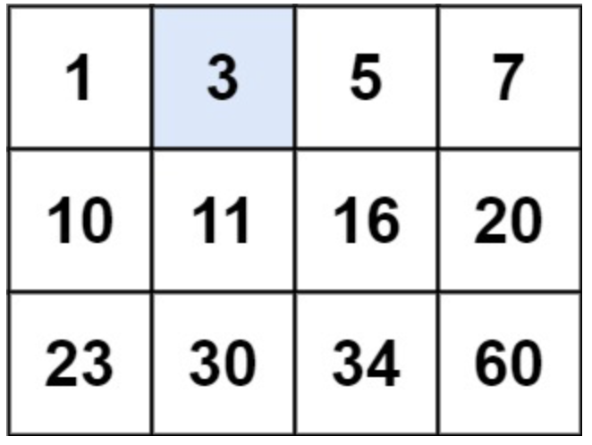
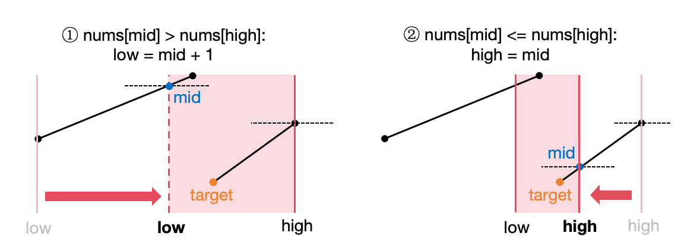

# 十一、二分查找
## 11.1 有序数组二分查找

### 搜索插入位置 ⭐️
给定一个排序数组和一个目标值，在数组中找到目标值，并返回其索引。如果目标值不存在于数组中，返回它将会被按顺序插入的位置。

请必须使用时间复杂度为 `O(log n)` 的算法。

**示例**
- 输入: nums = [1,3,5,6], target = 5
- 输出: 2

**思路**
- 调用 API `Arrays.binarySearch()`，如果不存在，该方法将返回 `-插入位置-1`。
- 自行实现。对 `[low,high]` 范围进行二分查找。如果不存在，则 `low` 为待插入位置。（记住这个二分模板）

**代码**
```java
class Solution {
    public int searchInsert(int[] nums, int target) {
        int low = 0;
        int high = nums.length - 1;

        while (low <= high) {
            int mid = (low + high) / 2;
            if (nums[mid] == target) {
                return mid;
            } else if (nums[mid] > target) {
                high = mid - 1;
            } else {
                low = mid + 1;
            }
        }
        return low;
    }
}
```

### 搜索二维矩阵 ⭐️⭐️
给你一个满足下述两条属性的 `m x n` 整数矩阵：

每行中的整数从左到右按非严格递增顺序排列。
每行的第一个整数大于前一行的最后一个整数。
给你一个整数 `target` ，如果 `target` 在矩阵中，返回 `true`；否则，返回 `false` 。

**示例**
- 输入：matrix = \[[1,3,5,7],[10,11,16,20],[23,30,34,60]], target = 3
- 输出：true
- 

**思路**
- **请务必与 6.4 区分**。那个是右上到左下逐步缩窄搜索范围。
- 先二分查找行（注意判断边界条件），再二分查找列。

**代码**
```java
class Solution {
    public boolean searchMatrix(int[][] matrix, int target) {
        int n = matrix.length;
        int m = matrix[0].length;
        // 先二分查找行
        int low = 0;
        int high = n - 1;
        while (low <= high) {
            int midX = (low + high) / 2;
            if (matrix[midX][0] == target) {
                return true;
            } else if (matrix[midX][0] > target) {
                high = midX - 1;
            } else {
                low = midX + 1;
            }
        }
        int row = low - 1;
        if (row < 0) {
            return false;
        }
        // 再二分查找列
        low = 0;
        high = m - 1;
        while (low <= high) {
            int midY = (low + high) / 2;
            if (matrix[row][midY] == target) {
                return true;
            } else if (matrix[row][midY] > target) {
                high = midY - 1;
            } else {
                low = midY + 1;
            }
        }
        return false;
    }
}
```

### 在排序数组中查找元素的第一个和最后一个位置 ⭐️⭐️
给你一个按照非递减顺序排列的整数数组 `nums`，和一个目标值 `target`。请你找出给定目标值在数组中的开始位置和结束位置。

如果数组中不存在目标值 `target`，返回 `[-1, -1]`。

你必须设计并实现时间复杂度为 `O(log n)` 的算法解决此问题。

**示例**
- 输入：nums = [5,7,7,8,8,10], target = 8
- 输出：[3,4]

**思路**
- 两次二分查找。
- 第一次，当找到 `target` 时，将 `[low,high]` 向左收窄，以找到 `target` 第一次出现的位置。
- 第二次，当找到 `target` 时，将 `[low,high]` 向右收窄，以找到 `target` 最后一次出现的位置。

**代码**
```java
class Solution {
    public int[] searchRange(int[] nums, int target) {
        int low = 0;
        int high = nums.length - 1;
        int first = -1;
        while (low <= high) {
            int mid = (low + high) / 2;
            if (nums[mid] == target) {
                first = mid;
                high = mid - 1; // 如果找到，向左收窄范围
            } else if (nums[mid] > target) {
                high = mid - 1;
            } else {
                low = mid + 1;
            }
        }
        low = 0;
        high = nums.length - 1;
        int last = -1;
        while (low <= high) {
            int mid = (low + high) / 2;
            if (nums[mid] == target) {
                last = mid;
                low = mid + 1; // 如果找到，向右收窄边界
            } else if (nums[mid] > target) {
                high = mid - 1;
            } else {
                low = mid + 1;
            }
        }
        return new int[]{first, last};
    }
}
```

### 寻找两个正序数组的中位数 ⭐️⭐️⭐️⭐️⭐️
给定两个大小分别为 `m` 和 `n` 的正序（从小到大）数组 `nums1` 和 `nums2`。请你找出并返回这两个正序数组的 中位数 。

算法的时间复杂度应该为 `O(log (m+n))` 。

**示例**
- 输入：nums1 = [1,3], nums2 = [2]
- 输出：2.00000
- 解释：合并数组 = [1,2,3] ，中位数 2

**思路**
- 设 `nums1` 是长度较小的数组。
- 在 `nums1` 中二分查找到划分点 `mid1`，此时 `nums2` 对应划分点 `mid2=(m+n+1)/2 - mid1`，使得 `nums1 U nums2` 在两个划分点之前的数比划分点之后的数小。
- 如果合并后数组长度为奇数，取 `nums1 U nums2` 在两个划分点之前的最大值作为中位数；如果合并后数组长度为偶数，取 `nums1 U nums2` 在两个划分点之前的最大值与两个划分点之后的最小值的平均值作为中位数。

**代码**
```java
class Solution {
    public double findMedianSortedArrays(int[] nums1, int[] nums2) {
        if (nums1.length > nums2.length) {
            return findMedianSortedArrays(nums2, nums1);
        }
        int m = nums1.length;
        int n = nums2.length;
        // 合并后数组的半长，向上取整
        int k = (m + n + 1) / 2;

        // nums1: [0,mid1), [mid1,m)
        // nums2: [0,mid2), [mid2,n)
        int low = 0;
        int high = m;   // 注意这里 mid1 是可以取到 m 的
        while (low <= high) {
            int mid1 = (low + high) / 2;
            int mid2 = k - mid1;
            // 如果nums1左边最大值要比nums2右边最小值还要大，向左搜索
            if (mid1 > 0 && nums1[mid1 - 1] > nums2[mid2]) {
                high = mid1 - 1;
            }
            // 如果nums1右边最小值要比nums2左边最大值还要小，向右搜索
            else if (mid1 < m && nums1[mid1] < nums2[mid2 - 1]) {
                low = mid1 + 1;
            }
            // 找到合适的 mid1 和 mid2
            else {
                double nums1LeftMax = mid1 == 0 ? Integer.MIN_VALUE : nums1[mid1 - 1];
                double nums1RightMin = mid1 == m ? Integer.MAX_VALUE : nums1[mid1];
                double nums2LeftMax = mid2 == 0 ? Integer.MIN_VALUE : nums2[mid2 - 1];
                double nums2RightMin = mid2 == n ? Integer.MAX_VALUE : nums2[mid2];
                if ((m + n) % 2 == 0) {
                    return (Math.max(nums1LeftMax, nums2LeftMax) + Math.min(nums1RightMin, nums2RightMin)) / 2.0;
                } else {
                    return Math.max(nums1LeftMax, nums2LeftMax);
                }
            }
        }
        return -1;
    }
}
```

## 11.2 特殊数组二分查找
### 寻找峰值 ⭐️⭐️
峰值元素是指其值严格大于左右相邻值的元素。

给你一个整数数组 `nums`，找到峰值元素并返回其索引。数组可能包含多个峰值，在这种情况下，返回 任何一个峰值 所在位置即可。

你可以假设 `nums[-1] = nums[n] = -∞` 。

你必须实现时间复杂度为 `O(log n)` 的算法来解决此问题。

**示例**
- 输入：nums = [1,2,3,1]
- 输出：2
- 解释：3 是峰值元素，你的函数应该返回其索引 2。

**思路**
- 经典二分，直到找到满足大于两边元素的下标即可，否则沿着向上的方向搜索。
- 注意处理好边界条件。

**代码**
```java
class Solution {
    public int findPeakElement(int[] nums) {
        int n = nums.length;
        if (n == 1) {
            return 0;
        }
        int low = 0;
        int high = n - 1;
        while (low <= high) {
            int mid = (low + high) / 2;
            if ((mid > 0 && mid + 1 < n && nums[mid] > nums[mid - 1] && nums[mid] > nums[mid + 1])
                    || (mid == 0 && nums[mid] > nums[mid + 1])
                    || (mid == n - 1 && nums[mid] > nums[mid - 1])
            ) {
                return mid;
            }
            if ((mid > 0 && mid + 1 < n && nums[mid - 1] < nums[mid] && nums[mid] < nums[mid + 1])
                    || (mid == 0 && nums[mid] < nums[mid + 1])
            ) {
                low = mid + 1;
            } else {
                high = mid - 1;
            }
        }
        return low;
    }
}
```

### 搜索旋转排序数组 ⭐️⭐️⭐️
整数数组 `nums` 按升序排列，数组中的值 互不相同 。

在传递给函数之前，`nums` 在预先未知的某个下标 `k（0 <= k < nums.length）`上进行了 旋转，使数组变为 `[nums[k], nums[k+1], ..., nums[n-1], nums[0], nums[1], ..., nums[k-1]]`（下标 从 `0` 开始 计数）。例如， `[0,1,2,4,5,6,7]` 在下标 3 处经旋转后可能变为 `[4,5,6,7,0,1,2]` 。

给你 旋转后 的数组 `nums` 和一个整数 `target` ，如果 `nums` 中存在这个目标值 `target` ，则返回它的下标，否则返回 `-1` 。

你必须设计一个时间复杂度为 `O(log n)` 的算法解决此问题。

**示例**
- 输入：nums = [4,5,6,7,0,1,2], target = 0
- 输出：4

**思路**
- 二分的同时判断 `mid` 左右（即 `[low,mid]`,`[mid,high]`）哪边是有序的。
- 如果左边有序且 `target` 位于左边区间内，向左搜索，否则向右搜索。
- 如果右边有序且 `target` 位于右边区间内，向右搜索，否则向左搜索。

**代码**
```java
class Solution {
    public int search(int[] nums, int target) {
        int n = nums.length;
        int low = 0;
        int high = n - 1;
        while (low <= high) {
            int mid = (low + high) / 2;
            if (nums[mid] == target) {
                return mid;
            }
            // 左半边有序
            if (nums[low] <= nums[mid]) {
                // target是否位于左半边区间内
                if (nums[low] <= target && target < nums[mid]) {
                    high = mid - 1;
                } else {
                    low = mid + 1;
                }
            }
            // 右半边有序
            else {
                // target是否位于右半边区间内
                if (nums[mid] < target && target <= nums[high]) {
                    low = mid + 1;
                } else {
                    high = mid - 1;
                }
            }
        }
        return -1;
    }
}
```

### 寻找旋转排序数组中的最小值 ⭐️⭐️⭐️
已知一个长度为 `n` 的数组，预先按照升序排列，经由 1 到 `n` 次 旋转 后，得到输入数组。例如，原数组 `nums = [0,1,2,4,5,6,7]` 在变化后可能得到：
若旋转 4 次，则可以得到 `[4,5,6,7,0,1,2]`
若旋转 7 次，则可以得到 `[0,1,2,4,5,6,7]`
注意，数组 `[a[0], a[1], a[2], ..., a[n-1]]` 旋转一次 的结果为数组 `[a[n-1], a[0], a[1], a[2], ..., a[n-2]]` 。

给你一个元素值 互不相同 的数组 `nums` ，它原来是一个升序排列的数组，并按上述情形进行了多次旋转。请你找出并返回数组中的 最小元素 。

你必须设计一个时间复杂度为 `O(log n)` 的算法解决此问题。

**示例**
- 输入：nums = [3,4,5,1,2]
- 输出：1
- 解释：原数组为 [1,2,3,4,5] ，旋转 3 次得到输入数组。

**思路**
- 比较 `mid` 和 `high` 的数值大小，如果 `mid` 大（ `>` 或 `>=` 均可）则说明在右边，否则在左边（包括 `mid`）。
- 当区间内只有一个元素退出循环。返回 `low`。

**代码**
```java
class Solution {
    public int findMin(int[] nums) {
        int n = nums.length;
        int low = 0;
        int high = n - 1;
        while (low + 1 <= high) {
            int mid = (low + high) / 2;
            if (nums[mid] > nums[high]) {
                low = mid + 1;
            } else {
                high = mid;
            }
        }
        return nums[low];
    }
}
```


### 寻找重复数 ⭐️⭐️⭐️⭐️
给定一个包含 `n + 1` 个整数的数组 `nums` ，其数字都在 `[1, n]` 范围内（包括 1 和 `n`），可知至少存在一个重复的整数。

假设 `nums` 只有 一个重复的整数 ，返回 这个重复的数 。

你设计的解决方案必须 不修改 数组 nums 且只用常量级 O(1) 的额外空间。

**示例**
- 输入：nums = [1,3,4,2,2]
- 输出：2

**思路**
- 设 `cnt[i]` 表示 `nums` 中 `<= i` 的元素个数。
- 对于 `i < target`，`cnt[i] <= i`；对于 `i >= target`，`cnt[i] > i`。
- 对 `0 ~ n-1` 进行二分查找。`cnt[i]` 可以边查找边统计，无需提前统计，因此不占用额外存储空间。

**代码**
```java
class Solution {
    public int findDuplicate(int[] nums) {
        int n = nums.length;
        int l = 0;
        int r = n - 1;
        // target前：cnt[i]<=i，target后cnt[i]>i
        while (l <= r) {
            int mid = (l + r) / 2;
            // 求出比mid小的数的个数
            int cnt = 0;
            for (int num : nums) {
                if (num <= mid) {
                    cnt++;
                }
            }
            if (cnt <= mid) {
                l = mid + 1;
            } else {
                r = mid - 1;
            }
        }
        return l;
    }
}
```

## 11.3 其他分治算法
### 建立四叉树 ⭐️⭐️⭐️
给你一个 `n * n` 矩阵 `grid` ，矩阵由若干 `0` 和 `1` 组成。请你用四叉树表示该矩阵 `grid` 。

你需要返回能表示矩阵 `grid` 的 四叉树 的根结点。

四叉树数据结构中，每个内部节点只有四个子节点。此外，每个节点都有两个属性：

- `val`：储存叶子结点所代表的区域的值。`1` 对应 `True`，`0` 对应 `False`。注意，当 `isLeaf` 为 `False` 时，你可以把 `True` 或者 `False` 赋值给节点，两种值都会被判题机制 接受 。
- `isLeaf`: 当这个节点是一个叶子结点时为 `True`，如果它有 `4` 个子节点则为 `False` 。
```
class Node {
    public boolean val;
    public boolean isLeaf;
    public Node topLeft;
    public Node topRight;
    public Node bottomLeft;
    public Node bottomRight;
}
```
我们可以按以下步骤为二维区域构建四叉树：

- 如果当前网格的值相同（即，全为 `0` 或者全为 `1`），将 `isLeaf` 设为 `True` ，将 `val` 设为网格相应的值，并将四个子节点都设为 `Null` 然后停止。
- 如果当前网格的值不同，将 `isLeaf` 设为 `False`， 将 `val` 设为任意值，然后如下图所示，将当前网格划分为四个子网格。
- 使用适当的子网格递归每个子节点。

如果你想了解更多关于四叉树的内容，可以参考 wiki 。

四叉树格式：

你不需要阅读本节来解决这个问题。只有当你想了解输出格式时才会这样做。输出为使用层序遍历后四叉树的序列化形式，其中 `null` 表示路径终止符，其下面不存在节点。

它与二叉树的序列化非常相似。唯一的区别是节点以列表形式表示 `[isLeaf, val]` 。

如果 `isLeaf` 或者 `val` 的值为 `True` ，则表示它在列表 `[isLeaf, val]` 中的值为 `1` ；如果 `isLeaf` 或者 `val` 的值为 `False` ，则表示值为 `0` 。

**示例**
- 输入：grid = \[[1,1,1,1,0,0,0,0],[1,1,1,1,0,0,0,0],[1,1,1,1,1,1,1,1],[1,1,1,1,1,1,1,1],[1,1,1,1,0,0,0,0],[1,1,1,1,0,0,0,0],[1,1,1,1,0,0,0,0],[1,1,1,1,0,0,0,0]]
- 输出：\[[0,1],[1,1],[0,1],[1,1],[1,0],null,null,null,null,[1,0],[1,0],[1,1],[1,1]]
- 解释：网格中的所有值都不相同。我们将网格划分为四个子网格。
`topLeft`，`bottomLeft` 和 `bottomRight` 均具有相同的值。
`topRight` 具有不同的值，因此我们将其再分为 4 个子网格，这样每个子网格都具有相同的值。
解释如下图所示：


**思路**
- 记录每个区块左上角下标 `x` 和 `y` 以及区块边长 `n`，判断区块内元素是否完全相同。如果不完全相同则四分递归构建，否则返回叶节点。

**代码**
```java
class Solution {
    Node buildTree(int[][] grid, int x, int y, int n) {
        if (n == 0) {
            return null;
        }
        int num = grid[x][y];
        Node node = new Node();
        for (int i = x; i < n + x; i++) {
            for (int j = y; j < n + y; j++) {
                if (grid[i][j] != num) {
                    node.isLeaf = false;
                    node.val = true;
                    n /= 2;
                    node.topLeft = buildTree(grid, x, y, n);
                    node.topRight = buildTree(grid, x, y + n, n);
                    node.bottomLeft = buildTree(grid, x + n, y, n);
                    node.bottomRight = buildTree(grid, x + n, y + n, n);
                    return node;
                }
            }
        }
        // 全部相等
        node.isLeaf = true;
        node.val = num == 1;
        node.bottomLeft = null;
        node.bottomRight = null;
        node.topLeft = null;
        node.topRight = null;
        return node;
    }

    public Node construct(int[][] grid) {
        int n = grid.length;
        return buildTree(grid, 0, 0, n);
    }
}
```