# 七、二叉树

## 7.1 二叉树深度优先遍历（DFS）

### 二叉树的中序遍历 ⭐️

给定一个二叉树的根节点 `root` ，返回 它的 中序 遍历 。

**示例**

- 输入：root = [1,null,2,3]
- 输出：[1,3,2]

**思路**

- 前序：访问-左递归-右递归
- 中序：左递归-访问-右递归
- 后续：左递归-右递归-访问

**代码**

```java
class Solution {
    List<Integer> nodes = new ArrayList<>();

    public void visit(TreeNode node) {
        if (node == null) {
            return;
        }
        visit(node.left);
        nodes.add(node.val);
        visit(node.right);
    }

    public List<Integer> inorderTraversal(TreeNode root) {
        visit(root);
        return nodes;
    }
}
```

### 二叉树的最大深度 ⭐️

给定一个二叉树 `root` ，返回其最大深度。

二叉树的 最大深度 是指从根节点到最远叶子节点的最长路径上的节点数。

**示例**

- 输入：root = [3,9,20,null,null,15,7]
- 输出：3
- 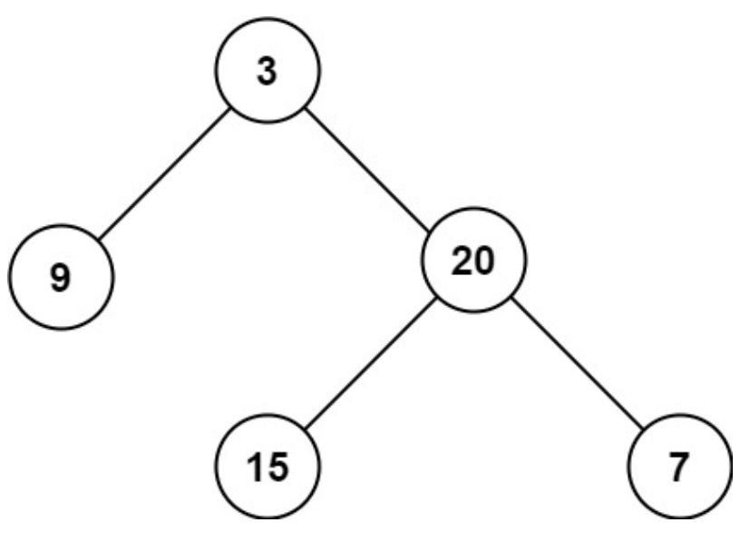

**思路**

- 当前节点的最大深度 = max(左子树最大深度，右子树最大深度)+1

**代码**

```java
class Solution {
    int depth(TreeNode node) {
        if (node == null) {
            return 0;
        }
        return Math.max(depth(node.left), depth(node.right)) + 1;
    }

    public int maxDepth(TreeNode root) {
        return depth(root);
    }
}
```

### 翻转二叉树 ⭐️⭐️

给你一棵二叉树的根节点 `root` ，翻转这棵二叉树，并返回其根节点。

**示例**

- 输入：root = [4,2,7,1,3,6,9]
- 输出：[4,7,2,9,6,3,1]
- 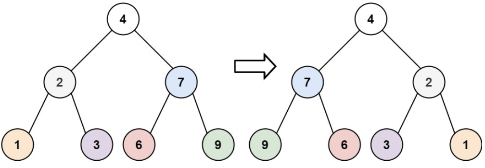

**思路**

- 自底向上，左右子树交换即可。

**代码**

```java
class Solution {
    void invert(TreeNode node) {
        if (node == null) {
            return;
        }
        invert(node.left);
        invert(node.right);
        TreeNode temp = node.left;
        node.left = node.right;
        node.right = temp;
    }

    public TreeNode invertTree(TreeNode root) {
        invert(root);
        return root;
    }
}
```

### 相同的树 ⭐️⭐️

给你两棵二叉树的根节点 `p` 和 `q`，编写一个函数来检验这两棵树是否相同。

如果两个树在结构上相同，并且节点具有相同的值，则认为它们是相同的。

**示例**

- 输入：p = [1,2,3], q = [1,2,3]
- 输出：true

**思路**

- 与**对称二叉树**相反，同时向左子树或右子树递归

**代码**

```java
class Solution {
    boolean check(TreeNode node1, TreeNode node2) {
        if (node1 == null && node2 == null) {
            return true;
        }
        if (node1 == null || node2 == null) {
            return false;
        }
        return node1.val == node2.val
                && check(node1.right, node2.right)
                && check(node1.left, node2.left);
    }

    public boolean isSameTree(TreeNode p, TreeNode q) {
        return check(p, q);
    }
}
```

### 对称二叉树 ⭐️⭐️

给你一个二叉树的根节点 `root` ， 检查它是否轴对称。

**示例**

- 输入：root = [1,2,2,3,4,4,3]
- 输出：true
- 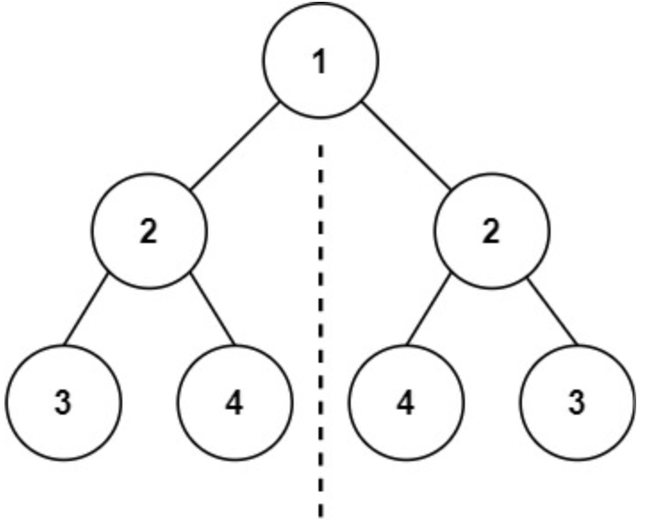

**思路**

- 个人思路（时间复杂度高）：判断 `根-左-右` 与 `根-右-左` 两种先序遍历结果是否一致。（注意 `null` 也要加入遍历结果）
- 官方思路：双指针 `p` 和 `q` 初始均位于根结点，`p` 与 `q` 分别 <向左、向右> 和 <向右、向左> 方向递归移动，并比较指向的值是否相等。

**代码**

```java
class Solution {
    boolean check(TreeNode p, TreeNode q) {
        if (p == null && q == null) {
            return true;
        }
        if (p == null || q == null) {
            return false;
        }
        return p.val == q.val
                // p 向左，q 向右
                && check(p.left, q.right)
                // p 向右，q 向左
                && check(p.right, q.left);
    }

    public boolean isSymmetric(TreeNode root) {
        return check(root, root);
    }
}
```

### 二叉树的最近公共祖先 ⭐️⭐️⭐️

给定一个二叉树, 找到该树中两个指定节点的最近公共祖先。

百度百科中最近公共祖先的定义为：“对于有根树 `T` 的两个节点 `p、q`，最近公共祖先表示为一个节点 `x`，满足 `x` 是 `p、q`
的祖先且 `x `的深度尽可能大（一个节点也可以是它自己的祖先）。

**示例**

- 输入：root = [3,5,1,6,2,0,8,null,null,7,4], p = 5, q = 1
- 输出：3
- 解释：节点 5 和节点 1 的最近公共祖先是节点 3 。
- 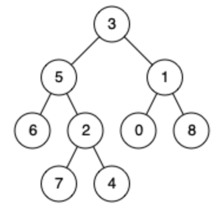

**思路**

-

简单思路：递归构建父节点哈希表，形成每个节点的父节点链。然后求两个父节点链中第一个相同的父节点。（你就说时间复杂度是不是 `O(n)`
吧）

- 正经思路：递归执行：节点向左右子树查找是否存在 `p` 或 `q`。如果均存在，则返回该节点，否则返回存在的那一方。（各级领导让下属的两个人去找人，然后向上反馈）

**代码**
简单思路：

```java
class Solution {
    Map<TreeNode, TreeNode> fatherMap = new HashMap<>();

    void dfs(TreeNode node, TreeNode father) {
        if (node == null) {
            return;
        }
        fatherMap.put(node, father);
        dfs(node.left, node);
        dfs(node.right, node);
    }

    public TreeNode lowestCommonAncestor(TreeNode root, TreeNode p, TreeNode q) {
        dfs(root, null);
        Set<TreeNode> set = new HashSet<>();
        while (p != null) {
            set.add(p);
            p = fatherMap.get(p);
        }
        while (q != null) {
            if (set.contains(q)) {
                return q;
            }
            q = fatherMap.get(q);
        }
        return null;
    }
}
```

正经思路：

```java
class Solution {
    public TreeNode dfs(TreeNode node, TreeNode p, TreeNode q) {
        // 如果当前节点为空，或者根节点是 p 或 q，直接返回当前节点
        if (node == null || node == p || node == q) {
            return node;
        }
        // 去左子树找有没有 p 或 q
        TreeNode left = dfs(node.left, p, q);
        // 去右子树找有没有 p 或 q
        TreeNode right = dfs(node.right, p, q);
        // 如果 p 和 q 分别在左右子树中，则当前节点是最近公共祖先
        if (left != null && right != null) {
            return node;
        }
        // 否则返回非空的子树结果，表示 p 或 q 在一边，并且 left 或者 right 就是最近的祖先节点。
        return left != null ? left : right;
    }

    public TreeNode lowestCommonAncestor(TreeNode root, TreeNode p, TreeNode q) {
        return dfs(root, p, q);
    }
}
```

### 验证二叉搜索树 ⭐️⭐️⭐️

给你一个二叉树的根节点 `root` ，判断其是否是一个有效的二叉搜索树。

有效 二叉搜索树定义如下：

- 节点的左子树只包含 小于 当前节点的数。
- 节点的右子树只包含 大于 当前节点的数。
- 所有左子树和右子树自身必须也是二叉搜索树。

**示例**

- 输入：root = [2,1,3]
- 输出：true

**思路**

- 递归遍历的过程中记录和更新子树的节点需要满足的范围 `(min,max)`。
- `node` 扩展左子树时，左子树节点的数值不应大于等于 `node` 的数值。（`max=node.val`）
- `node` 扩展右子树时，右子树节点的数值不应小于等于 `node` 的数值。（`min=node.val`）

**代码**

```java
class Solution {
    public boolean check(TreeNode node, long min, long max) {
        if (node == null) {
            return true;
        }
        if (node.val <= min || node.val >= max) {
            return false;
        }
        return check(node.left, min, node.val) && check(node.right, node.val, max);
    }

    public boolean isValidBST(TreeNode root) {
        return check(root, Long.MIN_VALUE, Long.MAX_VALUE);
    }
}
```

### 二叉树的直径 ⭐️⭐️⭐️

给你一棵二叉树的根节点，返回该树的直径 。

二叉树的 直径 是指树中任意两个节点之间最长路径的长度 。这条路径可能经过也可能不经过根节点 `root` 。

两节点之间路径的长度由它们之间边数表示。

**示例**

- 输入：root = [1,2,3,4,5]
- 输出：3
- 解释：3 ，取路径 [4,2,1,3] 或 [5,2,1,3] 的长度。
- 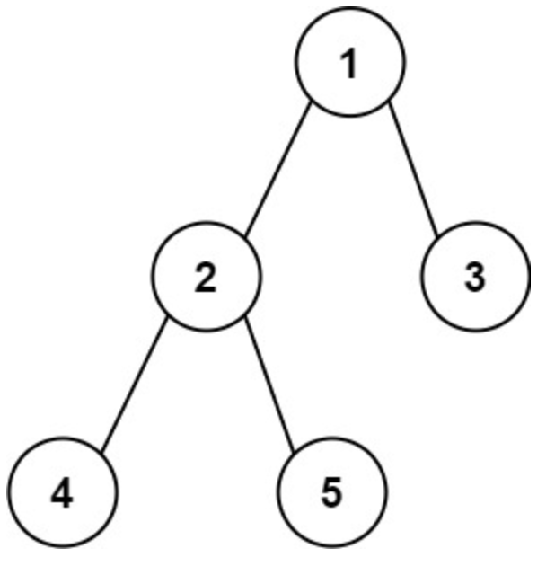

**思路**

- 一棵二叉树的直径 = `左子树最大深度 + 右子树最大深度`，深度用节点数表示。
- 使用全局变量 `ans` 记录递归过程中每个节点的最大直径。

**代码**

```java
class Solution {
    int ans = 0;

    public int depth(TreeNode node) {
        if (node == null) {
            return 0;
        }
        int leftDepth = depth(node.left);
        int rightDepth = depth(node.right);
        ans = Math.max(ans, leftDepth + rightDepth);
        return Math.max(leftDepth, rightDepth) + 1;
    }

    public int diameterOfBinaryTree(TreeNode root) {
        depth(root);
        return ans;
    }
}
```

### 二叉树中的最大路径和 ⭐️⭐️⭐️

二叉树中的 路径 被定义为一条节点序列，序列中每对相邻节点之间都存在一条边。同一个节点在一条路径序列中 至多出现一次 。该路径
至少包含一个 节点，且不一定经过根节点。

路径和 是路径中各节点值的总和。

给你一个二叉树的根节点 `root` ，返回其 最大路径和 。

**示例**

- 输入：root = [1,2,3]
- 输出：6
- 解释：最优路径是 2 -> 1 -> 3 ，路径和为 2 + 1 + 3 = 6

**思路**

- 与二叉树直径类似。
- 递归函数定义为以当前节点为**起始点**的路径的最大值。
- 以当前节点为起始点的路径的最大值 = 当前节点的值 + 以左右子节点为起始点的路径最大值。
- 递归过程中使用 `ans` 记录 **经过** 每个节点的路径的最大值。

**代码**

```java
class Solution {
    int ans = Integer.MIN_VALUE;

    private int getPathSum(TreeNode node) {
        if (node == null) {
            return 0;
        }
        // 计算左子树和右子树的最大路径和，如果是负数则不取
        int left = Math.max(getPathSum(node.left), 0);
        int right = Math.max(getPathSum(node.right), 0);
        // 计算通过当前节点的路径和（包含左子树和右子树）
        int currentPathSum = node.val + left + right;
        // 更新全局最大路径和
        ans = Math.max(ans, currentPathSum);
        // 返回当前节点为根的子树的最大路径和（只能选择左子树或右子树）
        return node.val + Math.max(left, right);
    }

    public int maxPathSum(TreeNode root) {
        getPathSum(root);
        return ans;
    }
}
```

### 统计好节点的数目 ⭐️⭐⭐

现有一棵 无向 树，树中包含 `n` 个节点，按从 `0` 到 `n - 1` 标记。树的根节点是节点 `0` 。给你一个长度为 `n - 1`
的二维整数数组 `edges`，其中
`edges[i] = [ai, bi]` 表示树中节点 `ai` 与节点 `bi` 之间存在一条边。

如果一个节点的所有子节点为根的
子树
包含的节点数相同，则认为该节点是一个 好节点。

返回给定树中 好节点 的数量。

子树 指的是一个节点以及它所有后代节点构成的一棵树。

️**示例**

- 输入：edges = \[[0,1],[0,2],[1,3],[1,4],[2,5],[2,6]]
- 输出：7
- 说明： 树的所有节点都是好节点。

**思路**

- 先建立邻接表
- 经典 “求一个统计另一个” 思路。递归函数求以当前节点为根的子树的节点数。在递归过程中验证并统计好节点的数量。

**代码**

```java
class Solution {
    int ans = 0;

    int dfs(List<Integer>[] adjList, int x, boolean[] vis) {
        int sum = 0;
        int cur = -1;
        boolean good = true;
        vis[x] = true;
        for (int child : adjList[x]) {
            if (vis[child]) {
                continue;
            }
            int count = dfs(adjList, child, vis);
            sum += count;
            if (cur == -1) {
                cur = count;
            } else if (count != cur) {
                good = false;
            }
        }
        if (good) {
            ans++;
        }
        return sum + 1;
    }

    public int countGoodNodes(int[][] edges) {
        int n = edges.length + 1;
        List<Integer>[] adjList = new List[n];
        for (int i = 0; i < adjList.length; i++) {
            adjList[i] = new ArrayList<>();
        }
        for (int[] edge : edges) {
            adjList[edge[0]].add(edge[1]);
            adjList[edge[1]].add(edge[0]);
        }
        dfs(adjList, 0, new boolean[n]);
        return ans;
    }
}
```

### 路径总和 ⭐️⭐️

给你二叉树的根节点 `root` 和一个表示目标和的整数 `targetSum` 。判断该树中是否存在 根节点到叶子节点
的路径，这条路径上所有节点值相加等于目标和 `targetSum` 。如果存在，返回 `true` ；否则，返回 `false` 。

叶子节点 是指没有子节点的节点。

**示例**

- 输入：root = [5,4,8,11,null,13,4,7,2,null,null,null,1], targetSum = 22
- 输出：true
- 解释：等于目标和的根节点到叶节点路径如上图所示。
- 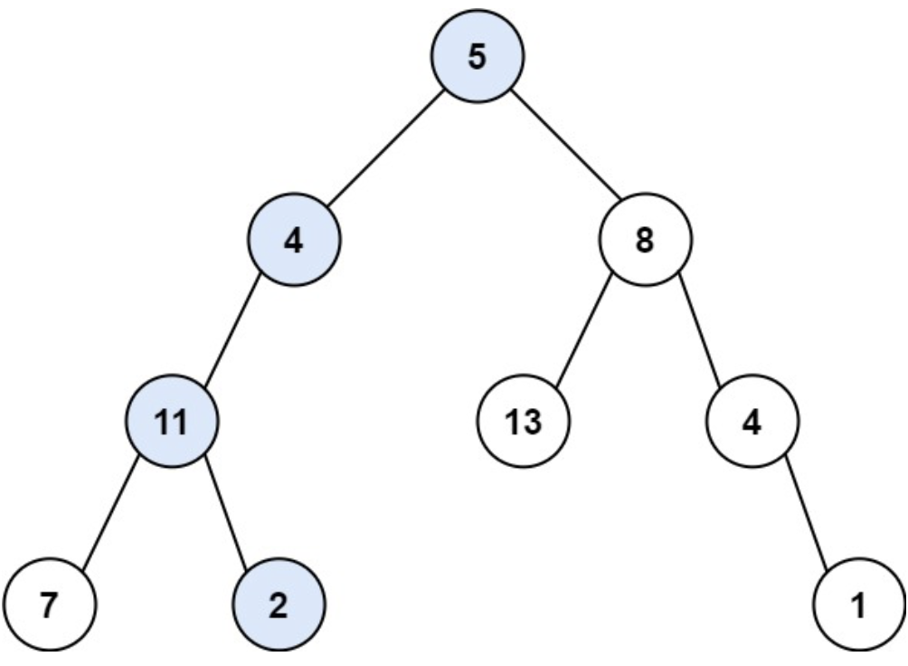

**思路**

- 判断左子树或右子树是否有和为 `targetSum - node.val` 的路径。
- 递归到 `null` 节点返回 `false`，递归到叶子节点返回当前节点值是否等于当前目标值。

**代码**

```java
class Solution {
    boolean check(TreeNode node, int targetSum) {
        if (node == null) {
            return false;
        }
        if (node.left == null && node.right == null) {
            return node.val == targetSum;
        }
        return check(node.left, targetSum - node.val)
                || check(node.right, targetSum - node.val);
    }

    public boolean hasPathSum(TreeNode root, int targetSum) {
        return check(root, targetSum);
    }
}
```

### 求根节点到叶节点数字之和 ⭐️⭐️

给你一个二叉树的根节点 `root` ，树中每个节点都存放有一个 0 到 9 之间的数字。
每条从根节点到叶节点的路径都代表一个数字：

例如，从根节点到叶节点的路径 `1 -> 2 -> 3` 表示数字 `123` 。
计算从根节点到叶节点生成的 所有数字之和 。

叶节点 是指没有子节点的节点。

**示例**

- 输入：root = [1,2,3]
- 输出：25
- 解释：
    - 从根到叶子节点路径 1->2 代表数字 12
    - 从根到叶子节点路径 1->3 代表数字 13
    - 因此，数字总和 = 12 + 13 = 25

**思路**

- 自顶向下记录到当前节点的数值。
- 如果访问到叶子节点则累积总数值。

**代码**

```java
class Solution {
    int ans = 0;

    void dfs(TreeNode node, int sum) {
        if (node == null) {
            return;
        }
        sum = 10 * sum + node.val;
        if (node.left == null && node.right == null) {
            ans += sum;
        }
        dfs(node.left, sum);
        dfs(node.right, sum);
    }

    public int sumNumbers(TreeNode root) {
        dfs(root, 0);
        return ans;
    }
}
```

### 路径总和 III ⭐️⭐️⭐️⭐️

给定一个二叉树的根节点 `root` ，和一个整数 `targetSum` ，求该二叉树里节点值之和等于 `targetSum` 的 路径 的数目。

路径 不需要从根节点开始，也不需要在叶子节点结束，但是路径方向必须是向下的（只能从父节点到子节点）。

**示例**

- 输入：root = [10,5,-3,3,2,null,11,3,-2,null,1], targetSum = 8
- 输出：3
- 解释：和等于 8 的路径有 3 条，如图所示。
- 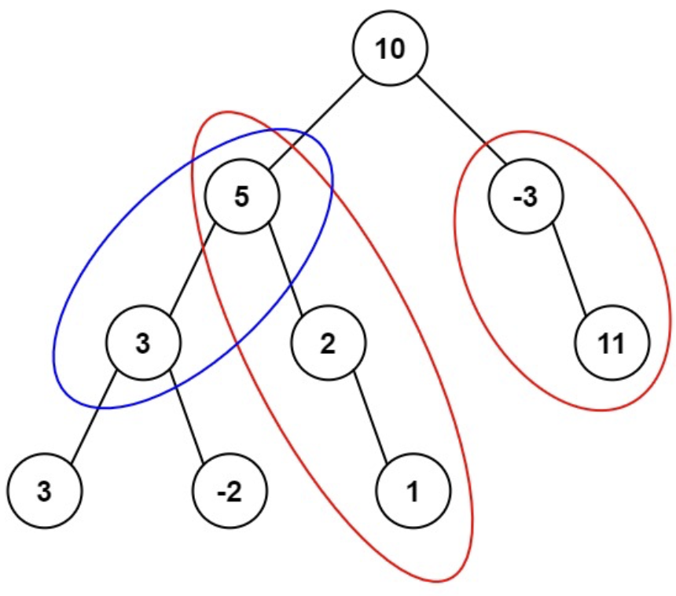

**思路**

- 参考数组中求目标总和子数组的解法。使用前缀和+哈希表。
- 回溯的时候记得删除当前节点的访问信息。

**代码**

```java
class Solution {
    Map<Long, Integer> map = new HashMap<>();
    int ans = 0;

    void dfs(TreeNode node, long sum, int targetSum) {
        if (node == null) {
            return;
        }
        sum += node.val;
        ans += map.getOrDefault(sum - targetSum, 0);
        map.put(sum, map.getOrDefault(sum, 0) + 1);
        dfs(node.left, sum, targetSum);
        dfs(node.right, sum, targetSum);
        map.put(sum, map.get(sum) - 1);
    }

    public int pathSum(TreeNode root, int targetSum) {
        map.put(0L, 1);
        dfs(root, 0, targetSum);
        return ans;
    }
}
```

### 完全二叉树的节点个数 ⭐️⭐️⭐️

给你一棵 完全二叉树 的根节点 `root` ，求出该树的节点个数。

完全二叉树
的定义如下：在完全二叉树中，除了最底层节点可能没填满外，其余每层节点数都达到最大值，并且最下面一层的节点都集中在该层最左边的若干位置。若最底层为第 `h`
层，则该层包含 `1~ 2h` 个节点。

**示例**

- 输入：root = [1,2,3,4,5,6]
- 输出：6

**思路**

- 比较左子树和右子树的深度（向左子树不断深入统计深度）。
- 如果深度相同，说明左子树是满二叉树，返回 `右子树数量 + 2 ^ 左子树深度` (`1 << left`)
- 如果深度不相同，说明右子树是满二叉树，返回 `左子树数量 + 2 ^ 右子树深度` (`1 << right`)

**代码**

```java
class Solution {
    int depth(TreeNode node) {
        int cnt = 0;
        while (node != null) {
            node = node.left;
            cnt++;
        }
        return cnt;
    }

    int count(TreeNode node) {
        if (node == null) {
            return 0;
        }
        int left = depth(node.left);
        int right = depth(node.right);
        return left == right ?
                (1 << left) + count(node.right) :
                (1 << right) + count(node.left);
    }

    public int countNodes(TreeNode root) {
        return count(root);
    }
}
```

### 修改后子树的大小 ⭐️⭐️⭐️

给你一棵 `n` 个节点且根节点为编号 `0` 的树，节点编号为 `0` 到 `n - 1` 。这棵树用一个长度为 `n` 的数组 `parent`
表示，其中 `parent[i]` 是第
`i` 个节点的父亲节点的编号。由于节点 `0` 是根，`parent[0] == -1` 。

给你一个长度为 `n` 的字符串 `s` ，其中 `s[i]` 是节点 `i` 对应的字符。

对于节点编号从 `1` 到 `n - 1` 的每个节点 `x` ，我们 同时 执行以下操作 一次 ：

- 找到距离节点 `x` 最近 的祖先节点 `y` ，且 `s[x] == s[y]` 。
- 如果节点 `y` 不存在，那么不做任何修改。
- 否则，将节点 `x` 与它父亲节点之间的边 删除 ，在 `x` 与 `y` 之间连接一条边，使 `y` 变为 `x` 新的父节点。

请你返回一个长度为 `n` 的数组 `answer` ，其中 `answer[i]` 是 最终 树中，节点 `i` 为根的子树的 大小 。

一个 子树 `subtree` 指的是节点 `subtree` 和它所有的后代节点。

**示例**

- 输入：parent = [-1,0,4,0,1], s = "abbba"
- 输出：[5,2,1,1,1]
- 解释： 以下变化会同时发生：
    - 节点 4 的父节点从节点 1 变为节点 0 。
    - 节点 2 的父节点从节点 4 变为节点 1 。

**思路**

- 对于编号从 `1` 到 `n - 1` 的节点，迭代向上找到最近的相同字符的祖先节点。然后更新父节点。
- 对于每个节点，向根结点回溯，统计路径上以每个节点为根结点的子树大小。
- 需要注意的是，因为是 **同时**，因此需要写时复制，在 `parent` 的副本上进行更改。

**代码**

```java
class Solution {
    public int[] findSubtreeSizes(int[] parent, String s) {
        char[] strs = s.toCharArray();
        int n = parent.length;
        // 创建副本
        int[] newParent = parent.clone();
        for (int i = 1; i < n; i++) {
            int node = parent[i];
            while (node != -1 && strs[node] != strs[i]) {
                node = parent[node];
            }
            if (node == -1) {
                continue;
            }
            newParent[i] = node;
        }
        // 统计
        int[] ans = new int[n];
        for (int i = 0; i < n; i++) {
            int node = i;
            while (node != -1) {
                ans[node]++;
                node = newParent[node];
            }
        }
        return ans;
    }
}
```

## 7.2 二叉树广度优先遍历（BFS）

### 二叉树的层序遍历 ⭐️

给你二叉树的根节点 `root` ，返回其节点值的 层序遍历 。 （即逐层地，从左到右访问所有节点）。

**示例**

- 输入：root = [3,9,20,null,null,15,7]
- 输出：[[3],[9,20],[15,7]]
- 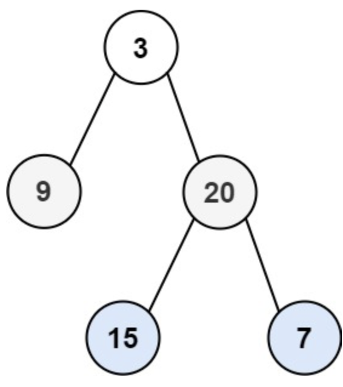

**思路**

- 广度优先搜索，使用队列扩展二叉树节点。
- 一个大循环访问和扩展一层的节点（即当前队列里的所有节点）。

**代码**

```java
class Solution {
    public List<List<Integer>> levelOrder(TreeNode root) {
        if (root == null) {
            return new ArrayList<>();
        }
        List<List<Integer>> ans = new ArrayList<>();
        Queue<TreeNode> queue = new LinkedList<>();

        queue.add(root);
        while (!queue.isEmpty()) {
            List<Integer> level = new ArrayList<>();
            int size = queue.size();
            for (int i = 0; i < size; i++) {
                TreeNode top = queue.poll();
                level.add(top.val);
                if (top.left != null) {
                    queue.add(top.left);
                }
                if (top.right != null) {
                    queue.add(top.right);
                }
            }
            ans.add(level);
        }
        return ans;
    }
}
```

### 二叉树的右视图 ⭐️

给定一个二叉树的 根节点 `root`，想象自己站在它的右侧，按照从顶部到底部的顺序，返回从右侧所能看到的节点值。

**示例**

- 输入: [1,2,3,null,5,null,4]
- 输出: [1,3,4]
- 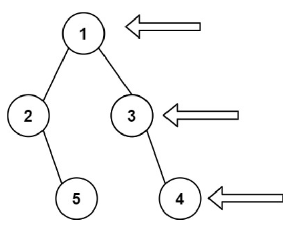

**思路**

- 广度优先搜索，遍历每一层，输出每一层最后一个节点的值。

**代码**

```java
class Solution {
    public List<Integer> rightSideView(TreeNode root) {
        if (root == null) {
            return new ArrayList<>();
        }
        Queue<TreeNode> queue = new LinkedList<>();
        List<Integer> ans = new ArrayList<>();

        queue.add(root);
        while (!queue.isEmpty()) {
            int size = queue.size();
            for (int i = 0; i < size; i++) {
                TreeNode top = queue.poll();
                if (i == size - 1) {
                    ans.add(top.val);
                }
                if (top.left != null) {
                    queue.add(top.left);
                }
                if (top.right != null) {
                    queue.add(top.right);
                }

            }
        }
        return ans;
    }
}
```

### 填充每个节点的下一个右侧节点指针 II ⭐️⭐️

给定一个二叉树：

```
struct Node {
  int val;
  Node *left;
  Node *right;
  Node *next;
}
```

填充它的每个 `next` 指针，让这个指针指向其下一个右侧节点。如果找不到下一个右侧节点，则将 `next` 指针设置为 `NULL` 。

初始状态下，所有 `next` 指针都被设置为 `NULL` 。

**示例**

- 输入：root = [1,2,3,4,5,null,7]
- 输出：[1,#,2,3,#,4,5,7,#]
- 解释：给定二叉树如图 A 所示，你的函数应该填充它的每个 next 指针，以指向其下一个右侧节点，如图 B 所示。序列化输出按层序遍历顺序（由
  next 指针连接），'#' 表示每层的末尾。
- 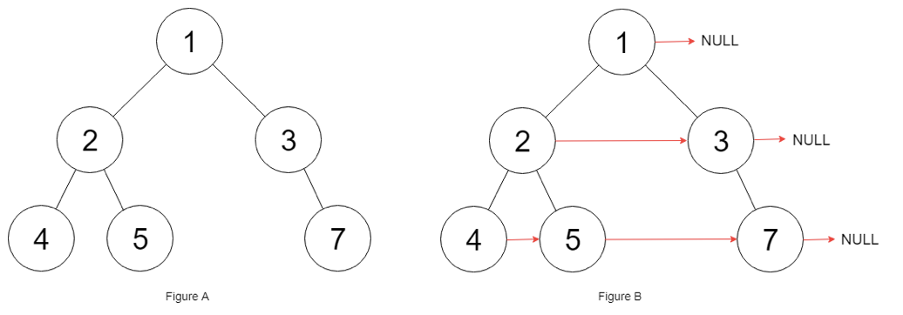

**思路**

- 广度优先搜索。一层一层操作。

**代码**

```java
class Solution {
    public Node connect(Node root) {
        if (root == null) {
            return null;
        }
        Queue<Node> queue = new LinkedList<>();
        queue.add(root);
        while (!queue.isEmpty()) {
            int size = queue.size();
            Node pre = null;
            for (int i = 0; i < size; i++) {
                Node node = queue.poll();
                if (node.left != null) {
                    queue.add(node.left);
                }
                if (node.right != null) {
                    queue.add(node.right);
                }
                if (i > 0) {
                    pre.next = node;
                }
                pre = node;
            }
            pre.next = null;
        }
        return root;
    }
}
```

### 二叉树的层平均值 ⭐️⭐️

给定一个非空二叉树的根节点 `root` , 以数组的形式返回每一层节点的平均值。与实际答案相差 `10-5` 以内的答案可以被接受。

**示例**

- 输入：root = [3,9,20,null,null,15,7]
- 输出：[3.00000,14.50000,11.00000]
- 解释：第 0 层的平均值为 3,第 1 层的平均值为 14.5,第 2 层的平均值为 11 。因此返回 [3, 14.5, 11] 。

**思路**

- 广度优先统计每层节点即可。

**代码**

```java
class Solution {
    public List<Double> averageOfLevels(TreeNode root) {
        Queue<TreeNode> queue = new LinkedList<>();
        List<Double> ans = new ArrayList<>();
        queue.add(root);
        while (!queue.isEmpty()) {
            int size = queue.size();
            double sum = 0;
            for (int i = 0; i < size; i++) {
                TreeNode top = queue.poll();
                sum += top.val;
                if (top.left != null) {
                    queue.add(top.left);
                }
                if (top.right != null) {
                    queue.add(top.right);
                }
            }
            ans.add(sum / size);
        }
        return ans;
    }
}
```

### 二叉树的锯齿形层序遍历 ⭐️⭐️⭐️

给你二叉树的根节点 `root` ，返回其节点值的 锯齿形层序遍历 。（即先从左往右，再从右往左进行下一层遍历，以此类推，层与层之间交替进行）。

**示例**

- 输入：root = [3,9,20,null,null,15,7]
- 输出：\[[3],[20,9],[15,7]]
- 

**思路**

- 队列换成双向队列。
- 如果从左到右，则从双向队列队头取元素，先扩展左子结点、再扩展右子节点到队尾。
- 如果从右到左，则从双向队列队尾取元素，先扩展右子节点、再扩展左子结点到队头。

**代码**

```java
class Solution {
    public List<List<Integer>> zigzagLevelOrder(TreeNode root) {
        Deque<TreeNode> deque = new LinkedList<>();
        List<List<Integer>> ans = new ArrayList<>();
        if (root == null) {
            return ans;
        }
        deque.add(root);
        boolean leftToRight = true;
        while (!deque.isEmpty()) {
            int size = deque.size();
            List<Integer> res = new ArrayList<>();
            for (int i = 0; i < size; i++) {
                // 从左到右，队头拿，队尾放，先左后右。
                if (leftToRight) {
                    TreeNode node = deque.pollFirst();
                    res.add(node.val);
                    if (node.left != null) {
                        deque.addLast(node.left);
                    }
                    if (node.right != null) {
                        deque.addLast(node.right);
                    }
                } 
                // 从右到左，队尾拿，队头放，先右后左。
                else {
                    TreeNode node = deque.pollLast();
                    res.add(node.val);
                    if (node.right != null) {
                        deque.addFirst(node.right);
                    }
                    if (node.left != null) {
                        deque.addFirst(node.left);
                    }
                }
            }
            ans.add(res);
            leftToRight = !leftToRight;
        }
        return ans;
    }
}
```

## 7.3 二叉搜索树

### 二叉搜索树中第 K 小的元素 ⭐️

给定一个二叉搜索树的根节点 `root` ，和一个整数 `k`，请你设计一个算法查找其中第 `k` 小的元素（从 1 开始计数）。

**示例**

- 输入：root = [3,1,4,null,2], k = 1
- 输出：1

**思路**

- 中序遍历到第 `k` 个节点即可。

**代码**

```java
class Solution {
    int index = 0;
    TreeNode ans = null;

    void visit(TreeNode node, int k) {
        if (node == null) {
            return;
        }
        visit(node.left, k);
        index++;
        if (k == index) {
            ans = node;
            return;
        }
        visit(node.right, k);
    }

    public int kthSmallest(TreeNode root, int k) {
        visit(root, k);
        return ans.val;
    }
}
```

### 二叉搜索树的最小绝对差 ⭐️

给你一个二叉搜索树的根节点 `root` ，返回 树中任意两不同节点值之间的最小差值 。差值是一个正数，其数值等于两值之差的绝对值。

**示例**

- 输入：root = [4,2,6,1,3]
- 输出：1

**思路**

- 中序遍历，不断比较相邻值的差值即可。

**代码**

```java
class Solution {
    long pre = Integer.MIN_VALUE;
    long ans = Integer.MAX_VALUE;

    void dfs(TreeNode node) {
        if (node == null) {
            return;
        }
        dfs(node.left);
        ans = Math.min(ans, node.val - pre);
        pre = node.val;
        dfs(node.right);
    }

    public int getMinimumDifference(TreeNode root) {
        dfs(root);
        return (int) ans;
    }
}
```

### 二叉搜索树迭代器 ⭐️⭐️

实现一个二叉搜索树迭代器类 `BSTIterator` ，表示一个按中序遍历二叉搜索树（BST）的迭代器：

- `BSTIterator(TreeNode root)` 初始化 `BSTIterator` 类的一个对象。BST 的根节点 `root` 会作为构造函数的一部分给出。指针应初始化为一个不存在于
  BST 中的数字，且该数字小于 BST 中的任何元素。
- `boolean hasNext()` 如果向指针右侧遍历存在数字，则返回 `true` ；否则返回 `false` 。
- `int next()` 将指针向右移动，然后返回指针处的数字。

注意，指针初始化为一个不存在于 BST 中的数字，所以对 `next()` 的首次调用将返回 BST 中的最小元素。

你可以假设 `next()` 调用总是有效的，也就是说，当调用 `next()` 时，BST 的中序遍历中至少存在一个下一个数字。

**示例**

- 输入
  ["BSTIterator", "next", "next", "hasNext", "next", "hasNext", "next", "hasNext", "next", "hasNext"]
- \[\[[7, 3, 15, null, null, 9, 20]], [], [], [], [], [], [], [], [], []]
- 输出
  [null, 3, 7, true, 9, true, 15, true, 20, false]
- 解释
    - BSTIterator bSTIterator = new BSTIterator([7, 3, 15, null, null, 9, 20]);
    - bSTIterator.next(); // 返回 3
    - bSTIterator.next(); // 返回 7
    - bSTIterator.hasNext(); // 返回 True
    - bSTIterator.next(); // 返回 9
    - bSTIterator.hasNext(); // 返回 True
    - bSTIterator.next(); // 返回 15
    - bSTIterator.hasNext(); // 返回 True
    - bSTIterator.next(); // 返回 20
    - bSTIterator.hasNext(); // 返回 False

**思路**

- 初始化时中序遍历二叉树，并将遍历结果加入列表。
- 使用当前下标 `index` 维护当前迭代到的元素。

**代码**

```java
class BSTIterator {
    List<Integer> list;
    int index;

    public BSTIterator(TreeNode root) {
        index = 0;
        list = new ArrayList<>();
        dfs(root);
    }

    public void dfs(TreeNode node) {
        if (node == null) {
            return;
        }
        dfs(node.left);
        list.add(node.val);
        dfs(node.right);
    }

    public int next() {
        return list.get(index++);
    }

    public boolean hasNext() {
        return index < list.size();
    }
}
```

### 删除二叉搜索树中的节点 ⭐️⭐️⭐️⭐️

给定一个二叉搜索树的根节点 `root` 和一个值 `key`，删除二叉搜索树中的 `key` 对应的节点，并保证二叉搜索树的性质不变。返回二叉搜索树（有可能被更新）的根节点的引用。

一般来说，删除节点可分为两个步骤：

首先找到需要删除的节点；
如果找到了，删除它。

**示例**

- 输入：root = [5,3,6,2,4,null,7], key = 3
- 输出：[5,4,6,2,null,null,7]
- 解释：给定需要删除的节点值是 3，所以我们首先找到 3 这个节点，然后删除它。
  一个正确的答案是 [5,4,6,2,null,null,7], 如下图所示。
  另一个正确答案是 [5,2,6,null,4,null,7]。

**思路**

- 删除节点有三种情况：
    - 节点是叶子节点，直接删除。
    - 节点只有一个子节点，用子节点替换当前节点。
    - 节点有两个子节点，找到右子树的最小节点（中序后继）替换当前节点，然后删除右子树的最小节点。

**代码**

```java
class Solution {
    // dfs: 删除 node 子树中的目标节点，返回删除后的子树根节点
    TreeNode dfs(TreeNode node, int key) {
        if (node == null) {
            return null;
        }
        if (key < node.val) {
            node.left = dfs(node.left, key);
        } else if (key > node.val) {
            node.right = dfs(node.right, key);
        } else {
            // 有一个子节点
            if (node.left == null) {
                return node.right;
            } else if (node.right == null) {
                return node.left;
            } 
            // 有两个子节点
            else {
                // pre 指向中序后继
                TreeNode pre = node.right;
                while (pre.left != null) {
                    pre = pre.left;
                }
                // 代替
                node.val = pre.val;
                // 删掉中序后继节点
                node.right = dfs(node.right, pre.val);
            }
        }
        return node;
    }

    public TreeNode deleteNode(TreeNode root, int key) {
        return dfs(root, key);
    }
}
```

## 7.4 二叉树构造

### 将有序数组转换为二叉搜索树 ⭐️⭐️

给你一个整数数组 `nums` ，其中元素已经按 升序 排列，请你将其转换为一棵平衡二叉搜索树。

**示例**

- 输入：nums = [-10,-3,0,5,9]
- 输出：[0,-3,9,-10,null,5]
- 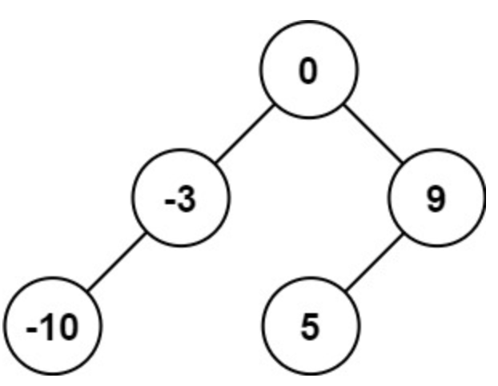
- 解释：[0,-10,5,null,-3,null,9] 也将被视为正确答案：
- 

**思路**

- 给定中序遍历序列，构造出一个平衡二叉搜索树。
- 对于中序遍历序列，可以：
    - 总是选择中间位置左边的数字作为根节点。
    - 选择中间位置右边的数字作为根节点。
    - 选择任意一个中间位置数字作为根节点。

**代码**

```java
class Solution {
    TreeNode buildTree(int[] nums, int left, int right) {
        if (left >= right) {
            return null;
        }
        int mid = (left + right) / 2;
        TreeNode leftTree = buildTree(nums, left, mid);
        TreeNode rightTree = buildTree(nums, mid + 1, right);
        return new TreeNode(nums[mid], leftTree, rightTree);
    }

    public TreeNode sortedArrayToBST(int[] nums) {
        return buildTree(nums, 0, nums.length);
    }
}
```

### 从前序与中序遍历序列构造二叉树 ⭐️⭐️⭐️

给定两个整数数组 `preorder` 和 `inorder` ，其中 `preorder` 是二叉树的先序遍历， `inorder` 是同一棵树的中序遍历，请构造二叉树并返回其根节点。

**示例**

- 输入: preorder` = [3,9,20,15,7], inorder = [9,3,15,20,7]
- 输出: [3,9,20,null,null,15,7]
- 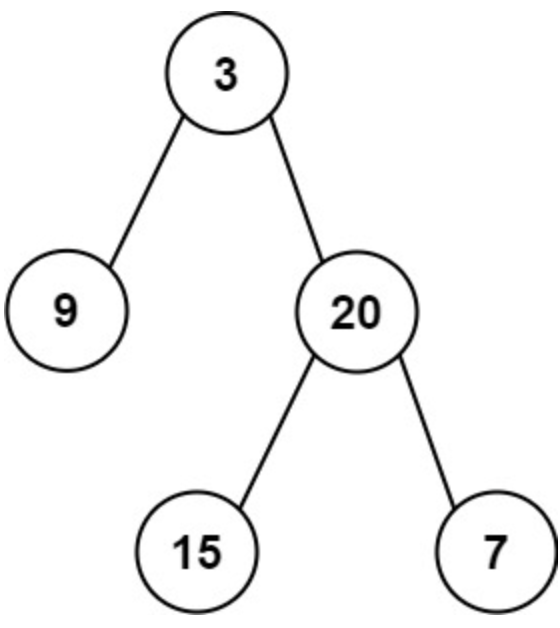

**思路**

- 从 `preorder` 的第一个元素开始，找到其在 `inorder` 中的位置，进行左右二分递归。
- 使用全局变量 `preIndex` 控制 `preorder` 元素的遍历。
- 使用哈希表 `inPos` 建立 `inorder` 中元素值与元素位置的映射，降低查找位置的开销。

**代码**

```java
class Solution {
    int index = 0;
    Map<Integer, Integer> pos = new HashMap<>();

    TreeNode build(int[] preorder, int[] inorder, int left, int right) {
        if (left >= right) {
            return null;
        }
        int mid = pos.get(preorder[index++]);
        TreeNode leftTree = build(preorder, inorder, left, mid);
        TreeNode rightTree = build(preorder, inorder, mid + 1, right);
        return new TreeNode(inorder[mid], leftTree, rightTree);
    }

    public TreeNode buildTree(int[] preorder, int[] inorder) {
        for (int i = 0; i < inorder.length; i++) {
            pos.put(inorder[i], i);
        }
        return build(preorder, inorder, 0, preorder.length);
    }
}
```

### 从中序与后序遍历序列构造二叉树 ⭐️⭐️⭐️

给定两个整数数组 `inorder` 和 `postorder` ，其中 `inorder` 是二叉树的中序遍历， `postorder` 是同一棵树的后序遍历，请你构造并返回这颗
二叉树 。

**示例**

- 输入：inorder = [9,3,15,20,7], postorder = [9,15,7,20,3]
- 输出：[3,9,20,null,null,15,7]
- 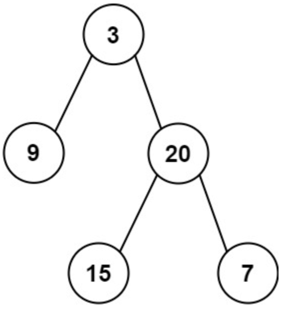

**思路**

- 与**从前序与中序遍历序列构造二叉树**类似。其中对于后序序列的遍历需要从后开始，并且需要先构造右子树，再构造左子树。

**代码**

```java
class Solution {
    int index;
    Map<Integer, Integer> pos = new HashMap<>();

    TreeNode build(int[] postorder, int[] inorder, int left, int right) {
        if (left >= right) {
            return null;
        }
        int mid = pos.get(postorder[index--]);
        TreeNode rightTree = build(postorder, inorder, mid + 1, right);
        TreeNode leftTree = build(postorder, inorder, left, mid);
        return new TreeNode(inorder[mid], leftTree, rightTree);
    }

    public TreeNode buildTree(int[] inorder, int[] postorder) {
        index = postorder.length - 1;
        for (int i = 0; i < inorder.length; i++) {
            pos.put(inorder[i], i);
        }
        return build(postorder, inorder, 0, postorder.length);
    }
}
```

### 二叉树展开为链表 ⭐️⭐️⭐️⭐️

- 给你二叉树的根结点 `root` ，请你将它展开为一个单链表：
- 展开后的单链表应该同样使用 `TreeNode` ，其中 `right` 子指针指向链表中下一个结点，而左子指针始终为 `null` 。
- 展开后的单链表应该与二叉树 先序遍历 顺序相同。

**示例**

- 输入：root = [1,2,5,3,4,null,6]
- 输出：[1,null,2,null,3,null,4,null,5,null,6]
- 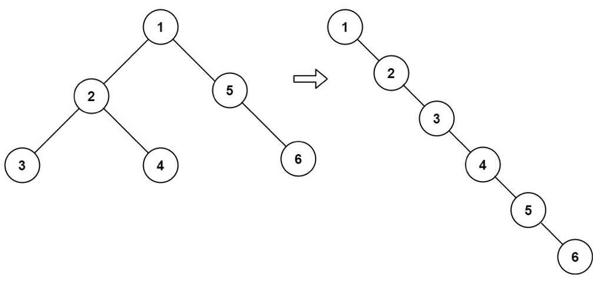

**思路**

- 常规思路：先序遍历一遍并存储为节点列表，然后串联成一个链表。
- 原地算法：
    - 对于当前节点，如果其左子节点不为空，则在其左子树中找到最右边的节点，作为前驱节点。
    - 将当前节点的右子节点赋给前驱节点的右子节点，然后将当前节点的左子节点赋给当前节点的右子节点，并将当前节点的左子节点设为空。
    - 对当前节点处理结束后，继续处理链表中的下一个节点，直到所有节点都处理结束。
      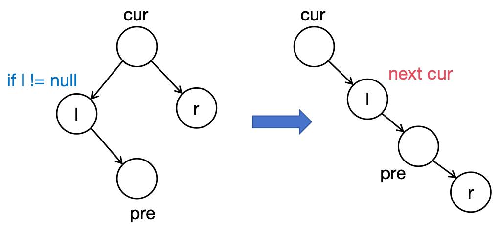

**代码**

```java
class Solution {
    public void flatten(TreeNode root) {
        TreeNode cur = root;
        while (cur != null) {
            //如果当前子树不为空再需要变换，否则一路向右
            if (cur.left != null) {
                //pre寻找左子树最右边一个节点
                TreeNode pre = cur.left;
                while (pre.right != null) {
                    pre = pre.right;
                }
                //pre与右子树对接
                pre.right = cur.right;
                //调整链表
                cur.right = cur.left;
                cur.left = null;
            }
            cur = cur.right;
        }
    }
}
```


