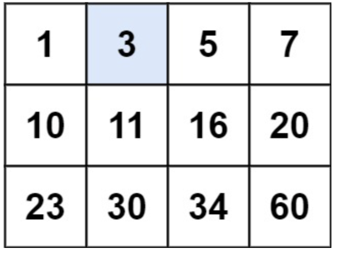
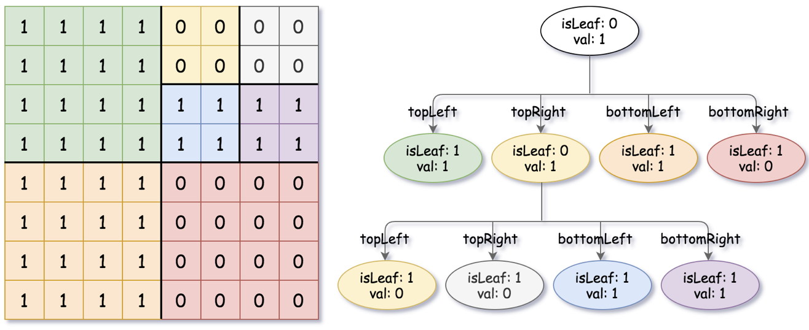

# 十一、二分查找

## 11.1 有序数组二分查找

### 搜索插入位置 ⭐️

给定一个排序数组和一个目标值，在数组中找到目标值，并返回其索引。如果目标值不存在于数组中，返回它将会被按顺序插入的位置。

请必须使用时间复杂度为 `O(log n)` 的算法。

**示例**

- 输入: nums = [1,3,5,6], target = 5
- 输出: 2

**思路**

- 调用 API `Arrays.binarySearch()`，如果不存在，该方法将返回 `-插入位置-1`。
- 自行实现。对 `[low,high]` 范围进行二分查找。如果不存在，则 `low` 为待插入位置。（记住这个二分模板）

**代码**

```java
class Solution {
    public int searchInsert(int[] nums, int target) {
        int low = 0;
        int high = nums.length - 1;

        while (low <= high) {
            int mid = (low + high) / 2;
            if (nums[mid] == target) {
                return mid;
            } else if (nums[mid] > target) {
                high = mid - 1;
            } else {
                low = mid + 1;
            }
        }
        return low;
    }
}
```

### 搜索二维矩阵 ⭐️⭐️

给你一个满足下述两条属性的 `m x n` 整数矩阵：

每行中的整数从左到右按非严格递增顺序排列。
每行的第一个整数大于前一行的最后一个整数。
给你一个整数 `target` ，如果 `target` 在矩阵中，返回 `true`；否则，返回 `false` 。

**示例**

- 输入：matrix = \[[1,3,5,7],[10,11,16,20],[23,30,34,60]], target = 3
- 输出：true
- 

**思路**

- **请务必与 6.4 区分**。那个是右上到左下逐步缩窄搜索范围。
- 先二分查找行（注意判断边界条件），再二分查找列。

**代码**

```java
class Solution {
    public boolean searchMatrix(int[][] matrix, int target) {
        int n = matrix.length;
        int m = matrix[0].length;
        // 先二分查找行
        int low = 0;
        int high = n - 1;
        while (low <= high) {
            int midX = (low + high) / 2;
            if (matrix[midX][0] == target) {
                return true;
            } else if (matrix[midX][0] > target) {
                high = midX - 1;
            } else {
                low = midX + 1;
            }
        }
        int row = low - 1;
        if (row < 0) {
            return false;
        }
        // 再二分查找列
        low = 0;
        high = m - 1;
        while (low <= high) {
            int midY = (low + high) / 2;
            if (matrix[row][midY] == target) {
                return true;
            } else if (matrix[row][midY] > target) {
                high = midY - 1;
            } else {
                low = midY + 1;
            }
        }
        return false;
    }
}
```

### 在排序数组中查找元素的第一个和最后一个位置 ⭐️⭐️

给你一个按照非递减顺序排列的整数数组 `nums`，和一个目标值 `target`。请你找出给定目标值在数组中的开始位置和结束位置。

如果数组中不存在目标值 `target`，返回 `[-1, -1]`。

你必须设计并实现时间复杂度为 `O(log n)` 的算法解决此问题。

**示例**

- 输入：nums = [5,7,7,8,8,10], target = 8
- 输出：[3,4]

**思路**

- 两次二分查找。
- 第一次，当找到 `target` 时，将 `[low,high]` 向左收窄，以找到 `target` 第一次出现的位置。
- 第二次，当找到 `target` 时，将 `[low,high]` 向右收窄，以找到 `target` 最后一次出现的位置。

**代码**

```java
class Solution {
    public int[] searchRange(int[] nums, int target) {
        int low = 0;
        int high = nums.length - 1;
        int first = -1;
        while (low <= high) {
            int mid = (low + high) / 2;
            if (nums[mid] == target) {
                first = mid;
                high = mid - 1; // 如果找到，向左收窄范围
            } else if (nums[mid] > target) {
                high = mid - 1;
            } else {
                low = mid + 1;
            }
        }
        low = 0;
        high = nums.length - 1;
        int last = -1;
        while (low <= high) {
            int mid = (low + high) / 2;
            if (nums[mid] == target) {
                last = mid;
                low = mid + 1; // 如果找到，向右收窄边界
            } else if (nums[mid] > target) {
                high = mid - 1;
            } else {
                low = mid + 1;
            }
        }
        return new int[]{first, last};
    }
}
```

### 寻找两个正序数组的中位数 ⭐️⭐️⭐️⭐️⭐️

给定两个大小分别为 `m` 和 `n` 的正序（从小到大）数组 `nums1` 和 `nums2`。请你找出并返回这两个正序数组的 中位数 。

算法的时间复杂度应该为 `O(log (m+n))` 。

**示例**

- 输入：nums1 = [1,3], nums2 = [2]
- 输出：2.00000
- 解释：合并数组 = [1,2,3] ，中位数 2

**思路**

- 设 `nums1` 是长度较小的数组。
- 在 `nums1` 中二分查找到划分点 `mid1`，此时 `nums2` 对应划分点 `mid2=(m+n+1)/2 - mid1`，使得 `nums1 U nums2`
  在两个划分点之前的数比划分点之后的数小。
- 如果合并后数组长度为奇数，取 `nums1 U nums2`
  在两个划分点之前的最大值作为中位数；如果合并后数组长度为偶数，取 `nums1 U nums2` 在两个划分点之前的最大值与两个划分点之后的最小值的平均值作为中位数。

**代码**

```java
class Solution {
    public double findMedianSortedArrays(int[] nums1, int[] nums2) {
        if (nums1.length > nums2.length) {
            return findMedianSortedArrays(nums2, nums1);
        }
        int m = nums1.length;
        int n = nums2.length;
        // 合并后数组的半长，向上取整
        int k = (m + n + 1) / 2;

        // nums1: [0,mid1), [mid1,m)
        // nums2: [0,mid2), [mid2,n)
        int low = 0;
        int high = m;   // 注意这里 mid1 是可以取到 m 的
        while (low <= high) {
            int mid1 = (low + high) / 2;
            int mid2 = k - mid1;
            // 如果nums1左边最大值要比nums2右边最小值还要大，向左搜索
            if (mid1 > 0 && nums1[mid1 - 1] > nums2[mid2]) {
                high = mid1 - 1;
            }
            // 如果nums1右边最小值要比nums2左边最大值还要小，向右搜索
            else if (mid1 < m && nums1[mid1] < nums2[mid2 - 1]) {
                low = mid1 + 1;
            }
            // 找到合适的 mid1 和 mid2
            else {
                double nums1LeftMax = mid1 == 0 ? Integer.MIN_VALUE : nums1[mid1 - 1];
                double nums1RightMin = mid1 == m ? Integer.MAX_VALUE : nums1[mid1];
                double nums2LeftMax = mid2 == 0 ? Integer.MIN_VALUE : nums2[mid2 - 1];
                double nums2RightMin = mid2 == n ? Integer.MAX_VALUE : nums2[mid2];
                if ((m + n) % 2 == 0) {
                    return (Math.max(nums1LeftMax, nums2LeftMax) + Math.min(nums1RightMin, nums2RightMin)) / 2.0;
                } else {
                    return Math.max(nums1LeftMax, nums2LeftMax);
                }
            }
        }
        return -1;
    }
}
```

### 寻找右区间 ⭐⭐

给你一个区间数组 `intervals` ，其中 `intervals[i] = [starti, endi]` ，且每个 `starti` 都 不同 。

区间 `i` 的 右侧区间 可以记作区间 `j` ，并满足 `startj >= endi` ，且 `startj` 最小化 。注意 `i` 可能等于 `j` 。

返回一个由每个区间 `i` 的 右侧区间 在 `intervals` 中对应下标组成的数组。如果某个区间 `i` 不存在对应的 右侧区间
，则下标 `i` 处的值设为 `-1` 。

**示例**

- 输入：intervals = [[3,4],[2,3],[1,2]]
- 输出：[-1,0,1]
- 解释：
    - 对于 [3,4] ，没有满足条件的“右侧”区间。
    - 对于 [2,3] ，区间[3,4]具有最小的“右”起点;
    - 对于 [1,2] ，区间[2,3]具有最小的“右”起点。

**思路**

- 先将原数组复制后排序，然后对每个区间二分查找右侧区间。
- 使用哈希表做开始时间到原始数组下标的映射。

**代码**

```java
class Solution {
    int binarySearch(int[][] sortedIntervals, int target) {
        int low = 0;
        int high = sortedIntervals.length - 1;
        while (low <= high) {
            int mid = (low + high) / 2;
            if (sortedIntervals[mid][0] < target) {
                low = mid + 1;
            } else {
                high = mid - 1;
            }
        }
        return low;
    }

    public int[] findRightInterval(int[][] intervals) {
        int n = intervals.length;
        Map<Integer, Integer> pos = new HashMap<>();
        for (int i = 0; i < n; i++) {
            pos.put(intervals[i][0], i);
        }
        int[][] sortedIntervals = new int[n][2];
        System.arraycopy(intervals, 0, sortedIntervals, 0, n);
        Arrays.sort(sortedIntervals, (a, b) -> a[0] - b[0]);
        int[] ans = new int[n];
        for (int i = 0; i < n; i++) {
            int targetIndex = binarySearch(sortedIntervals, intervals[i][1]);
            if (targetIndex < 0 || targetIndex >= n) {
                ans[i] = -1;
            } else {
                ans[i] = pos.get(sortedIntervals[targetIndex][0]);
            }
        }
        return ans;
    }
}
```

## 11.2 数值区间二分查找

当问题的解存在上下界时，可以使用二分查找搜索解。对于每一个可能的解，判断是否满足条件。

### 完成旅途的最少时间 ⭐⭐⭐

给你一个数组 `time` ，其中 `time[i]` 表示第 `i` 辆公交车完成 一趟旅途 所需要花费的时间。

每辆公交车可以 连续 完成多趟旅途，也就是说，一辆公交车当前旅途完成后，可以 立马开始 下一趟旅途。每辆公交车 独立
运行，也就是说可以同时有多辆公交车在运行且互不影响。

给你一个整数 `totalTrips` ，表示所有公交车 总共 需要完成的旅途数目。请你返回完成 至少 `totalTrips` 趟旅途需要花费的 最少
时间。

**示例**

- 输入：time = [1,2,3], totalTrips = 5
- 输出：3
- 解释：
    - 时刻 t = 1 ，每辆公交车完成的旅途数分别为 [1,0,0] 。
      已完成的总旅途数为 1 + 0 + 0 = 1 。
    - 时刻 t = 2 ，每辆公交车完成的旅途数分别为 [2,1,0] 。
      已完成的总旅途数为 2 + 1 + 0 = 3 。
    - 时刻 t = 3 ，每辆公交车完成的旅途数分别为 [3,1,1] 。
      已完成的总旅途数为 3 + 1 + 1 = 5 。
      所以总共完成至少 5 趟旅途的最少时间为 3 。

**思路**

- 因为 `1 <= time[i], totalTrips <= 1e7` ，因此二分查找时间区间 `[1,1e14]`。
- 对于每一个可能的时间 `t`，计算完成旅途数目，判断是否满足条件。

**代码**

```java
class Solution {
    boolean check(int[] time, int totalTrips, long t) {
        long ans = 0;
        for (int j : time) {
            ans += t / j;
            if (ans >= totalTrips) {
                return true;
            }
        }
        return false;
    }

    public long minimumTime(int[] time, int totalTrips) {
        long low = 1;
        long high = (long) 1e14;
        while (low <= high) {
            long mid = (low + high) / 2;
            if (check(time, totalTrips, mid)) {
                high = mid - 1;
            } else {
                low = mid + 1;
            }
        }
        return low;
    }
}
```

### 准时到达的列车最小时速 ⭐⭐⭐

给你一个浮点数 `hour` ，表示你到达办公室可用的总通勤时间。要到达办公室，你必须按给定次序乘坐 `n`
趟列车。另给你一个长度为 `n`
的整数数组 `dist` ，其中 `dist[i]` 表示第 `i` 趟列车的行驶距离（单位是千米）。

每趟列车均只能在整点发车，所以你可能需要在两趟列车之间等待一段时间。

例如，第 1 趟列车需要 1.5 小时，那你必须再等待 0.5 小时，搭乘在第 2 小时发车的第 2 趟列车。
返回能满足你准时到达办公室所要求全部列车的 最小正整数 时速（单位：千米每小时），如果无法准时到达，则返回 -1 。

生成的测试用例保证答案不超过 107 ，且 `hour` 的 小数点后最多存在两位数字 。

**示例**

- 输入：dist = [1,3,2], hour = 2.7
- 输出：3
- 解释：速度为 3 时：
    - 第 1 趟列车运行需要 1/3 = 0.33333 小时。
    - 由于不是在整数时间到达，故需要等待至第 1 小时才能搭乘列车。第 2 趟列车运行需要 3/3 = 1 小时。
    - 由于是在整数时间到达，可以立即换乘在第 2 小时发车的列车。第 3 趟列车运行需要 2/3 = 0.66667 小时。
    - 你将会在第 2.66667 小时到达。

**思路**

- 二分查找速度区间 `[1,1e7]`。
- 对于每一个可能的速度 `v`，计算到达办公室所需时间，判断是否满足条件。
- 到达办公室所需时间为:
    - 前 `n - 1` 项：`ceil(dist[i] * 1.0 / v)`，
    - 最后一项：`dist[i] * 1.0 / v `

**代码**

```java
class Solution {
    boolean check(int[] dist, double hour, int v) {
        int time = 0;
        for (int i = 0; i < dist.length - 1; i++) {
            time += (int) Math.ceil(dist[i] * 1.0 / v);
            if (time > hour) {
                return false;
            }
        }
        double finalTime = dist[dist.length - 1] * 1.0 / v + time;
        return finalTime <= hour;
    }

    public int minSpeedOnTime(int[] dist, double hour) {
        int min = 1;
        int max = 10000000;
        int low = min;
        int high = max;
        while (low <= high) {
            int mid = (low + high) / 2;
            if (check(dist, hour, mid)) {
                high = mid - 1;
            } else {
                low = mid + 1;
            }
        }
        return low >= min && low <= max ? low : -1;
    }
}
```

### 范围内整数的最大得分 ⭐⭐⭐⭐

给你一个整数数组 `start` 和一个整数 `d`，代表 `n` 个区间 `[start[i], start[i] + d]`。

你需要选择 `n` 个整数，其中第 `i` 个整数必须属于第 `i` 个区间。所选整数的 得分 定义为所选整数两两之间的 最小 绝对差。

返回所选整数的 最大可能得分 。

**示例**

- 输入： start = [2,6,13,13], d = 5
- 输出： 5
- 解释： 可以选择整数 2, 7, 13 和 18 获得最大可能得分，得分为 min(|2 - 7|, |2 - 13|, |2 - 18|, |7 - 13|, |7 - 18|, |13 -
  18|)，等于 5。

**思路**

- 排序数组。
- 二分查找区间`[0, (start[n - 1] + d - start[0]) / (n - 1)]`，对于每一个可能值，使用贪心策略判断能否满足条件。

**代码**

```java
class Solution {
    boolean check(int[] start, int d, long score) {
        long x = Long.MIN_VALUE;
        for (int s : start) {
            // x 必须 >= 区间左端点 s
            x = Math.max(x + score, s);
            // x 超出右边界
            if (x > s + d) {
                return false;
            }
        }
        return true;
    }

    public int maxPossibleScore(int[] start, int d) {
        int n = start.length;
        Arrays.sort(start);
        long low = 0;
        long high = (start[n - 1] + d - start[0]) / (n - 1);
        while (low <= high) {
            long mid = (low + high) / 2;
            if (check(start, d, mid)) {
                low = mid + 1;
            } else {
                high = mid - 1;
            }
        }
        return (int) high;
    }
}
```

### 分割数组的最大值 ⭐️⭐️⭐️⭐️

给定一个非负整数数组 `nums` 和一个整数 `k` ，你需要将这个数组分成 `k` 个非空的连续子数组。

设计一个算法使得这 `k` 个子数组各自和的最大值最小。

**示例**

- 输入：nums = [7,2,5,10,8], k = 2
- 输出：18
- 解释：
  一共有四种方法将 nums 分割为 2 个子数组。
  其中最好的方式是将其分为 [7,2,5] 和 [10,8] 。
  因为此时这两个子数组各自的和的最大值为18，在所有情况中最小。

**思路**

- 动态规划：`dp[i][j]` 表示前 `i` 个元素分成 `j` 个子数组的最大值。
    - 递推公式：`dp[i][j] = min(max(dp[m][j-1], sum[i]-sum[m]))`，其中 `0 <= k < i`。
    - 初始条件：`dp[i][0] = sum[i]`。
- 二分查找: `low` 为数组中的最大值，`high` 为数组和。二分查找 `mid`，判断是否可以分成 `k`
  个子数组。如果可以则向左搜索，以尽量减小最终结果的值，否则向右搜索。

**代码**

二分查找：

```java
class Solution {
    boolean check(int[] nums, int k, int mid) {
        int count = 1;
        int curSum = 0;
        for (int num : nums) {
            if (curSum + num > mid) {
                count++;
                curSum = num;
                if (count > k) {
                    return false;
                }
            } else {
                curSum += num;
            }
        }
        return true;
    }

    public int splitArray(int[] nums, int k) {
        int low = 0;
        int high = 0;
        for (int num : nums) {
            low = Math.max(low, num);
            high += num;
        }
        while (low <= high) {
            int mid = (low + high) / 2;
            if (check(nums, k, mid)) {
                high = mid - 1;
            } else {
                low = mid + 1;
            }
        }
        return low;
    }
}
```

动态规划：

```java
class Solution {
    public int splitArray(int[] nums, int k) {
        int n = nums.length;
        int[] sum = new int[n + 1];
        for (int i = 1; i <= n; i++) {
            sum[i] = sum[i - 1] + nums[i - 1];
        }
        int[][] dp = new int[n + 1][k];
                 
        for (int i = 1; i <= n; i++) {
            dp[i][0] = sum[i];
            for (int j = 1; j < k; j++) {
                dp[i][j] = sum[n];
                for (int m = 0; m < i; m++) {
                    dp[i][j] = Math.min(dp[i][j], Math.max(dp[m][j - 1], sum[i] - sum[m]));
                }
            }
        }
        return dp[n][k - 1];
    }
}
```

### 你可以安排的最多任务数目 ⭐️⭐️⭐️⭐️⭐

给你 `n` 个任务和 `m` 个工人。每个任务需要一定的力量值才能完成，需要的力量值保存在下标从 `0` 开始的整数数组 `tasks`
中，第 `i` 个任务需要
`tasks[i]` 的力量才能完成。每个工人的力量值保存在下标从 `0` 开始的整数数组 `workers` 中，第 `j`
个工人的力量值为 `workers[j]`
。每个工人只能完成 一个 任务，且力量值需要 大于等于 该任务的力量要求值（即 `workers[j] >= tasks[i]` ）。

除此以外，你还有 `pills` 个神奇药丸，可以给 一个工人的力量值 增加 `strength` 。你可以决定给哪些工人使用药丸，但每个工人 最多
只能使用 一片 药丸。

给你下标从 `0` 开始的整数数组 `tasks` 和 `workers` 以及两个整数 `pills` 和 `strength` ，请你返回 最多 有多少个任务可以被完成。

**示例**

- 输入：tasks = [3,2,1], workers = [0,3,3], pills = 1, strength = 1
- 输出：3
- 解释： 我们可以按照如下方案安排药丸：
    - 给 0 号工人药丸。
    - 0 号工人完成任务 2（0 + 1 >= 1）
    - 1 号工人完成任务 1（3 >= 2）
    - 2 号工人完成任务 0（3 >= 3）

**思路**

- 对于最多的任务 `k` 在区间 `[0, min(tasks.length, workers.length)]` 进行二分查找。
- 对于每个 `k`，判断是否可以完成任务。如果可以，向右搜索，否则向左搜索。
- 在二分查找的每一步中，当我们得到 `k` 个值最小的任务以及 `k` 个值最大的工人后，依次考虑值最大的那个任务：
    - 如果有工人的值大于等于该任务的值，则不需要使用药丸，并且一定让值最大的工人完成该任务。
    - 如果所有工人的值都小于该任务的值，使用药丸让一名工人完成任务，并且一定让吃药丸能完成且值最小的工人完成该任务。

**代码**

```java
class Solution {
    boolean canAssign(int[] tasks, int[] workers, int pills, int strength, int k) {
        int n = workers.length;
        List<Integer> candidates = new ArrayList<>();
        // 最强的 k 个工人
        for (int i = n - k; i < n; i++) {
            candidates.add(workers[i]);
        }
        int usedPills = 0;
        // 对于每个需要完成的任务，从高到低
        for (int i = k - 1; i >= 0; i--) {
            // 最强的工人可以胜任
            if (candidates.get(candidates.size() - 1) >= tasks[i]) {
                candidates.remove(candidates.size() - 1);
                continue;
            }
            // 没有药丸了，这个任务完不成
            if (usedPills == pills) {
                return false;
            }
            // 找最弱的吃药丸
            int pillWorkerIndex = 0;
            while (pillWorkerIndex < candidates.size()
                    && candidates.get(pillWorkerIndex) + strength < tasks[i]) {
                pillWorkerIndex++;
            }
            // 没有能吃药丸的工人了
            if (pillWorkerIndex >= candidates.size()) {
                return false;
            }
            usedPills++;
            candidates.remove(pillWorkerIndex);
        }
        return true;
    }

    public int maxTaskAssign(int[] tasks, int[] workers, int pills, int strength) {
        Arrays.sort(tasks); // 对任务进行排序
        Arrays.sort(workers); // 对工人进行排序
        int low = 0;
        int ans = 0;
        int high = Math.min(tasks.length, workers.length);
        // 使用二分查找来找最多可以完成的任务数量
        while (low <= high) {
            int mid = (low + high) / 2;
            if (canAssign(tasks, workers, pills, strength, mid)) {
                ans = mid;
                low = mid + 1; // 尝试更多的任务
            } else {
                high = mid - 1; // 尝试更少的任务
            }
        }
        return ans;
    }
}
```

## 11.3 特殊数组二分查找

### 寻找峰值 ⭐️⭐️

峰值元素是指其值严格大于左右相邻值的元素。

给你一个整数数组 `nums`，找到峰值元素并返回其索引。数组可能包含多个峰值，在这种情况下，返回 任何一个峰值 所在位置即可。

你可以假设 `nums[-1] = nums[n] = -∞` 。

你必须实现时间复杂度为 `O(log n)` 的算法来解决此问题。

**示例**

- 输入：nums = [1,2,3,1]
- 输出：2
- 解释：3 是峰值元素，你的函数应该返回其索引 2。

**思路**

- 将每次找到的元素与它右边的元素相比，沿着向上的方向搜索。
- 注意指针 `high` 的初始位置是倒数第二个元素。

**代码**

```java
class Solution {
    public int findPeakElement(int[] nums) {
        int low = 0;
        int high = nums.length - 2;
        while (low <= high) {
            int mid = (low + high) / 2;
            if (nums[mid] > nums[mid + 1]) {
                high = mid - 1;
            } else {
                low = mid + 1;
            }
        }
        return low;
    }
}
```

### 搜索旋转排序数组 ⭐️⭐️⭐️

整数数组 `nums` 按升序排列，数组中的值 互不相同 。

在传递给函数之前，`nums` 在预先未知的某个下标 `k（0 <= k < nums.length）`上进行了
旋转，使数组变为 `[nums[k], nums[k+1], ..., nums[n-1], nums[0], nums[1], ..., nums[k-1]]`（下标 从 `0` 开始
计数）。例如， `[0,1,2,4,5,6,7]` 在下标 3 处经旋转后可能变为 `[4,5,6,7,0,1,2]` 。

给你 旋转后 的数组 `nums` 和一个整数 `target` ，如果 `nums` 中存在这个目标值 `target` ，则返回它的下标，否则返回 `-1` 。

你必须设计一个时间复杂度为 `O(log n)` 的算法解决此问题。

**示例**

- 输入：nums = [4,5,6,7,0,1,2], target = 0
- 输出：4

**思路**

- 二分的同时判断 `mid` 左右（即 `[low,mid]`,`[mid,high]`）哪边是有序的。
- 如果左边有序且 `target` 位于左边区间内，向左搜索，否则向右搜索。
- 如果右边有序且 `target` 位于右边区间内，向右搜索，否则向左搜索。

**代码**

```java
class Solution {
    public int search(int[] nums, int target) {
        int n = nums.length;
        int low = 0;
        int high = n - 1;
        while (low <= high) {
            int mid = (low + high) / 2;
            if (nums[mid] == target) {
                return mid;
            }
            // 左半边有序
            if (nums[low] <= nums[mid]) {
                // target是否位于左半边区间内
                if (nums[low] <= target && target < nums[mid]) {
                    high = mid - 1;
                } else {
                    low = mid + 1;
                }
            }
            // 右半边有序
            else {
                // target是否位于右半边区间内
                if (nums[mid] < target && target <= nums[high]) {
                    low = mid + 1;
                } else {
                    high = mid - 1;
                }
            }
        }
        return -1;
    }
}
```

### 寻找旋转排序数组中的最小值 ⭐️⭐️⭐️

已知一个长度为 `n` 的数组，预先按照升序排列，经由 1 到 `n` 次 旋转 后，得到输入数组。例如，原数组 `nums = [0,1,2,4,5,6,7]`
在变化后可能得到：
若旋转 4 次，则可以得到 `[4,5,6,7,0,1,2]`
若旋转 7 次，则可以得到 `[0,1,2,4,5,6,7]`
注意，数组 `[a[0], a[1], a[2], ..., a[n-1]]` 旋转一次 的结果为数组 `[a[n-1], a[0], a[1], a[2], ..., a[n-2]]` 。

给你一个元素值 互不相同 的数组 `nums` ，它原来是一个升序排列的数组，并按上述情形进行了多次旋转。请你找出并返回数组中的
最小元素 。

你必须设计一个时间复杂度为 `O(log n)` 的算法解决此问题。

**示例**

- 输入：nums = [3,4,5,1,2]
- 输出：1
- 解释：原数组为 [1,2,3,4,5] ，旋转 3 次得到输入数组。

**思路**

- 比较 `mid` 和 `high` 的数值大小，如果 `mid` 大（ `>` 或 `>=` 均可）则说明在右边，否则在左边（包括 `mid`）。
- 当区间内只有一个元素退出循环。返回 `low`。

**代码**

```java
class Solution {
    public int findMin(int[] nums) {
        int n = nums.length;
        int low = 0;
        int high = n - 1;
        while (low + 1 <= high) {
            int mid = (low + high) / 2;
            if (nums[mid] > nums[high]) {
                low = mid + 1;
            } else {
                high = mid;
            }
        }
        return nums[low];
    }
}
```

附：如果数组中有重复元素，可以使用 `high--` 来去除重复元素：

```java
class Solution {
    public int findMin(int[] nums) {
        int n = nums.length;
        int low = 0;
        int high = n - 1;
        while (low < high) {
            int mid = (low + high) / 2;
            if (nums[mid] > nums[high]) {
                low = mid + 1;
            } else if (nums[mid] < nums[high]) {
                high = mid;
            } else {
                high--;
            }
        }
        return nums[low];
    }
}

```

### 寻找重复数 ⭐️⭐️⭐️⭐️

给定一个包含 `n + 1` 个整数的数组 `nums` ，其数字都在 `[1, n]` 范围内（包括 1 和 `n`），可知至少存在一个重复的整数。

假设 `nums` 只有 一个重复的整数 ，返回 这个重复的数 。

你设计的解决方案必须 不修改 数组 nums 且只用常量级 O(1) 的额外空间。

**示例**

- 输入：nums = [1,3,4,2,2]
- 输出：2

**思路**

- 设 `cnt[i]` 表示 `nums` 中 `<= i` 的元素个数。
- 对于 `i < target`，`cnt[i] <= i`；对于 `i >= target`，`cnt[i] > i`。
- 对 `0 ~ n-1` 进行二分查找。`cnt[i]` 可以边查找边统计，无需提前统计，因此不占用额外存储空间。

**代码**

```java
class Solution {
    public int findDuplicate(int[] nums) {
        int n = nums.length;
        int l = 0;
        int r = n - 1;
        // target前：cnt[i]<=i，target后cnt[i]>i
        while (l <= r) {
            int mid = (l + r) / 2;
            // 求出比mid小的数的个数
            int cnt = 0;
            for (int num : nums) {
                if (num <= mid) {
                    cnt++;
                }
            }
            if (cnt <= mid) {
                l = mid + 1;
            } else {
                r = mid - 1;
            }
        }
        return l;
    }
}
```

## 11.4 归并排序

### 交易逆序对的总数 ⭐️⭐️⭐️

在股票交易中，如果前一天的股价高于后一天的股价，则可以认为存在一个「交易逆序对」。请设计一个程序，输入一段时间内的股票交易记录
`record`，返回其中存在的「交易逆序对」总数。

**示例**

- 输入：record = [9, 7, 5, 4, 6]
- 输出：8
- 解释：交易中的逆序对为 (9, 7), (9, 5), (9, 4), (9, 6), (7, 5), (7, 4), (7, 6), (5, 4)。

**思路**

- 利用归并排序的思想，对数组进行排序的同时统计逆序对的数量。
- 在归并排序的过程中，对于左边数组中的元素 `nums[i]`，右边数组中的元素 `nums[j]`，如果 `nums[i] > nums[j]`，则 `nums[i]`
  右边的元素都比 `nums[j]` 大。
- 注意，不能看成 `nums[j]` 左边的元素比 `nums[i]` 小，否则会重复计算。

**代码**

```java 
class Solution {
    int ans = 0;

    void mergeSort(int[] record, int left, int right) {
        if (left + 1 >= right) {
            return;
        }
        int mid = (left + right) / 2;
        mergeSort(record, left, mid);
        mergeSort(record, mid, right);
        int i = left;
        int j = mid;
        int[] temp = new int[right - left];
        int k = 0;
        while (i < mid && j < right) {
            if (record[i] <= record[j]) {
                temp[k++] = record[i++];
            } else {
                ans += mid - i;
                temp[k++] = record[j++];
            }
        }
        while (i < mid) {
            temp[k++] = record[i++];
        }
        while (j < right) {
            temp[k++] = record[j++];
        }
        System.arraycopy(temp, 0, record, left, right - left);
    }

    public int reversePairs(int[] record) {
        int n = record.length;
        mergeSort(record, 0, n);
        return ans;
    }
}
```

### 翻转对 ⭐️⭐️⭐️⭐

给定一个数组 `nums` ，如果 `i < j` 且 `nums[i] > 2 * nums[j]` 我们就将 `(i, j)` 称作一个重要翻转对。

你需要返回给定数组中的重要翻转对的数量。

**示例**

- 输入: [2,4,3,5,1]
- 输出: 3

**思路**

- 利用归并排序的思想，对数组进行排序的同时统计重要翻转对的数量。
- **不能使用逆序对边合并边统计的思想！**
- 在合并过程之前，对两个有序数组进行统计。

**代码**

```java
class Solution {
    int ans = 0;

    void mergeSort(int[] nums, int left, int right) {
        if (right - left <= 1) {
            return;
        }
        int mid = (left + right) / 2;
        mergeSort(nums, left, mid);
        mergeSort(nums, mid, right);
        // 合并前统计翻转对的数量
        int j = mid;
        for (int i = left; i < mid; i++) {
            while (j < right && (long) nums[i] > 2L * nums[j]) {
                j++;
            }
            ans += j - mid;
        }
        // 再合并
        int[] temp = new int[right - left];
        int i = left;
        j = mid;
        int k = 0;
        while (i < mid && j < right) {
            if (nums[i] <= nums[j]) {
                temp[k++] = nums[i++];
            } else {
                temp[k++] = nums[j++];
            }
        }
        while (i < mid) {
            temp[k++] = nums[i++];
        }
        while (j < right) {
            temp[k++] = nums[j++];
        }
        System.arraycopy(temp, 0, nums, left, right - left);
    }

    public int reversePairs(int[] nums) {
        mergeSort(nums, 0, nums.length);
        return ans;
    }
}
```

### 区间和的个数 ⭐️⭐️⭐️⭐

给你一个整数数组 `nums` 以及两个整数 `lower` 和 `upper` 。求数组中，值位于范围 `[lower, upper]` （包含 `lower` 和 `upper`
）之内的
区间和的个数 。

区间和 `S(i, j)` 表示在 `nums` 中，位置从 `i` 到 `j` 的元素之和，包含 `i` 和 `j` `(i ≤ j)`。

**示例**

- 输入：nums = [-2,5,-1], lower = -2, upper = 2
- 输出：3
- 解释：存在三个区间：[0,0]、[2,2] 和 [0,2] ，对应的区间和分别是：-2 、-1 、2 。

**思路**

- 求出前缀和数组 `sum`，问题转化成统计 `sum[j] - sum[i] ∈ [lower, upper]` 的个数。
- 注意到对于两个有序数组 `A, B`，可以使用三指针法统计 `A[j] - B[i] ∈ [lower, upper]` 的个数。
- 因此，利用归并排序的过程将前缀和数组 `sum` 上的统计过程转换成两个有序数组的统计过程，对数组进行排序的同时统计区间和的个数。

**代码**

```java
class Solution {
    int ans = 0;

    void mergeSort(long[] sum, int left, int right, int lower, int upper) {
        if (left + 1 == right) {
            return;
        }
        int mid = (left + right) / 2;
        mergeSort(sum, left, mid, lower, upper);
        mergeSort(sum, mid, right, lower, upper);
        int l = mid;
        int r = mid;
        // 两个有序数组 A, B，统计 A[j] - B[i] ∈ [lower, upper] 的个数
        // i 指向数组 B 中的每个元素， l, r 确定第二个数组中的合法窗口
        for (int i = left; i < mid; i++) {
            // 确定合法窗口左边界
            while (l < right && sum[l] < sum[i] + lower) {
                l++;
            }
            // 确定合法窗口右边界
            while (r < right && sum[r] <= sum[i] + upper) {
                r++;
            }
            ans += r - l;
        }
        // 归并合并
        int i = left;
        int j = mid;
        long[] temp = new long[right - left];
        int k = 0;
        while (i < mid && j < right) {
            if (sum[i] < sum[j]) {
                temp[k++] = sum[i++];
            } else {
                temp[k++] = sum[j++];
            }
        }
        while (i < mid) {
            temp[k++] = sum[i++];
        }
        while (j < right) {
            temp[k++] = sum[j++];
        }
        System.arraycopy(temp, 0, sum, left, right - left);
    }

    public int countRangeSum(int[] nums, int lower, int upper) {
        int n = nums.length;
        long[] sum = new long[n + 1];
        for (int i = 1; i <= n; i++) {
            sum[i] = sum[i - 1] + nums[i - 1];
        }
        mergeSort(sum, 0, n + 1, lower, upper);
        return ans;
    }
}
```

### 计算右侧小于当前元素的个数 ⭐️⭐️⭐️⭐

给你一个整数数组 `nums` ，按要求返回一个新数组 `counts` 。数组 `counts` 有该性质： `counts[i]` 的值是  `nums[i]`
右侧小于 `nums[i]` 的元素的数量。

**示例**

- 输入：nums = [5,2,6,1]
- 输出：[2,1,1,0]
- 解释：
    - 5 的右侧有 2 个更小的元素 (2 和 1)
    - 2 的右侧仅有 1 个更小的元素 (1)
    - 6 的右侧有 1 个更小的元素 (1)
    - 1 的右侧有 0 个更小的元素

**思路**

- 与逆序对类似。 利用归并排序的思想，对数组进行排序的同时统计以每个元素为起始点的逆序对的数量。
- 在归并排序的过程中，对于左边数组中的元素 `nums[i]`，右边数组中的元素 `nums[j]`，如果 `nums[i] <= nums[j]`，则 `nums[j]`
  左边的元素都比 `nums[i]` 小。
- 使用 `index` 记录新数组第 `i` 项在原数组中的下标。 在归并排序的过程中根据排序情况同时更新 `index`。

**代码**

```java
class Solution {
    void mergeSort(int[] nums, int[] count, int[] index, int left, int right) {
        if (left + 1 >= right) {
            return;
        }
        int mid = (left + right) / 2;
        mergeSort(nums, count, index, left, mid);
        mergeSort(nums, count, index, mid, right);
        int i = left;
        int j = mid;
        int[] temp = new int[right - left];
        int[] tempIndex = new int[right - left];
        int k = 0;
        while (i < mid && j < right) {
            if (nums[i] <= nums[j]) {
                tempIndex[k] = index[i];
                count[index[i]] += j - mid;
                temp[k++] = nums[i++];
            } else {
                tempIndex[k] = index[j];
                temp[k++] = nums[j++];
            }
        }
        while (i < mid) {
            tempIndex[k] = index[i];
            count[index[i]] += j - mid;
            temp[k++] = nums[i++];
        }
        while (j < right) {
            tempIndex[k] = index[j];
            temp[k++] = nums[j++];
        }
        System.arraycopy(tempIndex, 0, index, left, right - left);
        System.arraycopy(temp, 0, nums, left, right - left);
    }

    public List<Integer> countSmaller(int[] nums) {
        int n = nums.length;
        int[] count = new int[n];
        int[] index = new int[n];
        for (int i = 0; i < n; i++) {
            index[i] = i;
        }
        mergeSort(nums, count, index, 0, n);
        List<Integer> ans = new ArrayList<>();
        for (int cnt : count) {
            ans.add(cnt);
        }
        return ans;
    }
}
```

特殊思路：将每个元素都看成一个独立的对象，封装成一个类，记录原始的下标和统计值。然后对这些对象进行归并排序。
此思路可不用考虑顺序映射。

```java
class Element {
    int id;
    int value;
    int cnt;

    public Element(int id, int value) {
        this.id = id;
        this.value = value;
        this.cnt = 0;
    }
}

class Solution {
    void mergeSort(Element[] elements, int left, int right) {
        if (left + 1 >= right) {
            return;
        }
        int mid = (left + right) / 2;
        mergeSort(elements, left, mid);
        mergeSort(elements, mid, right);
        int j = mid;
        for (int i = left; i < mid; i++) {
            while (j < right && elements[i].value > elements[j].value) {
                j++;
            }
            elements[i].cnt += j - mid;
        }
        int i = left;
        j = mid;
        Element[] temp = new Element[right - left];
        int k = 0;
        while (i < mid && j < right) {
            if (elements[i].value <= elements[j].value) {
                temp[k++] = elements[i++];
            } else {
                temp[k++] = elements[j++];
            }
        }
        while (i < mid) {
            temp[k++] = elements[i++];
        }
        while (j < right) {
            temp[k++] = elements[j++];
        }
        System.arraycopy(temp, 0, elements, left, right - left);
    }

    public List<Integer> countSmaller(int[] nums) {
        int n = nums.length;
        Element[] elements = new Element[n];
        for (int i = 0; i < n; i++) {
            elements[i] = new Element(i, nums[i]);
        }
        mergeSort(elements, 0, n);
        List<Integer> ans = new ArrayList<>();
        for (int i = 0; i < n; i++) {
            ans.add(0);
        }
        for (Element e : elements) {
            ans.set(e.id, e.cnt);
        }
        return ans;
    }
}
```

## 11.5 其他分治算法

### Pow(x, n) ⭐️⭐️

实现 `pow(x, n)` ，即计算 `x` 的整数 `n` 次幂函数（即，`x^n` ）。

**示例**

- 输入：x = 2.00000, n = 10
- 输出：1024.00000

**思路**

- 分治法做快速幂。
- 注意处理幂数值的几个边界条件和数据类型。

**代码**

```java
class Solution {
    double qPow(double x, long n) {
        if (n == 1) {
            return x;
        }
        double res = qPow(x, n / 2);
        return n % 2 == 0 ? res * res : res * res * x;
    }

    public double myPow(double x, int n) {
        if (n == 0) {
            return 1;
        }
        if (n < 0) {
            return qPow(1.0 / x, -(long) n);
        }
        return qPow(x, n);
    }
}
```

### 建立四叉树 ⭐️⭐️⭐️

给你一个 `n * n` 矩阵 `grid` ，矩阵由若干 `0` 和 `1` 组成。请你用四叉树表示该矩阵 `grid` 。

你需要返回能表示矩阵 `grid` 的 四叉树 的根结点。

四叉树数据结构中，每个内部节点只有四个子节点。此外，每个节点都有两个属性：

- `val`：储存叶子结点所代表的区域的值。`1` 对应 `True`，`0` 对应 `False`。注意，当 `isLeaf` 为 `False` 时，你可以把 `True`
  或者 `False` 赋值给节点，两种值都会被判题机制 接受 。
- `isLeaf`: 当这个节点是一个叶子结点时为 `True`，如果它有 `4` 个子节点则为 `False` 。

```
class Node {
    public boolean val;
    public boolean isLeaf;
    public Node topLeft;
    public Node topRight;
    public Node bottomLeft;
    public Node bottomRight;
}
```

我们可以按以下步骤为二维区域构建四叉树：

- 如果当前网格的值相同（即，全为 `0` 或者全为 `1`），将 `isLeaf` 设为 `True` ，将 `val`
  设为网格相应的值，并将四个子节点都设为 `Null` 然后停止。
- 如果当前网格的值不同，将 `isLeaf` 设为 `False`， 将 `val` 设为任意值，然后如下图所示，将当前网格划分为四个子网格。
- 使用适当的子网格递归每个子节点。

如果你想了解更多关于四叉树的内容，可以参考 wiki 。

四叉树格式：

你不需要阅读本节来解决这个问题。只有当你想了解输出格式时才会这样做。输出为使用层序遍历后四叉树的序列化形式，其中 `null`
表示路径终止符，其下面不存在节点。

它与二叉树的序列化非常相似。唯一的区别是节点以列表形式表示 `[isLeaf, val]` 。

如果 `isLeaf` 或者 `val` 的值为 `True` ，则表示它在列表 `[isLeaf, val]` 中的值为 `1` ；如果 `isLeaf` 或者 `val`
的值为 `False` ，则表示值为 `0` 。

**示例**

-

输入：grid = \[[1,1,1,1,0,0,0,0],[1,1,1,1,0,0,0,0],[1,1,1,1,1,1,1,1],[1,1,1,1,1,1,1,1],[1,1,1,1,0,0,0,0],[1,1,1,1,0,0,0,0],[1,1,1,1,0,0,0,0],[1,1,1,1,0,0,0,0]]

- 输出：\[[0,1],[1,1],[0,1],[1,1],[1,0],null,null,null,null,[1,0],[1,0],[1,1],[1,1]]
- 解释：网格中的所有值都不相同。我们将网格划分为四个子网格。
  `topLeft`，`bottomLeft` 和 `bottomRight` 均具有相同的值。
  `topRight` 具有不同的值，因此我们将其再分为 4 个子网格，这样每个子网格都具有相同的值。
  解释如下图所示：
  

**思路**

- 记录每个区块左上角下标 `x` 和 `y` 以及区块边长 `n`，判断区块内元素是否完全相同。如果不完全相同则四分递归构建，否则返回叶节点。

**代码**

```java
class Solution {
    Node buildTree(int[][] grid, int x, int y, int n) {
        if (n == 0) {
            return null;
        }
        int num = grid[x][y];
        Node node = new Node();
        for (int i = x; i < n + x; i++) {
            for (int j = y; j < n + y; j++) {
                if (grid[i][j] != num) {
                    node.isLeaf = false;
                    node.val = true;
                    n /= 2;
                    node.topLeft = buildTree(grid, x, y, n);
                    node.topRight = buildTree(grid, x, y + n, n);
                    node.bottomLeft = buildTree(grid, x + n, y, n);
                    node.bottomRight = buildTree(grid, x + n, y + n, n);
                    return node;
                }
            }
        }
        // 全部相等
        node.isLeaf = true;
        node.val = num == 1;
        node.bottomLeft = null;
        node.bottomRight = null;
        node.topLeft = null;
        node.topRight = null;
        return node;
    }

    public Node construct(int[][] grid) {
        int n = grid.length;
        return buildTree(grid, 0, 0, n);
    }
}
```
