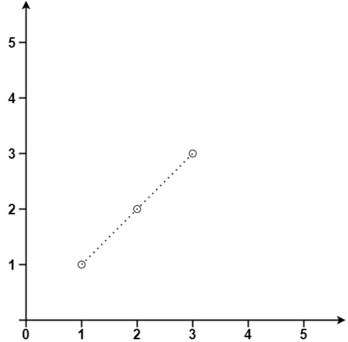

# 十六、位运算与数学

## 16.1 位运算

### 只出现一次的数字 ⭐️

给你一个 非空 整数数组 `nums` ，除了某个元素只出现一次以外，其余每个元素均出现两次。找出那个只出现了一次的元素。

你必须设计并实现线性时间复杂度的算法来解决此问题，且该算法只使用常量额外空间。

**示例**

- 输入：nums = [2,2,1]
- 输出：1

**思路**

- 从头异或到结尾，所得结果即为出现了一次的元素。

**代码**

```java
class Solution {
    public int singleNumber(int[] nums) {
        int ans = nums[0];
        for (int i = 1; i < nums.length; i++) {
            ans ^= nums[i];
        }
        return ans;
    }
}
```

### 二进制求和 ⭐️⭐️

给你两个二进制字符串 `a` 和 `b` ，以二进制字符串的形式返回它们的和。

**示例**

- 输入:a = "11", b = "1"
- 输出："100"

**思路**

- 模拟竖式。注意循环条件。（连接符为或，并且当进位为 0 才停止）
- 进位数 `carry = sum / 进制`，位结果 = `sum % 进制`。

**代码**

```java
class Solution {
    public String addBinary(String a, String b) {
        int carry = 0;
        int i = a.length() - 1;
        int j = b.length() - 1;
        StringBuilder sb = new StringBuilder();
        while (i >= 0 || j >= 0 || carry > 0) {
            int sum = carry;
            sum += i >= 0 ? a.charAt(i) - '0' : 0;
            sum += j >= 0 ? b.charAt(j) - '0' : 0;
            carry = sum / 2;
            sb.append(sum % 2);
            i--;
            j--;
        }
        return sb.reverse().toString();
    }
}
```

### 颠倒二进制位 ⭐️⭐️⭐️

颠倒给定的 32 位无符号整数的二进制位。

提示：

请注意，在某些语言（如 Java）中，没有无符号整数类型。在这种情况下，输入和输出都将被指定为有符号整数类型，并且不应影响您的实现，因为无论整数是有符号的还是无符号的，其内部的二进制表示形式都是相同的。
在 Java 中，编译器使用二进制补码记法来表示有符号整数。因此，在 示例 2 中，输入表示有符号整数 -3，输出表示有符号整数
-1073741825。

**示例**

- 输入：n = 11111111111111111111111111111101
- 输出：3221225471 (10111111111111111111111111111111)
- 解释：输入的二进制串 11111111111111111111111111111101 表示无符号整数 4294967293，
  因此返回 3221225471 其二进制表示形式为 10111111111111111111111111111111 。

**思路**

- 调库秒了。

**代码**

```java
class Solution {
    public int reverseBits(int n) {
        return Integer.reverse(n);
    }
}
```

### 位 1 的个数 ⭐️⭐️

编写一个函数，获取一个正整数的二进制形式并返回其二进制表达式中设置位的个数（也被称为汉明重量）。

**示例**

- 输入：n = 11
- 输出：3
- 解释：输入的二进制串 1011 中，共有 3 个设置位。

**思路**

- 转换成二进制的时候统计 1 的个数。

**代码**

```java
class Solution {
    public int hammingWeight(int n) {
        int ans = 0;
        while (n > 0) {
            // 下面条件判断等价于 ans += n & 1
            if (n % 2 == 1) {
                ans++;
            }
            n /= 2; // 等价于 n >>= 1
        }
        return ans;
    }
}
```

### 只出现一次的数字 II ⭐️⭐️⭐️⭐️⭐️

给你一个整数数组 `nums` ，除某个元素仅出现 一次 外，其余每个元素都恰出现 三次 。请你找出并返回那个只出现了一次的元素。

你必须设计并实现线性时间复杂度的算法且使用常数级空间来解决此问题。

**示例**

- 输入：nums = [0,1,0,1,0,1,99]
- 输出：99

**思路**

- 见代码。毫无实用价值，建议哈希表。

**代码**

```java
class Solution {
    public int singleNumber(int[] nums) {
        int ones = 0, twos = 0;
        for (int num : nums) {
            // twos 的位上会保存那些出现了两次的 bits
            twos |= ones & num;
            // ones 的位上会保存那些出现了 1 次的 bits
            ones ^= num;
            // mask 会包含出现了三次的 bits
            int mask = ~(ones & twos);
            // 如果某个 bit 出现了三次，把它从 ones 和 twos 中清除
            ones &= mask;
            twos &= mask;
        }
        // 最终，ones 中保留的 bits 就是那个只出现了一次的数字
        return ones;
    }
}
```

### 数字范围按位与 ⭐️⭐️⭐️⭐️

给你两个整数 `left` 和 `right` ，表示区间 `[left, right]` ，返回此区间内所有数字 按位与 的结果（包含 `left` 、`right` 端点）。

**示例**

- 输入：left = 1, right = 2147483647
- 输出：0

**思路**

- 在给定区间 `[left, right]` 内的所有数字进行按位与操作时，右端的变化会导致较低位（如最后几位）在最终结果中变为
  0。也就是说，最终结果只保留了高位相同的部分，低位的部分因为区间内的数字变化而全部被清零。
- 因此找出 `left` 和 `right` 之间的最高相同的部分。这部分将在结果中保留。
- 为此，我们可以不断右移 `left` 和 `right`，直到它们相等为止。这时，它们相等的部分就是我们要找的高位部分，右移的次数决定了我们需要将结果再左移回去多少次。

**代码**

```java
class Solution {
    public int rangeBitwiseAnd(int left, int right) {
        int shift = 0;
        // 找到 left 和 right 的相同前缀
        while (left < right) {
            left >>= 1;
            right >>= 1;
            shift++;
        }
        // 将相同前缀左移回去
        return left << shift;
    }
}
```

## 16.2 数学

### 找出数组的最大公约数 ⭐️

给你一个整数数组 `nums` ，返回数组中最大数和最小数的 最大公约数 。

两个数的 最大公约数 是能够被两个数整除的最大正整数。

**示例**

- 输入：nums = [2,5,6,9,10]
- 输出：2
- 解释：
  nums 中最小的数是 2
  nums 中最大的数是 10
  2 和 10 的最大公约数是 2

**思路**

- 记清楚最大公约数的递归算法。

**代码**

```java
class Solution {
    int gcd(int x, int y) {
        return y == 0 ? x : gcd(y, x % y);
    }

    public int findGCD(int[] nums) {
        int min = nums[0];
        int max = nums[0];
        for (int num : nums) {
            min = Math.min(min, num);
            max = Math.max(max, num);
        }
        return gcd(min, max);
    }
}
```

### 丢失的数字 ️⭐️

给定一个包含 `[0, n]` 中 `n` 个数的数组 `nums` ，找出 `[0, n]` 这个范围内没有出现在数组中的那个数。

**示例**

- 输入：nums = [9,6,4,2,3,5,7,0,1]
- 输出：8
- 解释：n = 9，因为有 9 个数字，所以所有的数字都在范围 [0,9] 内。8 是丢失的数字，因为它没有出现在 nums 中。

**思路**

- 用等差数列求和公式求出 `[0, n]` 的和，减去数组中所有数的和，即为缺失的数。

**代码**

```java
class Solution {
    public int missingNumber(int[] nums) {
        int n = nums.length;
        int oriSum = n * (n + 1) / 2;
        int sum = 0;
        for(int num : nums){
            sum += num;
        }
        return oriSum - sum;
    }
}
```

### 回文数 ⭐️

给你一个整数 `x` ，如果 `x` 是一个回文整数，返回 `true` ；否则，返回 `false` 。

回文数
是指正序（从左向右）和倒序（从右向左）读都是一样的整数。

例如，`121` 是回文，而 `123` 不是。

**示例**

- 输入：x = -121
- 输出：false
- 解释：从左向右读, 为 -121 。 从右向左读, 为 121- 。因此它不是一个回文数。

**思路**

- 调 API 转换为字符串秒了。

**代码**

```java
class Solution {
    public boolean isPalindrome(int x) {
        String s = String.valueOf(x);
        int left = 0;
        int right = s.length() - 1;
        while (left < right) {
            if (s.charAt(left) != s.charAt(right)) {
                return false;
            }
            left++;
            right--;
        }
        return true;
    }
}
```

### 加一 ⭐️⭐️

给定一个由 整数 组成的 非空 数组所表示的非负整数，在该数的基础上加一。

最高位数字存放在数组的首位， 数组中每个元素只存储单个数字。

你可以假设除了整数 0 之外，这个整数不会以零开头。

**示例**

- 输入：digits = [1,2,3]
- 输出：[1,2,4]
- 解释：输入数组表示数字 123。

**思路**

- 从最后一位开始，如果加 1 小于 10，则直接返回，否则将该位置 0，向前继续遍历。

**代码**

```java
class Solution {
    public int[] plusOne(int[] digits) {
        int n = digits.length;
        List<Integer> res = new ArrayList<>();
        for (int i = digits.length - 1; i >= 0; i--) {
            digits[i]++;
            if (digits[i] < 10) {
                return digits;
            }
            digits[i] = 0;
        }
        int[] ans = new int[n + 1];
        ans[0] = 1;
        return ans;
    }
}
```

### n 的第 k 个因子 ⭐️⭐️
给你两个正整数 `n` 和 `k` 。

如果正整数 `i` 满足 `n % i == 0` ，那么我们就说正整数 `i` 是整数 `n` 的因子。

考虑整数 `n` 的所有因子，将它们 升序排列 。请你返回第 `k` 个因子。如果 `n` 的因子数少于 `k` ，请你返回 -1 。

**示例**
- 输入：n = 12, k = 3
- 输出：3
- 解释：因子列表包括 [1, 2, 3, 4, 6, 12]，第 3 个因子是 3 。

**思路**
- 从 1 开始遍历到根号 `n` 即可。

**代码**
```java
class Solution {
    public int kthFactor(int n, int k) {
        List<Integer> right = new ArrayList<>();
        for (int i = 1; i * i <= n; i++) {
            if (n % i == 0) {
                k--;
                if (i * i != n) {
                    right.add(n / i);
                }
            }
            if (k == 0) {
                return i;
            }
        }
        int m = right.size();
        return k <= m ? right.get(m - k) : -1;
    }
}
```

### 计数质数 ⭐️⭐️

给定整数 `n` ，返回 所有小于非负整数 `n` 的质数的数量 。

**示例**

- 输入：n = 10
- 输出：4
- 解释：小于 10 的质数一共有 4 个, 它们是 2, 3, 5, 7 。

**思路**

- 埃氏筛法。
- 从 2 开始，将 2 的倍数全部标记为合数，然后再找到下一个未标记的数，重复这个过程。
- 注意：在标记合数的时候，从 `i * i` 开始标记，因为 `i * 2, i * 3, ...` 已经被之前的数标记过了。

**代码**

```java
class Solution {
    public int countPrimes(int n) {
        boolean[] vis = new boolean[n];
        int ans = 0;
        for (int i = 2; i < n; i++) {
            if (!vis[i]) {
                ans++;
                if ((long) i * i < n) {
                    for (int j = i * i; j < n; j += i) {
                        vis[j] = true;
                    }
                }
            }
        }
        return ans;
    }
}
```

### 阶乘后的零 ⭐️⭐️⭐️

给定一个整数 `n` ，返回 `n!` 结果中尾随零的数量。

提示 `n! = n * (n - 1) * (n - 2) * ... * 3 * 2 * 1`

**示例**

- 输入：n = 5
- 输出：1
- 解释：5! = 120 ，有一个尾随 0

**思路**

- 要计算整数 `n!`（n 的阶乘）结果中尾随零的数量，可以观察到尾随零的产生是由于阶乘结果中包含了因子 10。而因子 10 是由 2 和 5
  相乘得来的。由于 2 的因子数量总是多于 5 的因子数量，因此尾随零的数量只取决于阶乘中 5 的因子数量。
- 每次将 `n` 除以 5，表示有多少个 5 的倍数，累加到 `count` 中。然后更新 `n` 为 `n/5`，继续计算 25 的倍数，125 的倍数，等等。

**代码**

```java
class Solution {
    public int trailingZeroes(int n) {
        int count = 0;
        while (n > 0) {
            n /= 5;
            count += n;
        }
        return count;
    }
}
```

### x 的平方根 ⭐️⭐️

给你一个非负整数 `x` ，计算并返回 `x` 的 算术平方根 。

由于返回类型是整数，结果只保留 整数部分 ，小数部分将被 舍去 。

注意：不允许使用任何内置指数函数和算符，例如 `pow(x, 0.5)` 或者 `x ** 0.5` 。

**示例**

- 输入：x = 4
- 输出：2

**思路**

- 思路一：二分查找
- 思路二：牛顿迭代法

**代码**
思路一：二分查找

```java
class Solution {
    public int mySqrt(int x) {
        if (x == 0) {
            return 0;
        }
        long low = 0;
        long high = x;
        long ans = 0;
        while (low <= high) {
            long mid = (low + high) / 2;
            if (mid * mid <= x) {
                ans = mid;
                low = mid + 1;
            } else {
                high = mid - 1;
            }
        }
        return (int) ans;
    }
}
```

思路二：牛顿迭代法

```java
class Solution {
    public int mySqrt(int x) {
        if (x == 0) {
            return 0;
        }
        long n = x;
        while (n * n > x) {
            n = (n + x / n) / 2;
        }
        return (int) n;
    }
}
```

### Pow(x, n) ⭐️⭐️

实现 `pow(x, n)` ，即计算 `x` 的整数 `n` 次幂函数（即，`x^n` ）。

**示例**

- 输入：x = 2.00000, n = 10
- 输出：1024.00000

**思路**

- 分治法做快速幂。
- 注意处理幂数值的几个边界条件和数据类型。

**代码**

```java
class Solution {
    double qPow(double x, long n) {
        if (n == 1) {
            return x;
        }
        double res = qPow(x, n / 2);
        return n % 2 == 0 ? res * res : res * res * x;
    }

    public double myPow(double x, int n) {
        if (n == 0) {
            return 1;
        }
        if (n < 0) {
            return qPow(1.0 / x, -(long) n);
        }
        return qPow(x, n);
    }
}
```

### 直线上最多的点数 ⭐️⭐️⭐️⭐️

给你一个数组 `points` ，其中 `points[i] = [xi, yi]` 表示 X-Y 平面上的一个点。求最多有多少个点在同一条直线上。

**示例**

- 输入：points = \[[1,1],[2,2],[3,3]]
- 输出：3
- 

**思路**

- 对于每个顶点，判断其他顶点与该顶点的连线有多少个相同的斜率（采用分式）。
- 取 **斜率最高数量 + 1** 即为最终答案。

**代码**

```java
class Solution {
    int gcd(int x, int y) {
        return y == 0 ? x : gcd(y, x % y);
    }

    public int maxPoints(int[][] points) {
        int n = points.length;
        if (n == 1) {
            return 1;
        }
        int ans = 0;
        for (int i = 0; i < n; i++) {
            Map<Integer, Integer> map = new HashMap<>();
            for (int j = 0; j < i; j++) {
                int dy = points[i][1] - points[j][1];
                int dx = points[i][0] - points[j][0];
                int gcd = gcd(dx, dy);
                dx /= gcd;
                dy /= gcd;
                int key = dx + dy * 20001;
                map.put(key, map.getOrDefault(key, 0) + 1);
                ans = Math.max(ans, map.get(key));
            }
        }
        return ans + 1;
    }
}
```
