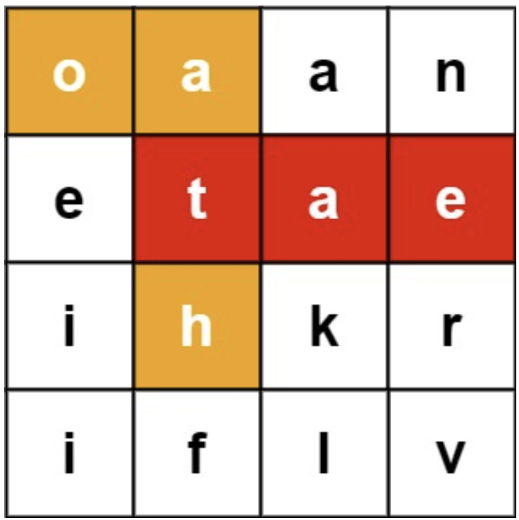

# 九、高级数据结构

## 9.1 字典树

### 实现Trie（前缀树）⭐️⭐️⭐️

Trie（发音类似 "try"）或者说 前缀树 是一种树形数据结构，用于高效地存储和检索字符串数据集中的键。这一数据结构有相当多的应用情景，例如自动补完和拼写检查。

请你实现 `Trie` 类：

- `Trie()` 初始化前缀树对象。
- `void insert(String word)` 向前缀树中插入字符串 `word` 。
- `boolean search(String word)` 如果字符串 `word` 在前缀树中，返回 `true`（即，在检索之前已经插入）；否则，返回 `false` 。
- `boolean startsWith(String prefix)` 如果之前已经插入的字符串 `word` 的前缀之一为 `prefix` ，返回 `true`
  ；否则，返回 `false` 。

**示例**

- 输入
  \["Trie", "insert", "search", "search", "startsWith", "insert", "search"]
  \[[], ["apple"], ["apple"], ["app"], ["app"], ["app"], ["app"]]
- 输出
  [null, null, true, false, true, null, true]

- 解释
    - Trie trie = new Trie();
    - trie.insert("apple");
    - trie.search("apple"); // 返回 True
    - trie.search("app"); // 返回 False
    - trie.startsWith("app"); // 返回 True
    - trie.insert("app");
    - trie.search("app"); // 返回 True

**思路**

- Trie，又称前缀树或字典树，是一棵有根树，其每个节点包含以下字段：
    - 指向子节点的指针数组 `children`。对于本题而言，数组长度为 26，即小写英文字母的数量。此时 `children[0]`
      对应小写字母 `a`，`children[1]` 对应小写字母 `b`，…，`children[25]` 对应小写字母 `z`。
    - 布尔字段 `isEnd`，表示该节点是否为字符串的结尾。
- 插入字符串：从字典树的根开始，插入字符串。对于当前字符对应的子节点，有两种情况：
    - 子节点存在。沿着指针移动到子节点，继续处理下一个字符。
    - 子节点不存在。创建一个新的子节点，记录在 `children` 数组的对应位置上，然后沿着指针移动到子节点，继续搜索下一个字符。
    - 重复以上步骤，直到处理字符串的最后一个字符，然后将当前节点标记为字符串的结尾。
- 查找前缀：从字典树的根开始，查找前缀。对于当前字符对应的子节点，有两种情况：
    - 子节点存在。沿着指针移动到子节点，继续搜索下一个字符。
    - 子节点不存在。说明字典树中不包含该前缀，返回空指针。
    - 重复以上步骤，直到返回空指针或搜索完前缀的最后一个字符。
    - 若搜索到了前缀的末尾，就说明字典树中存在该前缀。此外，若前缀末尾对应节点的 `isEnd` 为真，则说明字典树中存在该字符串。

**代码**

```java
class Trie {
    private Trie[] children;
    private boolean isEnd;

    public Trie() {
        children = new Trie[26];
        isEnd = false;
    }
    
    public void insert(String word) {
        Trie node = this;
        for (int i = 0; i < word.length(); i++) {
            int index = word.charAt(i) - 'a';
            if (node.children[index] == null) {
                node.children[index] = new Trie();
            }
            node = node.children[index];
        }
        node.isEnd = true;
    }
    
    public boolean search(String word) {
        Trie node = searchPrefix(word);
        return node != null && node.isEnd;
    }
    
    public boolean startsWith(String prefix) {
        return searchPrefix(prefix) != null;
    }

    private Trie searchPrefix(String prefix) {
        Trie node = this;
        for (int i = 0; i < prefix.length(); i++) {
            int index = prefix.charAt(i) - 'a';
            if (node.children[index] == null) {
                return null;
            }
            node = node.children[index];
        }
        return node;
    }
}
```

### 添加与搜索单词 - 数据结构设计 ⭐️⭐️⭐️⭐️

请你设计一个数据结构，支持 添加新单词 和 查找字符串是否与任何先前添加的字符串匹配 。

实现词典类 `WordDictionary` ：

- `WordDictionary()` 初始化词典对象
- `void addWord(word)` 将 `word` 添加到数据结构中，之后可以对它进行匹配
- `bool search(word)` 如果数据结构中存在字符串与 `word` 匹配，则返回 `true` ；否则，返回 `false`。`word`
  中可能包含一些 `'.'` ，每个 `.` 都可以表示任何一个字母。

**示例**

- 输入：
  ["WordDictionary","addWord","addWord","addWord","search","search","search","search"]
  \[[],["bad"],["dad"],["mad"],["pad"],["bad"],[".ad"],["b.."]]
- 输出：
  [null,null,null,null,false,true,true,true]

- 解释：
    - WordDictionary wordDictionary = new WordDictionary();
    - wordDictionary.addWord("bad");
    - wordDictionary.addWord("dad");
    - wordDictionary.addWord("mad");
    - wordDictionary.search("pad"); // 返回 False
    - wordDictionary.search("bad"); // 返回 True
    - wordDictionary.search(".ad"); // 返回 True
    - wordDictionary.search("b.."); // 返回 True

**思路**

- 插入字符串的时候注意当当前 `index` 位置为 `null` 时再初始化子节点，不要覆盖原有的节点。
- 深度优先搜索到 `.` 时则分多路搜索所有子节点，只要找到一个分支为 `true` 即可。

**代码**

```java
class WordDictionary {
    private WordDictionary[] children;
    private boolean isEnd;

    public WordDictionary() {
        children = new WordDictionary[26];
        isEnd = false;
    }

    public void addWord(String word) {
        WordDictionary node = this;
        for (int i = 0; i < word.length(); i++) {
            int index = word.charAt(i) - 'a';
            if (node.children[index] == null) {
                node.children[index] = new WordDictionary();
            }
            node = node.children[index];
        }
        node.isEnd = true;
    }

    private boolean dfs(String word, WordDictionary node, int i) {
        if (node == null) {
            return false;
        }
        if (i == word.length()) {
            return node.isEnd;
        }
        if (word.charAt(i) == '.') {
            for (WordDictionary child : node.children) {
                if (dfs(word, child, i + 1)) {
                    return true;
                }
            }
            return false;
        } else {
            int index = word.charAt(i) - 'a';
            return dfs(word, node.children[index], i + 1);
        }
    }

    public boolean search(String word) {
        return dfs(word, this, 0);
    }
}
```

### 单词搜索 II ⭐️⭐️⭐️⭐️⭐️

给定一个 `m x n` 二维字符网格 `board` 和一个单词（字符串）列表 `words`， 返回所有二维网格上的单词 。

单词必须按照字母顺序，通过 相邻的单元格 内的字母构成，其中“相邻”单元格是那些水平相邻或垂直相邻的单元格。同一个单元格内的字母在一个单词中不允许被重复使用。

**示例**

- 输入：board = \[["o","a","a","n"],["e","t","a","e"],["i","h","k","r"],["i","f","l","v"]],
  words = ["oath","pea","eat","rain"]
- 输出：["eat","oath"]
- 

**思路**

- 将单词列表中所有单词加入字典树。
- 字典树中每个节点需要保存到该节点为止形成的字符串 `word`，方便搜索。
- 在深度优先搜索棋盘的过程中，字典树节点跟随深入，根据当前字符对应字典树子节点是否为空进行剪枝。（如果为空，表示单词列表中不存在以当前搜索路径为前缀的单词）
- 如果搜索到某个字典树节点的 `word` 不为空，表示成功匹配到一个合法的单词，加入结果集合去重。然后**继续搜索**
  ，不要提前 `return`。

**代码**

```java
class Trie {
    Trie[] children;
    String word;

    public Trie() {
        children = new Trie[26];
        word = "";
    }

    public void insert(String word) {
        Trie node = this;
        for (int i = 0; i < word.length(); i++) {
            int index = word.charAt(i) - 'a';
            if (node.children[index] == null) {
                node.children[index] = new Trie();
            }
            node = node.children[index];
        }
        node.word = word;
    }
}

class Solution {
    int[][] directions = new int[][]{{0, 1}, {1, 0}, {0, -1}, {-1, 0}};
    Set<String> ans = new HashSet<>();

    void dfs(char[][] board, boolean[][] vis, Trie node, int x, int y) {
        if (x < 0 || y < 0 || x >= board.length || y >= board[0].length || vis[x][y]) {
            return;
        }
        node = node.children[board[x][y] - 'a'];
        if (node == null) {
            return;
        }
        if (!node.word.isEmpty()) {
            ans.add(node.word);
        }
        vis[x][y] = true;
        for (int[] direction : directions) {
            dfs(board, vis, node, x + direction[0], y + direction[1]);
        }
        vis[x][y] = false;
    }

    public List<String> findWords(char[][] board, String[] words) {
        int n = board.length;
        int m = board[0].length;
        Trie node = new Trie();
        for (String word : words) {
            node.insert(word);
        }
        boolean[][] vis = new boolean[n][m];
        for (int i = 0; i < n; i++) {
            for (int j = 0; j < m; j++) {
                dfs(board, vis, node, i, j);
            }
        }
        return ans.stream().toList();
    }
}
```

## 9.2 线段树

