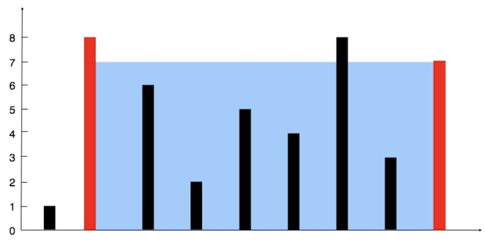

# 二、 双指针

## 2.1 头尾靠拢双指针

### 验证回文串 ⭐️

如果在将所有大写字符转换为小写字符、并移除所有非字母数字字符之后，短语正着读和反着读都一样。则可以认为该短语是一个 回文串 。

字母和数字都属于字母数字字符。

给你一个字符串 `s`，如果它是 回文串 ，返回 `true` ；否则，返回 `false` 。

**示例**

- 输入: s = "A man, a plan, a canal: Panama"
- 输出：true
- 解释："amanaplanacanalpanama" 是回文串。

**思路**

- 左右双指针向中间移动，跳过所有非数字、字母字符。
- 判断小写字母是否为回文串。

**代码**

```java
class Solution {
    public boolean isPalindrome(String s) {
        int i = 0;
        int j = s.length() - 1;
        while (i < j) {
            if (!Character.isLetterOrDigit(s.charAt(i))) {
                i++;
                continue;
            }
            if (!Character.isLetterOrDigit(s.charAt(j))) {
                j--;
                continue;
            }
            if (Character.toLowerCase(s.charAt(i)) != Character.toLowerCase(s.charAt(j))) {
                return false;
            }
            i++;
            j--;
        }
        return true;
    }
}
```

### 两数之和 II - 输入有序数组 ⭐️

给你一个下标从 1 开始的整数数组 `numbers` ，该数组已按 非递减顺序排列 ，请你从数组中找出满足相加之和等于目标数 target
的两个数。如果设这两个数分别是 `numbers[index1]` 和 `numbers[index2]` ，则 `1 <= index1 < index2 <= numbers.length` 。

以长度为 2 的整数数组 `[index1, index2]` 的形式返回这两个整数的下标 `index1` 和 `index2`。

你可以假设每个输入 只对应唯一的答案 ，而且你 不可以 重复使用相同的元素。

你所设计的解决方案必须只使用常量级的额外空间。

**示例**

- 输入：numbers = [2,7,11,15], target = 9
- 输出：[1,2]
- 解释：2 与 7 之和等于目标数 9 。因此 index1 = 1, index2 = 2 。返回 [1, 2] 。

**思路**

- 与三数之和的后两个指针相同。
- 左右双指针向中间移动，根据当前的总和调整指针位置。

**代码**

```java
class Solution {
    public int[] twoSum(int[] numbers, int target) {
        int n = numbers.length;
        int i = 0;
        int j = n - 1;

        while (i < j) {
            int sum = numbers[i] + numbers[j];
            if (sum == target) {
                return new int[]{i + 1, j + 1};
            }
            if (sum > target) {
                j--;
            } else {
                i++;
            }
        }
        return new int[]{-1, -1};
    }
}
```

### 盛最多水的容器 ⭐️⭐️⭐️

给定一个长度为 `n` 的整数数组 `height` 。有 `n` 条垂线，第 `i` 条线的两个端点是 `(i, 0)` 和 `(i, height[i])` 。

找出其中的两条线，使得它们与 `x` 轴共同构成的容器可以容纳最多的水。

返回容器可以储存的最大水量。

说明：你不能倾斜容器。

**示例**

- 输入：[1,8,6,2,5,4,8,3,7]
- 输出：49
- 解释：图中垂直线代表输入数组 [1,8,6,2,5,4,8,3,7]。在此情况下，容器能够容纳水（表示为蓝色部分）的最大值为 49。
- 

**思路**

- 数组两头放置左右指针 `left` 和 `right`。
- 比较 `left` 和 `right` 的柱子高度，小的那个指针往中间移动。

**代码**

```java
class Solution {
    public int maxArea(int[] height) {
        int n = height.length;

        int left = 0;
        int right = n - 1;
        int ans = 0;

        while (left < right) {
            ans = Math.max(ans, Math.min(height[left], height[right]) * (right - left));
            if (height[left] < height[right]) {
                left++;
            } else {
                right--;
            }
        }
        return ans;
    }
}
```

### 三数之和 ⭐️⭐️⭐️⭐️

给你一个整数数组 `nums` ，判断是否存在三元组 `[nums[i], nums[j], nums[k]]` 满足 `i != j、i != k 且 j != k `
，同时还满足 `nums[i] + nums[j] + nums[k] == 0` 。请你返回所有和为 0 且不重复的三元组。

注意：答案中不可以包含重复的三元组。

**示例**

- 输入：nums = [-1,0,1,2,-1,-4]
- 输出：[[-1,-1,2],[-1,0,1]]
- 解释：
    - nums[0] + nums[1] + nums[2] = (-1) + 0 + 1 = 0 。
    - nums[1] + nums[2] + nums[4] = 0 + 1 + (-1) = 0 。
    - nums[0] + nums[3] + nums[4] = (-1) + 2 + (-1) = 0 。
    - 不同的三元组是 [-1,0,1] 和 [-1,-1,2] 。
      注意，输出的顺序和三元组的顺序并不重要。

**思路**

- 先对数组排序。
- 设立三指针。指针 `i` 从数组头开始从左到右遍历。
- 指针 `j` 和 `k` 从 `i` 后面的子数组中利用头尾逼近确定目标，使得 `nums[j] + nums[k] = -nums[i]`。
- 为了防止重复，三个指针在移动过程中均需要跳过已经走过的数值。

**代码**

```java
class Solution {
    public List<List<Integer>> threeSum(int[] nums) {
        int n = nums.length;
        Arrays.sort(nums);
        List<List<Integer>> ans = new ArrayList<>();
        for (int i = 0; i < n; i++) {
            if (i > 0 && nums[i] == nums[i - 1]) {
                continue;
            }
            int j = i + 1;
            int k = n - 1;
            while (j < k) {
                if (j > i + 1 && nums[j] == nums[j - 1]) {
                    j++;
                    continue;
                }
                if (k < n - 1 && nums[k] == nums[k + 1]) {
                    k--;
                    continue;
                }
                if (nums[j] + nums[k] == -nums[i]) {
                    List<Integer> res = new ArrayList<>();
                    res.add(nums[i]);
                    res.add(nums[j]);
                    res.add(nums[k]);
                    ans.add(res);
                    j++;
                    k--;
                } else if (nums[j] + nums[k] < -nums[i]) {
                    j++;
                } else {
                    k--;
                }
            }
        }
        return ans;
    }
}
```

## 2.2 后元素向前移动双指针

### 移动零 ⭐️⭐️

给定一个数组 `nums`，编写一个函数将所有 0 移动到数组的末尾，同时保持非零元素的相对顺序。

请注意 ，必须在不复制数组的情况下原地对数组进行操作。

**示例**

- 输入: nums = [0,1,0,3,12]
- 输出: [1,3,12,0,0]

**思路**

- 萝卜填坑。将不为 0 的数作为萝卜依次填充到数组前面的坑中。
- `left` 从 0 开始，指向当前的萝卜坑。
- `right` 从 0 开始，指向非零数。
- `right` 与 `left` 交换，`left++` 指向下一个萝卜坑。

**代码**

```java
class Solution {
    public void moveZeroes(int[] nums) {
        int n = nums.length;
        int left = 0;
        for (int right = 0; right < n; right++) {
            if (nums[right] != 0) {
                int temp = nums[right];
                nums[right] = nums[left];
                nums[left] = temp;
                left++;
            }
        }
    }
}
```

### 颜色分类 ⭐️⭐️

给定一个包含红色、白色和蓝色、共 `n` 个元素的数组 `nums` ，原地 对它们进行排序，使得相同颜色的元素相邻，并按照红色、白色、蓝色顺序排列。

我们使用整数 0、 1 和 2 分别表示红色、白色和蓝色。

必须在不使用库内置的 `sort` 函数的情况下解决这个问题。

**示例**

- 输入：nums = [2,0,2,1,1,0]
- 输出：[0,0,1,1,2,2]

**思路**

- 参考 2.1 移动零
- 两次循环。第一次将所有 0 移动到前面，第二次将所有 1 移动到所有 0 的后面。

**代码**

```java
class Solution {
    void swap(int[] nums, int i, int j) {
        int temp = nums[i];
        nums[i] = nums[j];
        nums[j] = temp;
    }

    public void sortColors(int[] nums) {
        int n = nums.length;
        int left = 0;
        for (int right = 0; right < n; right++) {
            if (nums[right] == 0) {
                swap(nums, left, right);
                left++;
            }
        }
        for (int right = left; right < n; right++) {
            if (nums[right] == 1) {
                swap(nums, left, right);
                left++;
            }
        }
    }
}
```

### 移除元素 ⭐️⭐️

给你一个数组 `nums` 和一个值 `val`，你需要 原地 移除所有数值等于 `val` 的元素。元素的顺序可能发生改变。然后返回 `nums`
中与 `val` 不同的元素的数量。

假设 `nums` 中不等于 `val` 的元素数量为 `k`，要通过此题，您需要执行以下操作：

- 更改 `nums` 数组，使 `nums` 的前 `k` 个元素包含不等于 `val` 的元素。`nums` 的其余元素和 `nums` 的大小并不重要。
- 返回 `k`。

**示例**

- 输入：nums = [3,2,2,3], val = 3
- 输出：2, nums = [2,2,_,_]
- 解释：你的函数函数应该返回 k = 2, 并且 nums 中的前两个元素均为 2。
  你在返回的 k 个元素之外留下了什么并不重要（因此它们并不计入评测）。

**思路**

- 将所有不等于目标的元素覆盖至数组前面即可。

**代码**

```java
class Solution {
    public int removeElement(int[] nums, int val) {
        int n = nums.length;
        int left = 0;
        for (int i = 0; i < n; i++) {
            if (nums[i] != val) {
                nums[left++] = nums[i];
            }
        }
        return left;
    }
}
```

### 删除有序数组中的重复项 ⭐️⭐️⭐️

给你一个 非严格递增排列 的数组 `nums` ，请你 原地 删除重复出现的元素，使每个元素 只出现一次 ，返回删除后数组的新长度。元素的
相对顺序 应该保持 一致 。然后返回 `nums` 中唯一元素的个数。

考虑 `nums` 的唯一元素的数量为 `k` ，你需要做以下事情确保你的题解可以被通过：

更改数组 `nums` ，使 `nums` 的前 `k` 个元素包含唯一元素，并按照它们最初在 `nums` 中出现的顺序排列。`nums`
的其余元素与 `nums` 的大小不重要。
返回 `k`

**示例**

- 输入：nums = [1,1,2]
- 输出：2, nums = [1,2,_]
- 解释：函数应该返回新的长度 2 ，并且原数组 nums 的前两个元素被修改为 1, 2 。不需要考虑数组中超出新长度后面的元素。

**思路**

- 因为数组是有序的，因此只要将满足不等于**当前最新替换的元素**（即 `nums[left - 1]`）的元素覆盖到数组的左边即可。

**代码**

```java
class Solution {
    public int removeDuplicates(int[] nums) {
        int n = nums.length;
        int left = 1;

        for (int i = 1; i < n; i++) {
            if (nums[i] != nums[left - 1]) {
                nums[left++] = nums[i];
            }
        }
        return left;
    }
}
```

### 删除有序数组中的重复项 II ⭐️⭐️⭐️

给你一个有序数组 `nums` ，请你 原地 删除重复出现的元素，使得出现次数超过两次的元素只出现两次 ，返回删除后数组的新长度。

不要使用额外的数组空间，你必须在 原地 修改输入数组 并在使用 `O(1)` 额外空间的条件下完成。

**示例**

- 输入：nums = [1,1,1,2,2,3]
- 输出：5, nums = [1,1,2,2,3]
- 解释：函数应返回新长度 length = 5, 并且原数组的前五个元素被修改为 1, 1, 2, 2, 3。 不需要考虑数组中超出新长度后面的元素。

**思路**

- 与上同理，只要将满足不等于**当前最新替换的元素前一个元素**（即 `nums[left - 2]`）的元素覆盖到数组的左边即可。

**代码**

```java
class Solution {
    public int removeDuplicates(int[] nums) {
        int n = nums.length;
        int left = 2;

        for (int i = 2; i < n; i++) {
            if (nums[i] != nums[left - 2]) {
                nums[left++] = nums[i];
            }
        }
        return left;
    }
}
```

## 2.3 数组/字符串合并、匹配、比较

### 合并两个有序数组 ⭐️

给你两个按 非递减顺序 排列的整数数组 `nums1` 和 `nums2`，另有两个整数 `m` 和 `n` ，分别表示 `nums1` 和 `nums2` 中的元素数目。

请你 合并 `nums2` 到 `nums1` 中，使合并后的数组同样按 非递减顺序 排列。

注意：最终，合并后数组不应由函数返回，而是存储在数组 `nums1` 中。为了应对这种情况，`nums1` 的初始长度为 `m + n`，其中前 `m`
个元素表示应合并的元素，后 `n` 个元素为 0 ，应忽略。`nums2` 的长度为 n 。

**示例**

- 输入：nums1 = [1,2,3,0,0,0], m = 3, nums2 = [2,5,6], n = 3
- 输出：[1,2,2,3,5,6]
- 解释：需要合并 [1,2,3] 和 [2,5,6] 。合并结果是 [1,2,2,3,5,6] ，其中斜体加粗标注的为 nums1 中的元素。

**思路**

- 双指针，小的放进合并数组。

**代码**

```java
class Solution {
    public void merge(int[] nums1, int m, int[] nums2, int n) {
        int i = 0;
        int j = 0;
        int[] temp = new int[m + n];
        int k = 0;
        while (i < m && j < n) {
            if (nums1[i] < nums2[j]) {
                temp[k++] = nums1[i++];
            } else {
                temp[k++] = nums2[j++];
            }
        }
        while (i < m) {
            temp[k++] = nums1[i++];
        }
        while (j < n) {
            temp[k++] = nums2[j++];
        }
        System.arraycopy(temp, 0, nums1, 0, m + n);
    }
}
```

### 判断子序列 ⭐️⭐️

给定字符串 `s` 和 `t` ，判断 `s` 是否为 `t` 的子序列。

字符串的一个子序列是原始字符串删除一些（也可以不删除）字符而不改变剩余字符相对位置形成的新字符串。（例如，`"ace"`是`"abcde"`
的一个子序列，而`"aec"`不是）。

**示例**

- 输入：s = "abc", t = "ahbgdc"
- 输出：true

**思路**

- 双指针一位一位匹配。如果相等，则子序列指针移动。如果子序列匹配完毕，则返回 `true`。

**代码**

```java
class Solution {
    public boolean isSubsequence(String s, String t) {
        int n = s.length();
        int m = t.length();
        int j = 0;
        for (int i = 0; i < m; i++) {
            if (j < n && t.charAt(i) == s.charAt(j)) {
                j++;
            }
        }
        return j == n;
    }
}
```

### 比较版本号 ⭐️⭐️

给你两个 版本号字符串 `version1` 和 `version2` ，请你比较它们。版本号由被点 `'.'` 分开的修订号组成。修订号的值 是它 转换为整数
并忽略前导零。

比较版本号时，请按 从左到右的顺序 依次比较它们的修订号。如果其中一个版本字符串的修订号较少，则将缺失的修订号视为 `0`。

返回规则如下：

如果 `version1 < version2` 返回 `-1`，
如果 `version1 > version2` 返回 `1`，
除此之外返回 `0`。

**示例**

- 输入：version1 = "1.2", version2 = "1.10"
- 输出：-1
- 解释：version1 的第二个修订号为 "2"，version2 的第二个修订号为 "10"：2 < 10，所以 version1 < version2。

**思路**

- 先将字符串分割为数组，然后分别比较两个数组对应位置的大小即可。

**代码**

```java
class Solution {
    public int compareVersion(String version1, String version2) {
        String[] v1 = version1.split("\\.");
        String[] v2 = version2.split("\\.");
        int n = v1.length;
        int m = v2.length;
        for (int i = 0; i < n || i < m; i++) {
            int num1 = i < n ? Integer.parseInt(v1[i]) : 0;
            int num2 = i < m ? Integer.parseInt(v2[i]) : 0;
            if (num1 > num2) {
                return 1;
            }
            if (num1 < num2) {
                return -1;
            }
        }
        return 0;
    }
}
```
