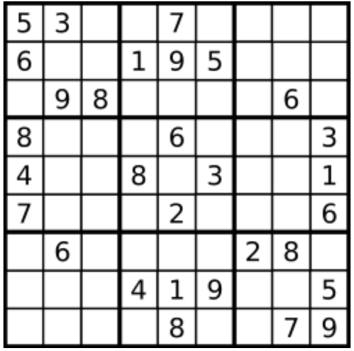
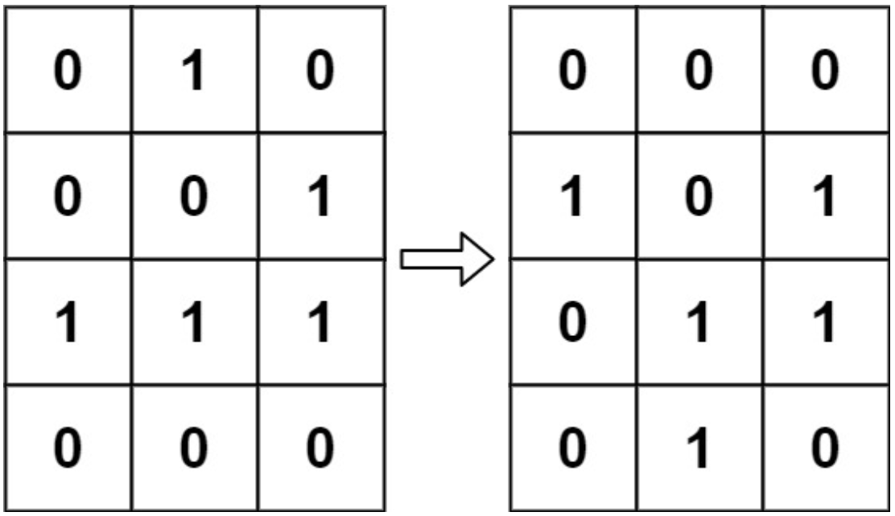
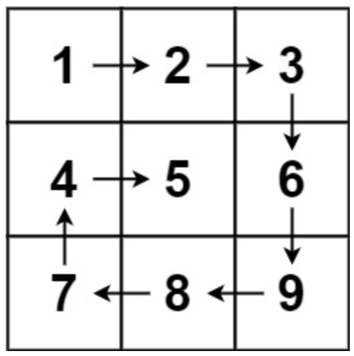
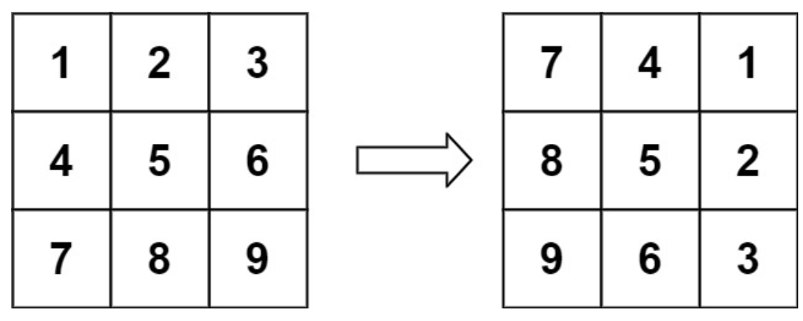
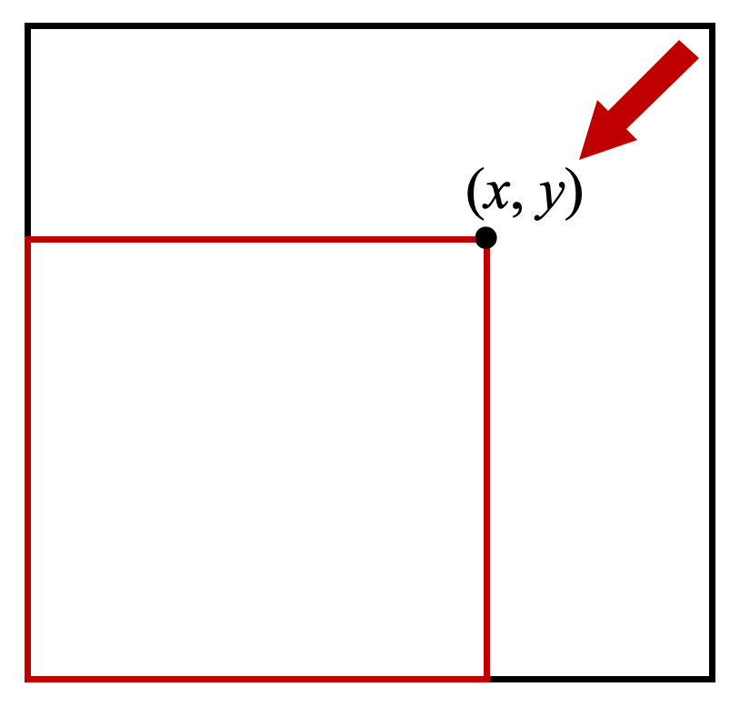

# 五、矩阵

## 5.1 矩阵遍历

### 矩阵置零 ⭐️

给定一个 `m x n` 的矩阵，如果一个元素为 `0` ，则将其所在行和列的所有元素都设为 `0` 。请使用 原地 算法。

**示例**

- 输入：matrix = \[[1,1,1],[1,0,1],[1,1,1]]
- 输出：\[[1,0,1],[0,0,0],[1,0,1]]

**思路**

- 收集需要置 0 的行和列，再统一置 0。

**代码**

```java
class Solution {
    public void setZeroes(int[][] matrix) {
        int n = matrix.length;
        int m = matrix[0].length;
        Set<Integer> rows = new HashSet<>();
        Set<Integer> cols = new HashSet<>();
        for (int i = 0; i < n; i++) {
            for (int j = 0; j < m; j++) {
                if (matrix[i][j] == 0) {
                    rows.add(i);
                    cols.add(j);
                }
            }
        }
        for (int i = 0; i < n; i++) {
            if (rows.contains(i)) {
                for (int j = 0; j < m; j++) {
                    matrix[i][j] = 0;
                }
            }
        }
        for (int j = 0; j < m; j++) {
            if (cols.contains(j)) {
                for (int i = 0; i < n; i++) {
                    matrix[i][j] = 0;
                }
            }
        }
    }
}
```

### 有效的数独 ⭐️

请你判断一个 `9 x 9` 的数独是否有效。只需要 根据以下规则 ，验证已经填入的数字是否有效即可。

- 数字 `1-9` 在每一行只能出现一次。
- 数字 `1-9` 在每一列只能出现一次。
- 数字 `1-9` 在每一个以粗实线分隔的 `3x3` 宫内只能出现一次。（请参考示例图）

注意：

- 一个有效的数独（部分已被填充）不一定是可解的。
- 只需要根据以上规则，验证已经填入的数字是否有效即可。
- 空白格用 '.' 表示。

**示例**

- 输入：board =

```
[["5","3",".",".","7",".",".",".","."]
,["6",".",".","1","9","5",".",".","."]
,[".","9","8",".",".",".",".","6","."]
,["8",".",".",".","6",".",".",".","3"]
,["4",".",".","8",".","3",".",".","1"]
,["7",".",".",".","2",".",".",".","6"]
,[".","6",".",".",".",".","2","8","."]
,[".",".",".","4","1","9",".",".","5"]
,[".",".",".",".","8",".",".","7","9"]]
```

- 输出：true
- 

**思路**

- 暴力验证就好了。

**代码**

```java
class Solution {
    public boolean isValidSudoku(char[][] board) {
        int n = board.length;
        int m = board[0].length;
        // 每一行
        for (int i = 0; i < n; i++) {
            Set<Character> set = new HashSet<>();
            for (int j = 0; j < m; j++) {
                if (Character.isDigit(board[i][j]) && set.contains(board[i][j])) {
                    return false;
                }
                set.add(board[i][j]);
            }
        }
        // 每一列
        for (int j = 0; j < m; j++) {
            Set<Character> set = new HashSet<>();
            for (int i = 0; i < n; i++) {
                if (Character.isDigit(board[i][j]) && set.contains(board[i][j])) {
                    return false;
                }
                set.add(board[i][j]);
            }
        }
        // 每个九宫格
        for (int i = 0; i < n; i += 3) {
            for (int j = 0; j < m; j += 3) {
                if (!check(board, i, j)) {
                    return false;
                }
            }
        }
        return true;
    }

    boolean check(char[][] board, int x, int y) {
        Set<Character> set = new HashSet<>();
        for (int i = x; i < x + 3; i++) {
            for (int j = y; j < y + 3; j++) {
                if (Character.isDigit(board[i][j]) && set.contains(board[i][j])) {
                    return false;
                }
                set.add(board[i][j]);
            }
        }
        return true;
    }
}
```

### 生命游戏 ⭐️⭐️

根据 百度百科 ， 生命游戏 ，简称为 生命 ，是英国数学家约翰·何顿·康威在 1970 年发明的细胞自动机。

给定一个包含 `m × n` 个格子的面板，每一个格子都可以看成是一个细胞。每个细胞都具有一个初始状态： `1` 即为 活细胞
（live），或 `0` 即为 死细胞 （dead）。每个细胞与其八个相邻位置（水平，垂直，对角线）的细胞都遵循以下四条生存定律：

- 如果活细胞周围八个位置的活细胞数少于两个，则该位置活细胞死亡；
- 如果活细胞周围八个位置有两个或三个活细胞，则该位置活细胞仍然存活；
- 如果活细胞周围八个位置有超过三个活细胞，则该位置活细胞死亡；
- 如果死细胞周围正好有三个活细胞，则该位置死细胞复活；

下一个状态是通过将上述规则同时应用于当前状态下的每个细胞所形成的，其中细胞的出生和死亡是同时发生的。给你 `m x n`
网格面板 `board` 的当前状态，返回下一个状态。

**示例**

- 输入：board = \[[0,1,0],[0,0,1],[1,1,1],[0,0,0]]
- 输出：\[[0,0,0],[1,0,1],[0,1,1],[0,1,0]]
- 

**思路**

- 用 `vis` 矩阵表示该单元格是否修改过，以此保留矩阵的原始状态。

**代码**

```java
class Solution {
    int[][] directions = new int[][]{{0, 1}, {0, -1}, {1, 0}, {-1, 0}, {1, 1}, {1, -1}, {-1, 1}, {-1, -1}};

    int count(int[][] board, boolean[][] vis, int x, int y) {
        int cnt = 0;
        for (int d = 0; d < 8; d++) {
            int nextX = x + directions[d][0];
            int nextY = y + directions[d][1];
            if (nextX >= 0 && nextX < board.length && nextY >= 0 && nextY < board[0].length) {
                if ((vis[nextX][nextY] && board[nextX][nextY] == 0) ||
                        (!vis[nextX][nextY] && board[nextX][nextY] == 1)) {
                    cnt++;
                }
            }
        }
        // 活细胞个数
        return cnt;
    }

    public void gameOfLife(int[][] board) {
        int n = board.length;
        int m = board[0].length;
        boolean[][] vis = new boolean[n][m];

        for (int i = 0; i < n; i++) {
            for (int j = 0; j < m; j++) {
                // 周围活细胞个数
                int cnt = count(board, vis, i, j);
                if (board[i][j] == 1) {
                    if (cnt < 2 || cnt > 3) {
                        board[i][j] = 0;
                        vis[i][j] = true;
                    }
                }
                // 死细胞
                else if (cnt == 3) {
                    board[i][j] = 1;
                    vis[i][j] = true;
                }
            }
        }
    }
}
```

### 螺旋矩阵 ⭐️⭐️⭐️

给你一个 m 行 n 列的矩阵 matrix ，请按照 顺时针螺旋顺序 ，返回矩阵中的所有元素。

**示例**

- 输入：matrix = \[[1,2,3],[4,5,6],[7,8,9]]
- 输出：[1,2,3,6,9,8,7,4,5]
- 

**思路**

- 模拟。右 -> 下 -> 左 -> 上 ->... 碰到边缘或者遇到已经访问过的节点改变方向。

**代码**

```java
class Solution {
    // 方向向量：右->下->左->上
    int[][] directions = new int[][]{{0, 1}, {1, 0}, {0, -1}, {-1, 0}};
    List<Integer> ans = new ArrayList<>();

    void visit(int x, int y, int d, int[][] matrix, boolean[][] vis) {
        if (x >= matrix.length || x < 0 || y >= matrix[0].length || y < 0 || vis[x][y]) {
            return;
        }
        // 访问节点
        ans.add(matrix[x][y]);
        vis[x][y] = true;
        // 计算下一个格子
        int nextX = x + directions[d][0];
        int nextY = y + directions[d][1];
        // 出界或者已经访问过了
        if (nextX >= matrix.length || nextX < 0 || nextY >= matrix[0].length || nextY < 0 || vis[nextX][nextY]) {
            // 调转方向
            d = (d + 1) % 4;
            nextX = x + directions[d][0];
            nextY = y + directions[d][1];
        }
        visit(nextX, nextY, d, matrix, vis);
    }

    public List<Integer> spiralOrder(int[][] matrix) {
        int n = matrix.length;
        int m = matrix[0].length;
        boolean[][] vis = new boolean[n][m];
        visit(0, 0, 0, matrix, vis);
        return ans;
    }
}
```

### 旋转图像 ⭐️⭐️⭐️

给定一个 `n × n` 的二维矩阵 `matrix` 表示一个图像。请你将图像顺时针旋转 90 度。

你必须在 原地 旋转图像，这意味着你需要直接修改输入的二维矩阵。请不要 使用另一个矩阵来旋转图像。

**示例**

- 输入：matrix = \[[1,2,3],[4,5,6],[7,8,9]]
- 输出：\[[7,4,1],[8,5,2],[9,6,3]]
- 

**思路**

- 顺时针旋转 90 度 = 水平轴翻转 + 主对角线翻转

**代码**

```java
class Solution {
    public void rotate(int[][] matrix) {
        int n = matrix.length;
        // 水平翻转
        for (int i = 0; i < n / 2; ++i) {
            for (int j = 0; j < n; ++j) {
                int temp = matrix[i][j];
                matrix[i][j] = matrix[n - i - 1][j];
                matrix[n - i - 1][j] = temp;
            }
        }
        // 主对角线翻转
        for (int i = 0; i < n; ++i) {
            for (int j = 0; j < i; ++j) {
                int temp = matrix[i][j];
                matrix[i][j] = matrix[j][i];
                matrix[j][i] = temp;
            }
        }
    }
}
```

### 搜索二维矩阵II ⭐️⭐️⭐️

编写一个高效的算法来搜索 `m x n` 矩阵 `matrix` 中的一个目标值 `target` 。该矩阵具有以下特性：

每行的元素从左到右升序排列。
每列的元素从上到下升序排列。

**示例**

- 输入：matrix = \[[1,4,7,11,15],[2,5,8,12,19],[3,6,9,16,22],[10,13,14,17,24],[18,21,23,26,30]], target = 5
- 输出：true

**思路**

- 暴力搜索 `O(m*n)`
- 每行二分搜索 `O(mlogn)`
- Z字形搜索：`O(m+n)`。从右上到左下逐步缩小搜索范围。如果当前值较大，则向左缩小搜索范围；如果当前值较小，则向下缩小搜索范围。
  

**代码**

```java
class Solution {
    public boolean searchMatrix(int[][] matrix, int target) {
        int m = matrix.length, n = matrix[0].length;
        int x = 0, y = n - 1;
        while (x < m && y >= 0) {
            if (matrix[x][y] == target) {
                return true;
            }
            if (matrix[x][y] > target) {
                --y;
            } else {
                ++x;
            }
        }
        return false;
    }
}
```
