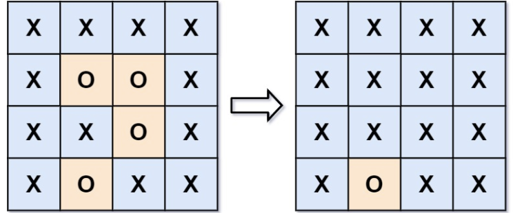
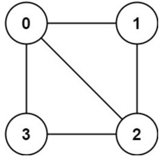
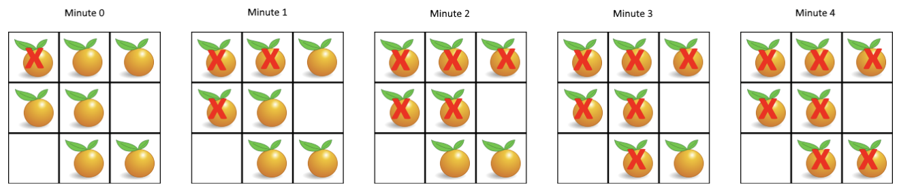
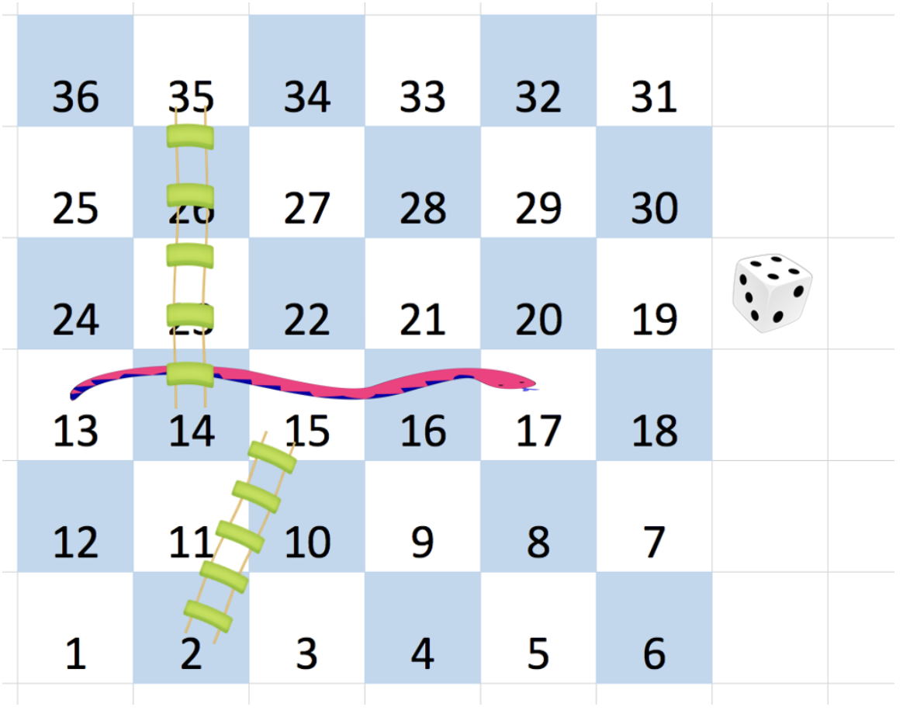
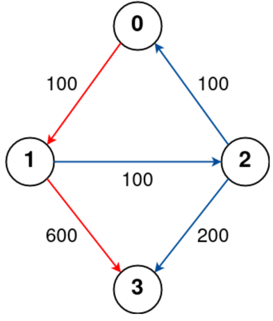
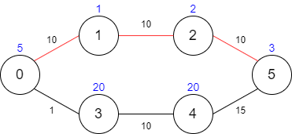

# 八、图

## 8.1 图的深度优先搜索（DFS）

### 岛屿数量 ⭐️

给你一个由 '1'（陆地）和 '0'（水）组成的的二维网格，请你计算网格中岛屿的数量。

岛屿总是被水包围，并且每座岛屿只能由水平方向和/或竖直方向上相邻的陆地连接形成。

此外，你可以假设该网格的四条边均被水包围。

**示例**

- 输入：grid = [
  ["1","1","0","0","0"],
  ["1","1","0","0","0"],
  ["0","0","1","0","0"],
  ["0","0","0","1","1"]
  ]
- 输出：3

**思路**

- dfs遍历地图中还未被访问的陆地区域。

**代码**

```java
class Solution {
    void dfs(char[][] grid, boolean[][] vis, int x, int y) {
        if (x < 0 || x >= grid.length || y < 0 || y >= grid[0].length || grid[x][y] == '0' || vis[x][y]) {
            return;
        }
        vis[x][y] = true;
        dfs(grid, vis, x - 1, y);
        dfs(grid, vis, x + 1, y);
        dfs(grid, vis, x, y + 1);
        dfs(grid, vis, x, y - 1);
    }

    public int numIslands(char[][] grid) {
        int n = grid.length;
        int m = grid[0].length;
        boolean[][] vis = new boolean[n][m];
        int ans = 0;
        for (int i = 0; i < n; i++) {
            for (int j = 0; j < m; j++) {
                if (grid[i][j] == '1' && !vis[i][j]) {
                    dfs(grid, vis, i, j);
                    ans++;
                }
            }
        }
        return ans;
    }
}
```

### 省份数量 ⭐️⭐️

有 `n` 个城市，其中一些彼此相连，另一些没有相连。如果城市 `a` 与城市 `b` 直接相连，且城市 `b` 与城市 `c`
直接相连，那么城市 `a` 与城市 `c` 间接相连。

省份 是一组直接或间接相连的城市，组内不含其他没有相连的城市。

给你一个 `n x n` 的矩阵 `isConnected` ，其中 `isConnected[i][j] = 1` 表示第 `i` 个城市和第 `j`
个城市直接相连，而 `isConnected[i][j] = 0` 表示二者不直接相连。

返回矩阵中 省份 的数量。

**示例**

- 输入：isConnected = [[1,1,0],[1,1,0],[0,0,1]]
- 输出：2

**思路**

- 与上题同理，求连通区域的数量。

**代码**

```java
class Solution {
    void dfs(int[][] isConnected, boolean[] vis, int x) {
        if (vis[x]) {
            return;
        }
        vis[x] = true;
        for (int j = 0; j < isConnected[x].length; j++) {
            if (isConnected[x][j] == 1) {
                dfs(isConnected, vis, j);
            }
        }
    }

    public int findCircleNum(int[][] isConnected) {
        int n = isConnected.length;
        int ans = 0;
        boolean[] vis = new boolean[n];
        for (int i = 0; i < n; i++) {
            if (!vis[i]) {
                dfs(isConnected, vis, i);
                ans++;
            }
        }
        return ans;
    }
}
```

### 所有可能的路径 ⭐️⭐️

给你一个有 `n` 个节点的 有向无环图（DAG），请你找出所有从节点 `0` 到节点 `n-1` 的路径并输出（不要求按特定顺序）

`graph[i]` 是一个从节点 `i` 可以访问的所有节点的列表（即从节点 `i` 到节点 `graph[i][j]`存在一条有向边）。

**示例**

- 输入：graph = \[[1,2],[3],[3],[]]
- 输出：\[[0,1,3],[0,2,3]]
- 解释：有两条路径 0 -> 1 -> 3 和 0 -> 2 -> 3

**思路**

- dfs 回溯搜索即可。
- 因为无环，所以不需要 vis 数组记录访问过的节点。

**代码**

```java
class Solution {
    List<List<Integer>> ans = new ArrayList<>();

    void dfs(int[][] graph, int x, List<Integer> res) {
        res.add(x);
        if (x == graph.length - 1) {
            ans.add(new ArrayList<>(res));
        }else {
            for (int next : graph[x]) {
                dfs(graph, next, res);
            }
        }
        res.remove(res.size() - 1);
    }

    public List<List<Integer>> allPathsSourceTarget(int[][] graph) {
        dfs(graph, 0, new ArrayList<>());
        return ans;
    }
}
```

### 被围绕的区域 ⭐️⭐️

给你一个 `m x n` 的矩阵 `board` ，由若干字符 `'X'` 和 `'O'` 组成，捕获 所有 被围绕的区域：

连接：一个单元格与水平或垂直方向上相邻的单元格连接。
区域：连接所有 `'O'` 的单元格来形成一个区域。
围绕：如果您可以用 `'X'` 单元格 连接这个区域，并且区域中没有任何单元格位于 `board` 边缘，则该区域被 `'X'` 单元格围绕。
通过将输入矩阵 `board` 中的所有 `'O'` 替换为 `'X'` 来 捕获被围绕的区域。

**示例**

- 输入：board = \[["X","X","X","X"],["X","O","O","X"],["X","X","O","X"],["X","O","X","X"]]
- 输出：\[["X","X","X","X"],["X","X","X","X"],["X","X","X","X"],["X","O","X","X"]]
  
- 解释：
  在上图中，底部的区域没有被捕获，因为它在 board 的边缘并且不能被围绕。

**思路**

- 注意到只有与边缘相邻的 `O` 区域才不会被包围。
- 因此先标记所有与边缘相邻的 `O` 区域为 `A`。
- 然后再遍历地图，将所有 `A` 还原为 `O`，将所有 `O` 置为 `X`。

**代码**

```java
class Solution {
    int[][] directions = new int[][]{{0, 1}, {1, 0}, {0, -1}, {-1, 0}};

    void dfs(char[][] board, int x, int y) {
        if (x < 0 || y < 0 || x >= board.length || y >= board[0].length || board[x][y] != 'O') {
            return;
        }
        board[x][y] = 'A';
        for (int[] direction : directions) {
            dfs(board, x + direction[0], y + direction[1]);
        }
    }

    public void solve(char[][] board) {
        int n = board.length;
        int m = board[0].length;

        for (int i = 0; i < n; i++) {
            for (int j = 0; j < m; j++) {
                // 对所有边缘的 O 节点进行 dfs 搜索
                if (board[i][j] == 'O' && (i == 0 || j == 0 || i == n - 1 || j == m - 1)) {
                    dfs(board, i, j);
                }
            }
        }
        for (int i = 0; i < n; i++) {
            for (int j = 0; j < m; j++) {
                if (board[i][j] == 'A') {
                    board[i][j] = 'O';
                } else if (board[i][j] == 'O') {
                    board[i][j] = 'X';
                }
            }
        }
    }
}
```

### 判断二分图 ⭐️⭐️⭐️

存在一个 无向图 ，图中有 `n` 个节点。其中每个节点都有一个介于 0 到 `n - 1` 之间的唯一编号。给你一个二维数组 `graph`
，其中 `graph[u]` 是一个节点数组，由节点 `u` 的邻接节点组成。形式上，对于 `graph[u]` 中的每个 `v` ，都存在一条位于节点 `u`
和节点 `v` 之间的无向边。该无向图同时具有以下属性：

- 不存在自环（`graph[u]` 不包含 `u`）。
- 不存在平行边（`graph[u]` 不包含重复值）。
- 如果 `v` 在 `graph[u]` 内，那么 `u` 也应该在 `graph[v]` 内（该图是无向图）
- 这个图可能不是连通图，也就是说两个节点 `u` 和 `v` 之间可能不存在一条连通彼此的路径。

二分图 定义：如果能将一个图的节点集合分割成两个独立的子集 `A` 和 `B` ，并使图中的每一条边的两个节点一个来自 `A`
集合，一个来自 `B` 集合，就将这个图称为 二分图 。

如果图是二分图，返回 `true` ；否则，返回 `false` 。

**示例**

- 输入：graph = [[1,2,3],[0,2],[0,1,3],[0,2]]
- 输出：false
- 解释：不能将节点分割成两个独立的子集，以使每条边都连通一个子集中的一个节点与另一个子集中的一个节点。
- 

**思路**

- 着色法。
- 采用深度优先搜索，给当前未着色的节点着色。然后给该节点的邻居着另一种颜色。
- 如果某个节点已着色且颜色与当前所着颜色不同，则返回 false。

**代码**

```java
class Solution {
    boolean dfs(int[][] graph, int[] color, int x, int curColor) {
        // 已着色，返回颜色是否相同
        if (color[x] != 0) {
            return color[x] == curColor;
        }
        color[x] = curColor;
        for (int neighbor : graph[x]) {
            if (!dfs(graph, color, neighbor, curColor == 1 ? 2 : 1)) {
                return false;
            }
        }
        return true;
    }

    public boolean isBipartite(int[][] graph) {
        int n = graph.length;
        int[] color = new int[n];
        for (int i = 0; i < n; i++) {
            if (color[i] == 0 && !dfs(graph, color, i, 1)) {
                return false;
            }
        }
        return true;
    }
}
```

### 除法求值 ⭐️⭐️⭐️

给你一个变量对数组 `equations` 和一个实数值数组 `values` 作为已知条件，其中 `equations[i] = [Ai, Bi]` 和 `values[i]`
共同表示等式 `Ai / Bi = values[i]` 。每个 `Ai` 或 `Bi` 是一个表示单个变量的字符串。

另有一些以数组 `queries` 表示的问题，其中 `queries[j] = [Cj, Dj]` 表示第 `j` 个问题，请你根据已知条件找出 `Cj / Dj = ?`
的结果作为答案。

返回 所有问题的答案 。如果存在某个无法确定的答案，则用 `-1.0`
替代这个答案。如果问题中出现了给定的已知条件中没有出现的字符串，也需要用 `-1.0` 替代这个答案。

注意：输入总是有效的。你可以假设除法运算中不会出现除数为 0 的情况，且不存在任何矛盾的结果。

注意：未在等式列表中出现的变量是未定义的，因此无法确定它们的答案。

**示例**

- 输入：equations = \[["a","b"],["b","c"]], values = [2.0,3.0],
  queries = \[["a","c"],["b","a"],["a","e"],["a","a"],["x","x"]]
- 输出：[6.00000,0.50000,-1.00000,1.00000,-1.00000]
- 解释：
    - 条件：a / b = 2.0, b / c = 3.0
    - 问题：a / c = ?, b / a = ?, a / e = ?, a / a = ?, x / x = ?
    - 结果：[6.0, 0.5, -1.0, 1.0, -1.0 ]
    - 注意：x 是未定义的 => -1.0

**思路**

- 构建有向图邻接表，其中边 `A->B` 的权值为 `A/B`，边 `B->A` 的权值为 `B/A`。 （邻接表需要封装节点类 `Node`
  ，同时记录节点名称和到该邻居节点的权值）
- 注意到求任意两个**存在且不同的**变量 `C/D` 的结果，即为从 `C` 节点开始到 `D` 节点上所有边权值的乘积。
- 采用 dfs 搜索从起点到终点的路径，记录路径上各边权值的乘积。

**代码**

```java
class Solution {
    class Node {
        String name;
        double weight;

        public Node(String name, double weight) {
            this.name = name;
            this.weight = weight;
        }
    }

    double res;

    void calc(Map<String, List<Node>> adjList, String node, String end, double temp, Set<String> vis) {
        if (vis.contains(node)) {
            return;
        }
        if (node.equals(end)) {
            res = temp;
        }
        vis.add(node);
        for (Node neighbor : adjList.get(node)) {
            calc(adjList, neighbor.name, end, temp * neighbor.weight, vis);
        }
        vis.remove(node);
    }

    public double[] calcEquation(List<List<String>> equations, double[] values, List<List<String>> queries) {
        Map<String, List<Node>> adjList = new HashMap<>();
        for (int i = 0; i < equations.size(); i++) {
            List<String> equation = equations.get(i);
            String u = equation.get(0);
            String v = equation.get(1);
            adjList.putIfAbsent(u, new ArrayList<>());
            adjList.get(u).add(new Node(v, values[i]));
            adjList.putIfAbsent(v, new ArrayList<>());
            adjList.get(v).add(new Node(u, 1.0 / values[i]));
        }

        double[] ans = new double[queries.size()];
        int k = 0;
        for (List<String> query : queries) {
            String start = query.get(0);
            String end = query.get(1);
            if (!adjList.containsKey(start) || !adjList.containsKey(end)) {
                ans[k++] = -1.0;
            } else if (start.equals(end)) {
                ans[k++] = 1.0;
            } else {
                res = -1.0;
                calc(adjList, start, end, 1.0, new HashSet<>());
                ans[k++] = res;
            }
        }
        return ans;
    }
}
```

### 克隆图 ⭐️⭐️⭐️

给你无向 连通 图中一个节点的引用，请你返回该图的 深拷贝（克隆）。

图中的每个节点都包含它的值 `val（int）` 和其邻居的列表（`list[Node]`）。

```
class Node {
    public int val;
    public List<Node> neighbors;
}
```

测试用例格式：

简单起见，每个节点的值都和它的索引相同。例如，第一个节点值为 1（`val = 1`），第二个节点值为 2（`val = 2`
），以此类推。该图在测试用例中使用邻接列表表示。

邻接列表 是用于表示有限图的无序列表的集合。每个列表都描述了图中节点的邻居集。

给定节点将始终是图中的第一个节点（值为 1）。你必须将 给定节点的拷贝 作为对克隆图的引用返回。

**示例**

- 输入：adjList = \[[2,4],[1,3],[2,4],[1,3]]
- 输出：\[[2,4],[1,3],[2,4],[1,3]]
- 解释：
    - 图中有 4 个节点。
    - 节点 1 的值是 1，它有两个邻居：节点 2 和 4 。
    - 节点 2 的值是 2，它有两个邻居：节点 1 和 3 。
    - 节点 3 的值是 3，它有两个邻居：节点 2 和 4 。
    - 节点 4 的值是 4，它有两个邻居：节点 1 和 3 。

**思路**

- 使用哈希表记录原始节点到克隆节点的映射。
- 对于每个节点，新建一个新的节点对象，并递归构造其邻居节点。
- 如果当前待克隆的节点已在哈希表中出现，则直接返回其在哈希表中记录的克隆节点。

**代码**

```java
class Solution {
    Map<Node, Node> map = new HashMap<>();

    Node clone(Node node) {
        if (map.containsKey(node)) {
            return map.get(node);
        }
        Node clonedNode = new Node(node.val, new ArrayList<>());
        map.put(node, clonedNode);
        for (Node neighbor : node.neighbors) {
            clonedNode.neighbors.add(clone(neighbor));
        }
        return clonedNode;
    }

    public Node cloneGraph(Node node) {
        if (node == null) {
            return null;
        }
        return clone(node);
    }
}
```

### 课程表 ⭐️⭐️⭐️

你这个学期必须选修 `numCourses` 门课程，记为 `0` 到 `numCourses - 1` 。

在选修某些课程之前需要一些先修课程。 先修课程按数组 `prerequisites` 给出，其中 `prerequisites[i] = [ai, bi]`
，表示如果要学习课程 `ai` 则 必须 先学习课程 `bi` 。

例如，先修课程对 `[0, 1]` 表示：想要学习课程 `0` ，你需要先完成课程 `1` 。
请你判断是否可能完成所有课程的学习？如果可以，返回 `true` ；否则，返回 `false` 。

**示例**

- 输入：numCourses = 2, prerequisites = [[1,0]]
- 输出：true
- 解释：总共有 2 门课程。学习课程 1 之前，你需要完成课程 0 。这是可能的。

**思路**

- 使用邻接表存储课程节点：`先修课程->[课程1，课程2，...]`。
- 使用深度优先搜索从每个课程节点开始，判断是否存在环。如果存在环则返回无法完成。
- 递归遍历需要使用三种元素的 vis 数组，0 表示该节点路径未检查，1 表示该节点正在检查，2 表示该节点已检查无环。后续如果检查到此节点到无需继续向后递归。

**代码**

```java
class Solution {
    boolean dfs(List<List<Integer>> adjList, int[] vis, int x) {
        if (vis[x] == 1) {
            return false;
        }
        if (vis[x] == 2) {
            return true;
        }
        vis[x] = 1;
        for (int neighbour : adjList.get(x)) {
            if (!dfs(adjList, vis, neighbour)) {
                return false;
            }
        }
        vis[x] = 2;
        return true;
    }

    public boolean canFinish(int numCourses, int[][] prerequisites) {
        // 构造邻接表
        List<List<Integer>> adjList = new ArrayList<>();
        for (int i = 0; i < numCourses; i++) {
            adjList.add(new ArrayList<>());
        }
        for (int i = 0; i < prerequisites.length; i++) {
            adjList.get(prerequisites[i][1]).add(prerequisites[i][0]);
        }

        int[] vis = new int[numCourses];
        for (int i = 0; i < numCourses; i++) {
            if (!dfs(adjList, vis, i)) {
                return false;
            }
        }
        return true;
    }
}
```

### 课程表 II ⭐️⭐️⭐️

现在你总共有 `numCourses` 门课需要选，记为 `0` 到 `numCourses - 1`。给你一个数组 `prerequisites`
，其中 `prerequisites[i] = [ai, bi]` ，表示在选修课程 `ai` 前 必须 先选修 `bi` 。

例如，想要学习课程 `0` ，你需要先完成课程 `1` ，我们用一个匹配来表示：`[0,1]` 。
返回你为了学完所有课程所安排的学习顺序。可能会有多个正确的顺序，你只要返回 任意一种 就可以了。如果不可能完成所有课程，返回
一个空数组 。

**示例**

- 输入：numCourses = 2, prerequisites = \[[1,0]]
- 输出：[0,1]
- 解释：总共有 2 门课程。要学习课程 1，你需要先完成课程 0。因此，正确的课程顺序为 [0,1] 。

**思路**

- 建立邻接表。
- 与判断课程表中是否存在环一样，当访问完毕节点时，将节点放入栈中。(因为是先向后递归再访问该节点，所有输出顺序是相反的)
- 依次取出栈中的元素即为最终结果。

**代码**

```java
class Solution {
    Stack<Integer> stack = new Stack<>();

    boolean dfs(List<List<Integer>> adjList, Integer course, int[] vis) {
        if (vis[course] == 1) {
            return false;
        }
        if (vis[course] == 2) {
            return true;
        }
        vis[course] = 1;
        for (Integer neighbors : adjList.get(course)) {
            if (!dfs(adjList, neighbors, vis)) {
                return false;
            }
        }
        stack.push(course);
        vis[course] = 2;
        return true;
    }

    public int[] findOrder(int numCourses, int[][] prerequisites) {
        List<List<Integer>> adjList = new ArrayList<>();
        for (int i = 0; i < numCourses; i++) {
            adjList.add(new ArrayList<>());
        }
        for (int[] prerequisite : prerequisites) {
            adjList.get(prerequisite[1]).add(prerequisite[0]);
        }
        int[] vis = new int[numCourses];
        for (int i = 0; i < numCourses; i++) {
            if (vis[i] == 0) {
                if (!dfs(adjList, i, vis)) {
                    return new int[0];
                }
            }
        }
        int[] ans = new int[numCourses];
        int k = 0;
        while (!stack.isEmpty()) {
            ans[k++] = stack.pop();
        }
        return ans;
    }
}
```

## 8.2 图的广度优先搜索（BFS）

### 腐烂的橘子 ⭐️⭐️

在给定的 `m x n` 网格 `grid` 中，每个单元格可以有以下三个值之一：

值 `0` 代表空单元格；
值 `1` 代表新鲜橘子；
值 `2` 代表腐烂的橘子。
每分钟，腐烂的橘子 周围 4 个方向上相邻 的新鲜橘子都会腐烂。

返回 直到单元格中没有新鲜橘子为止所必须经过的最小分钟数。如果不可能，返回 `-1` 。

**示例**

- 输入：grid = \[[2,1,1],[1,1,0],[0,1,1]]
- 输出：4
- 

**思路**

- 广度优先遍历。将腐烂的橘子位置用一个队列维护。
- 每次循环从中取出一个腐烂的橘子扩散腐烂，并将新腐烂的橘子加入队列，直到队列为空退出循环。

**代码**

```java
class Solution {
    int[][] directions = new int[][]{{0, 1}, {0, -1}, {1, 0}, {-1, 0}};

    public int orangesRotting(int[][] grid) {
        int n = grid.length;
        int m = grid[0].length;
        Queue<int[]> queue = new LinkedList<>();
        int freshCount = 0;
        int ans = 0;

        // 初始化队列和新鲜橘子计数
        for (int i = 0; i < n; i++) {
            for (int j = 0; j < m; j++) {
                if (grid[i][j] == 1) {
                    freshCount++;
                } else if (grid[i][j] == 2) {
                    queue.offer(new int[]{i, j});
                }
            }
        }
        // 如果没有新鲜橘子，直接返回 0
        if (freshCount == 0) return 0;
        while (!queue.isEmpty()) {
            int size = queue.size();
            for (int i = 0; i < size; i++) {
                // 取队首节点出来扩散腐烂
                int[] cur = queue.poll();
                for (int d = 0; d < 4; d++) {
                    int nextX = cur[0] + directions[d][0];
                    int nextY = cur[1] + directions[d][1];
                    if (nextX >= 0 && nextX < n && nextY >= 0 && nextY < m && grid[nextX][nextY] == 1) {
                        grid[nextX][nextY] = 2;
                        freshCount--;
                        queue.offer(new int[]{nextX, nextY});
                    }
                }
            }
            ans++;
        }
        return freshCount == 0 ? ans - 1 : -1;
    }
}
```

### 蛇梯棋 ⭐️⭐️⭐️

给你一个大小为 `n x n` 的整数矩阵 `board` ，方格按从 1 到 `n^2` 编号，编号遵循 转行交替方式 ，从左下角开始
（即，从 `board[n - 1][0]` 开始）每一行交替方向。

玩家从棋盘上的方格 `1` （总是在最后一行、第一列）开始出发。

每一回合，玩家需要从当前方格 `curr` 开始出发，按下述要求前进：

- 选定目标方格 next ，目标方格的编号符合范围 `[curr + 1, min(curr + 6, n^2)]` 。
    - 该选择模拟了掷 六面体骰子 的情景，无论棋盘大小如何，玩家最多只能有 6 个目的地。
- 传送玩家：如果目标方格 `next` 处存在蛇或梯子，那么玩家会传送到蛇或梯子的目的地。否则，玩家传送到目标方格 `next` 。
- 当玩家到达编号 `n^2` 的方格时，游戏结束。

`r` 行 `c` 列的棋盘，按前述方法编号，棋盘格中可能存在 “蛇” 或 “梯子”；如果 `board[r][c] != -1`
，那个蛇或梯子的目的地将会是 `board[r][c]`。编号为 `1` 和 `n^2` 的方格上没有蛇或梯子。

注意，玩家在每回合的前进过程中最多只能爬过蛇或梯子一次：就算目的地是另一条蛇或梯子的起点，玩家也 不能 继续移动。

- 举个例子，假设棋盘是 `[[-1,4],[-1,3]]` ，第一次移动，玩家的目标方格是 `2` 。那么这个玩家将会顺着梯子到达方格 `3` ，但 不能
  顺着方格 `3` 上的梯子前往方格 `4` 。

返回达到编号为 `n^2` 的方格所需的最少移动次数，如果不可能，则返回 `-1`。

**示例**

-

输入：board = \[[-1,-1,-1,-1,-1,-1],[-1,-1,-1,-1,-1,-1],[-1,-1,-1,-1,-1,-1],[-1,35,-1,-1,13,-1],[-1,-1,-1,-1,-1,-1],[-1,15,-1,-1,-1,-1]]

- 输出：4
- 解释：
  首先，从方格 1 [第 5 行，第 0 列] 开始。
  先决定移动到方格 2 ，并必须爬过梯子移动到到方格 15 。
  然后决定移动到方格 17 [第 3 行，第 4 列]，必须爬过蛇到方格 13 。
  接着决定移动到方格 14 ，且必须通过梯子移动到方格 35 。
  最后决定移动到方格 36 , 游戏结束。
  可以证明需要至少 4 次移动才能到达最后一个方格，所以答案是 4 。
- 

**思路**

- 先将棋盘展开为一维数组，方便处理。
- 从起点 1 开始广度优先搜索。如果当前节点已访问则跳过。否则扩展后面 6 个节点，如果待扩展节点无梯子则为此节点，如果有梯子则为梯子所到节点。

**代码**

```java
class Solution {
    public int snakesAndLadders(int[][] board) {
        int n = board.length;
        // 展开棋盘
        int[] flattenedBoard = new int[n * n + 1];
        boolean leftToRight = true;
        int index = 1;
        for (int r = n - 1; r >= 0; r--) {
            if (leftToRight) {
                for (int c = 0; c < n; c++) {
                    flattenedBoard[index++] = board[r][c];
                }
            } else {
                for (int c = n - 1; c >= 0; c--) {
                    flattenedBoard[index++] = board[r][c];
                }
            }
            leftToRight = !leftToRight;
        }
        // BFS
        Queue<Integer> queue = new LinkedList<>();
        queue.add(1);
        boolean[] vis = new boolean[n * n + 1];
        int ans = 0;
        while (!queue.isEmpty()) {
            int size = queue.size();
            for (int i = 0; i < size; i++) {
                int curr = queue.poll();
                if (vis[curr]) {
                    continue;
                }
                if (curr == n * n) {
                    return ans;
                }
                // 后面 6 个节点
                for (int k = 1; k <= 6; k++) {
                    int next = curr + k;
                    if (curr + k <= n * n) {
                        queue.add(flattenedBoard[next] == -1 ? next : flattenedBoard[next]);
                    }
                }
                vis[curr] = true;
            }
            ans++;
        }
        return -1;
    }
}
```

### 最小基因变化 ⭐️⭐️⭐️

基因序列可以表示为一条由 8 个字符组成的字符串，其中每个字符都是 `'A'`、`'C'`、`'G'` 和 `'T'` 之一。

假设我们需要调查从基因序列 `start` 变为 `end` 所发生的基因变化。一次基因变化就意味着这个基因序列中的一个字符发生了变化。

- 例如，`"AACCGGTT" --> "AACCGGTA"` 就是一次基因变化。

另有一个基因库 `bank` 记录了所有有效的基因变化，只有基因库中的基因才是有效的基因序列。（变化后的基因必须位于基因库 `bank`
中）

给你两个基因序列 `start` 和 `end` ，以及一个基因库 `bank` ，请你找出并返回能够使 `start` 变化为 `end`
所需的最少变化次数。如果无法完成此基因变化，返回 `-1` 。

注意：起始基因序列 `start` 默认是有效的，但是它并不一定会出现在基因库中。

**示例**

- 输入：start = "AACCGGTT", end = "AACCGGTA", bank = ["AACCGGTA"]
- 输出：1

**思路**

- 将每个可能的基因字符串作为一个节点，该题需要求从 `startGene` 到 `endGene` 的最短距离。路径上的每个节点都要是有效的。
- 使用广度优先搜索求无权图的最小路径。

**代码**

```java
class Solution {
    public int minMutation(String startGene, String endGene, String[] bank) {
        Set<String> set = new HashSet<>(Arrays.asList(bank));
        set.add(startGene);
        if (!set.contains(endGene)) {
            return -1;
        }
        Queue<String> queue = new LinkedList<>();
        queue.add(startGene);
        Set<String> vis = new HashSet<>();
        char[] elements = new char[]{'A', 'C', 'G', 'T'};
        int ans = 0;

        while (!queue.isEmpty()) {
            int size = queue.size();
            for (int i = 0; i < size; i++) {
                String gene = queue.poll();
                // 已访问或不合法
                if (vis.contains(gene) || !set.contains(gene)) {
                    continue;
                }
                // 到达目的基因，返回结果
                if (gene.equals(endGene)) {
                    return ans;
                }
                vis.add(gene);
                StringBuilder geneBuilder = new StringBuilder(gene);
                // 下一个基因变化
                for (int k = 0; k < gene.length(); k++) {
                    for (char element : elements) {
                        if (element != gene.charAt(k)) {
                            char origin = gene.charAt(k);
                            geneBuilder.setCharAt(k, element);
                            queue.add(geneBuilder.toString());
                            geneBuilder.setCharAt(k, origin);
                        }
                    }
                }
            }
            ans++;
        }
        return -1;
    }
}
```

### 单词接龙 ⭐️⭐️⭐️

字典 `wordList` 中从单词 `beginWord` 到 `endWord` 的 转换序列
是一个按下述规格形成的序列 `beginWord -> s1 -> s2 -> ... -> sk`：

- 每一对相邻的单词只差一个字母。
- 对于 `1 <= i <= k` 时，每个 `si` 都在 `wordList` 中。注意， `beginWord` 不需要在 `wordList` 中。
- `sk == endWord`

给你两个单词 `beginWord` 和 `endWord` 和一个字典 `wordList` ，返回 从 `beginWord` 到 `endWord` 的 最短转换序列 中的 单词数目
。如果不存在这样的转换序列，返回 0 。

**示例**

- 输入：beginWord = "hit", endWord = "cog", wordList = ["hot","dot","dog","lot","log","cog"]
- 输出：5
- 解释：一个最短转换序列是 "hit" -> "hot" -> "dot" -> "dog" -> "cog", 返回它的长度 5。

**思路**

- 与上题相同。使用广度优先搜索。

**代码**

```java
class Solution {
    public int ladderLength(String beginWord, String endWord, List<String> wordList) {
        Set<String> set = new HashSet<>(wordList);
        set.add(beginWord);

        Set<String> vis = new HashSet<>();
        Queue<String> queue = new LinkedList<>();
        queue.add(beginWord);
        int ans = 1;
        while (!queue.isEmpty()) {
            int size = queue.size();
            for (int i = 0; i < size; i++) {
                String word = queue.poll();
                if (!set.contains(word) || vis.contains(word)) {
                    continue;
                }
                if (word.equals(endWord)) {
                    return ans;
                }
                vis.add(word);
                StringBuilder wordBuilder = new StringBuilder(word);
                for (int k = 0; k < word.length(); k++) {
                    for (char c = 'a'; c <= 'z'; c++) {
                        if (c != word.charAt(k)) {
                            char origin = word.charAt(k);
                            wordBuilder.setCharAt(k, c);
                            queue.add(wordBuilder.toString());
                            wordBuilder.setCharAt(k, origin);
                        }
                    }
                }
            }
            ans++;
        }
        return 0;
    }
}
```

### 公交路线 ⭐️⭐️⭐️⭐️

给你一个数组 `routes` ，表示一系列公交线路，其中每个 `routes[i]` 表示一条公交线路，第 `i` 辆公交车将会在上面循环行驶。

例如，路线 `routes[0] = [1, 5, 7]` 表示第 0 辆公交车会一直按序列 `1 -> 5 -> 7 -> 1 -> 5 -> 7 -> 1 -> ...` 这样的车站路线行驶。
现在从 `source` 车站出发（初始时不在公交车上），要前往 `target` 车站。 期间仅可乘坐公交车。

求出 最少乘坐的公交车数量 。如果不可能到达终点车站，返回 `-1` 。

**示例**

- 输入：routes = [[1,2,7],[3,6,7]], source = 1, target = 6
- 输出：2
- 解释：最优策略是先乘坐第一辆公交车到达车站 7 , 然后换乘第二辆公交车到车站 6 。

**思路**

- 以每辆公交车作为节点，如果两辆公交车包含相同的站点，则两辆公交车之间有边相连。
- 根据上述信息建立邻接矩阵。
- 使用邻接矩阵搜索从**任意包含起点的公交车节点**到**包含目的地的公交车节点**的最短路径。

**代码**

```java
class Solution {
    public int numBusesToDestination(int[][] routes, int source, int target) {
        if (source == target) {
            return 0;
        }
        int n = routes.length;
        Map<Integer, List<Integer>> stopToBus = new HashMap<>();
        // 建立邻接矩阵，如果两个公交车节点有相同站点则建立边
        boolean[][] edge = new boolean[n][n];
        for (int i = 0; i < n; i++) {
            for (int stop : routes[i]) {
                List<Integer> busList = stopToBus.getOrDefault(stop, new ArrayList<>());
                for (int j : busList) {
                    edge[i][j] = edge[j][i] = true;
                }
                busList.add(i);
                stopToBus.put(stop, busList);
            }
        }
        // 可以到达目的地的公交车
        Set<Integer> targetBus = new HashSet<>(stopToBus.getOrDefault(target, new ArrayList<>()));
        boolean[] vis = new boolean[n];
        // 初始队列包含所有可以到达起始点的公交车
        Queue<Integer> queue = new LinkedList<>(stopToBus.getOrDefault(source, new ArrayList<>()));
        int ans = 1;
        while (!queue.isEmpty()) {
            int size = queue.size();
            for (int i = 0; i < size; i++) {
                int bus = queue.poll();
                if (targetBus.contains(bus)) {
                    return ans;
                }
                vis[bus] = true;
                // 下一辆车
                for (int j = 0; j < n; j++) {
                    if (edge[bus][j] && !vis[j]) {
                        queue.add(j);
                    }
                }
            }
            ans++;
        }
        return -1;
    }
}
```

## 8.3 最短路径

单源最短路径 Bellman-Ford 算法（可以为负权图，但不能有负权环）

```java
public int[] bellmanFord(int n, int[][] edges, int src) {
    // 距离数组，初始化为无穷大
    int[] dist = new int[n];
    Arrays.fill(dist, Integer.MAX_VALUE);
    dist[src] = 0; // 源节点到自己的距离为 0

    // 松弛操作的次数为 [节点的数量 - 1]
    for (int i = 0; i < n - 1; i++) {
        for (int[] edge : edges) {
            int u = edge[0], v = edge[1], weight = edge[2];
            if (dist[u] != Integer.MAX_VALUE && dist[u] + weight < dist[v]) {
                dist[v] = dist[u] + weight;
            }
        }
    }

    // 检测负权环
    for (int[] edge : edges) {
        int u = edge[0], v = edge[1], weight = edge[2];
        if (dist[u] != Integer.MAX_VALUE && dist[u] + weight < dist[v]) {
            System.out.println("图中包含负权环");
            return null; // 存在负权环，返回 null 或者其他表示
        }
    }

    return dist; // 返回最短路径距离
}
```

### K 站中转内最便宜的航班 ⭐️⭐️⭐️

有 `n` 个城市通过一些航班连接。给你一个数组 `flights` ，其中 `flights[i] = [fromi, toi, pricei]`
，表示该航班都从城市 `fromi` 开始，以价格 `pricei` 抵达 `toi`。

现在给定所有的城市和航班，以及出发城市 `src` 和目的地 `dst`，你的任务是找到出一条最多经过 `k` 站中转的路线，使得从 `src`
到 `dst` 的 价格最便宜 ，并返回该价格。 如果不存在这样的路线，则输出 `-1`。

**示例**

- 输入:
  n = 4, flights = \[[0,1,100],[1,2,100],[2,0,100],[1,3,600],[2,3,200]], src = 0, dst = 3, k = 1
- 输出: 700
- 解释: 城市航班图如上
  从城市 0 到城市 3 经过最多 1 站的最佳路径用红色标记，费用为 100 + 600 = 700。
  请注意，通过城市 [0, 1, 2, 3] 的路径更便宜，但无效，因为它经过了 2 站。
- 

**思路**

- 采用 bellman-ford 算法。每次迭代更新到达每个节点的最小价格。
- 由于最多经过 `k` 站**中转**，访问节点（包含起点和终点）数量最多 `k + 2` ，所以迭代 `k + 1` 次。
- 为了满足边数的约束，需要使用一个临时数组记录上一次迭代的结果。以保证该次迭代只使用上一次迭代的结果。

**代码**

```java
class Solution {
    public int findCheapestPrice(int n, int[][] flights, int src, int dst, int k) {
        int[] dist = new int[n];
        Arrays.fill(dist, Integer.MAX_VALUE);
        dist[src] = 0;
        for (int i = 0; i < k + 1; i++) {
            int[] distCloned = dist.clone();
            for (int[] flight : flights) {
                int u = flight[0];
                int v = flight[1];
                int cost = flight[2];
                if (distCloned[u] != Integer.MAX_VALUE && distCloned[u] + cost < dist[v]) {
                    dist[v] = distCloned[u] + cost;
                }
            }
        }
        return dist[dst] == Integer.MAX_VALUE ? -1 : dist[dst];
    }
}
```

### 规定时间内到达终点的最小花费 ⭐️⭐️⭐️⭐️⭐

一个国家有 n 个城市，城市编号为 0 到 `n - 1` ，题目保证 所有城市 都由双向道路 连接在一起 。道路由二维整数数组 `edges` 表示，其中
`edges[i] = [xi, yi, timei]` 表示城市 `xi` 和 `yi` 之间有一条双向道路，耗费时间为 `timei`
分钟。两个城市之间可能会有多条耗费时间不同的道路，但是不会有道路两头连接着同一座城市。

每次经过一个城市时，你需要付通行费。通行费用一个长度为 `n` 且下标从 0 开始的整数数组 `passingFees`
表示，其中 `passingFees[j]`
是你经过城市 `j` 需要支付的费用。

一开始，你在城市 0 ，你想要在 `maxTime` 分钟以内 （包含 `maxTime` 分钟）到达城市 `n - 1` 。旅行的 费用 为你经过的所有城市
通行费之和
（包括 起点和终点城市的通行费）。

给你 `maxTime`，`edges` 和 `passingFees` ，请你返回完成旅行的 最小费用 ，如果无法在 `maxTime`
分钟以内完成旅行，请你返回 `-1` 。

**示例**

- 输入：maxTime = 30, edges = \[[0,1,10],[1,2,10],[2,5,10],[0,3,1],[3,4,10],[4,5,15]], passingFees = [5,1,2,20,20,3]
- 输出：11
- 解释：最优路径为 0 -> 1 -> 2 -> 5 ，总共需要耗费 30 分钟，需要支付 11 的通行费。
- 

**思路**

- 采用 bellman-ford 算法实现，注意到添加了时间约束，所以需要在 `dist` 上增加一个维度表示时间。
- `dist[t][u]` 表示花费 `t` 时间到达点 `u` 的最小花费。
- 松弛的次数为 `maxTime`
- 最后找到 `dist[i][n-1]` 的最小值即为答案。

**代码**

```java
class Solution {
    public int minCost(int maxTime, int[][] edges, int[] passingFees) {
        // Bellman-Ford算法
        int n = passingFees.length;
        int INF = Integer.MAX_VALUE / 2;
        // dist[t][u] 表示花费 t 时间到点 u 的最小花费
        int[][] dist = new int[maxTime + 1][n];
        for (int i = 0; i <= maxTime; i++) {
            Arrays.fill(dist[i], INF);
        }
        dist[0][0] = passingFees[0];  // 初始条件：从起点出发时的花费
        for (int i = 1; i <= maxTime; i++) {  // 第一维枚举时间
            for (int[] edge : edges) {  // 第二维遍历图
                int u = edge[0];
                int v = edge[1];
                int w = edge[2];
                if (i >= w) {
                    // 转移方程，更新从 u 到 v 和从 v 到 u 的最小花费
                    dist[i][v] = Math.min(dist[i][v], dist[i - w][u] + passingFees[v]);
                    dist[i][u] = Math.min(dist[i][u], dist[i - w][v] + passingFees[u]);
                }
            }
        }
        // 找到到达终点 n-1 的最小花费
        int ans = INF;
        for (int i = 1; i <= maxTime; i++) {
            ans = Math.min(ans, dist[i][n - 1]);
        }
        return ans == INF ? -1 : ans;
    }
}
```

## 8.4 并查集

### 账户合并 ⭐️⭐️⭐️⭐

给定一个列表 `accounts`，每个元素 `accounts[i]` 是一个字符串列表，其中第一个元素 `accounts[i][0]` 是 名称 (`name`)，其余元素是
`emails` 表示该账户的邮箱地址。

现在，我们想合并这些账户。如果两个账户都有一些共同的邮箱地址，则两个账户必定属于同一个人。请注意，即使两个账户具有相同的名称，它们也可能属于不同的人，因为人们可能具有相同的名称。一个人最初可以拥有任意数量的账户，但其所有账户都具有相同的名称。

合并账户后，按以下格式返回账户：每个账户的第一个元素是名称，其余元素是 按字符 ASCII 顺序排列 的邮箱地址。账户本身可以以 任意顺序
返回。

**示例**

```
- 输入：accounts = \[["John", "johnsmith@mail.com", "john00@mail.com"], ["John", "johnnybravo@mail.com"], ["John", "johnsmith@mail.com", "john_newyork@mail.com"], ["Mary", "mary@mail.com"]]
- 输出：\[["John", 'john00@mail.com', 'john_newyork@mail.com', 'johnsmith@mail.com'],  ["John", "johnnybravo@mail.com"], ["Mary", "mary@mail.com"]]
- 解释：
  第一个和第三个 John 是同一个人，因为他们有共同的邮箱地址 "johnsmith@mail.com"。
  第二个 John 和 Mary 是不同的人，因为他们的邮箱地址没有被其他帐户使用。
  可以以任何顺序返回这些列表，例如答案 \[['Mary'，'mary@mail.com']，['John'，'johnnybravo@mail.com']，
  ['John'，'john00@mail.com'，'john_newyork@mail.com'，'johnsmith@mail.com']] 也是正确的。
```

**思路**

- 遍历每个账户，将每个邮箱地址与该邮箱地址**最初出现**的账户下标合并。
- 然后遍历每个邮箱地址，找到它的根下标（即用户id），并将该邮箱地址放置在根下标对应的列表中。

**代码**

```java
class Solution {
    public List<List<String>> accountsMerge(List<List<String>> accounts) {
        Map<String, Integer> firstIndex = new HashMap<>();
        int n = accounts.size();
        UnionFind uf = new UnionFind(n);
        for (int i = 0; i < n; i++) {
            List<String> account = accounts.get(i);
            for (int j = 1; j < account.size(); j++) {
                String email = account.get(j);
                if (!firstIndex.containsKey(email)) {
                    firstIndex.put(email, i);
                } else {
                    // 与第一次出现的账户下标合并，表示同一个用户
                    uf.union(i, firstIndex.get(email));
                }
            }
        }
        List<List<String>> res = new ArrayList<>();
        for (int i = 0; i < n; i++) {
            res.add(new ArrayList<>());
        }
        // 对于每个邮箱
        for (Map.Entry<String, Integer> entry : firstIndex.entrySet()) {
            // 找到根下标（用户下标）
            int index = uf.find(entry.getValue());
            res.get(index).add(entry.getKey());
        }
        List<List<String>> ans = new ArrayList<>();
        for (int i = 0; i < n; i++) {
            List<String> emails = res.get(i);
            // 需要过滤掉空列表
            if (!emails.isEmpty()) {
                Collections.sort(emails);
                // 加入用户姓名
                emails.add(0, accounts.get(i).get(0));
                ans.add(emails);
            }
        }
        return ans;
    }
}

class UnionFind {
    int[] parent;

    public UnionFind(int n) {
        parent = new int[n];
        for (int i = 0; i < n; i++) {
            parent[i] = i;
        }
    }

    public int find(int x) {
        if (x != parent[x]) {
            parent[x] = find(parent[x]);
        }
        return parent[x];
    }

    public void union(int x, int y) {
        int px = find(x);
        int py = find(y);
        if (px != py) {
            parent[px] = py;
        }
    }
}
```

### 按公因数计算最大组件大小 ⭐️⭐️⭐️⭐️

给定一个由不同正整数的组成的非空数组 `nums` ，考虑下面的图：

有 `nums.length` 个节点，按从 `nums[0]` 到 `nums[nums.length - 1]` 标记；
只有当 `nums[i]` 和 `nums[j]` 共用一个大于 1 的公因数时，`nums[i]` 和 `nums[j]` 之间才有一条边。
返回 图中最大连通组件的大小 。

**示例**

- 输入：nums = [20,50,9,63]
- 输出：2
- 

**思路**

- 使用并查集，以每个因子作为根结点，将每个数与他的因子进行合并。
- 最后统计每个因子的根结点的个数，返回最大的个数。

**代码**

```java
class Solution {
    public int largestComponentSize(int[] nums) {
        int maxNum = Arrays.stream(nums).max().getAsInt(); // 找到最大值
        UnionFind uf = new UnionFind(maxNum + 1);
        for (int num : nums) {
            for (int factor = 2; factor * factor <= num; factor++) {
                if (num % factor == 0) {
                    uf.union(num, factor);
                    uf.union(num, num / factor);
                }
            }
        }

        // 计算连通组件的大小
        Map<Integer, Integer> map = new HashMap<>();
        int ans = 0;
        for (int num : nums) {
            // 统计根结点出现的次数，即为连通组件的大小
            int root = uf.find(num);
            map.put(root, map.getOrDefault(root, 0) + 1);
            ans = Math.max(ans, map.get(root));
        }
        return ans;
    }
}

// 并查集模板
class UnionFind {
    private int[] parent;

    public UnionFind(int n) {
        parent = new int[n];
        for (int i = 0; i < n; i++) {
            parent[i] = i;
        }
    }

    // 递归查找根节点
    public int find(int x) {
        if (parent[x] != x) {
            parent[x] = find(parent[x]); // 路径压缩
        }
        return parent[x];
    }

    public void union(int x, int y) {
        int rootX = find(x);
        int rootY = find(y);
        if (rootX != rootY) {
            parent[rootX] = rootY;
        }
    }
}
```

## 8.5 最小生成树
