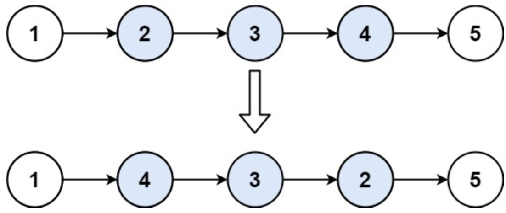
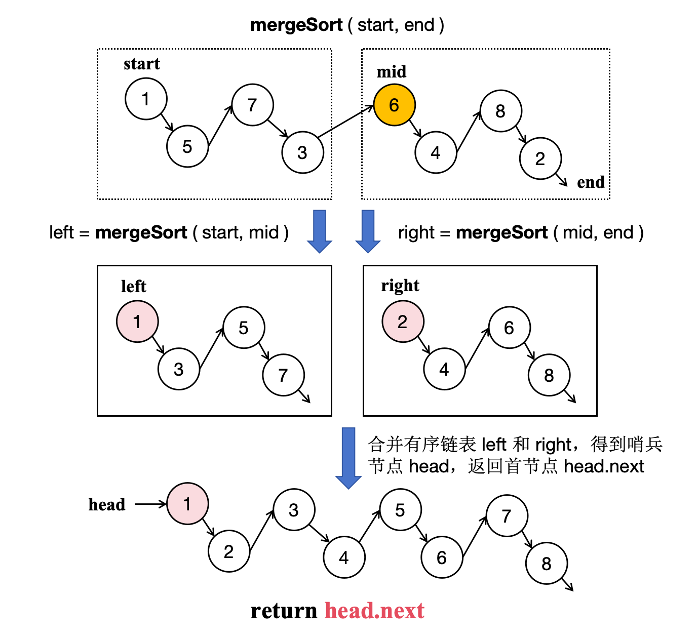
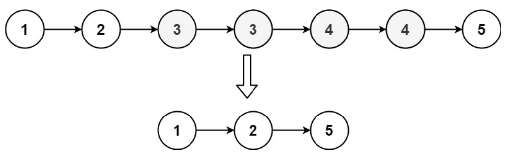
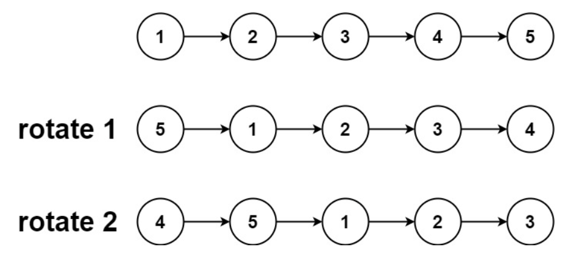
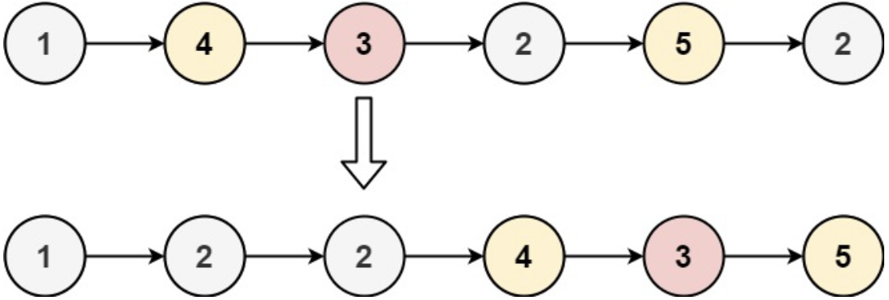

# 六、链表

## 6.1 链表遍历

### 相交链表 ⭐️⭐️

给你两个单链表的头节点 headA 和 headB ，请你找出并返回两个单链表相交的起始节点。如果两个链表不存在相交节点，返回 null 。

题目数据 保证 整个链式结构中不存在环。

注意，函数返回结果后，链表必须 保持其原始结构 。

**示例**

- 输入：intersectVal = 8, listA = [4,1,8,4,5], listB = [5,6,1,8,4,5], skipA = 2, skipB = 3
- 输出：Intersected at '8'
- 解释：相交节点的值为 8 （注意，如果两个链表相交则不能为 0）。
  从各自的表头开始算起，链表 A 为 [4,1,8,4,5]，链表 B 为 [5,6,1,8,4,5]。
  在 A 中，相交节点前有 2 个节点；在 B 中，相交节点前有 3 个节点。
  — 请注意相交节点的值不为 1，因为在链表 A 和链表 B 之中值为 1 的节点 (A 中第二个节点和 B 中第三个节点)
  是不同的节点。换句话说，它们在内存中指向两个不同的位置，而链表 A 和链表 B 中值为 8 的节点 (A 中第三个节点，B 中第四个节点)
  在内存中指向相同的位置。

**思路**

- 集合：遍历一遍链表 `A`，并将节点放置在集合中。遍历一遍链表 `B`，判断节点是否出现在集合中。若出现则为相交的起始节点。
- 双指针：双指针分别位于两个链表开头，当前链表走完就去另一个链表的开头，直到双指针相遇。

**代码**
集合：

```java
public class Solution {
    public ListNode getIntersectionNode(ListNode headA, ListNode headB) {
        ListNode ptrA = headA;
        Set<ListNode> set = new HashSet<>();
        while (ptrA != null) {
            set.add(ptrA);
            ptrA = ptrA.next;
        }
        ListNode ptrB = headB;
        while (ptrB != null) {
            if (set.contains(ptrB)) {
                return ptrB;
            }
            ptrB = ptrB.next;
        }
        return null;
    }
}
```

双指针：

```java
public class Solution {
    public ListNode getIntersectionNode(ListNode headA, ListNode headB) {
        if (headA == null || headB == null) {
            return null;
        }
        ListNode pA = headA, pB = headB;
        while (pA != pB) {
            pA = pA == null ? headB : pA.next;
            pB = pB == null ? headA : pB.next;
        }
        return pA;
    }
}
```

### 回文链表 ⭐️⭐️

给你一个单链表的头节点 `head` ，请你判断该链表是否为
回文链表。如果是，返回 `true` ；否则，返回 `false` 。

**示例**

- 输入：head = [1,2,2,1]
- 输出：true

**思路**

- 遍历构造数组/字符串秒了。空间复杂度 `O(n)`。

**代码**

```java
class Solution {
    public boolean isPalindrome(ListNode head) {
        List<Integer> listNodes = new ArrayList<>();
        ListNode ptr = head;
        while (ptr != null) {
            listNodes.add(ptr.val);
            ptr = ptr.next;
        }
        Integer[] arr = listNodes.toArray(new Integer[0]);
        // 首位双指针判定是否为回文
        int i = 0;
        int j = arr.length - 1;
        while (i < j) {
            if (arr[i] != arr[j]) {
                return false;
            }
            i++;
            j--;
        }
        return true;
    }
}
```

### 环形链表 ⭐️⭐️

给你一个链表的头节点 `head` ，判断链表中是否有环。

如果链表中有某个节点，可以通过连续跟踪 `next` 指针再次到达，则链表中存在环。 为了表示给定链表中的环，评测系统内部使用整数
pos 来表示链表尾连接到链表中的位置（索引从 0 开始）。注意：`pos` 不作为参数进行传递 。仅仅是为了标识链表的实际情况。

如果链表中存在环 ，则返回 `true` 。 否则，返回 `false` 。

**示例**

- 输入：head = [3,2,0,-4], pos = 1
- 输出：true
- 解释：链表中有一个环，其尾部连接到第二个节点。

**思路**

- 空间复杂度 `O(n)`：用集合存储访问过的节点。
- 空间复杂度 `O(1)`：快慢指针算法，`fast` 和 `slow` 初始为 `head`。`fast` 每次循环移两个节点， `slow`
  每次循环移一个节点，如果某个时刻两个指针指向同一节点则存在环。直到 `fast` 结束循环。

**代码**

```java
public class Solution {
    public boolean hasCycle(ListNode head) {
        if (head == null || head.next == null) {
            return false;
        }
        ListNode fast = head;
        ListNode slow = head;
        while (fast != null) {
            slow = slow.next;
            fast = fast.next;
            if (fast != null) {
                fast = fast.next;
            }
            if (slow == fast) {
                return true;
            }
        }
        return false;
    }
}
```

### 环形链表 II ⭐️⭐️⭐️

给定一个链表的头节点  `head` ，返回链表开始入环的第一个节点。 如果链表无环，则返回 `null`。

如果链表中有某个节点，可以通过连续跟踪 next 指针再次到达，则链表中存在环。 为了表示给定链表中的环，评测系统内部使用整数 pos
来表示链表尾连接到链表中的位置（索引从 0 开始）。如果 `pos` 是 -1，则在该链表中没有环。注意：`pos` 不作为参数进行传递，仅仅是为了标识链表的实际情况。

不允许修改链表。

**示例**

- 输入：head = [3,2,0,-4], pos = 1
- 输出：返回索引为 1 的链表节点
- 解释：链表中有一个环，其尾部连接到第二个节点。

**思路**

- 空间复杂度 `O(n)`：遍历节点并将已访问的节点加入集合，遇到的第一个已在集合中的节点即为答案。
- 空间复杂度 `O(1)`：在快慢指针算法的基础上，如果 `fast` 和 `slow` 相遇，则设置两个同速指针`p1`、`p2`
  ，一个从相遇点开始，一个从 `head` 开始循环遍历，直到 `p1` 和 `p2` 相遇，即为答案。

**代码**

```java
class Solution {
    public ListNode detectCycle(ListNode head) {
        if (head == null || head.next == null) {
            return null;
        }
        ListNode slow = head;
        ListNode fast = head;

        while (fast != null) {
            slow = slow.next;
            fast = fast.next;
            if (fast != null) {
                fast = fast.next;
            }
            if (slow == fast) {
                ListNode p1 = head;
                ListNode p2 = slow;
                while (p1 != p2) {
                    p1 = p1.next;
                    p2 = p2.next;
                }
                return p1;
            }
        }
        return null;
    }
}
```

### 合并两个有序链表 ⭐️⭐️

将两个升序链表合并为一个新的 升序 链表并返回。新链表是通过拼接给定的两个链表的所有节点组成的。

**示例**

- 输入：l1 = [1,2,4], l2 = [1,3,4]
- 输出：[1,1,2,3,4,4]

**思路**

- 与有序数组合并一致，使用双指针，每次比较，较小的指针++。

**代码**

```java
class Solution {
    public ListNode mergeTwoLists(ListNode l1, ListNode l2) {
        ListNode dummy = new ListNode(-1);
        ListNode cur = dummy;

        while (l1 != null && l2 != null) {
            if (l1.val <= l2.val) {
                cur.next = l1;
                l1 = l1.next;
            } else {
                cur.next = l2;
                l2 = l2.next;
            }
            cur = cur.next;
        }
        // 合并后 l1 和 l2 最多只有一个还未被合并完，我们直接将链表末尾指向未合并完的链表即可
        cur.next = l1 == null ? l2 : l1;
        return dummy.next;
    }
}
```

### 合并 K 个升序链表 ⭐️⭐️⭐️

给你一个链表数组，每个链表都已经按升序排列。

请你将所有链表合并到一个升序链表中，返回合并后的链表。

**示例**

- 输入：lists = \[[1,4,5],[1,3,4],[2,6]]
- 输出：[1,1,2,3,4,4,5,6]
- 解释：链表数组如下：
  [
  1->4->5,
  1->3->4,
  2->6
  ]
  将它们合并到一个有序链表中得到。
  1->1->2->3->4->4->5->6

**思路**

- 暴力法：遍历每个链表，把节点加入优先队列排序再重新组织节点。
- 顺序合并：顺序两两合并。（参考合并两个有序链表的代码）

**代码**
暴力法：

```java
class Solution {
    public ListNode mergeKLists(ListNode[] lists) {
        if (lists.length == 0) {
            return null;
        }
        PriorityQueue<ListNode> pq = new PriorityQueue<>((node1, node2) -> node1.val - node2.val);
        for (ListNode head : lists) {
            while (head != null) {
                pq.add(head);
                head = head.next;
            }
        }
        if (pq.isEmpty()) {
            return null;
        }
        ListNode head = pq.poll();
        ListNode ptr = head;
        while (!pq.isEmpty()) {
            ptr.next = pq.poll();
            ptr = ptr.next;
        }
        ptr.next = null;
        return head;
    }
}
```

顺序合并：

```java
class Solution {
    public ListNode merge2Lists(ListNode list1, ListNode list2) {
        ListNode head = new ListNode(-1);
        ListNode cur = head;
        while (list1 != null && list2 != null) {
            if (list1.val < list2.val) {
                cur.next = list1;
                list1 = list1.next;
            } else {
                cur.next = list2;
                list2 = list2.next;
            }
            cur = cur.next;
        }
        cur.next = list1 == null ? list2 : list1;
        return head.next;
    }

    public ListNode mergeKLists(ListNode[] lists) {
        int n = lists.length;
        if (n == 0) {
            return null;
        }
        if (n == 1) {
            return lists[0];
        }
        ListNode ans = lists[0];
        for (int i = 1; i < n; i++) {
            ans = merge2Lists(ans, lists[i]);
        }
        return ans;
    }
}
```

### 两数相加 ⭐️⭐️⭐️

给你两个 非空 的链表，表示两个非负的整数。它们每位数字都是按照 逆序 的方式存储的，并且每个节点只能存储 一位 数字。

请你将两个数相加，并以相同形式返回一个表示和的链表。

你可以假设除了数字 0 之外，这两个数都不会以 0 开头。

**示例**

- 输入：l1 = [2,4,3], l2 = [5,6,4]
- 输出：[7,0,8]
- 解释：342 + 465 = 807.

**思路**

- 邪道思路：转换成大数加法，使用 `java.math.BigInteger` 类。
- 常规思路：模拟加法竖式，记录当前进位 `carry`。

**代码**

```java
class Solution {
    public ListNode addTwoNumbers(ListNode l1, ListNode l2) {
        ListNode dummy = new ListNode(0);
        ListNode cur = dummy;
        int carry = 0;

        while (l1 != null || l2 != null || carry > 0) {
            int sum = carry;
            if (l1 != null) {
                sum += l1.val;
                l1 = l1.next;
            }
            if (l2 != null) {
                sum += l2.val;
                l2 = l2.next;
            }
            carry = sum / 10;
            cur.next = new ListNode(sum % 10);
            cur = cur.next;
        }
        return dummy.next;
    }
}
```

### 随机链表的复制 ⭐️⭐️⭐️

给你一个长度为 `n` 的链表，每个节点包含一个额外增加的随机指针 random ，该指针可以指向链表中的任何节点或空节点。

构造这个链表的 深拷贝。 深拷贝应该正好由 `n` 个 全新 节点组成，其中每个新节点的值都设为其对应的原节点的值。新节点的 next
指针和 random
指针也都应指向复制链表中的新节点，并使原链表和复制链表中的这些指针能够表示相同的链表状态。复制链表中的指针都不应指向原链表中的节点 。

例如，如果原链表中有 `X` 和 `Y` 两个节点，其中 `X.random --> Y` 。那么在复制链表中对应的两个节点 `x` 和 `y`
，同样有 `x.random --> y` 。

返回复制链表的头节点。

用一个由 `n` 个节点组成的链表来表示输入/输出中的链表。每个节点用一个 `[val, random_index]` 表示：

- `val`：一个表示 `Node.val` 的整数。
- `random_index`：随机指针指向的节点索引（范围从 0 到 `n-1`）；如果不指向任何节点，则为 `null` 。
  你的代码 只 接受原链表的头节点 `head` 作为传入参数。

**示例**

- 输入：head = \[[7,null],[13,0],[11,4],[10,2],[1,0]]
- 输出：\[[7,null],[13,0],[11,4],[10,2],[1,0]]

**思路**

- 采用哈希表记录原始节点到克隆节点的映射。
- 对于每个节点新建一个值相等的节点对象。然后递归克隆其 `next` 和 `random` 字段。
- 如果当前待克隆的节点已在哈希表中出现，则直接返回其在哈希表中已有的克隆节点。

**代码**

```java
class Solution {
    Map<Node, Node> map = new HashMap<>();

    Node clone(Node node) {
        if (node == null) {
            return null;
        }
        if (map.containsKey(node)) {
            return map.get(node);
        }
        Node cloneNode = new Node(node.val);
        map.put(node, cloneNode);
        cloneNode.next = (clone(node.next));
        cloneNode.random = (clone(node.random));
        return cloneNode;
    }

    public Node copyRandomList(Node head) {
        return clone(head);
    }
}
```

## 6.2 链表操作

### 反转链表 ⭐️⭐️

给你单链表的头节点 `head` ，请你反转链表，并返回反转后的链表。

**示例**

- 输入：head = [1,2,3,4,5]
- 输出：[5,4,3,2,1]

**思路**

- 将头节点的 `next` 指向 `null`。
- 双指针指向相邻节点 `ptr1->ptr2`，然后逐步反转。
- 需要预先记录 `ptr2` 初始的 `next`，方便后续推进。

**代码**

```java
class Solution {
     public ListNode reverseList(ListNode head) {
        if (head == null) {
            return null;
        }
        ListNode ptr1 = head;
        ListNode ptr2 = head.next;
        ptr1.next = null;
        while (ptr2 != null) {
            ListNode temp = ptr2.next;
            ptr2.next = ptr1;
            ptr1 = ptr2;
            ptr2 = temp;
        }
        return ptr1;
    }
}
```

### 反转链表 II ⭐️⭐️⭐️

给你单链表的头指针 `head` 和两个整数 `left` 和 `right` ，其中 `left <= right` 。请你反转从位置 `left` 到位置 `right`
的链表节点，返回 反转后的链表 。

**示例**

- 输入：head = [1,2,3,4,5], left = 2, right = 4
- 输出：[1,4,3,2,5]
- 

**思路**

- 加入哨兵节点防止边缘情况。
- 定位到需要反转的部分，使用相邻双指针 `ptr1` 和 `ptr2` 对区间节点进行反转。
- 处理好区间边缘节点的 `next` 指针。

**代码**

```java
class Solution {
    public ListNode reverseBetween(ListNode head, int left, int right) {
        if (left == right) {
            return head;
        }
        // 加入哨兵节点
        ListNode dummy = new ListNode(-1, head);
        int index = 1;
        ListNode ptr = head;
        ListNode pre = dummy;
        // 找到需要反转的起始节点 ptr
        while (index < left) {
            index++;
            pre = ptr;
            ptr = ptr.next;
        }
        // 反转
        ListNode ptr1 = ptr;
        ListNode ptr2 = ptr.next;
        while (index < right) {
            ListNode temp = ptr2.next;
            ptr2.next = ptr1;
            ptr1 = ptr2;
            ptr2 = temp;
            index++;
        }
        // 处理反转区间的头尾
        pre.next = ptr1;
        ptr.next = ptr2;
        return dummy.next;
    }
}
```

### 删除链表的倒数第N个节点 ⭐️⭐️

给你一个链表，删除链表的倒数第 `n` 个结点，并且返回链表的头结点。

**示例**

- 输入：head = [1,2,3,4,5], n = 2
- 输出：[1,2,3,5]

**思路**

- 邪道思路：将链表的节点加入数组中，然后改变目标节点前一个节点的 `next`。
- 双指针：使用两个指针 `first` 和 `second` 同时对链表进行遍历，并且 `first` 比 `second` 超前 `n` 个节点。当 `first`
  遍历到链表的末尾时，`second` 就恰好处于倒数第 `n` 个节点。

**代码**

```java
class Solution {
    public ListNode removeNthFromEnd(ListNode head, int n) {
        ListNode dummy = new ListNode(0, head);
        ListNode first = head;
        ListNode second = dummy;
        for (int i = 0; i < n; ++i) {
            first = first.next;
        }
        while (first != null) {
            first = first.next;
            second = second.next;
        }
        second.next = second.next.next;
        ListNode ans = dummy.next;
        return ans;
    }
}
```

### 两两交换链表中的节点 ⭐️⭐️⭐️

给你一个链表，两两交换其中相邻的节点，并返回交换后链表的头节点。你必须在不修改节点内部的值的情况下完成本题（即，只能进行节点交换）。

**示例**

- 输入：head = [1,2,3,4]
- 输出：[2,1,4,3]

**思路**

- 设置相邻双指针 `left`

**代码**

```java
class Solution {
    public ListNode swapPairs(ListNode head) {
        if (head == null) {
            return null;
        }
        if (head.next == null) {
            return head;
        }
        ListNode dummy = new ListNode(-1, head);
        ListNode pre = dummy;
        ListNode left = head;
        while (left != null && left.next != null) {
            ListNode right = left.next;
            ListNode temp = left.next.next;
            
            left.next = temp;
            right.next = left;
            pre.next = right;

            pre = left;
            left = temp;
        }
        return dummy.next;
    }
}
```

### K个一组翻转链表 ⭐️⭐️⭐️⭐️

给你链表的头节点 `head` ，每 `k` 个节点一组进行翻转，请你返回修改后的链表。

`k` 是一个正整数，它的值小于或等于链表的长度。如果节点总数不是 `k` 的整数倍，那么请将最后剩余的节点保持原有顺序。

你不能只是单纯的改变节点内部的值，而是需要实际进行节点交换。

**示例**

- 输入：head = [1,2,3,4,5], k = 2
- 输出：[2,1,4,3,5]

**思路**

- 与上一题类似
- 指针含义：
    - `pre`：上一区块调整完毕后最后一个节点。
    - `next`：下一区块开始节点。
    - `ptr1, ptr2`：用于翻转相邻节点，与反转链表代码一致。
- 在确定 `next` 的循环中如果 `next` 提前为 `null`，则表示后面不足 `k` 个节点，可以直接返回。

**代码**

```java
class Solution {
    public ListNode reverseKGroup(ListNode head, int k) {
        if (head.next == null) {
            return head;
        }
        ListNode dummy = new ListNode(-1, head);

        // pre指向前一组需要调整的k个节点的开头（调整完后变结尾）
        ListNode pre = dummy;
        ListNode ptr = head;

        while (ptr != null) {
            // next指向下一区块需要调整的k个节点的开头
            ListNode next = ptr;
            for (int i = 0; i < k; i++) {
                // 如果next提前为null表示不足k个，直接结束
                if (next == null) {
                    return dummy.next;
                }
                next = next.next;
            }
            // next节点前反转
            ListNode ptr1 = ptr;
            ListNode ptr2 = ptr.next;
            ptr1.next = next;
            while (ptr2 != next) {
                ListNode temp = ptr2.next;
                ptr2.next = ptr1;
                ptr1 = ptr2;
                ptr2 = temp;
            }
            pre.next = ptr1;

            pre = ptr; //此时ptr为当前区块（调整完后）最后一个节点
            ptr = next; //进入下一区块
        }
        return dummy.next;
    }
}
```

### 排序链表 ⭐️⭐️⭐️⭐️

给你链表的头结点 `head` ，请将其按 升序 排列并返回 排序后的链表 。

**示例**

- 输入：head = [4,2,1,3]
- 输出：[1,2,3,4]

**思路**

- 暴力法：遍历节点依次加入优先队列，再重构链表，时间复杂度 `O(nlogn)`。
- 归并排序：
    - 归并递归函数返回的是排好序后链表的首节点。
    - 使用快慢指针确定一段链表的中点。即快指针到达终点时慢指针所在位置。
    - 在 `[start,end)` 的区间设计中，如果 `start.next==end`，表示当前为单节点，需要将 `start.next` 置为 `null`
      再返回 `start`。


**代码**
暴力法：

```java
class Solution {
    public ListNode sortList(ListNode head) {
        if (head == null) {
            return null;
        }
        PriorityQueue<ListNode> pq = new PriorityQueue<>((node1, node2) -> node1.val - node2.val);

        ListNode ptr = head;
        while (ptr != null) {
            pq.add(ptr);
            ptr = ptr.next;
        }

        head = pq.poll();
        ptr = head;
        while (!pq.isEmpty()) {
            ptr.next = pq.poll();
            ptr = ptr.next;
        }
        ptr.next = null;
        return head;
    }
}
```

归并排序：

```java
class Solution {
    ListNode mergeSort(ListNode start, ListNode end) {
        if (start.next == end) {
            // 需要注意需要返回独立链表，因此最后节点next为null
            start.next = null;
            return start;
        }
        ListNode slow = start;
        ListNode fast = start;
        while (fast != end) {
            slow = slow.next;
            fast = fast.next;
            if (fast != end) {
                fast = fast.next;
            }
        }
        ListNode mid = slow;

        ListNode left = mergeSort(start, mid);
        ListNode right = mergeSort(mid, end);
        // 合并有序链表，需要注意的是left和right是两个独立的链表，最后节点的next都为null
        ListNode head = new ListNode(-1);
        ListNode cur = head;
        ListNode ptr1 = left;
        ListNode ptr2 = right;
        while (ptr1 != null && ptr2 != null) {
            if (ptr1.val < ptr2.val) {
                cur.next = ptr1;
                ptr1 = ptr1.next;
            } else {
                cur.next = ptr2;
                ptr2 = ptr2.next;
            }
            cur = cur.next;
        }
        cur.next = ptr1 == null ? ptr2 : ptr1;
        return head.next;
    }

    public ListNode sortList(ListNode head) {
        return head == null ? null : mergeSort(head, null);
    }
}
```

### 删除排序列表中的重复元素 II ⭐️⭐️⭐️

给定一个已排序的链表的头 `head` ， 删除原始链表中所有重复数字的节点，只留下不同的数字 。返回 已排序的链表 。

**示例**

- 输入：head = [1,2,3,3,4,4,5]
- 输出：[1,2,5]
- 

**思路**

- 相邻双指针 `pre` 和 `ptr`。 如果检测到 `ptr` 和 `ptr.next` 值相等，则 `ptr` 向后遍历，直到 `ptr.next`
  指向值不等的节点或 `null`，让 `pre` 指向这个节点。

**代码**

```java
class Solution {
    public ListNode deleteDuplicates(ListNode head) {
        // 创建虚拟头节点，方便处理边界情况
        ListNode dummy = new ListNode(-1, head);
        ListNode pre = dummy;
        ListNode ptr = head;

        while (ptr != null) {
            // 检查当前节点是否为重复节点
            if (ptr.next != null && ptr.val == ptr.next.val) {
                // 跳过所有重复的节点
                while (ptr.next != null && ptr.val == ptr.next.val) {
                    ptr = ptr.next;
                }
                // pre.next 指向非重复节点
                pre.next = ptr.next;
            } else {
                pre = pre.next;
            }
            ptr = ptr.next;
        }
        return dummy.next;
    }
}
```

### 旋转链表 ⭐️⭐️⭐️

给你一个链表的头节点 `head` ，旋转链表，将链表每个节点向右移动 `k` 个位置。

**示例**

- 输入：head = [1,2,3,4,5], k = 2
- 输出：[4,5,1,2,3]
- 

**思路**

- 先统计节点总数 `n`，注意到旋转后 `head` 的下标（从 0 开始）是 `n - (k % n)`。
- 将链表最后一个节点指向头结点形成环。
- 从头结点开始，相邻双指针 `pre` 和 `ptr` 遍历到下标为 `n - (k % n) ` 的 `ptr` 节点。
- 将 `pre` 指向 `null`，返回 `ptr` 作为头结点即可。

**代码**

```java
class Solution {
    public ListNode rotateRight(ListNode head, int k) {
        if (head == null || head.next == null) {
            return head;
        }
        int n = 1;
        ListNode ptr = head;
        while (ptr.next != null) {
            ptr = ptr.next;
            n++;
        }
        // 成环
        ptr.next = head;
        // 遍历到对应位置，拆环
        ptr = head;
        for (int i = 0; i < n - (k % n) - 1; i++) {
            ptr = ptr.next;
        }
        ListNode newHead = ptr.next;
        ptr.next = null;
        return newHead;
    }
}
```

### 分隔链表 ⭐️⭐️⭐️

给你一个链表的头节点 `head` 和一个特定值 `x` ，请你对链表进行分隔，使得所有 小于 `x` 的节点都出现在 大于或等于 `x` 的节点之前。

你应当 保留 两个分区中每个节点的初始相对位置。

**示例**

- 输入：head = [1,4,3,2,5,2], x = 3
- 输出：[1,2,2,4,3,5]
- 

**思路**

- 将比 `x` 小的节点从原链表中移除组成新的链表。
- 将新链表最后一个节点指向原链表头结点，拼接成新的链表。

**代码**

```java
class Solution {
    public ListNode partition(ListNode head, int x) {
        if (head == null || head.next == null) {
            return head;
        }
        ListNode dummyRight = new ListNode(-1, head);
        ListNode dummyLeft = new ListNode(-1);
        ListNode cur = dummyLeft;

        ListNode ptr = dummyRight;
        while (ptr.next != null) {
            if (ptr.next.val < x) {
                // 移除节点到 cur
                cur.next = ptr.next;
                cur = cur.next;
                ptr.next = ptr.next.next;
            } else {
                ptr = ptr.next;
            }
        }
        cur.next = dummyRight.next;
        return dummyLeft.next;
    }
}
```

### 重排链表 ⭐️⭐️⭐️

给定一个单链表 `L` 的头节点 `head` ，单链表 `L` 表示为：

`L0 → L1 → … → Ln - 1 → Ln`
请将其重新排列后变为：

`L0 → Ln → L1 → Ln - 1 → L2 → Ln - 2 → …`
不能只是单纯的改变节点内部的值，而是需要实际的进行节点交换。

**示例**

- 输入：head = [1,2,3,4]
- 输出：[1,4,2,3]

**思路**

- 直接无脑转换为线性表然后随机访问，重构链表。

**代码**

```java
class Solution {
    public void reorderList(ListNode head) {
        List<ListNode> list = new ArrayList<>();
        ListNode ptr = head;
        while (ptr != null) {
            list.add(ptr);
            ptr = ptr.next;
        }
        int n = list.size();
        ListNode dummy = new ListNode(-1, head);
        ListNode cur = dummy;
        for (int i = 0; i < n - i; i++) {
            cur.next = list.get(i);
            cur = cur.next;
            if (i < n - 1 - i) {
                cur.next = list.get(n - 1 - i);
                cur = cur.next;
            }
        }
        cur.next = null;
    }
}
```

## 6.3 双向链表

### LRU缓存 ⭐️⭐️⭐️⭐️⭐️

请你设计并实现一个满足 LRU (最近最少使用) 缓存 约束的数据结构。
实现 `LRUCache` 类：

- `LRUCache(int capacity)` 以 正整数 作为容量 `capacity` 初始化 LRU 缓存
- `int get(int key)` 如果关键字 `key` 存在于缓存中，则返回关键字的值，否则返回 -1 。
- `void put(int key, int value)` 如果关键字 `key` 已经存在，则变更其数据值 `value`
  ；如果不存在，则向缓存中插入该组 `key-value` 。如果插入操作导致关键字数量超过 `capacity` ，则应该 逐出 最久未使用的关键字。
- 函数 `get` 和 `put` 必须以 O(1) 的平均时间复杂度运行。

**示例**

- 输入
  ["LRUCache", "put", "put", "get", "put", "get", "put", "get", "get", "get"]
  \[[2], [1, 1], [2, 2], [1], [3, 3], [2], [4, 4], [1], [3], [4]]
- 输出
  [null, null, null, 1, null, -1, null, -1, 3, 4]

- 解释
    - LRUCache lRUCache = new LRUCache(2);
    - lRUCache.put(1, 1); // 缓存是 {1=1}
    - lRUCache.put(2, 2); // 缓存是 {1=1, 2=2}
    - lRUCache.get(1); // 返回 1
    - lRUCache.put(3, 3); // 该操作会使得关键字 2 作废，缓存是 {1=1, 3=3}
    - lRUCache.get(2); // 返回 -1 (未找到)
    - lRUCache.put(4, 4); // 该操作会使得关键字 1 作废，缓存是 {4=4, 3=3}
    - lRUCache.get(1); // 返回 -1 (未找到)
    - lRUCache.get(3); // 返回 3
    - lRUCache.get(4); // 返回 4

**思路**

- 使用哈希表 + 双向链表。
- 方法一：使用内置的数据结构 `LinkedHashMap` 实现。
- 方法二：自行实现双向链表:
    - 双向链表按照被使用的顺序存储了这些键值对，靠近头部的键值对是最近使用的，而靠近尾部的键值对是最久未使用的。
    - 哈希表即为普通的哈希映射（HashMap），通过缓存数据的键映射到其在双向链表中的位置。

**代码**
内置数据结构 `LinkedHashMap`

```java
class LRUCache extends LinkedHashMap<Integer, Integer>{
    private int capacity;
    
    public LRUCache(int capacity) {
        super(capacity, 0.75F, true);
        this.capacity = capacity;
    }

    public int get(int key) {
        return super.getOrDefault(key, -1);
    }

    public void put(int key, int value) {
        super.put(key, value);
    }

    @Override
    protected boolean removeEldestEntry(Map.Entry<Integer, Integer> eldest) {
        return size() > capacity; 
    }
}
```

自行实现

```java
class DListNode {
    int key;
    int value;
    DListNode prev;
    DListNode next;

    public DListNode(int key, int value, DListNode pre, DListNode next) {
        this.key = key;
        this.value = value;
        this.prev = pre;
        this.next = next;
    }
}

class LRUCache {
    int capacity;
    DListNode head;
    DListNode tail;
    Map<Integer, DListNode> map;

    public LRUCache(int capacity) {
        this.capacity = capacity;
        head = new DListNode(-1, -1, null, null);
        tail = new DListNode(-1, -1, null, null);
        head.next = tail;
        tail.prev = head;
        map = new HashMap<>();
    }

    public int get(int key) {
        if (map.containsKey(key)) {
            DListNode node = map.get(key);
            refresh(node);
            return node.value;
        } else {
            return -1;
        }
    }

    public void put(int key, int value) {
        if (map.containsKey(key)) {
            DListNode node = map.get(key);
            node.value = value;
            refresh(node);
        } else {
            DListNode node = new DListNode(key, value, null, null);
            map.put(key, node);
            addToHead(node);
            if (map.size() > capacity) {
                // 超出容量，删除最后一个节点
                map.remove(tail.prev.key);
                removeNode(tail.prev);
            }
        }
    }

    // 刷新节点（从原有位置移动到头部节点）
    private void refresh(DListNode node) {
        removeNode(node);
        addToHead(node);
    }

    // 删除一个节点
    private void removeNode(DListNode node) {
        node.prev.next = node.next;
        node.next.prev = node.prev;
    }

    // 将节点添加到头部
    private void addToHead(DListNode node) {
        node.prev = head;
        node.next = head.next;
        node.next.prev = node;
        head.next = node;
    }
}
```
