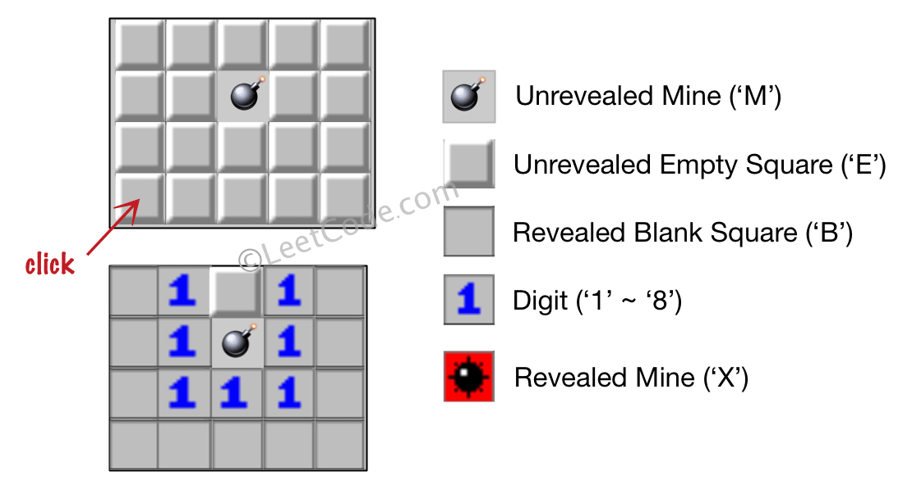
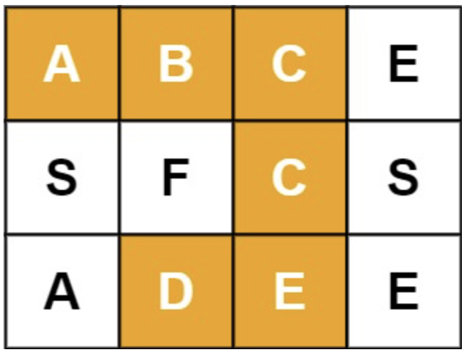
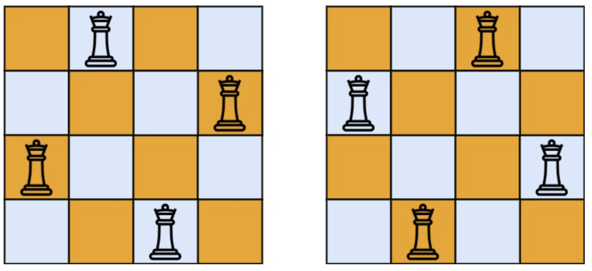
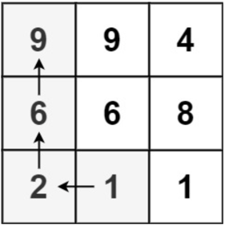

# 十、回溯

## 10.1 排列组合

### 全排列 ⭐️⭐️

给定一个不含重复数字的数组 `nums` ，返回其 所有可能的全排列 。你可以 按任意顺序 返回答案。

**示例**

- 输入：nums = [1,2,3]
- 输出：\[[1,2,3],[1,3,2],[2,1,3],[2,3,1],[3,1,2],[3,2,1]]

**思路**

- DFS。对当前需要填写的下标 `index` 进行搜索，填写当前分支中未访问过的一个数字。

**代码**

```java
class Solution {
    List<List<Integer>> ans = new ArrayList<>();

    void dfs(int index, int[] nums, boolean[] vis, List<Integer> res) {
        if (index == nums.length) {
            ans.add(new ArrayList<>(res));
            return;
        }
        for (int i = 0; i < nums.length; i++) {
            if (!vis[i]) {
                res.add(nums[i]);
                vis[i] = true;

                dfs(index + 1, nums, vis, res);

                res.remove(res.size() - 1);
                vis[i] = false;
            }
        }
    }

    public List<List<Integer>> permute(int[] nums) {
        boolean[] vis = new boolean[nums.length];
        dfs(0, nums, vis, new ArrayList<>());
        return ans;
    }
}
```

### 全排列 II ⭐️⭐️⭐️

给定一个可包含重复数字的序列 `nums` ，按任意顺序 返回所有不重复的全排列。

**示例**

- 输入：nums = [1,1,2]
- 输出：
  \[[1,1,2],
  [1,2,1],
  [2,1,1]]

**思路**

- 对 `nums` 进行排序。
- 扩展分支时需要判断，如果当前字符与上一个字符是否相等且上一个字符还未访问，则不扩展。

**代码**

```java
class Solution {
    List<List<Integer>> ans = new ArrayList<>();

    void dfs(int[] nums, int index, List<Integer> res, boolean[] vis) {
        if (index == nums.length) {
            ans.add(new ArrayList<>(res));
            return;
        }

        for (int i = 0; i < nums.length; i++) {
            if (vis[i] || (i > 0 && nums[i] == nums[i - 1] && !vis[i - 1])) {
                continue;
            }
            res.add(nums[i]);
            vis[i] = true;
            dfs(nums, index + 1, res, vis);
            res.remove(res.size() - 1);
            vis[i] = false;
        }
    }

    public List<List<Integer>> permuteUnique(int[] nums) {
        int n = nums.length;
        Arrays.sort(nums);
        boolean[] vis = new boolean[n];
        dfs(nums, 0, new ArrayList<>(), vis);
        return ans;
    }
}
```

### 子集 ⭐️⭐️

给你一个整数数组 `nums` ，数组中的元素 互不相同 。返回该数组所有可能的
子集（幂集）。解集 不能 包含重复的子集。你可以按 任意顺序 返回解集。

**示例**

- 输入：nums = [1,2,3]
- 输出：\[[],[1],[2],[1,2],[3],[1,3],[2,3],[1,2,3]]

**思路**

- 注意到对于下标 `n`，有 `subset(n) = subset(n-1) U subset(n-1).forEachInsert(n)`，从 `nums.length-1` 向下回溯。

**代码**

```java
class Solution {
    List<List<Integer>> ans = new ArrayList<>();

    void dfs(int[] nums, int index) {
        if (index < 0) {
            ans.add(new ArrayList<>());
            return;
        }
        dfs(nums, index - 1);
        int size = ans.size();
        for (int i = 0; i < size; i++) {
            ans.add(new ArrayList<>(ans.get(i)));
            ans.get(i).add(nums[index]);
        }
    }

    public List<List<Integer>> subsets(int[] nums) {
        dfs(nums, nums.length - 1);
        return ans;
    }
}
```

### 子集 II ⭐️⭐️⭐

给你一个整数数组 `nums` ，其中可能包含重复元素，请你返回该数组所有可能的
子集
（幂集）。

解集 不能 包含重复的子集。返回的解集中，子集可以按 任意顺序 排列。

**示例**

- 输入：nums = [1,2,2]
- 输出：[[],[1],[1,2],[1,2,2],[2],[2,2]]

**思路**

- 与上题同理。
- 先将 `nums` 排序，以方便判断当前字符是否为重复字符。
- 如果为非重复字符，则将当前字符插入到**当前已生成的所有子集**中。
- 如果为重复字符，则将当前字符只插入到**上一轮生成的子集**中。

**代码**

```java
class Solution {
    List<List<Integer>> ans = new ArrayList<>();

    void dfs(int[] nums, int index, int from) {
        if (index >= nums.length) {
            return;
        }
        // 非重复数字从头开始
        if (index == 0 || nums[index] != nums[index - 1]) {
            from = 0;
        }
        // size 也是该轮插入的起始位置
        int size = ans.size();
        for (int i = from; i < size; i++) {
            List<Integer> temp = new ArrayList<>(ans.get(i));
            temp.add(nums[index]);
            ans.add(temp);
        }
        dfs(nums, index + 1, size);
    }

    public List<List<Integer>> subsetsWithDup(int[] nums) {
        Arrays.sort(nums);
        ans.add(new ArrayList<>());
        dfs(nums, 0, 0);
        return ans;
    }
}
```

### 组合总和 ⭐️⭐️

给你一个 无重复元素 的整数数组 `candidates` 和一个目标整数 `target` ，找出 `candidates` 中可以使数字和为目标数 `target` 的
所有 不同组合 ，并以列表形式返回。你可以按 任意顺序 返回这些组合。

`candidates` 中的 同一个 数字可以 无限制重复被选取 。如果至少一个数字的被选数量不同，则两种组合是不同的。

对于给定的输入，保证和为 `target` 的不同组合数少于 150 个。

**示例**

- 输入：candidates = [2,3,6,7], target = 7
- 输出：\[[2,2,3],[7]]
- 解释：
    - 2 和 3 可以形成一组候选，2 + 2 + 3 = 7 。注意 2 可以使用多次。
    - 7 也是一个候选， 7 = 7 。
    - 仅有这两种组合。

**思路**

- 扩展子节点的时候只需扩展该元素后面的元素，防止结果重复。
- dfs 搜索的过程中注意剪枝。

**代码**

```java
class Solution {
    List<List<Integer>> ans = new ArrayList<>();

    void dfs(int[] candidates, int index, int sum, int target, List<Integer> res) {
        // 剪枝
        if (sum > target) {
            return;
        }
        if (sum == target) {
            ans.add(new ArrayList<>(res));
            return;
        }
        for (int i = index; i < candidates.length; i++) {
            res.add(candidates[i]);
            dfs(candidates, i, sum + candidates[i], target, res);
            res.remove(res.size() - 1);
        }
    }

    public List<List<Integer>> combinationSum(int[] candidates, int target) {
        dfs(candidates, 0, 0, target, new ArrayList<>());
        return ans;
    }
}
```

### 组合总和 II ⭐️⭐️⭐

给定一个候选人编号的集合 `candidates` 和一个目标数 `target` ，找出 `candidates` 中所有可以使数字和为 `target` 的组合。
`candidates` 中的每个数字在每个组合中只能使用 一次 。
注意：解集不能包含重复的组合。

**示例**

- 输入: candidates = [10,1,2,7,6,1,5], target = 8,
- 输出:
  \ [[1,1,6],
  [1,2,5],
  [1,7],
  [2,6]]

**思路**

- 与全排列II类似，需要对重复元素进行处理。
- 对条件进行解释：如果不进行处理，会出现两个`[1,7]`。
    - `[1,1,6]` 合法，是因为两个 `1` 都位于同一个搜索分支，并且第一个 `1` 已被访问（`vis[i - 1] == true`）；
    - 出现两个 `[1,7]`，是因为两个 `1` 分别被不同的搜索分支访问。当访问到第二个 `1` 时，此时在它的分支中，第一个 `1`
      未被访问，即 `vis[i - 1] == false`，需要筛掉这种情况。
    - 因此，过滤条件为 `i > 0 && candidates[i] == candidates[i - 1] && !vis[i - 1]`。

**代码**

```java
class Solution {
    List<List<Integer>> ans = new ArrayList<>();

    void dfs(int[] candidates, boolean[] vis, int index, int sum, int target, List<Integer> res) {
        // 剪枝
        if (sum > target) {
            return;
        }
        if (sum == target) {
            ans.add(new ArrayList<>(res));
            return;
        }
        for (int i = index + 1; i < candidates.length; i++) {
            if (i > 0 && candidates[i] == candidates[i - 1] && !vis[i - 1]){
                continue;
            }
            res.add(candidates[i]);
            vis[i] = true;
            dfs(candidates, vis, i, sum + candidates[i], target, res);
            vis[i] = false;
            res.remove(res.size() - 1);
        }
    }

    public List<List<Integer>> combinationSum2(int[] candidates, int target) {
        Arrays.sort(candidates);
        int n = candidates.length;
        dfs(candidates, new boolean[n], -1, 0, target, new ArrayList<>());
        return ans;
    }
}
```

### 电话号码的字母组合 ⭐️⭐️

给定一个仅包含数字 2-9 的字符串，返回所有它能表示的字母组合。答案可以按 任意顺序 返回。

给出数字到字母的映射如下（与电话按键相同）。注意 1 不对应任何字母。


**示例**

- 输入：digits = "23"
- 输出：["ad","ae","af","bd","be","bf","cd","ce","cf"]

**思路**

- 建立数字和字母的对应关系，然后 DFS 搜索数字串中各个位置可能对应的字母。

**代码**

```java
class Solution {
    List<String> ans = new ArrayList<>();
    char[][] digitList = new char[][]{
            {},
            {}, {'a', 'b', 'c'}, {'d', 'e', 'f'},
            {'g', 'h', 'i'}, {'j', 'k', 'l'}, {'m', 'n', 'o'},
            {'p', 'q', 'r', 's'}, {'t', 'u', 'v'}, {'w', 'x', 'y', 'z'}
    };

    void dfs(String digits, int index, List<Character> res) {
        if (index == digits.length()) {
            StringBuilder sb = new StringBuilder();
            for (char c : res) {
                sb.append(c);
            }
            ans.add(sb.toString());
            return;
        }
        int digit = Integer.parseInt(String.valueOf(digits.charAt(index)));
        for (int i = 0; i < digitList[digit].length; i++) {
            res.add(digitList[digit][i]);
            dfs(digits, index + 1, res);
            res.remove(res.size() - 1);
        }
    }

    public List<String> letterCombinations(String digits) {
        dfs(digits, 0, new ArrayList<>());
        return !digits.isEmpty() ? ans : new ArrayList<>();
    }
}
```

### 组合 ⭐️⭐️

给定两个整数 `n` 和 `k`，返回范围 `[1, n]` 中所有可能的 k 个数的组合。

你可以按 任何顺序 返回答案。

**示例**

- 输入：n = 4, k = 2
- 输出：

```
[
  [2,4],
  [3,4],
  [2,3],
  [1,2],
  [1,3],
  [1,4],
]
```

**思路**

- dfs 搜索到满足数量后加入结果中。（注意一定要新建一个 `List` 对象）

**代码**

```java
class Solution {
    List<List<Integer>> ans = new ArrayList<>();

    void dfs(int x, int n, int index, int k, List<Integer> res) {
        if (index == k) {
            ans.add(new ArrayList<>(res));
            return;
        }
        for (int i = x + 1; i <= n; i++) {
            res.add(i);
            dfs(i, n, index + 1, k, res);
            res.remove(res.size() - 1);
        }
    }

    public List<List<Integer>> combine(int n, int k) {
        dfs(0, n, 0, k, new ArrayList<>());
        return ans;
    }
}
```

### 字典序排数 ⭐️️⭐️

给你一个整数 `n` ，按字典序返回范围 `[1, n]` 内所有整数。

你必须设计一个时间复杂度为 `O(n)` 且使用 `O(1)` 额外空间的算法。

**示例**

- 输入：n = 13
- 输出：[1,10,11,12,13,2,3,4,5,6,7,8,9]

**思路**

- dfs 搜索字典序，每次搜索下一个数字的时候，先搜索当前数字的子节点，再搜索下一个数字。

**代码**

```java
class Solution {
    List<Integer> ans = new ArrayList<>();

    void dfs(int x, int n) {
        if (x > n) {
            return;
        }
        ans.add(x);
        for (int i = 0; i < 10; i++) {
            dfs(x * 10 + i, n);
        }
    }

    public List<Integer> lexicalOrder(int n) {
        for (int i = 1; i <= 9; i++) {
            dfs(i, n);
        }
        return ans;
    }
}
```

### 复原 IP 地址 ⭐️⭐️⭐

有效 IP 地址 正好由四个整数（每个整数位于 `0` 到 `255` 之间组成，且不能含有前导 `0`），整数之间用 `.` 分隔。

例如：`0.1.2.201` 和 `192.168.1.1` 是 有效 IP 地址，但是 `0.011.255.245`、`192.168.1.312` 和 `192.168@1.1` 是 无效 IP 地址。
给定一个只包含数字的字符串 `s` ，用以表示一个 IP 地址，返回所有可能的有效 IP 地址，这些地址可以通过在 `s` 中插入 `.` 来形成。你
不能 重新排序或删除 `s` 中的任何数字。你可以按 任何 顺序返回答案。

**示例**

- 输入：s = "101023"
- 输出：["1.0.10.23","1.0.102.3","10.1.0.23","10.10.2.3","101.0.2.3"]

**思路**

- dfs 搜索当前下标处每个长度（1位、2位、3位）是否可以插入 `.`，并且满足 IP 地址的要求。

**代码**

```java
class Solution {
    List<String> ans = new ArrayList<>();

    void dfs(String s, int len, int index, List<String> res) {
        if (res.size() > 4) {
            return;
        }
        if (index >= s.length()) {
            if (res.size() == 4) {
                ans.add(String.join(".", res));
            }
            return;
        }
        // 1位
        res.add(String.valueOf(s.charAt(index)));
        dfs(s, len, index + 1, res);
        res.remove(res.size() - 1);
        // 无前导 0
        if (index < len - 1 && s.charAt(index) != '0') {
            // 2位
            res.add(s.substring(index, index + 2));
            dfs(s, len, index + 2, res);
            res.remove(res.size() - 1);
            // 3位
            if (index < len - 2 && Integer.parseInt(s.substring(index, index + 3)) < 256) {
                res.add(s.substring(index, index + 3));
                dfs(s, len, index + 3, res);
                res.remove(res.size() - 1);
            }
        }
    }

    public List<String> restoreIpAddresses(String s) {
        dfs(s, s.length(), 0, new ArrayList<>());
        return ans;
    }
}
```

## 10.2 字符串搜索

### 括号生成 ⭐️⭐️⭐️

数字 `n` 代表生成括号的对数，请你设计一个函数，用于能够生成所有可能的并且 有效的 括号组合。

**示例**

- 输入：n = 3
- 输出：["((()))","(()())","(())()","()(())","()()()"]

**思路**

- 记录当前添加的左括号数量 `open` 和右括号数量 `close`。
- 如果 `open < n` 表示当前还能继续添加左括号。
- 如果 `close < open` 表示当前还能继续添加右括号。

**代码**

```java
class Solution {
    List<String> ans = new ArrayList<>();

    void dfs(int open, int close, int n, StringBuilder sb) {
        if (close == n) {
            ans.add(sb.toString());
        }
        if (open < n) {
            sb.append('(');
            dfs(open + 1, close, n, sb);
            sb.deleteCharAt(sb.length() - 1);
        }
        if (close < open) {
            sb.append(')');
            dfs(open, close + 1, n, sb);
            sb.deleteCharAt(sb.length() - 1);
        }
    }

    public List<String> generateParenthesis(int n) {
        dfs(0, 0, n, new StringBuilder());
        return ans;
    }
}
```

### 分割回文串 ⭐️⭐️⭐️

给你一个字符串 `s`，请你将 `s` 分割成一些子串，使每个子串都是 回文串。返回 `s` 所有可能的分割方案。

**示例**

- 输入：s = "aab"
- 输出：\[["a","a","b"],["aa","b"]]

**思路**

- 预处理：使用 `dp[i][j]` 计算每个子串是否为回文串。
- dfs 搜索每个字符，枚举该字符后面是否切割。
- 如果切割，需要保证前一个切割处到此处的子串为回文串。
- 最后需要保证整个字符串切割完毕。（即上一个切割处 `from == index == s.length()` ）

**代码**

```java
class Solution {
    List<List<String>> ans = new ArrayList<>();

    void dfs(String s, int index, int from, List<String> res, boolean[][] dp) {
        if (index == s.length()) {
            if (from == index) {
                ans.add(new ArrayList<>(res));
            }
            return;
        }
        // 第一种，index 后不切割
        dfs(s, index + 1, from, res, dp);
        // 第二种，index 后切割
        if (dp[from][index]) {
            res.add(s.substring(from, index + 1));
            dfs(s, index + 1, index + 1, res, dp);
            res.remove(res.size() - 1);
        }
    }

    public List<List<String>> partition(String s) {
        int n = s.length();
        // 预处理，dp[i][j] 判断从 i 到 j 是否为回文串
        boolean[][] dp = new boolean[n][n];
        for (int i = 0; i < n; i++) {
            dp[i][i] = true;
        }
        for (int i = 0; i < n - 1; i++) {
            dp[i][i + 1] = s.charAt(i) == s.charAt(i + 1);
        }
        for (int i = n - 1; i >= 0; i--) {
            for (int j = i + 2; j < n; j++) {
                dp[i][j] = dp[i + 1][j - 1] && s.charAt(i) == s.charAt(j);
            }
        }
        dfs(s, 0, 0, new ArrayList<>(), dp);
        return ans;
    }
}
```

## 10.3 矩阵搜索

### 扫雷游戏 ⭐️⭐️

让我们一起来玩扫雷游戏！

给你一个大小为 `m x n` 二维字符矩阵 `board` ，表示扫雷游戏的盘面，其中：

- `M` 代表一个 未挖出的 地雷，
- `E` 代表一个 未挖出的 空方块，
- `B` 代表没有相邻（上，下，左，右，和所有4个对角线）地雷的 已挖出的 空白方块，
  数字（`1` 到 `8`）表示有多少地雷与这块 已挖出的 方块相邻，
- `X` 则表示一个 已挖出的 地雷。
  给你一个整数数组 `click` ，其中 `click = [clickr, clickc]` 表示在所有 未挖出的 方块（`M` 或者 `E`
  ）中的下一个点击位置（`clickr`
  是行下标，`clickc` 是列下标）。

根据以下规则，返回相应位置被点击后对应的盘面：

- 如果一个地雷（`M`）被挖出，游戏就结束了- 把它改为 `X` 。
- 如果一个 没有相邻地雷 的空方块（`E`）被挖出，修改它为（`B`），并且所有和其相邻的 未挖出 方块都应该被递归地揭露。
- 如果一个 至少与一个地雷相邻 的空方块（`E`）被挖出，修改它为数字（`1` 到 `8` ），表示相邻地雷的数量。
- 如果在此次点击中，若无更多方块可被揭露，则返回盘面。

**示例**
示例 1：

- 输入：board = \[["E","E","E","E","E"],["E","E","M","E","E"],["E","E","E","E","E"],["E","E","E","E","E"]], click = [3,0]
- 输出：\[["B","1","E","1","B"],["B","1","M","1","B"],["B","1","1","1","B"],["B","B","B","B","B"]]
- 

**思路**

- 如果遇到周围没有地雷的空白方块，递归搜索周围的方块。
- 如果遇到周围有地雷的空白方块，标记周围地雷的数量，停止递归。
- 注意到相邻的定义为**八个方向**，递归搜索的时候需要注意。

**代码**

```java
class Solution {
    int[][] directions = new int[][]{{0, 1}, {1, 0}, {-1, 0}, {0, -1}, {1, 1}, {1, -1}, {-1, 1}, {-1, -1}};

    int countNeighborBomb(char[][] board, int x, int y) {
        int cnt = 0;
        for (int[] direction : directions) {
            int nextX = x + direction[0];
            int nextY = y + direction[1];
            if (nextX >= 0 && nextY >= 0 && nextX < board.length && nextY < board[0].length && board[nextX][nextY] == 'M') {
                cnt++;
            }
        }
        return cnt;
    }

    void showEmptyGrid(char[][] board, boolean[][] vis, int x, int y) {
        if (x < 0 || y < 0 || x >= board.length || y >= board[0].length || vis[x][y] || board[x][y] != 'E') {
            return;
        }
        vis[x][y] = true;
        int bombCount = countNeighborBomb(board, x, y);
        if (bombCount == 0) {
            board[x][y] = 'B';
        } else {
            board[x][y] = (char) (bombCount + '0');
            return;
        }
        for (int[] direction : directions) {
            showEmptyGrid(board, vis, x + direction[0], y + direction[1]);
        }
    }

    public char[][] updateBoard(char[][] board, int[] click) {
        int n = board.length;
        int m = board[0].length;
        int x = click[0];
        int y = click[1];
        // 挖到地雷
        if (board[x][y] == 'M') {
            board[x][y] = 'X';
        }
        // 空方块
        else if (board[x][y] == 'E') {
            showEmptyGrid(board, new boolean[n][m], x, y);
        }
        return board;
    }
}
```

### 单词搜索 ⭐️⭐️⭐️

给定一个 `m x n` 二维字符网格 `board` 和一个字符串单词 `word` 。如果 `word` 存在于网格中，返回 `true` ；否则，返回 `false` 。

单词必须按照字母顺序，通过相邻的单元格内的字母构成，其中“相邻”单元格是那些水平相邻或垂直相邻的单元格。同一个单元格内的字母不允许被重复使用。

**示例**

- 输入：board = \[["A","B","C","E"],["S","F","C","S"],["A","D","E","E"]], word = "ABCCED"
- 输出：true
- 

**思路**

- dfs，从每一个单元格开始，匹配单词的每一位 `index`

**代码**

```java
class Solution {
    int[][] directions = new int[][]{{0, 1}, {0, -1}, {1, 0}, {-1, 0}};
    boolean ans = false;

    void dfs(char[][] board, boolean[][] vis, String word, int index, int x, int y) {
        // 查找成功
        if (index == word.length()) {
            ans = true;
            return;
        }
        if (x < 0 || y < 0 || x >= board.length || y >= board[0].length
                || vis[x][y]
                || word.charAt(index) != board[x][y]) {
            return;
        }
        vis[x][y] = true;
        for (int i = 0; i < 4; i++) {
            int nextX = x + directions[i][0];
            int nextY = y + directions[i][1];
            dfs(board, vis, word, index + 1, nextX, nextY);
        }
        vis[x][y] = false;
    }

    public boolean exist(char[][] board, String word) {
        int n = board.length;
        int m = board[0].length;
        boolean[][] vis = new boolean[n][m];

        for (int i = 0; i < n; i++) {
            for (int j = 0; j < m; j++) {
                ans = false;
                dfs(board, vis, word, 0, i, j);
                if (ans) {
                    return true;
                }
            }
        }
        return false;
    }
}
```

### N 皇后 ⭐️⭐️⭐️

按照国际象棋的规则，皇后可以攻击与之处在同一行或同一列或同一斜线上的棋子。

`n` 皇后问题 研究的是如何将 `n` 个皇后放置在 `n×n` 的棋盘上，并且使皇后彼此之间不能相互攻击。

给你一个整数 `n` ，返回所有不同的 `n` 皇后问题 的解决方案。

每一种解法包含一个不同的 `n` 皇后问题 的棋子放置方案，该方案中 `'Q'` 和 `'.'` 分别代表了皇后和空位。

**示例**

- 输入：n = 4
- 输出：\[[".Q..","...Q","Q...","..Q."],["..Q.","Q...","...Q",".Q.."]]
- 解释：如上图所示，4 皇后问题存在两个不同的解法。
- 

**思路**

- 每行放置一个皇后，dfs搜索每行放置在哪一列。
- 使用 `grid` 记录当前棋盘上的皇后分布，使用 `occupied` 记录当前棋盘不可放置皇后的区域。

**代码**

```java
class Solution {
    int[][] directions = new int[][]{{1, 0}, {1, -1}, {1, 1}};
    List<List<String>> ans = new ArrayList<>();

    void dfs(boolean[][] grid, boolean[][] occupied, int x) {
        if (x == grid.length) {
            List<String> res = new ArrayList<>();
            for (boolean[] row : grid) {
                StringBuilder sb = new StringBuilder();
                for (int j = 0; j < grid[0].length; j++) {
                    sb.append(row[j] ? 'Q' : '.');
                }
                res.add(sb.toString());
            }
            ans.add(res);
            return;
        }
        for (int y = 0; y < grid.length; y++) {
            if (!occupied[x][y]) {
                grid[x][y] = true;
                List<int[]> posList = new ArrayList<>();
                // 三个方向
                for (int[] direction : directions) {
                    int nextX = x;
                    int nextY = y;
                    while (nextX >= 0 && nextX < grid.length && nextY >= 0 && nextY < grid[0].length) {
                        if (!occupied[nextX][nextY]) {
                            occupied[nextX][nextY] = true;
                            posList.add(new int[]{nextX, nextY});
                        }
                        nextX += direction[0];
                        nextY += direction[1];
                    }
                }
                dfs(grid, occupied, x + 1);
                grid[x][y] = false;
                for (int[] pos : posList) {
                    occupied[pos[0]][pos[1]] = false;
                }
            }
        }
    }

    public List<List<String>> solveNQueens(int n) {
        boolean[][] grid = new boolean[n][n];
        boolean[][] occupied = new boolean[n][n];
        dfs(grid, occupied, 0);
        return ans;
    }
}
```

## 10.4 记忆化深度优先搜索

### 预测赢家 ️⭐️️⭐️️⭐️

给你一个整数数组 `nums` 。玩家 1 和玩家 2 基于这个数组设计了一个游戏。

玩家 1 和玩家 2 轮流进行自己的回合，玩家 1 先手。开始时，两个玩家的初始分值都是 0
。每一回合，玩家从数组的任意一端取一个数字（即，`nums[0]` 或 `nums[nums.length - 1]`），取到的数字将会从数组中移除（数组长度减
1 ）。玩家选中的数字将会加到他的得分上。当数组中没有剩余数字可取时，游戏结束。

如果玩家 1 能成为赢家，返回 `true` 。如果两个玩家得分相等，同样认为玩家 1 是游戏的赢家，也返回 `true`
。你可以假设每个玩家的玩法都会使他的分数最大化。

**示例**

- 输入：nums = [1,5,2]
- 输出：false
- 解释：一开始，玩家 1 可以从 1 和 2 中进行选择。 如果他选择 2（或者 1 ），那么玩家 2 可以从 1（或者 2 ）和 5 中进行选择。如果玩家
  2 选择了 5 ，那么玩家 1 则只剩下 1（或者 2 ）可选。
  所以，玩家 1 的最终分数为 1 + 2 = 3，而玩家 2 为 5 。 因此，玩家 1 永远不会成为赢家，返回 false 。

**思路**

- `maxDiff(left, right)` 表示在区间 `nums[left, right]` 进行选择，玩家 1 比玩家 2 的最大净胜分。
- 玩家 1 可以选择 `nums[left]` 或者 `nums[right]`，之后的问题就变成了子问题：
    - 选择 `nums[left]` 时，剩下的是 `nums[left+1...right]`，此时的净胜分为 `nums[left] - maxDiff(nums, left + 1, right)`。
    - 选择 `nums[right]` 时，剩下的是 `nums[left...right-1]`
      ，此时的净胜分为 `nums[right] - maxDiff(nums, left, right - 1)`。
    - 取上述两种方案的最大值。（因为自己取完了下一个是对手取，因此 `maxDiff` 前是减号）
- 记忆化搜索，使用 `memo` 记录已经算出来的区间的最大差值。
- 递归搜索，直到区间长度为 1。
- 如果最终差值大于等于 0，则返回 `true`。

**代码**

```java
class Solution {
    Map<Integer, Integer> memo = new HashMap<>();

    int maxDiff(int[] nums, int left, int right) {
        if (left == right) {
            return nums[left];
        }
        Integer key = left * 20 + right;
        if (memo.containsKey(key)) {
            return memo.get(key);
        }
        int pickLeft = nums[left] - maxDiff(nums, left + 1, right);
        int pickRight = nums[right] - maxDiff(nums, left, right - 1);
        int result = Math.max(pickLeft, pickRight);
        memo.put(key, result);
        return result;
    }

    public boolean predictTheWinner(int[] nums) {
        return maxDiff(nums, 0, nums.length - 1) >= 0;
    }
}
```

### 矩阵中的最长递增路径 ⭐️⭐️⭐️

给定一个 `m x n` 整数矩阵 `matrix` ，找出其中 最长递增路径 的长度。

对于每个单元格，你可以往上，下，左，右四个方向移动。 你 不能 在 对角线 方向上移动或移动到 边界外（即不允许环绕）。

**示例**

- 输入：matrix = \[[9,9,4],[6,6,8],[2,1,1]]
- 输出：4
- 解释：最长递增路径为 [1, 2, 6, 9]。
- 

**思路**

- `dfs(x, y)` 表示从 `(x, y)` 开始的最长递增路径长度。
- 如果 `(x, y)` 已经计算过，直接返回缓存的结果。
- 否则，从 `(x, y)` 开始搜索四个方向，如果下一个位置的值大于 `(x, y)`，则递归搜索，并将计算结果加入缓存。
- 记录从每个单元格开始搜索的最大值。

**代码**

```java
class Solution {
    int[][] memo;
    int[][] directions = new int[][]{{0, 1}, {0, -1}, {1, 0}, {-1, 0}};

    int dfs(int[][] matrix, int x, int y) {
        if (memo[x][y] != 0) {
            return memo[x][y];
        }
        int max = 1;
        for (int[] direction : directions) {
            int nextX = x + direction[0];
            int nextY = y + direction[1];
            if (nextX >= 0 && nextY >= 0 && nextX < matrix.length && nextY < matrix[0].length && matrix[nextX][nextY] > matrix[x][y]) {
                max = Math.max(max, 1 + dfs(matrix, nextX, nextY));
            }
        }
        memo[x][y] = max;
        return max;
    }

    public int longestIncreasingPath(int[][] matrix) {
        int n = matrix.length;
        int m = matrix[0].length;
        int ans = 1;
        memo = new int[n][m];
        for (int i = 0; i < n; i++) {
            for (int j = 0; j < m; j++) {
                ans = Math.max(ans, dfs(matrix, i, j));
            }
        }
        return ans;
    }
}
```

### 水壶问题 ️⭐️️⭐️️⭐️

有两个水壶，容量分别为 `x` 和 `y` 升。水的供应是无限的。确定是否有可能使用这两个壶准确得到 `target` 升。

你可以：

- 装满任意一个水壶
- 清空任意一个水壶
- 将水从一个水壶倒入另一个水壶，直到接水壶已满，或倒水壶已空。

**示例**

- 输入: x = 3,y = 5,target = 4
- 输出: true
- 解释： 按照以下步骤操作，以达到总共 4 升水：
    1. 装满 5 升的水壶(0, 5)。
    2. 把 5 升的水壶倒进 3 升的水壶，留下 2 升(3, 2)。
    3. 倒空 3 升的水壶(0, 2)。
    4. 把 2 升水从 5 升的水壶转移到 3 升的水壶(2, 0)。
    5. 再次加满 5 升的水壶(2, 5)。
    6. 从 5 升的水壶向 3 升的水壶倒水直到 3 升的水壶倒满。5 升的水壶里留下了 4 升水(3, 4)。
    7. 倒空 3 升的水壶。现在，5 升的水壶里正好有 4 升水(0, 4)。
       参考：来自著名的 "Die Hard"

**思路**

- 深度优先搜索，搜索过程中记录当前状态 `(x, y)`，避免重复搜索。
- 递归搜索，直到找到 `target` 升水或者搜索到重复状态。

**代码**

```java
class Solution {
    Set<Integer> set = new HashSet<>();

    boolean dfs(int curX, int curY, int x, int y, int target) {
        int key = curX * 1000 + curY;
        if (curX + curY == target) {
            return true;
        }
        if (set.contains(key)) {
            return false;
        }
        set.add(key);
        return dfs(x, curY, x, y, target) || dfs(curX, y, x, y, target)
                || dfs(0, curY, x, y, target) || dfs(curX, 0, x, y, target)
                || dfs(curX - Math.min(y - curY, curX), curY + Math.min(y - curY, curX), x, y, target)
                || dfs(curX + Math.min(x - curX, curY), curY - Math.min(x - curX, curY), x, y, target);
    }

    public boolean canMeasureWater(int x, int y, int target) {
        return dfs(0, 0, x, y, target);
    }
}
```

### 青蛙过河 ⭐️️⭐️️⭐️️

一只青蛙想要过河。 假定河流被等分为若干个单元格，并且在每一个单元格内都有可能放有一块石子（也有可能没有）。
青蛙可以跳上石子，但是不可以跳入水中。

给你石子的位置列表 `stones`（用单元格序号 升序 表示）， 请判定青蛙能否成功过河（即能否在最后一步跳至最后一块石子上）。开始时，
青蛙默认已站在第一块石子上，并可以假定它第一步只能跳跃 1 个单位（即只能从单元格 1 跳至单元格 2 ）。

如果青蛙上一步跳跃了 `k` 个单位，那么它接下来的跳跃距离只能选择为 `k - 1`、`k` 或 `k + 1` 个单位。 另请注意，青蛙只能向前方（终点的方向）跳跃。

**示例**

- 输入：stones = [0,1,3,5,6,8,12,17]
- 输出：true
- 解释：青蛙可以成功过河，按照如下方案跳跃：跳 1 个单位到第 2 块石子, 然后跳 2 个单位到第 3 块石子, 接着 跳 2 个单位到第 4
  块石子, 然后跳 3 个单位到第 6 块石子, 跳 4 个单位到第 7 块石子, 最后，跳 5 个单位到第 8 个石子（即最后一块石子）。

**思路**

- 使用 `memo` 记录当前位置和上一次跳跃的距离，避免重复搜索。
- 递归搜索，直到找到最后一块石子。
- 因为每块石子的位置是唯一的，因此使用哈希表记录每个石子在数组中的下标。（如果不是唯一的需要使用二分搜索）

**代码**

```java
class Solution {
    Map<Integer, Integer> pos = new HashMap<>();
    // memo = 1 表示返回 true，memo = 2 表示返回 false
    int[][] memo;

    boolean dfs(int[] stones, int stone, int k) {
        // 不合法的状态，直接返回
        if (k <= 0 || !pos.containsKey(stone)) {
            return false;
        }
        int index = pos.get(stone);
        if (index == stones.length - 1) {
            return true;
        }
        if (memo[index][k] != 0) {
            return memo[index][k] == 1;
        }
        // 三种情况，满足其一
        if (dfs(stones, stone + k - 1, k - 1)
                || dfs(stones, stone + k, k)
                || dfs(stones, stone + k + 1, k + 1)) {
            memo[index][k] = 1;
            return true;
        }
        memo[index][k] = 2;
        return false;
    }

    public boolean canCross(int[] stones) {
        int n = stones.length;
        memo = new int[n][n];
        for (int i = 0; i < n; i++) {
            pos.put(stones[i], i);
        }
        return stones[1] == 1 && dfs(stones, stones[1], 1);
    }
}
```

### 解码方法 ⭐️️⭐️️⭐️️

一条包含字母 `A-Z` 的消息通过以下映射进行了 编码 ：

```
"1" -> 'A'

"2" -> 'B'

...

"25" -> 'Y'

"26" -> 'Z'
```

然而，在 解码 已编码的消息时，你意识到有许多不同的方式来解码，因为有些编码被包含在其它编码当中（"2" 和 "5" 与 "25"）。

例如，`11106` 可以映射为：

`AAJF` ，将消息分组为`(1, 1, 10, 6)`
`KJF` ，将消息分组为 `(11, 10, 6)`
消息不能分组为  `(1, 11, 06)` ，因为 `06` 不是一个合法编码（只有 `6` 是合法的）。
注意，可能存在无法解码的字符串。

给你一个只含数字的 非空 字符串 `s` ，请计算并返回 解码 方法的 总数 。如果没有合法的方式解码整个字符串，返回 `0`。

题目数据保证答案肯定是一个 32 位 的整数。

**示例**

- 输入：s = "226"
- 输出：3
- 解释：它可以解码为 "BZ" (2 26), "VF" (22 6), 或者 "BBF" (2 2 6) 。

**思路**

- 使用 `dfs` 统计每个位置开始到结尾的解码方法数量。
- 搜索过程中记录每个位置已经统计好的编码方法数量供后续使用。

**代码**

```java
class Solution {
    int[] memo;

    int dfs(String s, int len, int index) {
        // 解码成功
        if (index >= len) {
            return 1;
        }
        if (memo[index] != -1) {
            return memo[index];
        }
        // 解码一位
        int res = 0;
        if (s.charAt(index) != '0') {
            res += dfs(s, len, index + 1);
        }
        // 解码两位
        if (index < len - 1 && s.charAt(index) > '0') {
            if (s.charAt(index) == '1' || (s.charAt(index) == '2' && s.charAt(index + 1) <= '6')) {
                res += dfs(s, len, index + 2);
            }
        }
        memo[index] = res;
        return res;
    }
    
    public int numDecodings(String s) {
        int n = s.length();
        memo = new int[n];
        Arrays.fill(memo, -1);
        return dfs(s, n, 0);
    }
}
```
