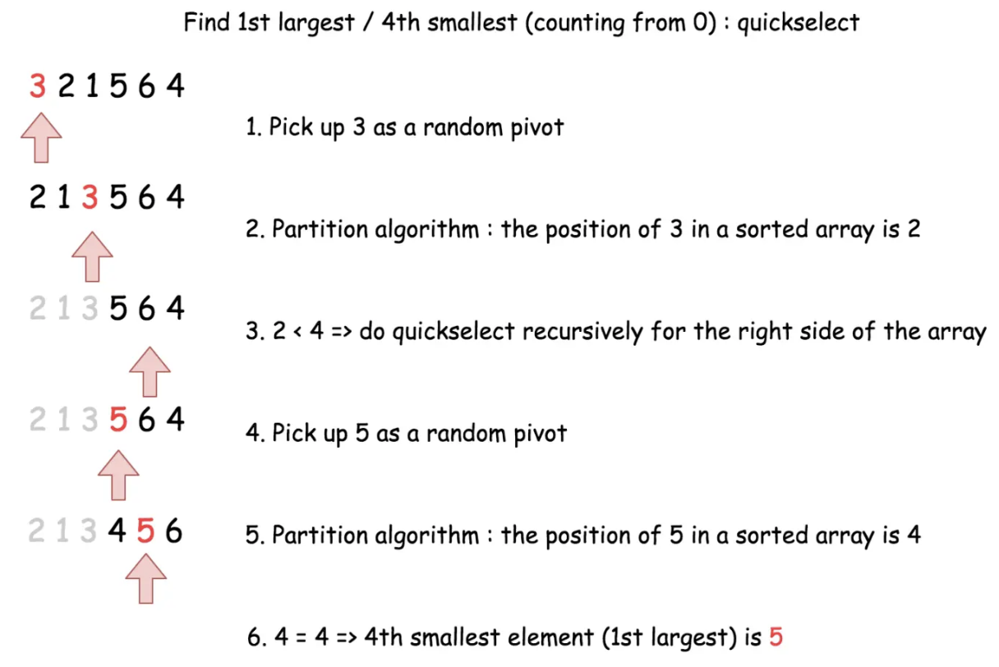
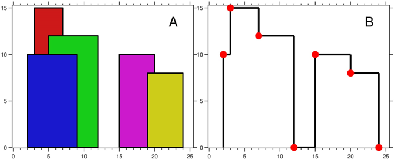

# 十三、堆

## 13.1 第/前 K 小问题

### 数组中的第 K 个最大元素 ⭐️⭐️

给定整数数组 `nums` 和整数 `k`，请返回数组中第 `k` 个最大的元素。

请注意，你需要找的是数组排序后的第 `k` 个最大的元素，而不是第 `k` 个不同的元素。

你必须设计并实现时间复杂度为 `O(n)` 的算法解决此问题。

**示例**

- 输入: [3,2,1,5,6,4], k = 2
- 输出: 5

**思路**

- 快速选择算法取第 `n-k` 小：
    - 在区间 `[left,right]` 中选取任意一个作为基准 `pivot`，将比它小的元素移动到它前面。此时基准下标为 `index`。
    - 比较 `index` 与 `k` 的大小关系，确定下一个搜索区间。向左 `[left,index-1]`，向右 `[index+1,right]`。
    - 
- 优先队列（小顶堆）：将数组元素不断加入**小顶堆**中，始终维护小顶堆中有 `k` 个元素。堆顶元素即为第 `k` 大元素。(
  相当于对最小堆做了 `n-k` 次移除当前最小值操作，剩余的堆顶元素自然就是第 `n-k` 小)。

**代码**
快速选择算法：

```java
class Solution {
    void swap(int[] nums, int i, int j) {
        int temp = nums[i];
        nums[i] = nums[j];
        nums[j] = temp;
    }

    int quickSelect(int[] nums, int left, int right, int kSmallest) {
        if (left == right) {
            return nums[left];
        }
        // 选择一个随机的基准元素
        Random random = new Random();
        int pivotIndex = left + random.nextInt(right - left + 1);
        int pivotValue = nums[pivotIndex];

        // 将基准元素移动到右边界
        swap(nums, pivotIndex, right);
        // 对数组进行分区
        int index = left;
        for (int i = left; i < right; i++) {
            if (nums[i] < pivotValue) {
                swap(nums, i, index);
                index++;
            }
        }
        // 将基准元素移回到分区的正确位置
        swap(nums, index, right);

        // 递归选择
        if (index == kSmallest) {
            return nums[index];
        } else if (index < kSmallest) {
            return quickSelect(nums, index + 1, right, kSmallest);  // 过于小了，需要向右搜索
        } else {
            return quickSelect(nums, left, index - 1, kSmallest);   // 过于大了，需要向左搜索
        }
    }

    public int findKthLargest(int[] nums, int k) {
        int n = nums.length;
        return quickSelect(nums, 0, n - 1, n - k);
    }
}
```

优先队列：

```java
class Solution {
    public int findKthLargest(int[] nums, int k) {
        PriorityQueue<Integer> pq = new PriorityQueue<>();
        for (int i = 0; i < nums.length; i++) {
            pq.add(nums[i]);
            if (pq.size() > k) {
                pq.poll();
            }
        }
        return pq.peek();
    }
}
```

### 前 k 个高频元素 ⭐️⭐️

给你一个整数数组 `nums` 和一个整数 `k` ，请你返回其中出现频率前 `k` 高的元素。你可以按 任意顺序 返回答案。

**示例**

- 输入: nums = [1,1,1,2,2,3], k = 2
- 输出: [1,2]

**思路**

- 使用哈希表统计频率，然后加入优先队列（大顶堆）排序，取出前 `k` 个元素即可。

**代码**

```java
class Solution {
    public int[] topKFrequent(int[] nums, int k) {
        Map<Integer, Integer> map = new HashMap<>();
        for (int num : nums) {
            map.put(num, map.getOrDefault(num, 0) + 1);
        }
        PriorityQueue<Map.Entry<Integer, Integer>> pq = new PriorityQueue<>(
                (num1, num2) -> num2.getValue() - num1.getValue()
        );
        pq.addAll(map.entrySet());
        int[] ans = new int[k];
        for (int i = 0; i < k; i++) {
            ans[i] = pq.poll().getKey();
        }
        return ans;
    }
}
```

### 查找和最小的 K 对数字 ⭐️⭐️⭐️

给定两个以 非递减顺序排列 的整数数组 `nums1` 和 `nums2` , 以及一个整数 `k` 。

定义一对值 `(u,v)`，其中第一个元素来自 nums1，第二个元素来自 `nums2` 。

请找到和最小的 `k` 个数对 `(u1,v1),  (u2,v2)  ...  (uk,vk)` 。

**示例**

- 输入: nums1 = [1,7,11], nums2 = [2,4,6], k = 3
- 输出: [1,2],[1,4],[1,6]
- 解释: 返回序列中的前 3 对数：
  [1,2],[1,4],[1,6],[7,2],[7,4],[11,2],[7,6],[11,4],[11,6]

**思路**

- 先将 `nums1[0]` 和 `nums2` 前 `k` 个元素的下标对 `i,j`（如果有）加入最小堆（按照 `nums1[i]+nums2[j]` 从小到大排序）。
- 从最小堆顶取出下标对 `i, j`，并将下标对 `i+1, j` 放入堆中，直到找到 `k` 个下标对。

**代码**

```java
class Solution {
    public List<List<Integer>> kSmallestPairs(int[] nums1, int[] nums2, int k) {
        PriorityQueue<int[]> pq = new PriorityQueue<>((a, b) -> nums1[a[0]] + nums2[a[1]] - nums1[b[0]] - nums2[b[1]]);
        // 将 nums1[0] 与 nums2 前 k 个元素加入最小堆
        for (int i = 0; i < k && i < nums2.length; i++) {
            pq.add(new int[]{0, i});
        }
        List<List<Integer>> ans = new ArrayList<>();
        while (k > 0 && !pq.isEmpty()) {
            int[] pos = pq.poll();
            List<Integer> res = new ArrayList<>();
            res.add(nums1[pos[0]]);
            res.add(nums2[pos[1]]);
            ans.add(res);
            // 将 nums1 下一个元素加入最小堆
            if (pos[0] < nums1.length - 1) {
                pq.add(new int[]{pos[0] + 1, pos[1]});
            }
            k--;
        }
        return ans;
    }
}
```

### 数据流的中位数 ⭐️⭐️⭐️⭐️⭐️

中位数是有序整数列表中的中间值。如果列表的大小是偶数，则没有中间值，中位数是两个中间值的平均值。

例如 `arr = [2,3,4]` 的中位数是 3 。
例如 `arr = [2,3]` 的中位数是 (2 + 3) / 2 = 2.5 。
实现 `MedianFinder` 类:

- `MedianFinder()` 初始化 `MedianFinder` 对象。
- `void addNum(int num)` 将数据流中的整数 `num` 添加到数据结构中。
- `double findMedian()` 返回到目前为止所有元素的中位数。与实际答案相差 10^-5 以内的答案将被接受。

**示例**

- 输入
  ["MedianFinder", "addNum", "addNum", "findMedian", "addNum", "findMedian"]
  \[[], [1], [2], [], [3], []]
- 输出
  [null, null, null, 1.5, null, 2.0]

- 解释
    - MedianFinder medianFinder = new MedianFinder();
    - medianFinder.addNum(1); // arr = [1]
    - medianFinder.addNum(2); // arr = [1, 2]
    - medianFinder.findMedian(); // 返回 1.5 ((1 + 2) / 2)
    - medianFinder.addNum(3); // arr[1, 2, 3]
    - medianFinder.findMedian(); // return 2.0

**思路**

- 建立大顶堆和小顶堆。大顶堆存放较小的一半元素，小顶堆存放较大的一半元素。
- 添加新元素时，如果大顶堆为空或者新元素小于等于大顶堆堆顶元素，则加入大顶堆；否则加入小顶堆。
- 调整堆，保证最大堆数量比最小堆多，且最多多一个元素。
- 查找中位数时，如果两堆元素数量相等，则取两堆堆顶元素平均值；否则取大顶堆堆顶元素。

**代码**

```java
class MedianFinder {
    PriorityQueue<Integer> maxHeap;
    PriorityQueue<Integer> minHeap;

    public MedianFinder() {
        maxHeap = new PriorityQueue<>(Collections.reverseOrder());
        minHeap = new PriorityQueue<>();
    }

    public void addNum(int num) {
        // 添加新元素。
        if (maxHeap.isEmpty() || num <= maxHeap.peek()) {
            maxHeap.add(num);
        } else {
            minHeap.add(num);
        }
        // 调整堆，保证最大堆数量比最小堆多，且最多多一个元素
        if (maxHeap.size() > minHeap.size() + 1) {
            minHeap.add(maxHeap.poll());
        } else if (minHeap.size() > maxHeap.size()) {
            maxHeap.add(minHeap.poll());
        }
    }

    public double findMedian() {
        if (maxHeap.size() == minHeap.size()) {
            return (maxHeap.peek() + minHeap.peek()) / 2.0;
        } else {
            return maxHeap.peek();
        }
    }
}
```

### 滑动窗口中位数 ⭐️⭐⭐️⭐⭐️

中位数是有序序列最中间的那个数。如果序列的长度是偶数，则没有最中间的数；此时中位数是最中间的两个数的平均数。

例如：

`[2,3,4]`，中位数是 3
`[2,3]`，中位数是 (2 + 3) / 2 = 2.5
给你一个数组 nums，有一个长度为 k 的窗口从最左端滑动到最右端。窗口中有 `k` 个数，每次窗口向右移动 1
位。你的任务是找出每次窗口移动后得到的新窗口中元素的中位数，并输出由它们组成的数组。

**示例**

给出 nums = [1,3,-1,-3,5,3,6,7]，以及 k = 3。

```
窗口位置                      中位数
---------------               -----
[1  3  -1] -3  5  3  6  7       1
1 [3  -1  -3] 5  3  6  7      -1
1  3 [-1  -3  5] 3  6  7      -1
1  3  -1 [-3  5  3] 6  7       3
1  3  -1  -3 [5  3  6] 7       5
1  3  -1  -3  5 [3  6  7]      6
```

因此，返回该滑动窗口的中位数数组 [1,-1,-1,3,5,6]。

**思路**

- 与上一致。需要处理删除元素的逻辑。
- 采用延迟删除的策略。使用哈希表记录需要延迟删除的元素以及该元素需要删除的个数。
- 实现 `prune` 方法，删除堆顶所有需要延迟删除的元素。
- 实现 `balance` 方法，调整堆以保持平衡。调整平衡时，要对堆顶元素进行延迟删除。
- 实现 `removeNum` 方法，删除元素时，将元素加入延迟删除列表，然后对这个元素所在的堆执行 `prune`
  方法延迟删除元素，最后调用 `balance`
  方法调整堆。
- 由于是软删除，因此需要自己使用 `maxSize` 和 `minSize` 维护堆中未删除元素的数量，不能使用 `size` 方法。

**代码**

```java
class Solution {
    public double[] medianSlidingWindow(int[] nums, int k) {
        int n = nums.length;
        double[] ans = new double[n - k + 1];
        int i = 0;
        MedianFinder mf = new MedianFinder();
        for (int right = 0; right < n; right++) {
            mf.addNum(nums[right]);
            int left = right - k + 1;
            if (left > 0) {
                mf.removeNum(nums[left - 1]);
            }
            if (left >= 0) {
                ans[i++] = mf.findMedian();
            }
        }
        return ans;
    }
}

class MedianFinder {
    PriorityQueue<Integer> maxHeap;
    PriorityQueue<Integer> minHeap;
    int maxSize;
    int minSize;
    Map<Integer, Integer> delayed;  // 延迟删除的元素


    public MedianFinder() {
        maxHeap = new PriorityQueue<>(Collections.reverseOrder());
        minHeap = new PriorityQueue<>();
        delayed = new HashMap<>();
        maxSize = 0;
        minSize = 0;
    }
    
    // 调整堆以保持平衡
    private void balance() {
        if (maxSize > minSize + 1) {
            minHeap.add(maxHeap.poll());
            maxSize--;
            minSize++;
            prune(maxHeap);
        } else if (minSize > maxSize) {
            maxHeap.add(minHeap.poll());
            minSize--;
            maxSize++;
            prune(minHeap);
        }
    }

    // 删除堆顶所有需要延迟删除的元素
    private void prune(PriorityQueue<Integer> heap) {
        // 清理堆顶元素，直到堆顶元素不在延迟删除列表中
        while (!heap.isEmpty() && delayed.containsKey(heap.peek())) {
            int top = heap.poll();
            delayed.put(top, delayed.get(top) - 1);
            if (delayed.get(top) == 0) {
                delayed.remove(top);
            }
        }
    }

    public void removeNum(int num) {
        delayed.put(num, delayed.getOrDefault(num, 0) + 1);
        if (num <= maxHeap.peek()) {
            maxSize--;
            prune(maxHeap);
        } else {
            minSize--;
            prune(minHeap);
        }
        balance();
    }

    public void addNum(int num) {
        // 添加新元素
        if (maxHeap.isEmpty() || num <= maxHeap.peek()) {
            maxHeap.add(num);
            maxSize++;
        } else {
            minHeap.add(num);
            minSize++;
        }
        balance();
    }

    public double findMedian() {
        if (maxSize == minSize) {
            return ((double) maxHeap.peek() + minHeap.peek()) / 2.0;
        } else {
            return maxHeap.peek();
        }
    }
}
```

## 13.2 其他问题

### 座位预约管理系统 ⭐️⭐️

请你设计一个管理 `n` 个座位预约的系统，座位编号从 `1` 到 `n` 。

请你实现 `SeatManager` 类：

- `SeatManager(int n)` 初始化一个 SeatManager 对象，它管理从 `1` 到 `n` 编号的 `n` 个座位。所有座位初始都是可预约的。
- `int reserve()` 返回可以预约座位的 最小编号 ，此座位变为不可预约。
- `void unreserve(int seatNumber)` 将给定编号 `seatNumber` 对应的座位变成可以预约。

**示例**

- 输入：
  `["SeatManager", "reserve", "reserve", "unreserve", "reserve", "reserve", "reserve", "reserve", "unreserve"]
  [[5], [], [], [2], [], [], [], [], [5]]`
- 输出：
  `[null, 1, 2, null, 2, 3, 4, 5, null]`
- 解释：
    - SeatManager seatManager = new SeatManager(5); // 初始化 SeatManager ，有 5 个座位。
    - seatManager.reserve(); // 所有座位都可以预约，所以返回最小编号的座位，也就是 1 。
    - seatManager.reserve(); // 可以预约的座位为 [2,3,4,5] ，返回最小编号的座位，也就是 2 。
    - seatManager.unreserve(2); // 将座位 2 变为可以预约，现在可预约的座位为 [2,3,4,5] 。
    - seatManager.reserve(); // 可以预约的座位为 [2,3,4,5] ，返回最小编号的座位，也就是 2 。
    - seatManager.reserve(); // 可以预约的座位为 [3,4,5] ，返回最小编号的座位，也就是 3 。
    - seatManager.reserve(); // 可以预约的座位为 [4,5] ，返回最小编号的座位，也就是 4 。
    - seatManager.reserve(); // 唯一可以预约的是座位 5 ，所以返回 5 。
    - seatManager.unreserve(5); // 将座位 5 变为可以预约，现在可预约的座位为 [5] 。

**思路**

- 使用最小堆维护当前可预约的座位编号即可。

**代码**

```java
class SeatManager {
    PriorityQueue<Integer> pq;

    public SeatManager(int n) {
        pq = new PriorityQueue<>();
        for (int i = 1; i <= n; i++) {
            pq.add(i);
        }
    }

    public int reserve() {
        return pq.poll();
    }

    public void unreserve(int seatNumber) {
        pq.add(seatNumber);
    }
}
```

### 丑数 II ⭐️⭐️

给你一个整数 `n` ，请你找出并返回第 `n` 个 丑数 。

丑数 就是质因子只包含 2、3 和 5 的正整数。

**示例**

- 输入：n = 10
- 输出：12
- 解释：[1, 2, 3, 4, 5, 6, 8, 9, 10, 12] 是由前 10 个丑数组成的序列。

**思路**

- 使用最小堆。
- 初始堆中为 1。每次取出堆顶，对于堆顶元素的 2 倍、 3 倍、 5 倍，如果未访问过则加入堆中。直到一共取出了 `n - 1`
  次对顶元素，此时堆顶元素即为第 `n` 个丑数。

**代码**

```java
class Solution {
    public int nthUglyNumber(int n) {
        PriorityQueue<Long> pq = new PriorityQueue<>();
        Set<Long> set = new HashSet<>();
        pq.add(1L);
        for (int i = 0; i < n - 1; i++) {
            long num = pq.poll();
            if (!set.contains(num * 2)) {
                pq.add(num * 2);
                set.add(num * 2);
            }
            if (!set.contains(num * 3)) {
                pq.add(num * 3);
                set.add(num * 3);
            }
            if (!set.contains(num * 5)) {
                pq.add(num * 5);
                set.add(num * 5);
            }
        }
        return pq.peek().intValue();
    }
}
```

### IPO ⭐️⭐️⭐️

假设 力扣（LeetCode）即将开始 IPO 。为了以更高的价格将股票卖给风险投资公司，力扣 希望在 IPO 之前开展一些项目以增加其资本。
由于资源有限，它只能在 IPO 之前完成最多 `k` 个不同的项目。帮助 力扣 设计完成最多 `k` 个不同项目后得到最大总资本的方式。

给你 `n` 个项目。对于每个项目 `i` ，它都有一个纯利润 `profits[i]` ，和启动该项目需要的最小资本 `capital[i]` 。

最初，你的资本为 `w` 。当你完成一个项目时，你将获得纯利润，且利润将被添加到你的总资本中。

总而言之，从给定项目中选择 最多 `k` 个不同项目的列表，以 最大化最终资本 ，并输出最终可获得的最多资本。

答案保证在 32 位有符号整数范围内。

**示例**

- 输入：k = 2, w = 0, profits = [1,2,3], capital = [0,1,1]
- 输出：4
- 解释：
  由于你的初始资本为 0，你仅可以从 0 号项目开始。
  在完成后，你将获得 1 的利润，你的总资本将变为 1。
  此时你可以选择开始 1 号或 2 号项目。
  由于你最多可以选择两个项目，所以你需要完成 2 号项目以获得最大的资本。
  因此，输出最后最大化的资本，为 0 + 1 + 3 = 4。

**思路**

- 贪心算法。
- 一共 `k` 次投资，每次投资前从按 `capital` 升序排列的项目中选取当前**未被选取**的当前资金 `w` 可以投资的项目加入项目池。
- 选择当前项目池中收益最高的项目投资。

**代码**

```java
class Project {
    int profit;
    int capital;

    public Project(int profit, int capital) {
        this.profit = profit;
        this.capital = capital;
    }
}

class Solution {
    public int findMaximizedCapital(int k, int w, int[] profits, int[] capital) {
        int n = profits.length;
        Project[] projects = new Project[n];
        // 将投资收益与资金建立对应关系，可以创建新类封装
        for (int i = 0; i < n; i++) {
            projects[i] = new Project(profits[i], capital[i]);
        }
        // 按照资金升序排序
        Arrays.sort(projects, (a, b) -> a.capital - b.capital);
        // 最大堆
        PriorityQueue<Project> pq = new PriorityQueue<>((a, b) -> b.profit - a.profit);
        int index = 0;
        for (int i = 0; i < k; i++) {
            // 继续找当前费用可以投资的项目，并取其中收益最高的
            while (index < n && projects[index].capital <= w) {
                pq.add(projects[index++]);
            }
            // 无法继续投资
            if (pq.isEmpty()) {
                return w;
            }
            // 取投资收益最高的
            w += pq.poll().profit;
        }
        return w;
    }
}
```

### 天际线问题 ⭐️⭐️⭐️⭐️⭐

城市的 天际线 是从远处观看该城市中所有建筑物形成的轮廓的外部轮廓。给你所有建筑物的位置和高度，请返回 由这些建筑物形成的
天际线 。

每个建筑物的几何信息由数组 `buildings` 表示，其中三元组 `buildings[i]` = `[lefti, righti, heighti]` 表示：

- `lefti` 是第 `i` 座建筑物左边缘的 `x` 坐标。
- `righti` 是第 `i` 座建筑物右边缘的 `x` 坐标。
- `heighti` 是第 `i` 座建筑物的高度。
  你可以假设所有的建筑都是完美的长方形，在高度为 0 的绝对平坦的表面上。

天际线 应该表示为由 “关键点” 组成的列表，格式 `[[x1,y1],[x2,y2],...]` ，并按 `x` 坐标 进行 排序
。关键点是水平线段的左端点。列表中最后一个点是最右侧建筑物的终点，y 坐标始终为 0
，仅用于标记天际线的终点。此外，任何两个相邻建筑物之间的地面都应被视为天际线轮廓的一部分。

注意：输出天际线中不得有连续的相同高度的水平线。例如 `[...[2 3], [4 5], [7 5], [11 5], [12 7]...]` 是不正确的答案；三条高度为
5 的线应该在最终输出中合并为一个：`[...[2 3], [4 5], [12 7], ...]`

**示例**

- 输入：buildings = [[2,9,10],[3,7,15],[5,12,12],[15,20,10],[19,24,8]]
- 输出：[[2,10],[3,15],[7,12],[12,0],[15,10],[20,8],[24,0]]
- 解释：
  图 A 显示输入的所有建筑物的位置和高度，
  图 B 显示由这些建筑物形成的天际线。图 B 中的红点表示输出列表中的关键点。
- 

**思路**

- 从左到右扫描，将每个建筑物的左右边界加入边界数组。
- 对边界数组排序，遍历边界数组，对于每个边界，把可能包含该边界的元素加入队列，从堆顶把不包含该边界的元素删除。
- 从堆顶取出最大高度，如果与结果集中最新的关键点高度不同，则加入结果集。

**代码**

```java
class Solution {
    public List<List<Integer>> getSkyline(int[][] buildings) {
        int n = buildings.length;
        // 构造边界数组
        List<Integer> boundaries = new ArrayList<>();
        for (int[] building : buildings) {
            boundaries.add(building[0]);
            boundaries.add(building[1]);
        }
        Collections.sort(boundaries);
        
        // pq 保存 [结束位置，高度]
        PriorityQueue<int[]> pq = new PriorityQueue<>((a, b) -> b[1] - a[1]);
        List<List<Integer>> ans = new ArrayList<>();
        int index = 0;
        for (int x : boundaries) {
            // 把可能包含该坐标的元素加入队列
            while (index < n && buildings[index][0] <= x) {
                pq.add(new int[]{buildings[index][1], buildings[index][2]});
                index++;
            }
            // 从堆顶把不包含该坐标的元素删除
            while (!pq.isEmpty() && pq.peek()[0] <= x) {
                pq.poll();
            }
            // top是包含该坐标的最大高度
            int top = pq.isEmpty() ? 0 : pq.peek()[1];
            if (ans.isEmpty() || top != ans.get(ans.size() - 1).get(1)) {
                ans.add(Arrays.asList(x, top));
            }
        }
        return ans;
    }
}
```

