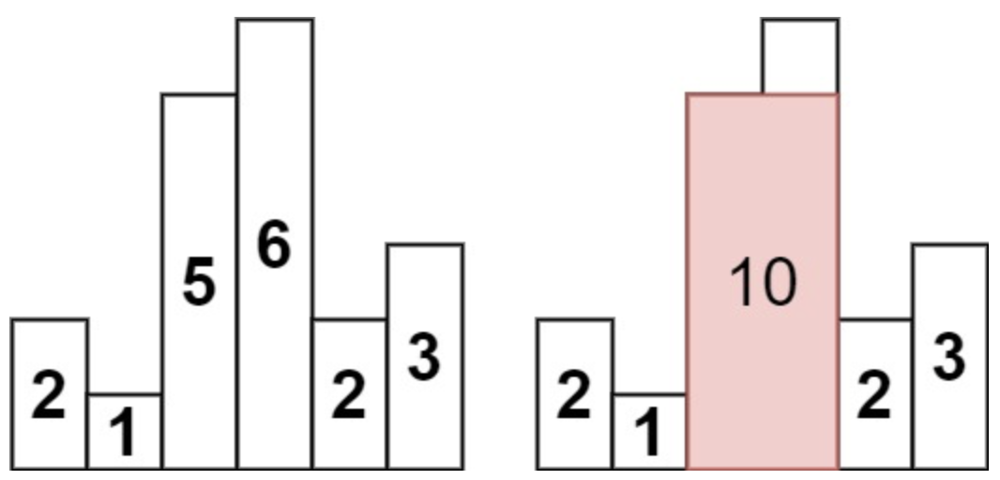
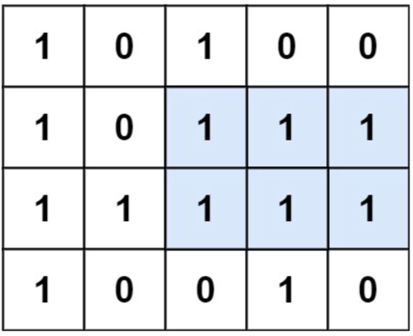

# 十二、栈与队列

## 12.1 匹配问题

### 有效的括号 ⭐️

给定一个只包括 `'('，')'，'{'，'}'，'['，']'` 的字符串 `s` ，判断字符串是否有效。

有效字符串需满足：

- 左括号必须用相同类型的右括号闭合。
- 左括号必须以正确的顺序闭合。
- 每个右括号都有一个对应的相同类型的左括号。

**示例**

- 输入：s = "()[]{}"
- 输出：true

**思路**

- 遇到左括号进栈，遇到右括号弹出栈顶并检查是否匹配，如果不匹配则无效。
- 最后如果栈内仍有未匹配的左括号也是无效的。

**代码**

```java
class Solution {
    public boolean isValid(String s) {
        Stack<Character> stack = new Stack<>();
        for (int i = 0; i < s.length(); i++) {
            char c = s.charAt(i);
            if (c == '(' || c == '[' || c == '{') {
                stack.push(c);
            } else {
                if (stack.isEmpty()) {
                    return false;
                }
                char top = stack.pop();
                if ((c == ')' && top == '(') || (c == ']' && top == '[') || (c == '}' && top == '{')) {
                    continue;
                } else {
                    return false;
                }
            }
        }
        return stack.isEmpty();
    }
}
```

### 小行星碰撞 ⭐️⭐️

给定一个整数数组 `asteroids`，表示在同一行的小行星。

对于数组中的每一个元素，其绝对值表示小行星的大小，正负表示小行星的移动方向（正表示向右移动，负表示向左移动）。每一颗小行星以相同的速度移动。

找出碰撞后剩下的所有小行星。碰撞规则：两个小行星相互碰撞，较小的小行星会爆炸。如果两颗小行星大小相同，则两颗小行星都会爆炸。两颗移动方向相同的小行星，永远不会发生碰撞。

**示例**

- 输入：asteroids = [10,2,-5]
- 输出：[10]
- 解释：2 和 -5 发生碰撞后剩下 -5 。10 和 -5 发生碰撞后剩下 10 。

**思路**

- 使用栈模拟碰撞过程。
- 枚举小行星，将正数直接入栈。
- 对于负数，不断与栈顶元素比较。
    - 如果栈顶元素绝对值小于当前元素，则弹出栈顶元素。
    - 如果栈顶元素绝对值等于当前元素，则弹出栈顶元素并置零当前元素。
    - 如果栈顶元素绝对值大于当前元素，则置零当前元素。
- 循环结束后如果当前元素没有被置零，则将当前元素入栈。

**代码**

```java
class Solution {
    public int[] asteroidCollision(int[] asteroids) {
        Deque<Integer> stack = new ArrayDeque<>();
        for (int x : asteroids) {
            if (x > 0) {
                stack.push(x);
            } else {
                while (!stack.isEmpty() && stack.peek() > 0) {
                    if (stack.peek() < -x) {
                        stack.pop();
                    } else if (stack.peek() == -x) {
                        x = 0;
                        stack.pop();
                        break;
                    } else {
                        x = 0;
                        break;
                    }
                }
                if (x < 0) {
                    stack.push(x);
                }
            }
        }
        int[] ans = new int[stack.size()];
        int k = stack.size() - 1;
        for (int x : stack) {
            ans[k--] = x;
        }
        return ans;
    }
}
```

## 12.2 字符串解析问题

### 简化路径 ⭐️⭐️

给你一个字符串 `path` ，表示指向某一文件或目录的 Unix 风格 绝对路径 （以 `'/'` 开头），请你将其转化为更加简洁的规范路径。

在 Unix 风格的文件系统中，一个点（`.`）表示当前目录本身；此外，两个点 （`..`）
表示将目录切换到上一级（指向父目录）；两者都可以是复杂相对路径的组成部分。任意多个连续的斜杠（即，`'//'`
）都被视为单个斜杠 `'/'` 。 对于此问题，任何其他格式的点（例如，`'...'`）均被视为文件/目录名称。

请注意，返回的 规范路径 必须遵循下述格式：

- 始终以斜杠 `'/'` 开头。
- 两个目录名之间必须只有一个斜杠 `'/'` 。
- 最后一个目录名（如果存在）不能 以 `'/'` 结尾。
- 此外，路径仅包含从根目录到目标文件或目录的路径上的目录（即，不含 `'.'` 或 `'..'`）。

返回简化后得到的 规范路径。

**示例**

- 输入：path = "/home/user/Documents/../Pictures"
- 输出："/home/user/Pictures"
- 解释：两个点 ".." 表示上一级目录。

**思路**

- 使用 `replace()`、`split()` API 先进行预处理，然后使用栈处理 `..` 即可。
- 纯 API 大法（雾）

**代码**

```java
class Solution {
    public String simplifyPath(String path) {
        path = path.replace("//", "/");
        String[] words = path.split("/");
        Stack<String> stack = new Stack<>();

        for (String word : words) {
            // 当前目录直接不管
            if (word.isEmpty() || word.equals(".")) {
                continue;
            }
            // 返回上级目录
            if (word.equals("..")) {
                if (!stack.isEmpty()) {
                    stack.pop();
                }
            } else {
                stack.push(word);
            }
        }
        List<String> wordList = stack.stream().toList();
        return "/" + String.join("/", wordList);
    }
}
```

纯 API 大法（仅供娱乐）：

```java
import java.nio.file.Path;

class Solution {
    public String simplifyPath(String path) {
        return Path.of(path).normalize().toString();
    }
}
```

### 字符串解码 ⭐️⭐️⭐️

给定一个经过编码的字符串，返回它解码后的字符串。

编码规则为: `k[encoded_string]`，表示其中方括号内部的 `encoded_string` 正好重复 `k` 次。注意 `k` 保证为正整数。

你可以认为输入字符串总是有效的；输入字符串中没有额外的空格，且输入的方括号总是符合格式要求的。

此外，你可以认为原始数据不包含数字，所有的数字只表示重复的次数 `k` ，例如不会出现像 `3a` 或 `2[4]` 的输入。

**示例**

- 输入：s = "3[a]2[bc]"
- 输出："aaabcbc"

**思路**

- 栈里只存解码字符串以及重复次数。
- 读取到数字：构建当前数字。
- 读取到 `[`：将当前解码结果和当前数字压入栈内，并重置当前解码结果和数字。
- 读取到 `]`：从栈中弹出之前的解码结果和重复次数，重复当前字符串并附加到之前保存的字符串上。

**代码**

```java
class Solution {
    public String decodeString(String s) {
        Stack<String> stack = new Stack<>();
        StringBuilder sb = new StringBuilder();
        int number = 0;

        for (char c : s.toCharArray()) {
            if (Character.isDigit(c)) {
                // 构建数字 k
                number = number * 10 + (c - '0');
            } else if (c == '[') {
                // 将当前解码结果和重复次数推入栈中
                stack.push(sb.toString());
                stack.push(String.valueOf(number));
                // 重置当前字符串和数字
                sb = new StringBuilder();
                number = 0;
            } else if (c == ']') {
                // 从栈中弹出之前保存的解码结果和重复次数
                int repeatCount = Integer.parseInt(stack.pop());
                String previousString = stack.pop();
                // 重复当前字符串并附加到之前保存的字符串上
                sb = new StringBuilder(previousString + sb.toString().repeat(repeatCount));
            } else {
                // 处理字母
                sb.append(c);
            }
        }
        return sb.toString();
    }
}
```

### 逆波兰表达式求值 ⭐️⭐️⭐️

给你一个字符串数组 `tokens` ，表示一个根据 逆波兰表示法 表示的算术表达式。

请你计算该表达式。返回一个表示表达式值的整数。

注意：

- 有效的算符为 `'+'`、`'-'`、`'*'` 和 `'/'` 。
- 每个操作数（运算对象）都可以是一个整数或者另一个表达式。
- 两个整数之间的除法总是 向零截断 。
- 表达式中不含除零运算。
- 输入是一个根据逆波兰表示法表示的算术表达式。
- 答案及所有中间计算结果可以用 32 位 整数表示。

**示例**

- 输入：tokens = ["2","1","+","3","*"]
- 输出：9
- 解释：该算式转化为常见的中缀算术表达式为：((2 + 1) * 3) = 9

**思路**

- 遇到数字：加入栈
- 遇到算符：从栈顶取出两个数字进行计算，并将结果放入栈内。

**代码**

```java
class Solution {
    public int evalRPN(String[] tokens) {
        Stack<Integer> stack = new Stack<>();

        for (String token : tokens) {
            if (token.equals("+")) {
                stack.push(stack.pop() + stack.pop());
            } else if (token.equals("-")) {
                int num1 = stack.pop();
                int num2 = stack.pop();
                stack.push(num2 - num1);
            } else if (token.equals("*")) {
                stack.push(stack.pop() * stack.pop());
            } else if (token.equals("/")) {
                int num1 = stack.pop();
                int num2 = stack.pop();
                stack.push(num2 / num1);
            } else {
                stack.push(Integer.parseInt(token));
            }
        }
        return stack.peek();
    }
}
```

### 基本计算器 ⭐️⭐️⭐️⭐️⭐️

给你一个字符串表达式 `s` ，请你实现一个基本计算器来计算并返回它的值。

注意:不允许使用任何将字符串作为数学表达式计算的内置函数，比如 `eval()` 。

- `'+'` 不能用作一元运算(例如， `"+1"` 和 `"+(2 + 3)"` 无效)
- `'-'` 可以用作一元运算(即 `"-1"` 和 `"-(2 + 3)"` 是有效的)
- 输入中不存在两个连续的操作符
- 每个数字和运行的计算将适合于一个有符号的 32位 整数

**示例**

- 输入：s = "(1+(4+5+2)-3)+(6+8)"
- 输出：23

**思路**

- **注意：本题无乘除法**，与字符串解码类似。
- 符号处理：`sign` 变量用于跟踪当前运算符号，`+` 对应 1，`-` 对应 -1。
- 数字处理：当检测到一个数字时，将其完整解析出来并加到 `ans` 中，根据当前的符号更新 `ans`。
- 括号处理：
    - 遇到左括号 `(` 时，将当前的 `ans` 和 `sign` 入栈，准备处理括号内的新表达式。
    - 遇到右括号 `)` 时，使用栈中保存的 `sign` 和 `ans`，将括号内的计算结果加到括号外的表达式中。

**代码**

```java
class Solution {
    public int calculate(String s) {
        int n = s.length();
        Stack<Integer> stack = new Stack<>();

        int num = 0;
        int sign = 1;
        for (int i = 0; i < n; i++) {
            char c = s.charAt(i);
            if (c == '+') {
                sign = 1;
            } else if (c == '-') {
                sign = -1;
            } else if (c == '(') {
                stack.push(num);
                stack.push(sign);
                num = 0;
                sign = 1;
            } else if (c == ')') {
                num = num * stack.pop() + stack.pop();
            } else if (Character.isDigit(c)) {
                // 向后构建完整的数字
                int temp = 0;
                while (i < n && Character.isDigit(s.charAt(i))) {
                    temp = temp * 10 + s.charAt(i++) - '0';
                }
                num += sign * temp;
                i--;
            }
        }
        return num;
    }
}
```

扩展：加减乘除括号算式转逆波兰表达式再求值：

- 操作数：直接输出到逆波兰表达式。
- 左括号：直接入栈。
- 右括号：将栈中的符号弹出并输出，直到遇到左括号。
- 运算符：根据运算符的优先级，将栈中优先级大于或等于当前运算符的符号弹出并输出，然后将当前运算符入栈。

```java
 // 优先级定义
Map<Character, Integer> precedence = new HashMap<>();

{
    precedence.put('+', 1);
    precedence.put('-', 1);
    precedence.put('*', 2);
    precedence.put('/', 2);
}

List<String> toRPN(String s) {
    List<String> ans = new ArrayList<>();
    Stack<Character> stack = new Stack<>();
    boolean flag = true; // 判断是否期待一元操作符

    for (int i = 0; i < s.length(); i++) {
        char c = s.charAt(i);

        if (Character.isDigit(c)) {
            StringBuilder sb = new StringBuilder();
            while (i < s.length() && (Character.isDigit(s.charAt(i)))) {
                sb.append(s.charAt(i++));
            }
            i--;
            ans.add(sb.toString());
            flag = false; // 处理完数字后，下一个非空白字符应为运算符或括号
        } else if (c == '(') {
            stack.push(c);
            flag = true; // 括号后面可以跟一元操作符
        } else if (c == ')') {
            while (!stack.isEmpty() && stack.peek() != '(') {
                ans.add(stack.pop().toString());
            }
            stack.pop(); // 弹出 '('
            flag = false; // 括号之后期望的是运算符或另一个括号
        } else if (c == '+' || c == '-' || c == '*' || c == '/') {
            if (c == '-' && flag) {
                ans.add("0"); // 插入零来处理一元减法
            }
            while (!stack.isEmpty() && precedence.getOrDefault(stack.peek(), 0) >= precedence.get(c)) {
                ans.add(stack.pop().toString());
            }
            stack.push(c);
            flag = true; // 运算符后面可以是一个一元操作符
        }
    }
    // 把剩余的运算符弹出
    while (!stack.isEmpty()) {
        ans.add(stack.pop().toString());
    }
    return ans;
}
```

## 12.3 单调栈

### 柱状图中最大的矩形 ⭐️⭐️⭐️⭐️

给定 `n` 个非负整数，用来表示柱状图中各个柱子的高度。每个柱子彼此相邻，且宽度为 1 。

求在该柱状图中，能够勾勒出来的矩形的最大面积。

**示例**

- 输入：heights = [2,1,5,6,2,3]
- 输出：10
- 解释：最大的矩形为图中红色区域，面积为 10
- 

**思路**

- 枚举以每个柱子的高度 `heights[i]` 作为矩形的高，所能绘制出的最大面积。
- 对于每个柱子 `i`，找到左边离 `i` 最近的比 `i` 低的柱子 `left[i]`，和右边离 `i` 最近的比 `i` 低的柱子 `right[i]`
  ，矩形的宽度可以表示为 `right[i]-left[i]-1`。
- 使用**单调栈**求 `left[i]`。从左到右遍历，如果 `heights[i]` 比当前的栈顶元素小或等于，则不断弹出。此时栈顶即为离 `i`
  最近的比 `i` 低的柱子。如果栈为空可以用 `-1` 表示。
- `right[i]` 同理，如果栈为空可以用 `n` 表示。

**代码**

```java
class Solution {
    public int largestRectangleArea(int[] heights) {
        Deque<Integer> stack = new ArrayDeque<>();
        int n = heights.length;

        // 最近的高度小于i的柱子索引
        int[] left = new int[n];
        int[] right = new int[n];
        for (int i = 0; i < n; i++) {
            while (!stack.isEmpty() && heights[stack.peek()] >= heights[i]) {
                stack.pop();
            }
            left[i] = stack.isEmpty() ? -1 : stack.peek();
            stack.push(i);
        }
        stack.clear();
        for (int i = n - 1; i >= 0; i--) {
            while (!stack.isEmpty() && heights[stack.peek()] >= heights[i]) {
                stack.pop();
            }
            right[i] = stack.isEmpty() ? n : stack.peek();
            stack.push(i);
        }

        int ans = 0;
        for (int i = 0; i < n; i++) {
            ans = Math.max(ans, heights[i] * (right[i] - left[i] - 1));
        }
        return ans;
    }
}
```

### 最大矩形 ⭐️⭐️⭐️⭐️

给定一个仅包含 `0` 和 `1` 、大小为 `rows x cols` 的二维二进制矩阵，找出只包含 `1` 的最大矩形，并返回其面积。

**示例**

- 输入：matrix = [["1","0","1","0","0"],["1","0","1","1","1"],["1","1","1","1","1"],["1","0","0","1","0"]]
- 输出：6
- 解释：最大矩形如上图所示。
- 

**思路**

- 将每一行看作一个柱状图，每个元素的高度为从当前行到第一行的连续 `1` 的数量。（禁止悬空）
- 对于每一行，使用**柱状图中最大的矩形**的方法求出最大矩形的面积。

**代码**

```java
class Solution {
    int largestRectangleArea(int[] heights) {
        Deque<Integer> stack = new ArrayDeque<>();
        int n = heights.length;
        int[] left = new int[n];
        for (int i = 0; i < n; i++) {
            while (!stack.isEmpty() && heights[stack.peek()] >= heights[i]) {
                stack.pop();
            }
            left[i] = stack.isEmpty() ? -1 : stack.peek();
            stack.push(i);
        }
        stack.clear();
        int[] right = new int[n];
        for (int i = n - 1; i >= 0; i--) {
            while (!stack.isEmpty() && heights[stack.peek()] >= heights[i]) {
                stack.pop();
            }
            right[i] = stack.isEmpty() ? n : stack.peek();
            stack.push(i);
        }
        int ans = 0;
        for (int i = 0; i < n; i++) {
            ans = Math.max(ans, heights[i] * (right[i] - left[i] - 1));
        }
        return ans;
    }

    public int maximalRectangle(char[][] matrix) {
        int m = matrix[0].length;
        int[] heights = new int[m];
        int ans = 0;
        for (char[] chars : matrix) {
            for (int j = 0; j < m; j++) {
                if (chars[j] == '1') {
                    heights[j]++;
                } else {
                    heights[j] = 0;
                }
            }
            ans = Math.max(ans, largestRectangleArea(heights));
        }
        return ans;
    }
}
```

### 移除 K 位数字 ⭐️⭐️⭐️⭐️

给你一个以字符串表示的非负整数 `num` 和一个整数 `k` ，移除这个数中的 `k` 位数字，使得剩下的数字最小。请你以字符串形式返回这个最小的数字。

**示例**

- 输入：num = "1432219", k = 3
- 输出："1219"
- 解释：移除掉三个数字 4, 3, 和 2 形成一个新的最小的数字 1219 。

**思路**

- 每读取一个元素，从栈顶不断弹出比他大的元素，一共弹出 `k` 次。
- 如果不满 `k` 次则最后从栈顶依次弹出直到 `k` 次。
- 栈中剩余元素取倒序，去除前导 `0`。

**代码**

```java
class Solution {
    public String removeKdigits(String num, int k) {
        Stack<Integer> stack = new Stack<>();
        for (int i = 0; i < num.length(); i++) {
            while (!stack.isEmpty() && stack.peek() > num.charAt(i) - '0' && k > 0) {
                stack.pop();
                k--;
            }
            stack.push(num.charAt(i) - '0');
        }
        while (k > 0) {
            stack.pop();
            k--;
        }
        StringBuilder sb = new StringBuilder();
        while (!stack.isEmpty()) {
            sb.append(stack.pop());
        }
        // 删除前导 0 
        while (!sb.isEmpty() && sb.charAt(sb.length() - 1) == '0') {
            sb.deleteCharAt(sb.length() - 1);
        }
        sb.reverse();
        return sb.isEmpty() ? "0" : sb.toString();
    }
}
```

### 去除重复字母 ⭐️⭐️⭐️⭐️

给你一个字符串 `s` ，请你去除字符串中重复的字母，使得每个字母只出现一次。需保证 返回结果的字典序最小（要求不能打乱其他字符的相对位置）。

**示例**

- 输入：s = "cbacdcbc"
- 输出："acdb"

**思路**

- 对于每个字符，如果栈中已存在该字符则直接跳过。否则从栈顶不断弹出**比他大的，并且在后面还会出现**的字符，并且将该字符加入栈内。

**代码**

```java
class Solution {
    public String removeDuplicateLetters(String s) {
        int n = s.length();
        int[] count = new int[26];
        for (int i = 0; i < n; i++) {
            count[s.charAt(i) - 'a']++;
        }
        boolean[] inStack = new boolean[26];
        Stack<Character> stack = new Stack<>();
        for (int i = 0; i < n; i++) {
            char c = s.charAt(i);
            count[c - 'a']--;
            // 如果该字符不在栈中
            if (!inStack[c - 'a']) {
                // 如果栈顶的字符大且后面还有，弹出
                while (!stack.isEmpty() && stack.peek() > c && count[stack.peek() - 'a'] > 0) {
                    inStack[stack.pop() - 'a'] = false;
                }
                // 该字符入栈
                stack.push(s.charAt(i));
                inStack[c - 'a'] = true;
            }
        }
        StringBuilder sb = new StringBuilder();
        while (!stack.isEmpty()) {
            sb.append(stack.pop());
        }
        sb.reverse();
        return sb.toString();
    }
}
```

### 拼接最大数 ⭐️⭐️⭐️⭐️⭐️

给你两个整数数组 `nums1` 和 `nums2`，它们的长度分别为 `m` 和 `n`。数组 `nums1` 和 `nums2`
分别代表两个数各位上的数字。同时你也会得到一个整数 `k`。

请你利用这两个数组中的数字中创建一个长度为 `k <= m + n` 的最大数，在这个必须保留来自同一数组的数字的相对顺序。

返回代表答案的长度为 `k` 的数组。

**示例**

- 输入：nums1 = [3,4,6,5], nums2 = [9,1,2,5,8,3], k = 5
- 输出：[9,8,6,5,3]

**思路**

- 枚举两个数组需要取出的元素数量 `x` 和 `y`，`x + y == k`。
- 使用单调栈分别计算每个数组保留一定数量元素时所得的最大数组 `seq1` 和 `seq2`。
- 使用双指针合并上述两个数组。每次取**对应下标后续字典序**较大的加入合并数组。
- 对于每种枚举结果，取合并数组字典序大的作为最终结果。

**代码**

```java
class Solution {
    int[] maxSubsequence(int[] nums, int k) {
        int n = nums.length;
        Stack<Integer> stack = new Stack<>();
        int remain = n - k;
        for (int num : nums) {
            while (!stack.isEmpty() && stack.peek() < num && remain > 0) {
                stack.pop();
                remain--;
            }
            stack.push(num);
        }
        while (remain > 0) {
            stack.pop();
            remain--;
        }
        int[] ans = new int[stack.size()];
        int index = stack.size() - 1;
        while (!stack.isEmpty()) {
            ans[index--] = stack.pop();
        }
        return ans;
    }

    int[] merge(int[] seq1, int[] seq2) {
        int x = seq1.length, y = seq2.length;
        int[] merged = new int[x + y];
        int i = 0, j = 0;
        for (int index = 0; index < x + y; index++) {
            // 比较 seq1[i:] 和 seq2[j:]，选择较大的开头
            if (compare(seq1, i, seq2, j) > 0) {
                merged[index] = seq1[i++];  // 从 seq1 选择
            } else {
                merged[index] = seq2[j++];  // 从 seq2 选择
            }
        }
        return merged;
    }

    int compare(int[] seq1, int i, int[] seq2, int j) {
        int x = seq1.length, y = seq2.length;
        while (i < x && j < y) {
            int diff = seq1[i] - seq2[j];
            if (diff != 0) {
                return diff;  // 如果发现不相等，返回较大的序列
            }
            i++;
            j++;
        }
        // 比较剩余长度，越长越优
        return (x - i) - (y - j);
    }

    public int[] maxNumber(int[] nums1, int[] nums2, int k) {
        int n = nums1.length, m = nums2.length;
        int[] ans = new int[k];

        for (int i = Math.max(0, k - m); i <= Math.min(k, n); i++) {
            int[] seq1 = maxSubsequence(nums1, i);
            int[] seq2 = maxSubsequence(nums2, k - i);
            int[] candidate = merge(seq1, seq2);
            if (compare(candidate, 0, ans, 0) > 0) {
                ans = candidate;
            }
        }
        return ans;
    }
}
```

## 12.4 栈的其他应用

### 每日温度 ⭐️⭐️

给定一个整数数组 `temperatures` ，表示每天的温度，返回一个数组 `answer` ，其中 `answer[i]` 是指对于第 `i`
天，下一个更高温度出现在几天后。如果气温在这之后都不会升高，请在该位置用 `0` 来代替。

**示例**

- 输入: temperatures = [73,74,75,71,69,72,76,73]
- 输出: [1,1,4,2,1,1,0,0]

**思路**

- 顺序遍历 `i`，从栈内不断弹出之前遍历过的温度比当前天温度低的下标 `j`，然后将这些天的结果设定为 `i-j`，并将 `i` 加入栈内。

**代码**

```java
class Solution {
    public int[] dailyTemperatures(int[] temperatures) {
        Stack<Integer> stack = new Stack<>();
        int[] ans = new int[temperatures.length];
        for (int i = 0; i < temperatures.length; i++) {
            while (!stack.isEmpty() && temperatures[stack.peek()] < temperatures[i]) {
                int pre = stack.pop();
                ans[pre] = i - pre;
            }
            stack.push(i);
        }
        return ans;
    }
}
```

### 最小栈 ⭐️⭐️

- 设计一个支持 `push ，pop ，top` 操作，并能在常数时间内检索到最小元素的栈。

- 实现 `MinStack` 类:
    - `MinStack()` 初始化堆栈对象。
    - `void push(int val)` 将元素 `val` 推入堆栈。
    - `void pop()` 删除堆栈顶部的元素。
    - `int top()` 获取堆栈顶部的元素。
    - `int getMin()` 获取堆栈中的最小元素。

**示例**

- 输入：
  \["MinStack","push","push","push","getMin","pop","top","getMin"]
  \[[],[-2],[0],[-3],[],[],[],[]]

- 输出：[null,null,null,null,-3,null,0,-2]

- 解释：
    - MinStack minStack = new MinStack();
    - minStack.push(-2);
    - minStack.push(0);
    - minStack.push(-3);
    - minStack.getMin(); --> 返回 -3.
    - minStack.pop();
    - minStack.top(); --> 返回 0.
    - minStack.getMin(); --> 返回 -2.

**思路**

- 使用一个**最小值栈**维护栈内的最小值。初始最小值栈中包含一个最大整数值。
- 当入栈的元素**小于等于**当前的最小值栈顶元素时，往最小值栈中加入该元素。
- 当出栈的元素等于当前的最小值栈顶元素时，将该元素从最小值栈中弹出。
- 最小值栈的栈顶元素表示当前栈内的最小元素。

**代码**

```java
class MinStack {
    Stack<Integer> stack = new Stack<>();
    Stack<Integer> min = new Stack<>();

    public MinStack() {
        this.min.push(Integer.MAX_VALUE);
    }

    public void push(int val) {
        this.stack.push(val);
        if (val <= this.min.peek()) {
            this.min.push(val);
        }
    }

    public void pop() {
        int val = this.stack.pop();
        if (val == this.min.peek()) {
            this.min.pop();
        }
    }

    public int top() {
        return this.stack.peek();
    }

    public int getMin() {
        return this.min.peek();
    }
}
```

## 12.5 队列

### 最近的请求次数 ⭐️⭐️

写一个 `RecentCounter` 类来计算特定时间范围内最近的请求。

请你实现 `RecentCounter` 类：

- `RecentCounter()` 初始化计数器，请求数为 0 。
- `int ping(int t)` 在时间 `t` 添加一个新请求，其中 `t` 表示以毫秒为单位的某个时间，并返回过去 3000
  毫秒内发生的所有请求数（包括新请求）。确切地说，返回在 `[t-3000, t]` 内发生的请求数。
  保证 每次对 ping 的调用都使用比之前更大的 `t` 值。

**示例**

- 输入：
  ["RecentCounter", "ping", "ping", "ping", "ping"]
  \[[], [1], [100], [3001], [3002]]
- 输出：
  [null, 1, 2, 3, 3]

- 解释：
    - RecentCounter recentCounter = new RecentCounter();
    - recentCounter.ping(1); // requests = [1]，范围是 [-2999,1]，返回 1
    - recentCounter.ping(100); // requests = [1, 100]，范围是 [-2900,100]，返回 2
    - recentCounter.ping(3001); // requests = [1, 100, 3001]，范围是 [1,3001]，返回 3
    - recentCounter.ping(3002); // requests = [1, 100, 3001, 3002]，范围是 [2,3002]，返回 3

**思路**

- 使用队列记录所有接收到的请求。
- 每次接收到新的请求，从队头弹出过时的请求，返回队列当前的大小即可。

**代码**

```java
class RecentCounter {
    Queue<Integer> queue;

    public RecentCounter() {
        queue = new LinkedList<>();
    }

    public int ping(int t) {
        queue.add(t);
        while (!queue.isEmpty() && t - queue.peek() > 3000) {
            queue.poll();
        }
        return queue.size();
    }
}
```

