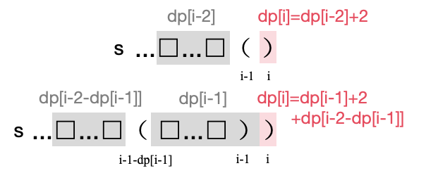
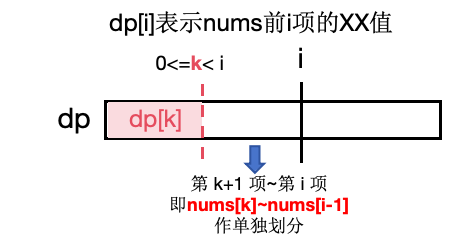
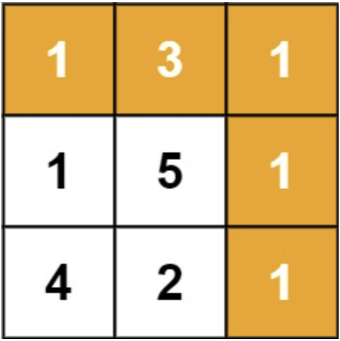
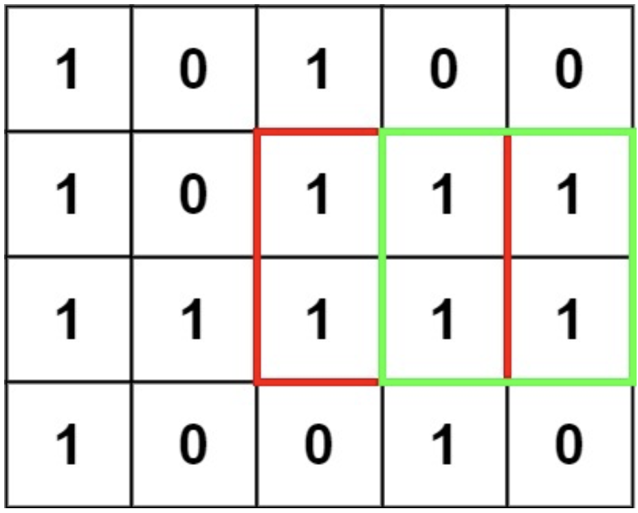
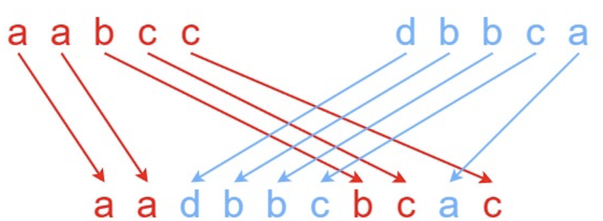

# 十五、动态规划

## 15.1 普通计数问题

### 爬楼梯 ⭐️

假设你正在爬楼梯。需要 `n` 阶你才能到达楼顶。

每次你可以爬 1 或 2 个台阶。你有多少种不同的方法可以爬到楼顶呢？

**示例**

- 输入：n = 2
- 输出：2
- 解释：有两种方法可以爬到楼顶。
    - 1 阶 + 1 阶
    - 2 阶

**思路**

- `dp[i] = dp[i-1] + dp[i-2]`
- `dp[0] = 1, dp[1] = 1`
- 斐波那契数列，返回 `dp[n]`。

**代码**

```java
class Solution {
    public int climbStairs(int n) {
        int[] dp = new int[n + 1];
        dp[0] = 1;
        dp[1] = 1;
        for (int i = 2; i <= n; i++) {
            dp[i] = dp[i - 2] + dp[i - 1];
        }
        return dp[n];
    }
}
```

### 打家劫舍 ⭐️

你是一个专业的小偷，计划偷窃沿街的房屋。每间房内都藏有一定的现金，影响你偷窃的唯一制约因素就是相邻的房屋装有相互连通的防盗系统，如果两间相邻的房屋在同一晚上被小偷闯入，系统会自动报警。

给定一个代表每个房屋存放金额的非负整数数组，计算你 不触动警报装置的情况下 ，一夜之内能够偷窃到的最高金额。

**示例**

- 输入：[1,2,3,1]
- 输出：4
- 解释：偷窃 1 号房屋 (金额 = 1) ，然后偷窃 3 号房屋 (金额 = 3)。
  偷窃到的最高金额 = 1 + 3 = 4 。

**思路**

- `dp[i] = dp[i-2] + nums[i]`
- `dp[0] = nums[0], dp[1] = max(nums[0],nums[1])`
- 返回 `dp[n-1]`

**代码**

```java
class Solution {
    public int rob(int[] nums) {
        int n = nums.length;
        if (n == 1) {
            return nums[0];
        }
        int[] dp = new int[n];
        dp[0] = nums[0];
        dp[1] = Math.max(nums[0], nums[1]);
        for (int i = 2; i < n; i++) {
            dp[i] = Math.max(dp[i - 1], dp[i - 2] + nums[i]);
        }
        return dp[n - 1];
    }
}
```

### 最长递增子序列 ⭐️⭐️

给你一个整数数组 `nums` ，找到其中最长严格递增子序列的长度。

子序列 是由数组派生而来的序列，删除（或不删除）数组中的元素而不改变其余元素的顺序。例如，`[3,6,2,7]` 是数组 `[0,3,1,6,2,2,7]`
的
子序列。

**示例**

- 输入：nums = [10,9,2,5,3,7,101,18]
- 输出：4
- 解释：最长递增子序列是 [2,3,7,101]，因此长度为 4 。

**思路**

- `dp[i]` 表示以 `i` 结尾的最长严格递增子序列的长度。
- `dp[i] = max(dp[k] + 1)，nums[k] < nums[i]`
- 返回 `max(dp[i])`

**代码**

```java
class Solution {
    public int lengthOfLIS(int[] nums) {
        int n = nums.length;
        int[] dp = new int[n];
        Arrays.fill(dp, 1);
        int ans = 1;
        for (int i = 1; i < n; i++) {
            for (int k = 0; k < i; k++) {
                if (nums[k] < nums[i]) {
                    dp[i] = Math.max(dp[i], dp[k] + 1);
                    ans = Math.max(ans, dp[i]);
                }
            }
        }
        return ans;
    }
}
```

### 最低票价 ⭐️⭐️

在一个火车旅行很受欢迎的国度，你提前一年计划了一些火车旅行。在接下来的一年里，你要旅行的日子将以一个名为 days 的数组给出。每一项是一个从
1 到 365 的整数。

火车票有 三种不同的销售方式 ：

一张 为期一天 的通行证售价为 `costs[0]` 美元；
一张 为期七天 的通行证售价为 `costs[1]` 美元；
一张 为期三十天 的通行证售价为 `costs[2]` 美元。
通行证允许数天无限制的旅行。 例如，如果我们在第 2 天获得一张 为期 7 天 的通行证，那么我们可以连着旅行 7 天：第 2 天、第 3 天、第
4 天、第 5 天、第 6 天、第 7 天和第 8 天。

返回 你想要完成在给定的列表 `days` 中列出的每一天的旅行所需要的最低消费 。

**示例**

- 输入：days = [1,2,3,4,5,6,7,8,9,10,30,31], costs = [2,7,15]
- 输出：17
- 解释： 例如，这里有一种购买通行证的方法，可以让你完成你的旅行计划：
    - 在第 1 天，你花了 costs[2] = $15 买了一张为期 30 天的通行证，它将在第 1, 2, ..., 30 天生效。
    - 在第 31 天，你花了 costs[0] = $2 买了一张为期 1 天的通行证，它将在第 31 天生效。
    - 你总共花了 $17，并完成了你计划的每一天旅行。

**思路**

- `dp[i]` 表示到第 `i` 天的最低消费。
- 如果第 `i` 天不旅行，则 `dp[i] = dp[i-1]`。
- 否则，`dp[i] = min(dp[i-1]+costs[0], dp[i-7]+costs[1], dp[i-30]+costs[2])`
- 返回 `dp[days[n-1]]`

**代码**

```java
class Solution {
    public int mincostTickets(int[] days, int[] costs) {
        int n = days.length;
        int[] dp = new int[366];
        int index = 0;

        for (int i = 1; index < n; i++) {
            // 如果今天不旅行，则继承前一天
            if (days[index] != i) {
                dp[i] = dp[i - 1];
                continue;
            }
            // 如果今天需要旅行，计算三种方案的最小值
            int oneDayCost = dp[i - 1] + costs[0];
            int sevenDayCost = dp[Math.max(0, i - 7)] + costs[1];
            int thirtyDayCost = dp[Math.max(0, i - 30)] + costs[2];
            // 选择最小的花费
            dp[i] = Math.min(oneDayCost, Math.min(sevenDayCost, thirtyDayCost));
            index++;
        }
        return dp[days[n - 1]];
    }
}
```

### 求出最长好子序列 I ⭐️⭐️⭐️

给你一个整数数组 `nums` 和一个 非负 整数 `k` 。如果一个整数序列 `seq` 满足在下标范围 `[0, seq.length - 2]` 中
最多只有 `k`
个下标 `i` 满足 `seq[i] != seq[i + 1]` ，那么我们称这个整数序列为 好 序列。

请你返回 `nums` 中 好 子序列 的最长长度。

**示例**

- 输入：nums = [1,2,3,4,5,1], k = 0
- 输出：2
- 解释：最长好子序列为 [1,2,3,4,5,1] 。

**思路**

- `dp[i][j]` 表示以 `i` 结尾的最多有 `j` 个不同元素的子序列的长度。
- 对于 `i` 之前的元素 `m`：
    - `dp[i][j] = max(dp[m][j-1] + 1)`，如果 `nums[m] != nums[i]`。
    - `dp[i][j] = max(dp[m][j] + 1)`，如果 `nums[m] == nums[i]`。
- 返回 `max(dp[i][j])`

**代码**

```java
class Solution {
    public int maximumLength(int[] nums, int k) {
        int n = nums.length;
        // 因为输入中 k 可能等于 0，所以需要处理这个边界条件
        int[][] dp = new int[n][k + 2];
        dp[0][1] = 1;
        int ans = 1;
        for (int i = 1; i < n; i++) {
            for (int j = 1; j <= k + 1; j++) {
                dp[i][j] = 1;
                for (int m = 0; m < i; m++) {
                    if (nums[m] != nums[i]) {
                        dp[i][j] = Math.max(dp[i][j], dp[m][j - 1] + 1);
                    } else {
                        dp[i][j] = Math.max(dp[i][j], dp[m][j] + 1);
                    }
                }
                ans = Math.max(ans, dp[i][j]);
            }
        }
        return ans;
    }
}
```

### 最长有效括号 ⭐️⭐️⭐️

给你一个只包含 `'('` 和 `')'` 的字符串，找出最长有效（格式正确且连续）括号
子串的长度。

**示例**

- 输入：s = "(()"
- 输出：2
- 解释：最长有效括号子串是 "()"

**思路**

- 栈：初始化栈中元素为 -1。读取到左括号加入栈中。每次读取到右括号，弹出栈顶以进行匹配。如果此时栈顶为空将该右括号加入栈中；否则计算该右括号到刚刚弹出的栈顶元素的距离。
- 动态规划：`dp[i]` 表示以 i 结尾的最长有效括号的长度。读取到右括号 `s[i]`，判断前一个字符 `s[i-1]`：
    - 如果是左括号，则 `dp[i] = dp[i - 2] + 2`。
    - 如果是右括号且以 `i-1` 结尾的最长有效括号的前面一个字符（`s[i-1-dp[i-1]]`
      ）是左括号，此时 `dp[i] = dp[i-1] + 2 + dp[i-2-dp[i-1]]`。（注意判断下标是否越界）
    - 返回 `max(dp[i])`
      

**代码**
栈：

```java
class Solution {
    public int longestValidParentheses(String s) {
        Stack<Integer> stack = new Stack<>();
        stack.push(-1);
        int ans = 0;
        for (int i = 0; i < s.length(); i++) {
            if (s.charAt(i) == '(') {
                stack.push(i);
            } else {
                Integer index = stack.pop();
                if (stack.isEmpty()) {
                    stack.push(i);
                } else {
                    ans = Math.max(ans, i - index + 1);
                }
            }
        }
        return ans;
    }
}
```

动态规划：

```java
class Solution {
    public int longestValidParentheses(String s) {
        int n = s.length();
        int[] dp = new int[n];
        int ans = 0;

        for (int i = 1; i < n; i++) {
            if (s.charAt(i) == ')') {
                // 前一个是左括号
                if (s.charAt(i - 1) == '(') {
                    dp[i] = (i - 2 >= 0 ? dp[i - 2] : 0) + 2;
                }
                // 前一个是右括号且前一个有效字符串的再前一个是左括号
                else if (i - 1 - dp[i - 1] >= 0 && s.charAt(i - 1 - dp[i - 1]) == '(') {
                    dp[i] = dp[i - 1] + 2 + (i - 2 - dp[i - 1] >= 0 ? dp[i - 2 - dp[i - 1]] : 0);
                }
            }
            ans = Math.max(ans, dp[i]);
        }
        return ans;
    }
}
```

### 鸡蛋掉落-两枚鸡蛋 ⭐️⭐️⭐️

给你 2 枚相同 的鸡蛋，和一栋从第 1 层到第 `n` 层共有 `n` 层楼的建筑。

已知存在楼层 `f` ，满足 `0 <= f <= n` ，任何从 高于 `f` 的楼层落下的鸡蛋都 会碎 ，从 `f` 楼层或比它低 的楼层落下的鸡蛋都
不会碎 。

每次操作，你可以取一枚 没有碎 的鸡蛋并把它从任一楼层 `x` 扔下（满足 `1 <= x <= n`
）。如果鸡蛋碎了，你就不能再次使用它。如果某枚鸡蛋扔下后没有摔碎，则可以在之后的操作中 重复使用 这枚鸡蛋。

请你计算并返回要确定 `f` 确切的值 的 最小操作次数 是多少？

**示例**

- 输入：n = 100
- 输出：14

**思路**

- `dp[i]` 表示最高 `i` 层楼的最小操作次数。
- 枚举鸡蛋扔下的位置 `k`，此时会有两种情况：
    - 如果鸡蛋碎了，说明答案的范围是 `[0,k−1]`，但我们只剩下一枚鸡蛋，因此我们只能依次在第 `1,2,⋯,k−1` 层扔下鸡蛋得到答案，需要
      `k−1` 次；
    - 如果鸡蛋没碎，说明答案的范围是 `[k,i]`，并且我们还剩下两枚鸡蛋，这就等价于一栋 `i−k` 层的建筑的子问题，需要 `f[i−k]`
      次。
- 为了得到确切的楼层，需要的操作次数就等于上述二者的较大值，再加上
  1。因此我们可以得到状态转移方程：`dp[i] = min(max(dp[k - 1], dp[i - k]) + 1)`，`1 <= k <= i`。

**代码**

```java
class Solution {
    public int twoEggDrop(int n) {
        int[] dp = new int[n + 1];
        for (int i = 1; i <= n; i++) {
            dp[i] = Integer.MAX_VALUE / 2;
            for (int k = 1; k <= i; k++) {
                dp[i] = Math.min(dp[i], 1 + Math.max(k - 1, dp[i - k]));
            }
        }
        return dp[n];
    }
}
```

## 15.2 凑数问题

### 完全平方数 ⭐️⭐️

给你一个整数 `n` ，返回 和为 `n` 的完全平方数的最少数量 。

完全平方数 是一个整数，其值等于另一个整数的平方；换句话说，其值等于一个整数自乘的积。例如，1、4、9 和 16 都是完全平方数，而 3 和
11 不是。

**示例**

- 输入：n = 12
- 输出：3
- 解释：12 = 4 + 4 + 4

**思路**

- 先生成 `n` 以内的所有完全平方数
- `dp[i] = min(dp[i - k] + 1)`，`k` 为 `i` 以内的完全平方数。
- `dp[0] = 0`
- 返回 `dp[n]`

**代码**

```java
class Solution {
    public int numSquares(int n) {
        List<Integer> squares = new ArrayList<>();
        for (int i = 0; i * i <= n; i++) {
            squares.add(i * i);
        }
        int[] dp = new int[n + 1];
        dp[0] = 0;
        for (int i = 1; i <= n; i++) {
            dp[i] = Integer.MAX_VALUE - 1;
            for (int square : squares) {
                if (i - square >= 0) {
                    dp[i] = Math.min(dp[i - square] + 1, dp[i]);
                }
            }
        }
        return dp[n];
    }
}
```

### 零钱兑换 ⭐️⭐️

给你一个整数数组 `coins` ，表示不同面额的硬币；以及一个整数 `amount` ，表示总金额。

计算并返回可以凑成总金额所需的 最少的硬币个数 。如果没有任何一种硬币组合能组成总金额，返回 `-1` 。

你可以认为每种硬币的数量是无限的。

**示例**

- 输入：coins = [1, 2, 5], amount = 11
- 输出：3
- 解释：11 = 5 + 5 + 1

**思路**

- 与上一题类似，这里完全平方数变为固定面额的零钱。
- `dp[i] = min(dp[i - k] + 1)`，`k` 为零钱的所有面额。
- `dp[0] = 0`
- 返回 `dp[n]`

**代码**

```java
class Solution {
    public int coinChange(int[] coins, int amount) {
        int[] dp = new int[amount + 1];
        dp[0] = 0;
        final int MAX_VALUE = 114514;
        for (int i = 1; i <= amount; i++) {
            dp[i] = MAX_VALUE;
            for (int coin : coins) {
                if (i - coin >= 0) {
                    dp[i] = Math.min(dp[i], dp[i - coin] + 1);
                }
            }
        }
        return dp[amount] == MAX_VALUE ? -1 : dp[amount];
    }
}
```

### 整数拆分 ⭐️⭐️

给定一个正整数 `n` ，将其拆分为 `k` 个 正整数 的和`（ k >= 2 ）`，并使这些整数的乘积最大化。

返回 你可以获得的最大乘积 。

**示例**

- 输入: n = 10
- 输出: 36
- 解释: 10 = 3 + 3 + 4, 3 × 3 × 4 = 36。

**思路**

- `dp[i]` 表示和为 `i` 的最大乘积。
- 对于任意比 `i` 小的正整数 `j`，取拆 `j` 和不拆 `j` 两种方案的最大值，即 `dp[i] = j * max(i-j, dp[i-j]))`
- 返回 `dp[n]`

**代码**

```java
class Solution {
    public int integerBreak(int n) {
        int[] dp = new int[n + 1];
        for (int i = 2; i <= n; i++) {
            for (int j = 1; j < i; j++) {
                dp[i] = Math.max(dp[i], Math.max(j * (i - j), dp[i - j] * j));
            }
        }
        return dp[n];
    }
}
```

## 15.3 分割问题

### 单词拆分 ⭐️⭐️

给你一个字符串 `s` 和一个字符串列表 `wordDict` 作为字典。如果可以利用字典中出现的一个或多个单词拼接出 `s` 则返回 `true`。

注意：不要求字典中出现的单词全部都使用，并且字典中的单词可以重复使用。

**示例**

- 输入: s = "leetcode", wordDict = ["leet", "code"]
- 输出: true
- 解释: 返回 true 因为 "leetcode" 可以由 "leet" 和 "code" 拼接成。

**思路**

- `dp[i]` 表示 `s` 前 `i` 个字符是否可拆分。
- `dp[i] = dp[k] && s[k:i] in wordDict`，只要 `true` 一次即 `dp[i] = true`。
- `dp[0] = true`
- 返回 `dp[n]`
- 划分问题公式：
  

**代码**

```java
class Solution {
    public boolean wordBreak(String s, List<String> wordDict) {
        Set<String> words = new HashSet<>(wordDict);
        int n = s.length();
        boolean[] dp = new boolean[n + 1];
        dp[0] = true;
        for (int i = 1; i <= n; i++) {
            for (int k = 0; k < i; k++) {
                if (dp[k] && words.contains(s.substring(k, i))) {
                    dp[i] = true;
                    break;
                }
            }
        }
        return dp[n];
    }
}
```

### 戳气球 ⭐️⭐️⭐️⭐️

有 `n` 个气球，编号为 `0` 到 `n - 1`，每个气球上都标有一个数字，这些数字存在数组 nums 中。

现在要求你戳破所有的气球。戳破第 `i` 个气球，你可以获得 `nums[i - 1] * nums[i] * nums[i + 1]` 枚硬币。 这里的 `i - 1`
和 `i + 1` 代表和 `i` 相邻的两个气球的序号。如果 `i - 1` 或 `i + 1` 超出了数组的边界，那么就当它是一个数字为 `1` 的气球。

求所能获得硬币的最大数量。

**示例**

- 输入：nums = [3,1,5,8]
- 输出：167
- 解释：
  nums = [3,1,5,8] --> [3,5,8] --> [3,8] --> [8] --> []
  coins = 3*1*5 + 3*5*8 + 1*3*8 + 1*8*1 = 167

**思路**

- 先在 `nums` 两端加上 `1`，方便处理边界情况。
- `dp[i][j]` 表示戳破 `i` 到 `j` 之间的气球能获得的最大硬币数量。
- `dp[i][j] = max(dp[i][k] + dp[k][j] + nums[i] * nums[k] * nums[j])`，其中 `i < k < j`。
- 返回 `dp[0][n+1]`。

**代码**

```java
class Solution {
    public int maxCoins(int[] nums) {
        int n = nums.length;
        // 处理边界条件
        int[] extendedNums = new int[n + 2];
        extendedNums[0] = 1;
        extendedNums[n + 1] = 1;
        System.arraycopy(nums, 0, extendedNums, 1, n);

        int[][] dp = new int[n + 2][n + 2];
        // 先遍历区间长度
        // 如果 i + 1 == j 则 dp[i][j] == 0
        for (int len = 2; len < n + 2; len++) {
            // 再遍历左端点
            for (int i = 0; i < n + 2 - len; i++) {
                int j = i + len;
                for (int k = i + 1; k < j; k++) {
                    dp[i][j] = Math.max(dp[i][j], dp[i][k] + dp[k][j] + extendedNums[i] * extendedNums[j] * extendedNums[k]);
                }

            }
        }
        return dp[0][n + 1];
    }
}
```

## 15.4 最大子数组和问题（Kadane算法）

### 最大子数组和 ⭐️

给你一个整数数组 `nums` ，请你找出一个具有最大和的连续子数组（子数组最少包含一个元素），返回其最大和。

子数组是数组中的一个连续部分。

**示例**

- 输入：nums = [-2,1,-3,4,-1,2,1,-5,4]
- 输出：6
- 解释：连续子数组 [4,-1,2,1] 的和最大，为 6 。

**思路**

- 动态规划。`dp[i]`表示以 `i` 结尾的子数组的最大和。
- `dp[i]=max(dp[i-1]+nums[i],nums[i])`
- `ans=max(dp[i])`

**代码**

```java
class Solution {
    public int maxSubArray(int[] nums) {
        int n = nums.length;
        int[] dp = new int[n];
        int ans = nums[0];
        dp[0] = nums[0];
        for (int i = 1; i < n; i++) {
            dp[i] = Math.max(dp[i - 1]+nums[i], nums[i]);
            ans = Math.max(dp[i], ans);
        }
        return ans;
    }
}
```

### 环形子数组的最大和 ⭐️⭐️⭐️

给定一个长度为 `n` 的环形整数数组 `nums` ，返回 `nums` 的非空 子数组 的最大可能和 。

环形数组 意味着数组的末端将会与开头相连呈环状。形式上， `nums[i]` 的下一个元素是 `nums[(i + 1) % n]` ， `nums[i]`
的前一个元素是 `nums[(i - 1 + n) % n]` 。

子数组 最多只能包含固定缓冲区 nums 中的每个元素一次。形式上，对于子数组 `nums[i], nums[i + 1], ..., nums[j]`
，不存在 `i <= k1, k2 <= j` 其中 `k1 % n == k2 % n` 。

**示例**

- 输入：nums = [1,-2,3,-2]
- 输出：3
- 解释：从子数组 [3] 得到最大和 3

**思路**

- 使用**Kadane算法**（动态规划）求取非环形数组的最大子数组和 `ansMax`。
- 计算整个数组的总和 `sum`。
- 使用**Kadane算法**求取非环形数组的最小子数组和 `ansMin`。
- 环形子数组最大和即为 `sum - ansMin`，但要注意处理全负数的情况，若 `ansMin == sum`，表示数组全为负数，此时返回 `ansMax`
  ；否则返回两者的最大值：`max(ansMax, sum - ansMin)`。

**代码**

```java
class Solution {
    public int maxSubarraySumCircular(int[] nums) {
        int n = nums.length;
        int[] dp = new int[n];
        // 非循环子数组的最大值
        int ansMax = nums[0];
        dp[0] = nums[0];
        for (int i = 1; i < n; i++) {
            dp[i] = Math.max(dp[i - 1] + nums[i], nums[i]);
            ansMax = Math.max(ansMax, dp[i]);
        }
        // 循环子数组的最大值 = 数组总和 - 非循环子数组的最小值
        int sum = 0;
        for (int num : nums) {
            sum += num;
        }
        int ansMin = nums[0];
        dp[0] = nums[0];
        for (int i = 1; i < n; i++) {
            dp[i] = Math.min(dp[i - 1] + nums[i], nums[i]);
            ansMin = Math.min(ansMin, dp[i]);
        }
        // 特殊情况：全是负数
        if (ansMin == sum) {
            return ansMax;
        }
        return Math.max(ansMax, sum - ansMin);
    }
}
```

### 乘积最大子数组 ⭐️⭐️⭐️

给你一个整数数组 `nums` ，请你找出数组中乘积最大的非空连续子数组
（该子数组中至少包含一个数字），并返回该子数组所对应的乘积。

测试用例的答案是一个 32-位 整数。

**示例**

- 输入: nums = [2,3,-2,4]
- 输出: 6
- 解释: 子数组 [2,3] 有最大乘积 6。

**思路**

- 和最大子数组：`dp[i] = max(dp[i - 1] + nums[i], nums[i])`
- 乘积最大子数组：由于乘法的特殊性质，即两个很小的负数相乘会变成很大的正数，因此需要再开一个记录积最小的 `dp` 数组 `dpMin`
  ，然后与积最大 `dpMax` 数组交叉相乘，取最大值。
- `dpMax[i] = max(dpMax[i-1] * nums[i], dpMin[i-1] * nums[i], nums[i])`
- `dpMin[i] = min(dpMax[i-1] * nums[i], dpMin[i-1] * nums[i], nums[i])`
- 返回 `max(dpMax[i])`

**代码**

```java
class Solution {
    public int maxProduct(int[] nums) {
        int n = nums.length;
        double[] dpMax = new double[n];
        double[] dpMin = new double[n];
        dpMax[0] = nums[0];
        dpMin[0] = nums[0];
        for (int i = 1; i < n; i++) {
            dpMax[i] = Math.max(dpMax[i - 1] * nums[i], Math.max(nums[i], dpMin[i - 1] * nums[i]));
            dpMin[i] = Math.min(dpMin[i - 1] * nums[i], Math.min(nums[i], dpMax[i - 1] * nums[i]));
        }
        double ans = nums[0];
        for (int i = 0; i < n; i++) {
            ans = Math.max(ans, dpMax[i]);
        }
        return (int) ans;
    }
}
```

## 15.5 矩阵问题

### 杨辉三角 ⭐️⭐️

给定一个非负整数 `numRows`，生成「杨辉三角」的前 `numRows` 行。

在「杨辉三角」中，每个数是它左上方和右上方的数的和。

**示例**

- 输入: numRows = 5
- 输出: \[[1],[1,1],[1,2,1],[1,3,3,1],[1,4,6,4,1]]

**思路**

- `dp[i][j] = dp[i-1][j-1] + dp[i-1][j]`
- 注意检查是否越界。

**代码**

```java
class Solution {
    public List<List<Integer>> generate(int numRows) {
        List<List<Integer>> rows = new ArrayList<>();
        List<Integer> row = new ArrayList<>();
        // 第一行
        row.add(1);
        rows.add(row);
        for (int i = 1; i < numRows; i++) {
            List<Integer> thisRow = new ArrayList<>();
            for (int j = 0; j < i + 1; j++) {
                List<Integer> prevRow = rows.get(i - 1);
                // prev的长度是i
                int a = j - 1 < 0 ? 0 : prevRow.get(j - 1);
                int b = j > i - 1 ? 0 : prevRow.get(j);
                thisRow.add(a + b);
            }
            rows.add(thisRow);
        }
        return rows;
    }
}
```

### 三角形最小路径和 ⭐️⭐️

给定一个三角形 `triangle` ，找出自顶向下的最小路径和。

每一步只能移动到下一行中相邻的结点上。相邻的结点 在这里指的是 下标 与 上一层结点下标 相同或者等于 上一层结点下标 + 1
的两个结点。也就是说，如果正位于当前行的下标 `i` ，那么下一步可以移动到下一行的下标 `i` 或 `i + 1` 。

**示例**

- 输入：triangle = \[[2],[3,4],[6,5,7],[4,1,8,3]]
- 输出：11
- 解释：如下面简图所示：

```
   2
  3 4
 6 5 7
4 1 8 3
```

自顶向下的最小路径和为 11（即，2 + 3 + 5 + 1 = 11）。

**思路**

- `dp[i][j] = min(dp[i - 1][j - 1], dp[i - 1][j]) + triangle[i][j]`
- 注意判断边界条件。最后一行 `dp[n - 1]` 的最小值即为答案。

**代码**

```java
class Solution {
    public int minimumTotal(List<List<Integer>> triangle) {
        int n = triangle.size();
        int[][] dp = new int[n][n];
        dp[0][0] = triangle.get(0).get(0);
        for (int i = 1; i < n; i++) {
            for (int j = 0; j <= i; j++) {
                if (j == 0) {
                    dp[i][j] = dp[i - 1][j] + triangle.get(i).get(j);
                } else if (j == i) {
                    dp[i][j] = dp[i - 1][j - 1] + triangle.get(i).get(j);
                } else {
                    dp[i][j] = Math.min(dp[i - 1][j], dp[i - 1][j - 1]) + triangle.get(i).get(j);
                }
            }
        }
        int ans = Integer.MAX_VALUE;
        for (int j = 0; j < n; j++) {
            ans = Math.min(ans, dp[n - 1][j]);
        }
        return ans;
    }
}
```

### 不同路径 ⭐️⭐️

一个机器人位于一个 `m x n` 网格的左上角 （起始点在下图中标记为 `“Start”` ）。

机器人每次只能向下或者向右移动一步。机器人试图达到网格的右下角（在下图中标记为 `“Finish”` ）。

问总共有多少条不同的路径？

**示例**

- 输入：m = 3, n = 7
- 输出：28

**思路**

- `dp[i][j] = dp[i - 1][j] + dp[i][j - 1]`
- `dp[i][j] = 1`，`[i,j]` 为地图边界。
- 返回 `dp[m - 1][n - 1]`

**代码**

```java
class Solution {
    public int uniquePaths(int m, int n) {
        int[][] dp = new int[m][n];
        for (int i = 0; i < m; i++) {
            for (int j = 0; j < n; j++) {
                if (i == 0 || j == 0) {
                    dp[i][j] = 1;
                } else {
                    dp[i][j] = dp[i - 1][j] + dp[i][j - 1];
                }
            }
        }
        return dp[m - 1][n - 1];
    }
}
```

### 最小路径和 ⭐️⭐️

给定一个包含非负整数的 `m x n` 网格 `grid` ，请找出一条从左上角到右下角的路径，使得路径上的数字总和为最小。

说明：每次只能向下或者向右移动一步。

**示例**

- 输入：grid = [[1,3,1],[1,5,1],[4,2,1]]
- 输出：7
- 解释：因为路径 1→3→1→1→1 的总和最小。
- 

**思路**

- `dp[i][j] = min(dp[i - 1][j], dp[i][j - 1]) + grid[i][j]`
- 注意判断边界。
- 返回 `dp[m - 1][n - 1]`

**代码**

```java
class Solution {
    public int minPathSum(int[][] grid) {
        int n = grid.length;
        int m = grid[0].length;
        int[][] dp = new int[n][m];
        dp[0][0] = grid[0][0];
        for (int i = 0; i < n; i++) {
            for (int j = 0; j < m; j++) {
                if (i == 0 && j > 0) {
                    dp[i][j] = dp[i][j - 1] + grid[i][j];
                } else if (j == 0 && i > 0) {
                    dp[i][j] = dp[i - 1][j] + grid[i][j];
                } else if (i > 0 && j > 0) {
                    dp[i][j] = Math.min(dp[i - 1][j], dp[i][j - 1]) + grid[i][j];
                }
            }
        }
        return dp[n - 1][m - 1];
    }
}
```

### 不同路径 II ⭐️⭐️⭐️

一个机器人位于一个 `m x n` 网格的左上角 （起始点在下图中标记为 `“Start”` ）。

机器人每次只能向下或者向右移动一步。机器人试图达到网格的右下角（在下图中标记为 `“Finish”`）。

现在考虑网格中有障碍物。那么从左上角到右下角将会有多少条不同的路径？

网格中的障碍物和空位置分别用 `1` 和 `0` 来表示。

**示例**

- 输入：obstacleGrid = \[[0,0,0],[0,1,0],[0,0,0]]
- 输出：2
- 解释：3x3 网格的正中间有一个障碍物。
  从左上角到右下角一共有 2 条不同的路径：

1. 向右 -> 向右 -> 向下 -> 向下
2. 向下 -> 向下 -> 向右 -> 向右
   

**思路**

- 处理边界条件：起点和终点不能有障碍物。
- `dp[i][j] = dp[i - 1][j] + dp[i][j - 1]，obstacleGrid[i - 1][j]==0 && obstacleGrid[i][j - 1] == 0`。
- `dp[0][0] = 1`
- 返回 `dp[n - 1][m - 1]`

**代码**

```java
class Solution {
    public int uniquePathsWithObstacles(int[][] obstacleGrid) {
        int n = obstacleGrid.length;
        int m = obstacleGrid[0].length;
        if (obstacleGrid[0][0] == 1 || obstacleGrid[n - 1][m - 1] == 1) {
            return 0;
        }
        int[][] dp = new int[n][m];
        dp[0][0] = 1;
        for (int i = 0; i < n; i++) {
            for (int j = 0; j < m; j++) {
                if (i > 0 || j > 0) {
                    int top = i > 0 && obstacleGrid[i - 1][j] == 0 ? dp[i - 1][j] : 0;
                    int left = j > 0 && obstacleGrid[i][j - 1] == 0 ? dp[i][j - 1] : 0;
                    dp[i][j] = top + left;
                }
            }
        }
        return dp[n - 1][m - 1];
    }
}
```

### 最大正方形 ⭐️⭐️⭐️

在一个由 `'0'` 和 `'1'` 组成的二维矩阵内，找到只包含 `'1'` 的最大正方形，并返回其面积。

**示例**

- 输入：matrix = \[["1","0","1","0","0"],["1","0","1","1","1"],["1","1","1","1","1"],["1","0","0","1","0"]]
- 输出：4
- 

**思路**

- `dp[i][j]` 表示以 `matrix[i][j]` 为右下角的最大正方形的边长。
- 如果 `matrix[i][j]` 为 `0`，那么 `dp[i][j] = 0`，因为无法构成正方形。
- 如果 `matrix[i][j]` 为 `1`，则 `dp[i][j]`
  的值取决于其左边、上边和左上方三个位置的最小值，`dp[i][j] = min(dp[i − 1][j], dp[i][j − 1], dp[i − 1][j − 1]) + 1`。
- 返回遍历过程中 `dp` 的最大值 `ans` 的平方。

**代码**

```java
class Solution {
    public int maximalSquare(char[][] matrix) {
        int n = matrix.length;
        int m = matrix[0].length;
        int ans = 0;

        int[][] dp = new int[n + 1][m + 1];
        for (int i = 1; i <= n; i++) {
            for (int j = 1; j <= m; j++) {
                if (matrix[i - 1][j - 1] == '1') {
                    dp[i][j] = Math.min(Math.min(dp[i - 1][j], dp[i][j - 1]), dp[i - 1][j - 1]) + 1;
                    ans = Math.max(ans, dp[i][j]);
                }
            }
        }
        return ans * ans;
    }
}
```

## 15.6 字符串二维动态规划

### 最长公共子序列 ⭐️⭐️

给定两个字符串 `text1` 和 `text2`，返回这两个字符串的最长 公共子序列 的长度。如果不存在 公共子序列 ，返回 0 。

一个字符串的 子序列 是指这样一个新的字符串：它是由原字符串在不改变字符的相对顺序的情况下删除某些字符（也可以不删除任何字符）后组成的新字符串。

例如，`"ace"` 是 `"abcde"` 的子序列，但 `"aec"` 不是 `"abcde"` 的子序列。
两个字符串的 公共子序列 是这两个字符串所共同拥有的子序列。

**示例**

- 输入：text1 = "abcde", text2 = "ace"
- 输出：3
- 解释：最长公共子序列是 "ace" ，它的长度为 3 。

**思路**

- `dp[i][j]` 表示 `s1` 的前 `i` 项和 `s2` 的前 `j` 项最长公共子序列的长度。
- `dp[i][j] =`
    - `dp[i - 1][j - 1] + 1, if s1[i] == s2[j]`,
    - `max(dp[i - 1][j], dp[i][j - 1]), else`。

**代码**

```java
class Solution {
    public int longestCommonSubsequence(String text1, String text2) {
        int m = text1.length();
        int n = text2.length();

        int[][] dp = new int[m + 1][n + 1];
        for (int i = 1; i <= m; i++) {
            for (int j = 1; j <= n; j++) {
                if (text1.charAt(i - 1) == text2.charAt(j - 1)) {
                    dp[i][j] = dp[i - 1][j - 1] + 1;
                } else {
                    dp[i][j] = Math.max(dp[i - 1][j], dp[i][j - 1]);
                }
            }
        }
        return dp[m][n];
    }
}
```

拓展：回溯输出最长公共子序列：

```java
int i = m;
int j = n;
StringBuilder sb = new StringBuilder();
while (i > 0 && j > 0) {
    if (text1.charAt(i - 1) == text2.charAt(j - 1)) {
        sb.append(text1.charAt(i - 1));
        i--;
        j--;
    } else if (dp[i][j] == dp[i - 1][j]) {
        i--;
    } else {
        j--;
    }
}
System.out.println(sb.reverse());
```

### 最长重复子数组 ⭐️⭐️

给两个整数数组 `nums1` 和 `nums2` ，返回 两个数组中 公共的 、长度最长的子数组的长度 。

**示例**

- 输入：nums1 = [1,2,3,2,1], nums2 = [3,2,1,4,7]
- 输出：3
- 解释：长度最长的公共子数组是 [3,2,1] 。

**思路**

- 最长公共子串。
- `dp[i][j]` 表示 `s1` 的前 `i` 项和 `s2` 的前 `j` 项最长公共子串的长度。
    - `dp[i][j] = dp[i - 1][j - 1] + 1, if s[i] == s[j]`
    - `dp[i][j] = 0, else`
- 返回 `dp[i][j]` 的最大值。

**代码**

```java
class Solution {
    public int findLength(int[] nums1, int[] nums2) {
        int n = nums1.length;
        int m = nums2.length;
        int[][] dp = new int[n + 1][m + 1];
        int ans = 0;

        for (int i = 1; i <= n; i++) {
            for (int j = 1; j <= m; j++) {
                if (nums1[i - 1] == nums2[j - 1]) {
                    dp[i][j] = dp[i - 1][j - 1] + 1;
                } else {
                    dp[i][j] = 0;
                }
                ans = Math.max(ans, dp[i][j]);
            }
        }
        return ans;
    }
}
```

### 编辑距离 ⭐️⭐️⭐️

给你两个单词 `word1` 和 `word2`， 请返回将 `word1` 转换成 `word2` 所使用的最少操作数。

你可以对一个单词进行如下三种操作：

- 插入一个字符
- 删除一个字符
- 替换一个字符

**示例**

- 输入：word1 = "horse", word2 = "ros"
- 输出：3
- 解释：
    - horse -> rorse (将 'h' 替换为 'r')
    - rorse -> rose (删除 'r')
    - rose -> ros (删除 'e')

**思路**

- `dp[i][j]` 表示将 `s1` 前 `i` 项变成 `s2` 前 `j` 项需要的最小操作次数。
- `dp[i][j] =`
    - `dp[i - 1][j - 1], if s1[i] == s2[j]`；
    - `min(dp[i - 1][j], dp[i - 1][j - 1], dp[i][j - 1]) + 1, else`。
- 解释：
    - `dp[i - 1][j]` 表示先将 `s1` 前 `i - 1` 项变成 `s2` 前 `j` 项，再删掉 `s1` 的第 `i` 项；
    - `dp[i][j - 1]` 表示先将 `s1` 前 `i` 项变成 `s2` 前 `j - 1` 项，再添加 `s2` 的第 `j` 项；
    - `dp[i - 1][j - 1]` 表示先将 `s1` 前 `i - 1` 项变成 `s2` 前 `j - 1` 项，再将 `s1` 的第 `i` 项替换为 `s2` 的第 `j` 项。
- 边界条件：`dp[i][0] = i`，`dp[0][j] = j`。即将一个任意长度的字符串与一个空字符串相互转换的操作次数为该字符串的长度。

**代码**

```java
class Solution {
    public int minDistance(String word1, String word2) {
        int m = word1.length();
        int n = word2.length();
        int[][] dp = new int[m + 1][n + 1];
        for (int i = 0; i <= m; i++) {
            dp[i][0] = i;
        }
        for (int j = 0; j <= n; j++) {
            dp[0][j] = j;
        }
        for (int i = 1; i <= m; i++) {
            for (int j = 1; j <= n; j++) {
                // 无需编辑
                if (word1.charAt(i - 1) == word2.charAt(j - 1)) {
                    dp[i][j] = dp[i - 1][j - 1];
                }
                // 需要编辑
                else {
                    dp[i][j] = Math.min(Math.min(dp[i - 1][j], dp[i][j - 1]), dp[i - 1][j - 1]) + 1;
                }
            }
        }
        return dp[m][n];
    }
}
```

### 交错字符串 ⭐️⭐️⭐️

给定三个字符串 `s1、s2、s3`，请你帮忙验证 `s3` 是否是由 `s1` 和 `s2` 交错 组成的。

两个字符串 `s` 和 `t` 交错 的定义与过程如下，其中每个字符串都会被分割成若干 非空
子字符串：

- `s = s1 + s2 + ... + sn`
- `t = t1 + t2 + ... + tm`
- `|n - m| <= 1`
  交错 是 `s1 + t1 + s2 + t2 + s3 + t3 + ...` 或者 `t1 + s1 + t2 + s2 + t3 + s3 + ...`
  注意：`a + b` 意味着字符串 `a` 和 `b` 连接。

**示例**

- 输入：s1 = "aabcc", s2 = "dbbca", s3 = "aadbbcbcac"
- 输出：true
- 

**思路**

- `dp[i][j]` 表示 `s1` 前 `i` 项和 `s2` 前 `j` 项是否能够组成交错字符串 `s3` 前 `i + j` 项。
- `dp[0][0] = true`，需要初始化 `dp[i][0]` 和 `dp[0][j]`。
- `dp[i][j]` 如果为真，需要满足两种情形之一即可（注意处理边界情况）：
    - 第一种，`dp[i - 1][j] && s1[i] == s3[i + j]`
    - 第二种，`dp[i][j - 1] && s2[j] == s3[i + j]`

**代码**

```java
class Solution {
    public boolean isInterleave(String s1, String s2, String s3) {
        int len1 = s1.length();
        int len2 = s2.length();
        int len3 = s3.length();
        if (len1 + len2 != len3) {
            return false;
        }
        boolean[][] dp = new boolean[len1 + 1][len2 + 1];
        dp[0][0] = true;
        for (int i = 1; i <= len1; i++) {
            dp[i][0] = dp[i - 1][0] && s1.charAt(i - 1) == s3.charAt(i - 1);
        }
        for (int j = 1; j <= len2; j++) {
            dp[0][j] = dp[0][j - 1] && s2.charAt(j - 1) == s3.charAt(j - 1);
        }
        for (int i = 1; i <= len1; i++) {
            for (int j = 1; j <= len2; j++) {
                dp[i][j] = (dp[i - 1][j] && s1.charAt(i - 1) == s3.charAt(i + j - 1))
                        || (dp[i][j - 1] && s2.charAt(j - 1) == s3.charAt(i + j - 1));
            }
        }
        return dp[len1][len2];
    }
}
```

### 最长回文子串 ⭐️⭐️⭐️

给你一个字符串 `s`，找到 `s` 中最长的回文子串。

**示例**

- 输入：s = "babad"
- 输出："bab"
- 解释："aba" 同样是符合题意的答案。

**思路**

- `dp[i][j]` 表示 `s[i:j]` 是否为回文串。
- `dp[i][j] =`
    - `true, if i == j`；
    - `s[i] == s[j], if i + 1 == j`；
    - `dp[i + 1][j - 1] && s[i] == s[j], else`。
- `i` 从 `n-2` 迭代到 0，`j` 从 `i` 迭代到 `n-1`。
- 返回使得 `dp[i][j] = true` 的 `max(j - i + 1)`，对应字符串为 `s.subString(i, j+1)`。

**代码**

```java
class Solution {
    public String longestPalindrome(String s) {
        int n = s.length();
        if (n == 1) {
            return s;
        }
        boolean[][] dp = new boolean[n][n];
        int ans = 0;
        String p = "";
        dp[n - 1][n - 1] = true;
        for (int i = n - 2; i >= 0; i--) {
            for (int j = i; j < n; j++) {
                if (j == i) {
                    dp[i][j] = true;
                } else if (j - i == 1) {
                    dp[i][j] = s.charAt(i) == s.charAt(j);
                } else {
                    dp[i][j] = s.charAt(i) == s.charAt(j) && dp[i + 1][j - 1];
                }
                if (dp[i][j]) {
                    if (j - i + 1 > ans) {
                        p = s.substring(i, j + 1);
                    }
                    ans = Math.max(ans, j - i + 1);
                }
            }
        }
        return p;
    }
}
```

## 15.7 其他二维动态规划

### 分割等和子集 ⭐️⭐️

给你一个 只包含正整数 的 非空 数组 `nums` 。请你判断是否可以将这个数组分割成两个子集，使得两个子集的元素和相等。

**示例**

- 输入：nums = [1,5,11,5]
- 输出：true
- 解释：数组可以分割成 [1, 5, 5] 和 [11] 。

**思路**

- 0-1 背包问题。重量与价值都为 `nums`。在容量为 `sum/2` 下求取得的价值最大值。如果不足 `sum/2` 则无法分割。
- 0-1背包问题：`dp[i][j] = max(dp[i-1][j],dp[i-1][j-w[i]]+v[i]), if j>=w[i]; else dp[i-1][j]`

**代码**

```java
class Solution {
    public boolean canPartition(int[] nums) {
        int n = nums.length;
        int sum = 0;
        for (int num : nums) {
            sum += num;
        }
        if (sum % 2 != 0) {
            return false;
        }
        int p = sum / 2;
        // 0-1背包问题
        int[][] dp = new int[n + 1][p + 1];
        for (int i = 1; i <= n; i++) {
            for (int j = 1; j <= p; j++) {
                if (j - nums[i - 1] >= 0) {
                    dp[i][j] = Math.max(dp[i - 1][j], dp[i - 1][j - nums[i - 1]] + nums[i - 1]);
                } else {
                    dp[i][j] = dp[i - 1][j];
                }
            }
        }
        return dp[n][p] == p;
    }
}
```

- 补：完全背包问题：`dp[i][j] = max(dp[i-1][j],dp[i][j-w[i]]+v[i]), if j>=w[i]; else dp[i-1][j]`

### 买卖股票的最佳时机 IV ⭐️⭐️⭐️⭐️⭐️

给你一个整数数组 `prices` 和一个整数 `k` ，其中 `prices[i]` 是某支给定的股票在第 `i` 天的价格。

设计一个算法来计算你所能获取的最大利润。你最多可以完成 `k` 笔交易。也就是说，你最多可以买 `k` 次，卖 `k` 次。

注意：你不能同时参与多笔交易（你必须在再次购买前出售掉之前的股票）。

**示例**

- 输入：k = 2, prices = [3,2,6,5,0,3]
- 输出：7
- 解释：在第 2 天 (股票价格 = 2) 的时候买入，在第 3 天 (股票价格 = 6) 的时候卖出, 这笔交易所能获得利润 = 6-2 = 4 。
  随后，在第 5 天 (股票价格 = 0) 的时候买入，在第 6 天 (股票价格 = 3) 的时候卖出, 这笔交易所能获得利润 = 3-0 = 3 。

**思路**

- 状态定义：
    - `buy[i][j]`：表示在第 `j` 天进行 `i` 次交易后，最后一次买入后的最大利润。
    - `sell[i][j]`：表示在第 `j` 天进行 `i` 次交易后，最后一次卖出后的最大利润。
- 状态转移：对于每一次交易，状态转移方程如下（注意处理边界条件）：
    - `buy[i][j] = max(buy[i][j - 1], sell[i - 1][j - 1] - prices[j])`。我们可以选择不买入（保持前一天的状态），或者在第 `j`
      天进行第 `i` 次买入。
    - `sell[i][j] = max(sell[i][j - 1], buy[i][j - 1] + prices[j])`。我们可以选择不卖出（保持前一天的状态），或者在第 `j`
      天进行第 `i` 次卖出。
- 返回 `sell[k][n]`，即 `k` 次交易在最后一天的最大利润。

**代码**

```java
class Solution {
    public int maxProfit(int k, int[] prices) {
        int n = prices.length;
        int[][] buy = new int[k + 1][n];
        int[][] sell = new int[k + 1][n];

        for (int i = 1; i <= k; i++) {
            for (int j = 0; j < n; j++) {
                buy[i][j] = j > 0 ? Math.max(buy[i][j - 1], sell[i - 1][j - 1] - prices[j]) : -prices[j];
                sell[i][j] = j > 0 ? Math.max(sell[i][j - 1], buy[i][j - 1] + prices[j]) : 0;
            }
        }
        return sell[k][n - 1];
    }
}
```
