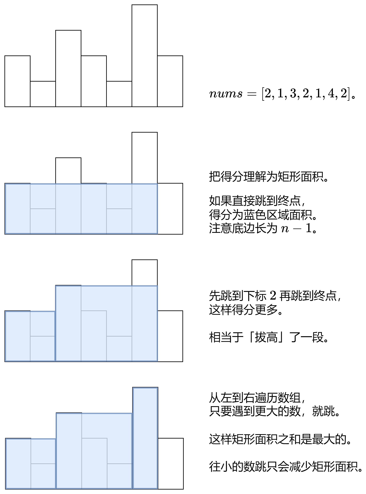

# 十四、贪心算法

## 14.1 贪心算法

### 最长回文串 ⭐️

给定一个包含大写字母和小写字母的字符串 `s` ，返回 通过这些字母构造成的 最长的 回文串 的长度。

在构造过程中，请注意 区分大小写 。比如 `Aa` 不能当做一个回文字符串。

**示例**

- 输入:s = "abccccdd"
- 输出:7
- 解释:我们可以构造的最长的回文串是"dccaccd", 它的长度是 7。

**思路**

- 统计每个字符出现的次数，偶数次的字符可以直接构成回文串，奇数次的字符可以减一次构成回文串。
- 如果有奇数次的字符，可以将其中一个字符放在回文串的中间。

**代码**

```java
class Solution {
    public int longestPalindrome(String s) {
        int[] count = new int[80];
        for (int i = 0; i < s.length(); i++) {
            count[s.charAt(i) - 'A']++;
        }
        int ans = 0;
        int single = 0;
        for (int i = 0; i < count.length; i++) {
            if (count[i] % 2 == 0) {
                ans += count[i];
            } else {
                ans += count[i] - 1;
                single = 1;
            }
        }
        return ans + single;
    }
}
```

### 分发饼干 ⭐️⭐️

假设你是一位很棒的家长，想要给你的孩子们一些小饼干。但是，每个孩子最多只能给一块饼干。

对每个孩子 `i`，都有一个胃口值 `g[i]`，这是能让孩子们满足胃口的饼干的最小尺寸；并且每块饼干 `j`，都有一个尺寸 `s[j]`
。如果 `s[j] >= g[i]`，我们可以将这个饼干 `j` 分配给孩子 `i` ，这个孩子会得到满足。你的目标是尽可能满足越多数量的孩子，并输出这个最大数值。

**示例**

- 输入: g = [1,2,3], s = [1,1]
- 输出: 1
- 解释:
  你有三个孩子和两块小饼干，3 个孩子的胃口值分别是：1,2,3。
  虽然你有两块小饼干，由于他们的尺寸都是 1，你只能让胃口值是 1 的孩子满足。
  所以你应该输出 1。

**思路**

- 先对孩子和饼干的胃口和尺寸进行排序。
- 从胃口最小的孩子开始，尝试满足其胃口，如果能满足，则继续下一个孩子，否则继续尝试下一个饼干。
- 如果饼干分配完毕或者孩子分配完毕，则结束。

**代码**

```java
class Solution {
    public int findContentChildren(int[] g, int[] s) {
        int n = s.length;
        Arrays.sort(g);
        Arrays.sort(s);
        int index = 0;
        int ans = 0;
        for (int target : g) {
            while (index < n && s[index] < target) {
                index++;
            }
            if (index >= n) {
                return ans;
            }
            ans++;
            index++;
        }
        return ans;
    }
}
```

### 买卖股票的最佳时机 II ⭐️⭐️

给你一个整数数组 `prices` ，其中 `prices[i]` 表示某支股票第 `i` 天的价格。

在每一天，你可以决定是否购买和/或出售股票。你在任何时候 最多 只能持有 一股 股票。你也可以先购买，然后在 同一天 出售。

返回 你能获得的 最大 利润 。

**示例**

- 输入：prices = [7,1,5,3,6,4]
- 输出：7
- 解释：
    - 在第 2 天（股票价格 = 1）的时候买入，在第 3 天（股票价格 = 5）的时候卖出, 这笔交易所能获得利润 = 5 - 1 = 4。
    - 随后，在第 4 天（股票价格 = 3）的时候买入，在第 5 天（股票价格 = 6）的时候卖出, 这笔交易所能获得利润 = 6 - 3 = 3。
    - 最大总利润为 4 + 3 = 7 。

**思路**

- 因为交易次数无限，所以选择所有有收益的相邻日间进行交易，可得利润最大化。

**代码**

```java
class Solution {
    public int maxProfit(int[] prices) {
        int ans = 0;
        for (int i = 1; i < prices.length; i++) {
            ans += Math.max(0, prices[i] - prices[i - 1]);
        }
        return ans;
    }
}
```

### 跳跃游戏 ⭐️⭐️

给你一个非负整数数组 `nums` ，你最初位于数组的 第一个下标 。数组中的每个元素代表你在该位置可以跳跃的最大长度。

判断你是否能够到达最后一个下标，如果可以，返回 `true` ；否则，返回 `false` 。

**示例**

- 输入：nums = [2,3,1,1,4]
- 输出：true
- 解释：可以先跳 1 步，从下标 0 到达下标 1, 然后再从下标 1 跳 3 步到达最后一个下标。

**思路**

- 维护一个最远可达距离 `rightmost`。遍历数组，如果当前下标超过当前最远可达距离，直接返回不可到达。
- 如果最远可达距离超过了数组右边界，则可以到达。

**代码**

```java
class Solution {
    public boolean canJump(int[] nums) {
        int n = nums.length;
        int rightmost = 0;
        for (int i = 0; i < n; i++) {
            if (i > rightmost) {
                return false;
            }
            rightmost = Math.max(rightmost, i + nums[i]);
            if (rightmost >= n - 1) {
                return true;
            }
        }
        return false;
    }
}
```

### 跳跃游戏 II ⭐️⭐️⭐️

给定一个长度为 `n` 的 `0` 索引整数数组 `nums`。初始位置为 `nums[0]`。

每个元素 `nums[i]` 表示从索引 `i` 向前跳转的最大长度。换句话说，如果你在 `nums[i]` 处，你可以跳转到任意 `nums[i + j]` 处:

`0 <= j <= nums[i]`
`i + j < n`
返回到达 `nums[n - 1]` 的最小跳跃次数。生成的测试用例可以到达 `nums[n - 1]`。

**示例**

- 输入: nums = [2,3,1,1,4]
- 输出: 2
- 解释: 跳到最后一个位置的最小跳跃数是 2。从下标为 0 跳到下标为 1 的位置，跳 1 步，然后跳 3 步到达数组的最后一个位置。

**思路**

- 最远可达距离 `rightmost` 表示当前可以到达的最远距离。
- 最远跳跃范围 `end` 表示在当前步数下可以到达的最远距离。
- 如果遍历到 `end`，表明需要增加新的步数，并扩展 `end` 为 `rightmost`。
- 无需考虑最后一个元素。

**代码**

```java
class Solution {
    public int jump(int[] nums) {
        int length = nums.length;
        int end = 0;
        int rightmost = 0;
        int ans = 0;
        for (int i = 0; i < length - 1; i++) {
            rightmost = Math.max(rightmost, i + nums[i]);
            if (i == end) {
                end = rightmost;
                ans++;
            }
        }
        return ans;
    }
}
```

### 青蛙过河 II ⭐️⭐️⭐️

给你一个下标从 0 开始的整数数组 `stones` ，数组中的元素 严格递增 ，表示一条河中石头的位置。

一只青蛙一开始在第一块石头上，它想到达最后一块石头，然后回到第一块石头。同时每块石头 至多 到达 一次。

一次跳跃的 长度 是青蛙跳跃前和跳跃后所在两块石头之间的距离。

更正式的，如果青蛙从 `stones[i]` 跳到 `stones[j]` ，跳跃的长度为 `|stones[i] - stones[j]|` 。
一条路径的 代价 是这条路径里的 最大跳跃长度 。

请你返回这只青蛙的 最小代价 。

**示例**

- 输入：stones = [0,2,5,6,7]
- 输出：5
- 解释：上图展示了一条最优路径。 这条路径的代价是 5 ，是这条路径中的最大跳跃长度。 无法得到一条代价小于 5 的路径，我们返回
  5 。

**思路**

- 根据贪心策略，应尽量保证每次跳跃的距离尽可能小，这样可以保证每次跳跃的最大距离尽可能小。
- 因此取到终点的路径为 `0->2->4->...`，归来的路径为 `0<-1<-3<-5<-...`。当石头个数为奇数偶数可分类讨论，同理。
- 最小代价初始值为中间间隔1个石头的两个石头的距离最大值。需要考虑到头尾两个相邻的石头间的距离。

**代码**

```java
class Solution {
    public int maxJump(int[] stones) {
        int n = stones.length;
        int ans = stones[1] - stones[0];
        for (int i = 2; i < n; i++) {
            ans = Math.max(ans, stones[i] - stones[i - 2]);
        }
        return ans;
    }
}
```

### 用最少数量的箭引爆气球 ⭐️️⭐️️⭐

有一些球形气球贴在一堵用 `XY` 平面表示的墙面上。墙面上的气球记录在整数数组 `points` ，其中 `points[i] = [xstart, xend]`
表示水平直径在 `xstart` 和 `xend` 之间的气球。你不知道气球的确切 y 坐标。

一支弓箭可以沿着 `x` 轴从不同点 完全垂直 地射出。在坐标 `x`
处射出一支箭，若有一个气球的直径的开始和结束坐标为 `xstart，xend`， 且满足  `xstart ≤ x ≤ xend`，则该气球会被 引爆
。可以射出的弓箭的数量 没有限制 。 弓箭一旦被射出之后，可以无限地前进。

给你一个数组 `points` ，返回引爆所有气球所必须射出的 最小 弓箭数 。

**示例**

- 输入：points = \[[10,16],[2,8],[1,6],[7,12]]
- 输出：2
- 解释：气球可以用2支箭来爆破:
    - 在x = 6处射出箭，击破气球[2,8]和[1,6]。
    - 在x = 11处发射箭，击破气球[10,16]和[7,12]。

**思路**

- 贪心法。首先将所有区间按照**结束坐标**排序。记录当前气球的结束坐标 `pos`，如果气球的开始坐标大于 `pos`
  ，表明需要一支新的弓箭，并更新 `pos`。

**代码**

```java
class Solution {
    public int findMinArrowShots(int[][] points) {
        // 按照每个气球的结束坐标排序
        Arrays.sort(points, (a, b) -> Long.compare(a[1], b[1]));

        int ans = 1;
        int pos = points[0][1];

        // 遍历所有气球
        for (int i = 1; i < points.length; i++) {
            // 如果当前箭不能引爆下一个气球，则需要射出新箭
            if (points[i][0] > pos) {
                ans++;
                pos = points[i][1]; // 更新箭的位置为当前气球的结束位置
            }
        }
        return ans;
    }
}
```

### 根据身高重建队列 ⭐️️⭐️️⭐️

假设有打乱顺序的一群人站成一个队列，数组 `people` 表示队列中一些人的属性（不一定按顺序）。每个 `people[i] = [hi, ki]`
表示第 `i` 个人的身高为 `hi` ，前面 正好 有 `ki` 个身高大于或等于 `hi` 的人。

请你重新构造并返回输入数组 `people` 所表示的队列。返回的队列应该格式化为数组 `queue` ，其中 `queue[j] = [hj, kj]`
是队列中第 `j` 个人的属性（`queue[0]` 是排在队列前面的人）。

**示例**

- 输入：people = \[[7,0],[4,4],[7,1],[5,0],[6,1],[5,2]]
- 输出：\[[5,0],[7,0],[5,2],[6,1],[4,4],[7,1]]
- 解释：
    - 编号为 0 的人身高为 5 ，没有身高更高或者相同的人排在他前面。
    - 编号为 1 的人身高为 7 ，没有身高更高或者相同的人排在他前面。
    - 编号为 2 的人身高为 5 ，有 2 个身高更高或者相同的人排在他前面，即编号为 0 和 1 的人。
    - 编号为 3 的人身高为 6 ，有 1 个身高更高或者相同的人排在他前面，即编号为 1 的人。
    - 编号为 4 的人身高为 4 ，有 4 个身高更高或者相同的人排在他前面，即编号为 0、1、2、3 的人。
    - 编号为 5 的人身高为 7 ，有 1 个身高更高或者相同的人排在他前面，即编号为 1 的人。
    - 因此 \[[5,0],[7,0],[5,2],[6,1],[4,4],[7,1]] 是重新构造后的队列。

**思路**

- 将数组按照身高降序、前面人数升序排序。优先考虑个子高的人，个子相同则考虑前面人数少的人。
- 依次插入队列，将当前人插入到**当前前面人数等于 `ki` 的位置**。

**代码**

```java
class Solution {
    public int[][] reconstructQueue(int[][] people) {
        // 按照身高降序，k值升序排序
        Arrays.sort(people, (a, b) -> {
            if (a[0] != b[0]) {
                return b[0] - a[0];
            }
            return a[1] - b[1];

        });
        // 插入到队列中
        List<int[]> ans = new ArrayList<>();
        for (int[] person : people) {
            // 在当前下标插入这个人
            ans.add(person[1], person);
        }
        return ans.toArray(new int[0][]);
    }
}
```

### 分发糖果 ⭐️⭐️⭐️⭐️

`n` 个孩子站成一排。给你一个整数数组 `ratings` 表示每个孩子的评分。

你需要按照以下要求，给这些孩子分发糖果：

- 每个孩子至少分配到 1 个糖果。
- 相邻两个孩子评分更高的孩子会获得更多的糖果。
  请你给每个孩子分发糖果，计算并返回需要准备的 最少糖果数目 。

**示例**

- 输入：ratings = [1,0,2]
- 输出：5
- 解释：你可以分别给第一个、第二个、第三个孩子分发 2、1、2 颗糖果。

**思路**

- 两次遍历。初始所有孩子为 1 个糖果。
- 从左到右遍历。如果每个孩子的评分比左边孩子高，则可以比左边孩子多拿一颗糖果。
- 从右到左遍历。如果每个孩子的评分比右边孩子高，则可以比右边孩子多拿一颗糖果。取这两种方案的最大值作为最终方案。

**代码**

```java
class Solution {
    public int candy(int[] ratings) {
        int n = ratings.length;
        int[] candies = new int[n];
        // 每个孩子至少有一个糖果
        Arrays.fill(candies, 1);
        // 从左到右遍历
        for (int i = 1; i < n; i++) {
            if (ratings[i] > ratings[i - 1]) {
                candies[i] = candies[i - 1] + 1;
            }
        }
        // 从右到左遍历
        for (int i = n - 2; i >= 0; i--) {
            if (ratings[i] > ratings[i + 1]) {
                candies[i] = Math.max(candies[i], candies[i + 1] + 1);
            }
        }
        // 计算总糖果数
        int ans = 0;
        for (int candy : candies) {
            ans += candy;
        }
        return ans;
    }
}
```

### 让所有学生保持开心的分组方法数 ⭐️⭐️⭐️

给你一个下标从 `0` 开始、长度为 `n` 的整数数组 `nums` ，其中 `n` 是班级中学生的总数。班主任希望能够在让所有学生保持开心的情况下选出一组学生：

如果能够满足下述两个条件之一，则认为第 `i` 位学生将会保持开心：

这位学生被选中，并且被选中的学生人数 严格大于 `nums[i]` 。
这位学生没有被选中，并且被选中的学生人数 严格小于 `nums[i]` 。
返回能够满足让所有学生保持开心的分组方法的数目。

**示例**

- 输入：nums = [6,0,3,3,6,7,2,7]
- 输出：3
- 解释：
  存在三种可行的方法：
  班主任选中下标为 1 的学生形成一组。
  班主任选中下标为 1、2、3、6 的学生形成一组。
  班主任选中所有学生形成一组。

**思路**

- 从小到大排序。
- 枚举所有的 `k`，表示选取前 `k` 个学生，比较该情况下是否满足条件。
- 计算所有符合条件的 `k` 的个数。

**代码**

```java
class Solution {
    public int countWays(List<Integer> nums) {
        int n = nums.size();
        Collections.sort(nums);
        int ans = 0;
        for (int k = 0; k <= n; k++) {
            if (k > 0 && k <= nums.get(k - 1)) {
                continue;
            }
            if (k < n && k >= nums.get(k)) {
                continue;
            }
            ans++;
        }
        return ans;
    }
}
```

### 求出最多标记下标 ⭐️⭐️⭐️

给你一个下标从 `0` 开始的整数数组 `nums` 。

一开始，所有下标都没有被标记。你可以执行以下操作任意次：

选择两个 互不相同且未标记 的下标 `i` 和 `j` ，满足 `2 * nums[i] <= nums[j]` ，标记下标 `i` 和 `j` 。
请你执行上述操作任意次，返回 `nums` 中最多可以标记的下标数目。

**示例**

- 输入：nums = [9,2,5,4]
- 输出：4
- 解释：第一次操作中，选择 i = 3 和 j = 0 ，操作可以执行的原因是 2 * nums[3] <= nums[0] ，标记下标 3 和 0 。
  第二次操作中，选择 i = 1 和 j = 2 ，操作可以执行的原因是 2 * nums[1] <= nums[2] ，标记下标 1 和 2 。
  没有其他更多可执行的操作，所以答案为 4 。

**思路**

- 从小到大排序。
- 对于每一个前半部分的元素，找到第一个满足条件的后半部分的元素，标记。

**代码**

```java
class Solution {
    public int maxNumOfMarkedIndices(int[] nums) {
        int n = nums.length;
        Arrays.sort(nums);
        int right = n / 2;
        int ans = 0;
        for (int left = 0; left < n / 2; left++) {
            while (right < n && nums[right] < 2 * nums[left]) {
                right++;
            }
            if (right == n) {
                return ans;
            }
            ans += 2;
            right++;
        }
        return ans;
    }
}
```

### 消除相邻近似相等字符 ⭐️⭐️⭐️

给你一个下标从 0 开始的字符串 `word` 。

一次操作中，你可以选择 `word` 中任意一个下标 `i` ，将 `word[i]` 修改成任意一个小写英文字母。

请你返回消除 `word` 中所有相邻 近似相等 字符的 最少 操作次数。

两个字符 `a` 和 `b` 如果满足 `a == b` 或者 `a` 和 `b` 在字母表中是相邻的，那么我们称它们是 近似相等 字符。

**示例**

- 输入：word = "zyxyxyz"
- 输出：3
- 解释：我们将 word 变为 "zaxaxaz" ，该字符串没有相邻近似相等字符。 消除 word 中所有相邻近似相等字符最少需要 3 次操作

**思路**

- 单指针统计字符串中所有**字符近似相等**的子串的长度。
- 对于每个子串 `s` 都需要 `s.length/2` 次操作。

**代码**

```java
class Solution {
    public int removeAlmostEqualCharacters(String word) {
        int n = word.length();
        char[] str = word.toCharArray();
        int temp = 1;
        int ans = 0;
        for (int i = 1; i < n; i++) {
            int diff = str[i] - str[i - 1];
            if (diff >= -1 && diff <= 1) {
                temp++;
            } else {
                ans += temp / 2;
                temp = 1;
            }
        }
        ans += temp / 2;
        return ans;
    }
}
```

### 到达数组末尾的最大得分 ⭐️⭐️⭐️

给你一个长度为 `n` 的整数数组 `nums` 。

你的目标是从下标 `0` 出发，到达下标 `n - 1` 处。每次你只能移动到 更大 的下标处。

从下标 `i` 跳到下标 `j` 的得分为 `(j - i) * nums[i]`。

请你返回你到达最后一个下标处能得到的 最大总得分 。

**示例**

- 输入：nums = [1,3,1,5]
- 输出：7
- 解释： 一开始跳到下标 1 处，然后跳到最后一个下标处。总得分为 1 * 1 + 2 * 3 = 7 。

**思路**

- 从左到右遍历，记录当前遇到的最大值，得分不断加上当前遇到的最大值。
- 

**代码**

```java
class Solution {
    public long findMaximumScore(List<Integer> nums) {
        long ans = 0;
        int curMax = 0;
        for (int i = 0; i < nums.size() - 1; i++) {
            curMax = Math.max(curMax, nums.get(i));
            ans += curMax;
        }
        return ans;
    }
}
```

## 14.2 后悔药问题

在选择决策问题中，当目前的状态不满足条件时，可以选择“后悔”，重新选择当前已经遍历过的物品，使得当前状态满足条件。

### 买卖股票的最佳时机 ⭐️⭐️

给定一个数组 `prices` ，它的第 `i` 个元素 `prices[i]` 表示一支给定股票第 `i` 天的价格。

你只能选择 某一天 买入这只股票，并选择在 未来的某一个不同的日子 卖出该股票。设计一个算法来计算你所能获取的最大利润。

返回你可以从这笔交易中获取的最大利润。如果你不能获取任何利润，返回 0 。

**示例**

- 输入：[7,1,5,3,6,4]
- 输出：5
- 解释：在第 2 天（股票价格 = 1）的时候买入，在第 5 天（股票价格 = 6）的时候卖出，最大利润 = 6-1 = 5 。注意利润不能是 7-1 = 6,
  因为卖出价格需要大于买入价格；同时，你不能在买入前卖出股票。

**思路**

- 到达当前天时，如果是在历史最低点买入，那么在当前天卖出可以获得最大利润。
- 遍历过程中，每个元素减去前面出现过的最小值，求这个差值的最大值即可。

**代码**

```java
class Solution {
    public int maxProfit(int[] prices) {
        int min = Integer.MAX_VALUE;
        int ans = Integer.MIN_VALUE;
        for (int i = 0; i < prices.length; i++) {
            ans = Math.max(ans, prices[i] - min);
            min = Math.min(min, prices[i]);
        }
        return Math.max(ans, 0);
    }
}
```

### 加油站 ⭐️⭐️⭐️

在一条环路上有 `n` 个加油站，其中第 `i` 个加油站有汽油 `gas[i]` 升。

你有一辆油箱容量无限的的汽车，从第 `i` 个加油站开往第 `i+1` 个加油站需要消耗汽油 `cost[i]` 升。你从其中的一个加油站出发，开始时油箱为空。

给定两个整数数组 `gas` 和 `cost` ，如果你可以按顺序绕环路行驶一周，则返回出发时加油站的编号，否则返回 -1 。如果存在解，则 保证
它是 唯一 的。

**示例**

- 输入: gas = [1,2,3,4,5], cost = [3,4,5,1,2]
- 输出: 3
- 解释:
    - 从 3 号加油站(索引为 3 处)出发，可获得 4 升汽油。此时油箱有 = 0 + 4 = 4 升汽油
    - 开往 4 号加油站，此时油箱有 4 - 1 + 5 = 8 升汽油
    - 开往 0 号加油站，此时油箱有 8 - 2 + 1 = 7 升汽油
    - 开往 1 号加油站，此时油箱有 7 - 3 + 2 = 6 升汽油
    - 开往 2 号加油站，此时油箱有 6 - 4 + 3 = 5 升汽油
    - 开往 3 号加油站，你需要消耗 5 升汽油，正好足够你返回到 3 号加油站。
    - 因此，3 可为起始索引。

**思路**

- 总油量检查：
    - 计算总的汽油量和总的消耗量。
    - 如果总汽油量小于总消耗量，则不可能绕环路一周，返回 -1。
- 寻找起点：
    - 如果总汽油量大于或等于总消耗量，则存在一个有效的起点。
    - 从第一个加油站开始，逐步检查每个加油站是否能成为有效的起点。
    - 使用一个变量来跟踪当前油量，并用另一个变量来记录起点。若在某个点油量变成负值，则该起点不可行，需将起点移动到下一个加油站，并重置当前油量。

**代码**

```java
class Solution {
    public int canCompleteCircuit(int[] gas, int[] cost) {
        int n = gas.length;
        int totalGas = 0;
        int totalCost = 0;
        for (int i = 0; i < n; i++) {
            totalGas += gas[i];
            totalCost += cost[i];
        }
        if (totalGas < totalCost) {
            return -1;
        }
        // 寻找起点
        int cur = 0;
        int ans = 0;
        for (int i = 0; i < n; i++) {
            cur += gas[i] - cost[i];
            // 如果当前剩余油量为负，更换为下一个起点
            if (cur < 0) {
                ans = i + 1;
                cur = 0;
            }
        }
        return ans;
    }
}
```

### 最低加油次数 ⭐️⭐️⭐️

汽车从起点出发驶向目的地，该目的地位于出发位置东面 `target` 英里处。

沿途有加油站，用数组 `stations` 表示。其中 `stations[i] = [positioni, fueli]` 表示第 `i`
个加油站位于出发位置东面 `positioni`
英里处，并且有 `fueli` 升汽油。

假设汽车油箱的容量是无限的，其中最初有 `startFuel` 升燃料。它每行驶 1 英里就会用掉 1
升汽油。当汽车到达加油站时，它可能停下来加油，将所有汽油从加油站转移到汽车中。

为了到达目的地，汽车所必要的最低加油次数是多少？如果无法到达目的地，则返回 -1 。

注意：如果汽车到达加油站时剩余燃料为 0，它仍然可以在那里加油。如果汽车到达目的地时剩余燃料为 0，仍然认为它已经到达目的地。

**示例**

- 输入：target = 100, startFuel = 10, stations = \[[10,60],[20,30],[30,30],[60,40]]
- 输出：2
- 解释：
  出发时有 10 升燃料。
  开车来到距起点 10 英里处的加油站，消耗 10 升燃料。将汽油从 0 升加到 60 升。
  然后，从 10 英里处的加油站开到 60 英里处的加油站（消耗 50 升燃料），
  并将汽油从 10 升加到 50 升。然后开车抵达目的地。
  沿途在两个加油站停靠，所以返回 2 。

**思路**

- 遍历每个加油站，并记录当前油量。
- 如果当前油量为负，则从已遍历的加油站中取出油量最多的加油站加油（使用最大堆）。
- 如果此时油量还是负，则无法到达目的地。

**代码**

```java
class Solution {
    public int minRefuelStops(int target, int startFuel, int[][] stations) {
        PriorityQueue<Integer> pq = new PriorityQueue<>((a, b) -> b - a);
        int ans = 0;
        int fuel = startFuel;
        int n = stations.length;
        for (int i = 0; i <= n; i++) {
            int pre = i > 0 ? stations[i - 1][0] : 0;
            int cur = i < n ? stations[i][0] : target;
            // 减去从上一站到这一站的油量
            fuel -= cur - pre;
            // 如果当前剩余油量 <0 需要加油
            while (fuel < 0 && !pq.isEmpty()) {
                fuel += pq.poll();
                ans++;
            }
            // 如果此时仍 <0 则无法到达目的地
            if (fuel < 0) {
                return -1;
            }
            if (i < n) {
                pq.add(stations[i][1]);
            }
        }
        return ans;
    }
}
```
