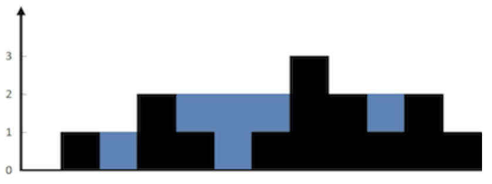
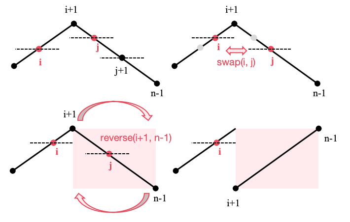

# 四、数组与字符串

## 4.1 前缀和

### 除自身以外数组的乘积 ⭐️⭐️

给你一个整数数组 `nums`，返回 数组 `answer` ，其中 `answer[i]` 等于 `nums` 中除 `nums[i]` 之外其余各元素的乘积 。

题目数据 保证 数组 nums之中任意元素的全部前缀元素和后缀的乘积都在 32 位 整数范围内。

请 不要使用除法，且在 `O(n)` 时间复杂度内完成此题。

**示例**

- 输入: nums = [1,2,3,4]
- 输出: [24,12,8,6]

**思路**

- 两头前缀积 `left` 和 `right`。
- `answer[i]=left[i-1]*right[i+1]`（注意判断是否越界）

**代码**

```java
class Solution {
    public int[] productExceptSelf(int[] nums) {
        int n = nums.length;
        int[] left = new int[n];
        int[] right = new int[n];

        left[0] = nums[0];
        right[n - 1] = nums[n - 1];
        for (int i = 1; i < n; i++) {
            left[i] = left[i - 1] * nums[i];
        }
        for (int i = n - 2; i >= 0; i--) {
            right[i] = right[i + 1] * nums[i];
        }

        int[] answer = new int[n];
        for (int i = 0; i < n; i++) {
            int l = i > 0 ? left[i - 1] : 1;
            int r = i < n - 1 ? right[i + 1] : 1;
            answer[i] = l * r;
        }
        return answer;
    }
}
```

### 接雨水 ⭐️⭐️⭐️

给定 `n` 个非负整数表示每个宽度为 1 的柱子的高度图，计算按此排列的柱子，下雨之后能接多少雨水。

**示例**

- 输入：height = [0,1,0,2,1,0,1,3,2,1,2,1]
- 输出：6
- 解释：上面是由数组 [0,1,0,2,1,0,1,3,2,1,2,1] 表示的高度图，在这种情况下，可以接 6 个单位的雨水（蓝色部分表示雨水）。
- 

**思路**

- 每个柱子 `i` 上面能接的水量取决于从左到右到这里的最大柱子高度 `leftMax[i]`
  和从右到左到这里的最大柱子高度 `rightMax[i]`
- 每个柱子能接的最大水量为 `min(rightMax[i], leftMax[i]) - height[i]`

**代码**

```java
class Solution {
    public int trap(int[] height) {
        int n = height.length;
        int[] leftMax = new int[n];
        int[] rightMax = new int[n];
        leftMax[0] = height[0];
        rightMax[n - 1] = height[n - 1];
        for (int i = 1; i < n; i++) {
            leftMax[i] = Math.max(height[i], leftMax[i - 1]);
        }
        for (int i = n - 2; i >= 0; i--) {
            rightMax[i] = Math.max(height[i], rightMax[i + 1]);
        }
        int ans = 0;
        for (int i = 0; i < n; i++) {
            ans += Math.min(leftMax[i], rightMax[i]) - height[i];
        }
        return ans;
    }
}
```

## 4.2 数组操作

### 轮转数组 ⭐️

给定一个整数数组 `nums`，将数组中的元素向右轮转 `k` 个位置，其中 `k` 是非负数。

**示例**

- 输入: nums = [1,2,3,4,5,6,7], k = 3
- 输出: [5,6,7,1,2,3,4]
- 解释:
    - 向右轮转 1 步: [7,1,2,3,4,5,6]
    - 向右轮转 2 步: [6,7,1,2,3,4,5]
    - 向右轮转 3 步: [5,6,7,1,2,3,4]

**思路**

- 原数组第 `i` 个元素将会出现在新数组第 `i+k` 个位置。
- 用余数表示轮转。

**代码**

```java
class Solution {
    public void rotate(int[] nums, int k) {
        int n = nums.length;
        int[] ans = new int[n];
        for (int i = 0; i < n; i++) {
            ans[(i + k) % n] = nums[i];
        }
        System.arraycopy(ans, 0, nums, 0, n);
    }
}
```

### H 指数 ⭐️⭐️

给你一个整数数组 `citations` ，其中 `citations[i]` 表示研究者的第 `i` 篇论文被引用的次数。计算并返回该研究者的 `h` 指数。

根据维基百科上 `h` 指数的定义：`h` 代表“高引用次数” ，一名科研人员的 `h` 指数 是指他（她）至少发表了 `h` 篇论文，并且 至少
有 `h` 篇论文被引用次数大于等于 `h` 。如果 `h` 有多种可能的值，`h` 指数 是其中最大的那个。

**示例**

- 输入：citations = [3,0,6,1,5]
- 输出：3
- 解释：给定数组表示研究者总共有 5 篇论文，每篇论文相应的被引用了 3, 0, 6, 1, 5 次。由于研究者有 3 篇论文每篇 至少 被引用了
  3 次，其余两篇论文每篇被引用 不多于 3 次，所以她的 h 指数是 3。

**思路**

- 从小到大排序。`h` 指数从上界 `n` 开始。
- 从左向右遍历，每遍历一个元素 `h` 指数减小，直到当前论文的引用量大于等于当前的 `h` 指数。

**代码**

```java
class Solution {
    public int hIndex(int[] citations) {
        int n = citations.length;
        Arrays.sort(citations);

        int ans = citations.length;
        int k = 0;
        while (k < n && citations[k] < ans) {
            k++;
            ans--;
        }
        return ans;
    }
}
```

### 缺失的第一个正数 ⭐️⭐️⭐️⭐️⭐️

给你一个未排序的整数数组 `nums` ，请你找出其中没有出现的最小的正整数。

请你实现时间复杂度为 `O(n)` 并且只使用常数级别额外空间的解决方案。

**示例**

- 输入：nums = [1,2,0]
- 输出：3
- 解释：范围 [1,2] 中的数字都在数组中。

**思路**

- 常规思路：利用集合存储 `nums` 中的元素，从 1 开始遍历到不在集合中的元素。
- 优化思路：对于一个长度为 N 的数组，其中没有出现的最小正整数只能在 [1,N+1] 中。
- 对数组进行遍历，对于遍历到的数 `x`，如果它在 `[1,N]` 的范围内，那么就将数组中的第 `x−1` 个位置（注意：数组下标从 0
  开始）打上「标记」。在遍历结束之后，如果所有的位置都被打上了标记，那么答案是 `N+1`，否则答案是最小的没有打上标记的位置加 1。
- 标记：在最初先把所有非正数修改成任意一个大于 `N` 的数（`N+1`），在遍历过程中取负号作为标记。

**代码**

```java
class Solution {
    public int firstMissingPositive(int[] nums) {
        int n = nums.length;
        for (int i = 0; i < n; i++) {
            if (nums[i] <= 0) {
                nums[i] = n + 1;
            }
        }
        for (int i = 0; i < n; i++) {
            int num = Math.abs(nums[i]);
            if (num <= n) {
                // 由于nums[num-1]可以已经被标记为负数，因此需要取绝对值再取负防止负号反转。
                nums[num - 1] = -Math.abs(nums[num - 1]);
            }
            // 不随意取一个负数的原因是为了保留原始数值，便于后续遍历。
        }
        for (int i = 0; i < n; i++) {
            if (nums[i] > 0) {
                return i + 1;
            }
        }
        return n + 1;
    }
}
```

### Z字形变换 ⭐️⭐️

将一个给定字符串 `s` 根据给定的行数 `numRows` ，以从上往下、从左到右进行 `Z` 字形排列。

比如输入字符串为 `"PAYPALISHIRING"` 行数为 3 时，排列如下：

```
P   A   H   N
A P L S I I G
Y   I   R
```

之后，你的输出需要从左往右逐行读取，产生出一个新的字符串，比如：`"PAHNAPLSIIGYIR"`。

请你实现这个将字符串进行指定行数变换的函数：

`string convert(string s, int numRows)`;

**示例**

- 输入：s = "PAYPALISHIRING", numRows = 4
- 输出："PINALSIGYAHRPI"
- 解释：

```
P     I    N
A   L S  I G
Y A   H R
P     I
```

**思路**

- `dfs` 走格子暴力模拟.

**代码**

```java
class Solution {
    int[][] directions = new int[][]{{1, 0}, {-1, 1}};

    void dfs(char[][] grid, int x, int y, int d, String s, int index) {
        if (index >= s.length()) {
            return;
        }
        grid[x][y] = s.charAt(index);
        int nextX = x + directions[d][0];
        int nextY = y + directions[d][1];
        if (nextX < 0 || nextY < 0 || nextX >= grid.length || nextY >= grid[0].length) {
            d = (d + 1) % 2;
            nextX = x + directions[d][0];
            nextY = y + directions[d][1];
        }
        dfs(grid, nextX, nextY, d, s, index + 1);
    }

    public String convert(String s, int numRows) {
        int n = s.length();
        if (numRows == 1) {
            return s;
        }
        int numCols = (int) Math.ceil(n * (numRows - 1) * 1.0 / (2 * numRows - 2));
        char[][] grid = new char[numRows][numCols];
        dfs(grid, 0, 0, 0, s, 0);
        StringBuilder ans = new StringBuilder();
        for (int i = 0; i < numRows; i++) {
            for (int j = 0; j < numCols; j++) {
                if (grid[i][j] > 0) {
                    ans.append(grid[i][j]);
                }
            }
        }
        return ans.toString();
    }
}
```

### O(1) 时间插入、删除和获取随机元素 ⭐️⭐️⭐️

实现 `RandomizedSet` 类：

- `RandomizedSet()` 初始化 `RandomizedSet` 对象
- `bool insert(int val)` 当元素 `val` 不存在时，向集合中插入该项，并返回 `true` ；否则，返回 `false` 。
- `bool remove(int val)` 当元素 `val` 存在时，从集合中移除该项，并返回 `true` ；否则，返回 `false` 。
- `int getRandom()` 随机返回现有集合中的一项（测试用例保证调用此方法时集合中至少存在一个元素）。每个元素应该有 相同的概率
  被返回。
  你必须实现类的所有函数，并满足每个函数的 平均 时间复杂度为 `O(1)` 。

**示例**

- 输入
  ["RandomizedSet", "insert", "remove", "insert", "getRandom", "remove", "insert", "getRandom"]
  \[[], [1], [2], [2], [], [1], [2], []]
- 输出
  [null, true, false, true, 2, true, false, 2]

- 解释
    - RandomizedSet randomizedSet = new RandomizedSet();
    - randomizedSet.insert(1); // 向集合中插入 1 。返回 true 表示 1 被成功地插入。
    - randomizedSet.remove(2); // 返回 false ，表示集合中不存在 2 。
    - randomizedSet.insert(2); // 向集合中插入 2 。返回 true 。集合现在包含 [1,2] 。
    - randomizedSet.getRandom(); // getRandom 应随机返回 1 或 2 。
    - randomizedSet.remove(1); // 从集合中移除 1 ，返回 true 。集合现在包含 [2] 。
    - randomizedSet.insert(2); // 2 已在集合中，所以返回 false 。
    - randomizedSet.getRandom(); // 由于 2 是集合中唯一的数字，getRandom 总是返回 2 。

**思路**

- 使用列表 `ArrayList` 存储需要随机访问的元素，使用哈希表存储元素的下标。
- 插入即将元素加入到列表的末尾。
- 删除需要将列表最后一个元素移动到待删除的下标，再移除列表的最后一个元素。（这样做的目的是为了让 `list.remove()`
  方法时间复杂度降低至 `O(1)`）。
- 使用 `Random()` 类随机生成下标，在列表中做随机访问。

**代码**

```java
class RandomizedSet {
    private List<Integer> list;
    private Map<Integer, Integer> pos;
    private Random random;

    public RandomizedSet() {
        list = new ArrayList<>();
        pos = new HashMap<>();
        random = new Random();
    }

    public boolean insert(int val) {
        if (pos.containsKey(val)) {
            return false;
        }
        pos.put(val, list.size());
        list.add(val);
        return true;
    }

    public boolean remove(int val) {
        if (!pos.containsKey(val)) {
            return false;
        }
        // 将最后一个元素放置在被删除的位置
        int index = pos.get(val);
        int last = list.get(list.size() - 1);
        list.set(index, last);
        pos.put(last, index);

        // 移除当前最后一个元素，这样删除元素的复杂度就是O(1)
        list.remove(list.size() - 1);
        pos.remove(val);
        return true;
    }

    public int getRandom() {
        int index = random.nextInt(list.size());
        return list.get(index);
    }
}
```

### 摆动排序 II ⭐️⭐️⭐️

给你一个整数数组 `nums`，将它重新排列成 `nums[0] < nums[1] > nums[2] < nums[3]...` 的顺序。

你可以假设所有输入数组都可以得到满足题目要求的结果。

**示例**

- 输入：nums = [1,5,1,1,6,4]
- 输出：[1,6,1,5,1,4]
- 解释：[1,4,1,5,1,6] 同样是符合题目要求的结果，可以被判题程序接受。

**思路**

- 先将数组排序。
- 从后往前，将有序数组中较大的部分依次填入奇数位置，较小的部分依次填入偶数位置。

**代码**

```java
class Solution {
    public void wiggleSort(int[] nums) {
        int n = nums.length;
        Arrays.sort(nums);
        int[] ans = new int[nums.length];
        // 将较大的部分放到奇数位置，较小的部分放到偶数位置
        int left = (n - 1) / 2;  // 较小数的部分起始索引
        int right = n - 1;       // 较大数的部分起始索引
        for (int i = 0; i < n; i++) {
            // 偶数位置放较小数部分，从末尾开始放
            ans[i] = (i % 2 == 0) ? nums[left--] : nums[right--];
        }
        // 将结果拷贝回原数组
        System.arraycopy(ans, 0, nums, 0, n);
    }
}
```

### 排列序列 ⭐️⭐️⭐️⭐️

给出集合 `[1,2,3,...,n]`，其所有元素共有 `n!` 种排列。

按大小顺序列出所有排列情况，并一一标记，当 `n` = 3 时, 所有排列如下：

`"123"
"132"
"213"
"231"
"312"
"321"`
给定 `n` 和 `k`，返回第 `k` 个排列。

**示例**

- 输入：n = 3, k = 3
- 输出："213"

**思路**

- 分组定位：考虑将排列按第一位进行分组，每个分组的大小为 `(n - 1)!`。如当 `n` = 3
  时，所有排列按第一位分为三组：`1**, 2**, 3**`。每一组包含 2! = 2 个排列。
- 确定第一位：用 `k` 来定位第一个数字： `index = (k - 1) / (n - 1)!`。`index` 决定了第 `k` 个排列的第一个数字。
- 更新 `k` 值：计算出新的 `k` 以用于剩余数字的排列。
- 递归过程：不断缩小范围，重复上述步骤，最终得到第 `k` 个排列。

**代码**

```java
class Solution {
    public String getPermutation(int n, int k) {
        // 阶乘数组用于快速计算 (n-1)!
        int[] factorial = new int[n];
        factorial[0] = 1;
        for (int i = 1; i < n; i++) {
            factorial[i] = factorial[i - 1] * i;
        }
        // 当前剩余的数字
        List<Integer> numbers = new ArrayList<>();
        for (int i = 1; i <= n; i++) {
            numbers.add(i);
        }
        StringBuilder ans = new StringBuilder();
        // 调整 k 为索引形式（从 0 开始）
        k--;
        for (int i = n; i >= 1; i--) {
            // 确定当前位的数字
            int index = k / factorial[i - 1];
            ans.append(numbers.get(index));
            numbers.remove(index);
            // 更新 k 值
            k %= factorial[i - 1];
        }
        return ans.toString();
    }
}
```

### 下一个排列 ⭐️⭐️⭐️⭐️

整数数组的一个 排列 就是将其所有成员以序列或线性顺序排列。

例如，`arr = [1,2,3]` ，以下这些都可以视作 `arr` 的排列：`[1,2,3]、[1,3,2]、[3,1,2]、[2,3,1]` 。
整数数组的 下一个排列 是指其整数的下一个字典序更大的排列。更正式地，如果数组的所有排列根据其字典顺序从小到大排列在一个容器中，那么数组的
下一个排列 就是在这个有序容器中排在它后面的那个排列。如果不存在下一个更大的排列，那么这个数组必须重排为字典序最小的排列（即，其元素按升序排列）。

例如，`arr = [1,2,3]` 的下一个排列是 `[1,3,2]` 。
类似地，`arr = [2,3,1]` 的下一个排列是 `[3,1,2]` 。
而 `arr = [3,2,1]` 的下一个排列是 `[1,2,3]` ，因为 `[3,2,1]` 不存在一个字典序更大的排列。
给你一个整数数组 `nums` ，找出 `nums` 的下一个排列。

必须 原地 修改，只允许使用额外常数空间。

**示例**

- 输入：nums = [1,2,3]
- 输出：[1,3,2]

**思路**

- 先从后找到第一个开始严格递增的 `i`：此时 `nums[i] < nums[i + 1]`。
- 如果 `i >= 0`，则从后找到第一个严格比 `i` 大的 `j`：此时 `nums[j] > nums[i]`。
- 交换 `i` 和 `j`。
- 将 `i` 后的所有元素反转。
- 

**代码**

```java
class Solution {
    public void nextPermutation(int[] nums) {
        int n = nums.length;
        int i = n - 2;
        // 先从后找到第一个开始严格递增的 i
        while (i >= 0 && nums[i] >= nums[i + 1]) {
            i--;
        }
        // 从后找到第一个严格比 i 大的 j
        if (i >= 0) {
            int j = n - 1;
            while (j > i && nums[j] <= nums[i]) {
                j--;
            }
            // 交换 i 和 j
            swap(nums, i, j);
        }
        // 反转 i 后面的所有元素
        int left = i + 1, right = n - 1;
        while (left < right) {
            swap(nums, left, right);
            left++;
            right--;
        }
    }

    public void swap(int[] nums, int i, int j) {
        int temp = nums[i];
        nums[i] = nums[j];
        nums[j] = temp;
    }
}
```

## 4.3 字符串遍历

### 最后一个单词的长度 ⭐️

给你一个字符串 `s`，由若干单词组成，单词前后用一些空格字符隔开。返回字符串中 最后一个 单词的长度。

单词 是指仅由字母组成、不包含任何空格字符的最大子字符串。

**示例**

- 输入：s = "Hello World"
- 输出：5
- 解释：最后一个单词是“World”，长度为 5。

**思路**

- 从最后一个不是空格的字符向前遍历到空格或者字符串头即可。

**代码**

```java
class Solution {
    public int lengthOfLastWord(String s) {
        int n = s.length();
        int index = n - 1;
        int ans = 0;
        while (index >= 0 && s.charAt(index) == ' ') {
            index--;
        }
        while (index >= 0 && s.charAt(index) != ' ') {
            ans++;
            index--;
        }
        return ans;
    }
}
```

### 反转字符串中的单词 ⭐️⭐️

给你一个字符串 `s` ，请你反转字符串中 单词 的顺序。

单词 是由非空格字符组成的字符串。`s` 中使用至少一个空格将字符串中的 单词 分隔开。

返回 单词 顺序颠倒且 单词 之间用单个空格连接的结果字符串。

注意：输入字符串 `s` 中可能会存在前导空格、尾随空格或者单词间的多个空格。返回的结果字符串中，单词间应当仅用单个空格分隔，且不包含任何额外的空格。

**示例**

- 输入：s = "the sky is blue"
- 输出："blue is sky the"

**思路**

- 个人思路：使用 `StringBuilder` 和栈。碰到英文字符将其加入 `sb` 中；碰到空格，如果当前 `sb` 不为空，则将 `sb`
  加入栈中，并重置 `sb`。最后清空栈输出即可。
- 直接使用编程语言 API。

**代码**
个人思路：

```java
class Solution {
    public String reverseWords(String s) {
        Stack<String> stack = new Stack<>();
        StringBuilder sb = new StringBuilder();

        int n = s.length();
        for (int i = 0; i < n; i++) {
            if (s.charAt(i) == ' ') {
                if (!sb.isEmpty()) {
                    stack.push(sb.toString());
                    sb = new StringBuilder();
                }
            } else {
                sb.append(s.charAt(i));
            }
        }
        if (!sb.isEmpty()) {
            stack.push(sb.toString());
        }
        StringBuilder ans = new StringBuilder();
        ans.append(stack.pop());
        while (!stack.isEmpty()) {
            ans.append(" ");
            ans.append(stack.pop());
        }
        return ans.toString();
    }
}
```

编程语言 API：

```java
class Solution {
    public String reverseWords(String s) {
        // 除去开头和末尾的空白字符
        s = s.trim();
        // 正则匹配连续的空白字符作为分隔符分割
        List<String> wordList = Arrays.asList(s.split("\\s+"));
        Collections.reverse(wordList);
        return String.join(" ", wordList);
    }
}
```

### 罗马数字转整数 ⭐️⭐️

罗马数字包含以下七种字符: I， V， X， L，C，D 和 M。

字符 数值
I 1
V 5
X 10
L 50
C 100
D 500
M 1000

例如， 罗马数字 2 写做 II ，即为两个并列的 1 。12 写做 XII ，即为 X + II 。 27 写做 XXVII, 即为 XX + V + II 。

通常情况下，罗马数字中小的数字在大的数字的右边。但也存在特例，例如 4 不写做 IIII，而是 IV。数字 1 在数字 5 的左边，所表示的数等于大数
5 减小数 1 得到的数值 4 。同样地，数字 9 表示为 IX。这个特殊的规则只适用于以下六种情况：

I 可以放在 V (5) 和 X (10) 的左边，来表示 4 和 9。
X 可以放在 L (50) 和 C (100) 的左边，来表示 40 和 90。
C 可以放在 D (500) 和 M (1000) 的左边，来表示 400 和 900。
给定一个罗马数字，将其转换成整数。

**示例**

- 输入: s = "III"
- 输出: 3

**思路**

- 枚举相邻字符的特殊情况即可。

**代码**

```java
class Solution {
    public int romanToInt(String s) {
        int n = s.length();
        Map<Character, Integer> map = new HashMap<>();
        map.put('I', 1);
        map.put('V', 5);
        map.put('X', 10);
        map.put('L', 50);
        map.put('C', 100);
        map.put('D', 500);
        map.put('M', 1000);

        int ans = 0;
        for (int i = 0; i < n; i++) {
            char c = s.charAt(i);
            // 特殊情况
            if (i + 1 < n) {
                char c2 = s.charAt(i + 1);
                if ((c == 'I' && (c2 == 'V' || c2 == 'X'))
                        || (c == 'X' && (c2 == 'L' || c2 == 'C'))
                        || (c == 'C' && (c2 == 'D' || c2 == 'M'))) {
                    ans += map.get(c2) - map.get(c);
                    i++;
                    continue;
                }
            }
            ans += map.get(c);
        }
        return ans;
    }
}
```

### 整数转罗马数字 ⭐️⭐️⭐️

七个不同的符号代表罗马数字，其值如下：

符号 值
I 1
V 5
X 10
L 50
C 100
D 500
M 1000
罗马数字是通过添加从最高到最低的小数位值的转换而形成的。将小数位值转换为罗马数字有以下规则：

- 如果该值不是以 4 或 9 开头，请选择可以从输入中减去的最大值的符号，将该符号附加到结果，减去其值，然后将其余部分转换为罗马数字。
- 如果该值以 4 或 9 开头，使用 减法形式，表示从以下符号中减去一个符号，例如 4 是 5 (V) 减 1 (I): IV ，9 是 10 (X) 减 1 (I)
  ：IX。仅使用以下减法形式：4 (IV)，9 (IX)，40 (XL)，90 (XC)，400 (CD) 和 900 (CM)。
- 只有 10 的次方（I, X, C, M）最多可以连续附加 3 次以代表 10 的倍数。你不能多次附加 5 (V)，50 (L) 或 500 (D)。如果需要将符号附加4次，请使用
  减法形式。

给定一个整数，将其转换为罗马数字。

**示例**

- 输入：num = 3749
- 输出： "MMMDCCXLIX"
- 解释：
  3000 = MMM 由于 1000 (M) + 1000 (M) + 1000 (M)
  700 = DCC 由于 500 (D) + 100 (C) + 100 (C)
  40 = XL 由于 50 (L) 减 10 (X)
  9 = IX 由于 10 (X) 减 1 (I)
  注意：49 不是 50 (L) 减 1 (I) 因为转换是基于小数位

**思路**

- 从高到低枚举每个数值，不断构造字符串即可。

**代码**

```java
class Solution {
    public String intToRoman(int num) {
        StringBuilder sb = new StringBuilder();
        int[] values = {1000, 900, 500, 400, 100, 90, 50, 40, 10, 9, 5, 4, 1};
        String[] symbols = {"M", "CM", "D", "CD", "C", "XC", "L", "XL", "X", "IX", "V", "IV", "I"};
        int index = 0;
        while (num > 0) {
            while (num >= values[index]) {
                sb.append(symbols[index]);
                num -= values[index];
            }
            index++;
        }
        return sb.toString();
    }
}
```

### 文本左右对齐 ⭐️⭐️⭐️⭐️

给定一个单词数组 `words` 和一个长度 `maxWidth` ，重新排版单词，使其成为每行恰好有 `maxWidth` 个字符，且左右两端对齐的文本。

你应该使用 “贪心算法” 来放置给定的单词；也就是说，尽可能多地往每行中放置单词。必要时可用空格 `' '`
填充，使得每行恰好有 `maxWidth` 个字符。

要求尽可能均匀分配单词间的空格数量。如果某一行单词间的空格不能均匀分配，则左侧放置的空格数要多于右侧的空格数。

文本的最后一行应为左对齐，且单词之间不插入额外的空格。

注意:

- 单词是指由非空格字符组成的字符序列。
- 每个单词的长度大于 0，小于等于 `maxWidth`。
- 输入单词数组 `words` 至少包含一个单词。

**示例**

- 输入:
  words = ["Science","is","what","we","understand","well","enough","to","explain","to","a","computer.","Art","is","everything","else","we","do"]
  ，maxWidth = 20
- 输出:

```
[
  "Science  is  what we",
  "understand      well",
  "enough to explain to",
  "a  computer.  Art is",
  "everything  else  we",
  "do                  "
]
```

**思路**

- 见代码

**代码**

```java
class Solution {
    public List<String> fullJustify(String[] words, int maxWidth) {
        List<String> ans = new ArrayList<>();
        int n = words.length;
        int i = 0;
        while (i < n) {
            StringBuilder sb = new StringBuilder();
            // 第一个单词顶格放置
            sb.append(words[i++]);
            // 后面的单词用空格分隔放置
            int cnt = 0;
            while (i < n && sb.length() + 1 + words[i].length() <= maxWidth) {
                sb.append(' ');
                sb.append(words[i++]);
                cnt++;
            }
            // 填充空格
            // 如果最后一行或者只有一个间隔
            if (i == n || cnt == 0) {
                sb.append(" ".repeat(maxWidth - sb.length()));
            }
            // 非最后一行且有多个间隔
            else {
                int[] gaps = new int[cnt];
                int spaceNum = maxWidth - sb.length();
                Arrays.fill(gaps, spaceNum / cnt);

                for (int j = 0; j < spaceNum % cnt; j++) {
                    gaps[j]++;
                }
                StringBuilder sb2 = new StringBuilder();
                sb2.append(sb.charAt(0));
                int k = 0;
                for (int j = 1; j < sb.length(); j++) {
                    if (sb.charAt(j) != ' ') {
                        sb2.append(sb.charAt(j));
                    } else if (sb.charAt(j) != sb.charAt(j - 1)) {
                        sb2.append(" ".repeat(gaps[k++] + 1));
                    }
                }
                sb = sb2;
            }
            ans.add(sb.toString());
        }
        return ans;
    }
}
```

## 4.4 字符串匹配

### 最长公共前缀 ⭐️

编写一个函数来查找字符串数组中的最长公共前缀。

如果不存在公共前缀，返回空字符串 ""。

**示例**

- 输入：strs = ["flower","flow","flight"]
- 输出："fl"

**思路**

- 指针 `index` 从 0 开始，判断每个字符串的该位置是否一致。

**代码**

```java
class Solution {
    public String longestCommonPrefix(String[] strs) {
        int n = strs.length;
        int index = 0;
        StringBuilder sb = new StringBuilder();

        int minLen = Integer.MAX_VALUE;
        for (String str : strs) {
            minLen = Math.min(minLen, str.length());
        }
        while (index < minLen) {
            char c = strs[0].charAt(index);
            for (int i = 1; i < n; i++) {
                if (c != strs[i].charAt(index)) {
                    return sb.toString();
                }
            }
            sb.append(c);
            index++;
        }
        return sb.toString();
    }
}
```

### 找出字符串中第一个匹配项的下标 ⭐️⭐️⭐️⭐️⭐️

给你两个字符串`haystack` 和 `needle` ，请你在 `haystack` 字符串中找出 `needle` 字符串的第一个匹配项的下标（下标从 0
开始）。如果`needle` 不是 `haystack` 的一部分，则返回 -1 。

**示例**

- 输入：haystack = "sadbutsad", needle = "sad"
- 输出：0
- 解释："sad" 在下标 0 和 6 处匹配。第一个匹配项的下标是 0 ，所以返回 0 。

**思路**

- API 秒了。
- KMP 算法。
    - `next[i]`：表示**模式字符串** `needle` 中从位置 0 到位置 `i` 的子串的最长前缀和后缀的长度。（即若一个子串为 `S...S`
      ，则该子串的 `next` 为 `S.length`，如子串 `ABCAB` 的 `next` 为 `AB.length == 2`）
    - `next` 数组帮助我们在匹配失败时确定模式字符串需要滑动的具体位置，从而避免重复比较，达到加速匹配过程的目的。
    - 当匹配失败时，`next` 数组提供了模式字符串的跳跃信息，避免从头开始重新比较，直接跳到合适的位置继续比较。

**代码**
API：

```java
class Solution {
    public int strStr(String haystack, String needle) {
        return haystack.indexOf(needle);
    }
}
```

KMP算法：

```java
class Solution {
    public int strStr(String haystack, String needle) {
        int n = haystack.length();
        int m = needle.length();
        int[] next = new int[m];
        // 构造next数组
        int j = 0;
        for (int i = 1; i < m; i++) {
            // 如果字符i与字符j（j即next[i-1]）相等，则可以直接next[i]=j+1，否则向前回溯。
            while (j > 0 && needle.charAt(i) != needle.charAt(j)) {
                j = next[j - 1];
            }
            if (needle.charAt(i) == needle.charAt(j)) {
                j++;
            }
            next[i] = j;
        }
        j = 0;
        // 找匹配下标
        for (int i = 0; i < n; i++) {
            while (j > 0 && haystack.charAt(i) != needle.charAt(j)) {
                j = next[j - 1];
            }
            if (haystack.charAt(i) == needle.charAt(j)) {
                j++;
            }
            // 匹配完毕
            if (j == m) {
                return i - m + 1;
                // 在找到一个匹配后，重置 j，以继续查找其他可能的匹配
                // j = next[j - 1];
            }
        }
        return -1;
    }
}
```

拓展：最小循环元

- 求出 `next` 数组后，判断字符串长度 `m` 能否除尽 `m - next[m - 1]`。

```java
// 求 needle 的最小循环元长度，如 ABCABCABC 的最小循环元长度为 3.
if (m % (m - next[m - 1]) == 0) {
    return m - next[m - 1];
}
return m;
```

## 4.5 区间操作

### 合并区间 ⭐️⭐️

以数组 `intervals` 表示若干个区间的集合，其中单个区间为 `intervals[i] = [start_i, end_i]` 。请你合并所有重叠的区间，并返回
一个不重叠的区间数组，该数组需恰好覆盖输入中的所有区间 。

**示例**

- 输入：intervals = [[1,3],[2,6],[8,10],[15,18]]
- 输出：[[1,6],[8,10],[15,18]]
- 解释：区间 [1,3] 和 [2,6] 重叠, 将它们合并为 [1,6].

**思路**

- 按照开始时间从小到大排序。
- 开辟一个新的结果数组 `ans`，初始化为第一个区间。
- 遍历 `intervals`，如果与当前最新的结果区间有重合，则在结果数组中合并这两个区间。
- 如果没有重合，就把当前遍历的区间加入结果数组。

**代码**

```java
class Solution {
    public int[][] merge(int[][] intervals) {
        Arrays.sort(intervals, (a1, a2) -> a1[0] - a2[0]);
        int[][] ans = new int[intervals.length][2];
        int k = 0;
        ans[0] = intervals[0];
        for (int i = 1; i < intervals.length; i++) {
            if (intervals[i][0] <= ans[k][1]) {
                ans[k][1] = Math.max(intervals[i][1], ans[k][1]);
            } else {
                k++;
                ans[k] = intervals[i];
            }
        }
        return Arrays.copyOfRange(ans, 0, k + 1);
    }
}
```

### 汇总区间 ⭐️⭐️

给定一个 无重复元素 的 有序 整数数组 `nums` 。

返回 恰好覆盖数组中所有数字 的 最小有序 区间范围列表 。也就是说，`nums`
的每个元素都恰好被某个区间范围所覆盖，并且不存在属于某个范围但不属于 `nums` 的数字 `x` 。

列表中的每个区间范围 `[a,b]` 应该按如下格式输出：

- `"a->b"` ，如果 `a != b`
- `"a"` ，如果 `a == b`

**示例**

- 输入：nums = [0,1,2,4,5,7]
- 输出：["0->2","4->5","7"]
- 解释：区间范围是：
  [0,2] --> "0->2"
  [4,5] --> "4->5"
  [7,7] --> "7"

**思路**

- 与合并区间类似。当前元素与最新区间是否相邻，如果相邻则并入最新区间，否则开始新的区间。

**代码**

```java
class Solution {
    public List<String> summaryRanges(int[] nums) {
        int n = nums.length;
        if (n == 0) {
            return new ArrayList<>();
        }
        int[][] ranges = new int[n][2];
        int k = 0;
        ranges[0][0] = nums[0];
        ranges[0][1] = nums[0];

        for (int i = 1; i < n; i++) {
            if (nums[i] == ranges[k][1] + 1) {
                ranges[k][1]++;
            } else {
                k++;
                ranges[k][0] = nums[i];
                ranges[k][1] = nums[i];
            }
        }
        List<String> ans = new ArrayList<>();
        for (int i = 0; i < k + 1; i++) {
            StringBuilder sb = new StringBuilder();
            sb.append(ranges[i][0]);
            if (ranges[i][1] > ranges[i][0]) {
                sb.append("->");
                sb.append(ranges[i][1]);
            }
            ans.add(sb.toString());
        }
        return ans;
    }
}
```

### 插入区间 ⭐️⭐️

给你一个 无重叠的 ，按照区间起始端点排序的区间列表 `intervals`，其中 `intervals[i] = [starti, endi]` 表示第 `i`
个区间的开始和结束，并且 `intervals` 按照 `starti` 升序排列。同样给定一个区间 `newInterval` = `[start, end]`
表示另一个区间的开始和结束。

在 `intervals` 中插入区间 `newInterval`，使得 `intervals` 依然按照 `starti` 升序排列，且区间之间不重叠（如果有必要的话，可以合并区间）。

返回插入之后的 `intervals`。

注意 你不需要原地修改 `intervals`。你可以创建一个新数组然后返回它。

**示例**

- 输入：intervals = \[[1,2],[3,5],[6,7],[8,10],[12,16]], newInterval = [4,8]
- 输出：\[[1,2],[3,10],[12,16]]
- 解释：这是因为新的区间 [4,8] 与 [3,5],[6,7],[8,10] 重叠。

**思路**

- 先插入构建新的区间数组。
- 然后对新的区间数组进行合并。

**代码**

```java
class Solution {
    public int[][] insert(int[][] intervals, int[] newInterval) {
        int n = intervals.length;
        // 插入
        int[][] newIntervals = new int[n + 1][2];
        int index = 0;
        while (index < n && intervals[index][0] < newInterval[0]) {
            newIntervals[index] = intervals[index];
            index++;
        }
        newIntervals[index] = newInterval;
        for (int i = index + 1; i < n + 1; i++) {
            newIntervals[i] = intervals[i - 1];
        }
        // 合并
        int[][] ans = new int[n + 1][2];
        int k = 0;
        ans[0] = newIntervals[0];

        for (int i = 1; i < newIntervals.length; i++) {
            if (newIntervals[i][0] <= ans[k][1]) {
                ans[k][1] = Math.max(ans[k][1], newIntervals[i][1]);
            } else {
                k++;
                ans[k] = newIntervals[i];
            }
        }
        return Arrays.copyOf(ans, k + 1);
    }
}
```

### 划分字母区间 ⭐️⭐️⭐️

给你一个字符串 `s` 。我们要把这个字符串划分为尽可能多的片段，同一字母最多出现在一个片段中。

注意，划分结果需要满足：将所有划分结果按顺序连接，得到的字符串仍然是 `s` 。

返回一个表示每个字符串片段的长度的列表。

**示例**

- 输入：s = "ababcbacadefegdehijhklij"
- 输出：[9,7,8]
- 解释：划分结果为 "ababcbaca"、"defegde"、"hijhklij" 。
  每个字母最多出现在一个片段中。像 "ababcbacadefegde", "hijhklij" 这样的划分是错误的，因为划分的片段数较少。

**思路**

- 找出每个字母第一次出现的下标和最后一次出现的下标，构成区间。
- 合并这些区间。参考 5.2 合并区间。
- 输出每个区间的长度。

**代码**

```java
class Solution {
    public List<Integer> partitionLabels(String s) {
        int n = s.length();
        int[][] pos = new int[26][2];
        for (int i = 0; i < 26; i++) {
            pos[i][0] = n;
            pos[i][1] = -1;
        }
        for (int i = 0; i < n; i++) {
            int index = s.charAt(i) - 'a';
            pos[index][0] = Math.min(pos[index][0], i);
            pos[index][1] = Math.max(pos[index][1], i);
        }
        // 合并区间
        Arrays.sort(pos, (pos1, pos2) -> pos1[0] - pos2[0]);
        int[][] res = new int[26][2];
        res[0] = pos[0];
        int k = 0;
        for (int i = 1; i < 26 && pos[i][0] < n; i++) {
            if (pos[i][0] < res[k][1]) {
                res[k][1] = Math.max(res[k][1], pos[i][1]);
            } else {
                k++;
                res[k] = pos[i];
            }
        }
        List<Integer> ans = new ArrayList<>();
        for (int i = 0; i < k + 1; i++) {
            ans.add(res[i][1] - res[i][0] + 1);
        }
        return ans;
    }
}
```
