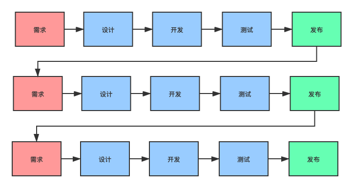

# 六、工作篇

## **如何选择职业方向？**

发现身边有一些朋友看到哪一个方向工资高就转哪个方向，看到大数据库工资高，他们就立马转大数据方向，看到算法工程师工资高，他们就转算法方向......。

实际这种行为是非常不可取的，不利于个人发展，尤其是对于已经在某个领域工作了多年的朋友来说。

如果你在某个领域比如 Java 后端有了几年的工作经验，那你再换其他方向几乎相当于是从头开始。虽然你可能或多或少也能用到部分 Java 后端的工作经验，但这并不能让你在新方向上有太大的竞争力，你几乎就是这个领域的新人。

另外，如果你仅仅是因为对某个方向感兴趣就想要转变职业方向的话，那我建议你先在这个方向深入学习一下。就像很多后端的朋友想要转前端一样，在他们眼里前端的工作所见即所得，可以很快就能看到自己的成果，入门也要相对容易一些。但是，他们并不清楚想要做好前端真的很难，各种新框架，各种新工具，适配各种尺寸的屏幕是真的有难度且麻烦。

学技术也一样，不要今天看别人学了某某框架，掌握了某某技术原理，你也要去学。按照自己的节奏来就好，没必要和其他人比，每个人的情况不同，擅长的领域也不同。

**过于从众，没有主见，只能让自己在技术这个道路上走的很累。**

不过，有一些情况下，换一个职业方向对你来说还是值得考虑的:

- 如果你本身就刚工作不久的话，那我觉得你换一个职业方向对你影响也不大，毕竟你本身就没有什么工作经验。
- 如果你所从事的方向真的是夕阳产业，已经进入了长期下行的趋势（比如曾经很火的 Flash 开发方向），那你要尽快考虑换一个职业方向了。
- 如果你真的对新的职业方向有信心，感兴趣，清楚自己一定会在新方向坚持下来。这种情况下，我相信你是可以在新的职业方向上成功的

**转换职业方向也要乘早，尽快跳出舒适区，在下一个有前景的方向上努力。**

如何判断一个职业方向好不好？你可以从下面 2 个方向来判断：

- 天花板高度：你这个职业方向最厉害的那批人能够到达的高度。
- 前景：夕阳行业还是未来趋势，你可以结合国家产业发展、供需关系、社会需要等角度来分析。
- 竞争程度：如果一个行业竞争人数太多的话，也会造成内卷的问题，进而导致这个行业的性价比降低。

通常来说，一个好的行业必然会竞争加剧。但是！如果你所从事的行业护城河够高（对求职者的硬性要求比较高）或者你的能力足够强的话，那这个行业注定不会太卷。就比如说顶级软件工程师、数据库内核资深开发、资深芯片设计师等等在任何时候在职场求职都是非常有竞争力的存在。

**一个好的职业方向，一定是职业天花板够高，前景不错且竞争不太剧烈。**

## **新入职一家公司如何快速进入工作状态？**

> 朋友投稿的一篇文章！强烈建议每一位即将入职/在职的小伙伴看看这篇文章，看完之后可以帮助你少踩很多坑。整篇文章逻辑清晰，内容全面！
> 原文：https://www.cnblogs.com/hunternet/p/14675348.html

每到一个新的公司面临的可能都是新的业务、新的技术、新的团队......这些可能会打破你原来工作思维、编码习惯、合作方式......

而于公司而言，又不能给你几个月的时间去慢慢的熟悉。这个时候，如何快速进入工作状态，尽快发挥自己的价值是非常重要的。

有些人可能会很幸运，入职的公司会有完善的流程与机制，通过一带一、各种培训等方式可以在短时间内快速的让新人进入工作状态。有些人可能就没有那么幸运了，就比如我在几年前跳槽进入某厂的时候，当时还没有像我们现在这么完善的带新人融入的机制，又赶上团队最忙的一段时间，刚一入职的当天下午就让给了我几个线上问题去排查，也没有任何的文档和培训。遇到情况，很多人可能会因为难以快速适应，最终承受不起压力而萌生退意。

那么，**我们应该如何去快速的让自己进入工作状态，适应新的工作节奏呢？**

新的工作面对着一堆的代码仓库，很多人常常感觉无从下手。但回顾一下自己过往的工作与项目的经验，我们可以发现它们有着异曲同工之处。当开始一个新的项目，一般会经历几个步骤：需求->设计->开发->测试->发布，就这么循环往复，我们完成了一个又一个的项目。

而在这个过程中主要有四个方面的知识那就是业务、技术、项目与团队贯穿始终。新入职一家公司，我们第一阶段的目标就是要具备能够跟着团队做项目的能力，因此我们所应尽快掌握的知识点也要从这四个方面入手。

### 业务

很多人可能会认为作为一个技术人，最应该了解的不应该是技术吗？于是他们在进入一家公司后，就迫不及待的研究起来了一些技术文档，系统架构，甚至抱起来源代码就开始“啃”，如果你也是这么做的，那就大错特错了！在几乎所有的公司里，技术都是作为一个工具存在的，虽然它很重要，但是它也是为了承载业务所存在的，技术解决了如何做的问题，而业务却告诉我们，做什么，为什么做。一旦脱离了业务，那么技术的存在将毫无意义。

想要了解业务，有两个非常重要的方式

**一是靠问**

如果你加入的团队，有着完善的业务培训机制，详尽的需求文档，也许你不需要过多的询问就可以了解业务，但这只是理想中的情况，大多数公司是没有这个条件的。因此我们只能靠问。

这里不得不提的是，作为一个新人一定要有一定的脸皮厚度，不懂就要问。我见过很多新人会因为内向、腼腆，遇到疑问总是不好意思去问，这导致他们很长一段时间都难以融入团队、承担更重要的责任。不怕要怕挨训、怕被怼，而且我相信绝对多数的程序员还是很好沟通的！

**二是靠测试**

我认为测试绝对是一个人快速了解团队业务的方式。通过测试我们可以走一走自己团队所负责项目的整体流程，如果遇到自己走不下去或想不通的地方及时去问，在这个过程中我们自然而然的就可以快速的了解到核心的业务流程。

在了解业务的过程中，我们应该注意的是不要让自己过多的去追求细节，我们的目的是先能够整体了解业务流程，我们面向哪些用户，提供了哪些服务......

### 技术

在我们初步了解完业务之后，就该到技术了，也许你已经按捺不住翻开源代码的准备了，但还是要先提醒你一句先不要着急。

这个时候我们应该先按照自己了解到的业务，结合自己过往的工作经验去思考一下如果是自己去实现这个系统，应该如何去做？这一步很重要，它可以在后面我们具体去了解系统的技术实现的时候去对比一下与自己的实现思路有哪些差异，为什么会有这些差异，哪些更好，哪些不好，对于不好我们可以提出自己的意见，对于更好的我们可以吸收学习为己用！

接下来，我们就是要了解技术了，但也不是一上来就去翻源代码。 **应该按照从宏观到细节，由外而内逐步地对系统进行分析。**

首先，我们应该简单的了解一下 **自己团队/项目的所用到的技术栈** ，Java 还是.NET、亦或是多种语言并存，项目是前后端分离还是服务端全包，使用的数据库是 MySQL 还是 PostgreSQL......，这样我们可能会对所用到的技术和框架，以及自己所负责的内容有一定的预期，这一点有的人可能在面试的时候就会简单了解过。

下一步，我们应该了解的是 **系统的宏观业务架构** 。自己的团队主要负责哪些系统，每个系统又主要包含哪些模块，又与哪些外部系统进行交互......对于这些，最好可以通过流程图或者思维导图等方式整理出来。

然后，我们要做的是看一下 **自己的团队提供了哪些对外的接口或者服务** 。每个接口和服务所提供功能是什么。这一点我们可以继续去测试自己的系统，这个时候我们要看一看主要流程中主要包含了哪些页面，每个页面又调用了后端的哪些接口，每个后端接口又对应着哪个代码仓库。(如果是单纯做后端服务的，可以看一下我们提供了哪些服务，又有哪些上游服务，每个上游服务调用自己团队的哪些服务......)，同样我们应该用画图的形式整理出来。

接着，我们要了解一下 **自己的系统或服务又依赖了哪些外部服务** ，也就是说需要哪些外部系统的支持，这些服务也许是团队之外、公司之外，也可能是其他公司提供的。这个时候我们可以简单的进入代码看一下与外部系统的交互是怎么做的，包括通讯框架(REST、RPC)、通讯协议......

到了代码层面，我们首先应该了解每个模块代码的层次结构，一个模块分了多少层，每个层次的职责是什么，了解了这个就对系统的整个设计有了初步的概念，紧接着就是代码的目录结构、配置文件的位置。

最后，我们可以寻找一个示例，可以是一个接口，一个页面，让我们的思路跟随者代码的运行的路线，从入参到出参，完整的走一遍来验证一下我们之前的了解。

到了这里我们对于技术层面的了解就可以先告一段落了，我们的目的知识对系统有一个初步的认知，更细节的东西，后面我们会有大把的时间去了解

### 项目与团队

上面我们提到，新入职一家公司，第一阶段的目标是有跟着团队做项目的能力，接下来我们要了解的就是项目是如何运作的。

我们应该把握从需求设计到代码编写入库最终到发布上线的整个过程中的一些关键点。例如项目采用敏捷还是瀑布的模式，一个迭代周期是多长，需求的来源以及展现形式，有没有需求评审，代码的编写规范是什么，编写完成后如何构建，如何入库，有没有提交规范，如何交付测试，发布前的准备是什么，发布工具如何使用......

关于项目我们只需要观察同事，或者自己亲身经历一个迭代的开发，就能够大概了解清楚。

在了解项目运作的同时，我们还应该去了解团队，同样我们应该先从外部开始，我们对接了哪些外部团队，比如需求从哪里来，是否对接公司外部的团队，提供服务的上游团队有哪些，依赖的下游团队有哪些，团队之间如何沟通，常用的沟通方式是什么.......

接下来则是团队内部，团队中有哪些角色，每个人的职责是什么，这样遇到问题我们也可以清楚的找到对应的同事寻求帮助。是否有一些定期的活动与会议，例如每日站会、周例会，是否有一些约定俗成的规矩，是否有一些内部评审，分享机制......

### 总结

新入职一家公司，面临新的工作挑战，能够尽快进入工作状态，实现自己的价值，将会给你带来一个好的开始。

作为一个程序员，能够尽快进入工作状态，意味着我们首先应该具备跟着团队做项目的能力，这里我站在了一个后端开发的角度上从业务、技术、项目与团队四个方面总结了一些方法和经验。

关于如何快速进入工作状态，如果你有好的方法与建议，欢迎在评论区留言。

最后我们用一张思维导图来回顾一下这篇文章的内容。如果你觉得这篇文章对你有所帮助，可以关注文末公众号，我会经常分享一些自己成长过程中的经验与心得，与大家一起学习与进步。

## **如何在绩效考核中脱颖而出？**

对于职场人来说，绩效考核是一个绕不开的话题，几乎所有公司都有一套绩效考核方法。

如果你想要在职场走的更远，爬的更高的话，绩效考核对你来说还是非常重要的。在绝大部分公司，绩效考核都会和你的职级晋升、薪水涨幅、年终奖挂钩。并且，很多公司是的确有末尾淘汰机制的，很残酷。

公司给员工升职加薪，一是看你过去的表现，二是看你未来的潜力。未来的潜力主要也是基于你过去的表现以及个人进步速度。只有你能够证明自己能够做的越来越好，你才能在升职加薪上获得更大的主动权。

**如何提升自己在工作中的表现？** 核心肯定是持续稳定的在工作上产出有价值的东西。

如果想要持续稳定的在工作上产出，入职之后一定一定一定要先熟悉公司的技术栈、内部系统以及各种常用工具的。熟悉了这些东西之后，你的工作效率才会拉满，你才能充分利用公司内部的资源。

熟悉了之后，更进一步就是熟练掌握那些对你当前工作比较重要的技术以及工具。

### 勇于认领有挑战的任务

我们在工作中的产出，通常是通过完成开发任务方式来体现的。

日常开发中，建议要勇于认领比较有挑战的任务，解决有难度的问题。一定不要一碰到不会的就退缩了，碰到没有接触过的技术就怂了。

但也不要过于自信，还是要对自己的能力有个清楚且客观地认识。

如果你当前正在做的任务实在没办法完成的话，可以找技术 Leader 或者其他同事聊聊，沟通一下，寻求一下他们的建议和指导。一定不要憋着不说，等到截止日期的时候，才让大家知道你没有完成这个任务。

### 深入思考业务

平时要养成深入思考业务的习惯，敢于提出自己的想法和建议，而不是业务负责人说什么就是什么，技术负责人说用什么技术就用什么技术。不要被牵着鼻子走，要有自己的想法。但切忌不要过于偏执，一切的争论要建立在完善的逻辑之上。就比如说你觉得某一块的业务设计不合理的话，那就要有理有据地和业务负责人说出自己的想法。再比如说你觉得有更好的技术框架可以解决当前项目的问题，那你就要把这个技术框架调研清楚之后再和技术负责人沟通。

如果你能够对项目的发展提出一些有用的建议，大家对你的看法肯定会不一样。

### 善于分享

平时工作中要乐于帮助其他同事，也要学会寻求同事的帮助。

如果公司崇尚技术分享的话。试着学会技术分享即使你讲的东西比较简单，讲好就行了。

### 多要反馈

尽量要多找你的技术 Leader/其他上级要反馈，多和他们聊聊自己做了什么，后面有什么什么建议给自己。

一定一定不要只埋头搞事，搞了事产生了效果，还要让其他人知道你的贡献。

### 持续学习

一定要有持续学习的意识！你的日常一定不是只有工作，想要走的更远，工作之外一定也要抽时间用学习武装自己。

举个例子你的项目用到了消息队列，那你就要一定要搞清楚：

- 常见消息队列之间的对比？如何选择？
- 如何确保消息不会丢失？
- 如何确保消息不被重复消费？
- 消息积压如何处理？
- 消息队列如何实现分布式事务？
- 消息队列（任选一个主流的消息队列进行研究）的底层原理是什么（网络通信、高性能 IO、数据压缩......）？如果让你设计的话，你会如何设计？（学习优秀的消息队列的底层原理）
- ......

如果刚毕业之后就没有持续学习的意识的话，那大概率未来的工作中也要不回养成这种意识。刚工作的那 1-3 年是个人能力提升最快的阶段。

### 要有 Owner 意识

**什么叫有 Owner 意识呢？** 我举几个例子大家应该就明白了。

- 某天客户突然在群里询问了一个问题，你及时在群里回应了客户。这就叫有 Owner 意识。
- 觉得项目某个模块的数据库表设计有问题，自己私下进行了深度思考，并给出了优化方案，之后找到技术 Leader 说明了自己想法。这就叫有 Owner 意识
- 觉得项目某个模块的技术方案有问题，自己找到技术 Leader 进行了沟通。这就叫有 Owner 意识

**什么叫没有 Owner 意识呢？** 我举几个反例大家应该就明白了。

- 某天客户突然在群里询问了一个问题，你看到了问题，但是觉得自己的工作还没做完或者觉得这事不重要，干脆就假装没看见。这就叫缺乏 Owner 意识。正确的做法是积极主动地推动问题的解决。如果自己没能力解决或者实现没时间解决的话，可以联系相关的同事帮忙解决。
- 觉得项目某个模块的数据库表设计有问题，自己就直接找到 Leader 开始抱怨：“这特么表设计的什么鬼啊！”。这就叫缺乏 Owner 意识。
- 觉得项目某个模块的技术方案有问题，自己睁一只眼闭一只眼，没有找技术 Leader 沟通，技术方案确定之后，却经常抱怨技术方案设计的不够好。这就叫缺乏 Owner 意识。

**有 Owner 意识，并不是说让大家都去当“奋斗逼”，故意在上级面前多表现一下。而是说，希望自己能够对工作更加负责，更加积极主动地参与项目的建设。**

### 要有全链路意识

**什么是全链路？** 全链路可以理解为一个请求在系统中经过的完整路径。

我们这里的全链路意识说的是：**不仅仅要对你自己模块负责，还要尝试对了解整个系统涉及到的所有模块，将它们串联起来**。

全链路意识是项目技术 Leader 的必备。如果你以后想要往项目技术 Leader 的方向发展，那就先从培养自己的全链路意识开始吧！

### 多沟通交流

不喜欢沟通交流和表达的人，一般也会更难受到上级的青睐。很多时候你做的工作比别人多，你本以为你可以获得更多认可和奖励，但是，到最后往往收获的认可度和奖励却没有别人高。

**做好本质工作是我们的分内之事，如果你能偶尔抽出一些时间，多和你的同事、上级或者 leader 交流问题的话，你所能得到的肯定是远远超过你所付出的那一会时间。**
