# 五、练级攻略篇

## **如何成为一个合格的程序员？**

对于下面的每一点建议的理解，每个人可能都不一样。

如果你觉得某一点对你有用的话，不要关了这篇文章之后你就忘记了，建议你一定要记录下来。从当下开始就去努力践行。

**本文概览 ：**

- 用好 Google
- 修改代码要慎重
- 谨慎使用网上搜索的代码片段
- Code Review 很重要
- 尽量减少 TODO
- 不要放任破窗
- 不要孤立地写代码
- 试着从更高的层面去了解大部分代码的功能
- 尽量多沟通交流，提高表达能力
- 你永远无法写出完美的软件
- 工作经验 != 能力
- 提高自己的核心竞争力

### 用好 Google

相比于百度，更建议使用 Google。如果你无法访问 Google 的话，必应也是不错的。

分享一些个人使用 Google 搜索的实用建议， 这里就不专门介绍各种繁杂的搜索参数了，说了也记不住，实用性不强。

**1、选择合适的关键词，多个关键词手动使用空格进分割。**

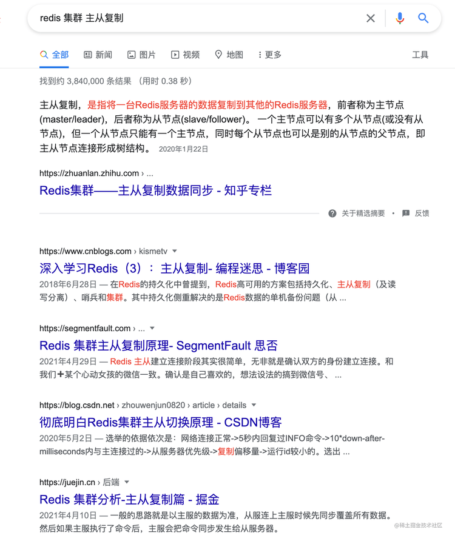

如果搜索出来的内容你不满意的话，建议重新更换/删减关键词进行搜索或者调整关键词的顺序。

**2、利用好 Google 图片搜索，一张好的技术配图有更大概率带你进入更优质的页面。**

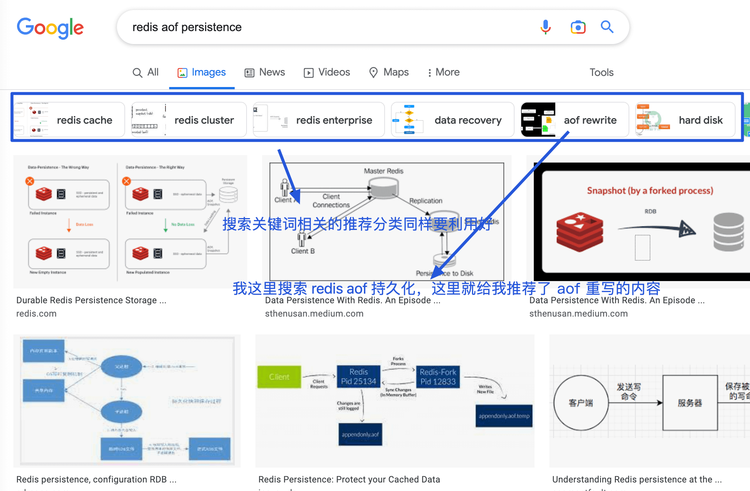

**3、往往同时需要多打开多个页面之后，才有可能找到自己需要的内容。**

你可以先从第一页的搜索结果中选择打开 5 个页面，内容差的直接关闭，全平台采集文章类的盗文网站直接选择屏蔽掉即可。

像下面这个网站就是一个典型的需要被屏蔽的垃圾文章收集网站，文章排版和网站体验极差且文章都是从其他平台收集整理过来的。

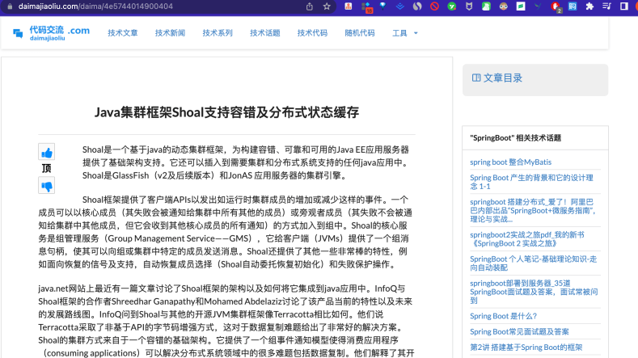

你可以使用 **uBlacklist** 这个 Chrome 插件屏蔽特定的网站。

**4、搜索参数上加上 site:网站或域名 搜索指定网站或者域名下的内容**

搜索参数有很多，个人比较常用的是 site:网站或域名
，更多搜索参数你可以在这篇文章中找到：[Google Search Operators: The Complete List (42 Advanced Operators)](https://ahrefs.com/blog/google-advanced-search-operators/)。

**5、过滤搜索结果**

你可以通过 Google 高级搜索过滤搜索结果，缩小搜索结果的范围，地址：https://www.google.com/advanced_search 。

.png)

我们上面讲到的 site:网站或域名 功能也可以在这个高级搜索页面上完成。

### 修改代码要慎重

**修改代码之前，一定要思考清楚，不要自以为很简单，结果改了之后出现了大问题。这个在我们写代码的时候也一样，一定要思考清楚之后再写。
**

就拿我自己举例子，我们一般项目上都是开发做完相关功能之后，测试随后会对你做的功能进行一系列测试。很多时候，QA
测出一些问题之后，我都自以为很简单，并没有太多思考，然后修改之后发现又出现了其他问题。

**代码很多时候就是这样的，这个地方的 Bug 补上了，说不定另外一个地方的 Bug 又出现了。所以说，修改代码和写代码的时候一定要慎重，一定要思考清楚一点。
**

### 谨慎使用网上搜索的代码片段

作为一个 CRUD 程序员，我们经常需要在网上搜索各种代码片段用在项目上。

不过，如果使用不当，这些代码片段就会在潜移默化中引起项目腐化以及代码变质。因此，在使用别人的代码片段的时候，一定先要搞懂了这段代码之后再使用，一定不要直接复制粘贴！

并且，一定不要无脑信 StackOverflow ，上面很多问题的回答以及代码片段也不是 100%
准确的，依然还有很多存在问题或者可以优化的回答以及代码片段。在国内的话，大部分程序员都是通过在 CSDN
上找答案，那你就更需要多留点心思上，上面的低质量文章太多了，能不用就不用。

### Code Review 很重要

代码复查或者说 Code Review 很重要！这是一项成本不大，但是做好了之后收益非常非常大的活动。

一般情况下，大部分项目定期都是要做 Code Review（一天一次最好）的 ，尽量细致到每一行代码或者每一行重要的代码。对于代码中存在的问题，不论是命名问题、潜在的
Bug 还是某部分代码有更好的写法都要当场指出。

我听到过很多人说平时工作太忙，根本没有时间 Code Review，我觉得这只是一个逃避 Code Review
的接口。孤尽大佬在他分享[《Code Review 是一场苦涩但有意思的修行》](https://mp.weixin.qq.com/s?__biz=MzU4NzU0MDIzOQ==&mid=2247489170&idx=1&sn=e47dcf2227517172ff97105e8a0543d0&scene=21#wechat_redirect)
这篇文章中也说到：

> 业务跑得快，代码写得快，可能写的是一堆没有营养甚至是有毒的代码。我们需要追求的是 Code Review 的效能，而不是逃避 Code
> Review 。Code Review 是一种修行，对于双方都是一样的收获。

### 尽量减少 TODO

TODO 描述的是那些我们应该做，但是出于某些原因暂时还没有做的事情。

随着项目的发展，你们项目的 TODO 是不是越来越多了呢？你自己写的 TODO 最后是不是到了项目结束或者上线还没有做呢？

实际上这是一个不那么好的习惯，现实工作中尽量做到记得定期查看 TODO
注释，能完成的尽量完成！不能完成的呢？emmm....留着以后接手代码的人来做吧（开个玩笑~能做还是要尽量做）！

### 不要放任破窗

这是《程序员修炼之道》这本书中的一个建议，这里分享一下原文的描述：

>
熵在软件中定义和解释：虽然软件开发不受绝大多数物理法则的约束，但我们无法躲避来自熵的增加的重击。熵是一个物理学术语，它定义了一个系统的“无序”总量。不幸的是，热力学法则决定了宇宙中的熵会趋向最大化。当软件中的无序化增加时，程序员会说“软件在腐烂”。有些人可能会用更乐观的术语来称呼它，即“技术债”，潜台词是说他们总有一天会偿还的——恐怕不会还了。
>
> 不要搁置“破窗”（糟糕的设计、错误的决定、低劣的代码）不去修理。每发现一个就赶紧修一个。
> 如果没有足够的时间完全修好，那么就把它钉起来。也许你可以注释掉那些糟糕的代码，显示一行“尚未实现”的信息，或用假数据先替代一下。采取行动，预防进一步的损害发生，表明一切尽在你的掌握中。

### 不要孤立地写代码

一定不要孤立地写代码，多看看别人的代码。 这样我觉得有下面几方面的好处：

1. 避免了团队的单点因素，比如某一部分的代码只有某个人懂；
2. 提高了代码质量；
3. 从别人的代码中或许也能学到一些东西；
4. ......

另外，国外很多公司都是结对编程，这玩意好像在国内行不通啊！

> **结对编程**（英语：Pair programming）是一种敏捷软件开发的方法，两个程序员在一个计算机上共同工作。一个人输入代码，而另一个人审查他输入的每一行代码。输入代码的人称作
**驾驶员**，审查代码的人称作**观察员**（或导航员）。两个程序员经常互换角色。

### 试着从更高的层面去了解大部分代码的功能

**大型系统几乎没有一个人能够明白所有代码或者功能。除了你正在开发的功能之外，试着从更高的层面去了解大部分代码的功能，这样你就可以理解各个功能块之间是如何交互的了
**。 这个建议在我经历的上一个项目（学生答题类）中感受颇深。整个项目虽然不是很庞大，但是业务功能点还是比较多，初期的时候，我没有搞懂学生教材选择那块的逻辑
，导致后面我做学生答题统计模块的时候又花了很久询问相关的同事才搞清楚。

### 你永远无法写出完美的软件

这是《程序员修炼之道》这本书中的一个建议，这里分享一下原文的描述：

> 软件不可能是完美的。对于在所难免的错误，要保护代码和用户免受其影响。
>
> **没有完美的软件！！！**

### 工作经验 != 能力

对于咱程序员来说，有一个很现实但又不得不面对的问题：“**你的工作经验是否匹配你自己当前的能力**？”。

我们刚从学校毕业的时候，最大的优势就是“年轻”。说好听点，年轻意味着你未来可发展空间要稍微更大一点。然而！现实中，互联网公司更偏爱年轻人，往往是因为年轻人更有精力加班、成本也更低。

对于工作时间比较长时间的朋友来说，“年轻”这个优势就不复存在了。我们需要依靠我们的工作经验来为自己打开一片天地。然而！咱这一行又存在很多劳动密集型的那些工作，工作经验并不代表你的真实能力/水平。

如果你工作了5年，甚至是10年，都是在做一些简单的业务系统，每天的工作都是 CRUD 的话。我觉得你实际的工作经验，可能只有
1年左右。那你出去找工作的话，别人肯定不愿意招聘你了。

### 提高自己的核心竞争力

那很多小伙伴都要说了：“我们公司业务比较简单，基本都是 CRUD 的任务，没办法提高自己的能力啊!
”。其实，解决这类问题的办法也很简单，关键要看我们是否愿意跳出自己的舒适区。我们作为一个正常人，往往都是会更倾向于过比较安逸的生活嘛！人之常情，无可厚非！

**如果工作无法给你足够的锻炼，那你就要自己多留点心，工作之外多提高一下自己的核心竞争力**。 比如你可以课外多去研究一些优秀的开源项目（比如
Kafka、sharding-jdbc）、多看看自己平时经常使用的框架（比如SpringBoot、MyBatis）的源码。

我还推荐你没事就要多造轮子，多写点框架层面的东西，而不是天天用别人的框架。

**我们实际项目开发中是比较忌讳造轮子的，但是，自己在学习过程中造轮子绝对是对自己百利而无一害的！造轮子是一种特别能够提高自己系统编程能力的手段。
**

通过自己造轮子，你更能体会到框架底层的原理，更有机会接触到一些底层的东西，这对你以后的发展绝对是百利而无一害的！

如果说你从你的工作中学习不到什么对你有价值的东西，每天的工作强度又很大，你连自己充电的时间都没有的话。那我建议你可以直接跳槽，跳槽到一家对你的发展更有帮助的公司。

**人生路漫漫，不要过于在意短期的利益，眼光要放的更长远一些。**

另外，在我们平时日常工作中，有一个非常重要的能力，经常会被我们忽略。这个能力就是系统设计能力 。

### 不要把自己局限在技术上

技术作为我们程序员的核心竞争力，毋庸置疑，非常重要！但是，不要把自己的“束缚”在“技术”上，被“技术”绑架。

**技术本身往往不会产生价值，必须依托于产品才能体现**。 比如你是一个提供技术服务的公司，你创造的技术产品有人买单或者有人使用。再比如你是一个普通的互联网公司，你们通过技术创造了某个热门
App 为公司创造了营收。

但是，我们大多数人喜欢在技术上自嗨，这当然也包括我自己。

拿我自己来说，我觉得在技术之外，我还需要提高自己的产品设计能力、演讲能力、理财能力......。

产品设计能力，一是为以后自己可能独立做产品做下铺垫，二是这个在日常工作中也会用到。

演讲能力和理财能力就不用多说了吧！当代社会必备的能力。

**往美好的方向讲，技术是为了让人们的生活更好。现实来说，技术就是为了帮助公司创造更多利润。**

另外，技术更新换代太快，但是，底层技术比如数据结构和算法、计算机组成原理、操作系统的内容其实一直没怎么么改变的。就那些东西。

当自己年龄上来之后或者成家之后，自己投入在技术上的时间一定是会减少的。为了避免自己未来产生“**技术焦虑**” ，还是要把这些底层东西给吃透啊！

## **如何更有效地提高编程能力？**

对于下面的每一点建议的理解，每个人可能都不一样。

如果你觉得某一点对你有用的话，不要关了这篇文章之后你就忘记了，建议你一定要记录下来。从当下开始就去努力践行，知行合一。

**本文概览 ：**

- 练好基本功，勿过于追赶技术时髦
- 选择值得投入的技术
- 深入学习，学会总结沉淀
- 避免货物崇拜编程
- 批判性地分析你读到和听到的东西
- 提高系统设计能力
- 不要让技术栈限制住了手脚
- 造轮子

### 练好基本功，勿过于追赶技术时髦

**一定要把基本功的修炼放在首位**。高楼大厦起于坚实的地基，顶尖的程序员同样起于过硬的基本功。

**哪些算是程序员的基本功呢？**

- **技术方面：** 计算机技术基础知识、优秀的编码实践、系统设计、设计模式、各种技术的原理，定位问题的能力等等。
- **非技术方面 ：** 对业务的理解能力、抗压能力、表达能力等等。

一定不要把自己的精力都花在各种工具库、框架和中间件的使用以及配置上！从投资角度来说，这些东西的投资价值并不高，有很大概率过几年就过时或者被淘汰了。举点例子：Struts2
被 Spring 干掉、Spring 又被 Spring Boot 替代、ActiveMQ 被 Kafka，RabbitMQ等优秀的消息队列干掉，太多太多这样的例子了。就算是
Spring Boot 目前依然存在着被其他框架替代的可能性，没有什么永恒不变，尤其对于工具库、框架和中间件来说。

不过，这些工具库和中间件的底层原理还是值得学习的。

基础以及原理性的知识一般不会被淘汰，只会被更先进的技术给颠覆。

**如何修炼自己的基本功呢？**

- 不断学习，提升自己的认知。
- 不要单纯为了完成需求而完成需求，还要考虑代码质量比如可读性、bug 数量、能否对扩展友好等等
- 经常总结复盘。
- 理论+实践并行。

### 选择值得投入的技术

在我大学刚学 Java 后台开发的时候，我学习过什么呢？实话实说是 JSP、Struts2....这些现在看起来老掉牙的技术，这些技术放在现在确实没有学习的理由了。

我自己当时学这些实际也是踩了坑，被一个学长忽悠了，他对我说很多公司做项目还是用这些技术。奈何他当时比我厉害，所以，我选择相信了他。

**我们每个人的时间都是有限的，这个在工作之后的感触尤其明显，所以，我们一定要尽量在有限的时间去学习那些值得我们长期投入学习的技术。
**

一项技术是否值得长期投入学习，简单来说，我觉得主要可以下面 3 点：

1. 这个技术的学习成本。
2. 这个技术的发展势头如何（Google trends 能很好的反映一项技术的发展势头）。
3. 看看一些业界比较权威的技术大佬对这个技术的看法。

### 深入学习，学会总结沉淀

做咱们这一行，很多人最喜欢抱怨的就是：“我每天都是在做重复的 CRUD 工作啊！没啥意思。”、“这个公司的项目不行，没用到某某高大上的技术”......

然而，很多这样抱怨的人连特么 CRUD 都写不好，写个基本的业务功能一测贼多 Bug。

我在刚工作那会也是这样的。不过，现在再听到别人这样抱怨的时候，我一般都会首先觉得这个人有点浮躁，不知道如何学习提升自己。

**单纯把业务代码写好真的没那么容易，抱怨自己天天做 CRUD 工作之前，一定要先看看自己 CRUD 的代码写好没。**

另外，**就单纯一个 CRUD 的工作，只要你善于学习，还是能从项目中挖掘到很多值得你学习的点**。 举个例子，你项目用的是 JPA ，你把
JPA 玩的很溜了之后，是不是可以考虑去研究一下 JPA 的底层原理呢！还比如说，项目某个模块的响应速度太慢，自己是不是可以考虑通过某些手段比如
SQL 优化、DB 参数调优、JVM 参数调优、索引、读写分离、缓存等手段来优化一下呢！

真的！就单纯一个最基本的 CRUD 的项目要考虑到的点就已经够多了。一定不要眼高手低，整天就想着微服务、高并发，总觉得“低级”的开发工作配不上自己的身份了。

**再来聊一下回顾总结。**

很多时候，我们做一个项目，做完了之后就感觉自己就和这个项目没有关系了。项目上学到的一些东西或者可以改进的地方，完全不想花时间总结。

**以至于，很多年之后，你学到的东西还是比较零散的，不成体系**。 别人询问你“有没有从上个项目学到点什么？”的时候，自己却没法回答。

**不会进行思考总结，你做再多的项目，了解再多的技术又如何？可能就只是表面上好看而已，有些东西永远都成为不了自己的。**

**对应到我们平时学习技术的时候也是一样，记得一定要多总结思考！**

### 不要让技术栈限制住了手脚

一定不要有那种学了一种编程语言或者框架就想着用这一种编程语言或者框架做任何事情的想法。

**一定不要让技术栈限制住了自己！！！**

很多时候你用这种编程语言很难做到的事情，使用其他编程语言可能很简单就解决了，就比如说我们项目平时如果有爬虫场景，基本都是用
Python 写的，又快有简单。

### 避免货物崇拜编程

何为货物编程？

维基百科是这样解释的：

> 货物崇拜编程（Cargo Cult Programming）是一种计算机程序设计中的反模式，其特征为不明就里地、仪式性地使用代码或程序架构。货物崇拜编程通常是程序员既没理解他要解决的
> bug、也没理解表面上的解决方案的典型表现。

简单来说，货物编程就是我们不明就理地使用各种框架/优秀实践（比如设计模式）/软件架构，最后把项目搞得像个四不像。

列举一些我身边发生过的实际的例子吧！

- 看到一些比较火的框架就直接套用在自己的项目上，而不知道这个框架究竟能解决项目上的什么问题？是否适合项目？有没有什么风险？
- 学习了某个设计模式/工程实践之后，不顾项目实际情况，刻意使用在项目上！
- 直接复制从网上（比如 Stack Overflow ）找到的代码，只要运行 OK 就好。
- 看到一些比较火的概念就魔怔了，比如前两年开始爆火的中台概念。

### 批判性地分析你读到和听到的东西

这是《程序员修炼之道》这本书中的一个建议，这里分享一下原文的描述：

> **批判性思维本身就是一门完整的学科，非常值得仔细研究和学习！**
>
> 我最喜欢的咨询技巧是：至少问五次“为什么”。就是说，每当有了答案后，还要追问“为什么”。像个烦人的四岁小孩那样经常性重复提问，不过记得要比小朋友更有礼貌。这样做可以让你更接近本源。

### **提高系统设计能力**

#### 哪些考察系统设计能力的问题

不论是面试应届生还是高级开发，系统设计能力是大部分面试官会重点关注的对象。比如面试官可能会问题你：

- 如何设计一个 RPC 框架？消息队列？
- 如何设计一个秒杀系统？
- 如何设计一个排行榜？
- 如何设计一个视频网站？有哪些需要注意的地方？(比如如何解决大文件上传问题、如何保证视频的安全性)
- 如何设计微博 Feed 流？
- ......

这些问题都是非常能够考验你的工程能力的，相比于理论性的题目，这种问题的细节点较多，要更难准备一些。

#### 如何提高系统设计能力

想要提供系统设计能力，需要我们的刻意训练。那到底该怎么训练呢？

简单说说我自己的看法，欢迎大家补充：

1. 多对你做过的系统进行复盘总结，思考一下这个系统有哪些需要改进/完善的地方。
2. 多进行系统设计实战，比如你可以多问问自己：“如果让你去设计 xx 系统，你该怎么做？”。你最好把这个系统设计的过程记录下来，以便后续再完善改进。

系统设计不一定非要我们实际写代码去实现，系统设计好了之后，写代码并不是什么难事。我这样说并不是代码实践不重要，只是每个人的精力都有限，你应该把你的精力用在最值得你投入时间的地方。

### **造轮子**

#### **何为造轮子**

在编程领域，你可以把造轮子中的“轮子”简单地理解为各种框架、标准库或者软件。

造轮子说的就是我们对现有的各种框架、标准库或者软件进行改进或者重新创造一个类似的。就比如说已经有了现成的任务调度框架，你自己又创造了一个更满足自己需求的任务调度框架。

不知道何时起，“重复造轮子”被大家看作是一个很傻叉的行为。我却不是这么认为的！在我看来，不论是对于个人还是公司，亦或是技术本身来说，造轮子都有其重要的意义存在。

虽然，造轮子很有意义。但是，有一点不可否认的是：**我们在实际项目开发中，会从成本、稳定性、成熟度等方面优先考虑使用比较可靠的开源项目
**。

另外，我们不是每个人能够写出一个被广泛使用的框架或者标准库。这个需要坚持，也需要我们长期积累的经验。我认识到的很多优秀开源库的作者，他们大部分都是工作中遇到一个问题，现有的开源库没办法很好地解决，最后自己经过很长时间才写出来的。比如安全框架 [sureness](https://github.com/dromara/sureness)
的作者，自己在使用 shiro 的时候，不太满意，就花了 2 年多写了这个框架。再比如 [sa-token](https://github.com/dromara/sa-token)
这个项目的作者公司的项目需要用到踢人下线、账号封禁等功能，现有的权限认证框架没有现成的功能，于是他就自己写了这个框架。

**那造轮子会为我们带来什么呢？**

#### **为什么要造轮子**

##### 从个人角度来说

**第一，造轮子能够非常有效地提高自己的系统编程能力。**

我之前在搞懂了 RPC
的原理之后，就自己动手写了[一个简单的 RPC 框架](https://mp.weixin.qq.com/s?__biz=Mzg2OTA0Njk0OA==&mid=2247487683&idx=1&sn=3318ad136c98aa8d9a96eedd3a855e82&chksm=cea25f08f9d5d61ed0f422844a991b61583b1551b36d85875b6e999afcc11b645804385f69e3&scene=21#wechat_redirect)
。我的 RPC 框架肯定是无法和 Dubbo 这类已经这么成熟的相提并论。但是，在自己去写 RPC 框架的时候，更加加深了自己对于 RPC
框架的认识。实现的过程中，遇到了很多问题，解决问题的过程中也提高了自己的编程能力。

**第二，造轮子可以提高自己的影响力。**

那我自己来说，我写的建议一个建议的 RPC 框架 [guide-rpc-framework](https://github.com/Snailclimb/guide-rpc-framework)
虽然功能很简陋，但是，凭借这详细的 README 介绍以及清晰的代码结构还是被很多热爱技术的小伙伴喜欢。

一年不到，这个项目的 star 数量就达到了 1.5k， 有 700 位小伙伴 fork 了这个项目。

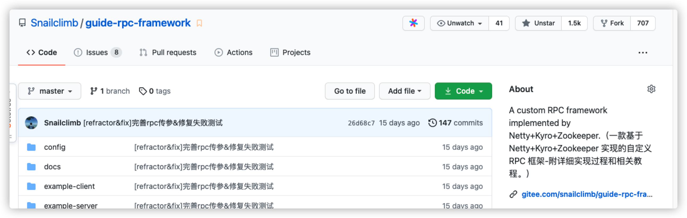

**第三，造轮子可以倒逼自己学习。**

造轮子的过程中，我们往往需要做大量的功课，学习很多自己之前没有接触过的东西。

就比如我在写 [guide-rpc-framework](https://github.com/Snailclimb/guide-rpc-framework) 之前，自己对于 Netty
的使用仅仅停留在发送和接收消息。在写 [guide-rpc-framework](https://github.com/Snailclimb/guide-rpc-framework)
的过程中，我就学习了很多关于 Netty 更高级的使用比如粘包/半包处理、 心跳机制。

##### 从项目/公司角度来说

**第一，造轮子可以更好地适应项目需求**

当项目业务比较复杂和庞大之后，很可能存在现有的轮子不满足我们的需求的情况。这个时候，我们就需要自己造一个更适合自己的轮子了。

**第二，一个好的轮子的诞生可以提高公司的技术影响力**

像现在国内的很多公司都在搞开源，甚至有的公司的部门还有开源项目的 KPI。

不可否认的是，我们程序员在找工作的时候很看重这个公司有没有比较好的开源项目的。

拿 Java 来说，为什么大家觉得阿里的技术很厉害。主要原因其实并不是因为阿里的业务场景的技术挑战有多大，而是阿里开源了很多还不错的框架比如
Dubbo、Spring Cloud Alibaba。

**第三，造轮子可以让公司的技术得到沉淀。**

公司可以把自己解决某一领域的问题通过造轮子的方式沉淀下来，这样的话，以后再遇到类似的问题就可以直接使用现成的轮子解决了。就比如很多公司内部都有一套适合自己公司的框架，使用这套框架可以帮助开发者节省很多开发时间。

## **程序员如何快速上手一个新项目？**

今天的文章标题就是我平时被问过的一个高频问题。

确实，很多小伙伴在学习或者接手一个项目的时候，不知道如何快速了解项目。

今天这篇文章我就简单聊聊“如何快速上手一个新项目？面试被问项目经历有哪些小技巧？”。

下面是正文！

### 项目学习五步走

**一般项目都会有遗留文档，不论是传统的项目开发模式还是敏捷开发模式。上项目之前自己抽时间看一下相关文档，大概了解一下这个项目整体的情况比如基本的业务还有技术选型啊这些。
**

如果项目是单机的话，大部分就是增删改查的逻辑，主要是对于业务的理解。

如果项目是分布式或者微服务的话，会涉及各个服务之间的调用以及一些其他问题比如限流、分布式锁、分布式 ID 这些，稍微会复杂一些。

不过不论是什么类型的项目，上手的姿势大概是下面几步。

#### 第一步:了解业务

先搞清你接受的新项目:

1. **是做什么的？** 主要面向什么人群使用？
2. **主要提供了哪些功能？**
3. 项目背景是什么样的？
4. 项目涉及的关键业务流程是怎么样的？
5. 项目目前面临的挑战是什么？未来规划是什么？
6. ......

**技术本身就是为了业务而服务，只有首先搞清楚了业务之后你才真正算是步入了这个项目的大门。**

#### 第二步:搭建项目开发环境

是骡子是马总要拉出来溜溜。所以，第二步我推荐你简单把开发环境搭建一下。搭建的步骤一般都在项目的 README 文档里面。

搭建完成之后，需要确保项目能够在自己的电脑上正确运行。

#### 第三步:看项目技术架构

这个直接看项目的相关依赖就好。拿 Java 后端项目举例子，如果是 Maven 项目的话看 pom.xml，如果是 Gradle 项目就看 build.gradle。

可能会涉及下面这几部分，但是并不完全。

1. 项目最底层框架是什么？是 Spring 还是 Spring Boot，又或者是其他框架呢？
2. 项目依赖了哪些相关的包？挑重点看，比如数据库是 MyBatis 还是 JPA 或者是公司自研的框架呢？
3. 项目使用的什么数据库？是 MySQL 还是 PostgreSQL，又或者是其他数据库呢？
4. 项目用到了缓存吗？是 Redis 缓存吗?有没有用到本地缓存呢？
5. 项目用到了消息队列吗？ Kafka 还是 RocketMQ?
6. 项目的权限管理这块是怎么做的呢？
7. .......

#### 第四步:看项目的代码结构

项目的代码结构是怎么划分的，比如常见的项目可能会分为下面三层（复杂的系统分层可能会更多）。

1. Repository（数据库操作）
2. Service（业务操作）
3. Controller（数据交互）

如果是 DDD 分层架构的话，可能是下面这样的：

1. User Interface（用户界面层）
2. Application（应用层）
3. Domain（模型层）
4. Infrastructure（基础实施层）

不同的公司对于项目的结构的划分可能也不同，不过大体都是类似的。比如《阿里巴巴 Java 开发手册》中所推荐的项目代码结构是下面这样的。

#### 第五步:从功能主线/问题出发研究项目源码

一个比较成熟的项目的源码量是非常多，我们不可能都完完整整地看完，也没有必要。

你可以通过 debug 调试,研究项目核心代码逻辑。比较推荐的方式就是通过一个功能主线（比如 Dubbo 是如何暴露服务的？）或者问题（比如
？）出发。

对于企业项目来说，大部分还是知道如何进行 debug 调试的。但是，对于 Spring 这种顶级开源框架来说，很多人就不知道怎么打断点了。

我比较推荐的是你可以先把源码拷贝到本地，然后运行源码中提供的 Demo。对于你想研究的问题比如 Spring 的 IoC 源码，你先去找找对应的
API 调用方式的 Demo，然后根据 Demo 中的方法调用来研究整个过程。如果你觉得这种方法比较难的话，你也可以先去网上看看别人的分析。

### 项目经历的四个小技巧

面试中，对于项目经历的考察是重中之重。下面我就分享 4 个面试被问项目经历的小技巧：

**1.提前搞清楚项目的架构图、技术选型等等。**

比如下面这个就是我之前写的一个简易 RPC 框架（[guide-rpc-framework](https://github.com/Snailclimb/guide-rpc-framework)
）的架构图。

再比如下面这个是一个微服务的电商网站的架构图。

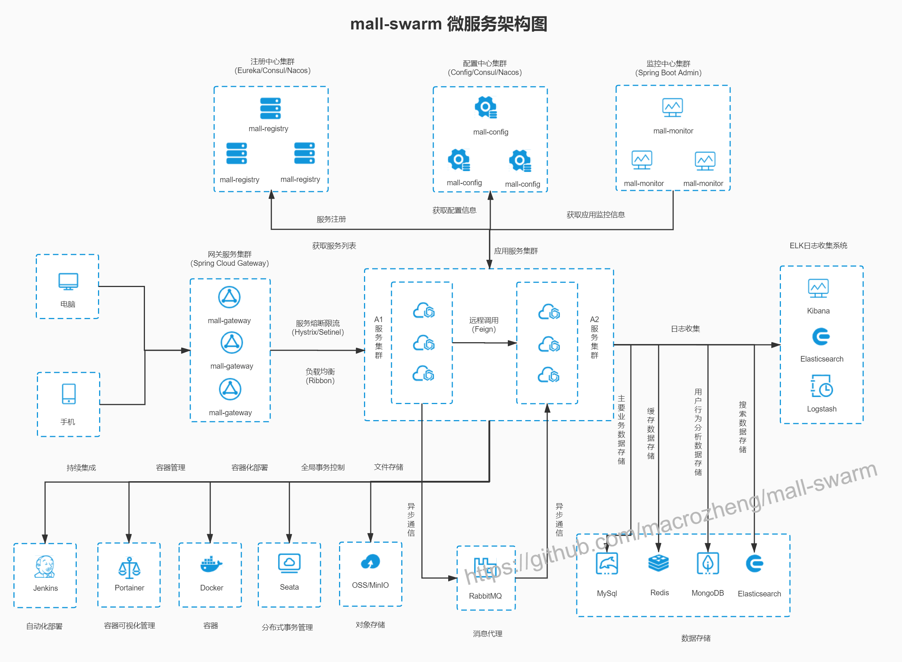

**2.提前想好项目的亮点，针对项目涉及的关键技术进行深度复习。**

比如说，你的项目用了消息队列的话，你就很有必要提前想好怎么回答消息队列相关的一些问题：消息队列解决了什么问题、常见消息队列对比、如何保证消息只被消费一次、如何保证消息不被重复消费......。

**3.引导面试官问你熟悉的技术。**

比如说，你对消息队列比较了解的话，介绍项目的时候就可以多介绍一下自己通过消息队列解决了什么问题。

**4.突出个人的贡献比如自己在项目中解决了什么问题，而不只是叙述自己做了什么。**

## **程序员如何有效地提高工作效率？**

对于下面的每一点建议的理解，每个人可能都不一样。

如果你觉得某一点对你有用的话，不要关了这篇文章之后你就忘记了，建议你一定要记录下来。从当下开始就去努力践行。

本文概览：

- 根据事情的重要程度安排优先级
- 会安排自己任务，学会制定计划
- 工作之外有点自己感兴趣的东西
- 学会使用工具提升工作效率
- 学会休息
- 如何保证精力充沛

### **根据事情的重要程度安排优先级**

说实话，在这一点上，我自己刚工作那会做的并不好，也经常因为没有处理好事情的优先级被 diss。

不知道大家会不会有时候在一个不那么重要的事情上，耽搁很久，虽然这件事情不是很重要，自己也知道要先去做最重要的事情，但就是想把当前的事情做完为止。

**如何安排工作上的事情的优先级？**

给几点建议大家参考一下，**总体原则还是重要的事情优先**。

1. 客户、线上、安全问题最优先
2. 对于后续开发依赖比较大的业务优先
3. 工作量小，流程比较长的优先比如账户认证，资源申请等等

### 学会安排自己任务，学会制定计划

工作之后，你会发现自己的时间少了太多太多太多。大部分时间都会感觉每天忙忙碌碌，后头看，却不知道自己究竟做了啥！

前几天自己刚想学习的某个技术、刚想看某本书，忙着忙着却又忘记了。**所以，你需要学会合理安排自己的任务**。

我个人比较推荐 Trello 作为个人任务管理工具。

据我所知国内外很多项目都是用 Trello 来做项目管理的。

**我平时使用 Trello 记录一些自己想写的文章或者代码，以及一些读者的投稿情况和个人突然冒出来的想法**。

下图是我平时用 Trello 记录自己要写的文章或者代码的效果。我还会按照优先级来排列每一个任务和想法。

然后，**平时的一些小任务我是通过 Microsoft To Do来记的**（Windows、Mac、Android）。

我之前使用的是滴答清单，但是，后来发现 Microsoft To Do 用着更舒服点，界面也更加符合我的审美。

最后，**再来安利一下番茄工作法**！ 番茄工作法是我一直在用，并且也经常安排给身边朋友的一个时间管理方法，简单易操作，并且效果极好。

> 注意：番茄工作法不一定适合每个人，并且，有的公司根本没条件让你用番茄工作法。

维基百科是这样介绍番茄工作法的：

> 番茄工作法原理：每次专注一段时间（一般是 25 分钟）结束搭配一次休息（一般是 5 分钟），多次专注（一般为 4 次）结束搭配一次长休息（一般为
> 15 分钟）。劳逸结合，有助于提高工作效率。

我每天会根据事情的重要程度以及难易程度给我当天要做的所有事情排一个优先级，然后按照番茄工作法一个一个地去完成。每一次专注的
25 分钟时间内，我都会保证自己只做这一件事情。空余的 5 分钟休息时间，我一般会简单看看邮件、做做眼保健操或者起来站一会放松一下。

我的番茄任务管理工具是在 Apple Store 上 花钱购买的 Be Foucused 的 Pro 版。

不是 Mac 电脑的也没关系，再给小伙伴们再推荐一个多平台（ios、andriod、mac、win）都可以使用的任务管理工具：**番茄土豆** 。

### 工作之外有点自己感兴趣的东西

工作之外要有自己的生活，这样的日子才不会太单调，比如我工作之外喜欢打打游戏放松一下，周末的时候喜欢自己烹饪做好吃的东西给自己。有人可能觉得这个比较浪费时间，不过，在我而言这也是对自己的一种放松，或许在某种程度还能帮助我们提升效率。

### 学会使用工具提升工作效率

就比如我上面推荐的几款效率工具，就我个人而言真的是方便了我太多，在工具效率上给我带来了很大的帮助。

再拿我们平时编程来说，选好编程工具也真的太重要了，比如在我看来 Java 最好的 IDE 当属 IDEA 了，随随便便提升 30%以上的开发效率不是吹的。

另外，我平时也会经常给大家推荐一些不错的工具比如：[浏览 Github 必备的 5 款神器级别的 Chrome 插件](https://mp.weixin.qq.com/s?__biz=Mzg2OTA0Njk0OA==&mid=2247486210&idx=1&sn=609298f537b2aa08b82c9d04ba863de5&chksm=cea244c9f9d5cddf786b508edf8b0bc8e08e5cc1f3d9e96b4eb6e9a9ee0f50a36a2cff6a9ce9&token=1045306289&lang=zh_CN&scene=21#wechat_redirect)，[IDEA 插件](https://mp.weixin.qq.com/mp/appmsgalbum?action=getalbum&album_id=1319419426898329600&__biz=Mzg2OTA0Njk0OA==#wechat_redirect)
，这些工具/插件它不香么？

### 学会休息

别打时间战，少熬夜，休息好了，工作效率才高。熬夜的危害就不用多说了，秃头加内分泌失调，你懂得！

拿我个人来说，我平时如果 12 点前睡的话，白天就是 7 点起来，如果 12 点后睡的话，一般都是 8 点左右起来。没睡好的话，一天真的效率会降低很多。

看电脑 45 分钟之后，起来走 5 分钟，看看远方放松一下。不要觉得这 5 分钟浪费时间，相反，这 5 分钟可能为你带来更大的效率提升。

电脑架子不贵，但是很有用，保护好自己脊椎的同时，办公体验也会提升很多。

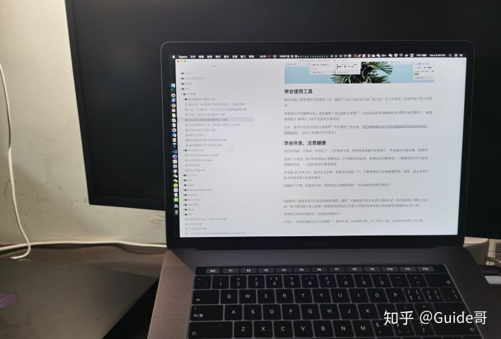

### 如何保证精力充沛

除了上面提到的 **学会休息** 之外，还有哪些能够让我们的经历更充沛的好习惯呢？

正所谓 ：**选择大于努力，效率大于堆时间**。

只有我们从下层打好基础，才能稳步上升，最后登顶。

1. 不要吃太多碳水，容易瞌睡。
2. 一定要吃早餐。
3. 咀嚼，具有促进头脑清醒的作用。吃饭的时候，不要太急，多咀嚼一下。
4. 尽量午睡，控制在半小时左右。
5. 运动！拒绝久坐！
6. 早上起来太困的话，洗个澡！
7. 锻炼！
8. 保持积极的心态，减少消极情绪。

相关阅读：

- 如何拥有旺盛精力？ - 知乎 https://www.zhihu.com/question/21671881
- 如何保持精力充沛，有效适应困、倦、疲、乏等周期型生理状况？ - 知乎 https://www.zhihu.com/question/21097892
- 低碳水食物清单 ：https://lowcarbfasthealth.com/low-carb-food-visual-guides/

## **如何更高效地自学编程？**

我的学校是荆州一所双非一本。整个大一，我都没有怎么认真学习编程，每天就是出去玩，还有参加各种社团活动。

在大二上学期末，最终确定了自己以后要走的技术方向是走 Java 后端。于是，我就开始制定学习计划，开始了自己的 Java 后端领域的打怪升级之路。

到了大三，我基本把 Java 后端领域一些必备的技术都给过了一遍，还用自己学的东西做了两个实战项目。

这篇文章就从下面几个切入点来简单聊聊“如何更高效地自学？”：

- 有哪些学习的途径
- 如何获取技术最新动向？
- 自学过程中有哪些需要注意的地方？

### 有哪些学习的途径？

一般来说，有了一个具体的学习路线，知道学习什么之后，我们通常有下面几个方向来学习:

#### 视频

初学编程的小伙伴尽量多看视频，因为，视频教程比较容易理解。不过，对于经验已经比较丰富的小伙伴来说，视频教程相比于文档教程学习起来会更慢一些。

像慕课网和哔哩哔哩上面有挺多学习视频可以看，只直接在上面搜索关键词（比如 Java、MySQL）就可以了。

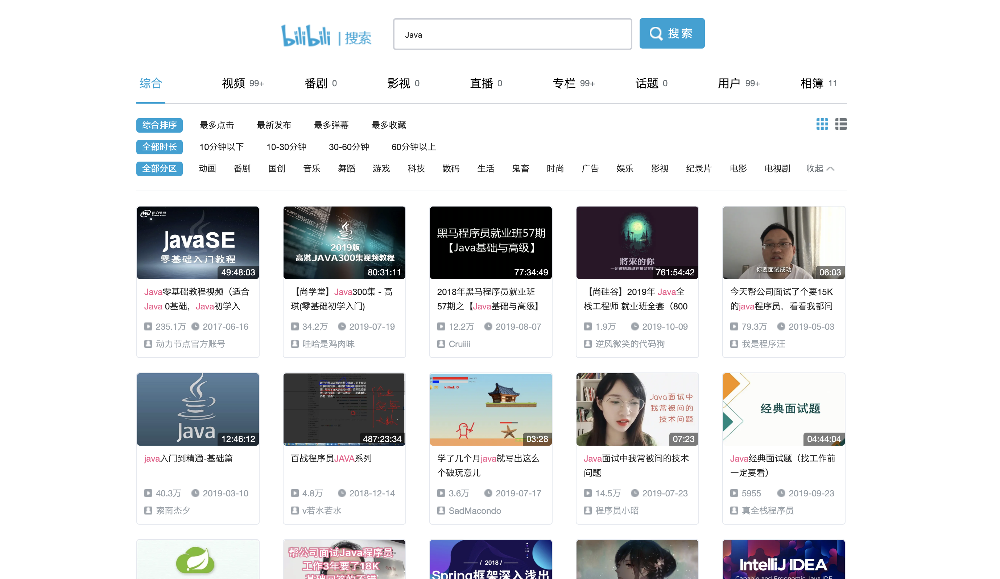

提个醒哈！在哔哩哔哩上学习的时候，不要学一会就跑到别的分区去了，有点顶不住啊！

#### 书籍

**书籍的内容更成体系，更系统。任何时候，书籍都是我们最重要的学习途径！！！**

不过，目前绝大部分高质量的技术书籍还是国外出版的，等到翻译成中文的时候可能已经过了几年了。因此，提高英文阅读能力是每个想要成为优秀工程师的程序员必须要做的。

不过，书籍存在时效问题，你可以通过一些手段来获取技术的最新动向（后面会详细介绍到）。

#### 博客

网上的博客大多没有体系，推荐你在解决某一知识点或者问题的时候可以在网上找一些相关的博客看。就比如我在学习消息队列 Pulsar
的时候，先把[Pulsar 官方文档](https://pulsar.apache.org/docs/zh-CN/next/concepts-overview/)看了一遍。然后，自己在网上找了一些相关的文章来深入学习。

- [《Kafka vs. Pulsar vs. RabbitMQ: Performance, Architecture, and Features Compared》](https://www.confluent.io/kafka-vs-pulsar/)
- [《为什么放弃 Kafka，选择 Pulsar?》](https://mp.weixin.qq.com/s/msBUvoNn_o_49I59CtSNgw)
- [《7 Reasons We Chose Apache Pulsar over Apache Kafka》](https://www.datastax.com/blog/2019/05/7-reasons-we-chose-apache-pulsar-over-apache-kafka)
- [《比拼 Kafka, 大数据分析新秀 Pulsar 到底好在哪》](https://www.infoq.cn/article/1UaxFKWUhUKTY1t_5gPq)
- [《从 Kafka 到 Pulsar，BIGO 打造实时消息系统之路》](https://mp.weixin.qq.com/s/qHmK_dejIgyvtvEhmlE9ug)
- [《Apache Pulsar 在 BIGO 的性能调优实战（上）》](https://mp.weixin.qq.com/s/mJViU-elhBwHMDiius2b8g)、[《Apache Pulsar 在 BIGO 的性能调优实战（下）》](https://mp.weixin.qq.com/s/f0vL6gdFJIjNwsfZ3BXePA)
- [《Apache Pulsar 在能源互联网领域的落地实践》](https://mp.weixin.qq.com/s/sVSsezWLAeycNY8tvg2M0A)
- ......

Java 领域比较成体系的博客，推荐 [JavaGuide](https://javaguide.cn/) 。

#### 官网

官方文档我们一定是要看的。 除非是一些国产项目的官方文档提供了中文版本，否则大概率是英文的。并且，官方文档介绍的往往也比较粗糙，不太适合初学者作为学习资料。当然了，如果你经验比较丰富的话，直接看官方文档也是没问题的。

通过官方文档你才能知道你学习的技术最新的技术动态，才能知道这个技术有哪些模块需要学习，才能知道这个技术具体可以帮你解决什么问题。

比如下面是 Spring 的官网，通过网站首页你就可以大概知道 Spring 可以帮助你：

- 快速开发网站
- 开发微服务架构的软件
- 开发响应式架构的软件
- ......

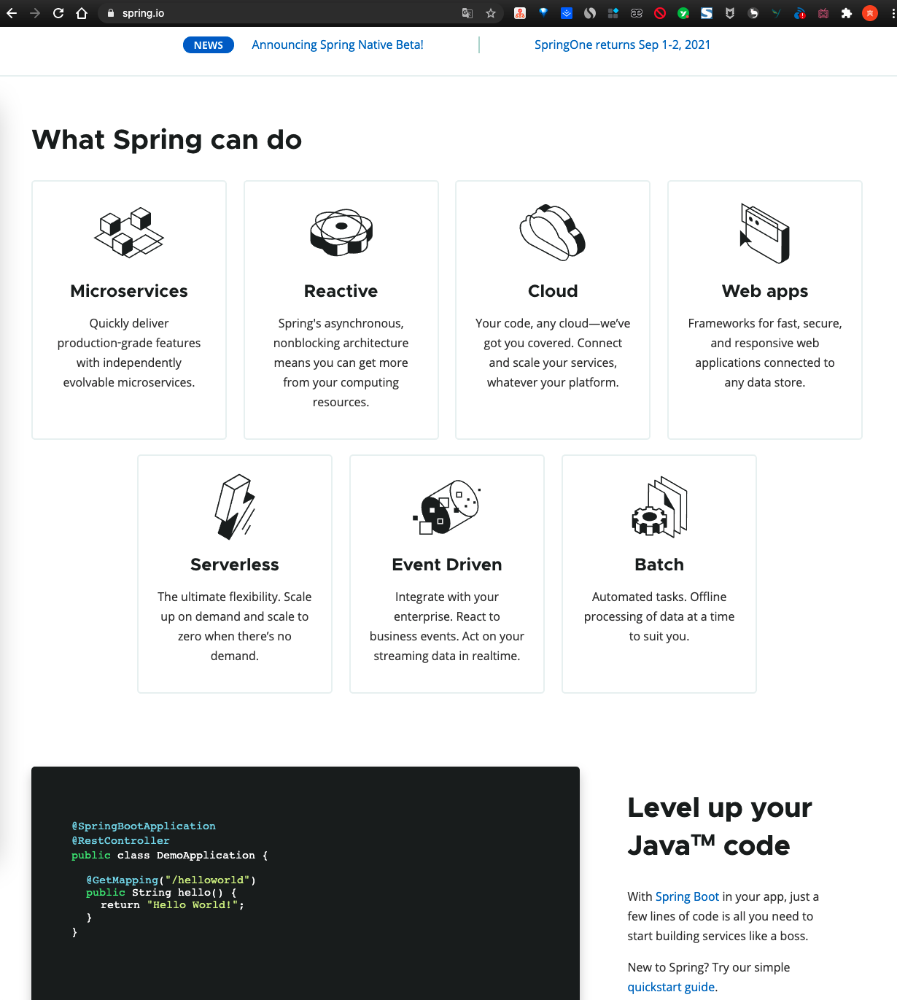

### **如何获取技术最新动向？**

#### Github Trending

Github Trending 我几乎每天必看，通过 Github Trending 我可以大概知道最近有哪些项目比较火，有哪些框架比较热门，有哪些新的中间件被开源了。

并且，Github 的 Trending 可以按照语言和日期来进行筛选，你可以根据自己的需要来选择查看对应的信息。

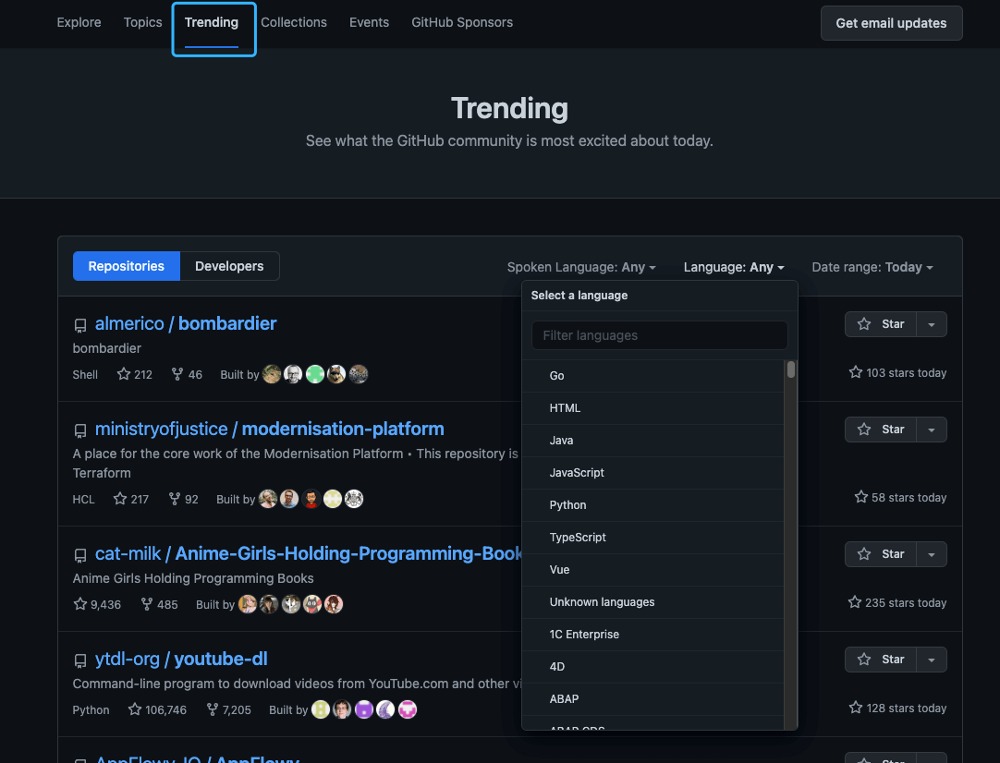

#### 公开的技术分享

你可以留意一些公开的技术分享比如 [InfoQ 技术大会](https://con.infoq.cn/conference/intro)、[思否技术活动汇总](https://segmentfault.com/events) 、。

通过这些公开的技术分享，你可以了解到当下热门的创新技术、实践案例、产品思维和管理心得。

#### 技术大佬

技术无国界，国内外都有很多优秀的工程师。多关注一下他们在干什么，在研究什么技术，或许能给你很大的启发和动力。

国内比较值得关注的技术大佬有：

- [Liang Zhang](https://github.com/terrymanu)：[Apache ShardingSphere](https://github.com/apache/shardingsphere)，[ElasticJob](https://github.com/apache/shardingsphere-elasticjob)
  创始人 & 项目管理委员会主席。
- [xiaoyu](https://github.com/yu199195) ： 作为主要作者开源了 soul(网关)、hmily(分布式事务框架)
  等等顶级开源项目，并且参与了[apache/shardingsphere](https://github.com/apache/shardingsphere)等开源项目。
- [immking](https://github.com/kimmking) ：Apache Dubbo/ShardingSphere PMC。前某集团高级技术总监/阿里架构师/某商业银行北京研发中心负责人，阿里云
  MVP、腾讯 TVP、TGO 鲲鹏会会员。
- [Juan Pan](https://github.com/tristaZero) ：京东数科高级 DBA&Apache ShardingSphere
  PMC，主要负责京东数科分布式数据库开发、数据库运维自动化平台开发等工作。
- [Jintao Zhang](https://github.com/tao12345666333) ：[《Kubernetes 从上手到实践》](https://juejin.im/book/5b9b2dc86fb9a05d0f16c8ac) [《Docker 核心知识必知必会》](https://gitbook.cn/gitchat/column/5d70cfdc4dc213091bfca46f)
  作者、[API7.AI](https://www.apiseven.com/en)
  任技术专家，负责 [Apache APISIX Ingress](https://github.com/apache/apisix-ingress-controller/) 和 Service Mesh
  等云原生技术方向。
- .....

#### 技术社区

技术社区也是一个了解技术动向的好办法，国内外有很多优质的社区比如 [Reddit 上的 Java 社区](https://www.reddit.com/r/java/)，[InfoQ 中文社区](https://www.infoq.cn/)
（近几年质量有所下降）、[Medium 上的技术社区](https://medium.com/tag/technology)。

#### 技术博客

关注或者订阅一些干货比较多的技术博客，不光能够获取到技术最新动向，还可以让自己深入学习很多知识点。

如果你不知道国内有哪些值得推荐的技术博客的话，可以看看这篇文章：[国内有哪些顶级技术团队的博客值得推荐？ - JavaGuide - 知乎](https://zhuanlan.zhihu.com/p/354403878) 。

### 自学过程中有哪些需要注意的地方？

#### 英语阅读能力

大部分优秀的技术书籍都是国外的，几乎都是英文，并且，大部分技术的官方文档也都是英文的。

所以，提高自己的英文阅读能力很重要。英文阅读能力暂时比较差的也不要紧，有道翻译和谷歌翻译就是你最好的老师。如果是使用 Chrome
浏览器的话，我还推荐你安装一个 Mate Translate 插件。 这个插件对于网页阅读英文文档太友好了，可以一站式翻译您的网页以及标记的文字段落。

#### 多练！多记！多实践！多实战！

不论是看视频还是看书，最好都要跟着一起练！

学习编程，不动手实践那都是扯淡。你是不是经常听别人讲的时候感觉自己似乎懂了，好像也并不难，结果，自己写的时候就不会了，过了没几天自己就忘了。

比如说我们学习 Spring Boot 整合其他常见框架的时候，你不光要看对应的 Spring Boot 教程，一定还要动手去实践，去写一些 Spring
Boot 的小 Demo。动手实践的过程中，你会发现有很多被自己忽略的细节，遇到一些需要解决的问题。解决问题的过程中，同样也是学习的过程。

再比如说我们学习 Tomcat 原理的时候，我们发现 Tomcat 的自定义线程池挺有意思，那我们自己也可以手写一个定制版的线程池。再比如我们学习
Dubbo 原理的时候，可以自己动手造一个简易版的 RPC 框架。

学习过程中没弄懂的知识点一定要尽快解决。如何解决？首选百度/Google，通过搜索引擎解决不了的话就找身边的朋友或者网上认识的一些人。

另外，一定要进行项目实战！很多人这时候就会问没有实际项目让我做怎么办？我觉得可以通过下面这几种方式：

1. 实战项目视频/专栏 ：
   在网上找一个符合自己能力与找工作需求的实战项目视频或者专栏，跟着老师一起做。跟着老师做的过程中，你一定要有自己的思考，不要浅尝辄止。对于很多知识点，别人的讲解可能只是满足项目就够了，你自己想多点知识的话，对于重要的知识点就要自己学会去深入学习。
2. 实战类开源项目 ： Github 或者码云上面有很多实战类别项目，你可以选择一个来研究，为了让自己对这个项目更加理解，在理解原有代码的基础上，你可以对原有项目进行改进或者增加功能。Java
   类的实战项目，你可以从 [awesome-java](https://github.com/Snailclimb/awesome-java) 这个仓库里面找，里面有很多非常赞的项目。
3. 从头开始做 ：自己动手去做一个自己想完成的东西，遇到不会的东西就临时去学，现学现卖。这个要求比较高，我建议你已经有了一个项目经验之后，再采用这个方法。如果你没有做过项目的话，还是老老实实采用上面两个方法比较好。
4. ......

做项目不光要做，还要改进，改善。另外，如果你的老师有相关 Java 后台项目的话，你也可以主动申请参与进来。

一定要学会分配自己时间，要学的东西很多，真的很多，搞清楚哪些东西是重点，哪些东西仅仅了解就够了。一定不要把精力都花在了学各种框架上，算法和数据结构真的很重要！

#### 不要把学习编程还当做学生时代的应试考试来看

你或许也发现了。很多成绩特别特别优异的同学，他们的编程能力其实并不好。在大学的时候，那些编程能力最强的往往是那些成绩比较一般的。

为什么会这样呢？

我觉得主要是一个思维的转变问题。很多人学习编程的时候，总是想着我要把这个 API
记下来，把这个库的用法记下来。这样学习，导致的结果只有一个那就是你会很难受！因为，这些根本不是要死记硬背的东西啊！真还当这是上课考试啊！
**你要从如何用你学的东西来解决实际编程问题出发，站在做一个实际的项目的角度来学习。**

拿我自己来说：我平时也会写 Python，基本就是自己看着官方文档或者一些书籍的教的语法跟着写。如果哪个地方不会了，我就去查一下。

#### 多看优秀的代码

**不看优秀的代码，你写的代码质量很难提高。**

虽然要多看优秀的代码，但是也不要被 “**最佳实践**” 所束缚，很多时候实际是根本不存在适用于任何场景的“最佳实践”，没有银弹。

**有哪些优秀的代码值得学习呢？**

拿 Java 来说，不知道阅读什么源码的话，可以先从 JDK 的几个常用集合看起。另外，我比较推荐看 Dubbo
的，因为感觉会稍微相对容易一点，模块划分清晰，注释也比较详细。搞清楚了 RPC 的基本的原理，知道如何自己实现一个 RPC
框架之后，看起来就没那么吃力了。

另外，随便一个框架的源码都 10w+行了，都看一遍是不可能的。要挑选比较重要的地方看，就比如看 Spring 源码的话你一定要看 IoC 和
AOP，要知道一个 Spring Bean 是如何一步一步被创建出来的。你要看 Spring Boot 源码的话就要知道 Spring Boot 的启动机制是啥，Spring
Boot 是如何实现自动配置的。

#### 不要死记硬背

学习理论知识的时候，我们可以多花点时间整理笔记。

但是，在学习框架使用的时候，就没有太大必要花大量时间的整理做笔记了。

你完全可以随时查文档，记住关键词即可！比如 Spring Boot 你不知道如何接受 Query Param 的话，你直接搜 Spring Boot Query Param
即可！

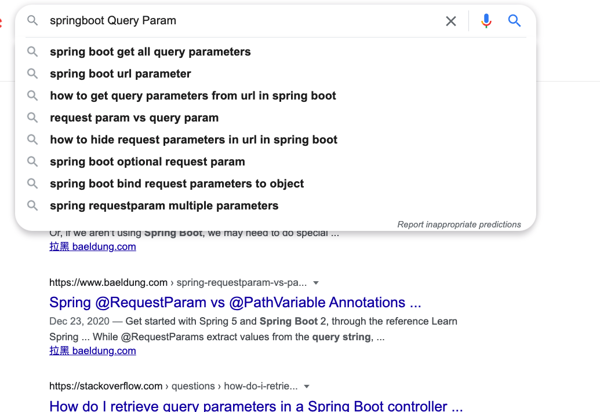

再比如你不会使用 Redis ，你做的 Spring Boot 项目需要用到的话，你直接搜“Spring Boot+ Redis”就出来了各种详细的教程。

**你要做的就是把常用的东西串联起来，知道有这个东西就好。根据自己的实际能力，再对底层的东西进行学习就好。**

## **程序员如何快速学习新技术？**

很多时候，我们因为工作原因需要快速学习某项技术，进而在项目中应用。或者说，我们想要去面试的公司要求的某项技术我们之前没有接触过，为了应对面试需要，我们需要快速掌握这项技术。

作为一个人纯自学出生的程序员，这篇文章简单聊聊自己对于如何快速学习某项技术的看法。

文章内容仅代表个人观点，如果你有更好的学习方法，还请在评论区多多和我交流。希望我们都能有所收货！

学习任何一门技术的时候，一定要先搞清楚这个技术是为了解决什么问题的。深入学习这个技术的之前，一定先从全局的角度来了解这个技术，思考一下它是由哪些模块构成的，提供了哪些功能，和同类的技术想必它有什么优势。

比如说我们在学习 Spring 的时候，通过 Spring 官方文档你就可以知道 Spring 最新的技术动态，Spring 包含哪些模块 以及 Spring
可以帮你解决什么问题。

再比如说我在学习消息队列的时候，我会先去了解这个消息队列一般在系统中有什么作用，帮助我们解决了什么问题。消息队列的种类很多，具体学习研究某个消息队列的时候，我会将其和自己已经学习过的消息队列作比较。像我自己在学习
RocketMQ 的时候，就会先将其和自己曾经学习过的第 1 个消息队列 ActiveMQ 进行比较，思考 RocketMQ 相对于 ActiveMQ 有了哪些提升，解决了
ActiveMQ 的哪些痛点，两者有哪些相似的地方，又有哪些不同的地方。

**学习一个技术最有效最快的办法就是将这个技术和自己之前学到的技术建立连接，形成一个网络。**

然后，我建议你先去看看官方文档的教程，运行一下相关的 Demo ，做一些小项目。

不过，官方文档通常是英文的，通常只有国产项目以及少部分国外的项目提供了中文文档。并且，官方文档介绍的往往也比较粗糙，不太适合初学者作为学习资料。

如果你看不太懂官网的文档，你也可以搜索相关的关键词找一些高质量的博客或者视频来看。 **一定不要一上来就想着要搞懂这个技术的原理
**。

就比如说我们在学习 Spring 框架的时候，我建议你在搞懂 Spring 框架所解决的问题之后，不是直接去开始研究 Spring
框架的原理或者源码，而是先实际去体验一下 Spring 框架提供的核心功能 IoC（Inverse of Control:控制反转） 和 AOP(
Aspect-Oriented Programming:面向切面编程)，使用 Spring 框架写一些 Demo，甚至是使用 Spring 框架做一些小项目。

一言以蔽之， **在研究这个技术的原理之前，先要搞懂这个技术是怎么使用的。**

这样的循序渐进的学习过程，可以逐渐帮你建立学习的快感，获得即时的成就感，避免直接研究原理性的知识而被劝退。

**研究某个技术原理的时候，为了避免内容过于抽象，我们同样可以动手实践。**

比如说我们学习 Tomcat 原理的时候，我们发现 Tomcat 的自定义线程池挺有意思，那我们自己也可以手写一个定制版的线程池。再比如我们学习Dubbo
原理的时候，可以自己动手造一个简易版的 RPC 框架。

另外，学习项目中需要用到的技术和面试中需要用到的技术其实还是有一些差别的。

如果你学习某一项技术是为了在实际项目中使用的话，那你的侧重点就是学习这项技术的使用以及最佳实践，了解这项技术在使用过程中可能会遇到的问题。你的最终目标就是这项技术为项目带来了实际的效果，并且，这个效果是正面的。

如果你学习某一项技术仅仅是为了面试的话，那你的侧重点就应该放在这项技术在面试中最常见的一些问题上，也就是我们常说的八股文。

很多人一提到八股文，就是一脸不屑。在我看来，如果你不是死记硬背八股文，而是去所思考这些面试题的本质。那你在准备八股文的过程中，同样也能让你加深对这项技术的了解。

最后，最重要同时也是最难的还是 **知行合一！知行合一！知行合一！** 不论是编程还是其他领域，最重要不是你知道的有多少，而是要尽量做到知行合一。

## **如何提高个人编程硬实力？**

**我们平时要拿大厂的要求来鞭策自己，尽量避免一直待在自己的舒适区。**

**那大厂想要什么样的人才呢？**

**先从已经有两年左右开发经验的工程师角度来看**： 我们来看一下阿里官网支付宝 Java 高级开发工程师的招聘要求，从下面的招聘信息可以看出，除去
Java 基础/集合/多线程这些，这些能力格外重要：

1. **底层知识比如 jvm ：**不只是懂理论更会实操；
2. **面向对象编程能力 ：**我理解这个不仅包括“面向对象编程”，还有 SOLID
   软件设计原则，相关阅读：[《写了这么多年代码，你真的了解 SOLID 吗？》](https://insights.thoughtworks.cn/do-you-really-know-solid/)
   （我司大佬的一篇文章）
3. **框架能力 ：**不只是使用那么简单，更要搞懂原理和机制！搞懂原理和机制的基础是要学会看源码。
4. **分布式系统开发能力 ：**缓存、消息队列等等都要掌握，关键是还要能使用这些技术解决实际问题而不是纸上谈兵。
5. **不错的 sense :**喜欢和尝试新技术、追求编写优雅的代码等等。

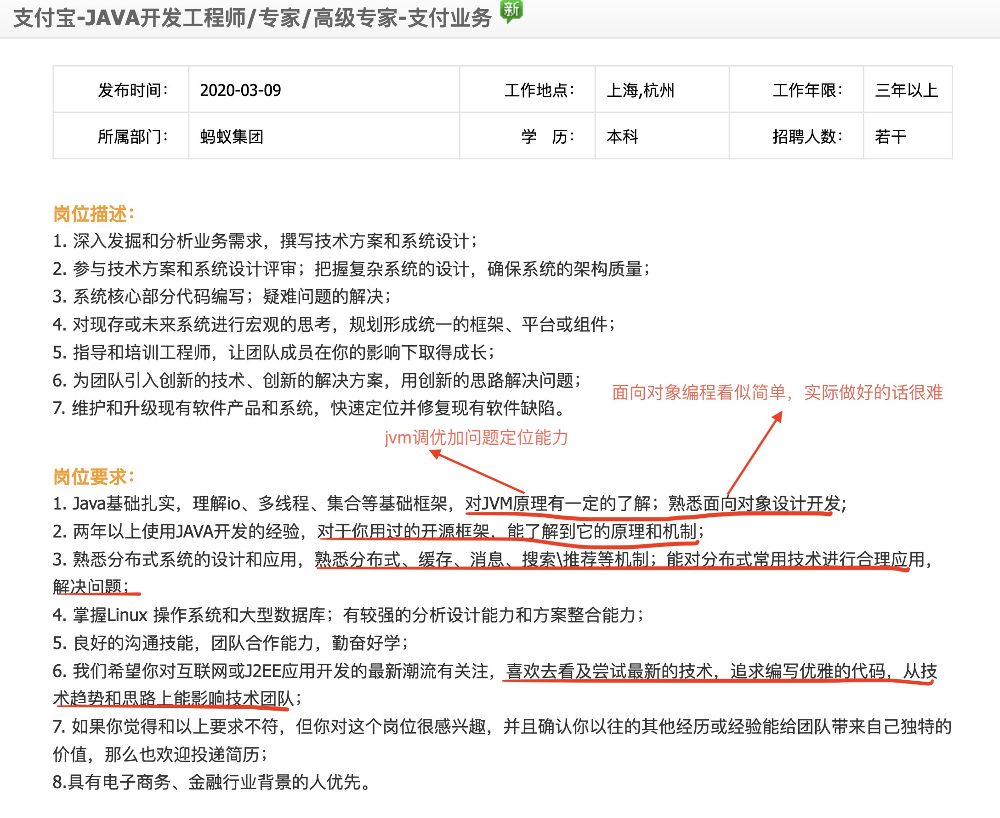

**再从应届生的角度来看：** 我们还是看阿里巴巴的官网相关应届生 Java 工程师招聘岗位的相关要求。

-166615695771153)

结合阿里、腾讯等大厂招聘官网对于 Java 后端方向/后端方向的应届实习生的要求下面几点也提升你的个人竞争力：

1. 参加过竞赛（ 含金量超高的是 ACM ）；
2. 对数据结构与算法非常熟练；
3. 参与过实际项目（比如学校网站）
4. 熟悉 Python、Shell、Perl 其中一门脚本语言；
5. 熟悉如何优化 Java 代码、有写出质量更高的代码的意识；
6. 熟悉 SOA 分布式相关的知识尤其是理论知识；
7. 熟悉自己所用框架的底层知识比如 Spring；
8. 有高并发开发经验；
9. 有大数据开发经验等等。

从来到大学之后，我的好多阅历非常深的老师经常就会告诫我们：“ 一定要有一门自己的特长，不管是技术还好还是其他能力 ”
。我觉得这句话真的非常有道理！

刚刚也提到了要有一门特长，所以在这里再强调一点：公司不需要你什么都会，但是在某一方面你一定要有过于常人的优点。换言之就是我们不需要去掌握每一门技术（你也没精力去掌握这么多技术），而是需要去深入研究某一门技术，对于其他技术我们可以简单了解一下。

我觉得一个好的 Java 程序员应该具备下面这些素质：

1. Java 基础 ：掌握 Java 基础知识（可以看《Java 核心技术卷 1》或者《Head First Java》这两本书在我看来都是入门 Java
   的很不错的书籍），当然你也可以边看视频边看书学习（推荐黑马或者尚硅谷的视频）。一定要记得多总结！打好基础！把自己重要的东西都记录下来。
2. 多线程 ：掌握多线程的简单实用（推荐《Java 并发编程之美》或者《实战 Java 高并发程序设计》）。
3. JVM(可选) ：如果想去大厂，JVM 的一些知识也是必学的（Java 内存区域、虚拟机垃圾算法、虚拟垃圾收集器、JVM 内存管理）推荐《深入理解
   Java 虚拟机》。
4. 算法和数据结构：如果你想进入大厂的话，我推荐你在学习完 Java 基础或者多线程之后，就开始每天抽出一点时间来学习算法和数据结构。为了提高自己的编程能力，你也可以坚持刷
   Leetcode。
5. 前端知识 ：学习前端基础(HTML、CSS、JavaScript),当然 BootStrap、VUE 等等前端框架你也可以了解一下。
6. Git : 版本控制工具 Git 绝对比必须的。你可以自己去 Github 上下载一些项目看，然后自己也上传一个项目到 Github 上去。
7. MySQL : 学习 MySQL 的基本使用，基本的增删改查，索引需要重点关注，存储过程可以简单了解一下。
8. Maven ： 建议学习各种框架之前可以提前花半天时间学习一下 Maven 的使用。（到处找 Jar 包，下载 Jar 包是真的麻烦费事，使用
   Maven 可以为你省很多事情）
9. 框架 ：学习 Spring、SpringMVC、Hibernate、Mybatis 等框架的使用，(可选)熟悉 Spring 原理（大厂面试必备），然后很有必要学习一下
   SpringBoot。我也遇到很多公司对于应届生直接上手 SpringBoot，不过我还是推荐你有时间还是可以把 Spring、SpringMVC 好好学一下。不过
   SpringBoot 优先级最高！
10. Linux :学习 Linux 的基本使用(常见命令、基本概念)
11. 分布式 ：RPC、服务注册于发现、API 网关、配置中心、分布式 ID、分布式事务......。
12. 高并发 ： 消息队列、读写分离&分库分表、负载均衡、缓存......这些。
13. 高可用 ： 主要就是限流&降级&熔断、集群......这些。
14. 微服务 ：微服务的一些基本概念、SpringCloud 和 Spring Cloud Alibaba 那一套都可以学习一下。我比较推荐的是学习 Spring
    Cloud Alibaba，因为首先它是阿里开源的，文档比较丰富，另外，它比较新，各种组件都可以说很不错。
15. 进阶 ：操作系统底层知识、计算机组成原理、Java 编码优秀实践、SQL 调优、定位解决线上问题的能力等等

**知道要学什么之后，如何去学呢？**

我觉得学习每个知识点可以考虑这样去入手：

1. 官网（大概率是英文，不推荐初学者看）
2. 书籍（知识更加系统完全，推荐）
3. 视频（比较容易理解，比较推荐，特别是初学的时候），另外，大家不要说自己工作很多年，技术也比较厉害了就不能看视频学习了。我认识的很多大佬，包括我经历的几个项目组的技术
   Leader，他们都有看视频学习技术的习惯。
4. 网上博客（解决某一知识点的问题的时候可以看看）。

最后，有一个建议是：*
*看视频的过程中最好跟着一起练，要做笔记！！！最好可以边看视频边找一本书籍看，看视频没弄懂的知识点一定要尽快解决，如何解决？首先百度/Google，通过搜索引擎解决不了的话就找身边的朋友或者认识的一些人。
**
