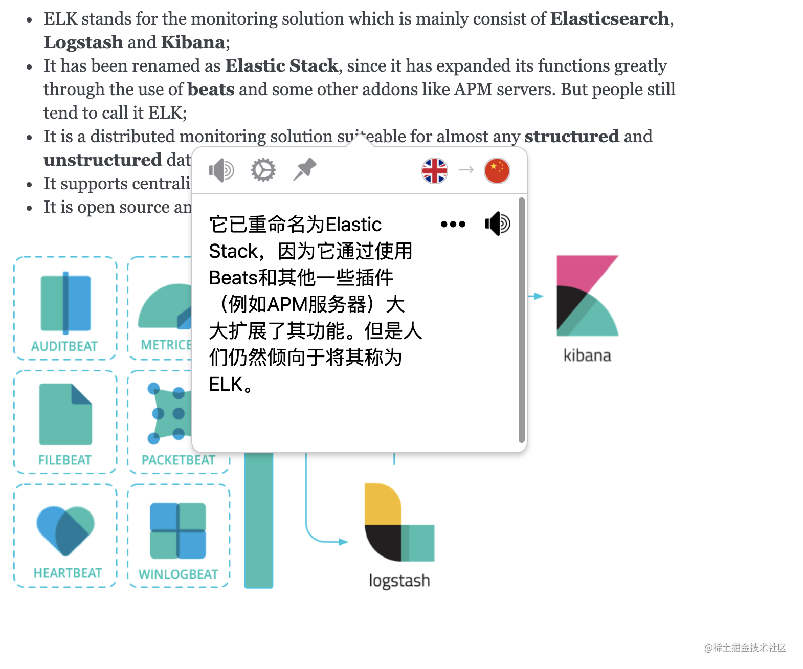
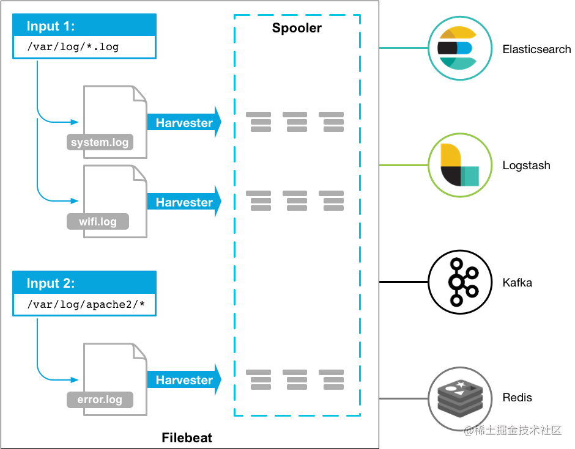

## Devops

### **监控系统常见面试题总结**

> 个人学习笔记，大部分内容整理自书籍、博客和官方文档。
>
> 相关文章 &书籍：
>
> - [监控系统选型，这篇不可不读！](https://www.jianshu.com/p/302ba018082a)
> - [Prometheus vs Nagios](https://logz.io/blog/prometheus-vs-nagios-metrics/)
> - [2020 年工作上的最大收获——监控告警体系](https://www.cnblogs.com/hunternet/p/14270218.html)
> - [《Prometheus 操作指南》](https://yunlzheng.gitbook.io/prometheus-book/)
>
> 相关视频：
>
> - [使用Prometheus实践基于Spring Boot监控告警体系](https://www.imooc.com/learn/1231)
> - [Prometheus & Grafana -陈嘉鹏 [尚硅谷大数据\]](https://www.bilibili.com/video/BV11f4y1A7aF)

#### 监控系统有什么用？

建立完善的监控体系主要是为了：

- **长期趋势分析 ：**通过对监控样本数据的持续收集和统计，对监控指标进行长期趋势分析。例如，通过对磁盘空间增长率的判断，我们可以提前预测在未来什么时间节点上需要对资源进行扩容。

- **数据可视化 ：**通过可视化仪表盘能够直接获取系统的运行状态、资源使用情况、以及服务运行状态等直观的信息。

- **预知故障和告警 :** 当系统出现或者即将出现故障时，监控系统需要迅速反应并通知管理员，从而能够对问题进行快速的处理或者提前预防问题的发生，避免出现对业务的影响。

- **辅助定位故障、性能调优、容量规划以及自动化运维**

**出任何线上事故，先不说其他地方有问题，监控部分一定是有问题的。**

**如何才能更好地使用监控使用？**

1. **了解监控对象的工作原理：**要做到对监控对象有基本的了解，清楚它的工作原理。比如想对 JVM 进行监控，你必须清楚 JVM
   的堆内存结构和垃圾回收机制。

2. **确定监控对象的指标：**清楚使用哪些指标来刻画监控对象的状态？比如想对某个接口进行监控，可以采用请求量、耗时、超时量、异常量等指标来衡量。

3. **定义合理的报警阈值和等级：**达到什么阈值需要告警？对应的故障等级是多少？不需要处理的告警不是好告警，可见定义合理的阈值有多重要，否则只会降低运维效率或者让监控系统失去它的作用。

4. **建立完善的故障处理流程：**收到故障告警后，一定要有相应的处理流程和 oncall 机制，让故障及时被跟进处理。

#### 常见的监控对象和指标有哪些？

- **硬件监控 ：**电源状态、CPU 状态、机器温度、风扇状态、物理磁盘、raid 状态、内存状态、网卡状态

- **服务器基础监控 ：**CPU、内存、磁盘、网络

- **数据库监控 ：**数据库连接数、QPS、TPS、并行处理的会话数、缓存命中率、主从延时、锁状态、慢查询

- **中间件监控 ：**

    - Nginx：活跃连接数、等待连接数、丢弃连接数、请求量、耗时、5XX 错误率

    - Tomcat：最大线程数、当前线程数、请求量、耗时、错误量、堆内存使用情况、GC 次数和耗时

    - 缓存 ：成功连接数、阻塞连接数、已使用内存、内存碎片率、请求量、耗时、缓存命中率

    - 消息队列：连接数、队列数、生产速率、消费速率、消息堆积量

- **应用监控 ：**

    - HTTP 接口：URL 存活、请求量、耗时、异常量

    - RPC 接口：请求量、耗时、超时量、拒绝量

    - JVM ：GC 次数、GC 耗时、各个内存区域的大小、当前线程数、死锁线程数

    - 线程池：活跃线程数、任务队列大小、任务执行耗时、拒绝任务数

    - 连接池：总连接数、活跃连接数

    - 日志监控：访问日志、错误日志

    - 业务指标：视业务来定，比如 PV、订单量等

#### 监控的基本流程了解吗？

无论是开源的监控系统还是自研的监控系统，监控的整个流程大同小异，一般都包括以下模块：

- **数据采集：**采集的方式有很多种，包括日志埋点进行采集（通过 Logstash、Filebeat 等进行上报和解析），JMX 标准接口输出监控指标，被监控对象提供
  REST API 进行数据采集（如 Hadoop、ES），系统命令行，统一的 SDK 进行侵入式的埋点和上报等。

- **数据传输：**将采集的数据以 TCP、UDP 或者 HTTP 协议的形式上报给监控系统，有主动 Push 模式，也有被动 Pull 模式。

- **数据存储：**有使用 MySQL、Oracle 等 RDBMS 存储的，也有使用时序数据库 RRDTool、OpentTSDB、InfluxDB 存储的，还有使用 HBase
  存储的。

- **数据展示：**数据指标的图形化展示。

- **监控告警：**灵活的告警设置，以及支持邮件、短信、IM 等多种通知通道。

#### 监控系统需要满足什么要求？

- **实时监控&告警 ：**监控系统对业务服务系统实时监控，如果产生系统异常及时告警给相关人员。

- **高可用 ：**要保障监控系统的可用性

- **故障容忍 ：**监控系统不影响业务系统的正常运行，监控系统挂了，应用正常运行。

- **可扩展 ：**支持分布式、跨 IDC 部署，横向扩展。

- **可视化 ：**自带可视化图标、支持对接各类可视化组件比如 Grafana 。

#### 监控系统技术选型有哪些？如何选择？

##### 老牌监控系统

Zabbix 和 Nagios 相继出现在 1998 年和 1999 年，目前已经被淘汰，不太建议使用，Prometheus 是更好的选择。

###### Zabbix

- **介绍 ：**老牌监控的优秀代表。产品成熟，监控功能很全面，采集方式丰富（支持 Agent、SNMP、JMX、SSH
  等多种采集方式，以及主动和被动的数据传输方式），使用也很广泛，差不多有 70%左右的互联网公司都曾使用过 Zabbix 作为监控解决方案。

- **开发语言 ：** C

- **数据存储 ：** Zabbix 存储在 MySQL 上，也可以存储在其他数据库服务。Zabbix 由于使用了关系型数据存储时序数据，所以在监控大规模集群时常常在数据存储方面捉襟见肘。所以从
  Zabbix 4.2 版本后开始支持 TimescaleDB 时序数据库，不过目前成熟度还不高。

- **数据采集方式 :** Zabbix 通过 SNMP、Agent、ICMP、SSH、IPMI 等对系统进行数据采集。Zabbix 采用的是 Push 模型（客户端发送数据给服务端）。

- **数据展示 ：**自带展示界面，也可以对接 Grafana。

- **评价 ：**不太建议使用 Zabbix，性能可能会成为监控系统的瓶颈。并且，应用层监控支持有限、二次开发难度大（基于 c 语言）、数据模型不强大。

相关阅读：[《zabbix 运维手册》](http://www.sunrisenan.com/docs/zabbix)

###### Nagios

- **介绍 ：**Nagios 能有效监控 Windows、Linux 和 UNIX 的主机状态（CPU、内存、磁盘等），以及交换机、路由器等网络设备（SMTP、POP3、HTTP
  和 NNTP 等），还有 Server、Application、Logging，用户可自定义监控脚本实现对上述对象的监控。Nagios 同时提供了一个可选的基于浏览器的
  Web 界面，以方便系统管理人员查看网络状态、各种系统问题以及日志等。

- **开发语言 ：** C

- **数据存储 ：** MySQL 数据库

- **数据采集方式 :** 通过各种插件采集数据

- **数据展示 ：**自带展示界面，不过功能简单。

- **评价 ：**不符合当前监控系统的要求，而且，Nagios 免费版本的功能非常有限，运维管理难度非常大。

##### 新一代监控系统

相比于老牌监控系统，新一代监控系统有明显的优势，比如：灵活的数据模型、更成熟的时序数据库、强大的告警功能。

###### Open-Falcon

- **介绍 ：**小米 2015 年开源的企业级监控工具，在架构设计上吸取了 Zabbix 的经验，同时很好地解决了 Zabbix 的诸多痛点。Github
  地址：https://github.com/open-falcon 。官方文档：https://book.open-falcon.org/ 。
- **开发语言 ：**Go、Python。
- **数据存储 ：** 环型数据库，支持对接时序数据库 OpenTSDB。
- **数据采集方式 :** 自动发现，支持 falcon-agent、snmp、支持用户主动 push、用户自定义插件支持、opentsdb data model
  like（timestamp、endpoint、metric、key-value tags）。Open-Falcon 和 Zabbix 采用的都是 Push 模型（客户端发送数据给服务端）。
- **数据展示 ：**自带展示界面，也可以对接 Grafana。
- **评价 ：**用户集中在国内，流行度一般，生态一般。

Open-Falcon 架构图如下：

- **Falcon-agent ：**采集模块。类似 Zabbix 的 agent，Kubernetes 自带监控体系中的 cAdvisor，Nagios 中的 Plugin，使用 Go
  语言开发，用于采集主机上的各种指标数据。
- **Hearthbeat server ：**心跳服务。每个 Agent 都会周期性地通过 RPC 方式将自己地状态上报给 HBS，主要包括主机名、主机
  IP、Agent 版本和插件版本，Agent 还会从 HBS 获取自己需要执行的采集任务和自定义插件。
- **Transfer ：**负责监控 agent 发送的监控数据，并对数据进行处理，在过滤后通过一致性 Hash 算法将数据发送到 Judge 或者
  Graph。为了支持存储大量的历史数据，Transfer 还支持 OpenTSDB。Transfer 本身没有状态，可以随意扩展。
- **Jedge ：**告警模块。Transfer 转发到 Judge 的数据会触发用户设定的告警规则，如果满足，则会触发邮件、微信或者回调接口。这里为了避免重复告警，引入了
  Redis 暂存告警，从而完成告警合并和抑制。
- **Graph ：**RRD 数据上报、归档、存储的组件。Graph 在收到数据以后，会以 RRDtool 的数据归档方式存储数据，同时提供 RPC
  方式的监控查询接口。
- **API ：** 查询模块。主要提供查询接口，不但可以从 Grapg 里面读取数据，还可以对接 MySQL，用于保存告警、用户等信息。
- **Dashboard ：** 监控数据展示面板。由 Python 开发而成，提供 Open-Falcon 的数据和告警展示，监控数据来自 Graph，Dashboard
  允许用户自定义监控面板。
- **Aggregator :** 聚合模块。聚合某集群下所有机器的某个指标的值，提供一种集群视角的监控体验。 通过定时从 Graph
  获取数据，按照集群聚合产生新的监控数据并将监控数据发送到 Transfer。

###### Prometheus

- **介绍 ：**Prometheus 受启发于 Google 的 Brogmon 监控系统，由前 Google 员工 2015 年正式发布。截止到 2021 年 9 月 2
  日，Prometheus 在 Github 上已经收获了 38.5k+ Star，600+位 Contributors。 Github 地址：https://github.com/prometheus 。
- **开发语言 ：**Go
- **数据存储 ：** Prometheus 自研一套高性能的时序数据库，并且还支持外接时序数据库。
- **数据采集方式 :** Prometheus 的基本原理是通过 HTTP 协议周期性抓取被监控组件的状态，任意组件只要提供对应的 HTTP
  接口就可以接入监控。Prometheus 在收集数据时，采用的 Pull 模型（服务端主动去客户端拉取数据）
- **数据展示 ：**自带展示界面，也可以对接 Grafana。
- **评价 ：**目前国内外使用最广泛的一个监控系统，生态也非常好，成熟稳定！

**Prometheus 特性 ：**

- 开箱即用的各种服务发现机制，可以**自动发现监控端点**；
- 专为监控指标数据设计的**高性能时序数据库 TSDB**；
- 强大易用的查询语言**PromQL**以及丰富的**聚合函数**；
- 可以配置灵活的告警规则，**支持告警收敛（分组、抑制、静默）、多级路由**等等高级功能；
- **生态完善**，有各种现成的开源 Exporter 实现，实现自定义的监控指标也非常简单。

Prometheus 基本架构 ：

- Prometheus Server：核心组件，用于收集、存储监控数据。它同时支持静态配置和通过 Service Discovery
  动态发现来管理监控目标，并从监控目标中获取数据。此外，Prometheus Server 也是一个时序数据库，它将监控数据保存在本地磁盘中，并对外提供自定义的
  PromQL 语言实现对数据的查询和分析。
- Exporter：用来采集数据，作用类似于 agent，区别在于 Prometheus 是基于 Pull 方式拉取采集数据的，因此，Exporter 通过 HTTP
  服务的形式将监控数据按照标准格式暴露给 Prometheus Server，社区中已经有大量现成的 Exporter 可以直接使用，用户也可以使用各种语言的
  client library 自定义实现。
- Push gateway：主要用于瞬时任务的场景，防止 Prometheus Server 来 pull 数据之前此类 Short-lived jobs 就已经执行完毕了，因此
  job 可以采用 push 的方式将监控数据主动汇报给 Push gateway 缓存起来进行中转。
- 当告警产生时，Prometheus Server 将告警信息推送给 Alert Manager，由它发送告警信息给接收方。
- Prometheus 内置了一个简单的 web 控制台，可以查询配置信息和指标等，而实际应用中我们通常会将 Prometheus 作为 Grafana
  的数据源，创建仪表盘以及查看指标。

推荐一本 Prometheus 的开源书籍[《Prometheus 操作指南》](https://yunlzheng.gitbook.io/prometheus-book/)。

#### 总结

- 监控是一项长期建设的事情，一开始就想做一个 All In One 的监控解决方案，我觉得没有必要。从成本角度考虑，在初期直接使用开源的监控方案即可，先解决有无问题。
- Zabbix、Open-Falcon 和 Prometheus 都支持和 Grafana 做快速集成，想要美观且强大的可视化体验，可以和 Grafana 进行组合。
- Open-Falcon 的核心优势在于数据分片功能，能支撑更多的机器和监控项；Prometheus 则是容器监控方面的标配，有 Google 和 k8s 加持。

### **日志系统常见面试题总结**

因为日志系统在询问项目经历的时候经常会被问到，所以，我就写了这篇文章。

这是一篇日志系统常见概念的扫盲篇~不会涉及到具体架构的日志系统的搭建过程。旨在帮助对于日志系统不太了解的小伙伴，普及一些日志系统常见的概念。

#### 何为日志？

在我看来，日志就是系统对某些行为的一些记录，这些行为包括：系统出现错误（定位问题、解决问题）、记录关键的业务信息（定位问题、解决问题）、记录操作行为（保障安全）等等。

按照较为官方的话来说：“日志是带时间戳的基于时间序列的机器数据，包括 IT
系统信息（服务器、网络设备、操作系统、应用软件）、物联网各种传感器信息。日志可以反映用户/机器的行为，是真实的数据”。

#### 为何要用日志系统？

没有日志系统之前，我们的日志可能分布在多台服务器上。每次需要查看日志，我们都需要登录每台机器。然后，使用 grep、wc 等 Linux
命令来对日志进行搜索。这个过程是非常麻烦并且耗时的！并且，日志量不大的时候，这个速度还能忍受。当日志量比较多的时候，整个过程就是非常慢。

从上面我的描述中，你已经发现，没有对日志实现集中管理，主要给我们带来了下面这几点问题：

1. 开发人员登录线上服务器查看日志比较麻烦并且存在安全隐患

2. 日志数据比较分散，难以维护，不方便检索。

3. 日志数量比较大的时候，查询速度比较慢。

4. 无法对日志数据进行可视化展示。

**日志系统就是为了对日志实现集中管理。它也是一个系统，不过主要是负责处理日志罢了。**

#### 一个最基本的日志系统要做哪些事情？

为了解决没有日志系统的时候，存在的一些问题，一直最基本的 **日志系统需要做哪些事情呢？**

1. **采集日志 ：**支持多种日志格式以及数据源的采集。
2. **日志数据清洗/处理 ：**采集到的原始日志数据需要首先清洗/处理一波。
3. **存储 ：**为了方便对清洗后的日志进行处理，我们可以对接多种存储方式比如 ElasticSearch（日志检索） 、Hadoop(离线数据分析)。
4. **展示与搜素 ：**支持可视化地展示日志，并且能够根据关键词快速的定位到日志并查看日志上下文。
5. **告警 ：**支持对接常见的监控系统。

我专门画了一张图，展示一下日志系统处理日志的一个基本流程。

另外，一些比较高大上的日志系统甚至还支持 **实时分析、离线分析** 等功能。

#### ELK 了解么？

ELK 是目前使用的比较多的一个开源的日志系统解决方案，背靠是 [Elastic](https://www.elastic.co/cn/) 这家专注搜索的公司。

##### ELK 老三件套

最原始的时候，ELK 是由 3 个开源项目的首字母构成，分别是 **E**lasticsearch 、**L**ogstash、**K**ibana。

下图是一个最简单的 **ELK 日志系统架构** ：

我们分别来介绍一下这些开源项目以及它们在这个日志系统中起到的作用：

- **Logstash ：**Logstash 主要用于日志的搜集、分析和过滤，支持对多种日志类型进行处理。在 ELK 日志系统中，Logstash 负责日志的收集和清洗。
- **Elasticsearch ：**ElasticSearch 一款使用 **Java** 语言开发的搜索引擎，基于 **Lucence**
  。可以解决使用数据库进行模糊搜索时存在的性能问题，提供海量数据近实时的检索体验。在 ELK 日志系统中，Elasticsearch 负责日志的搜素。
- **Kibana ：**Kibana 是专门设计用来与 Elasticsearch 协作的，可以自定义多种表格、柱状图、饼状图、折线图对存储在 Elasticsearch
  中的数据进行深入挖掘分析与可视化。 ELK 日志系统中，Logstash 主要负责对从 Elasticsearch 中搜索出来的日志进行可视化展示。

##### 新一代 ELK 架构

ELK 属于比较老牌的一款日志系统解决方案，这个方案存在一个问题就是：**Logstash 对资源消耗过高。**

于是， Elastic 推出了 Beats 。Beats 基于名为[libbeat](https://github.com/elastic/beats/tree/master/libbeat)的 Go 框架，一共包含
8 位成员。

这个时候，ELK 已经不仅仅代表 **E**lasticsearch 、**L**ogstash、**K**ibana 这 3 个开源项目了。

Elastic 官方将 ELK 重命名为 **Elastic Stack**（Elasticsearch、Kibana、Beats 和 Logstash）。但是，大家目前仍然习惯将其成为
ELK 。

Elastic 的官方文档是这样描述的（由 Chrome 插件 Mate Translate 提供翻译功能）：

现在的 ELK 架构变成了这样：

Beats 采集的数据可以直接发送到 Elasticsearch 或者在 Logstash 进一步处理之后再发送到 Elasticsearch。

Beats 的诞生，也大大地扩展了老三件套版本的 ELK 的功能。Beats 组件除了能够通过 Filebeat 采集日志之外，还能通过 Metricbeat
采集服务器的各种指标，通过 Packetbeat 采集网络数据。

我们不需要将 Beats 都用上，一般对于一个基本的日志系统，只需要 **Filebeat** 就够了。

根据[Filebeat 官方介绍](https://www.elastic.co/cn/beats/filebeat)：

> Filebeat 是一个轻量型日志采集器。无论您是从安全设备、云、容器、主机还是 OT 进行数据收集，Filebeat
> 都将为您提供一种轻量型方法，用于转发和汇总日志与文件，让简单的事情不再繁杂。

Filebeat 是 Elastic Stack 的一部分，能够与 Logstash、Elasticsearch 和 Kibana 无缝协作。

Filebeat 能够轻松地将数据传送到 Logstash（对日志进行处理）、Elasticsearch（日志检索）、甚至是 Kibana （日志展示）中。

Filebeat 只是对日志进行采集，无法对日志进行处理。日志具体的处理往往还是要交给 Logstash 来做。

更多关于 Filebeat
的内容，你可以看看 [Filebeat 官方文档教程](https://www.elastic.co/guide/en/beats/filebeat/current/index.html)。

##### Filebeat+Logstash+Elasticsearch+Kibana 架构概览

下图一个最基本的 Filebeat+Logstash+Elasticsearch+Kibana
架构图，图片来源于：[《The ELK Stack ( Elasticsearch, Logstash, and Kibana ) Using Filebeat》](https://www.technolush.com/blog/the-elk-stack-using-filebeat)。

Filebeat 替代 Logstash 采集日志，具体的日志处理还是由 Logstash 来做。

针对上图的日志系统架构图，有下面几个可优化点：

1. 在 Kibana 和用户之间，使用 Nginx 来做反向代理，免用户直接访问 Kibana 服务器，提高安全性。
2. Filebeat 和 Logstash 之间增加一层消息队列比如 Kafka、RabbitMQ。Filebeat 负责将收集到的数据写入消息队列，Logstash
   取出数据做进一步处理。

##### EFK

EFK 中的 F 代表的是 [Fluentd](https://github.com/fluent/fluentd)。下图是一个最简单的 **EFK 日志系统架构** ：

Fluentd 是一款开源的日志收集器，使用 Ruby 编写，其提供的功能和 Logstash
差不多。但是，要更加轻量，性能也更优越，内存占用也更低。具体使用教程，可以参考[《性能优越的轻量级日志收集工具，微软、亚马逊都在用！》](https://mp.weixin.qq.com/s/sXYDIJpIhPsVGNkSCIaNfQ)。

#### 轻量级日志系统 Loki

上面介绍到的 ELK 日志系统方案功能丰富，稳定可靠。不过，对资源的消耗也更大，成本也更高。而且，用过 ELK
日志系统的小伙伴肯定会发现其实很多功能压根都用不上。

因此，就有了 Loki，这是一个 Grafana Labs 团队开源的小巧易用的日志系统，原生支持 Grafana。

并且，Loki 专门为 Prometheus 和 Kubernetes 用户做了相关优化比如 Loki 特别适合存储Kubernetes Pod 日志。

> 项目地址：https://github.com/grafana/loki/

官方的介绍也比较有意思哈！ Like Prometheus,But For Logs. （类似于 Prometheus 的日志系统，不过主要是为日志服务的）。

根据官网 ，Loki 的架构如下图所示

Loki 的整个架构非常简单，主要有 3 个组件组成：

- Loki 是主服务器，负责存储日志和处理查询。
- Promtail 是代理，负责收集日志并将其发送给 Loki 。
- Grafana 用于 UI 展示。

Loki 提供了详细的使用文档，上手相对来说比较容易。并且，目前其流行度还是可以的。你可以很方便在网络上搜索到有关 Loki 的博文。

#### 总结

这篇文章我主要介绍了日志系统相关的知识，包括：

- 何为日志？

- 为何要用日志系统？一个基本的日志系统要做哪些事情？

- ELK、EFK

- 轻量级日志系统 Loki

另外，大部分图片都是我使用 draw.io 来绘制的。一些技术名词的图标，我们可以直接通过 Google 图片搜索即可，方法：
技术名词+图标（示例：Logstash icon）

#### 参考

1. ELK 架构和 Filebeat 工作原理详解：https://developer.ibm.com/zh/articles/os-cn-elk-filebeat/

2. ELK Introduction-elastic 官方 ：https://elastic-stack.readthedocs.io/en/latest/introduction.html

3. ELK Stack Tutorial: Learn Elasticsearch, Logstash, and Kibana ：https://www.guru99.com/elk-stack-tutorial.html
