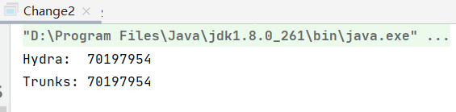

## Java

### Java IO 模型常见面试题总结

面试中经常喜欢问的一个问题，因为通过这个问题，面试官可以顺便了解一下你的操作系统的水平。

IO 模型这块确实挺难理解的，需要太多计算机底层知识。写这篇文章用了挺久，就非常希望能把我所知道的讲出来吧!
希望朋友们能有收货！为了写这篇文章，还翻看了一下《UNIX 网络编程》这本书，太难了，我滴乖乖！心痛~

个人能力有限。如果文章有任何需要补充/完善/修改的地方，欢迎在评论区指出，共同进步！

#### 前言

I/O 一直是很多小伙伴难以理解的一个知识点，这篇文章我会将我所理解的 I/O 讲给你听，希望可以对你有所帮助。

#### I/O

##### 何为 I/O?

I/O（**I**nput/**O**utpu） 即**输入／输出** 。

**我们先从计算机结构的角度来解读一下 I/O。**

根据冯.诺依曼结构，计算机结构分为 5 大部分：运算器、控制器、存储器、输入设备、输出设备。


输入设备（比如键盘）和输出设备（比如显示屏）都属于外部设备。网卡、硬盘这种既可以属于输入设备，也可以属于输出设备。

输入设备向计算机输入数据，输出设备接收计算机输出的数据。

**从计算机结构的视角来看的话， I/O 描述了计算机系统与外部设备之间通信的过程。**

**我们再先从应用程序的角度来解读一下 I/O。**

根据大学里学到的操作系统相关的知识：为了保证操作系统的稳定性和安全性，一个进程的地址空间划分为 用户空间（User space） 和 *
*内核空间（Kernel space ）** 。

像我们平常运行的应用程序都是运行在用户空间，只有内核空间才能进行系统态级别的资源有关的操作，比如如文件管理、进程通信、内存管理等等。也就是说，我们想要进行
IO 操作，一定是要依赖内核空间的能力。

并且，用户空间的程序不能直接访问内核空间。

当想要执行 IO 操作时，由于没有执行这些操作的权限，只能发起系统调用请求操作系统帮忙完成。

因此，用户进程想要执行 IO 操作的话，必须通过 系统调用 来间接访问内核空间

我们在平常开发过程中接触最多的就是 **磁盘 IO（读写文件）** 和 **网络 IO（网络请求和相应）**。

**从应用程序的视角来看的话，我们的应用程序对操作系统的内核发起 IO 调用（系统调用），操作系统负责的内核执行具体的 IO
操作。也就是说，我们的应用程序实际上只是发起了 IO 操作的调用而已，具体 IO 的执行是由操作系统的内核来完成的。**

当应用程序发起 I/O 调用后，会经历两个步骤：

1. 内核等待 I/O 设备准备好数据
2. 内核将数据从内核空间拷贝到用户空间。

##### 有哪些常见的 IO 模型?

UNIX 系统下， IO 模型一共有 5 种： **同步阻塞 I/O、同步非阻塞 I/O、I/O 多路复用、信号驱动 I/O 和异步 I/O**。

这也是我们经常提到的 5 种 IO 模型。

#### Java 中 3 种常见 IO 模型

##### BIO (Blocking I/O)

**BIO 属于同步阻塞 IO 模型 。**

同步阻塞 IO 模型中，应用程序发起 read 调用后，会一直阻塞，直到在内核把数据拷贝到用户空间。


在客户端连接数量不高的情况下，是没问题的。但是，当面对十万甚至百万级连接的时候，传统的 BIO 模型是无能为力的。因此，我们需要一种更高效的
I/O 处理模型来应对更高的并发量。

##### NIO (Non-blocking/New I/O)

Java 中的 NIO 于 Java 1.4 中引入，对应 java.nio 包，提供了 Channel , Selector，Buffer 等抽象。NIO 中的 N 可以理解为
Non-blocking，不单纯是 New。它支持面向缓冲的，基于通道的 I/O 操作方法。 对于高负载、高并发的（网络）应用，应使用 NIO 。

Java 中的 NIO 可以看作是 **I/O 多路复用模型**。也有很多人认为，Java 中的 NIO 属于同步非阻塞 IO 模型。

跟着我的思路往下看看，相信你会得到答案！

我们先来看看 **同步非阻塞 IO 模型**。


同步非阻塞 IO 模型中，应用程序会一直发起 read 调用，等待数据从内核空间拷贝到用户空间的这段时间里，线程依然是阻塞的，直到在内核把数据拷贝到用户空间。

相比于同步阻塞 IO 模型，同步非阻塞 IO 模型确实有了很大改进。通过轮询操作，避免了一直阻塞。

但是，这种 IO 模型同样存在问题：**应用程序不断进行 I/O 系统调用轮询数据是否已经准备好的过程是十分消耗 CPU 资源的**。

这个时候，**I/O 多路复用模型** 就上场了。


IO 多路复用模型中，线程首先发起 select 调用，询问内核数据是否准备就绪，等内核把数据准备好了，用户线程再发起 read 调用。read
调用的过程（数据从内核空间->用户空间）还是阻塞的。

> 目前支持 IO 多路复用的系统调用，有 select，epoll 等等。select 系统调用，是目前几乎在所有的操作系统上都有支持
>
> - select 调用 ：内核提供的系统调用，它支持一次查询多个系统调用的可用状态。几乎所有的操作系统都支持。
> - epoll 调用 ：linux 2.6 内核，属于 select 调用的增强版本，优化了 IO 的执行效率。

**IO 多路复用模型，通过减少无效的系统调用，减少了对 CPU 资源的消耗。**

Java 中的 NIO ，有一个非常重要的**选择器 ( Selector )** 的概念，也可以被称为 **多路复用器**
。通过它，只需要一个线程便可以管理多个客户端连接。当客户端数据到了之后，才会为其服务。


##### AIO (Asynchronous I/O)

AIO 也就是 NIO 2。Java 7 中引入了 NIO 的改进版 NIO 2,它是异步 IO 模型。

异步 IO 是基于事件和回调机制实现的，也就是应用操作之后会直接返回，不会堵塞在那里，当后台处理完成，操作系统会通知相应的线程进行后续的操作。


目前来说 AIO 的应用还不是很广泛。Netty 之前也尝试使用过 AIO，不过又放弃了。这是因为，Netty 使用了 AIO 之后，在 Linux
系统上的性能并没有多少提升。

最后，来一张图，简单总结一下 Java 中的 BIO、NIO、AIO。


#### 参考

- 《深入拆解 Tomcat & Jetty》
- 如何完成一次 IO：https://llc687.top/post/如何完成一次-io/
- 程序员应该这样理解 IO：https://www.jianshu.com/p/fa7bdc4f3de7
- 10 分钟看懂， Java NIO 底层原理：https://www.cnblogs.com/crazymakercircle/p/10225159.html
- IO 模型知多少 | 理论篇：https://www.cnblogs.com/sheng-jie/p/how-much-you-know-about-io-models.html
- 《UNIX 网络编程 卷 1；套接字联网 API 》6.2 节 IO 模型

### Java 数据类型常见面试题总结

这篇文章绝对干货！**文章涉及到的概念经常会被面试官拿来考察求职者的 Java 基础。**

本篇采用大家比较喜欢的面试官问答的形式来展开。

#### 基本数据类型

👨‍💻面试官 ： Java 中有哪 8 种基本数据类型？

🙋 我 ：Java 中有 8 种基本数据类型，分别为：

1. 6 种数字类型 ：byte、short、int、long、float、double
2. 1 种字符类型：char
3. 1 种布尔型：boolean。

👨‍💻面试官 ： 它们的默认值和占用的空间大小知道不？

🙋 我 ：这 8 种基本数据类型的默认值以及所占空间的大小如下：

| 基本类型    | 位数 | 字节 | 默认值     |
|---------|----|----|---------|
| int     | 32 | 4  | 0       |
| short   | 16 | 2  | 0       |
| long    | 64 | 8  | 0L      |
| byte    | 8  | 1  | 0       |
| char    | 16 | 2  | 'u0000' |
| float   | 32 | 4  | 0f      |
| double  | 64 | 8  | 0d      |
| boolean | 1  |    | false   |

另外，对于 boolean，官方文档未明确定义，它依赖于 JVM 厂商的具体实现。逻辑上理解是占用 1 位，但是实际中会考虑计算机高效存储因素。

**注意：**

1. Java 里使用 long 类型的数据一定要在数值后面加上 L，否则将作为整型解析：
2. char a = 'h'char :单引号，String a = "hello" :双引号

#### 包装类型

👨‍💻面试官 ： 说说这 8 种基本数据类型对应的包装类型。

🙋 我 ：这八种基本类型都有对应的包装类分别为：Byte、Short、Integer、Long、Float、Double、Character、Boolean

👨‍💻面试官 ：那基本类型和包装类型有啥区别不？

🙋 我 ：包装类型不赋值就是 Null ，而基本类型有默认值且不是 Null。

另外，这个问题建议还可以先从 JVM 层面来分析。

基本数据类型直接存放在 Java 虚拟机栈中的局部变量表中，而包装类型属于对象类型，我们知道对象实例都存在于堆中。相比于对象类型，
基本数据类型占用的空间非常小。

> 《深入理解 Java 虚拟机》 ：局部变量表主要存放了编译期可知的基本数据类型（boolean、byte、char、short、int、float、long、double）、对象引用（reference
> 类型，它不同于对象本身，可能是一个指向对象起始地址的引用指针，也可能是指向一个代表对象的句柄或其他与此对象相关的位置）。

##### 包装类型的常量池技术

👨‍💻面试官 ： 包装类型的常量池技术了解么？

🙋 我 ： Java 基本类型的包装类的大部分都实现了常量池技术。

Byte,Short,Integer,Long 这 4 种包装类默认创建了数值 **[-128，127]** 的相应类型的缓存数据，Character 创建了数值在[0,127]
范围的缓存数据，Boolean 直接返回 True Or False。

**Integer 缓存源码：**

```java
/**
*此方法将始终缓存-128 到 127（包括端点）范围内的值，并可以缓存此范围之外的其他值。
*/
public static Integer valueOf(int i) {
    if (i >= IntegerCache.low && i <= IntegerCache.high)
      return IntegerCache.cache[i + (-IntegerCache.low)];
    return new Integer(i);
}
private static class IntegerCache {
    static final int low = -128;
    static final int high;
    static final Integer cache[];
}
```

**Character 缓存源码:**

```java
public static Character valueOf(char c) {
    if (c <= 127) { // must cache
      return CharacterCache.cache[(int)c];
    }
    return new Character(c);
}

private static class CharacterCache {
    private CharacterCache(){}

    static final Character cache[] = new Character[127 + 1];
    static {
        for (int i = 0; i < cache.length; i++)
            cache[i] = new Character((char)i);
    }
}
```

**Boolean 缓存源码：**

```java
public static Boolean valueOf(boolean b) {
    return (b ? TRUE : FALSE);
}
```

如果超出对应范围仍然会去创建新的对象，缓存的范围区间的大小只是在性能和资源之间的权衡。

两种浮点数类型的包装类 Float,Double 并没有实现常量池技术。

```java
Integer i1 = 33;
Integer i2 = 33;
System.out.println(i1 == i2);// 输出 true
Float i11 = 333f;
Float i22 = 333f;
System.out.println(i11 == i22);// 输出 false
Double i3 = 1.2;
Double i4 = 1.2;
System.out.println(i3 == i4);// 输出 false
```

下面我们来看一下问题。下面的代码的输出结果是 true 还是 flase 呢？

```java
Integer i1 = 40;
Integer i2 = new Integer(40);
System.out.println(i1==i2);
```

Integer i1=40 这一行代码会发生装箱，也就是说这行代码等价于 Integer i1=Integer.valueOf(40) 。因此，i1 直接使用的是常量池中的对象。而Integer
i1 = new Integer(40) 会直接创建新的对象。

因此，答案是 false 。你答对了吗？

记住：**所有整型包装类对象之间值的比较，全部使用 equals 方法比较。**


##### 为什么要有包装类型？

👨‍💻面试官 ： 为什么要有包装类型？

🙋 我 ：

Java 本身就是一门 OOP（面向对象编程）语言，对象可以说是 Java 的灵魂。

除了定义一些常量和局部变量之外，我们在其他地方比如方法参数、对象属性中很少会使用基本类型来定义变量。

为什么呢？

我举个例子，假如你有一个对象中的属性使用了 基本类型，那这个属性就必然存在默认值了。这个逻辑不正确的！因为很多业务场景下，对象的某些属性没有赋值，我就希望它的值为
null。你给我默认赋个值，不是帮倒忙么？

另外，像泛型参数不能是基本类型。因为基本类型不是 Object 子类，应该用基本类型对应的包装类型代替。我们直接拿 JDK 中线程的代码举例。

Java 中的集合在定义类型的时候不能使用基本类型的。比如：

```java
public class HashMap<K,V> extends AbstractMap<K,V>
    implements Map<K,V>, Cloneable, Serializable {
}

Map<Integer, Set<String>> map = new HashMap<>();
```

#### 自动拆装箱

##### 什么是自动拆装箱？原理？

👨‍💻面试官 ： 什么是自动拆装箱？原理了解么？

🙋 我 ：

基本类型和包装类型之间的互转。举例：

```java
Integer i = 10;  //装箱
int n = i;   //拆箱
```

上面这两行代码对应的字节码为：

```java
   L1
    LINENUMBER 8 L1
    ALOAD 0
    BIPUSH 10
    INVOKESTATIC java/lang/Integer.valueOf (I)Ljava/lang/Integer;
    PUTFIELD AutoBoxTest.i : Ljava/lang/Integer;
   L2
    LINENUMBER 9 L2
    ALOAD 0
    ALOAD 0
    GETFIELD AutoBoxTest.i : Ljava/lang/Integer;
    INVOKEVIRTUAL java/lang/Integer.intValue ()I
    PUTFIELD AutoBoxTest.n : I
    RETURN
```

从字节码中，我们发现装箱其实就是调用了 包装类的valueOf()方法，拆箱其实就是调用了 xxxValue()方法。

因此，

- Integer i = 10 等价于 Integer i = Integer.valueOf(10)
- int n = i 等价于 int n = i.intValue();

##### 自动拆箱引发的 NPE 问题

👨‍💻面试官 ： 自动拆箱可能会引发 NPE 问题，遇到过类似的场景么？

🙋 我 ：

###### 案例 1

在《阿里巴巴开发手册》上就有这样一条规定。


我们从上图可以看到，有一条是这样说的：“数据库的查询结果可能是 null，因为自动拆箱，用基本数据类型接收有 NPE 风险”。

我们来模拟一个实际的案例：

```java
public class AutoBoxTest {
    @Test
    void  should_Throw_NullPointerException(){
        long id = getNum();
    }
    public Long getNum(){
        return null;
    }
}
```

运行代码之后，果然出现了 **NPE** 的问题。

**为什么会这样呢?** 我们对 AutoBoxTest.class 进行反编译查看其字节码（我更推荐使用 IDEA 插件 jclasslib 来查看类的字节码）。

```bash
javap -c AutoBoxTest.class
```

反编译后得到的 should_Throw_NullPointerException() 方法的字节码如下：

```java
0 aload_0
1 invokevirtual #2 <AutoBoxTest.getNum>
4 invokevirtual #3 <java/lang/Long.longValue>
7 lstore_1
8 return
```

我们可以发现自动拆箱 Long -> long 的过程，不过是调用了 longValue() 方法罢了！

```java
public long longValue() {
   return value;
}
```

也就是说下面两行的代码实际是等价的:

```java
long id = getNum();
long id = getNum().longValue();
```

因为，getNum()返回的值为 null ，一个 null 值调用方法，当然会有 NPE 的问题了。

###### 案例 2

通过上面的分析之后，我来考了一个不论是平时开发还是面试中都经常会碰到的一个问题：“三目运算符使用不当会导致诡异的 NPE 异常”。

请你回答下面的代码会有 NPE 问题出现吗？如果有 NPE 问题出现的话，原因是什么呢？你会怎么分析呢？

```java
public class Main {
    public static void main(String[] args) {
        Integer i = null;
        Boolean flag = false;
        System.out.println(flag ? 0 : i);
    }
}
```

答案是会有 NPE 问题出现的。

我们还是通过查看其字节码来搞懂背后的原理（这里借助了 IDEA 插件 jclasslib 来查看类字节码）。


从字节码中可以看出，22 行的位置发生了 拆箱操作 。

详细解释下就是：flag ? 0 : i 这行代码中，0 是基本数据类型 int，返回数据的时候 i 会被强制拆箱成 int 类型，由于 i 的值是
null，因此就抛出了 NPE 异常。

```java
Integer i = null;
Boolean flag = false;
System.out.println(flag ? 0 : i);
```

如果，我们把代码中 flag 变量的值修改为 true 的话，就不会存在 NPE 问题了，因为会直接返回 0，不会进行拆箱操作。

我们在实际项目中应该避免这样的写法，正确 ✅ 修改之后的代码如下：

```java
Integer i = null;
Boolean flag = false;
System.out.println(flag ? new Integer(0) : i);// 两者类型一致就不会有拆箱导致的 NPE 问题了
```

这个问题也在 《阿里巴巴开发手册》中 被提到过。


### 泛型&通配符常见面试题总结

#### 泛型

##### 什么是泛型？有什么作用？

Java 泛型（Generics） 是 JDK 5 中引入的一个新特性。使用泛型参数，可以增强代码的可读性以及稳定性。

编译器可以对泛型参数进行检测，并且通过泛型参数可以指定传入的对象类型。比如 `ArrayList<Persion> persons = new ArrayList<Persion>() `
这行代码就指明了该 ArrayList 对象只能传入 Persion 对象，如果传入其他类型的对象就会报错。

```java
ArrayList<E> extends AbstractList<E>
```

并且，原生 List 返回类型是 Object ，需要手动转换类型才能使用，使用泛型后编译器自动转换。

##### 泛型的使用方式有哪几种？

泛型一般有三种使用方式:**泛型类、泛型接口、泛型方法。**

**1.泛型类：**

```java
//此处T可以随便写为任意标识，常见的如T、E、K、V等形式的参数常用于表示泛型
//在实例化泛型类时，必须指定T的具体类型
public class Generic<T>{

    private T key;

    public Generic(T key) {
        this.key = key;
    }

    public T getKey(){
        return key;
    }
}
```

如何实例化泛型类：

```java
Generic<Integer> genericInteger = new Generic<Integer>(123456);
```

**2.泛型接口 ：**

```java
public interface Generator<T> {
    public T method();
}
```

实现泛型接口，不指定类型：

```java
class GeneratorImpl<T> implements Generator<T>{
    @Override
    public T method() {
        return null;
    }
}
```

实现泛型接口，指定类型：

```java
class GeneratorImpl<T> implements Generator<String>{
    @Override
    public String method() {
        return "hello";
    }
}
```

**3.泛型方法 ：**

```java
   public static < E > void printArray( E[] inputArray )
   {
         for ( E element : inputArray ){
            System.out.printf( "%s ", element );
         }
         System.out.println();
    }
```

使用：

```java
// 创建不同类型数组： Integer, Double 和 Character
Integer[] intArray = { 1, 2, 3 };
String[] stringArray = { "Hello", "World" };
printArray( intArray  );
printArray( stringArray  );
```

##### 项目中哪里用到了泛型？

- 自定义接口通用返回结果 CommonResult<T> 通过参数 T 可根据具体的返回类型动态指定结果的数据类型
- 定义 Excel 处理类 ExcelUtil<T> 用于动态指定 Excel 导出的数据类型
- 构建集合工具类（参考 Collections 中的 sort, binarySearch 方法）。
- ......

##### 什么是泛型擦除机制？为什么要擦除?

**Java 的泛型是伪泛型，这是因为 Java 在编译期间，所有的泛型信息都会被擦掉，这也就是通常所说类型擦除 。**

编译器会在编译期间会动态地将泛型 T 擦除为 Object 或将 T extends xxx 擦除为其限定类型 xxx 。

因此，泛型本质上其实还是编译器的行为，为了保证引入泛型机制但不创建新的类型，减少虚拟机的运行开销，编译器通过擦除将泛型类转化为一般类。

这里说的可能有点抽象，我举个例子：

```java
List<Integer> list = new ArrayList<>();

list.add(12);
//1.编译期间直接添加会报错
list.add("a");
Class<? extends List> clazz = list.getClass();
Method add = clazz.getDeclaredMethod("add", Object.class);
//2.运行期间通过反射添加，是可以的
add.invoke(list, "kl");

System.out.println(list)
```

再来举一个例子 : 由于泛型擦除的问题，下面的方法重载会报错。

```java
public void print(List<String> list)  { }
public void print(List<Integer> list) { }
```


原因也很简单，泛型擦除之后，List<String> 与 List<Integer> 在编译以后都变成了 List 。

既然编译器要把泛型擦除，那为什么还要用泛型呢？用 Object 代替不行吗？

这个问题其实在变相考察泛型的作用：

- 使用泛型可在编译期间进行类型检测。
- 使用 Object 类型需要手动添加强制类型转换，降低代码可读性，提高出错概率。
- 泛型可以使用自限定类型如 T extends Comparable 。

##### 什么是桥方法？

桥方法(Bridge Method) 用于继承泛型类时保证多态。

```java
class Node<T> {
    public T data;
    public Node(T data) { this.data = data; }
    public void setData(T data) {
        System.out.println("Node.setData");
        this.data = data;
    }
}

class MyNode extends Node<Integer> {
    public MyNode(Integer data) { super(data); }

  	// Node<T> 泛型擦除后为 setData(Object data)，而子类 MyNode 中并没有重写该方法，所以编译器会加入该桥方法保证多态
   	public void setData(Object data) {
        setData((Integer) data);
    }

    public void setData(Integer data) {
        System.out.println("MyNode.setData");
        super.setData(data);
    }
}
```

⚠️注意 ：桥方法为编译器自动生成，非手写。

泛型有哪些限制？为什么？

泛型的限制一般是由泛型擦除机制导致的。擦除为 Object 后无法进行类型判断

- 只能声明不能实例化 T 类型变量。
- 泛型参数不能是基本类型。因为基本类型不是 Object 子类，应该用基本类型对应的引用类型代替。
- 不能实例化泛型参数的数组。擦除后为 Object 后无法进行类型判断。
- 不能实例化泛型数组。
- 泛型无法使用 Instance of 和 getClass() 进行类型判断。
- 不能实现两个不同泛型参数的同一接口，擦除后多个父类的桥方法将冲突
- 不能使用 static 修饰泛型变量
- ......

##### 以下代码是否能编译，为什么？

```java
public final class Algorithm {
    public static <T> T max(T x, T y) {
        return x > y ? x : y;
    }
}
```

无法编译，因为 x 和 y 都会被擦除为` Object` 类型，` Object `无法使用` > `进行比较

```java
public class Singleton<T> {

    public static T getInstance() {
        if (instance == null)
            instance = new Singleton<T>();

        return instance;
    }

    private static T instance = null;
}
```

无法编译，因为不能使用 `static `修饰泛型` T` 。

#### 通配符

##### 什么是通配符？有什么作用？

泛型类型是固定的，某些场景下使用起来不太灵活，于是，通配符就来了！通配符可以允许类型参数变化，用来解决泛型无法协变的问题。

举个例子：

```java
// 限制类型为 Person 的子类
<? extends Person>
// 限制类型为 Manager 的父类
<? super Manager>
```

##### 通配符 ？和常用的泛型 T 之间有什么区别？

- T 可以用于声明变量或常量而 ? 不行。
- T 一般用于声明泛型类或方法，通配符 ? 一般用于泛型方法的调用代码和形参。
- T 在编译期会被擦除为限定类型或 Object，通配符用于捕获具体类型。

##### 什么是无界通配符？

无界通配符可以接收任何泛型类型数据，用于实现不依赖于具体类型参数的简单方法，可以捕获参数类型并交由泛型方法进行处理。

```java
void testMethod(Person<?> p) {
  // 泛型方法自行处理
}
```

List<?> 和 List 有区别吗？ 当然有！

- List<?> list 表示 list 是持有某种特定类型的 List，但是不知道具体是哪种类型。因此，我们添加元素进去的时候会报错。
- List list 表示 list 是持有的元素的类型是 Object，因此可以添加任何类型的对象，只不过编译器会有警告信息。

```java
List<?> list = new ArrayList<>();
list.add("sss");//报错
List list2 = new ArrayList<>();
list2.add("sss");//警告信息
```

##### 什么是上边界通配符？什么是下边界通配符？

在使用泛型的时候，我们还可以为传入的泛型类型实参进行上下边界的限制，如：**类型实参只准传入某种类型的父类或某种类型的子类。**

**上边界通配符 extends** 可以实现泛型的向上转型即传入的类型实参必须是指定类型的子类型。

举个例子：

```java
// 限制必须是 Person 类的子类
<? extends Person>
```

类型边界可以设置多个，还可以对 T 类型进行限制。

```java
<T extends T1 & T2>
<T extends XXX>
```

**下边界通配符 super** 与上边界通配符 extends刚好相反，它可以实现泛型的向下转型即传入的类型实参必须是指定类型的父类型。

举个例子：

```java
//  限制必须是 Employee 类的父类
List<? super Employee>
```

**`? extends xxx `和` ? super xxx `有什么区别?**

两者接收参数的范围不同。并且，使用 ? extends xxx 声明的泛型参数只能调用 get() 方法返回 xxx 类型，调用 set() 报错。使用 ?
super xxx 声明的泛型参数只能调用 set() 方法接收 xxx 类型，调用 get() 报错。

**`T extends xxx` 和` ? extends xxx `又有什么区别？**

T extends xxx 用于定义泛型类和方法，擦除后为 xxx 类型， ? extends xxx 用于声明方法形参，接收 xxx 和其子类型。

**`Class<?>` 和` Class `的区别？**

直接使用 Class 的话会有一个类型警告，使用 Class<?> 则没有，因为 Class 是一个泛型类，接收原生类型会产生警告

##### 以下代码是否能编译，为什么？

```java
class Shape { /* ... */ }
class Circle extends Shape { /* ... */ }
class Rectangle extends Shape { /* ... */ }

class Node<T> { /* ... */ }

Node<Circle> nc = new Node<>();
Node<Shape>  ns = nc;
```

不能，因为`Node<Circle> `不是 `Node<Shape>` 的子类

```java
class Shape { /* ... */ }
class Circle extends Shape { /* ... */ }
class Rectangle extends Shape { /* ... */ }

class Node<T> { /* ... */ }
class ChildNode<T> extends Node<T>{

}
ChildNode<Circle> nc = new ChildNode<>();
Node<Circle>  ns = nc;
```

可以编译，`ChildNode<Circle>` 是 `Node<Circle>` 的子类

```java
public static void print(List<? extends Number> list) {
    for (Number n : list)
        System.out.print(n + " ");
    System.out.println();
}
```

可以编译，`List<? extends Number> `可以往外取元素，但是无法调用` add() `添加元素。

#### 参考

- Java 官方文档 ： https://docs.oracle.com/javase/tutorial/java/generics/index.html
- Java 基础 一文搞懂泛型：https://www.cnblogs.com/XiiX/p/14719568.html

### String 类常见面试题总结

> 这篇文章是我的一位好朋友 Hydra（公众号码农参上号主）写的原创干货，经他同意，我将其整理到了 《Java 面试指北》的 Java 部分。

String 字符串是我们日常工作中常用的一个类，在面试中也是高频考点，这里精心总结了一波常见但也有点烧脑的 String 面试题，一共 5
道题，难度从简到难，来一起来看看你能做对几道吧。

**说明** ：本文基于**jdk8**版本中的 String 进行讨论，文章例子中的代码运行结果基于`Java 1.8.0_261-b12`

#### 第 1 题，奇怪的 nullnull

下面这段代码最终会打印什么？

```java
public class Test1 {
    private static String s1;
    private static String s2;

    public static void main(String[] args) {
        String s= s1+s2;
        System.out.println(s);
    }
}
```

运行之后，你会发现打印了`nullnull`：

在分析这个结果之前，先扯点别的，说一下为空`null`的字符串的打印原理。查看一下`PrintStream`类的源码，`print`方法在打印`null`
前进行了处理：

```java
public void print(String s) {
    if (s == null) {
        s = "null";
    }
    write(s);
}
```

因此，一个为null的字符串就可以被打印在我们的控制台上了。

再回头看上面这道题，`s1`和`s2`没有经过初始化所以都是空对象null，需要注意这里不是字符串的"null"，打印结果的产生我们可以看一下字节码文件：


编译器会对`String`字符串相加的操作进行优化，会把这一过程转化为`StringBuilder`的`append`方法。那么，让我们再看看`append`
方法的源码：

```java
public AbstractStringBuilder append(String str) {
    if (str == null)
        return appendNull();
    	//...
}
```

如果`append`方法的参数字符串为`null`，那么这里会调用其父类`AbstractStringBuilder`的`appendNull`方法：

```java
private AbstractStringBuilder appendNull() {
    int c = count;
    ensureCapacityInternal(c + 4);
    final char[] value = this.value;
    value[c++] = 'n';
    value[c++] = 'u';
    value[c++] = 'l';
    value[c++] = 'l';
    count = c;
    return this;
}
```

这里的`value`就是底层用来存储字符的`char`类型数组，到这里我们就可以明白了，其实`StringBuilder`也对`null`
的字符串进行了特殊处理，在`append`的过程中如果碰到是`null`的字符串，那么就会以`"null"`
的形式被添加进字符数组，这也就导致了两个为空`null`的字符串相加后会打印为`"nullnull"`。

#### 第 2 题，改变 String 的值

如何改变一个 String 字符串的值，这道题可能看上去有点太简单了，像下面这样直接赋值不就可以了吗？

```java
String s="Hydra";
s="Trunks";
```

恭喜你，成功掉进了坑里！在回答这道题之前，我们需要知道 String 是**不可变**的，打开 String 的源码在开头就可以看到：

```java
private final char value[];
```

可以看到，`String `的本质其实是一个`char`
类型的数组，然后我们再看两个关键字。先看final，我们知道final在修饰引用数据类型时，就像这里的数组时，能够保证指向该数组地址的引用不能修改，但是数组本身内的值可以被修改。

是不是有点晕，没关系，我们看一个例子：

```java
final char[] one={'a','b','c'};
char[] two={'d','e','f'};
one=two;
```

如果你这样写，那么编译器是会报错提示`Cannot assign a value to final variable 'one'`
，说明被final修饰的数组的引用地址是不可改变的。但是下面这段代码却能够正常的运行：

```java
final char[] one={'a','b','c'};
one[1]='z';
```

也就是说，即使被final修饰，但是我直接操作数组里的元素还是可以的，所以这里还加了另一个关键字private，防止从外部进行修改。此外，String
类本身也被添加了final关键字修饰，防止被继承后对属性进行修改。

到这里，我们就可以理解为什么 String 是不可变的了，那么在上面的代码进行二次赋值的过程中，发生了什么呢？答案很简单，前面的变量s只是一个
String 对象的引用，这里的重新赋值时将变量s指向了新的对象。


上面白话了一大顿，其实是我们可以通过比较`hashCode`
的方式来看一下引用指向的对象是否发生了改变，修改一下上面的代码，打印字符串的`hashCode`：

```java
public static void main(String[] args) {
    String s="Hydra";
    System.out.println(s+":  "+s.hashCode());
    s="Trunks";
    System.out.println(s+": "+s.hashCode());
}
```

查看结果，发生了改变，证明指向的对象发生了改变：


那么，回到上面的问题，如果我想要改变一个 String 的值，而又不想把它重新指向其他对象的话，应该怎么办呢？答案是利用反射修改char数组的值：

```java
public static void main(String[] args) throws NoSuchFieldException, IllegalAccessException {
    String s="Hydra";
    System.out.println(s+":  "+s.hashCode());

    Field field = String.class.getDeclaredField("value");
    field.setAccessible(true);
    field.set(s,new char[]{'T','r','u','n','k','s'});
    System.out.println(s+": "+s.hashCode());
}
```

再对比一下`hashCode`，修改后和之前一样，对象没有发生任何变化：



最后，再啰嗦说一点题外话，这里看的是`jdk8`中` String `的源码，到这为止还是使用的`char`类型数组来存储字符，但是在`jdk9`
中这个`char`数组已经被替换成了`byte`数组，能够使` String `对象占用的内存减少。

#### 第 3 题，创建了几个对象？

相信不少小伙伴在面试中都遇到过这道经典面试题，下面这段代码中到底创建了几个对象？

```java
String s = new String("Hydra");
```

其实真正想要回答好这个问题，要铺垫的知识点还真是不少。首先，我们需要了解 3 个关于常量池的概念，下面还是基于jdk8版本进行说明：

- class 文件常量池：在 class 文件中保存了一份常量池（Constant Pool），主要存储编译时确定的数据，包括代码中的字面量(literal)
  和符号引用
- 运行时常量池：位于方法区中，全局共享，class 文件常量池中的内容会在类加载后存放到方法区的运行时常量池中。除此之外，在运行期间可以将新的变量放入运行时常量池中，相对
  class 文件常量池而言运行时常量池更具备动态性
- 字符串常量池：位于堆中，全局共享，这里可以先粗略的认为它存储的是 String 对象的直接引用，而不是直接存放的对象，具体的实例对象是在堆中存放

可以用一张图来描述它们各自所处的位置：


接下来，我们来细说一下**字符串常量池**的结构，其实在 Hotspot JVM
中，字符串常量池StringTable的本质是一张HashTable，那么当我们说将一个字符串放入字符串常量池的时候，实际上放进去的是什么呢？

以字面量的方式创建 String 对象为例，字符串常量池以及堆栈的结构如下图所示（忽略了 jvm 中的各种OopDesc实例）：


实际上字符串常量池`HashTable`采用的是**数组**加**链表**的结构，链表中的节点是一个个的`HashTableEntry`，而`HashTableEntry`
中的`value`则存储了堆上` String `对象的**引用**。

那么，下一个问题来了，这个字符串对象的引用是**什么时候**被放到字符串常量池中的？具体可为两种情况：

- 使用字面量声明 String 对象时，也就是被双引号包围的字符串，在堆上创建对象，并驻留到字符串常量池中（注意这个用词）
- 调用intern()方法，当字符串常量池没有相等的字符串时，会保存该字符串的引用

**注意！**我们在上面用到了一个词**驻留**
，这里对它进行一下规范。当我们说驻留一个字符串到字符串常量池时，指的是创建`HashTableEntry`，再使它的`value`指向堆上的 String
实例，并把`HashTableEntry`放入字符串常量池，而不是直接把 String 对象放入字符串常量池中。简单来说，可以理解为将 String
对象的引用保存在字符串常量池中。

我们把`intern()`方法放在后面细说，先主要看第一种情况，这里直接整理引用 R 大的结论：

> 在类加载阶段，JVM 会在堆中创建对应这些 class 文件常量池中的字符串对象实例，并在字符串常量池中驻留其引用。
>
> 这一过程具体是在 resolve 阶段(个人理解就是 resolution 解析阶段)执行，但是并不是立即就创建对象并驻留了引用，因为在 JVM
> 规范里指明了 resolve 阶段可以是 lazy 的。CONSTANT_String 会在第一次引用该项的 ldc 指令被第一次执行到的时候才会 resolve。
>
> 就 HotSpot VM 的实现来说，加载类时字符串字面量会进入到运行时常量池，不会进入全局的字符串常量池，即在 StringTable
> 中并没有相应的引用，在堆中也没有对应的对象产生。

这里大家可以暂时先记住这个结论，在后面还会用到。

在弄清楚上面几个概念后，我们再回过头来，先看看用**字面量**声明 String 的方式，代码如下：

```java
public static void main(String[] args) {
    String s = "Hydra";
}
```

反编译生成的字节码文件：

```shell
public static void main(java-1.lang.String[]);
  descriptor: ([Ljava/lang/String;)V
  flags: ACC_PUBLIC, ACC_STATIC
  Code:
    stack=1, locals=2, args_size=1
       0: ldc           #2                  // String Hydra
       2: astore_1
       3: return
```

解释一下上面的字节码指令：

- 0: ldc，查找后面索引为#2对应的项，#2表示常量在常量池中的位置。在这个过程中，会触发前面提到的lazy resolve，在 resolve
  过程如果发现StringTable已经有了内容匹配的 String 引用，则直接返回这个引用，反之如果StringTable里没有内容匹配的 String
  对象的引用，则会在堆里创建一个对应内容的 String 对象，然后在StringTable驻留这个对象引用，并返回这个引用，之后再压入操作数栈中
- 2: astore_1，弹出栈顶元素，并将栈顶引用类型值保存到局部变量 1 中，也就是保存到变量s中
- 3: return，执行void函数返回

可以看到，在这种模式下，只有堆中创建了一个`"Hydra"`对象，在字符串常量池中驻留了它的引用。并且，如果再给字符串`s2、s3`
也用字面量的形式赋值为`"Hydra"`，它们用的都是堆中的唯一这一个对象。

好了，再看一下以构造方法的形式创建字符串的方式：

```java
public static void main(String[] args) {
    String s = new String("Hydra");
}
```

同样反编译这段代码的字节码文件：

```shell
public static void main(java-1.lang.String[]);
  descriptor: ([Ljava/lang/String;)V
  flags: ACC_PUBLIC, ACC_STATIC
  Code:
    stack=3, locals=2, args_size=1
       0: new           #2                  // class java-1/lang/String
       3: dup
       4: ldc           #3                  // String Hydra
       6: invokespecial #4                  // Method java-1/lang/String."<init>":(Ljava/lang/String;)V
       9: astore_1
      10: return
```

看一下和之前不同的字节码指令部分：

- 0: new，在堆上创建一个 String 对象，并将它的引用压入操作数栈，注意这时的对象还只是一个空壳，并没有调用类的构造方法进行初始化
- 3:
  dup，复制栈顶元素，也就是复制了上面的对象引用，并将复制后的对象引用压入栈顶。这里之所以要进行复制，是因为之后要执行的构造方法会从操作数栈弹出需要的参数和这个对象引用本身（这个引用起到的作用就是构造方法中的this指针），如果不进行复制，在弹出后会无法得到初始化后的对象引用
- 4: ldc，在堆上创建字符串对象，驻留到字符串常量池，并将字符串的引用压入操作数栈
- 6: invokespecial，执行 String 的构造方法，这一步执行完成后得到一个完整对象

到这里，我们可以看到一共创建了**两个**String 对象，并且两个都是在堆上创建的，且字面量方式创建的 String
对象的引用被驻留到了字符串常量池中。而栈里的s只是一个变量，并不是实际意义上的对象，我们不把它包括在内。

其实想要验证这个结论也很简单，可以使用 idea 中强大的 debug 功能来直观的对比一下对象数量的变化，先看字面量创建 String 方式：


这个对象数量的计数器是在 debug 时，点击下方右侧Memory的Load classes弹出的。对比语句执行前后可以看到，只创建了一个 String
对象，以及一个 char 数组对象，也就是 String 对象中的value。

再看看构造方法创建 String 的方式：


可以看到，创建了两个 String 对象，一个 char 数组对象，也说明了两个 String 中的value指向了同一个 char
数组对象，符合我们上面从字节码指令角度解释的结果。

最后再看一下下面的这种情况，当字符串常量池已经驻留过某个字符串引用，再使用构造方法创建 String 时，创建了几个对象？

```java
public static void main(String[] args) {
	String s = "Hydra";
	String s2 = new String("Hydra");
}
```

答案是**只创建一个对象**，对于这种重复字面量的字符串，看一下反编译后的字节码指令：

```shell
Code:
  stack=3, locals=3, args_size=1
     0: ldc           #2                  // String Hydra
     2: astore_1
     3: new           #3                  // class java-1/lang/String
     6: dup
     7: ldc           #2                  // String Hydra
     9: invokespecial #4                  // Method java-1/lang/String."<init>":(Ljava/lang/String;)V
    12: astore_2
    13: return
```

可以看到两次执行`ldc`指令时后面索引相同，而`ldc`判断是否需要创建新的 String
实例的依据是根据在第一次执行这条指令时，`StringTable`是否已经保存了一个对应内容的 String 实例的引用。所以在第一次执行`ldc`
时会创建 String 实例，而在第二次`ldc`就会直接返回而不需要再创建实例了。

#### 第 4 题，烧脑的 intern

上面我们在研究字符串对象的引用如何驻留到字符串常量池中时，还留下了调用intern方法的方式，下面我们来具体分析。

从字面上理解intern这个单词，作为动词时它有**禁闭、关押**的意思，通过前面的介绍，与其说是将字符串关押到字符串常量池StringTable中，可能将它理解为
**缓存它的引用**会更加贴切。

String 的intern()是一个本地方法，可以强制将 String 驻留进入字符串常量池，可以分为两种情况：

- 如果字符串常量池中已经驻留了一个等于此 String 对象内容的字符串引用，则返回此字符串在常量池中的引用
- 否则，在常量池中创建一个引用指向这个 String 对象，然后返回常量池中的这个引用

好了，我们下面看一下这段代码，它的运行结果应该是什么？

```java
public static void main(String[] args) {
    String s1 = new String("Hydra");
    String s2 = s1.intern();
    System.out.println(s1 == s2);
    System.out.println(s1 == "Hydra");
    System.out.println(s2 == "Hydra");
}
```

输出打印：

```properties
false
false
true
```

用一张图来描述它们的关系，就很容易明白了：


其实有了第三题的基础，了解这个结构已经很简单了：

- 在创建s1的时候，其实堆里已经创建了两个字符串对象StringObject1和StringObject2，并且在字符串常量池中驻留了StringObject2
- 当执行s1.intern()方法时，字符串常量池中已经存在内容等于"Hydra"的字符串StringObject2，直接返回这个引用并赋值给s2
- s1和s2指向的是两个不同的 String 对象，因此返回 fasle
- s2指向的就是驻留在字符串常量池的StringObject2，因此s2=="Hydra"为 true，而s1指向的不是常量池中的对象引用所以返回 false

上面是常量池中已存在内容相等的字符串驻留的情况，下面再看看常量池中不存在的情况，看下面的例子：

```java
public static void main(String[] args) {
    String s1 = new String("Hy") + new String("dra");
    s1.intern();
    String s2 = "Hydra";
    System.out.println(s1 == s2);
}
```

执行结果：

```properties
true
```

简单分析一下这个过程，第一步会在堆上创建`"Hy"`和`"dra"`的字符串对象，并驻留到字符串常量池中。

接下来，完成字符串的拼接操作，前面我们说过，实际上 jvm 会把拼接优化成`StringBuilder`的`append`方法，并最终调用`toString`
方法返回一个 String 对象。在完成字符串的拼接后，字符串常量池中并没有驻留一个内容等于`"Hydra"`的字符串。


所以，执行`s1.intern()`时，会在字符串常量池创建一个引用，指向前面`StringBuilder`创建的那个字符串，也就是变量`s1`
所指向的字符串对象。在《深入理解 Java 虚拟机》这本书中，作者对这进行了解释，因为从 jdk7
开始，字符串常量池就已经移到了堆中，那么这里就只需要在字符串常量池中记录一下首次出现的实例引用即可。


最后，当执行`String s2 = "Hydra"`时，发现字符串常量池中已经驻留这个字符串，直接返回对象的引用，因此`s1`和`s2`指向的是相同的对象。


#### 第 5 题，还是创建了几个对象？

解决了前面数 String 对象个数的问题，那么我们接着加点难度，看看下面这段代码，创建了几个对象？

```java
String s="a"+"b"+"c";
```

先揭晓答案，只创建了一个对象！ 可以直观的对比一下源代码和反编译后的字节码文件：


如果使用前面提到过的 debug 小技巧，也可以直观的看到语句执行完后，只增加了一个 String 对象，以及一个 char
数组对象。并且这个字符串就是驻留在字符串常量池中的那一个，如果后面再使用字面量"abc"的方式声明一个字符串，指向的仍是这一个，堆中
String 对象的数量不会发生变化。

至于为什么源代码中字符串拼接的操作，在编译完成后会消失，直接呈现为一个拼接后的完整字符串，是因为在编译期间，应用了编译器优化中一种被称为
**常量折叠**(Constant Folding)的技术。

> 常量折叠会将**编译期常量**的加减乘除的运算过程在编译过程中折叠。编译器通过语法分析，会将常量表达式计算求值，并用求出的值来替换表达式，而不必等到运行期间再进行运算处理，从而在运行期间节省处理器资源。

而上边提到的编译期常量的特点就是它的值在编译期就可以确定，并且需要完整满足下面的要求，才可能是一个编译期常量：

- 被声明为final
- 基本类型或者字符串类型
- 声明时就已经初始化
- 使用**常量表达式**进行初始化

下面我们通过几段代码加深对它的理解：

```java
public static void main(String[] args) {
    final String h1 = "hello";
    String h2 = "hello";
    String s1 = h1 + "Hydra";
    String s2 = h2 + "Hydra";
    System.out.println((s1 == "helloHydra"));
    System.out.println((s2 == "helloHydra"));
}
```

执行结果：

```properties
true
false
```

代码中字符串`h1`和`h2`都使用常量赋值，区别在于是否使用了`final`进行修饰，对比编译后的代码，`s1`进行了折叠而`s2`
没有，可以印证上面的理论，`final`修饰的字符串变量才有可能是编译期常量。


再看一段代码，执行下面的程序，结果会返回什么呢？

```java
public static void main(String[] args) {
    String h ="hello";
    final String h2 = h;
    String s = h2 + "Hydra";
    System.out.println(s=="helloHydra");
}
```

答案是`false`，因为虽然这里字符串h2被final修饰，但是初始化时没有使用常量表达式，因此它也不是编译期常量。那么，有的小伙伴就要问了，到底什么才是常量表达式呢？

在Oracle官网的文档中，列举了很多种情况，下面对常见的情况进行列举（除了下面这些之外官方文档上还列举了不少情况，如果有兴趣的话，可以自己查看）：

- 基本类型和 String 类型的字面量

- 基本类型和 String 类型的强制类型转换
- 使用+或-或!等一元运算符（不包括++和--）进行计算
- 使用加减运算符+、-，乘除运算符*、 / 、% 进行计算
- 使用移位运算符 >>、 <<、 >>>进行位移操作
- ……

至于我们从文章一开始就提到的字面量（literals），是用于表达源代码中一个固定值的表示法，在 Java
中创建一个对象时需要使用new关键字，但是给一个基本类型变量赋值时不需要使用new关键字，这种方式就可以被称为字面量。Java
中字面量主要包括了以下类型的字面量：

```java
//整数型字面量：
long l=1L;
int i=1;

//浮点类型字面量：
float f=11.1f;
double d=11.1;

//字符和字符串类型字面量：
char c='h';
String s="Hydra";

//布尔类型字面量：
boolean b=true;
```

再说点题外话，和编译期常量相对的，另一种类型的常量是运行时常量，看一下下面这段代码：

```java
final String s1="hello "+"Hydra";
final String s2=UUID.randomUUID().toString()+"Hydra";
```

编译器能够在编译期就得到`s1`的值是`hello Hydra`，不需要等到程序的运行期间，因此`s1`属于编译期常量。而对`s2`
来说，虽然也被声明为`final`类型，并且在声明时就已经初始化，但使用的不是常量表达式，因此不属于编译期常量，这一类型的常量被称为运行时常量。

再看一下编译后的字节码文件中的常量池区域：


可以看到常量池中只有一个 String 类型的常量`hello Hydra`，而`s2`
对应的字符串常量则不在此区域。对编译器来说，运行时常量在编译期间无法进行折叠，编译器只会对尝试修改它的操作进行报错处理。

#### 总结

最后再强调一下，本文是基于jdk8进行测试，不同版本的jdk可能会有很大差异。例如jdk6之前，字符串常量池存储的是 String
对象实例，而在jdk7以后字符串常量池就改为存储引用，做了非常大的改变。

至于最后一题，其实 Hydra 在以前单独拎出来写过一篇文章，这次总结面试题把它归纳在了里面，省略了一些不重要的部分，大家如果觉得不够详细可以移步看看这篇：
**String s="a"+"b"+"c"，到底创建了几个对象？**

那么，这次的分享就写到这里，我是 Hydra，我们下篇再见~

#### 参考资料

- 《深入理解 Java 虚拟机（第三版）》

- https://www.zhihu.com/question/55994121

- https://www.iteye.com/blog/rednaxelafx-774673#
