## 分布式&微服务

### **服务治理：为什么需要服务注册与发现？**

服务注册与发现是分布式以及微服务系统的基石，搞懂它的作用和基本原理对于我们来说非常重要！

#### 为什么需要服务注册与发现？

微服务架构下，一个系统通常由多个微服务组成（比如电商系统可能分为用户服务、商品服务、订单服务等服务），一个用户请求可能会需要多个服务参与，这些服务之间互相配合以维持系统的正常运行。

在没有服务注册与发现机制之前，每个服务会将其依赖的其他服务的地址信息写死在配置文件里（参考单体架构）。假设我们系统中的订单服务访问量突然变大，我们需要对订单服务进行扩容，也就是多部署一些订单服务来分担处理请求的压力。这个时候，我们需要手动更新所有依赖订单服务的服务节点的地址配置信息。同理，假设某个订单服务节点突然宕机，我们又要手动更新对应的服务节点信息。更新完成之后，还要手动重启这些服务，整个过程非常麻烦且容易出错。

有了服务注册与发现机制之后，就不需要这么麻烦了，由注册中心负责维护可用服务的列表，通过注册中心动态获取可用服务的地址信息。如果服务信息发生变更，注册中心会将变更推送给相关联的服务，更新服务地址信息，无需手动更新，也不需要重启服务，这些对开发者来说完全是无感的。

服务注册与发现可以帮助我们实现服务的优雅上下线，从而实现服务的弹性扩缩容。

除此之外，服务注册与发现机制还有一个非常重要的功能：**不可用服务剔除** 。简单来说，注册中心会通过 **心跳机制**
来检测服务是否可用，如果服务不可用的话，注册中心会主动剔除该服务并将变更推送给相关联的服务，更新服务地址信息。

最后，我们再来总结补充一下，一个完备的服务注册与发现应该具备的功能：

- 服务注册以及服务查询（最基本的）
- 服务状态变更通知、服务健康检查、不可用服务剔除
- 服务权重配置（权重越高被访问的频率越高）

#### 服务注册与发现的基本流程是怎样的？

> 这个问题等价于问服务注册与发现的原理。

每个服务节点在启动运行的时候，会向注册中心注册服务，也就是将自己的地址信息（ip、端口以及服务名字等信息的组合）上报给注册中心，注册中心负责将地址信息保存起来，这就是
**服务注册**。

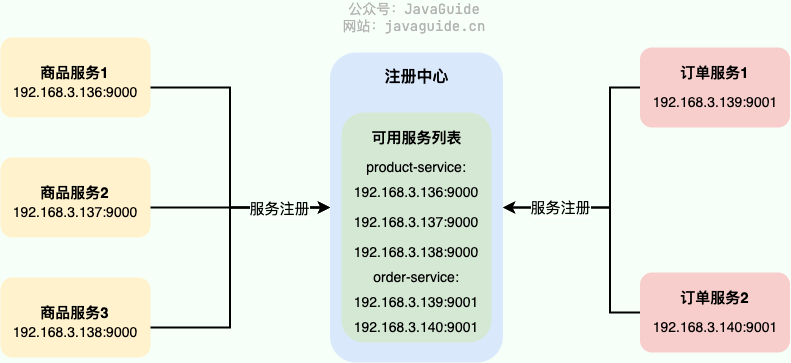

一个服务节点如果要调用另外一个**服务节点**，会直接拿着服务的信息找注册中心要对方的地址信息，这就是 服务发现
。通常情况下，服务节点拿到地址信息之后，还会在本地缓存一份，保证在注册中心宕机时仍然可以正常调用服务。

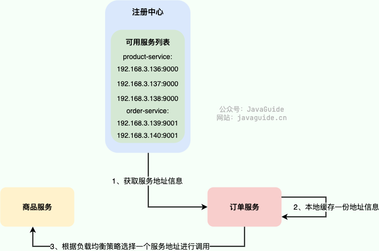

如果服务信息发生变更，注册中心会将变更推送给相关联的服务，更新服务地址信息。

为了保证服务地址列表中都是可用服务的地址信息，注册中心通常会通过 **心跳机制**
来检测服务是否可用，如果服务不可用的话，注册中心会主动剔除该服务并将变更推送给相关联的服务，更新服务地址信息。

最后，再来一张图简单总结一下服务注册与发现（一个服务既可能是服务提供者也可能是服务消费者）。

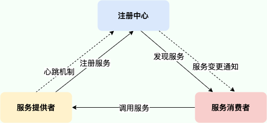

#### 常见的注册中心有哪些？

>
我这里跟多的是从面试角度来说，各类注册中心的详细对比，可以看这篇文章：[5 种注册中心如何选型？从原理给你解读！ - 楼仔 - 2022](https://mp.weixin.qq.com/s?__biz=Mzg3OTU5NzQ1Mw==&mid=2247486918&idx=1&sn=5651cd0b4b9c8e68bcfa55c00c0950d6&chksm=cf034f24f874c632511684057337a744c54702543ec3690aa06dbf4bbaf980b2828f52276c9b&scene=21#wechat_redirect)
，非常详细。

比较常用的注册中心有 ZooKeeper、Eureka、Nacos，这三个都是使用 Java 语言开发，相对来说，更适合 Java 技术栈一些。其他的还有像
ETCD、Consul，这里就不做介绍了。

首先，咱们来看 ZooKeeper，大部分同学应该对它不陌生。严格意义上来说，ZooKeeper 设计之初并不是未来做注册中心的，只是前几年国内使用
Dubbo 的场景下比较喜欢使用它来做注册中心。

对于 CAP 理论来说，**ZooKeeper 保证的是 CP**。 任何时刻对 ZooKeeper 的读请求都能得到一致性的结果，但是， ZooKeeper
不保证每次请求的可用性比如在 Leader 选举过程中或者半数以上的机器不可用的时候服务就是不可用的。

**针对注册中心这个场景来说，重要的是可用性，AP 会更合适一些**。 ZooKeeper 更适合做分布式协调服，注册中心就交给专业的来做吧！

其次，我们再来看看 Eureka，一款非常值得研究的注册中心。Eureka 是 Netflix 公司开源的一个注册中心，配套的还有
Feign、Ribbon、Zuul、Hystrix 等知名的微服务系统构建所必须的组件。

对于 CAP 理论来说，**Eureka 保证的是 AP**。 Eureka 集群只要有一台 Eureka
正常服务，整个注册中心就是可用的，只是查询到的数据可能是过期的（集群中的各个节点异步方式同步数据，不保证强一致性）。


不过，可惜的是，Spring Cloud 2020.0.0 版本移除了 Netflix 除 Eureka 外的所有组件。

**那为什么 Spring Cloud 这么急着移除 Netflix 的组件呢？** 主要是因为在 2018 年的时候，Netflix 宣布其开源的核心组件
Hystrix、Ribbon、Zuul、Eureka 等进入维护状态，不再进行新特性开发，只修 BUG。于是，Spring 官方不得不考虑移除 Netflix 的组件。

我这里也不推荐使用 Eureka 作为注册中心，阿里开源的 Nacos 或许是更好的选择。

最后，我们再来看看 Nacos，一款即可以用来做注册中心，又可以用来做配置中心的优秀项目。

Nacos 属实是后起之秀，借鉴吸收了其他注册中心的有点，与 Spring Boot 、Dubbo、Spring Cloud、Kubernetes 无缝对接，兼容性很好。并且，
**Nacos 不仅支持 CP 也支持 AP**。

Nacos 性能强悍（比 Eureka 能支持更多的服务实例），易用性较强（文档丰富、数据模型简单且自带后台管理界面），支持 99.9% 高可用。

对于 Java 技术栈来说，个人是比较推荐使用 Nacos 来做注册中心。

### **服务治理：分布式下如何进行配置管理？**

#### 为什么要用配置中心？

微服务下，业务的发展一般会导致服务数量的增加，进而导致程序配置（服务地址、数据库参数等等）增多。传统的配置文件的方式已经无法满足当前需求，主要有下面几点原因：

- 安全性得不到保障：配置放在代码库中容易泄露。
- 时效性不行：修改配置需要重启服务才能生效。
- 不支持权限控制 ：没有对配置的修改、发布等操作进行严格的权限控制。
- 不支持配置集中管理 ： 配置文件过于分散，不方便管理。
- ......

另外，配置中心通常会自带版本跟踪，会记录配置的修改记录，记录的内容包括修改人、修改时间、修改内容等等。

虽然通过 Git 版本管理我们也能追溯配置的修改记录，但是配置中心提供的配置版本管理功能更全面。并且，配置中心通常会在配置版本管理的基础上支持配置一键回滚。


一些功能更全面的配置中心比如`Apollo`甚至还支持灰度发布。

#### 常见的配置中心有哪些？

[Spring Cloud Config](https://cloud.spring.io/spring-cloud-config/reference/html/)、[Nacos](https://github.com/alibaba/nacos) 、[Apollo](https://github.com/apolloconfig/apollo)
、K8s ConfigMap 、[Disconf](https://github.com/knightliao/disconf) 、[Qconf](https://github.com/Qihoo360/QConf) 都可以用来做配置中心。

Disconf 和 Qconf 已经没有维护，生态也并不活跃，并不建议使用，在做配置中心技术选型的时候可以跳过。

如果你的技术选型是 Kubernetes 的话，可以考虑使用 K8s ConfigMap 来作为配置中心。

Apollo 和 Nacos 我个人更喜欢，两者都是国内公司开源的知名项目，项目社区都比较活跃且都还在维护中。Nacos 是阿里开源的，Apollo
是携程开源的。Nacos 使用起来比较简单，并且还可以直接用来做服务发现及管理。Apollo 只能用来做配置管理，使用相对复杂一些。

如果你的项目仅仅需要配置中心的话，建议使用 Apollo 。如果你的项目需要配置中心的同时还需要服务发现及管理的话，那就更建议使用
Nacos。

Spring Cloud Config 属于 Spring Cloud 生态组件，可以和 Spring Cloud 体系无缝整合。由于基于 Git 存储配置，因此 Spring Cloud
Config 的整体设计很简单。

#### Apollo vs Nacos vs Spring Cloud Config

| 功能点    | Apollo            | Nacos                      | Spring Cloud Config |
|--------|-------------------|----------------------------|---------------------|
| 配置界面   | 支持                | 支持                         | 无（需要通过 Git 操作）      |
| 配置实时生效 | 支持(HTTP 长轮询 1s 内) | 支持(HTTP 长轮询 1s 内)          | 重启生效，或手动 refresh 生效 |
| 版本管理   | 支持                | 支持                         | 支持（依赖 Git）          |
| 权限管理   | 支持                | 支持                         | 支持（依赖 Git）          |
| 灰度发布   | 支持                | 支持（Nacos 1.1.0 版本开始支持灰度配置） | 不支持                 |
| 配置回滚   | 支持                | 支持                         | 支持（依赖 Git）          |
| 告警通知   | 支持                | 支持                         | 不支持                 |
| 多语言    | 主流语言，Open API     | 主流语言，Open API              | 只支持 Spring 应用       |
| 多环境    | 支持                | 支持                         | 不支持                 |
| 监听查询   | 支持                | 支持                         | 支持                  |

Apollo 和 Nacos 提供了更多开箱即用的功能，更适合用来作为配置中心。

Nacos 使用起来比较简单，并且还可以直接用来做服务发现及管理。Apollo 只能用来做配置管理，使用相对复杂一些。

Apollo 在配置管理方面做的更加全面，就比如说虽然 Nacos 在 1.1.0 版本开始支持灰度配置，但 Nacos 的灰度配置功能实现的比较简单，Apollo
实现的灰度配置功能就相对更完善一些。不过，Nacos 提供的配置中心功能已经可以满足绝大部分项目的需求了。

#### 一个完备配置中心需要具备哪些功能？

如果我们需要自己设计一个配置中心的话，需要考虑哪些东西呢？

简单说说我的看法：

- **权限控制** ：配置的修改、发布等操作需要严格的权限控制。
- **日志记录** ： 配置的修改、发布等操需要记录完整的日志，便于后期排查问题。
- **配置推送** ： 推送模式通常由两种：
    - 推 ：实时性变更，配置更新后推送给应用。需要应用和配置中心保持长连接，复杂度高。
    - 拉 ：实时性较差，应用隔一段时间手动拉取配置。
    - 推拉结合
- **灰度发布** ：支持配置只推给部分应用。
- **易操作** ： 提供 Web 界面方便配置修改和发布。
- **版本跟踪** ：所有的配置发布都有版本概念，从而可以方便的支持配置的回滚。
- **支持配置回滚** ： 我们一键回滚配置到指定的位置，这个需要和版本跟踪结合使用。
- ......

#### **以 Apollo 为例介绍配置中心的设计**

##### Apollo 介绍

根据 Apollo 官方介绍：

> [Apollo](https://github.com/ctripcorp/apollo)
> （阿波罗）是携程框架部门研发的分布式配置中心，能够集中化管理应用不同环境、不同集群的配置，配置修改后能够实时推送到应用端，并且具备规范的权限、流程治理等特性，适用于微服务配置管理场景。
>
> 服务端基于 Spring Boot 和 Spring Cloud 开发，打包后可以直接运行，不需要额外安装 Tomcat 等应用容器。
>
> Java 客户端不依赖任何框架，能够运行于所有 Java 运行时环境，同时对 Spring/Spring Boot 环境也有较好的支持。

Apollo 特性：

- **配置修改实时生效（热发布）** （1s 即可接收到最新配置）
- **灰度发布** （配置只推给部分应用）
- **部署简单** （只依赖 MySQL）
- **跨语言** （提供了 HTTP 接口，不限制编程语言）
- ......

关于如何使用 Apollo 可以查看 [Apollo 官方使用指南](https://www.apolloconfig.com/#/zh/usage/apollo-user-guide)。

相关阅读：

- [Apollo 在有赞的实践](https://mp.weixin.qq.com/s/Ge14UeY9Gm2Hrk--E47eJQ)
- [分布式配置中心选型，为什么选择 Apollo？—微观技术-2021-04-23](https://mp.weixin.qq.com/s?__biz=Mzg2NzYyNjQzNg==&mid=2247484920&idx=1&sn=76d91ce217bf508aa2ee7156e1ba0994&source=41#wechat_redirect)

##### Apollo 架构解析

官方给出的 Apollo 基础模型非常简单：


1. 用户通过 Apollo 配置中心修改/发布配置，

2. Apollo 配置中心通知应用配置已经更改

3. 应用访问 Apollo 配置中心获取最新的配置

官方给出的架构图如下：

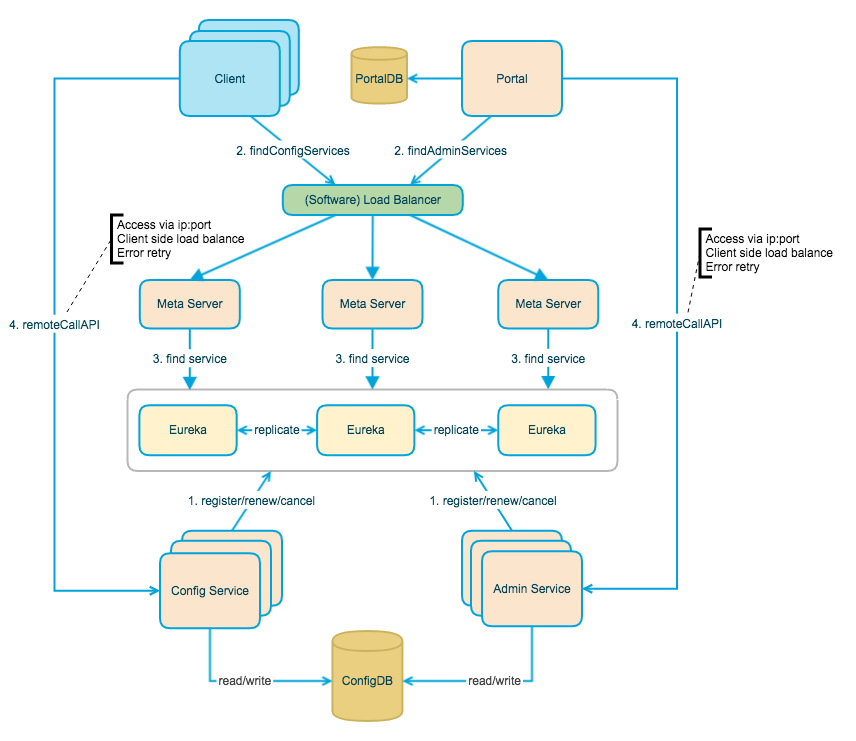

- **Client 端（客户端，用于应用获取配置）流程** ：Client 通过域名走 slb（软件负载均衡）访问 Meta Server，Meta Server 访问
  Eureka 服务注册中心获取 Config Service 服务列表（IP+Port）。有了 IP+Port，我们就能访问 Config Service 暴露的服务比如通过
  GET 请求获取配置的接口（`/configs/{appId}/{clusterName}/{namespace:.+}`）即可获取配置。
- **Portal 端（UI 界面，用于可视化配置管理）流程** ：Portal 端通过域名走 slb（软件负载均衡）访问 Meta Server，Meta Server 访问
  Eureka 服务注册中心获取 Admin Service 服务列表（IP+Port）。有了 IP+Port，我们就能访问 Admin Service 暴露的服务比如通过
  POST 请求访问发布配置的接口（`/apps/{appId}/envs/{env}/clusters/{clusterName}/namespaces/{namespaceName}/releases`
  ）即可发布配置。

另外，杨波老师的[微服务架构~携程 Apollo 配置中心架构剖析](https://mp.weixin.qq.com/s/-hUaQPzfsl9Lm3IqQW3VDQ)这篇文章对
Apollo 的架构做了简化，值得一看。

我会从上到下依次介绍架构图中涉及到的所有角色的作用。

###### Client

Apollo 官方提供的客户端，目前有 Java 和.Net 版本。非 Java 和.Net 应用可以通过调用 HTTP 接口来使用 Apollo。

Client 的作用主要就是提供一些开箱即用的方法方便应用获取以及实时更新配置。

比如你通过下面的几行代码就能获取到 someKey 对应的实时最新的配置值：

```java
Config config = ConfigService.getAppConfig();
String someKey = "someKeyFromDefaultNamespace";
String someDefaultValue = "someDefaultValueForTheKey";
String value = config.getProperty(someKey, someDefaultValue);
```

再比如你通过下面的代码就能监听配置变化：

```java
Config config = ConfigService.getAppConfig();
config.addChangeListener(new ConfigChangeListener() {
    @Override
    public void onChange(ConfigChangeEvent changeEvent) {
       //......
    }
});
```

###### Portal

Portal 实际就是一个帮助我们修改和发布配置的 UI 界面。


###### （Software） Load Balancer

为了实现 MetaServer 的高可用，MetaServer 通常以集群的形式部署。

Client/Portal 直接访问 （Software） Load Balancer ，然后，再由其进行负载均衡和流量转发。

###### Meta Server

为了实现跨语言使用，通常的做法就是暴露 HTTP 接口。为此，Apollo 引入了 MetaServer。

Meta Server 其实就是 Eureka 的 Proxy，作用就是将 Eureka 的服务发现接口以 HTTP 接口的形式暴露出来。 这样的话，我们通过 HTTP
请求就可以访问到 Config Service 和 AdminService。

通常情况下，我们都是建议基于 Meta Server 机制来实现 Config Service 的服务发现，这样可以实现 Config Service 的高可用。不过，
你也可以选择跳过 MetaServer，直接指定 Config Service 地址（apollo-client 0.11.0 及以上版本）。

###### Config Service

主要用于 Client 对配置的获取以及实时更新。

###### Admin Service

主要用于 Portal 对配置的更新。

#### 参考

- Nacos 1.2.0 权限控制介绍和使用：https://nacos.io/zh-cn/blog/nacos 1.2.0 guide.html
- Nacos 1.1.0 发布，支持灰度配置和地址服务器模式：https://nacos.io/zh-cn/blog/nacos 1.1.0.html
- Apollo 常见问题解答：https://www.apolloconfig.com/#/zh/faq/faq
- 微服务配置中心选型比较：https://www.itshangxp.com/spring-cloud/spring-cloud-config-center/

### **服务治理：分布式事务解决方案有哪些？**

**网上已经有很多关于分布式事务的文章了，为啥还要写一篇？**

1. 第一是我觉得大部分文章理解起来挺难的，不太适合一些经验不多的小伙伴。这篇文章我的目标就是让即使是没啥工作经验的小伙伴们都能真正看懂分布式事务。

2. 第二是我觉得大部分文章介绍的不够详细，很对分布式事务相关比较重要的概念都没有提到。

开始聊分布式事务之前，我们先来回顾一下事务相关的概念。

#### 事务

我们设想一个场景，这个场景中我们需要插入多条相关联的数据到数据库，不幸的是，这个过程可能会遇到下面这些问题：

- 数据库中途突然因为某些原因挂掉了。
- 客户端突然因为网络原因连接不上数据库了。
- 并发访问数据库时，多个线程同时写入数据库，覆盖了彼此的更改。
- ......

上面的任何一个问题都可能会导致数据的不一致性。为了保证数据的一致性，系统必须能够处理这些问题。事务就是我们抽象出来简化这些问题的首选机制。事务的概念起源于数据库，目前，已经成为一个比较广泛的概念。

**何为事务？** 一言蔽之，**事务是逻辑上的一组操作，要么都执行，要么都不执行**。

事务最经典也经常被拿出来说例子就是转账了。假如小明要给小红转账 1000 元，这个转账会涉及到两个关键操作，这两个操作必须都成功或者都失败。

1. 将小明的余额减少 1000 元
2. 将小红的余额增加 1000 元。

事务会把这两个操作就可以看成逻辑上的一个整体，这个整体包含的操作要么都成功，要么都要失败。这样就不会出现小明余额减少而小红的余额却并没有增加的情况。


#### 数据库事务

大多数情况下，我们在谈论事务的时候，如果没有特指**分布式事务**，往往指的就是**数据库事务**。

数据库事务在我们日常开发中接触的最多了。如果你的项目属于单体架构的话，你接触到的往往就是数据库事务了。

**那数据库事务有什么作用呢？**

简单来说，数据库事务可以保证多个对数据库的操作（也就是 SQL 语句）构成一个逻辑上的整体。构成这个逻辑上的整体的这些数据库操作遵循：
**要么全部执行成功,要么全部不执行 。**

```sql
# 开启一个事务
START TRANSACTION;
# 多条 SQL 语句
SQL1,SQL2...
## 提交事务
COMMIT;
```


另外，关系型数据库（例如：`MySQL`、`SQL Server`、`Oracle` 等）事务都有 **ACID** 特性：


1. **原子性**（Atomicity） ： 事务是最小的执行单位，不允许分割。事务的原子性确保动作要么全部完成，要么完全不起作用；
2. **一致性**（Consistency）： 执行事务前后，数据保持一致，例如转账业务中，无论事务是否成功，转账者和收款人的总额应该是不变的；
3. **隔离性**（Isolation）： 并发访问数据库时，一个用户的事务不被其他事务所干扰，各并发事务之间数据库是独立的；
4. **持久性**（Durabilily）： 一个事务被提交之后。它对数据库中数据的改变是持久的，即使数据库发生故障也不应该对其有任何影响。

🌈 这里要额外补充一点：**只有保证了事务的持久性、原子性、隔离性之后，一致性才能得到保障。也就是说 A、I、D 是手段，C 是目的！**
想必大家也和我一样，被 ACID 这个概念被误导了很久!
我也是看周志明老师的公开课[《周志明的软件架构课》](https://time.geekbang.org/opencourse/intro/100064201)才搞清楚的（多看好书！！！）。

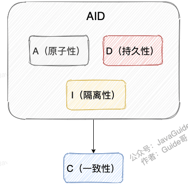

另外，DDIA
也就是 [《Designing Data-Intensive Application（数据密集型应用系统设计）》](https://book.douban.com/subject/30329536/)
的作者在他的这本书中如是说：

> Atomicity, isolation, and durability are properties of the database, whereas consis‐ tency (in the ACID sense) is a
> property of the application. The application may rely on the database’s atomicity and isolation properties in order to
> achieve consistency, but it’s not up to the database alone.
>
> 翻译过来的意思是：原子性，隔离性和持久性是数据库的属性，而一致性（在 ACID
> 意义上）是应用程序的属性。应用可能依赖数据库的原子性和隔离属性来实现一致性，但这并不仅取决于数据库。因此，字母 C 不属于
> ACID 。

《Designing Data-Intensive Application（数据密集型应用系统设计）》这本书强推一波，值得读很多遍！豆瓣有接近 90%
的人看了这本书之后给了五星好评。另外，中文翻译版本已经在 Github 开源，地址：https://github.com/Vonng/ddia 。


**数据事务的实现原理呢？**

我们这里以 MySQL 的 InnoDB 引擎为例来简单说一下。

MySQL InnoDB 引擎使用 **redo log(重做日志)** 保证事务的**持久性**，使用 **undo log(回滚日志)** 来保证事务的**原子性**
。MySQL InnoDB 引擎通过 **锁机制**、**MVCC** 等手段来保证事务的隔离性（ 默认支持的隔离级别是 **REPEATABLE-READ** ）。

#### 分布式事务

微服务架构下，一个系统被拆分为多个小的微服务。每个微服务都可能存在不同的机器上，并且每个微服务可能都有一个单独的数据库供自己使用。这种情况下，一组操作可能会涉及到多个微服务以及多个数据库。举个例子：电商系统中，你创建一个订单往往会涉及到订单服务（订单数加一）、库存服务（库存减一）等等服务，这些服务会有供自己单独使用的数据库。


**那么如何保证这一组操作要么都执行成功，要么都执行失败呢？**

这个时候单单依靠数据库事务就不行了！我们就需要引入 **分布式事务** 这个概念了！

实际上，只要跨数据库的场景都需要用到引入分布式事务。比如说单个数据库的性能达到瓶颈或者数据量太大的时候，我们需要进行
分库。分库之后，同一个数据库中的表分布在了不同的数据库中，如果单个操作涉及到多个数据库，那么数据库自带的事务就无法满足我们的要求了。

一言蔽之，**分布式事务的终极目标就是保证系统中多个相关联的数据库中的数据的一致性！**

那既然分布式事务也属于事务，理论上就应该准守事物的 ACID 四大特性。但是，考虑到性能、可用性等各方面因素，我们往往是无法完全满足
ACID 的，只能选择一个比较折中的方案。

针对分布式事务，又诞生了一些新的理论。

#### **分布式事务基础理论**

##### CAP 理论和 BASE 理论

CAP 理论和 BASE 理论是分布式领域非常非常重要的两个理论。不夸张地说，只要问到分布式相关的内容，面试官几乎是必定会问这两个分布式相关的理论。

不论是你面试也好，工作也罢，都非常有必要将这两个理论搞懂，并且能够用自己的理解给别人讲出来。

我这里就不多提这两个理论了，不了解的小伙伴，可以看我前段时间写过的一篇相关的文章：[《CAP 和 BASE 理论了解么？可以结合实际案例说下不？》](https://mp.weixin.qq.com/s?__biz=Mzg2OTA0Njk0OA==&mid=2247495298&idx=1&sn=965be0f54ab44bda818656db1f21a39f&chksm=cea1a149f9d6285f1169413ab7663ca2a9c1a8440a5ae5816566eb66b20e4d86f5db1002f66c&token=657875872&lang=zh_CN#rd) 。

##### 一致性的 3 种级别

我们可以把对于系统一致性的要求分为下面 3 种级别：

- **强一致性** ：系统写入了什么，读出来的就是什么。
- **弱一致性** ：不一定可以读取到最新写入的值，也不保证多少时间之后读取到的数据是最新的，只是会尽量保证某个时刻达到数据一致的状态。
- **最终一致性** ：弱一致性的升级版。系统会保证在一定时间内达到数据一致的状态，

除了上面这 3
个比较常见的一致性级别之外，还有读写一致性、因果一致性等一致性模型，具体可以参考[《Operational Characterization of Weak Memory Consistency Models》](https://es.cs.uni-kl.de/publications/datarsg/Senf13.pdf)
这篇论文。因为日常工作中这些一致性模型很少见，我这里就不多做阐述（因为我自己也不是特别了解 😅）。

业界比较推崇是 **最终一致性**，但是某些对数据一致要求十分严格的场景比如银行转账还是要保证强一致性。

##### 柔性事务

互联网应用最关键的就是要保证高可用， 计算式系统几秒钟之内没办法使用都有可能造成数百万的损失。在此场景下，一些大佬们在 CAP
理论和 BASE 理论的基础上，提出了 **柔性事务** 的概念。 **柔性事务追求的是最终一致性。**

实际上，柔性事务就是 **BASE 理论 +业务实践**。 柔性事务追求的目标是：我们根据自身业务特性，通过适当的方式来保证系统数据的最终一致性。
像 **TCC、 Saga、MQ 事务 、本地消息表** 就属于柔性事务。

##### 刚性事务

与柔性事务相对的就是 **刚性事务** 了。前面我们说了，**柔性事务追求的是最终一致性** 。那么，与之对应，刚性事务追求的就是 *
*强一致性**。像**2PC 、3PC** 就属于刚性事务。


#### 分布式事务解决方案

分布式事务的解决方案有很多，比如：**2PC、3PC、TCC、本地消息表、MQ 事务（Kafka 和 RocketMQ 都提供了事务相关功能） 、Saga** 等等。

2PC、3PC 属于业务代码无侵入方案，都是基于 XA 规范衍生出来的实现，XA 规范是 X/Open 组织定义的分布式事务处理（DTP，Distributed
Transaction Processing）标准。TCC、Saga 属于业务侵入方案，MQ 事务依赖于使用消息队列的场景，本地消息表不支持回滚。

这些方案的适用场景有所区别，我们需要根据具体的场景选择适合自己项目的解决方案。

开始介绍 2PC 和 3PC 之前，我们先来介绍一下 2PC 和 3PC 涉及到的一些角色（XA 规范的角色组成）：

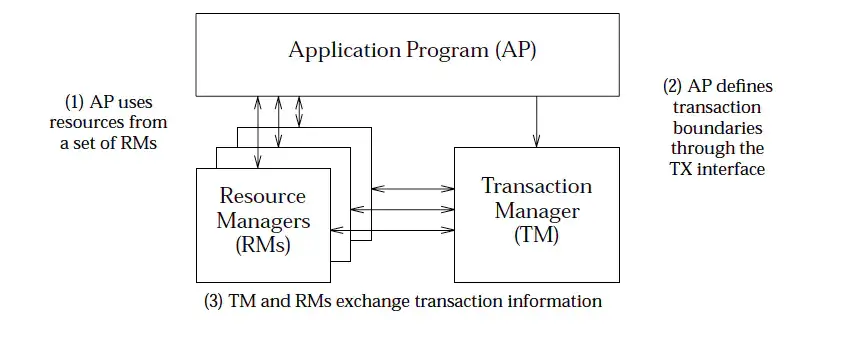

- **AP（Application Program）**：应用程序本身。
- **RM（Resource Manager）** ：资源管理器，也就是事务的参与者，绝大部分情况下就是指数据库（后文会以关系型数据库为例），一个分布式事务往往涉及到多个
  RM。
- **TM（Transaction Manager）** ：事务管理器，负责管理全局事务，分配事务唯一标识，监控事务的执行进度，并负责事务的提交、回滚、失败恢复等。

##### **2PC（两阶段提交协议）**

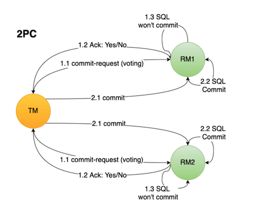

2PC（Two-Phase Commit）这三个字母的含义:

- **2** -> 指代事务提交的 2 个阶段
- **P**-> Prepare (准备阶段)
- **C** ->Commit（提交阶段）

2PC 将事务的提交过程分为 2 个阶段：**准备阶段** 和 **提交阶段** 。

###### 准备阶段(Prepare)

准备阶段的核心是“询问”事务参与者执行本地数据库事务操作是否成功。

准备阶段的工作流程：

1. **事务协调者/管理者（后文简称 TM）** 向所有涉及到的 **事务参与者（后文简称 RM）** 发送消息询问：“你是否可以执行事务操作呢？”，并等待其答复。
2. **RM** 接收到消息之后，开始执行本地数据库事务预操作比如写 redo log/undo log 日志，**此时并不会提交事务** 。
3. **RM** 如果执行本地数据库事务操作成功，那就回复“Yes”表示我已就绪，否则就回复“No”表示我未就绪。

###### 提交阶段(Commit)

提交阶段的核心是“询问”事务参与者提交本地事务是否成功。

当所有事务参与者都是“就绪”状态的话：

1. **TM** 向所有参与者发送消息：“你们可以提交事务啦！”（**Commit 消息**）
2. **RM** 接收到 **Commit 消息** 后执行 **提交本地数据库事务** 操作，执行完成之后 **释放整个事务期间所占用的资源**。
3. **RM** 回复：“事务已经提交” （**ACK 消息**）。
4. **TM** 收到所有 **事务参与者** 的 **ACK 消息** 之后，整个分布式事务过程正式结束。


当任一事务参与者是“未就绪”状态的话：

1. **TM** 向所有参与者发送消息：“你们可以执行回滚操作了！”（**Rollback 消息**）。
2. **RM** 接收到 **Rollback 消息** 后执行 **本地数据库事务回滚** 执行完成之后 **释放整个事务期间所占用的资源**。
3. **RM** 回复：“事务已经回滚” （**ACK 消息**）。
4. **TM** 收到所有 **RM** 的 **ACK 消息** 之后，中断事务。


###### 总结

简单总结一下 **2PC** 两阶段中比较重要的一些点：

1. **准备阶段** 的主要目的是测试 **RM** 能否执行 **本地数据库事务** 操作（!!!注意：这一步并不会提交事务）。
2. **提交阶段** 中 **TM** 会根据 **准备阶段** 中 **RM** 的消息来决定是执行事务提交还是回滚操作。
3. **提交阶段** 之后一定会结束当前的分布式事务

**2PC 的优点：**

- 实现起来非常简单，各大主流数据库比如 MySQL、Oracle 都有自己实现。
- 针对的是数据强一致性。不过，仍然可能存在数据不一致的情况。

**2PC 存在的问题：**

- **同步阻塞** ：事务参与者会在正式提交事务之前会一直占用相关的资源。比如用户小明转账给小红，那其他事务也要操作用户小明或小红的话，就会阻塞。
- **数据不一致** ：由于网络问题或者TM宕机都有可能会造成数据不一致的情况。比如在第2阶段（提交阶段），部分网络出现问题导致部分参与者收不到
  Commit/Rollback 消息的话，就会导致数据不一致。
- **单点问题** ： TM在其中也是一个很重要的角色，如果TM在准备(Prepare)阶段完成之后挂掉的话，事务参与者就会一直卡在提交(
  Commit)阶段。

##### **3PC（三阶段提交协议）**

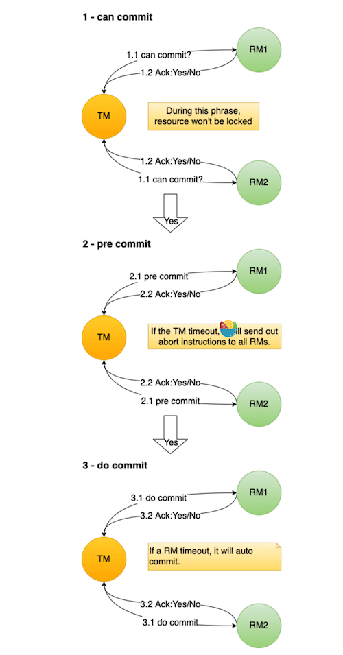

3PC 是人们在 2PC 的基础上做了一些优化得到的。3PC 把 2PC 中的 **准备阶段(Prepare)** 做了进一步细化，分为 2 个阶段：

- 准备阶段(CanCommit)
- 预提交阶段(PreCommit)


###### 准备阶段(CanCommit)

这一步不会执行事务操作，只是向 RM 发送 **准备请求** ，顺便询问一些信息比如事务参与者能否执行本地数据库事务操作。RM
回复“Yes”、“No”或者直接超时。

如果任一 RM 回复“No”或者直接超时的话，就中断事务（向所有参与者发送“Abort”消息），否则进入 **预提交阶段(PreCommit)** 。

###### 预提交阶段(PreCommit)

TM 向所有涉及到的 RM 发送 **预提交请求** ，RM 回复“Yes”、“No”（最后的反悔机会）或者直接超时。

如果任一 RM 回复“No”或者直接超时的话，就中断事务（向所有事务参与者发送“abort”消息），否则进入 **执行事务提交阶段（DoCommit）
** 。

当所有 RM 都返回“Yes”之后， RM 才会执行本地数据库事务预操作比如写 redo log/undo log 日志。

###### 执行事务提交阶段（DoCommit）

**执行事务提交（DoCommit）** 阶段就开始进行真正的事务提交。

TM 向所有涉及到的 RM 发送 **执行事务提交请求** ，RM 收到消息后开始正式提交事务，并在完成事务提交后释放占用的资源。

如果 TM 收到所有 RM 正确提交事务的消息的话，表示事务正常完成。如果任一 RM 没有正确提交事务或者超时的话，就中断事务，TM 向所有
RM 发送“Abort”消息。RM 接收到 Abort 请求后，执行本地数据库事务回滚，后面的步骤就和 2PC 中的类似了。

###### 总结

**3PC 除了将2PC 中的准备阶段(Prepare) 做了进一步细化之外，还做了哪些改进？**

3PC 还同时在事务管理者和事务参与者中引入了 **超时机制** ，如果在一定时间内没有收到事务参与者的消息就默认失败，进而避免事务参与者一直阻塞占用资源。2PC
中只有事务管理者才拥有超时机制，当事务参与者长时间无法与事务协调者通讯的情况下（比如协调者挂掉了），就会导致无法释放资源阻塞的问题。

不过，3PC 并没有完美解决 2PC 的阻塞问题，引入了一些新问题比如性能糟糕，而且，依然存在数据不一致性问题。因此，3PC
的实际应用并不是很广泛，多数应用会选择通过复制状态机解决 2PC 的阻塞问题。

##### TCC（补偿事务）

TCC 属于目前比较火的一种柔性事务解决方案。TCC 这个概念最早诞生于数据库专家帕特 · 赫兰德（Pat Helland）于 2007
发表的 [《Life beyond Distributed Transactions: an Apostate’s Opinion》](https://www.ics.uci.edu/~cs223/papers/cidr07p15.pdf)
这篇论文，感兴趣的小伙伴可以阅读一下这篇论文。

简单来说，TCC 是 Try、Confirm、Cancel 三个词的缩写，它分为三个阶段：

1. **Try（尝试）阶段** : 尝试执行。完成业务检查，并预留好必需的业务资源。
2. **Confirm（确认）阶段** ：确认执行。当所有事务参与者的 Try 阶段执行成功就会执行 Confirm ，Confirm 阶段会处理 Try
   阶段预留的业务资源。否则，就会执行 Cancel 。
3. **Cancel（取消）阶段** ：取消执行，释放 Try 阶段预留的业务资源。

每个阶段由业务代码控制，这样可以避免长事务，性能更好。

我们拿转账场景来说：

1. **Try（尝试）阶段** : 在转账场景下，Try 要做的事情是就是检查账户余额是否充足，预留的资源就是转账资金。
2. **Confirm（确认）阶段** ： 如果 Try 阶段执行成功的话，Confirm 阶段就会执行真正的扣钱操作。
3. **Cancel（取消）阶段** ：释放 Try 阶段预留的转账资金。

一般情况下，当我们使用`TCC`模式的时候，需要自己实现 `try`, `confirm`, `cancel `这三个方法，来达到最终一致性。

正常情况下，会执行 `try`, `confirm` 方法。


出现异常的话，会执行 `try`,` cancel` 方法。


Try 阶段出现问题的话，可以执行 Cancel。**那如果 Confirm 或者 Cancel 阶段失败了怎么办呢？**

TCC 会记录事务日志并持久化事务日志到某种存储介质上比如本地文件、关系型数据库、Zookeeper，事务日志包含了事务的执行状态，通过事务执行状态可以判断出事务是提交成功了还是提交失败了，以及具体失败在哪一步。如果发现是
Confirm 或者 Cancel 阶段失败的话，会进行重试，继续尝试执行 Confirm 或者 Cancel 阶段的逻辑。重试的次数通常为 6
次，如果超过重试的次数还未成功执行的话，就需要人工介入处理了。

如果代码没有特殊 Bug 的话，Confirm 或者 Cancel 阶段出现问题的概率是比较小的。

**事务日志会被删除吗？** 会的。如果事务提交成功（没有抛出任何异常），就可以删除对应的事务日志，节省资源。

**TCC 模式不需要依赖于底层数据资源的事务支持，但是需要我们手动实现更多的代码**，属于 **侵入业务代码 的一种分布式解决方案
**。

TCC 事务模型的思想类似 2PC，我简单花了一张图对比一下二者。


**TCC 和 2PC/3PC 有什么区别呢？**

- 2PC/3PC 依靠数据库或者存储资源层面的事务，TCC 主要通过修改业务代码来实现。

- 2PC/3PC 属于业务代码无侵入的，TCC 对业务代码有侵入。

- 2PC/3PC 追求的是强一致性，在两阶段提交的整个过程中，一直会持有数据库的锁。TCC 追求的是最终一致性，不会一直持有各个业务资源的锁。

针对 TCC 的实现，业界也有一些不错的开源框架。不同的框架对于 TCC 的实现可能略有不同，不过大致思想都一样。

1. [ByteTCC](https://github.com/liuyangming/ByteTCC) : ByteTCC 是基于 Try-Confirm-Cancel（TCC）机制的分布式事务管理器的实现。
   相关阅读：[关于如何实现一个 TCC 分布式事务框架的一点思考](https://www.bytesoft.org/how-to-impl-tcc/)

2. [Seata](https://seata.io/zh-cn/index.html) :Seata 是一款开源的分布式事务解决方案，致力于在微服务架构下提供高性能和简单易用的分布式事务服务。

3. [Hmily](https://gitee.com/shuaiqiyu/hmily) : 金融级分布式事务解决方案。

##### MQ 事务

RocketMQ 、 Kafka、Pulsar 、QMQ 都提供了事务相关的功能。事务允许事件流应用将消费，处理，生产消息整个过程定义为一个原子操作。

这里我们拿 RocketMQ
来说（图源：《消息队列高手课》）。相关阅读：[RocketMQ 事务消息参考文档](https://rocketmq.apache.org/docs/transaction-example/) 。

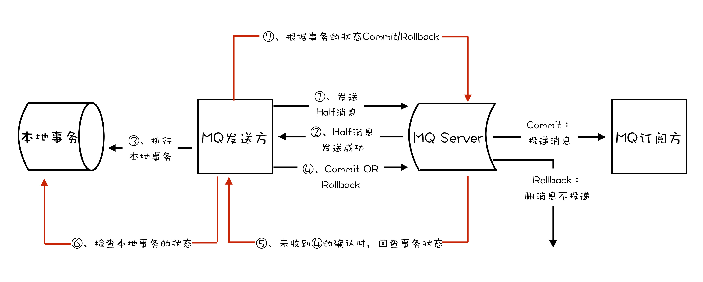

1. MQ 发送方（比如物流服务）在消息队列上开启一个事务，然后发送一个“半消息”给 MQ Server/Broker。事务提交之前，半消息对于 MQ
   订阅方/消费者（比如第三方通知服务）不可见
2. “半消息”发送成功的话，MQ 发送方就开始执行本地事务。
3. MQ 发送方的本地事务执行成功的话，“半消息”变成正常消息，可以正常被消费。MQ 发送方的本地事务执行失败的话，会直接回滚。

从上面的流程中可以看出，MQ 的事务消息使用的是两阶段提交（2PC），简单来说就是咱先发送半消息，等本地事务执行成功之后，半消息才变为正常消息。

**如果 MQ 发送方提交或者回滚事务消息时失败怎么办？**

RocketMQ 中的 Broker 会定期去 MQ 发送方上反查这个事务的本地事务的执行情况，并根据反查结果决定提交或者回滚这个事务。

事务反查机制的实现依赖于我们业务代码实现的对应的接口，比如你要查看创建物流信息的本地事务是否执行成功的话，直接在数据库中查询对应的物流信息是否存在即可。

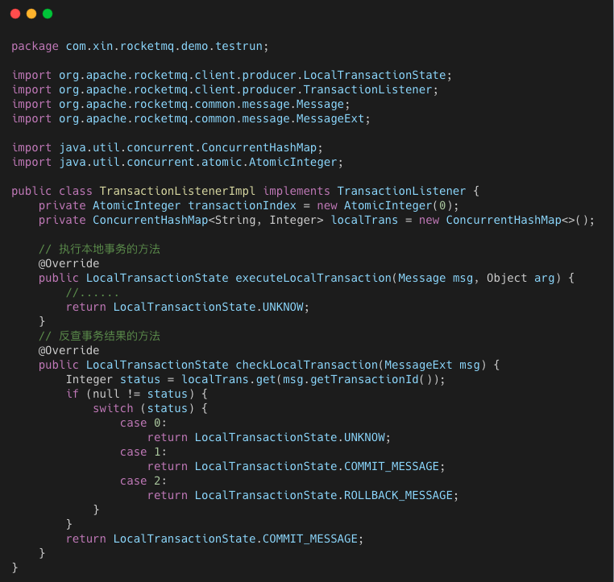

如果正常消息没有被正确消费怎么办呢？

消息消费失败的话，RocketMQ 会自动进行消费重试。如果超过最大重试次数这个消息还是没有正确消费，RocketMQ 就会认为这个消息有问题，然后将其放到
死信队列。

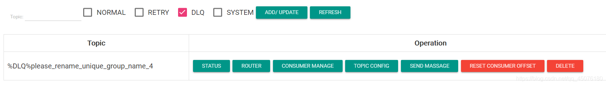

进入死信队列的消费一般需要人工处理，手动排查问题。

**QMQ**  的事务消息就没有 RocketMQ 实现的那么复杂了，它借助了数据库自带的事务功能。其核心思想其实就是 eBay 提出的 **本地消息表
** 方案，将分布式事务拆分成本地事务进行处理。

我们维护一个本地消息表用来存放消息发送的状态，保存消息发送情况到本地消息表的操作和业务操作要在一个事务里提交。这样的话，业务执行成功代表消息表也写入成功。

然后，我们再单独起一个线程定时轮询消息表，把没处理的消息发送到消息中间件。

消息发送成功后，更新消息状态为成功或者直接删除消息。

RocketMQ 的事务消息方案中，如果消息队列挂掉，数据库事务就无法执行了，整个应用也就挂掉了。

QMQ 的事务消息方案中，即使消息队列挂了也不会影响数据库事务的执行。

因此，QMQ 实现的方案能更加适应于大多数业务。不过，这种方法同样适用于其他消息队列，只能说 QMQ 封装的更好，开箱即用罢了！

相关阅读： [面试官：RocketMQ 分布式事务消息的缺点？](https://mp.weixin.qq.com/s/cBx1l1zaThN6_808fMl27g)

##### **Saga**

Saga 绝对可以说是历史非常悠久了，Saga 事务理论在 1987 年 Hector & Kenneth 在 ACM
发表的论文 [《Sagas》](https://www.cs.cornell.edu/andru/cs711/2002fa/reading/sagas.pdf) 中就被提出了，早于分布式事务概念的提出。

Saga 属于长事务解决方案，其核心思想是将长事务拆分为多个本地短事务（本地短事务序列）。


- 长事务 —> T1,T2 ~ Tn 个本地短事务
- 每个短事务都有一个补偿动作 —> C1,C2 ~ Cn

下图来自于 [微软技术文档—Saga 分布式事务](https://docs.microsoft.com/zh-cn/azure/architecture/reference-architectures/saga/saga) 。

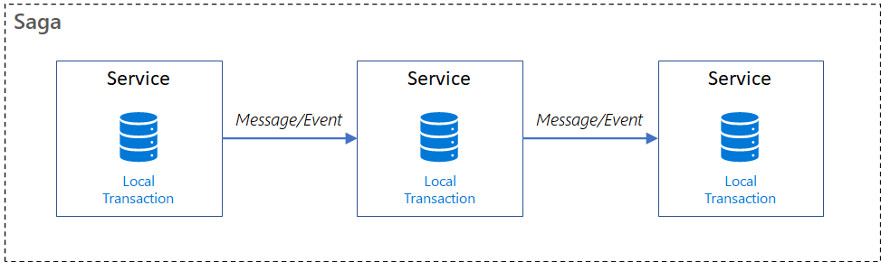

如果 T1,T2 ~ Tn 这些短事务都能顺利完成的话，整个事务也就顺利结束，否则，将采取恢复模式。

**反向恢复 ：**

- 简介：如果 Ti 短事务提交失败，则补偿所有已完成的事务（一直执行 Ci 对 Ti 进行补偿）。
- 执行顺序：T1，T2，…，Ti（失败），Ci（补偿），…，C2，C1。

**正向恢复 ：**

- 简介：如果 Ti 短事务提交失败，则一直对 Ti 进行重试，直至成功为止。
- 执行顺序：T1，T2，…，Ti（失败），Ti（重试）…，Ti+1，…，Tn。

和 TCC 类似，Saga 正向操作与补偿操作都需要业务开发者自己实现，因此也属于 **侵入业务代码** 的一种分布式解决方案。和 TCC
很大的一点不同是 Saga 没有“Try” 动作，它的本地事务 Ti 直接被提交。因此，性能非常高！

理论上来说，补偿操作一定能够执行成功。不过，当网络出现问题或者服务器宕机的话，补偿操作也会执行失败。这种情况下，往往需要我们进行人工干预。并且，为了能够提高容错性（比如
Saga 系统本身也可能会崩溃），保证所有的短事务都得以提交或补偿，我们还需要将这些操作通过日志记录下来（Saga
log，类似于数据库的日志机制）。这样，Saga 系统恢复之后，我们就知道短事务执行到哪里了或者补偿操作执行到哪里了。

另外，因为 Saga 没有进行“Try” 动作预留资源，所以不能保证隔离性。这也是 Saga 比较大的一个缺点。

针对 Saga 的实现，业界也有一些不错的开源框架。不同的框架对于 Saga 的实现可能略有不同，不过大致思想都一样。

1. [ServiceComb Pack](https://github.com/apache/servicecomb-pack) ：微服务应用的数据最终一致性解决方案。
2. [Seata](https://seata.io/zh-cn/index.html) :Seata 是一款开源的分布式事务解决方案，致力于在微服务架构下提供高性能和简单易用的分布式事务服务。

#### 分布式事务开源项目

1. [Seata](http://seata.io/zh-cn/) ：Seata 是一款开源的分布式事务解决方案，致力于在微服务架构下提供高性能和简单易用的分布式事务服务。经历过双
   11 的实战考验。
2. [Hmily](https://gitee.com/dromara/hmily) ：Hmily
   是一款高性能，零侵入，金融级分布式事务解决方案，目前主要提供柔性事务的支持，包含 `TCC`, `TAC`(自动生成回滚` SQL`)
   方案，未来还会支持 XA 等方案。个人开发项目，目前在京东数科重启，未来会成为京东数科的分布式事务解决方案。
3. [Raincat](https://gitee.com/dromara/Raincat) : 2 阶段提交分布式事务中间件。
4. [Myth](https://gitee.com/dromara/myth) : 采用消息队列解决分布式事务的开源框架, 基于 Java 语言来开发（JDK1.8），支持
   Dubbo，SpringCloud,Motan 等 rpc 框架进行分布式事务。

### **服务治理：监控系统如何做？**

> 个人学习笔记，大部分内容整理自书籍、博客和官方文档。
>
> 相关文章 &书籍：
>
> - [监控系统选型，这篇不可不读！](https://www.jianshu.com/p/302ba018082a)
> - [rometheus vs Nagios](https://logz.io/blog/prometheus-vs-nagios-metrics/)
> - [2020 年工作上的最大收获——监控告警体系](https://www.cnblogs.com/hunternet/p/14270218.html)
> - [《Prometheus 操作指南》](https://yunlzheng.gitbook.io/prometheus-book/)
>
> 相关视频：
>
> - [使用Prometheus实践基于Spring Boot监控告警体系](https://www.imooc.com/learn/1231)
> - [Prometheus & Grafana -陈嘉鹏 [尚硅谷大数据\]](https://www.bilibili.com/video/BV11f4y1A7aF)

#### 监控系统有什么用？

建立完善的监控体系主要是为了：

- **长期趋势分析** ：通过对监控样本数据的持续收集和统计，对监控指标进行长期趋势分析。例如，通过对磁盘空间增长率的判断，我们可以提前预测在未来什么时间节点上需要对资源进行扩容。
- **数据可视化** ：通过可视化仪表盘能够直接获取系统的运行状态、资源使用情况、以及服务运行状态等直观的信息。
- **预知故障和告警** : 当系统出现或者即将出现故障时，监控系统需要迅速反应并通知管理员，从而能够对问题进行快速的处理或者提前预防问题的发生，避免出现对业务的影响。
- **辅助定位故障、性能调优、容量规划以及自动化运维**

**出任何线上事故，先不说其他地方有问题，监控部分一定是有问题的。**

**如何才能更好地使用监控使用？**

1. **了解监控对象的工作原理**：要做到对监控对象有基本的了解，清楚它的工作原理。比如想对 JVM 进行监控，你必须清楚 JVM
   的堆内存结构和垃圾回收机制。
2. **确定监控对象的指标**：清楚使用哪些指标来刻画监控对象的状态？比如想对某个接口进行监控，可以采用请求量、耗时、超时量、异常量等指标来衡量。
3. **定义合理的报警阈值和等级**：达到什么阈值需要告警？对应的故障等级是多少？不需要处理的告警不是好告警，可见定义合理的阈值有多重要，否则只会降低运维效率或者让监控系统失去它的作用。
4. **建立完善的故障处理流程**：收到故障告警后，一定要有相应的处理流程和 oncall 机制，让故障及时被跟进处理。

#### 常见的监控对象和指标有哪些？

- **硬件监**控 ：电源状态、CPU 状态、机器温度、风扇状态、物理磁盘、raid 状态、内存状态、网卡状态
- **服务器基础监控** ：CPU、内存、磁盘、网络
- **数据库监控** ：数据库连接数、QPS、TPS、并行处理的会话数、缓存命中率、主从延时、锁状态、慢查询
- **中间件监控** ：
    - Nginx：活跃连接数、等待连接数、丢弃连接数、请求量、耗时、5XX 错误率
    - Tomcat：最大线程数、当前线程数、请求量、耗时、错误量、堆内存使用情况、GC 次数和耗时
    - 缓存 ：成功连接数、阻塞连接数、已使用内存、内存碎片率、请求量、耗时、缓存命中率
    - 消息队列：连接数、队列数、生产速率、消费速率、消息堆积量

- **应用监控** ：
    - HTTP 接口：URL 存活、请求量、耗时、异常量
    - RPC 接口：请求量、耗时、超时量、拒绝量
    - JVM ：GC 次数、GC 耗时、各个内存区域的大小、当前线程数、死锁线程数
    - 线程池：活跃线程数、任务队列大小、任务执行耗时、拒绝任务数
    - 连接池：总连接数、活跃连接数
    - 日志监控：访问日志、错误日志
    - 业务指标：视业务来定，比如 PV、订单量等

#### 监控的基本流程了解吗？

无论是开源的监控系统还是自研的监控系统，监控的整个流程大同小异，一般都包括以下模块：

- **数据采集**：采集的方式有很多种，包括日志埋点进行采集（通过 Logstash、Filebeat 等进行上报和解析），JMX 标准接口输出监控指标，被监控对象提供
  REST API 进行数据采集（如 Hadoop、ES），系统命令行，统一的 SDK 进行侵入式的埋点和上报等。
- **数据传输**：将采集的数据以 TCP、UDP 或者 HTTP 协议的形式上报给监控系统，有主动 Push 模式，也有被动 Pull 模式。
- **数据存储**：有使用 MySQL、Oracle 等 RDBMS 存储的，也有使用时序数据库 RRDTool、OpentTSDB、InfluxDB 存储的，还有使用 HBase
  存储的。
- **数据展示**：数据指标的图形化展示。
- **监控告警**：灵活的告警设置，以及支持邮件、短信、IM 等多种通知通道。

#### 监控系统需要满足什么要求？

- **实时监控&告警** ：监控系统对业务服务系统实时监控，如果产生系统异常及时告警给相关人员。
- **高可用** ：要保障监控系统的可用性
- **故障容忍** ：监控系统不影响业务系统的正常运行，监控系统挂了，应用正常运行。
- **可扩展** ：支持分布式、跨 IDC 部署，横向扩展。
- **可视化** ：自带可视化图标、支持对接各类可视化组件比如 Grafana 。

#### 监控系统技术选型有哪些？如何选择？

##### 老牌监控系统

Zabbix 和 Nagios 相继出现在 1998 年和 1999 年，目前已经被淘汰，不太建议使用，Prometheus 是更好的选择。

###### Zabbix

- **介绍** ：老牌监控的优秀代表。产品成熟，监控功能很全面，采集方式丰富（支持 Agent、SNMP、JMX、SSH
  等多种采集方式，以及主动和被动的数据传输方式），使用也很广泛，差不多有 70%左右的互联网公司都曾使用过 Zabbix 作为监控解决方案。
- **开发语言** ： C
- **数据存储** ： Zabbix 存储在 MySQL 上，也可以存储在其他数据库服务。Zabbix 由于使用了关系型数据存储时序数据，所以在监控大规模集群时常常在数据存储方面捉襟见肘。所以从
  Zabbix 4.2 版本后开始支持 TimescaleDB 时序数据库，不过目前成熟度还不高。
- **数据采集方式** : Zabbix 通过 SNMP、Agent、ICMP、SSH、IPMI 等对系统进行数据采集。Zabbix 采用的是 Push 模型（客户端发送数据给服务端）。
- **数据展示** ：自带展示界面，也可以对接 Grafana。
- **评价** ：不太建议使用 Zabbix，性能可能会成为监控系统的瓶颈。并且，应用层监控支持有限、二次开发难度大（基于 c 语言）、数据模型不强大。

相关阅读：[《zabbix 运维手册》](http://www.sunrisenan.com/docs/zabbix)

###### Nagios

- **介绍** ：Nagios 能有效监控 Windows、Linux 和 UNIX 的主机状态（CPU、内存、磁盘等），以及交换机、路由器等网络设备（SMTP、POP3、HTTP
  和 NNTP 等），还有 Server、Application、Logging，用户可自定义监控脚本实现对上述对象的监控。Nagios 同时提供了一个可选的基于浏览器的
  Web 界面，以方便系统管理人员查看网络状态、各种系统问题以及日志等。
- **开发语言** ： C
- **数据存储** ： MySQL 数据库
- **数据采集方式** : 通过各种插件采集数据
- **数据展示** ：自带展示界面，不过功能简单。
- **评价** ：不符合当前监控系统的要求，而且，Nagios 免费版本的功能非常有限，运维管理难度非常大。

##### 新一代监控系统

相比于老牌监控系统，新一代监控系统有明显的优势，比如：灵活的数据模型、更成熟的时序数据库、强大的告警功能。

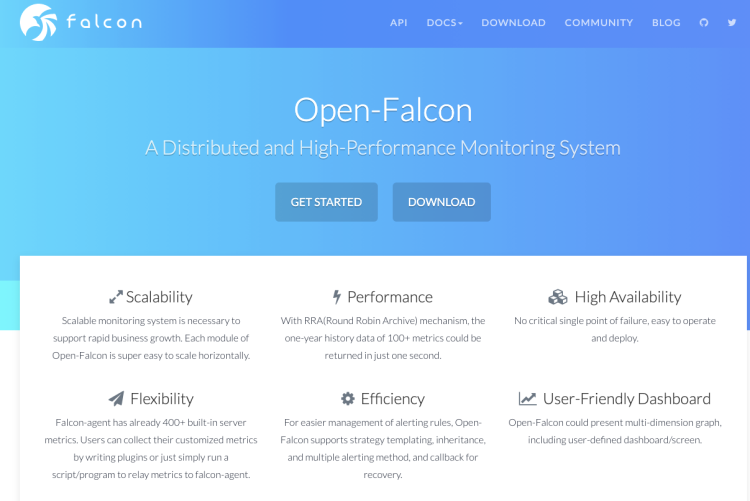

###### Open-Falcon

- **介绍** ：小米 2015 年开源的企业级监控工具，在架构设计上吸取了 Zabbix 的经验，同时很好地解决了 Zabbix 的诸多痛点。Github
  地址：https://github.com/open-falcon 。官方文档：https://book.open-falcon.org/ 。
- **开发语言** ：Go、Python。
- **数据存储** ： 环型数据库，支持对接时序数据库 OpenTSDB。
- **数据采集方式** : 自动发现，支持 falcon-agent、snmp、支持用户主动 push、用户自定义插件支持、opentsdb data model
  like（timestamp、endpoint、metric、key-value tags）。Open-Falcon 和 Zabbix 采用的都是 Push 模型（客户端发送数据给服务端）。
- **数据展示** ：自带展示界面，也可以对接 Grafana。
- **评价** ：用户集中在国内，流行度一般，生态一般。

Open-Falcon 架构图如下：

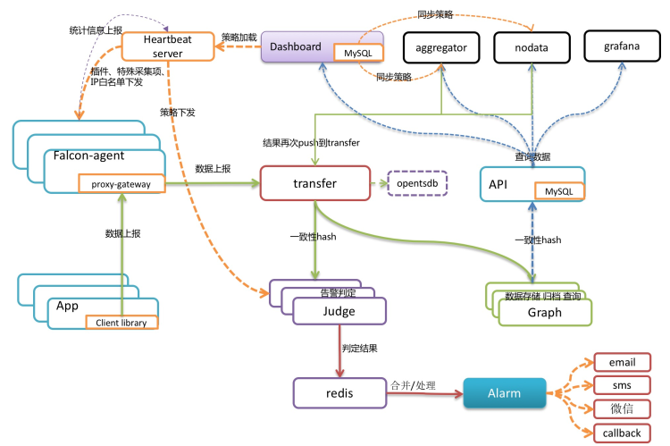

- **Falcon-agent** ：采集模块。类似 Zabbix 的 agent，Kubernetes 自带监控体系中的 cAdvisor，Nagios 中的 Plugin，使用 Go
  语言开发，用于采集主机上的各种指标数据。
- **Hearthbeat server** ：心跳服务。每个 Agent 都会周期性地通过 RPC 方式将自己地状态上报给 HBS，主要包括主机名、主机
  IP、Agent 版本和插件版本，Agent 还会从 HBS 获取自己需要执行的采集任务和自定义插件。
- **Transfer** ：负责监控 agent 发送的监控数据，并对数据进行处理，在过滤后通过一致性 Hash 算法将数据发送到 Judge 或者
  Graph。为了支持存储大量的历史数据，Transfer 还支持 OpenTSDB。Transfer 本身没有状态，可以随意扩展。
- **Jedge** ：告警模块。Transfer 转发到 Judge 的数据会触发用户设定的告警规则，如果满足，则会触发邮件、微信或者回调接口。这里为了避免重复告警，引入了
  Redis 暂存告警，从而完成告警合并和抑制。
- **Graph** ：RRD 数据上报、归档、存储的组件。Graph 在收到数据以后，会以 RRDtool 的数据归档方式存储数据，同时提供 RPC
  方式的监控查询接口。
- **API** ： 查询模块。主要提供查询接口，不但可以从 Grapg 里面读取数据，还可以对接 MySQL，用于保存告警、用户等信息。
- **Dashboard** ： 监控数据展示面板。由 Python 开发而成，提供 Open-Falcon 的数据和告警展示，监控数据来自 Graph，Dashboard
  允许用户自定义监控面板。
- **Aggregator** : 聚合模块。聚合某集群下所有机器的某个指标的值，提供一种集群视角的监控体验。 通过定时从 Graph
  获取数据，按照集群聚合产生新的监控数据并将监控数据发送到 Transfer。

###### Prometheus

- **介绍** ：Prometheus 受启发于 Google 的 Brogmon 监控系统，由前 Google 员工 2015 年正式发布。截止到 2021 年 9 月 2
  日，Prometheus 在 Github 上已经收获了 38.5k+ Star，600+位 Contributors。 Github 地址：https://github.com/prometheus 。
- **开发语言** ：Go
- **数据存储** ： Prometheus 自研一套高性能的时序数据库，并且还支持外接时序数据库。
- **数据采集方式** : Prometheus 的基本原理是通过 HTTP 协议周期性抓取被监控组件的状态，任意组件只要提供对应的 HTTP
  接口就可以接入监控。Prometheus 在收集数据时，采用的 Pull 模型（服务端主动去客户端拉取数据）
- **数据展示** ：自带展示界面，也可以对接 Grafana。
- **评价** ：目前国内外使用最广泛的一个监控系统，生态也非常好，成熟稳定！

**Prometheus 特性 ：**

- 开箱即用的各种服务发现机制，可以**自动发现监控端点**；
- 专为监控指标数据设计的**高性能时序数据库 TSDB**；
- 强大易用的查询语言**PromQL**以及丰富的**聚合函数**；
- 可以配置灵活的告警规则，支持**告警收敛（分组、抑制、静默）、多级路由**等等高级功能；
- **生态完善**，有各种现成的开源 Exporter 实现，实现自定义的监控指标也非常简单。

**Prometheus 基本架构 ：**

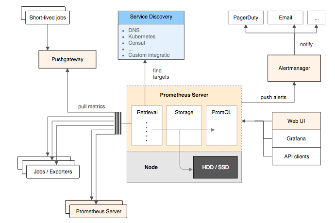

- **Prometheus Server**：核心组件，用于收集、存储监控数据。它同时支持静态配置和通过 Service Discovery
  动态发现来管理监控目标，并从监控目标中获取数据。此外，Prometheus Server 也是一个时序数据库，它将监控数据保存在本地磁盘中，并对外提供自定义的
  PromQL 语言实现对数据的查询和分析。
- **Exporter**：用来采集数据，作用类似于 agent，区别在于 Prometheus 是基于 Pull 方式拉取采集数据的，因此，Exporter 通过 HTTP
  服务的形式将监控数据按照标准格式暴露给 Prometheus Server，社区中已经有大量现成的 Exporter 可以直接使用，用户也可以使用各种语言的
  client library 自定义实现。
- **Push gateway**：主要用于瞬时任务的场景，防止 Prometheus Server 来 pull 数据之前此类 Short-lived jobs 就已经执行完毕了，因此
  job 可以采用 push 的方式将监控数据主动汇报给 Push gateway 缓存起来进行中转。
- 当告警产生时，Prometheus Server 将告警信息推送给 Alert Manager，由它发送告警信息给接收方。
- Prometheus 内置了一个简单的 web 控制台，可以查询配置信息和指标等，而实际应用中我们通常会将 Prometheus 作为 Grafana
  的数据源，创建仪表盘以及查看指标。

推荐一本 Prometheus 的开源书籍[《Prometheus 操作指南》](https://yunlzheng.gitbook.io/prometheus-book/)。

#### 总结

- 监控是一项长期建设的事情，一开始就想做一个 All In One 的监控解决方案，我觉得没有必要。从成本角度考虑，在初期直接使用开源的监控方案即可，先解决有无问题。
- Zabbix、Open-Falcon 和 Prometheus 都支持和 Grafana 做快速集成，想要美观且强大的可视化体验，可以和 Grafana 进行组合。
- Open-Falcon 的核心优势在于数据分片功能，能支撑更多的机器和监控项；Prometheus 则是容器监控方面的标配，有 Google 和 k8s 加持。

### **服务治理：分布式下如何进行日志管理？**

因为日志系统在询问项目经历的时候经常会被问到，所以，我就写了这篇文章。

这是一篇日志系统常见概念的扫盲篇~不会涉及到具体架构的日志系统的搭建过程。旨在帮助对于日志系统不太了解的小伙伴，普及一些日志系统常见的概念。

#### 何为日志？

在我看来，日志就是系统对某些行为的一些记录，这些行为包括：系统出现错误（定位问题、解决问题）、记录关键的业务信息（定位问题、解决问题）、记录操作行为（保障安全）等等。

按照较为官方的话来说：“日志是带时间戳的基于时间序列的机器数据，包括 IT
系统信息（服务器、网络设备、操作系统、应用软件）、物联网各种传感器信息。日志可以反映用户/机器的行为，是真实的数据”。

#### 为何要用日志系统？

没有日志系统之前，我们的日志可能分布在多台服务器上。每次需要查看日志，我们都需要登录每台机器。然后，使用 `grep`、`wc` 等 Linux
命令来对日志进行搜索。这个过程是非常麻烦并且耗时的！并且，日志量不大的时候，这个速度还能忍受。当日志量比较多的时候，整个过程就是非常慢。

从上面我的描述中，你已经发现，没有对日志实现集中管理，主要给我们带来了下面这几点问题：

1. 开发人员登录线上服务器查看日志比较麻烦并且存在安全隐患
2. 日志数据比较分散，难以维护，不方便检索。
3. 日志数量比较大的时候，查询速度比较慢。
4. 无法对日志数据进行可视化展示。

**日志系统就是为了对日志实现集中管理。它也是一个系统，不过主要是负责处理日志罢了。**

#### 一个最基本的日志系统要做哪些事情？

为了解决没有日志系统的时候，存在的一些问题，一直最基本的 **日志系统需要做哪些事情呢？**

1. **采集日志** ：支持多种日志格式以及数据源的采集。

2. **日志数据清洗/处理** ：采集到的原始日志数据需要首先清洗/处理一波。

3. **存储** ：为了方便对清洗后的日志进行处理，我们可以对接多种存储方式比如 ElasticSearch（日志检索） 、Hadoop(离线数据分析)。

4. **展示与搜素** ：支持可视化地展示日志，并且能够根据关键词快速的定位到日志并查看日志上下文。

5. **告警** ：支持对接常见的监控系统。

我专门画了一张图，展示一下日志系统处理日志的一个基本流程。


另外，一些比较高大上的日志系统甚至还支持 **实时分析、离线分析** 等功能

#### ELK 了解么？

ELK 是目前使用的比较多的一个开源的日志系统解决方案，背靠是 [Elastic](https://www.elastic.co/cn/) 这家专注搜索的公司。

##### ELK 老三件套

最原始的时候，ELK 是由 3 个开源项目的首字母构成，分别是 **E**lasticsearch 、**L**ogstash、**K**ibana。

下图是一个最简单的 **ELK 日志系统架构 ：**

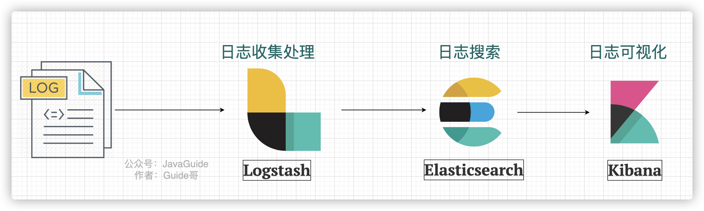

我们分别来介绍一下这些开源项目以及它们在这个日志系统中起到的作用：

- **Logstash** ：Logstash 主要用于日志的搜集、分析和过滤，支持对多种日志类型进行处理。在 ELK 日志系统中，Logstash 负责日志的收集和清洗。
- **Elasticsearch** ：ElasticSearch 一款使用 **Java** 语言开发的搜索引擎，基于 **Lucence**
  。可以解决使用数据库进行模糊搜索时存在的性能问题，提供海量数据近实时的检索体验。在 ELK 日志系统中，Elasticsearch 负责日志的搜素。
- **Kibana** ：Kibana 是专门设计用来与 Elasticsearch 协作的，可以自定义多种表格、柱状图、饼状图、折线图对存储在 Elasticsearch
  中的数据进行深入挖掘分析与可视化。 ELK 日志系统中，Logstash 主要负责对从 Elasticsearch 中搜索出来的日志进行可视化展示。

##### 新一代 ELK 架构

ELK 属于比较老牌的一款日志系统解决方案，这个方案存在一个问题就是：**Logstash 对资源消耗过高。**

于是， Elastic 推出了 Beats 。Beats 基于名为[libbeat](https://github.com/elastic/beats/tree/master/libbeat)的 Go 框架，一共包含
8 位成员。


这个时候，ELK 已经不仅仅代表 **E**lasticsearch 、**L**ogstash、**K**ibana 这 3 个开源项目了。

Elastic 官方将 ELK 重命名为 **Elastic Stack**（Elasticsearch、Kibana、Beats 和 Logstash）。但是，大家目前仍然习惯将其成为
ELK 。

Elastic 的官方文档是这样描述的（由 Chrome 插件 Mate Translate 提供翻译功能）：

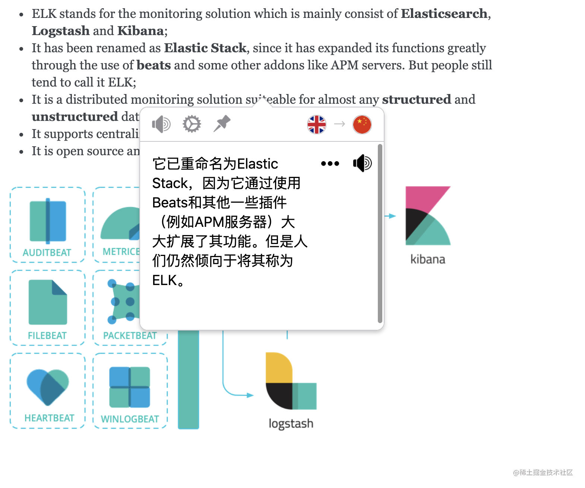

现在的 ELK 架构变成了这样：


Beats 采集的数据可以直接发送到 Elasticsearch 或者在 Logstash 进一步处理之后再发送到 Elasticsearch。

Beats 的诞生，也大大地扩展了老三件套版本的 ELK 的功能。Beats 组件除了能够通过 Filebeat 采集日志之外，还能通过 Metricbeat
采集服务器的各种指标，通过 Packetbeat 采集网络数据。

我们不需要将 Beats 都用上，一般对于一个基本的日志系统，只需要 **Filebeat** 就够了。

根据[Filebeat 官方介绍](https://www.elastic.co/cn/beats/filebeat)：

> Filebeat 是一个轻量型日志采集器。无论您是从安全设备、云、容器、主机还是 OT 进行数据收集，Filebeat
> 都将为您提供一种轻量型方法，用于转发和汇总日志与文件，让简单的事情不再繁杂。

Filebeat 是 Elastic Stack 的一部分，能够与 Logstash、Elasticsearch 和 Kibana 无缝协作。

Filebeat 能够轻松地将数据传送到 Logstash（对日志进行处理）、Elasticsearch（日志检索）、甚至是 Kibana （日志展示）中。

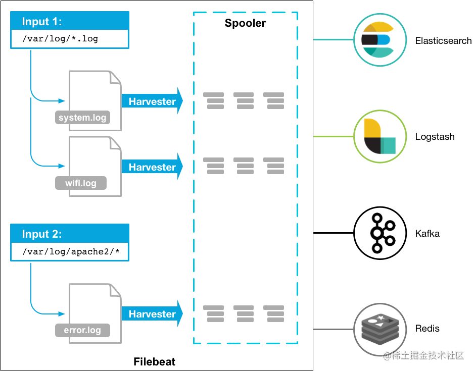

Filebeat 只是对日志进行采集，无法对日志进行处理。日志具体的处理往往还是要交给 Logstash 来做。

更多关于 Filebeat
的内容，你可以看看 [Filebeat 官方文档教程](https://www.elastic.co/guide/en/beats/filebeat/current/index.html)。

##### Filebeat+Logstash+Elasticsearch+Kibana 架构概览

下图一个最基本的 Filebeat+Logstash+Elasticsearch+Kibana
架构图，图片来源于：[《The ELK Stack ( Elasticsearch, Logstash, and Kibana ) Using Filebeat》](https://www.technolush.com/blog/the-elk-stack-using-filebeat)。

Filebeat 替代 Logstash 采集日志，具体的日志处理还是由 Logstash 来做。

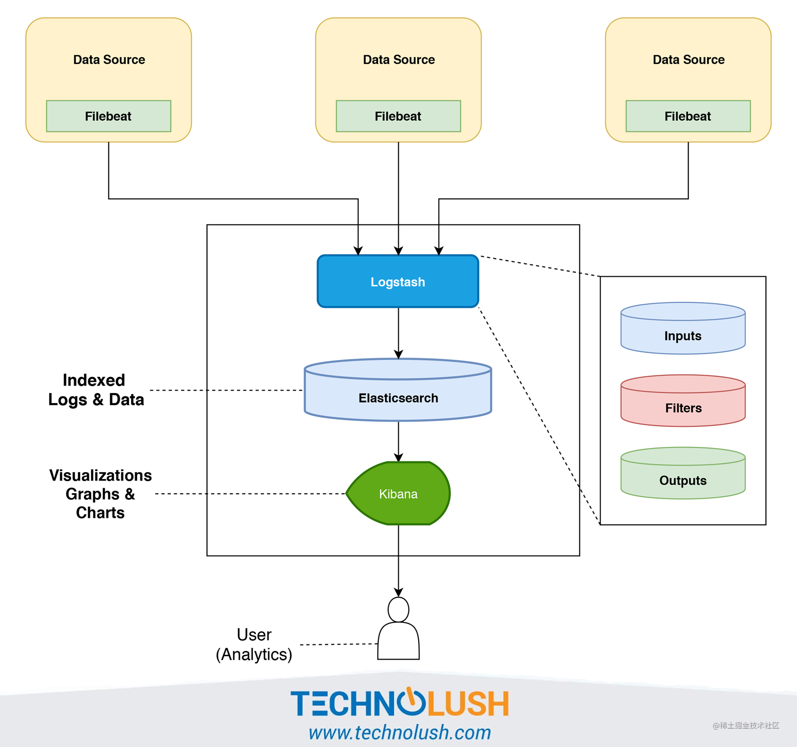

针对上图的日志系统架构图，有下面几个可优化点：

1. 在 Kibana 和用户之间，使用 Nginx 来做反向代理，免用户直接访问 Kibana 服务器，提高安全性。
2. Filebeat 和 Logstash 之间增加一层消息队列比如 Kafka、RabbitMQ。Filebeat 负责将收集到的数据写入消息队列，Logstash
   取出数据做进一步处理。

##### EFK

EFK 中的 F 代表的是 [Fluentd](https://github.com/fluent/fluentd)。下图是一个最简单的 **EFK 日志系统架构 ：**

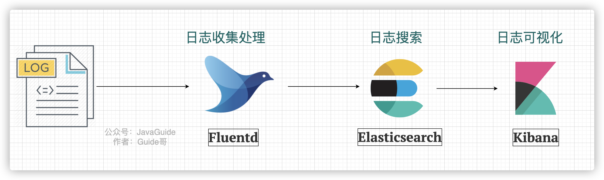

Fluentd 是一款开源的日志收集器，使用 Ruby 编写，其提供的功能和 Logstash
差不多。但是，要更加轻量，性能也更优越，内存占用也更低。具体使用教程，可以参考[《性能优越的轻量级日志收集工具，微软、亚马逊都在用！》](https://mp.weixin.qq.com/s/sXYDIJpIhPsVGNkSCIaNfQ)。

#### 轻量级日志系统 Loki

上面介绍到的 ELK 日志系统方案功能丰富，稳定可靠。不过，对资源的消耗也更大，成本也更高。而且，用过 ELK
日志系统的小伙伴肯定会发现其实很多功能压根都用不上。

因此，就有了 Loki，这是一个 Grafana Labs 团队开源的小巧易用的日志系统，原生支持 Grafana。

并且，Loki 专门为 Prometheus 和 Kubernetes 用户做了相关优化比如 Loki 特别适合存储Kubernetes Pod 日志。

> 项目地址：https://github.com/grafana/loki/

官方的介绍也比较有意思哈！` Like Prometheus,But For Logs`. （类似于 Prometheus 的日志系统，不过主要是为日志服务的）。


根据官网 ，Loki 的架构如下图所示

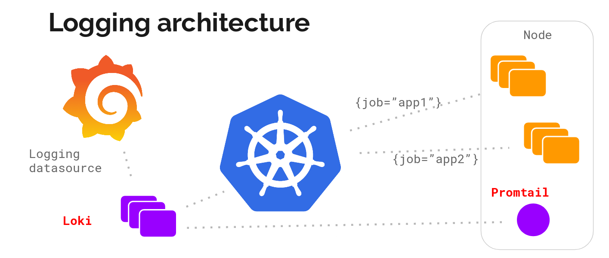

Loki 的整个架构非常简单，主要有 3 个组件组成：

- Loki 是主服务器，负责存储日志和处理查询。
- Promtail 是代理，负责收集日志并将其发送给 Loki 。
- Grafana 用于 UI 展示。

Loki 提供了详细的使用文档，上手相对来说比较容易。并且，目前其流行度还是可以的。你可以很方便在网络上搜索到有关 Loki 的博文。

#### 总结

这篇文章我主要介绍了日志系统相关的知识，包括：

- 何为日志？
- 为何要用日志系统？一个基本的日志系统要做哪些事情？
- ELK、EFK
- 轻量级日志系统 Loki

另外，大部分图片都是我使用 draw.io 来绘制的。一些技术名词的图标，我们可以直接通过 Google 图片搜索即可，方法：
技术名词+图标（示例：Logstash icon）

#### 参考

1. ELK 架构和 Filebeat 工作原理详解：https://developer.ibm.com/zh/articles/os-cn-elk-filebeat/
2. ELK Introduction-elastic 官方 ：https://elastic-stack.readthedocs.io/en/latest/introduction.html
3. ELK Stack Tutorial: Learn Elasticsearch, Logstash, and Kibana ：https://www.guru99.com/elk-stack-tutorial.html
