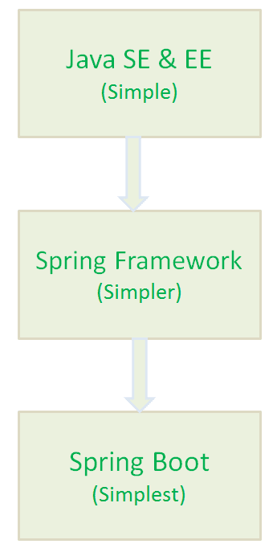
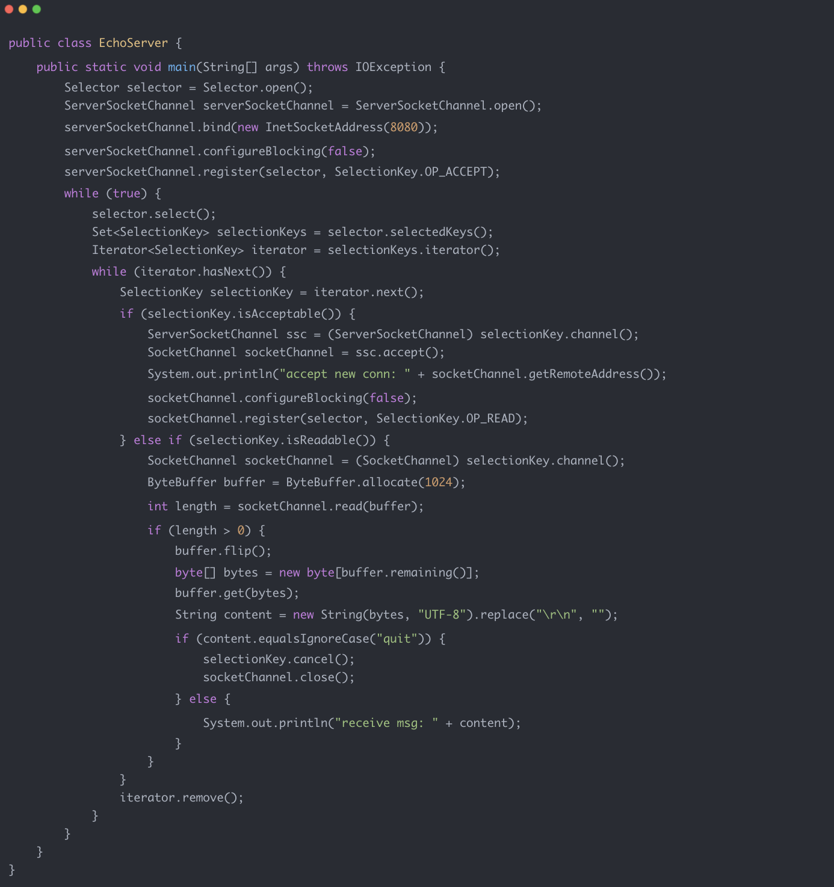
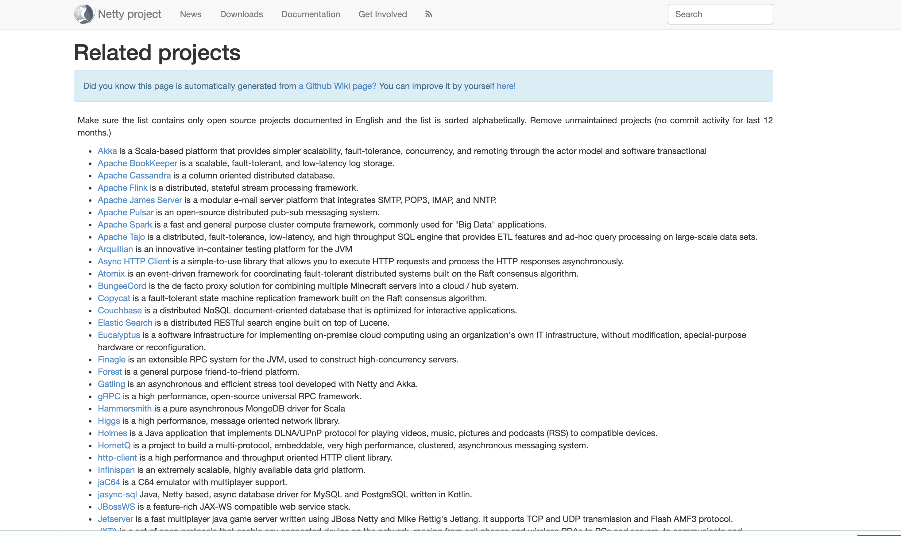
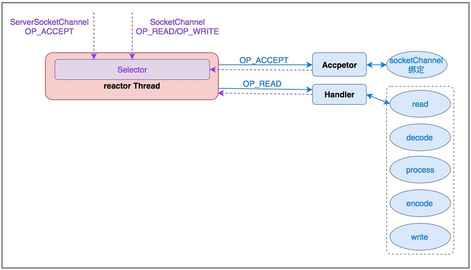

## 常见框架

### **SpringBoot 常见面试题总结**

#### 剖析面试最常见问题之  Spring Boot

市面上关于 Spring Boot 的面试题抄来抄去，毫无价值可言。

这篇文章，我会简单就自己这几年使用 Spring Boot 的一些经验，总结一些常见的面试题供小伙伴们自测和学习。少部分关于
Spring/Spring Boot 的介绍参考了官网，其他皆为原创。

##### 1. 简单介绍一下 Spring?有啥缺点?

Spring 是重量级企业开发框架 **Enterprise JavaBean（EJB）** 的替代品，Spring 为企业级 Java 开发提供了一种相对简单的方法，通过
依赖注入 和 **面向切面编程** ，用简单的 **Java 对象（Plain Old Java Object，POJO）** 实现了 EJB 的功能

**虽然 Spring 的组件代码是轻量级的，但它的配置却是重量级的（需要大量 XML 配置） 。**

为此，Spring 2.5 引入了基于注解的组件扫描，这消除了大量针对应用程序自身组件的显式 XML 配置。Spring 3.0 引入了基于 Java
的配置，这是一种类型安全的可重构配置方式，可以代替 XML。

尽管如此，我们依旧没能逃脱配置的魔爪。开启某些 Spring 特性时，比如事务管理和 Spring MVC，还是需要用 XML 或 Java
进行显式配置。启用第三方库时也需要显式配置，比如基于 Thymeleaf 的 Web 视图。配置 Servlet 和过滤器（比如 Spring
的DispatcherServlet）同样需要在 web.xml 或 Servlet 初始化代码里进行显式配置。组件扫描减少了配置量，Java 配置让它看上去简洁不少，但
Spring 还是需要不少配置。

光配置这些 XML 文件都够我们头疼的了，占用了我们大部分时间和精力。除此之外，相关库的依赖非常让人头疼，不同库之间的版本冲突也非常常见。

##### 2. 为什么要有 SpringBoot?

Spring 旨在简化 J2EE 企业应用程序开发。Spring Boot 旨在简化 Spring 开发（减少配置文件，开箱即用！）。



##### 3. 说出使用 Spring Boot 的主要优点

1. 开发基于 Spring 的应用程序很容易。
2. Spring Boot 项目所需的开发或工程时间明显减少，通常会提高整体生产力。
3. Spring Boot 不需要编写大量样板代码、XML 配置和注释。
4. Spring 引导应用程序可以很容易地与 Spring 生态系统集成，如 Spring JDBC、Spring ORM、Spring Data、Spring Security 等。
5. Spring Boot 遵循“固执己见的默认配置”，以减少开发工作（默认配置可以修改）。
6. Spring Boot 应用程序提供嵌入式 HTTP 服务器，如 Tomcat 和 Jetty，可以轻松地开发和测试 web 应用程序。（这点很赞！普通运行
   Java 程序的方式就能运行基于 Spring Boot web 项目，省事很多）
7. Spring Boot 提供命令行接口(CLI)工具，用于开发和测试 Spring Boot 应用程序，如 Java 或 Groovy。
8. Spring Boot 提供了多种插件，可以使用内置工具(如 Maven 和 Gradle)开发和测试 Spring Boot 应用程序。

##### 4. 什么是 Spring Boot Starters?

Spring Boot Starters 是一系列依赖关系的集合，因为它的存在，项目的依赖之间的关系对我们来说变的更加简单了。

举个例子：在没有 Spring Boot Starters 之前，我们开发 REST 服务或 Web 应用程序时; 我们需要使用像 Spring MVC，Tomcat 和
Jackson 这样的库，这些依赖我们需要手动一个一个添加。但是，有了 Spring Boot Starters 我们只需要一个只需添加一个*
*spring-boot-starter-web**一个依赖就可以了，这个依赖包含的子依赖中包含了我们开发 REST 服务需要的所有依赖。

```xml

<dependency>
    <groupId>org.springframework.boot</groupId>
    <artifactId>spring-boot-starter-web</artifactId>
</dependency>
```

##### 5. Spring Boot 支持哪些内嵌 Servlet 容器？

Spring Boot 支持以下嵌入式 Servlet 容器:

| Name         | Servlet Version |
|--------------|-----------------|
| Tomcat 9.0   | 4.0             |
| Jetty 9.4    | 3.1             |
| Undertow 2.0 | 4.0             |

您还可以将 Spring 引导应用程序部署到任何 Servlet 3.1+兼容的 Web 容器中。

这就是你为什么可以通过直接像运行 普通 Java 项目一样运行 SpringBoot 项目。这样的确省事了很多，方便了我们进行开发，降低了学习难度。

##### 6. 如何在 Spring Boot 应用程序中使用 Jetty 而不是 Tomcat?

Spring Boot （spring-boot-starter-web）使用 Tomcat 作为默认的嵌入式 servlet 容器, 如果你想使用 Jetty
的话只需要修改pom.xml(Maven)或者build.gradle(Gradle)就可以了。

**Maven:**

```xml
<!--从Web启动器依赖中排除Tomcat-->
<dependency>
    <groupId>org.springframework.boot</groupId>
    <artifactId>spring-boot-starter-web</artifactId>
    <exclusions>
        <exclusion>
            <groupId>org.springframework.boot</groupId>
            <artifactId>spring-boot-starter-tomcat</artifactId>
        </exclusion>
    </exclusions>
</dependency>
        <!--添加Jetty依赖-->
<dependency>
<groupId>org.springframework.boot</groupId>
<artifactId>spring-boot-starter-jetty</artifactId>
</dependency>
```

**Gradle:**

```groovy
compile("org.springframework.boot:spring-boot-starter-web") {
     exclude group: 'org.springframework.boot', module: 'spring-boot-starter-tomcat'
}
compile("org.springframework.boot:spring-boot-starter-jetty")
```

说个题外话，从上面可以看出使用 Gradle 更加简洁明了，但是国内目前还是 Maven 使用的多一点，我个人觉得 Gradle 在很多方面都要好很多。

##### 7. 介绍一下@SpringBootApplication 注解

```java
package org.springframework.boot.autoconfigure;
@Target(ElementType.TYPE)
@Retention(RetentionPolicy.RUNTIME)
@Documented
@Inherited
@SpringBootConfiguration
@EnableAutoConfiguration
@ComponentScan(excludeFilters = {
		@Filter(type = FilterType.CUSTOM, classes = TypeExcludeFilter.class),
		@Filter(type = FilterType.CUSTOM, classes = AutoConfigurationExcludeFilter.class) })
public @interface SpringBootApplication {
   ......
}
```

```java
package org.springframework.boot;
@Target(ElementType.TYPE)
@Retention(RetentionPolicy.RUNTIME)
@Documented
@Configuration
public @interface SpringBootConfiguration {

}
```

可以看出大概可以把 `@SpringBootApplication`看作是` @Configuration、@EnableAutoConfiguration、@ComponentScan `注解的集合。根据
SpringBoot 官网，这三个注解的作用分别是：

- `@EnableAutoConfiguration`：启用 SpringBoot 的自动配置机制
- `@ComponentScan`： 扫描被`@Component` (`@Service,@Controller`)注解的` bean`，注解默认会扫描该类所在的包下所有的类。
- `@Configuration`：允许在上下文中注册额外的` bean` 或导入其他配置类

##### 8. Spring Boot 的自动配置是如何实现的?

这个是因为`@SpringBootApplication`注解的原因，在上一个问题中已经提到了这个注解。我们知道 `@SpringBootApplication`
看作是 `@Configuration、@EnableAutoConfiguration、@ComponentScan `注解的集合。

- `@EnableAutoConfiguration`：启用 SpringBoot 的自动配置机制
- `@ComponentScan`： 扫描被`@Component (@Service,@Controller)`注解的 bean，注解默认会扫描该类所在的包下所有的类。
- `@Configuration`：允许在上下文中注册额外的 bean 或导入其他配置类

@EnableAutoConfiguration是启动自动配置的关键，源码如下(建议自己打断点调试，走一遍基本的流程)：

```java
import java.lang.annotation.Documented;
import java.lang.annotation.ElementType;
import java.lang.annotation.Inherited;
import java.lang.annotation.Retention;
import java.lang.annotation.RetentionPolicy;
import java.lang.annotation.Target;
import org.springframework.context.annotation.Import;

@Target({ElementType.TYPE})
@Retention(RetentionPolicy.RUNTIME)
@Documented
@Inherited
@AutoConfigurationPackage
@Import({AutoConfigurationImportSelector.class})
public @interface EnableAutoConfiguration {
    String ENABLED_OVERRIDE_PROPERTY = "spring.boot.enableautoconfiguration";

    Class<?>[] exclude() default {};

    String[] excludeName() default {};
}
```

`@EnableAutoConfiguration` 注解通过 Spring 提供的 `@Import `注解导入了`AutoConfigurationImportSelector`类（`@Import`
注解可以导入配置类或者 Bean 到当前类中）。

`AutoConfigurationImportSelector`类中`getCandidateConfigurations`方法会将所有自动配置类的信息以` List `的形式返回。这些配置信息会被
Spring 容器作 `bean `来管理。

```java
	protected List<String> getCandidateConfigurations(AnnotationMetadata metadata, AnnotationAttributes attributes) {
		List<String> configurations = SpringFactoriesLoader.loadFactoryNames(getSpringFactoriesLoaderFactoryClass(),
				getBeanClassLoader());
		Assert.notEmpty(configurations, "No auto configuration classes found in META-INF/spring.factories. If you "
				+ "are using a custom packaging, make sure that file is correct.");
		return configurations;
	}
```

自动配置信息有了，那么自动配置还差什么呢？

`@Conditional `注解。`@ConditionalOnClass`(指定的类必须存在于类路径下),`@ConditionalOnBean`(容器中是否有指定的 Bean)
等等都是对`@Conditional`注解的扩展。

拿 Spring Security 的自动配置举个例子:`SecurityAutoConfiguration`中导入了`WebSecurityEnablerConfiguration`
类，`WebSecurityEnablerConfiguration`源代码如下：

```java
@Configuration
@ConditionalOnBean(WebSecurityConfigurerAdapter.class)
@ConditionalOnMissingBean(name = BeanIds.SPRING_SECURITY_FILTER_CHAIN)
@ConditionalOnWebApplication(type = ConditionalOnWebApplication.Type.SERVLET)
@EnableWebSecurity
public class WebSecurityEnablerConfiguration {

}
```

`WebSecurityEnablerConfiguration`类中使用`@ConditionalOnBean`指定了容器中必须还有`WebSecurityConfigurerAdapter`
类或其实现类。所以，一般情况下 Spring Security 配置类都会去实现 `WebSecurityConfigurerAdapter`，这样自动将配置就完成了。

##### 9. 开发 RESTful Web 服务常用的注解有哪些？

Spring Bean 相关：

- @Autowired : 自动导入对象到类中，被注入进的类同样要被 Spring 容器管理。
- @RestController : @RestController注解是@Controller和@ResponseBody的合集,表示这是个控制器 bean,并且是将函数的返回值直
  接填入 HTTP 响应体中,是 REST 风格的控制器。
- @Component ：通用的注解，可标注任意类为 Spring 组件。如果一个 Bean 不知道属于哪个层，可以使用@Component 注解标注。
- @Repository : 对应持久层即 Dao 层，主要用于数据库相关操作。
- @Service : 对应服务层，主要涉及一些复杂的逻辑，需要用到 Dao 层。
- @Controller : 对应 Spring MVC 控制层，主要用于接受用户请求并调用 Service 层返回数据给前端页面。

**处理常见的 HTTP 请求类型：**

- @GetMapping : GET 请求、
- @PostMapping : POST 请求。
- @PutMapping : PUT 请求。
- @DeleteMapping : DELETE 请求。

前后端传值：

- @RequestParam以及@Pathvairable ：@PathVariable用于获取路径参数，@RequestParam用于获取查询参数。
- @RequestBody ：用于读取 Request 请求（可能是 POST,PUT,DELETE,GET 请求）的 body 部分并且 Content-Type 为 application/json
  格式的数据，接收到数据之后会自动将数据绑定到 Java 对象上去。系统会使用HttpMessageConverter或者自定义的HttpMessageConverter将请求的
  body 中的 json 字符串转换为 java 对象。

详细介绍可以查看这篇文章：[《Spring/Spring Boot 常用注解总结》](https://javaguide.cn/system-design/framework/spring/spring-common-annotations.html) 。

##### 10. Spirng Boot 常用的两种配置文件

我们可以通过 application.properties或者 application.yml 对 Spring Boot 程序进行简单的配置。如果，你不进行配置的话，就是使用的默认配置。

##### 11. 什么是 YAML？YAML 配置的优势在哪里 ?

YAML 是一种人类可读的数据序列化语言。它通常用于配置文件。与属性文件相比，如果我们想要在配置文件中添加复杂的属性，YAML
文件就更加结构化，而且更少混淆。可以看出 YAML 具有分层配置数据。

相比于 Properties 配置的方式，YAML 配置的方式更加直观清晰，简介明了，有层次感。


但是，YAML 配置的方式有一个缺点，那就是不支持 @PropertySource 注解导入自定义的 YAML 配置。

##### 12. Spring Boot 常用的读取配置文件的方法有哪些？

我们要读取的配置文件application.yml 内容如下：

```yaml
wuhan2020: 2020年初武汉爆发了新型冠状病毒，疫情严重，但是，我相信一切都会过去！武汉加油！中国加油！

my-profile:
  name: Guide哥
  email: koushuangbwcx@163.com

library:
  location: 湖北武汉加油中国加油
  books:
    - name: 天才基本法
      description: 二十二岁的林朝夕在父亲确诊阿尔茨海默病这天，得知自己暗恋多年的校园男神裴之即将出国深造的消息——对方考取的学校，恰是父亲当年为她放弃的那所。
    - name: 时间的秩序
      description: 为什么我们记得过去，而非未来？时间“流逝”意味着什么？是我们存在于时间之内，还是时间存在于我们之中？卡洛·罗韦利用诗意的文字，邀请我们思考这一亘古难题——时间的本质。
    - name: 了不起的我
      description: 如何养成一个新习惯？如何让心智变得更成熟？如何拥有高质量的关系？ 如何走出人生的艰难时刻？
```

###### 12.1. 通过 @value 读取比较简单的配置信息

使用 `@Value("${property}") `读取比较简单的配置信息：

```java
@Value("${wuhan2020}")
String wuhan2020;
```

> **需要注意的是` @value`这种方式是不被推荐的，Spring 比较建议的是下面几种读取配置信息的方式。**

###### 12.2. 通过@ConfigurationProperties读取并与 bean 绑定

> **LibraryProperties 类上加了 `@Component` 注解，我们可以像使用普通 bean 一样将其注入到类中使用。**

```java
import lombok.Getter;
import lombok.Setter;
import lombok.ToString;
import org.springframework.boot.context.properties.ConfigurationProperties;
import org.springframework.context.annotation.Configuration;
import org.springframework.stereotype.Component;

import java.util.List;

@Component
@ConfigurationProperties(prefix = "library")
@Setter
@Getter
@ToString
class LibraryProperties {
    private String location;
    private List<Book> books;

    @Setter
    @Getter
    @ToString
    static class Book {
        String name;
        String description;
    }
}
```

这个时候你就可以像使用普通 bean 一样，将其注入到类中使用：

```java
package cn.javaguide.readconfigproperties;

import org.springframework.beans.factory.InitializingBean;
import org.springframework.boot.SpringApplication;
import org.springframework.boot.autoconfigure.SpringBootApplication;

/**
 * @author shuang.kou
 */
@SpringBootApplication
public class ReadConfigPropertiesApplication implements InitializingBean {

    private final LibraryProperties library;

    public ReadConfigPropertiesApplication(LibraryProperties library) {
        this.library = library;
    }

    public static void main(String[] args) {
        SpringApplication.run(ReadConfigPropertiesApplication.class, args);
    }

    @Override
    public void afterPropertiesSet() {
        System.out.println(library.getLocation());
        System.out.println(library.getBooks());    }
}
```

控制台输出：

```
湖北武汉加油中国加油
[LibraryProperties.Book(name=天才基本法, description........]
```

###### 12.3. 通过@ConfigurationProperties读取并校验

我们先将`application.yml`修改为如下内容，明显看出这不是一个正确的 email 格式：

```yaml
my-profile:
  name: Guide哥
  email: koushuangbwcx@
```

> **ProfileProperties 类没有加 @Component 注解。我们在我们要使用ProfileProperties
的地方使用@EnableConfigurationProperties注册我们的配置 bean：**

```java
import lombok.Getter;
import lombok.Setter;
import lombok.ToString;
import org.springframework.boot.context.properties.ConfigurationProperties;
import org.springframework.stereotype.Component;
import org.springframework.validation.annotation.Validated;

import javax.validation.constraints.Email;
import javax.validation.constraints.NotEmpty;

/**
* @author shuang.kou
*/
@Getter
@Setter
@ToString
@ConfigurationProperties("my-profile")
@Validated
public class ProfileProperties {
   @NotEmpty
   private String name;

   @Email
   @NotEmpty
   private String email;

   //配置文件中没有读取到的话就用默认值
   private Boolean handsome = Boolean.TRUE;

}
```

具体使用：

```java
package cn.javaguide.readconfigproperties;

import org.springframework.beans.factory.InitializingBean;
import org.springframework.beans.factory.annotation.Value;
import org.springframework.boot.SpringApplication;
import org.springframework.boot.autoconfigure.SpringBootApplication;
import org.springframework.boot.context.properties.EnableConfigurationProperties;

/**
 * @author shuang.kou
 */
@SpringBootApplication
@EnableConfigurationProperties(ProfileProperties.class)
public class ReadConfigPropertiesApplication implements InitializingBean {
    private final ProfileProperties profileProperties;

    public ReadConfigPropertiesApplication(ProfileProperties profileProperties) {
        this.profileProperties = profileProperties;
    }

    public static void main(String[] args) {
        SpringApplication.run(ReadConfigPropertiesApplication.class, args);
    }

    @Override
    public void afterPropertiesSet() {
        System.out.println(profileProperties.toString());
    }
}
```

因为我们的邮箱格式不正确，所以程序运行的时候就报错，根本运行不起来，保证了数据类型的安全性：

```
Binding to target org.springframework.boot.context.properties.bind.BindException: Failed to bind properties under 'my-profile' to cn.javaguide.readconfigproperties.ProfileProperties failed:

    Property: my-profile.email
    Value: koushuangbwcx@
    Origin: class path resource [application.yml]:5:10
    Reason: must be a well-formed email address
```

我们把邮箱测试改为正确的之后再运行，控制台就能成功打印出读取到的信息：

```
ProfileProperties(name=Guide哥, email=koushuangbwcx@163.com, handsome=true)
```

###### 12.4. @PropertySource读取指定的 properties 文件

```java
import lombok.Getter;
import lombok.Setter;
import org.springframework.beans.factory.annotation.Value;
import org.springframework.context.annotation.PropertySource;
import org.springframework.stereotype.Component;

@Component
@PropertySource("classpath:website.properties")
@Getter
@Setter
class WebSite {
    @Value("${url}")
    private String url;
}
```

使用：

```java
@Autowired
private WebSite webSite;

System.out.println(webSite.getUrl());//https://javaguide.cn/
```

##### 13. Spring Boot 加载配置文件的优先级了解么？

Spring 读取配置文件也是有优先级的，直接上图：


更对内容请查看官方文档：https://docs.spring.io/spring-boot/docs/current/reference/html/spring-boot-features.html#boot-features-external-config

##### 14. 常用的 Bean 映射工具有哪些？

我们经常在代码中会对一个数据结构封装成DO、SDO、DTO、VO等，而这些Bean中的大部分属性都是一样的，所以使用属性拷贝类工具可以帮助我们节省大量的
set 和 get 操作。

常用的 Bean 映射工具有：Spring BeanUtils、Apache BeanUtils、MapStruct、ModelMapper、Dozer、Orika、JMapper 。

由于 Apache BeanUtils 、Dozer 、ModelMapper 性能太差，所以不建议使用。MapStruct 性能更好而且使用起来比较灵活，是一个比较不错的选择。

##### 15. Spring Boot 如何监控系统实际运行状况？

我们可以使用 Spring Boot Actuator 来对 Spring Boot 项目进行简单的监控。

```xml

<dependency>
    <groupId>org.springframework.boot</groupId>
    <artifactId>spring-boot-starter-actuator</artifactId>
</dependency>
```

集成了这个模块之后，你的 Spring Boot 应用程序就自带了一些开箱即用的获取程序运行时的内部状态信息的 API。

比如通过 GET 方法访问 `/health `接口，你就可以获取应用程序的健康指标。

##### 16. Spring Boot 如何做请求参数校验？

数据的校验的重要性就不用说了，即使在前端对数据进行校验的情况下，我们还是要对传入后端的数据再进行一遍校验，避免用户绕过浏览器直接通过一些
HTTP 工具直接向后端请求一些违法数据。

Spring Boot 程序做请求参数校验的话只需要spring-boot-starter-web 依赖就够了，它的子依赖包含了我们所需要的东西。

###### 16.1. 校验注解

**JSR 提供的校验注解:**

- @Null 被注释的元素必须为 null
- @NotNull 被注释的元素必须不为 null
- @AssertTrue 被注释的元素必须为 true
- @AssertFalse 被注释的元素必须为 false
- @Min(value) 被注释的元素必须是一个数字，其值必须大于等于指定的最小值
- @Max(value) 被注释的元素必须是一个数字，其值必须小于等于指定的最大值
- @DecimalMin(value) 被注释的元素必须是一个数字，其值必须大于等于指定的最小值
- @DecimalMax(value) 被注释的元素必须是一个数字，其值必须小于等于指定的最大值
- @Size(max=, min=) 被注释的元素的大小必须在指定的范围内
- @Digits (integer, fraction) 被注释的元素必须是一个数字，其值必须在可接受的范围内
- @Past 被注释的元素必须是一个过去的日期
- @Future 被注释的元素必须是一个将来的日期
- @Pattern(regex=,flag=) 被注释的元素必须符合指定的正则表达式

**Hibernate Validator 提供的校验注解：**

- @NotBlank(message =) 验证字符串非 null，且长度必须大于 0
- @Email 被注释的元素必须是电子邮箱地址
- @Length(min=,max=) 被注释的字符串的大小必须在指定的范围内
- @NotEmpty 被注释的字符串的必须非空
- @Range(min=,max=,message=) 被注释的元素必须在合适的范围内

**使用示例：**

```java
@Data
@AllArgsConstructor
@NoArgsConstructor
public class Person {

    @NotNull(message = "classId 不能为空")
    private String classId;

    @Size(max = 33)
    @NotNull(message = "name 不能为空")
    private String name;

    @Pattern(regexp = "((^Man$|^Woman$|^UGM$))", message = "sex 值不在可选范围")
    @NotNull(message = "sex 不能为空")
    private String sex;

    @Email(message = "email 格式不正确")
    @NotNull(message = "email 不能为空")
    private String email;

}
```

###### 16.2. 验证请求体(RequestBody)

我们在需要验证的参数上加上了`@Valid `注解，如果验证失败，它将抛出`MethodArgumentNotValidException`。默认情况下，Spring
会将此异常转换为 HTTP Status 400（错误请求）。

```java
@RestController
@RequestMapping("/api")
public class PersonController {

    @PostMapping("/person")
    public ResponseEntity<Person> getPerson(@RequestBody @Valid Person person) {
        return ResponseEntity.ok().body(person);
    }
}
```

###### 16.3. 验证请求参数(Path Variables 和 Request Parameters)

一定一定不要忘记在类上加上 Validated 注解了，这个参数可以告诉 Spring 去校验方法参数。

```java
@RestController
@RequestMapping("/api")
@Validated
public class PersonController {

    @GetMapping("/person/{id}")
    public ResponseEntity<Integer> getPersonByID(@Valid @PathVariable("id") @Max(value = 5,message = "超过 id 的范围了") Integer id) {
        return ResponseEntity.ok().body(id);
    }

    @PutMapping("/person")
    public ResponseEntity<String> getPersonByName(@Valid @RequestParam("name") @Size(max = 6,message = "超过 name 的范围了") String name) {
        return ResponseEntity.ok().body(name);
    }
}
```

更多内容请参考我的原创： [如何在 Spring/Spring Boot 中做参数校验？你需要了解的都在这里！](https://javaguide.cn/system-design/framework/spring/spring-common-annotations.html)

##### 17. 如何使用 Spring Boot 实现全局异常处理？

可以使用 @ControllerAdvice 和 @ExceptionHandler 处理全局异常。

更多内容请参考我的原创 ：[Spring Boot 异常处理在实际项目中的应用](https://snailclimb.gitee.io/springboot-guide/#/./docs/advanced/springboot-handle-exception-plus)

##### 18. Spring Boot 中如何实现定时任务 ?

我们使用 @Scheduled 注解就能很方便地创建一个定时任务。

```java
@Component
public class ScheduledTasks {
    private static final Logger log = LoggerFactory.getLogger(ScheduledTasks.class);
    private static final SimpleDateFormat dateFormat = new SimpleDateFormat("HH:mm:ss");

    /**
     * fixedRate：固定速率执行。每5秒执行一次。
     */
    @Scheduled(fixedRate = 5000)
    public void reportCurrentTimeWithFixedRate() {
        log.info("Current Thread : {}", Thread.currentThread().getName());
        log.info("Fixed Rate Task : The time is now {}", dateFormat.format(new Date()));
    }
}
```

单纯依靠 `@Scheduled` 注解 还不行，我们还需要在 SpringBoot 中我们只需要在启动类上加上`@EnableScheduling`
注解，这样才可以启动定时任务。`@EnableScheduling `注解的作用是发现注解 `@Scheduled `的任务并在后台执行该任务。

### **Netty 常见面试题总结**

很多小伙伴搞不清楚为啥要学习 Netty ，正式今天这篇文章开始之前，简单说一下自己的看法：

- Netty 基于 NIO （NIO 是一种同步非阻塞的 I/O 模型，在 Java 1.4 中引入了 NIO ），使用 Netty 可以极大地简化 TCP 和 UDP
  套接字服务器等网络编程，并且性能以及安全性等很多方面都非常优秀。
- 我们平常经常接触的 Dubbo、RocketMQ、Elasticsearch、gRPC、Spark 等等热门开源项目都用到了 Netty。
- 大部分微服务框架底层涉及到网络通信的部分都是基于 Netty 来做的，比如说 Spring Cloud 生态系统中的网关 Spring Cloud
  Gateway。

简单总结一下和 Netty 相关问题。

#### BIO,NIO 和 AIO 有啥区别？

👨‍💻面试官 ：先来简单介绍一下 BIO,NIO 和 AIO 3 者的区别吧！

🙋 我 ：好的！


- **BIO (Blocking I/O):** 同步阻塞 I/O 模式，数据的读取写入必须阻塞在一个线程内等待其完成。在客户端连接数量不高的情况下，是没问题的。但是，当面对十万甚至百万级连接的时候，传统的
  BIO 模型是无能为力的。因此，我们需要一种更高效的 I/O 处理模型来应对更高的并发量。
- **NIO (Non-blocking/New I/O):** NIO 是一种同步非阻塞的 I/O 模型，于 Java 1.4 中引入，对应 java.nio包，提供了 Channel ,
  Selector，Buffer 等抽象。NIO 中的 N 可以理解为 Non-blocking，不单纯是 New。它支持面向缓冲的，基于通道的 I/O 操作方法。 NIO
  提供了与传统 BIO 模型中的 Socket 和 ServerSocket 相对应的 SocketChannel 和 ServerSocketChannel
  两种不同的套接字通道实现,两种通道都支持阻塞和非阻塞两种模式。对于高负载、高并发的（网络）应用，应使用 NIO 的非阻塞模式来开发
- **AIO (Asynchronous I/O):** AIO 也就是 NIO 2。在 Java 7 中引入了 NIO 的改进版 NIO 2,它是异步非阻塞的 IO 模型。异步 IO
  是基于事件和回调机制实现的，也就是应用操作之后会直接返回，不会堵塞在那里，当后台处理完成，操作系统会通知相应的线程进行后续的操作。AIO
  是异步 IO 的缩写，虽然 NIO 在网络操作中，提供了非阻塞的方法，但是 NIO 的 IO 行为还是同步的。对于 NIO 来说，我们的业务线程是在
  IO 操作准备好时，得到通知，接着就由这个线程自行进行 IO 操作，IO 操作本身是同步的。查阅网上相关资料，我发现就目前来说 AIO
  的应用还不是很广泛，Netty 之前也尝试使用过 AIO，不过又放弃了。

关于 IO
模型更详细的介绍，你可以看这篇文章：[《常见的 IO 模型有哪些？Java 中的 BIO、NIO、AIO 有啥区别？》](https://javaguide.cn/java/io/io-model.html)
这篇文章。

#### Netty 是什么？

👨‍💻面试官 ：那你再来介绍一下自己对 Netty 的认识吧！小伙子。

🙋 我 ：好的！那我就简单用 3 点来概括一下 Netty 吧！

1. Netty 是一个 基于 NIO 的 client-server(客户端服务器)框架，使用它可以快速简单地开发网络应用程序。
2. 它极大地简化并优化了 TCP 和 UDP 套接字服务器等网络编程,并且性能以及安全性等很多方面甚至都要更好。
3. 支持多种协议 如 FTP，SMTP，HTTP 以及各种二进制和基于文本的传统协议。

用官方的总结就是：**Netty 成功地找到了一种在不妥协可维护性和性能的情况下实现易于开发，性能，稳定性和灵活性的方法。**

网络编程我愿意称中 Netty 为王 。

#### 为啥不直接用 NIO 呢?

👨‍💻面试官 ：你上面也说了 Netty 基于 NIO，那为啥不直接用 NIO 呢?。

不用 NIO 主要是因为 NIO 的编程模型复杂而且存在一些 BUG，并且对编程功底要求比较高。下图就是一个典型的使用 NIO 进行编程的案例：



而且，NIO 在面对断连重连、包丢失、粘包等问题时处理过程非常复杂。Netty 的出现正是为了解决这些问题，更多关于 Netty 的特点可以看下面的内容。

#### 为什么要用 Netty？

👨‍💻面试官 ：为什么要用 Netty 呢？能不能说一下自己的看法。

🙋 我 ：因为 Netty 具有下面这些优点，并且相比于直接使用 JDK 自带的 NIO 相关的 API 来说更加易用。

- 统一的 API，支持多种传输类型，阻塞和非阻塞的。
- 简单而强大的线程模型。
- 自带编解码器解决 TCP 粘包/拆包问题。
- 自带各种协议栈。
- 真正的无连接数据包套接字支持。
- 比直接使用 Java 核心 API 有更高的吞吐量、更低的延迟、更低的资源消耗和更少的内存复制。
- 安全性不错，有完整的 SSL/TLS 以及 StartTLS 支持。
- 社区活跃
- 成熟稳定，经历了大型项目的使用和考验，而且很多开源项目都使用到了 Netty， 比如我们经常接触的 Dubbo、RocketMQ 等等。
- ......

#### Netty 应用场景了解么？

👨‍💻面试官 ：能不能通俗地说一下使用 Netty 可以做什么事情？

🙋 我 ：凭借自己的了解，简单说一下吧！理论上来说，NIO 可以做的事情 ，使用 Netty 都可以做并且更好。Netty 主要用来做网络通信 :

1. 作为 RPC 框架的网络通信工具 ： 我们在分布式系统中，不同服务节点之间经常需要相互调用，这个时候就需要 RPC
   框架了。不同服务节点的通信是如何做的呢？可以使用 Netty 来做。比如我调用另外一个节点的方法的话，至少是要让对方知道我调用的是哪个类中的哪个方法以及相关参数吧！
2. 实现一个自己的 HTTP 服务器 ：通过 Netty 我们可以自己实现一个简单的 HTTP 服务器，这个大家应该不陌生。说到 HTTP 服务器的话，作为
   Java 后端开发，我们一般使用 Tomcat 比较多。一个最基本的 HTTP 服务器可要以处理常见的 HTTP Method 的请求，比如 POST 请求、GET
   请求等等。
3. 实现一个即时通讯系统 ： 使用 Netty 我们可以实现一个可以聊天类似微信的即时通讯系统，这方面的开源项目还蛮多的，可以自行去
   Github 找一找。
4. 实现消息推送系统 ：市面上有很多消息推送系统都是基于 Netty 来做的。
5. ......

#### 那些开源项目用到了 Netty?

我们平常经常接触的 Dubbo、RocketMQ、Elasticsearch、gRPC 等等都用到了 Netty。

可以说大量的开源项目都用到了 Netty，所以掌握 Netty 有助于你更好的使用这些开源项目并且让你有能力对其进行二次开发。

实际上还有很多很多优秀的项目用到了 Netty,Netty
官方也做了统计，统计结果在这里：https://netty.io/wiki/related-projects.html 。



#### 介绍一下 Netty 的核心组件？

👨‍💻面试官 ：Netty 核心组件有哪些？分别有什么作用？

🙋 我 ：表面上，嘴上开始说起 Netty 的核心组件有哪些，实则，内心已经开始 mmp 了，深度怀疑这面试官是存心搞我啊！

简单介绍 Netty 最核心的一些组件（对于每一个组件这里不详细介绍）。通过下面这张图你可以将我提到的这些 Netty 核心组件串联起来。


##### Bytebuf（字节容器）

**网络通信最终都是通过字节流进行传输的。 ByteBuf 就是 Netty 提供的一个字节容器，其内部是一个字节数组。** 当我们通过 Netty
传输数据的时候，就是通过 ByteBuf 进行的。

我们可以将 ByteBuf 看作是 Netty 对 Java NIO 提供了 ByteBuffer 字节容器的封装和抽象。

有很多小伙伴可能就要问了 ： **为什么不直接使用 Java NIO 提供的 ByteBuffer 呢？**

因为 ByteBuffer 这个类使用起来过于复杂和繁琐。

##### Bootstrap 和 ServerBootstrap（启动引导类）

**`Bootstrap `是客户端的启动引导类/辅助类**，具体使用方法如下：

```java
        EventLoopGroup group = new NioEventLoopGroup();
        try {
            //创建客户端启动引导/辅助类：Bootstrap
            Bootstrap b = new Bootstrap();
            //指定线程模型
            b.group(group).
                    ......
            // 尝试建立连接
            ChannelFuture f = b.connect(host, port).sync();
            f.channel().closeFuture().sync();
        } finally {
            // 优雅关闭相关线程组资源
            group.shutdownGracefully();
        }
```

**`ServerBootstrap` 是服务端的启动引导类/辅助类**，具体使用方法如下：

```java
        // 1.bossGroup 用于接收连接，workerGroup 用于具体的处理
        EventLoopGroup bossGroup = new NioEventLoopGroup(1);
        EventLoopGroup workerGroup = new NioEventLoopGroup();
        try {
            //2.创建服务端启动引导/辅助类：ServerBootstrap
            ServerBootstrap b = new ServerBootstrap();
            //3.给引导类配置两大线程组,确定了线程模型
            b.group(bossGroup, workerGroup).
                   ......
            // 6.绑定端口
            ChannelFuture f = b.bind(port).sync();
            // 等待连接关闭
            f.channel().closeFuture().sync();
        } finally {
            //7.优雅关闭相关线程组资源
            bossGroup.shutdownGracefully();
            workerGroup.shutdownGracefully();
        }
    }
```

从上面的示例中，我们可以看出：

1. Bootstrap 通常使用 connect() 方法连接到远程的主机和端口，作为一个 Netty TCP 协议通信中的客户端。另外，Bootstrap 也可以通过
   bind() 方法绑定本地的一个端口，作为 UDP 协议通信中的一端。
2. ServerBootstrap通常使用 bind() 方法绑定本地的端口上，然后等待客户端的连接。
3. Bootstrap 只需要配置一个线程组— EventLoopGroup ,而 ServerBootstrap需要配置两个线程组— EventLoopGroup
   ，一个用于接收连接，一个用于具体的 IO 处理。

##### Channel（网络操作抽象类）

`Channel` 接口是 Netty 对网络操作抽象类。通过 `Channel `我们可以进行 I/O 操作。

一旦客户端成功连接服务端，就会新建一个 Channel 同该用户端进行绑定，示例代码如下：

```java
   //  通过 Bootstrap 的 connect 方法连接到服务端
   public Channel doConnect(InetSocketAddress inetSocketAddress) {
        CompletableFuture<Channel> completableFuture = new CompletableFuture<>();
        bootstrap.connect(inetSocketAddress).addListener((ChannelFutureListener) future -> {
            if (future.isSuccess()) {
                completableFuture.complete(future.channel());
            } else {
                throw new IllegalStateException();
            }
        });
        return completableFuture.get();
    }
```

比较常用的`Channel`接口实现类是 ：

- NioServerSocketChannel（服务端）
- NioSocketChannel（客户端）

这两个` Channel `可以和 BIO 编程模型中的`ServerSocket`以及`Socket`两个概念对应上。

##### EventLoop（事件循环）

###### EventLoop 介绍

这么说吧！EventLoop（事件循环）接口可以说是 Netty 中最核心的概念了！

《Netty 实战》这本书是这样介绍它的：

> EventLoop 定义了 Netty 的核心抽象，用于处理连接的生命周期中所发生的事件。

是不是很难理解？说实话，我学习 Netty 的时候看到这句话是没太能理解的。

说白了，**EventLoop 的主要作用实际就是责监听网络事件并调用事件处理器进行相关 I/O 操作（读写）的处理**。

###### Channel 和 EventLoop 的关系

那 Channel 和 EventLoop 直接有啥联系呢？

**Channel 为 Netty 网络操作(读写等操作)抽象类，EventLoop 负责处理注册到其上的Channel 的 I/O 操作，两者配合进行 I/O 操作。**

###### EventloopGroup 和 EventLoop 的关系

EventLoopGroup 包含多个 EventLoop（每一个 EventLoop 通常内部包含一个线程），它管理着所有的 EventLoop 的生命周期。

并且，**EventLoop 处理的 I/O 事件都将在它专有的 Thread 上被处理，即 Thread 和 EventLoop 属于 1 : 1 的关系，从而保证线程安全
**。

下图是 Netty **NIO** 模型对应的` EventLoop` 模型。通过这个图应该可以将`EventloopGroup、EventLoop、 Channel`三者联系起来。

​    

##### **ChannelHandler（消息处理器） 和 ChannelPipeline（ChannelHandler 对象链表）**

下面这段代码使用过 Netty 的小伙伴应该不会陌生，我们指定了序列化编解码器以及自定义的 ChannelHandler 处理消息。

```java
        b.group(eventLoopGroup)
                .handler(new ChannelInitializer<SocketChannel>() {
                    @Override
                    protected void initChannel(SocketChannel ch) {
                        ch.pipeline().addLast(new NettyKryoDecoder(kryoSerializer, RpcResponse.class));
                        ch.pipeline().addLast(new NettyKryoEncoder(kryoSerializer, RpcRequest.class));
                        ch.pipeline().addLast(new KryoClientHandler());
                    }
                });
```

**`ChannelHandler `是消息的具体处理器，主要负责处理客户端/服务端接收和发送的数据。**

当 Channel 被创建时，它会被自动地分配到它专属的 `ChannelPipeline`。 一个`Channel`
包含一个 `ChannelPipeline`。 `ChannelPipeline` 为 `ChannelHandler` 的链，一个 `pipeline `上可以有多个` ChannelHandler`。

我们可以在 `ChannelPipeline `上通过 `addLast() `方法添加一个或者多个`ChannelHandler `（一个数据或者事件可能会被多个
Handler 处理） 。当一个 `ChannelHandler `处理完之后就将数据交给下一个 `ChannelHandler `。

当 `ChannelHandler` 被添加到的` ChannelPipeline` 它得到一个 `ChannelHandlerContext`，它代表一个 `ChannelHandler`
和 `ChannelPipeline `之间的“绑定”。 `ChannelPipeline` 通过 `ChannelHandlerContext`来间接管理 `ChannelHandler` 。

-166606199525910)

##### **ChannelFuture（操作执行结果）**

```java
public interface ChannelFuture extends Future<Void> {
    Channel channel();

    ChannelFuture addListener(GenericFutureListener<? extends Future<? super Void>> var1);
     ......

    ChannelFuture sync() throws InterruptedException;
}
```

Netty 中所有的 I/O 操作都为异步的，我们不能立刻得到操作是否执行成功。

不过，你可以通过 `ChannelFuture `接口的 `addListener() `方法注册一个 `ChannelFutureListener`，当操作执行成功或者失败时，监听就会自动触发返回结果。

```java
ChannelFuture f = b.connect(host, port).addListener(future -> {
  if (future.isSuccess()) {
    System.out.println("连接成功!");
  } else {
    System.err.println("连接失败!");
  }
}).sync();
```

并且，你还可以通过ChannelFuture 的 channel() 方法获取连接相关联的Channel 。

```java
Channel channel = f.channel();
```

另外，我们还可以通过 ChannelFuture 接口的 sync()方法让异步的操作编程同步的。

```java
//bind()是异步的，但是，你可以通过 sync()方法将其变为同步。
ChannelFuture f = b.bind(port).sync();
```

#### NioEventLoopGroup 默认的构造函数会起多少线程？

👨‍💻面试官 ：看过 Netty 的源码了么？NioEventLoopGroup 默认的构造函数会起多少线程呢？

🙋 我 ：嗯嗯！看过部分。

回顾我们在上面写的服务器端的代码：

```java
// 1.bossGroup 用于接收连接，workerGroup 用于具体的处理
EventLoopGroup bossGroup = new NioEventLoopGroup(1);
EventLoopGroup workerGroup = new NioEventLoopGroup();
```

为了搞清楚`NioEventLoopGroup `默认的构造函数 到底创建了多少个线程，我们来看一下它的源码。

```java
    /**
     * 无参构造函数。
     * nThreads:0
     */
    public NioEventLoopGroup() {
        //调用下一个构造方法
        this(0);
    }

    /**
     * Executor：null
     */
    public NioEventLoopGroup(int nThreads) {
        //继续调用下一个构造方法
        this(nThreads, (Executor) null);
    }

    //中间省略部分构造函数

    /**
     * RejectedExecutionHandler（）：RejectedExecutionHandlers.reject()
     */
    public NioEventLoopGroup(int nThreads, Executor executor, final SelectorProvider selectorProvider,final SelectStrategyFactory selectStrategyFactory) {
       //开始调用父类的构造函数
        super(nThreads, executor, selectorProvider, selectStrategyFactory, RejectedExecutionHandlers.reject());
    }
```

一直向下走下去的话，你会发现在 `MultithreadEventLoopGroup` 类中有相关的指定线程数的代码，如下：

```java
    // 从1，系统属性，CPU核心数*2 这三个值中取出一个最大的
    //可以得出 DEFAULT_EVENT_LOOP_THREADS 的值为CPU核心数*2
    private static final int DEFAULT_EVENT_LOOP_THREADS = Math.max(1, SystemPropertyUtil.getInt("io.netty.eventLoopThreads", NettyRuntime.availableProcessors() * 2));

    // 被调用的父类构造函数，NioEventLoopGroup 默认的构造函数会起多少线程的秘密所在
    // 当指定的线程数nThreads为0时，使用默认的线程数DEFAULT_EVENT_LOOP_THREADS
    protected MultithreadEventLoopGroup(int nThreads, ThreadFactory threadFactory, Object... args) {
        super(nThreads == 0 ? DEFAULT_EVENT_LOOP_THREADS : nThreads, threadFactory, args);
    }
```

综上，我们发现 `NioEventLoopGroup` 默认的构造函数实际会起的线程数为 **CPU核心数*2**。

另外，如果你继续深入下去看构造函数的话，你会发现每个`NioEventLoopGroup`对象内部都会分配一组`NioEventLoop`
，其大小是` nThreads`, 这样就构成了一个线程池， 一个`NIOEventLoop `和一个线程相对应，这和我们上面说的` EventloopGroup `
和 `EventLoop`关系这部分内容相对应。

#### Reactor 线程模型

👨‍💻面试官 ：大部分网络框架都是基于 Reactor 模式设计开发的。你先聊聊 Reactor 线程模型吧！

🙋 我 ：好的呀！

Reactor 是一种经典的线程模型，Reactor 模式基于事件驱动，特别适合处理海量的 I/O 事件。

Reactor 线程模型分为单线程模型、多线程模型以及主从多线程模型。

> 以下图片来源于网络，原出处不明，如有侵权请联系我。

##### 单线程 Reactor

所有的 IO 操作都由同一个 NIO 线程处理。



**单线程 Reactor 的优点是对系统资源消耗特别小，但是，没办法支撑大量请求的应用场景并且处理请求的时间可能非常慢，毕竟只有一个线程在工作嘛！所以，一般实际项目中不会使用单线程
Reactor 。**

为了解决这些问题，演进出了 Reactor 多线程模型。

##### 多线程 Reactor

一个线程负责接受请求,一组 NIO 线程处理 IO
操作
**大部分场景下多线程 Reactor 模型是没有问题的，但是在一些并发连接数比较多（如百万并发）的场景下，一个线程负责接受客户端请求就存在性能问题了。
**

为了解决这些问题，演进出了主从多线程 Reactor 模型。

##### 主从多线程 Reactor

一组 NIO 线程负责接受请求，一组 NIO 线程处理 IO 操作。


#### Netty 线程模型了解么？

👨‍💻面试官 ：说一下 Netty 线程模型吧！

🙋 我 ：大部分网络框架都是基于 Reactor 模式设计开发的。

> Reactor 模式基于事件驱动，采用多路复用将事件分发给相应的 Handler 处理，非常适合处理海量 IO 的场景。

在 Netty 主要靠 `NioEventLoopGroup` 线程池来实现具体的线程模型的 。

我们实现服务端的时候，一般会初始化两个线程组：

1. **bossGroup :**接收连接。
2. **workerGroup ：**负责具体的处理，交由对应的 Handler 处理。

下面我们来详细看一下 Netty 中的线程模型吧！

##### 单线程模型

一个线程需要执行处理所有的 `accept、read、decode、process、encode、send` 事件。对于高负载、高并发，并且对性能要求比较高的场景不适用。

对应到 Netty 代码是下面这样的

> 使用 NioEventLoopGroup 类的无参构造函数设置线程数量的默认值就是 **CPU 核心数 *2** 。

```java
  //1.eventGroup既用于处理客户端连接，又负责具体的处理。
  EventLoopGroup eventGroup = new NioEventLoopGroup(1);
  //2.创建服务端启动引导/辅助类：ServerBootstrap
  ServerBootstrap b = new ServerBootstrap();
            boobtstrap.group(eventGroup, eventGroup)
            //......
```

##### 多线程模型

一个 Acceptor 线程只负责监听客户端的连接，一个 NIO 线程池负责具体处理： accept、read、decode、process、encode、send
事件。满足绝大部分应用场景，并发连接量不大的时候没啥问题，但是遇到并发连接大的时候就可能会出现问题，成为性能瓶颈。

对应到 Netty 代码是下面这样的：

```java
// 1.bossGroup 用于接收连接，workerGroup 用于具体的处理
EventLoopGroup bossGroup = new NioEventLoopGroup(1);
EventLoopGroup workerGroup = new NioEventLoopGroup();
try {
  //2.创建服务端启动引导/辅助类：ServerBootstrap
  ServerBootstrap b = new ServerBootstrap();
  //3.给引导类配置两大线程组,确定了线程模型
  b.group(bossGroup, workerGroup)
    //......
```


##### 主从多线程模型

从一个 主线程 NIO 线程池中选择一个线程作为 Acceptor 线程，绑定监听端口，接收客户端连接的连接，其他线程负责后续的接入认证等工作。连接建立完成后，Sub
NIO 线程池负责具体处理 I/O 读写。如果多线程模型无法满足你的需求的时候，可以考虑使用主从多线程模型 。

```java
// 1.bossGroup 用于接收连接，workerGroup 用于具体的处理
EventLoopGroup bossGroup = new NioEventLoopGroup();
EventLoopGroup workerGroup = new NioEventLoopGroup();
try {
  //2.创建服务端启动引导/辅助类：ServerBootstrap
  ServerBootstrap b = new ServerBootstrap();
  //3.给引导类配置两大线程组,确定了线程模型
  b.group(bossGroup, workerGroup)
    //......
```


#### Netty 服务端和客户端的启动过程了解么？

##### 服务端

```java
        // 1.bossGroup 用于接收连接，workerGroup 用于具体的处理
        EventLoopGroup bossGroup = new NioEventLoopGroup(1);
        EventLoopGroup workerGroup = new NioEventLoopGroup();
        try {
            //2.创建服务端启动引导/辅助类：ServerBootstrap
            ServerBootstrap b = new ServerBootstrap();
            //3.给引导类配置两大线程组,确定了线程模型
            b.group(bossGroup, workerGroup)
                    // (非必备)打印日志
                    .handler(new LoggingHandler(LogLevel.INFO))
                    // 4.指定 IO 模型
                    .channel(NioServerSocketChannel.class)
                    .childHandler(new ChannelInitializer<SocketChannel>() {
                        @Override
                        public void initChannel(SocketChannel ch) {
                            ChannelPipeline p = ch.pipeline();
                            //5.可以自定义客户端消息的业务处理逻辑
                            p.addLast(new HelloServerHandler());
                        }
                    });
            // 6.绑定端口,调用 sync 方法阻塞知道绑定完成
            ChannelFuture f = b.bind(port).sync();
            // 7.阻塞等待直到服务器Channel关闭(closeFuture()方法获取Channel 的CloseFuture对象,然后调用sync()方法)
            f.channel().closeFuture().sync();
        } finally {
            //8.优雅关闭相关线程组资源
            bossGroup.shutdownGracefully();
            workerGroup.shutdownGracefully();
        }
```

简单解析一下服务端的创建过程具体是怎样的：

1.首先你创建了两个 NioEventLoopGroup 对象实例：bossGroup 和 workerGroup。

- bossGroup : 用于处理客户端的 TCP 连接请求。
- workerGroup ： 负责每一条连接的具体读写数据的处理逻辑，真正负责 I/O 读写操作，交由对应的 Handler 处理。

举个例子：我们把公司的老板当做 bossGroup，员工当做 workerGroup，bossGroup 在外面接完活之后，扔给 workerGroup 去处理。一般情况下我们会指定
bossGroup 的 线程数为 1（并发连接量不大的时候） ，workGroup 的线程数量为 **CPU 核心数 *2** 。另外，根据源码来看，使用
NioEventLoopGroup 类的无参构造函数设置线程数量的默认值就是 **CPU 核心数 *2** 。

2.接下来 我们创建了一个服务端启动引导/辅助类： ServerBootstrap，这个类将引导我们进行服务端的启动工作。

3.通过 .group() 方法给引导类 ServerBootstrap 配置两大线程组，确定了线程模型。

通过下面的代码，我们实际配置的是多线程模型，这个在上面提到过。

```java
    EventLoopGroup bossGroup = new NioEventLoopGroup(1);
    EventLoopGroup workerGroup = new NioEventLoopGroup();
```

4.通过channel()方法给引导类 ServerBootstrap指定了 IO 模型为NIO

- NioServerSocketChannel ：指定服务端的 IO 模型为 NIO，与 BIO 编程模型中的ServerSocket对应
- NioSocketChannel : 指定客户端的 IO 模型为 NIO， 与 BIO 编程模型中的Socket对应

5.通过 .childHandler()给引导类创建一个ChannelInitializer ，然后指定了服务端消息的业务处理逻辑 HelloServerHandler对象

6.调用 ServerBootstrap 类的 bind()方法绑定端口

##### 客户端

```java
        //1.创建一个 NioEventLoopGroup 对象实例
        EventLoopGroup group = new NioEventLoopGroup();
        try {
            //2.创建客户端启动引导/辅助类：Bootstrap
            Bootstrap b = new Bootstrap();
            //3.指定线程组
            b.group(group)
                    //4.指定 IO 模型
                    .channel(NioSocketChannel.class)
                    .handler(new ChannelInitializer<SocketChannel>() {
                        @Override
                        public void initChannel(SocketChannel ch) throws Exception {
                            ChannelPipeline p = ch.pipeline();
                            // 5.这里可以自定义消息的业务处理逻辑
                            p.addLast(new HelloClientHandler(message));
                        }
                    });
            // 6.尝试建立连接
            ChannelFuture f = b.connect(host, port).sync();
            // 7.等待连接关闭（阻塞，直到Channel关闭）
            f.channel().closeFuture().sync();
        } finally {
            group.shutdownGracefully();
        }
```

继续分析一下客户端的创建流程：

1.创建一个 NioEventLoopGroup 对象实例

2.创建客户端启动的引导类是 Bootstrap

3.通过 .group() 方法给引导类 Bootstrap 配置一个线程组

4.通过channel()方法给引导类 Bootstrap指定了 IO 模型为NIO

5.通过 .childHandler()给引导类创建一个ChannelInitializer ，然后指定了客户端消息的业务处理逻辑 HelloClientHandler 对象

6.调用 Bootstrap 类的 connect()方法进行连接，这个方法需要指定两个参数：

- inetHost : ip 地址
- inetPort : 端口号

```java
    public ChannelFuture connect(String inetHost, int inetPort) {
        return this.connect(InetSocketAddress.createUnresolved(inetHost, inetPort));
    }
    public ChannelFuture connect(SocketAddress remoteAddress) {
        ObjectUtil.checkNotNull(remoteAddress, "remoteAddress");
        this.validate();
        return this.doResolveAndConnect(remoteAddress, this.config.localAddress());
    }
```

`connect` 方法返回的是一个 `Future` 类型的对象

```java
public interface ChannelFuture extends Future<Void> {
  ......
}
```

也就是说这个方是异步的，我们通过 `addListener` 方法可以监听到连接是否成功，进而打印出连接信息。具体做法很简单，只需要对代码进行以下改动：

```java
ChannelFuture f = b.connect(host, port).addListener(future -> {
  if (future.isSuccess()) {
    System.out.println("连接成功!");
  } else {
    System.err.println("连接失败!");
  }
}).sync();
```

#### 什么是 TCP 粘包/拆包?有什么解决办法呢？

👨‍💻面试官 ：什么是 TCP 粘包/拆包?

🙋 我 ：TCP 粘包/拆包 就是你基于 TCP 发送数据的时候，出现了多个字符串“粘”在了一起或者一个字符串被“拆”开的问题。比如你多次发送：“你好,你真帅啊！哥哥！”，但是客户端接收到的可能是下面这样的：


👨‍💻面试官 ：那有什么解决办法呢?

🙋 我 ：

**1.使用 Netty 自带的解码器**

- LineBasedFrameDecoder : 发送端发送数据包的时候，每个数据包之间以换行符作为分隔，LineBasedFrameDecoder 的工作原理是它依次遍历
  ByteBuf 中的可读字节，判断是否有换行符，然后进行相应的截取。
- DelimiterBasedFrameDecoder : 可以自定义分隔符解码器，LineBasedFrameDecoder 实际上是一种特殊的
  DelimiterBasedFrameDecoder 解码器。
- FixedLengthFrameDecoder: 固定长度解码器，它能够按照指定的长度对消息进行相应的拆包。如果不够指定的长度，则空格补全
- LengthFieldBasedFrameDecoder：基于长度字段的解码器，发送的数据中有数据长度相关的信息。

**2.自定义序列化编解码器**

在 Java 中自带的有实现 Serializable 接口来实现序列化，但由于它性能、安全性等原因一般情况下是不会被使用到的。

通常情况下，我们使用 Protostuff、Hessian2、json 序列方式比较多，另外还有一些序列化性能非常好的序列化方式也是很好的选择：

- 专门针对 Java 语言的：Kryo，FST 等等
- 跨语言的：Protostuff（基于 protobuf 发展而来），ProtoBuf，Thrift，Avro，MsgPack 等等

> 由于篇幅问题，这部分内容会在后续的文章中详细分析介绍~~~

#### Netty 长连接、心跳机制了解么？

👨‍💻面试官 ：TCP 长连接和短连接了解么？

🙋 我 ：我们知道 TCP 在进行读写之前，server 与 client
之间必须提前建立一个连接。建立连接的过程，需要我们常说的三次握手，释放/关闭连接的话需要四次挥手。这个过程是比较消耗网络资源并且有时间延迟的。

所谓，短连接说的就是 server 端 与 client
端建立连接之后，读写完成之后就关闭掉连接，如果下一次再要互相发送消息，就要重新连接。短连接的优点很明显，就是管理和实现都比较简单，缺点也很明显，每一次的读写都要建立连接必然会带来大量网络资源的消耗，并且连接的建立也需要耗费时间。

长连接说的就是 client 向 server 双方建立连接之后，即使 client 与 server
完成一次读写，它们之间的连接并不会主动关闭，后续的读写操作会继续使用这个连接。长连接的可以省去较多的 TCP
建立和关闭的操作，降低对网络资源的依赖，节约时间。对于频繁请求资源的客户来说，非常适用长连接。

👨‍💻面试官 ：为什么需要心跳机制？Netty 中心跳机制了解么？

🙋 我 ：

在 TCP 保持长连接的过程中，可能会出现断网等网络异常出现，异常发生的时候， client 与 server
之间如果没有交互的话，它们是无法发现对方已经掉线的。为了解决这个问题, 我们就需要引入 **心跳机制** 。

心跳机制的工作原理是: 在 client 与 server 之间在一定时间内没有数据交互时, 即处于 idle 状态时, 客户端或服务器就会发送一个特殊的数据包给对方,
当接收方收到这个数据报文后, 也立即发送一个特殊的数据报文, 回应发送方, 此即一个 PING-PONG 交互。所以, 当某一端收到心跳消息后,
就知道了对方仍然在线, 这就确保 TCP 连接的有效性.

TCP 实际上自带的就有长连接选项，本身是也有心跳包机制，也就是 TCP 的选项：SO_KEEPALIVE。 但是，TCP
协议层面的长连接灵活性不够。所以，一般情况下我们都是在应用层协议上实现自定义心跳机制的，也就是在 Netty 层面通过编码实现。通过
Netty 实现心跳机制的话，核心类是 IdleStateHandler 。

#### Netty 的零拷贝了解么？

👨‍💻面试官 ：讲讲 Netty 的零拷贝？

🙋 我 ：

维基百科是这样介绍零拷贝的：

> 零复制（英语：Zero-copy；也译零拷贝）技术是指计算机执行操作时，CPU 不需要先将数据从某处内存复制到另一个特定区域。这种技术通常用于通过网络传输文件时节省
> CPU 周期和内存带宽。

在 OS 层面上的 Zero-copy 通常指避免在 用户态(User-space) 与 内核态(Kernel-space) 之间来回拷贝数据。而在 Netty 层面
，零拷贝主要体现在对于数据操作的优化。

Netty 中的零拷贝体现在以下几个方面

1. 使用 Netty 提供的 CompositeByteBuf 类, 可以将多个ByteBuf 合并为一个逻辑上的 ByteBuf, 避免了各个 ByteBuf 之间的拷贝。
2. ByteBuf 支持 slice 操作, 因此可以将 ByteBuf 分解为多个共享同一个存储区域的 ByteBuf, 避免了内存的拷贝。
3. 通过 FileRegion 包装的FileChannel.tranferTo 实现文件传输, 可以直接将文件缓冲区的数据发送到目标 Channel, 避免了传统通过循环
   write 方式导致的内存拷贝问题.

#### 参考

- netty 学习系列二：NIO Reactor 模型 & Netty 线程模型：https://www.jianshu.com/p/38b56531565d
- 《Netty 实战》
- Netty 面试题整理(2):https://metatronxl.github.io/2019/10/22/Netty-面试题整理-二/
- Netty（3）—源码 NioEventLoopGroup:https://www.cnblogs.com/qdhxhz/p/10075568.html
- 对于 Netty ByteBuf 的零拷贝(Zero Copy) 的理解: https://www.cnblogs.com/xys1228/p/6088805.html
