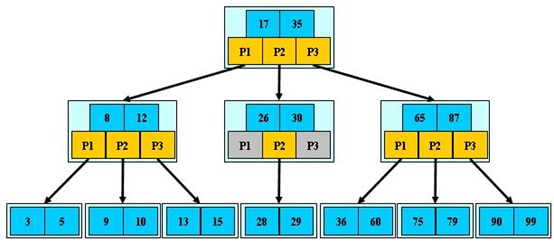
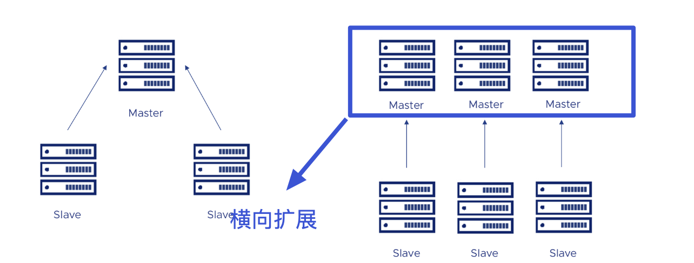
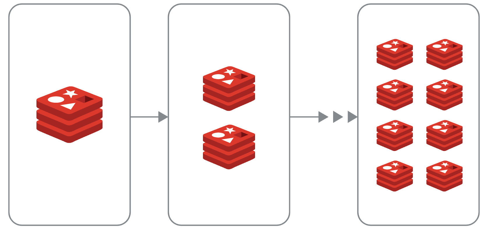
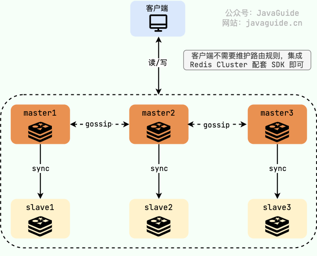
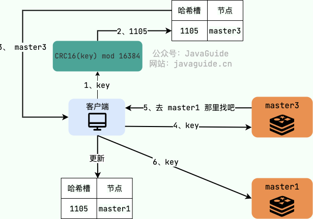
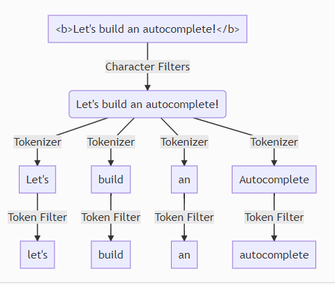
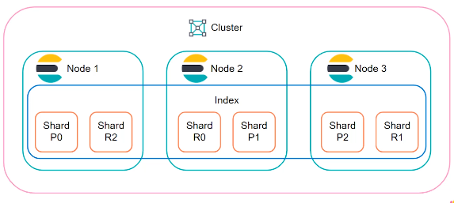

## 数据库

### MySQL 日志：常见的日志都有什么用？

#### MySQL 中常见的日志有哪些？

MySQL 中常见的日志类型主要有下面几类（针对的是 InnoDB 存储引擎）：

- **错误日志（error log） ：**对 MySQL 的启动、运行、关闭过程进行了记录。

- **二进制日志（binary log） ：**主要记录的是更改数据库数据的 SQL 语句。

- **一般查询日志（general query log） ：**已建立连接的客户端发送给 MySQL 服务器的所有 SQL 记录，因为 SQL
  的量比较大，默认是不开启的，也不建议开启。

- **慢查询日志（slow query log） ：**执行时间超过 long_query_time秒钟的查询，解决 SQL 慢查询问题的时候会用到。

- **事务日志(redo log 和 undo log) ：**redo log 是重做日志，undo log 是回滚日志。

- **中继日志(relay log) ：**relay log 是复制过程中产生的日志，很多方面都跟 binary log 差不多。不过，relay log 针对的是主从复制中的从库。

- **DDL 日志(metadata log) ：**DDL 语句执行的元数据操作。

二进制日志 binlog （归档日志）和事务日志(redo log 和 undo log)比较重要，需要我们重点关注。

#### 慢查询日志有什么用？

慢查询日志记录了执行时间超过 long_query_time（默认是 10s）的所有查询，在我们解决 SQL 慢查询（SQL 执行时间过长）问题的时候经常会用到。

慢查询日志默认是关闭的，我们可以通过下面的命令将其开启：

```bash
SET GLOBAL slow_query_log=ON
```

`long_query_time `参数定义了一个查询消耗多长时间才可以被定义为慢查询，默认是
10s，通过` SHOW VARIABLES LIKE '%long_query_time%'`命令即可查看：

```bash
mysql> SHOW VARIABLES LIKE '%long_query_time%';
+-----------------+-----------+
| Variable_name   | Value     |
+-----------------+-----------+
| long_query_time | 10.000000 |
+-----------------+-----------+
1 row in set (0.00 sec)
```

并且，我们还可以对 `long_query_time`参数进行修改：

```bash
SET GLOBAL long_query_time=1
```

在实际项目中，慢查询日志可能会比较大，直接分析的话不太方便，我们可以借助 MySQL
官方的慢查询分析调优工具 [mysqldumpslow](https://dev.mysql.com/doc/refman/5.7/en/mysqldumpslow.html)。

#### binlog 主要记录了什么？

MySQL binlog(binary log 即二进制日志文件) 主要记录了 MySQL 数据库中数据的所有变化(数据库执行的所有 DDL 和 DML 语句)。

binlog 有一个比较常见的应用场景就是主从复制，MySQL 主从复制依赖于 binlog 。另外，常见的一些同步 MySQL 数据到其他数据源的工具（比如
canal）的底层一般也是依赖 binlog 。

binlog 通过追加的方式进行写入，大小没有限制。并且，我们可以通过max_binlog_size参数设置每个 binlog
文件的最大容量，当文件大小达到给定值之后，会生成新的 binlog 文件来保存日志，不会出现前面写的日志被覆盖的情况。

关于主从复制的具体步骤和原理，推荐看看我写的[读写分离&分库分表](https://javaguide.cn/high-performance/read-and-write-separation-and-library-subtable.html)
这篇文章。

#### redo log 如何保证事务的持久性？

我们知道 InnoDB 存储引擎是以页为单位来管理存储空间的，我们往 MySQL 插入的数据最终都是存在于页中的，准确点来说是数据页这种类型。为了减少磁盘
IO 开销，还有一个叫做 Buffer Pool(缓冲池) 的区域，存在于内存中。当我们的数据对应的页不存在于 Buffer Pool 中的话， MySQL
会先将磁盘上的页缓存到 Buffer Pool 中，这样后面我们直接操作的就是 Buffer Pool 中的页，这样大大提高了读写性能。

一个事务提交之后，我们对 Buffer Pool 中对应的页的修改可能还未持久化到磁盘。这个时候，如果 MySQL 突然宕机的话，这个事务的更改是不是直接就消失了呢？

很显然是不会的，如果是这样的话就明显违反了事务的持久性。

MySQL InnoDB 引擎使用 redo log 来保证事务的持久性。redo log 主要做的事情就是记录页的修改，比如某个页面某个偏移量处修改了几个字节的值以及具体被修改的内容是什么。redo
log 中的每一条记录包含了表空间号、数据页号、偏移量、具体修改的数据，甚至还可能会记录修改数据的长度（取决于 redo log 类型）。

在事务提交时，我们会将 redo log 按照刷盘策略刷到磁盘上去，这样即使 MySQL 宕机了，重启之后也能恢复未能写入磁盘的数据，从而保证事务的持久性。也就是说，redo
log 让 MySQL 具备了崩溃回复能力。

不过，我们也要注意设置正确的刷盘策略`innodb_flush_log_at_trx_commit` ，根据 MySQL 配置的刷盘策略的不同，MySQL
宕机之后可能会存在轻微的数据丢失问题。

刷盘策略`innodb_flush_log_at_trx_commit `的默认值为 1，设置为 1 的时候才不会丢失任何数据。为了保证事务的持久性，我们必须将其设置为
1。

下图是 MySQL 5.7 官方文档对于` innodb_flush_log_at_trx_commit `参数的详细介绍，我这里就不做过多阐述了。


redo log 采用循环写的方式进行写入，大小固定，当写到结尾时，会回到开头循环写日志，会出现前面写的日志被覆盖的情况。

#### 页修改之后为什么不直接刷盘呢？

很多人可能要问了：为什么每次修改 Buffer Pool 中的页之后不直接刷盘呢？这样不就不需要 redo log 了嘛！

这种方式必然是不行的，性能非常差。最大的问题就是 InnoDB 页的大小一般为
16KB，而页又是磁盘和内存交互的基本单位。这就导致即使我们只修改了页中的几个字节数据，一次刷盘操作也需要将 16KB
大小的页整个都刷新到磁盘中。而且，这些修改的页可能并不相邻，也就是说这还是随机 IO。

采用 redo log 的方式就可以避免这种性能问题，因为 redo log 的刷盘性能很好。首先，redo log 的写入属于顺序 IO。 其次，一行 redo
log 记录只占几十个字节。

另外，Buffer Pool 中的页（脏页）在某些情况下（比如 redo log 快写满了）也会进行刷盘操作。不过，这里的刷盘操作会合并写入，更高效地顺序写入到磁盘。

#### binlog 和 redolog 有什么区别？

- binlog 主要用于数据库还原，属于数据级别的数据恢复，主从复制是 binlog 最常见的一个应用场景。redolog
  主要用于保证事务的持久性，属于事务级别的数据恢复。
- redolog 属于 InnoDB 引擎特有的，binlog 属于所有存储引擎共有的，因为 binlog 是 MySQL 的 Server 层实现的。
- redolog 属于物理日志，主要记录的是某个页的修改。binlog 属于逻辑日志，主要记录的是数据库执行的所有 DDL 和 DML 语句。
- binlog 通过追加的方式进行写入，大小没有限制。redo log 采用循环写的方式进行写入，大小固定，当写到结尾时，会回到开头循环写日志。
- ......

#### undo log 如何保证事务的原子性？

每一个事务对数据的修改都会被记录到 undo log ，当执行事务过程中出现错误或者需要执行回滚操作的话，MySQL 可以利用 undo log
将数据恢复到事务开始之前的状态。

undo log 属于逻辑日志，记录的是 SQL 语句，比如说事务执行一条 DELETE 语句，那 undo log 就会记录一条相对应的 INSERT 语句。

### **MySQL 索引：索引为什么使用 B+树？**

> 相关面试题 ：
>
> - MySQL 的索引结构为什么使用 B+树？
> - 红黑树适合什么场景？
>
> 转自：https://www.cnblogs.com/kismetv/p/11582214.html

在 MySQL 中，无论是 Innodb 还是 MyIsam，都使用了 B+树作索引结构(这里不考虑 hash 等其他索引)
。本文将从最普通的二叉查找树开始，逐步说明各种树解决的问题以及面临的新问题，从而说明 MySQL 为什么选择 B+树作为索引结构。

#### 二叉查找树(BST)：不平衡

二叉查找树(BST，Binary Search Tree)，也叫二叉排序树，在二叉树的基础上需要满足：任意节点的左子树上所有节点值不大于根节点的值，任意节点的右子树上所有节点值不小于根节点的值。如下是一颗
BST([图片来源](https://blog.csdn.net/qq_25940921/article/details/82183093))。


当需要快速查找时，将数据存储在 BST 是一种常见的选择，因为此时查询时间取决于树高，平均时间复杂度是 O(lgn)。然而，BST*
*可能长歪而变得不平衡**，如下图所示([图片来源](https://blog.csdn.net/qq_25940921/article/details/82183093))，此时 BST
退化为链表，时间复杂度退化为 O(n)。

为了解决这个问题，引入了平衡二叉树。

)

#### 平衡二叉树(AVL)：旋转耗时

AVL 树是严格的平衡二叉树，所有节点的左右子树高度差不能超过 1；AVL 树查找、插入和删除在平均和最坏情况下都是 O(lgn)。

AVL 实现平衡的关键在于旋转操作：插入和删除可能破坏二叉树的平衡，此时需要通过一次或多次树旋转来重新平衡这个树。当插入数据时，最多只需要
1 次旋转(单旋转或双旋转)；但是当删除数据时，会导致树失衡，AVL 需要维护从被删除节点到根节点这条路径上所有节点的平衡，旋转的量级为
O(lgn)。

**由于旋转的耗时，AVL树在删除数据时效率很低**；在删除操作较多时，维护平衡所需的代价可能高于其带来的好处，因此 AVL 实际使用并不广泛。

#### 红黑树：树太高

与 AVL
树相比，红黑树并不追求严格的平衡，而是大致的平衡：只是确保从根到叶子的最长的可能路径不多于最短的可能路径的两倍长。从实现来看，红黑树最大的特点是每个节点都属于两种颜色(
红色或黑色)之一，且节点颜色的划分需要满足特定的规则(具体规则略)
。红黑树示例如下（[图片来源](https://www.jianshu.com/p/1dbbee88c9d9)）：

)

与 AVL 树相比，红黑树的查询效率会有所下降，这是因为树的平衡性变差，高度更高。但红黑树的删除效率大大提高了，因为红黑树同时引入了颜色，当插入或删除数据时，只需要进行
O(1)次数的旋转以及变色就能保证基本的平衡，不需要像 AVL 树进行 O(lgn)次数的旋转。总的来说，红黑树的统计性能高于 AVL。

因此，在实际应用中，AVL 树的使用相对较少，而红黑树的使用非常广泛。例如，Java 中的 TreeMap 使用红黑树存储排序键值对；Java8 中的
HashMap 使用链表+红黑树解决哈希冲突问题(当冲突节点较少时，使用链表，当冲突节点较多时，使用红黑树)。

对于数据在内存中的情况（如上述的 TreeMap 和 HashMap），红黑树的表现是非常优异的。*
*但是对于数据在磁盘等辅助存储设备中的情况（如MySQL等数据库），红黑树并不擅长，因为红黑树长得还是太高了**。当数据在磁盘中时，磁盘
IO 会成为最大的性能瓶颈，设计的目标应该是尽量减少 IO 次数；而树的高度越高，增删改查所需要的 IO 次数也越多，会严重影响性能。

#### B 树：为磁盘而生

B 树也称 B-树(其中-不是减号)，是为磁盘等辅存设备设计的多路平衡查找树，与二叉树相比，B 树的每个非叶节点可以有多个子树。
因此，当总节点数量相同时，B 树的高度远远小于 AVL 树和红黑树(B 树是一颗“矮胖子”)，磁盘 IO 次数大大减少。

定义 B 树最重要的概念是阶数(Order)，对于一颗 m 阶 B 树，需要满足以下条件：

- 每个节点最多包含 m 个子节点。
- 如果根节点包含子节点，则至少包含 2 个子节点；除根节点外，每个非叶节点至少包含 m/2 个子节点。
- 拥有 k 个子节点的非叶节点将包含 k - 1 条记录。
- 所有叶节点都在同一层中。

可以看出，B 树的定义，主要是对非叶结点的子节点数量和记录数量的限制。

下图是一个 3 阶 B 树的例子（[图片来源](https://www.2cto.com/net/201808/773535.html)）：



B 树的优势除了树高小，还有对访问局部性原理的利用。所谓局部性原理，是指当一个数据被使用时，其附近的数据有较大概率在短时间内被使用。B
树将键相近的数据存储在同一个节点，当访问其中某个数据时，数据库会将该整个节点读到缓存中；当它临近的数据紧接着被访问时，可以直接在缓存中读取，无需进行磁盘
IO；换句话说，B 树的缓存命中率更高。

B 树在数据库中有一些应用，如 mongodb 的索引使用了 B 树结构。但是在很多数据库应用中，使用了是 B 树的变种 B+树。

#### B+树

B+树也是多路平衡查找树，其与 B 树的区别主要在于：

- B 树中每个节点（包括叶节点和非叶节点）都存储真实的数据，B+树中只有叶子节点存储真实的数据，非叶节点只存储键。在 MySQL
  中，这里所说的真实数据，可能是行的全部数据（如 Innodb 的聚簇索引），也可能只是行的主键（如 Innodb 的辅助索引），或者是行所在的地址（如
  MyIsam 的非聚簇索引）。
- B 树中一条记录只会出现一次，不会重复出现，而 B+树的键则可能重复重现——一定会在叶节点出现，也可能在非叶节点重复出现。
- B+树的叶节点之间通过双向链表链接。
- B 树中的非叶节点，记录数比子节点个数少 1；而 B+树中记录数与子节点个数相同。

由此，B+树与 B 树相比，有以下优势：

- **更少的 IO 次数：**B+树的非叶节点只包含键，而不包含真实数据，因此每个节点存储的记录个数比 B 数多很多（即阶 m 更大），因此
  B+树的高度更低，访问时所需要的 IO 次数更少。此外，由于每个节点存储的记录数更多，所以对访问局部性原理的利用更好，缓存命中率更高。
- **更适于范围查询：**在 B 树中进行范围查询时，首先找到要查找的下限，然后对 B 树进行中序遍历，直到找到查找的上限；而
  B+树的范围查询，只需要对链表进行遍历即可。
- **更稳定的查询效率：**B 树的查询时间复杂度在 1 到树高之间(分别对应记录在根节点和叶节点)，而 B+树的查询复杂度则稳定为树高，因为所有数据都在叶节点。

B+树也存在劣势：由于键会重复出现，因此会占用更多的空间。但是与带来的性能优势相比，空间劣势往往可以接受，因此 B+树的在数据库中的使用比
B 树更加广泛。

#### 感受 B+树的威力

前面说到，B 树/B+树与红黑树等二叉树相比，最大的优势在于树高更小。实际上，对于 Innodb 的 B+索引来说，树的高度一般在 2-4
层。下面来进行一些具体的估算。

树的高度是由阶数决定的，阶数越大树越矮；而阶数的大小又取决于每个节点可以存储多少条记录。Innodb 中每个节点使用一个页(page)
，页的大小为 16KB，其中元数据只占大约 128 字节左右(包括文件管理头信息、页面头信息等等)，大多数空间都用来存储数据。

- 对于非叶节点，记录只包含索引的键和指向下一层节点的指针。假设每个非叶节点页面存储 1000 条记录，则每条记录大约占用 16
  字节；当索引是整型或较短的字符串时，这个假设是合理的。延伸一下，我们经常听到建议说索引列长度不应过大，原因就在这里：索引列太长，每个节点包含的记录数太少，会导致树太高，索引的效果会大打折扣，而且索引还会浪费更多的空间。
- 对于叶节点，记录包含了索引的键和值(值可能是行的主键、一行完整数据等，具体见前文)，数据量更大。这里假设每个叶节点页面存储
  100 条记录(实际上，当索引为聚簇索引时，这个数字可能不足 100；当索引为辅助索引时，这个数字可能远大于
  100；可以根据实际情况进行估算)。

对于一颗 3 层 B+树，第一层(根节点)有 1 个页面，可以存储 1000 条记录；第二层有 1000 个页面，可以存储 10001000 条记录；第三层(
叶节点)有 10001000 个页面，每个页面可以存储 100 条记录，因此可以存储 10001000100 条记录，即 1 亿条。而对于二叉树，存储 1
亿条记录则需要 26 层左右。

#### 总结

最后，总结一下各种树解决的问题以及面临的新问题：

- 二叉查找树(BST) ：解决了排序的基本问题，但是由于无法保证平衡，可能退化为链表；
- 平衡二叉树(AVL) ：通过旋转解决了平衡的问题，但是旋转操作效率太低；

- 红黑树 ：通过舍弃严格的平衡和引入红黑节点，解决了 AVL 旋转效率过低的问题，但是在磁盘等场景下，树仍然太高，IO 次数太多；

- B 树 ：通过将二叉树改为多路平衡查找树，解决了树过高的问题；

- B+树 ：在 B 树的基础上，将非叶节点改造为不存储数据的纯索引节点，进一步降低了树的高度；此外将叶节点使用指针连接成链表，范围查询更加高效。

#### 参考文献

- 《MySQL 技术内幕：InnoDB 存储引擎》

- 《MySQL 运维内参》

- https://zhuanlan.zhihu.com/p/54102723

- https://cloud.tencent.com/developer/article/1425604

- https://blog.csdn.net/whoamiyang/article/details/51926985

- https://www.jianshu.com/p/37436ed14cc6

- https://blog.csdn.net/CrankZ/article/details/83301702

- https://www.cnblogs.com/gaochundong/p/btree_and_bplustree.html

### **Redis 基础：为什么要用分布式缓存？**

> 相关面试题 ：
>
> - 为什么要用缓存？
> - 本地缓存应该怎么做？
> - 为什么要有分布式缓存?/为什么不直接用本地缓存?
> - 多级缓存了解么？

#### 缓存的基本思想

很多同学只知道缓存可以提高系统性能以及减少请求相应时间，但是，不太清楚缓存的本质思想是什么。

缓存的基本思想其实很简单，就是我们非常熟悉的空间换时间。不要把缓存想的太高大上，虽然，它的确对系统的性能提升的性价比非常高。

其实，我们在学习使用缓存的时候，你会发现缓存的思想实际在操作系统或者其他地方都被大量用到。 比如 CPU Cache 缓存的是内存数据用于解决
CPU 处理速度和内存不匹配的问题，内存缓存的是硬盘数据用于解决硬盘访问速度过慢的问题。 再比如操作系统在 页表方案 基础之上引入了
快表 来加速虚拟地址到物理地址的转换。我们可以把快表理解为一种特殊的高速缓冲存储器（Cache）。

我们知道，缓存中的数据通常存储于内存中，因此访问速度非常快。为了避免内存中的数据在重启或者宕机之后丢失，很多缓存中间件会利用磁盘做持久化。

也就是说，缓存相比较于我们常用的关系型数据库（比如 MySQL）来说访问速度要快非常多。为了避免用户请求数据库中的数据速度过于缓慢，我们可以在数据库之上增加一层缓存。

除了能够提高访问速度之外，缓存支持的并发量也要更大，有了缓存之后，数据库的压力也会随之变小。

#### 缓存的分类

##### 本地缓存

###### 什么是本地缓存?

这个实际在很多项目中用的蛮多，特别是单体架构的时候。数据量不大，并且没有分布式要求的话，使用本地缓存还是可以的。

本地缓存位于应用内部，其最大的优点是应用存在于同一个进程内部，请求本地缓存的速度非常快，不存在额外的网络开销。

常见的单体架构图如下，我们使用 **Nginx** 来做**负载均衡**，部署两个相同的应用到服务器，两个服务使用同一个数据库，并且使用的是本地缓存。


###### 本地缓存的方案有哪些？

**1、JDK 自带的 HashMap 和 ConcurrentHashMap 了。**

ConcurrentHashMap 可以看作是线程安全版本的 HashMap ，两者都是存放 key/value
形式的键值对。但是，大部分场景来说不会使用这两者当做缓存，因为只提供了缓存的功能，并没有提供其他诸如过期时间之类的功能。一个稍微完善一点的缓存框架至少要提供：过期时间、淘汰机制、命中率统计这三点。

**2、 Ehcache 、 Guava Cache 、 Spring Cache 这三者是使用的比较多的本地缓存框架。**

- `Ehcache` 的话相比于其他两者更加重量。不过，相比于 `Guava Cache `、 `Spring Cache` 来说，` Ehcache `支持可以嵌入到
  hibernate 和 mybatis 作为多级缓存，并且可以将缓存的数据持久化到本地磁盘中、同时也提供了集群方案（比较鸡肋，可忽略）。
- `Guava Cache `和 `Spring Cache `两者的话比较像。`Guava `相比于`Spring Cache `的话使用的更多一点，它提供了 API
  非常方便我们使用，同时也提供了设置缓存有效时间等功能。它的内部实现也比较干净，很多地方都和 `ConcurrentHashMap`的思想有异曲同工之妙。
- 使用 `Spring Cache `的注解实现缓存的话，代码会看着很干净和优雅，但是很容易出现问题比如缓存穿透、内存溢出。

**3、后起之秀 Caffeine。**

相比于` Guava` 来说` Caffeine` 在各个方面比如性能要更加优秀，一般建议使用其来替代` Guava `。并且， `Guava` 和 `Caffeine`
的使用方式很像！

###### 本地缓存有什么痛点？

本地的缓存的优势非常明显：低依赖、轻量、简单、成本低。

但是，本地缓存存在下面这些缺陷：

- **本地缓存应用耦合，对分布式架构支持不友好**，比如同一个相同的服务部署在多台机器上的时候，各个服务之间的缓存是无法共享的，因为本地缓存只在当前机器上有。
- **本地缓存容量受服务部署所在的机器限制明显**。 如果当前系统服务所耗费的内存多，那么本地缓存可用的容量就很少。

##### 分布式缓存

###### 什么是分布式缓存？

我们可以把分布式缓存（Distributed Cache） 看作是一种内存数据库的服务，它的最终作用就是提供缓存数据的服务。

分布式缓存脱离于应用独立存在，多个应用可直接的共同使用同一个分布式缓存服务。

如下图所示，就是一个简单的使用分布式缓存的架构图。我们使用 Nginx 来做负载均衡，部署两个相同的应用到服务器，两个服务使用同一个数据库和缓存。


使用分布式缓存之后，缓存服务可以部署在一台单独的服务器上，即使同一个相同的服务部署在多台机器上，也是使用的同一份缓存。
并且，单独的分布式缓存服务的性能、容量和提供的功能都要更加强大。

**软件系统设计中没有银弹，往往任何技术的引入都像是把双刃剑。** 你使用的方式得当，就能为系统带来很大的收益。否则，只是费了精力不讨好。

简单来说，为系统引入分布式缓存之后往往会带来下面这些问题：

- **系统复杂性增加 ：**引入缓存之后，你要维护缓存和数据库的数据一致性、维护热点缓存、保证缓存服务的高可用等等。
- **系统开发成本往往会增加 ：**引入缓存意味着系统需要一个单独的缓存服务，这是需要花费相应的成本的，并且这个成本还是很贵的，毕竟耗费的是宝贵的内存。

###### 分布式缓存的方案有哪些？

分布式缓存的话，比较老牌同时也是使用的比较多的还是 **Memcached** 和 **Redis**。不过，现在基本没有看过还有项目使用 *
*Memcached** 来做缓存，都是直接用 **Redis**。

Memcached 是分布式缓存最开始兴起的那会，比较常用的。后来，随着 Redis 的发展，大家慢慢都转而使用更加强大的 Redis 了。

另外，腾讯也开源了一款类似于 Redis 的分布式高性能 KV
存储数据库，基于知名的开源项目 [RocksDB](https://github.com/facebook/rocksdb) 作为存储引擎 ，100% 兼容 Redis 协议和
Redis4.0 所有数据模型，名为 [Tendis](https://github.com/Tencent/Tendis)。

关于 Redis 和 Tendis
的对比，腾讯官方曾经发过一篇文章：[Redis vs Tendis：冷热混合存储版架构揭秘](https://mp.weixin.qq.com/s/MeYkfOIdnU6LYlsGb24KjQ)
，可以简单参考一下。

从这个项目的 Github 提交记录可以看出，Tendis 开源版几乎已经没有被维护更新了，加上其关注度并不高，使用的公司也比较少。因此，不建议你使用
Tendis 来实现分布式缓存。

##### 多级缓存

我们这里只来简单聊聊 **本地缓存 + 分布式缓存** 的多级缓存方案。

这个时候估计有很多小伙伴就会问了：**既然用了分布式缓存，为什么还要用本地缓存呢？** 。

的确，一般情况下，我们也是不建议使用多级缓存的，这会增加维护负担（比如你需要保证一级缓存和二级缓存的数据一致性），并且，实际带来的提升效果对于绝大部分项目来说其实并不是很大。

多级缓存方案中，第一级缓存（L1）使用本地内存（比如 Caffeine)），第二级缓存（L2）使用分布式缓存（比如 Redis）。读取缓存数据的时候，我们先从
L1 中读取，读取不到的时候再去 L2 读取。这样可以降低 L2 的压力，减少 L2 的读次数。并且，本地内存的访问速度是最快的，不存在什么网络开销。


[J2Cache](https://gitee.com/ld/J2Cache) 就是一个基于本地内存和分布式缓存的两级 Java 缓存框架，感兴趣的同学可以研究一下。

### **Redis 基础：常见的缓存更新策略有哪几种?**

下面介绍到的三种模式各有优劣，不存在最佳模式，根据具体的业务场景选择适合自己的缓存读写模式即可！

#### Cache Aside Pattern（旁路缓存模式）

**Cache Aside Pattern 是我们平时使用比较多的一个缓存读写模式，比较适合读请求比较多的场景。**

Cache Aside Pattern 中服务端需要同时维系数据库（后文简称 db）和缓存（后文简称 cache），并且是以 db 的结果为准。

下面我们来看一下这个策略模式下的缓存读写步骤。

**写 ：**

1. 先更新 db；
2. 直接删除 cache 。

简单画了一张图帮助大家理解写的步骤。


**读 :**

1. 从 cache 中读取数据，读取到就直接返回；
2. cache 中读取不到的话，就从 db 中读取数据返回；
3. 再把 db 中读取到的数据放到 cache 中。

简单画了一张图帮助大家理解读的步骤。


你仅仅了解了上面这些内容的话是远远不够的，我们还要搞懂其中的原理。

比如说面试官可能会问你：**“为什么删除 cache，而不是更新 cache？”**

主要原因有两点：

1. **对服务端资源造成浪费 ：**删除 cache 更加直接，这是因为 cache 中存放的一些数据需要服务端经过大量的计算才能得出，会消耗服务端的资源，是一笔不晓得开销。如果频繁修改
   db，就能会导致需要频繁更新 cache，而 cache 中的数据可能都没有被访问到。
2. **产生数据不一致问题 ：**并发场景下，更新 cache 产生数据不一致性问题的概率会更大（后文会解释原因）。

面试官很可能会追问：**“在写数据的过程中，可以先删除 cache ，后更新 db 么？”**

答案： 那肯定是不行的！因为这样可能会造成 **数据库（db）和缓存（Cache）数据不一致**的问题。

举例：请求 1 先写数据 A，请求 2 随后读数据 A 的话，就很有可能产生数据不一致性的问题。这个过程可以简单描述为：

1. 请求 1 先把 cache 中的 A 数据删除；

2. 请求 2 从 db 中读取数据；

3. 请求 1 再把 db 中的 A 数据更新。

这就会导致请求 2 读取到的是旧值。

当你这样回答之后，面试官可能会紧接着就追问：**“在写数据的过程中，先更新 db，后删除 cache 就没有问题了么？”**

**答案：** 理论上来说还是可能会出现数据不一致性的问题，不过概率非常小，因为缓存的写入速度是比数据库的写入速度快很多。

举例：请求 1 先读数据 A，请求 2 随后写数据 A，并且数据 A 在请求 1 请求之前不在缓存中的话，也有可能产生数据不一致性的问题。这个过程可以简单描述为：

1. 请求 1 从 db 读数据 A；

2. 请求 2 更新 db 中的数据 A（此时缓存中无数据 A ，故不用执行删除缓存操作 ）；

3. 请求 1 将数据 A 写入 cache。

这就会导致 cache 中存放的其实是旧值。

现在我们再来分析一下 **Cache Aside Pattern 的缺陷。**

**缺陷 1：首次请求数据一定不在 cache 的问题**

解决办法：可以将热点数据可以提前放入 cache 中。

**缺陷 2：写操作比较频繁的话导致 cache 中的数据会被频繁被删除，这样会影响缓存命中率 。**

解决办法：

- 数据库和缓存数据强一致场景 ：更新 db 的时候同样更新 cache，不过我们需要加一个锁/分布式锁来保证更新 cache 的时候不存在线程安全问题。

- 可以短暂地允许数据库和缓存数据不一致的场景 ：更新 db 的时候同样更新 cache，但是给缓存加一个比较短的过期时间，这样的话就可以保证即使数据不一致的话影响也比较小。

#### Read/Write Through Pattern（读写穿透）

Read/Write Through Pattern 中服务端把 cache 视为主要数据存储，从中读取数据并将数据写入其中。cache 服务负责将此数据读取和写入
db，从而减轻了应用程序的职责。

这种缓存读写策略小伙伴们应该也发现了在平时在开发过程中非常少见。抛去性能方面的影响，大概率是因为我们经常使用的分布式缓存
Redis 并没有提供 cache 将数据写入 db 的功能。

**写（Write Through）：**

- 先查 cache，cache 中不存在，直接更新 db。

- cache 中存在，则先更新 cache，然后 cache 服务自己更新 db（**同步更新 cache 和 db**）。

简单画了一张图帮助大家理解写的步骤。


**读(Read Through)：**

- 从 cache 中读取数据，读取到就直接返回 。
- 读取不到的话，先从 db 加载，写入到 cache 后返回响应。

简单画了一张图帮助大家理解读的步骤。


Read-Through Pattern 实际只是在 Cache-Aside Pattern 之上进行了封装。在 Cache-Aside Pattern 下，发生读请求的时候，如果 cache
中不存在对应的数据，是由客户端自己负责把数据写入 cache，而 Read Through Pattern 则是 cache 服务自己来写入缓存的，这对客户端是透明的。

和 Cache Aside Pattern 一样， Read-Through Pattern 也有首次请求数据一定不再 cache 的问题，对于热点数据可以提前放入缓存中。

#### Write Behind Pattern（异步缓存写入）

Write Behind Pattern 和 Read/Write Through Pattern 很相似，两者都是由 cache 服务来负责 cache 和 db 的读写。

但是，两个又有很大的不同：**Read/Write Through 是同步更新 cache 和 db，而 Write Behind 则是只更新缓存，不直接更新
db，而是改为异步批量的方式来更新 db。**

很明显，这种方式对数据一致性带来了更大的挑战，比如 cache 数据可能还没异步更新 db 的话，cache 服务可能就就挂掉了。

这种策略在我们平时开发过程中也非常非常少见，但是不代表它的应用场景少，比如消息队列中消息的异步写入磁盘、MySQL 的 Innodb
Buffer Pool 机制都用到了这种策略。

Write Behind Pattern 下 db 的写性能非常高，非常适合一些数据经常变化又对数据一致性要求没那么高的场景，比如浏览量、点赞量。

### **Redis Sentinel：如何实现自动化地故障转移？**

普通的主从复制方案下，一旦 master 宕机，我们需要从 slave 中手动选择一个新的
master，同时需要修改应用方的主节点地址，还需要命令所有从节点去复制新的主节点，整个过程需要人工干预。人工干预大大增加了问题的处理时间以及出错的可能性。

我们可以借助 Redis 官方的 Sentinel（哨兵）方案来帮助我们解决这个痛点，实现自动化地故障切换。

建议带着下面这些重要的问题（面试常问）阅读：

1. 什么是 Sentinel？ 有什么用？
2. Sentinel 如何检测节点是否下线？主观下线与客观下线的区别?
3. Sentinel 是如何实现故障转移的？
4. 为什么建议部署多个 sentinel 节点（哨兵集群）？
5. Sentinel 如何选择出新的 master（选举机制）?
6. 如何从 Sentinel 集群中选择出 Leader ？
7. Sentinel 可以防止脑裂吗？

#### 什么是 Sentinel？

**Sentinel（哨兵）** 只是 Redis 的一种运行模式 ，不提供读写服务，默认运行在 26379 端口上，依赖于 Redis 工作。Redis Sentinel
的稳定版本是在 Redis 2.8 之后发布的。

Redis 在 Sentinel 这种特殊的运行模式下，使用专门的命令表，也就是说普通模式运行下的 Redis 命令将无法使用。

通过下面的命令就可以让 Redis 以 Sentinel 的方式运行:

```bash
redis-sentinel /path/to/sentinel.conf
或者
redis-server /path/to/sentinel.conf --sentinel
```

Redis 源码中的`sentinel.conf`是用来配置 Sentinel 的，一个常见的最小配置如下所示：

```
// 指定要监视的 master
// 127.0.0.1 6379 为 master 地址
// 2 表示当有 2 个 sentinel 认为 master 失效时，master 才算真正失效
sentinel monitor mymaster 127.0.0.1 6379 2
// master 节点宕机多长时间才会被 sentinel 认为是失效
sentinel down-after-milliseconds mymaster 60000
sentinel failover-timeout mymaster 180000
sentinel parallel-syncs mymaster 1

sentinel monitor resque 192.168.1.3 6380 4
sentinel down-after-milliseconds resque 10000
sentinel failover-timeout resque 180000
// 在发生主备切换时最多可以有 5 个 slave 同时对新的 master 进行同步
sentinel parallel-syncs resque 5
```

Redis Sentinel 实现 Redis 集群高可用，只是在主从复制实现集群的基础下，多了一个 Sentinel 角色来帮助我们监控 Redis
节点的运行状态并自动实现故障转移。

当 master 节点出现故障的时候， Sentinel 会帮助我们实现故障转移，自动根据一定的规则选出一个 slave 升级为 master，确保整个
Redis 系统的可用性。整个过程完全自动，不需要人工介入。


#### Sentinel 有什么作用？

根据 [Redis Sentinel 官方文档](https://redis.io/topics/sentinel)的介绍，sentinel 节点主要可以提供 4 个功能：

- **监控：**监控所有 redis 节点（包括 sentinel 节点自身）的状态是否正常。
- **故障转移：**如果一个 master 出现故障，Sentinel 会帮助我们实现故障转移，自动将某一台 slave 升级为 master，确保整个 Redis
  系统的可用性。
- **通知 ：**通知 slave 新的 master 连接信息，让它们执行 replicaof 成为新的 master 的 slave。
- **配置提供 ：**客户端连接 sentinel 请求 master 的地址，如果发生故障转移，sentinel 会通知新的 master 链接信息给客户端。

Redis Sentinel 本身设计的就是一个分布式系统，建议多个 sentinel 节点协作运行。这样做的好处是：

- 多个 sentinel 节点通过投票的方式来确定 sentinel 节点是否真的不可用，避免误判（比如网络问题可能会导致误判）。
- Sentinel 自身就是高可用。

**如果想要实现高可用，建议将哨兵 Sentinel 配置成单数且大于等于 3 台。**

一个最简易的 Redis Sentinel 集群如下所示（官方文档中的一个例子），其中：

- M1 表示 master，R2、R3 表示 slave；
- S1、S2、S3 都是 sentinel；
- quorum 表示判定 master 失效最少需要的仲裁节点数。这里的值为 2 ，也就是说当有 2 个 sentinel 认为 master 失效时，master
  才算真正失效。

```lua
       +----+
       | M1 |
       | S1 |
       +----+
          |
+----+    |    +----+
| R2 |----+----| R3 |
| S2 |         | S3 |
+----+         +----+

Configuration: quorum = 2
```

如果 M1 出现问题，只要 S1、S2、S3 其中的两个投票赞同的话，就会开始故障转移工作，从 R2 或者 R3 中重新选出一个作为 master。

#### **Sentinel 如何检测节点是否下线？**

> 相关的问题：
>
> - 主观下线与客观下线的区别?
> - Sentinel 是如何实现故障转移的？
> - 为什么建议部署多个 sentinel 节点（哨兵集群）？

Redis Sentinel 中有两个下线（Down）的概念：

- **主观下线(SDOWN) ：**sentinel 节点认为某个 Redis 节点已经下线了（主观下线），但还不是很确定，需要其他 sentinel 节点的投票。
- **客观下线(ODOWN) ：**法定数量（通常为过半）的 sentinel 节点认定某个 Redis 节点已经下线（客观下线），那它就算是真的下线了。

也就是说，**主观下线** 当前的 sentinel 自己认为节点宕机，客观下线是 sentinel 整体达成一致认为节点宕机。

每个 sentinel 节点以每秒钟一次的频率向整个集群中的 master、slave 以及其他 sentinel 节点发送一个 PING 命令。


如果对应的节点超过规定的时间（down-after-millisenconds）没有进行有效回复的话，就会被其认定为是 **主观下线(SDOWN)**
。注意！这里的有效回复不一定是 PONG，可以是-LOADING 或者 -MASTERDOWN 。


如果被认定为主观下线的是 slave 的话， sentinel 不会做什么事情，因为 slave 下线对 Redis 集群的影响不大，Redis
集群对外正常提供服务。但如果是 master 被认定为主观下线就不一样了，sentinel 整体还要对其进行进一步核实，确保 master 是真的下线了。

所有 sentinel 节点要以每秒一次的频率确认 master 的确下线了，当法定数量（通常为过半）的 sentinel 节点认定 master 已经下线，
master 才被判定为 **客观下线(ODOWN)** 。这样做的目的是为了防止误判，毕竟故障转移的开销还是比较大的，这也是为什么 Redis
官方推荐部署多个 sentinel 节点（哨兵集群）。


随后， sentinel 中会有一个 Leader 的角色来负责故障转移，也就是自动地从 slave 中选出一个新的 master 并执行完相关的一些工作(
比如通知 slave 新的 master 连接信息，让它们执行 replicaof 成为新的 master 的 slave)。

如果没有足够数量的 sentinel 节点认定 master 已经下线的话，当 master 能对 sentinel 的 PING 命令进行有效回复之后，master
也就不再被认定为主观下线，回归正常。

#### Sentinel 如何选择出新的 master?

slave 必须是在线状态才能参加新的 master 的选举，筛选出所有在线的 slave 之后，通过下面 3 个维度进行最后的筛选（优先级依次降低）：

1. **slave 优先级 ：**可以通过 slave-priority 手动设置 slave 的优先级，优先级越高得分越高，优先级最高的直接成为新的
   master。如果没有优先级最高的，再判断复制进度。
2. **复制进度 ：**Sentinel 总是希望选择出数据最完整（与旧 master 数据最接近）也就是复制进度最快的 slave 被提升为新的
   master，复制进度越快得分也就越高。
3. **runid(运行 id) ：**通常经过前面两轮筛选已经成果选出来了新的 master，万一真有多个 slave 的优先级和复制进度一样的话，那就
   runid 小的成为新的 master，每个 redis 节点启动时都有一个 40 字节随机字符串作为运行 id。

#### 如何从 Sentinel 集群中选择出 Leader ？

我们前面说了，当 sentinel 集群确认有 master 客观下线了，就会开始故障转移流程，故障转移流程的第一步就是在 sentinel 集群选择一个
leader，让 leader 来负责完成故障转移。

**如何选择出 Leader 角色呢？**

这就需要用到分布式领域的 **共识算法** 了。简单来说，共识算法就是让分布式系统中的节点就一个问题达成共识。在 sentinel 选举
leader 这个场景下，这些 sentinel 要达成的共识就是谁才是 leader 。

大部分共识算法都是基于 Paxos 算法改进而来，在 sentinel 选举 leader
这个场景下使用的是 [Raft 算法](https://javaguide.cn/distributed-system/theorem&algorithm&protocol/raft-algorithm.html)
。这是一个比 Paxos 算法更易理解和实现的共识算法—Raft 算法。更具体点来说，Raft 是 Multi-Paxos 的一个变种，其简化了
Multi-Paxos 的思想，变得更容易被理解以及工程实现。

对于学有余力并且想要深入了解 Raft 算法实践以及 sentinel 选举 leader 的详细过程的同学，推荐阅读下面这两篇文章：

- [Raft 算法详解](https://javaguide.cn/distributed-system/theorem&algorithm&protocol/raft-algorithm.html)
- [Raft 协议实战之 Redis Sentinel 的选举 Leader 源码解析](https://cloud.tencent.com/developer/article/1021467)

#### Sentinel 可以防止脑裂吗？

还是上面的例子，如果 M1 和 R2、R3 之间的网络被隔离，也就是发生了脑裂，M1 和 R2 、 R3 隔离在了两个不同的网络分区中。这意味着，R2
或者 R3 其中一个会被选为 master，这里假设为 R2。

但是！这样会出现问题了！！

如果客户端 C1 是和 M1 在一个网络分区的话，从网络被隔离到网络分区恢复这段时间，C1 写入 M1 的数据都会丢失，并且，C1
读取的可能也是过时的数据。这是因为当网络分区恢复之后，M1 将会成为 slave 节点。

```lua
         +----+
         | M1 |
         | S1 | <- C1 (writes will be lost)
         +----+
            |
            /
            /
+------+    |    +----+
| [M2] |----+----| R3 |
| S2   |         | S3 |
+------+         +----+
```

想要解决这个问题的话也不难，对 Redis 主从复制进行配置即可。

```lua
min-replicas-to-write 1
min-replicas-max-lag 10
```

下面对这两个配置进行解释：

- **min-replicas-to-write 1：**用于配置写 master 至少写入的 slave 数量，设置为 0 表示关闭该功能。3 个节点的情况下，可以配置为
  1 ，表示 master 必须写入至少 1 个 slave ，否则就停止接受新的写入命令请求。
- **min-replicas-max-lag 10 ：**用于配置 master 多长时间（秒）无法得到从节点的响应，就认为这个节点失联。我们这里配置的是 10
  秒，也就是说 master 10 秒都得不到一个从节点的响应，就会认为这个从节点失联，停止接受新的写入命令请求。

不过，这样配置会降低 Redis 服务的整体可用性，如果 2 个 slave 都挂掉，master 将会停止接受新的写入命令请求。

### **Redis Cluster：缓存的数据量太大怎么办？**

来来来！一起来盘盘 Redis Cluster 常见的问题。如果你的项目用到了 Redis 的话（大部分人的项目都用到了 Redis
来做分布式缓存），为了能比别人更有亮点，Redis Cluster 是一个不错的选择。

这篇文章原本写了接近 8000 字，有点写嗨了，后面删减到了现在的 5000+ 字。为了帮助理解，我手绘了很多张图解，尽可能用大白话的语言来讲。

建议带着下面这些重要的问题（面试常问）阅读：

- 为什么需要 Redis Cluster？解决了什么问题？有什么优势？
- Redis Cluster 是如何分片的？
- 为什么 Redis Cluster 的哈希槽是 16384 个?
- 如何确定给定 key 的应该分布到哪个哈希槽中？
- Redis Cluster 支持重新分配哈希槽吗？
- Redis Cluster 扩容缩容期间可以提供服务吗？
- Redis Cluster 中的节点是怎么进行通信的？

#### 为什么需要 Redis Cluster？

高并发场景下，使用 Redis 主要会遇到的两个问题：

1. **缓存的数据量太大 ：**实际缓存的数据量可以达到几十 G，甚至是成百上千 G；
2. **并发量要求太大 ：**虽然 Redis 号称单机可以支持 10w 并发，但实际项目中，不可靠因素太多，就比如一些复杂的写/读操作就可能会让这个并发量大打折扣。而且，就算真的可以实际支持
   10w 并发，达到瓶颈了，可能也没办法满足系统的实际需求。

主从复制和 Redis Sentinel 这两种方案本质都是通过增加主库（master）的副本（slave）数量的方式来提高 Redis
服务的整体可用性和读吞吐量，都不支持横向扩展来缓解写压力以及解决缓存数据量过大的问题。



对于这两种方案来说，如果写压力太大或者缓存数据量太大的话，我们可以考虑提高服务器硬件的配置。不过，提高硬件配置成本太高，能力有限，无法动态扩容缩容，局限性太大。从本质上来说，靠堆硬件配置的方式并没有实质性地解决问题，依然无法满足高并发场景下分布式缓存的要求。

通常情况下，更建议使用 **Redis 切片集群** 这种方案，更能满足高并发场景下分布式缓存的要求。

简单来说，**Redis 切片集群** 就是部署多台 Redis 主节点（master），这些节点之间平等，并没有主从之说，同时对外提供读/写服务。缓存的数据库相对均匀地分布在这些
Redis 实例上，客户端的请求通过路由规则转发到目标 master 上。

为了保障集群整体的高可用，我们需要保证集群中每一个 master 的高可用，可以通过主从复制给每个 master 配置一个或者多个从节点（slave）。


**Redis 切片集群对于横向扩展非常友好，只需要增加 Redis 节点到集群中即可。**

在 Redis 3.0
之前，我们通常使用的是 [Twemproxy](https://github.com/twitter/twemproxy)、[Codis](https://github.com/CodisLabs/codis)
这类开源分片集群方案。Twemproxy、Codis 就相当于是上面的 Proxy 层，负责维护路由规则，实现负载均衡。

不过，Twemproxy、Codis 虽然未被淘汰，但官方已经没有继续维护了。


到了 Redis 3.0 的时候，Redis 官方推出了分片集群解决方案 [Redis Cluster](https://redis.io/topics/cluster-tutorial)
。经过多个版本的持续完善，Redis Cluster 成为 Redis 切片集群的首选方案，满足绝大部分高并发业务场景需求。


Redis Cluster 通过 **分片（Sharding）** 来进行数据管理，提供 **主从复制（Master-Slave Replication）**、**故障转移（Failover）**
等开箱即用的功能，可以非常方便地帮助我们解决 Redis 大数据量缓存以及 Redis 服务高可用的问题。

Redis Cluster 这种方案可以很方便地进行 **横向拓展（Scale Out）**，内置了开箱即用的解决方案。当 Redis Cluster
的处理能力达到瓶颈无法满足系统要求的时候，直接动态添加 Redis 节点到集群中即可。根据官方文档中的介绍，Redis Cluster 支持扩展到
1000 个节点。反之，当 Redis Cluster 的处理能力远远满足系统要求，同样可以动态删除集群中 Redis 节点，节省资源。



可以说，**Redis Cluster 的动态扩容和缩容是其最大的优势**。

虽说 Redis Cluster 可以扩展到 1000 个节点，但强烈不推荐这样做，应尽量避免集群中的节点过多。这是因为 Redis Cluster 中的各个节点基于
Gossip 协议 来进行通信共享信息，当节点过多时，Gossip 协议的效率会显著下降，通信成本剧增。

最后，总结一下 Redis Cluster 的主要优势：

- 可以横向扩展缓解写压力和存储压力，支持动态扩容和缩容；
- 具备主从复制、故障转移（内置了 Sentinel 机制，无需单独部署 Sentinel 集群）等开箱即用的功能。

#### 一个最基本的 Redis Cluster 架构是怎样的？

为了保证高可用，Redis Cluster 至少需要 3 个 master 以及 3 个 slave，也就是说每个 master 必须有 1 个 slave。master 和 slave
之间做主从复制，slave 会实时同步 master 上的数据。

不同于普通的 Redis 主从架构，这里的 slave 不对外提供读服务，主要用来保障 master 的高可用，当 master 出现故障的时候替代它。

如果 master 只有一个 slave 的话，master 宕机之后就直接使用这个 slave 替代 master 继续提供服务。假设 master1 出现故障，slave1
会直接替代 master1，保证 Redis Cluster 的高可用。



如果 master 有多个 slave 的话，Redis Cluster 中的其他节点会从这个 master 的所有 slave 中选出一个替代 master 继续提供服务。Redis
Cluster 总是希望数据最完整的 slave 被提升为新的 master。

Redis Cluster 是去中心化的（各个节点基于 Gossip 进行通信），任何一个 master 出现故障，其它的 master 节点不受影响，因为 key
找的是哈希槽而不是 Redis 节点。不过，Redis Cluster 至少要保证宕机的 master 有一个 slave 可用。

如果宕机的 master 无 slave 的话，为了保障集群的完整性，保证所有的哈希槽都指派给了可用的 master
，整个集群将不可用。这种情况下，还是想让集群保持可用的话，可以将cluster-require-full-coverage 这个参数设置成
no，cluster-require-full-coverage 表示需要 16384 个 slot 都正常被分配的时候 Redis Cluster 才可以对外提供服务。

如果我们想要添加新的节点比如 master4、master5 进入 Redis Cluster 也非常方便，只需要重新分配哈希槽即可。


如果我们想要移除某个 master 节点的话，需要先将该节点的哈希槽移动到其他节点上，这样才可以进行删除，不然会报错。

#### **Redis Cluster 是如何分片的？**

> 类似的问题：
>
> - Redis Cluster 中的数据是如何分布的？
> - 如何确定给定 key 的应该分布到哪个哈希槽中？

Redis Cluster 并没有使用一致性哈希，采用的是 哈希槽分区 ，每一个键值对都属于一个 hash slot（哈希槽） 。

Redis Cluster 通常有 16384 个哈希槽 ，要计算给定 key 应该分布到哪个哈希槽中，我们只需要先对每个 key 计算 CRC-16（XMODEM）
校验码，然后再对这个校验码对 16384(哈希槽的总数) 取模，得到的值即是 key 对应的哈希槽。

哈希槽的计算公式如下：

```C
HASH_SLOT = CRC16(key) mod NUMER_OF_SLOTS
```

创建并初始化 Redis Cluster 的时候，Redis 会自动平均分配这 16384 个哈希槽到各个节点，不需要我们手动分配。如果你想自己手动调整的话，Redis
Cluster 也内置了相关的命令比如` ADDSLOTS、ADDSLOTSRANGE`（后面会详细介绍到重新分配哈希槽相关的命令）。

假设集群有 3 个 Redis 节点组成，每个节点负责整个集群的一部分数据，哈希槽可能是这样分配的（这里只是演示，实际效果可能会有差异）：

- Node 1 ： 0 - 5500 的 hash slots
- Node 2 ： 5501 - 11000 的 hash slots
- Node 3 ： 11001 - 16383 的 hash slots

在任意一个 master 节点上执行 CLUSTER SLOTS命令即可返回哈希槽和节点的映射关系：

```bash
127.0.0.1:7000>> CLUSTER SLOTS
# 哈希槽的范围
1) 1) (integer) 0
   2) (integer) 5500
   # master 的 ip 和端口号
   3) 1) "127.0.0.1"
      2) (integer) 7002
   # slave 的 ip 和端口号
   4) 1) "127.0.0.1"
      2) (integer) 8002
2) 1) (integer) 11001
   2) (integer) 16383
   3) 1) "127.0.0.1"
      2) (integer) 7000
   4) 1) "127.0.0.1"
      2) (integer) 8000
3) 1) (integer) 5501
   2) (integer) 11000
   3) 1) "127.0.0.1"
      2) (integer) 7001
   4) 1) "127.0.0.1"
      2) (integer) 8001
```

客户端连接 Redis Cluster 中任意一个 master 节点即可访问 Redis Cluster 的数据，当客户端发送命令请求的时候，需要先根据 key
通过上面的计算公示找到的对应的哈希槽，然后再查询哈希槽和节点的映射关系，即可找到目标节点。


如果哈希槽确实是当前节点负责，那就直接响应客户端的请求返回结果，如果不由当前节点负责，就会返回 -MOVED
重定向错误，告知客户端当前哈希槽是由哪个节点负责，客户端向目标节点发送请求并更新缓存的哈希槽分配信息。



这个时候你可能就会疑问：**为什么还会存在找错节点的情况呢？根据公式计算难道还会出错？**

这是因为 Redis Cluster 内部可能会重新分配哈希槽比如扩容缩容的时候（后文中有详细介绍到 Redis Cluster
的扩容和缩容问题），这就可能会导致客户端缓存的哈希槽分配信息会有误。

从上面的介绍中，我们可以简单总结出 Redis Cluster 哈希槽分区机制的优点：**解耦了数据和节点之间的关系，提升了集群的横向扩展性和容错性。
**

#### 为什么 Redis Cluster 的哈希槽是 16384 个?

CRC16 算法产生的校验码有 16 位，理论上可以产生 65536（2^16，0 ~ 65535）个值。为什么 Redis Cluster 的哈希槽偏偏选择的是
16384（2^14）个呢？

2015 年的时候，在 Redis 项目的 issues 区，已经有人提了类似的问题，地址：https://github.com/redis/redis/issues/2576。Redis 作者
antirez 巨佬本人专门对这个问题进行了回复。


antirez 认为哈希槽是 16384（2 的 14 次方） 个的原因是：

- 正常的心跳包会携带一个节点的完整配置，它会以幂等的方式更新旧的配置，这意味着心跳包会附带当前节点的负责的哈希槽的信息。假设哈希槽采用
  16384 ,则占空间 2k(16384/8)。假设哈希槽采用 65536， 则占空间 8k(65536/8)，这是令人难以接受的内存占用。
- 由于其他设计上的权衡，Redis Cluster 不太可能扩展到超过 1000 个主节点。

也就是说，65536 个固然可以确保每个主节点有足够的哈希槽，但其占用的空间太大。而且，Redis Cluster 的主节点通常不会扩展太多，16384
个哈希槽完全足够用了。

`cluster.h `文件中定义了消息结构` clusterMsg`（源码地址：https://github.com/redis/redis/blob/7.0/src/cluster.h） ：

```c
typedef struct {
    // 省略部分字段
    // ......
    // 本节点负责的哈希槽信息,16384/8 个 char 数组，一共为16384bit
    unsigned char myslots[CLUSTER_SLOTS/8];
    // 集群的状态
    unsigned char state;
    // 消息的内容
    union clusterMsgData data;
} clusterMsg;
```

`myslots `字段用于存储哈希槽信息， 属于无符号类型的 char 数组，数组长度为 16384/8 = 2048。C 语言中的 char 只占用一个字节，而
Java 语言中 char 占用两个字节，小伙伴们不要搞混了。

这里实际就是通过 bitmap 这种数据结构维护的哈希槽信息，每一个 bit 代表一个哈希槽，每个 bit 只能存储 0/1 。如果该位为
1，表示这个哈希槽是属于这个节点。


消息传输过程中，会对 myslots 进行压缩，bitmap 的填充率越低，压缩率越高。bitmap 的填充率的值是 **哈希槽总数/节点数**
，如果哈希槽总数太大的话，bitmap 的填充率的值也会比较大。

最后，总结一下 Redis Cluster 的哈希槽的数量选择 16384 而不是 65536 的主要原因：

- 哈希槽太大会导致心跳包太大，消耗太多带宽；
- 哈希槽总数越少，对存储哈希槽信息的 bitmap 压缩效果越好；
- Redis Cluster 的主节点通常不会扩展太多，16384 个哈希槽已经足够用了。

Redis Cluster 如何重新分配哈希槽？

如果你想自己手动调整的话，Redis Cluster 也内置了相关的命令：

- CLUSTER ADDSLOTS slot [slot ...] : 把一组 hash slots 分配给接收命令的节点，时间复杂度为 O(N)，其中 N 是 hash slot 的总数；
- CLUSTER ADDSLOTSRANGE start-slot end-slot [start-slot end-slot ...] （Redis 7.0 后新加的命令）： 把指定范围的 hash slots
  分配给接收命令的节点，类似于 ADDSLOTS 命令，时间复杂度为 O(N) 其中 N 是起始 hash slot 和结束 hash slot 之间的 hash slot
  的总数。
- CLUSTER DELSLOTS slot [slot ...] : 从接收命令的节点中删除一组 hash slots；
- CLUSTER FLUSHSLOTS ：移除接受命令的节点中的所有 hash slot；
- CLUSTER SETSLOT slot MIGRATING node-id： 迁移接受命令的节点的指定 hash slot 到目标节点（node_id 指定）中；
- CLUSTER SETSLOT slot IMPORTING node-id： 将目标节点（node_id 指定）中的指定 hash slot 迁移到接受命令的节点中；
- ......

简单演示一下:

```bash
# 将 slot 1 2 3 4 5 分配给节点
> CLUSTER ADDSLOTS 1 2 3 4 5
OK
# 可以使用 ADDSLOTSRANGE 命令完成一样的效果
> CLUSTER ADDSLOTSRANGE 1 5
OK
# 从接收命令的节点中删除 hash slot 1000 1001 1002
> CLUSTER DELSLOTS 1000 1001 1002
# 迁移接受命令的节点的 hash slot 1005 到 node_id(一长串字符串)对应的节点中
> CLUSTER SETSLOT 1005 MIGRATING node_id(一长串字符串)
# 将node_id(一长串字符串)对应的节点中的 hash slot 1005 迁移到接受命令的节点中
> CLUSTER SETSLOT 1005 IMPORTING 92fd7c2a7b7b8933d1019e72a852f621f6b4faff
```

#### **Redis Cluster 扩容缩容期间可以提供服务吗？**

> 类似的问题：
>
> - 如果客户端访问的 key 所属的槽正在迁移怎么办？
> - 如何确定给定 key 的应该分布到哪个哈希槽中？

**Redis Cluster 扩容和缩容本质是进行重新分片，动态迁移哈希槽。**

为了保证 Redis Cluster 在扩容和缩容期间依然能够对外正常提供服务，Redis Cluster 提供了重定向机制，两种不同的类型：

- ASK 重定向
- MOVED 重定向

从客户端的角度来看，ASK 重定向是下面这样的：

1. 客户端发送请求命令，如果请求的 key 对应的哈希槽还在当前节点的话，就直接响应客户端的请求。
2. 如果客户端请求的 key 对应的哈希槽当前正在迁移至新的节点，就会返回 -ASK 重定向错误，告知客户端要将请求发送到哈希槽被迁移到的目标节点。
3. 客户端收到 -ASK
   重定向错误后，将会临时（一次性）重定向，自动向目标节点发送一条 [ASKING](https://redis.io/commands/asking/) 命令。也就是说，接收到
   ASKING 命令的节点会强制执行一次请求，下次再来需要重新提前发送 ASKING 命令。
4. 客户端发送真正的请求命令。
5. ASK 重定向并不会同步更新客户端缓存的哈希槽分配信息，也就是说，客户端对正在迁移的相同哈希槽的请求依然会发送到原节点而不是目标节点。


如果客户端请求的 key 对应的哈希槽应该迁移完成的话，就会返回 -MOVED 重定向错误，告知客户端当前哈希槽是由哪个节点负责，客户端向目标节点发送请求并更新缓存的哈希槽分配信息。

#### Redis Cluster 中的节点是怎么进行通信的？

Redis Cluster 是一个典型的分布式系统，分布式系统中的各个节点需要互相通信。既然要相互通信就要遵循一致的通信协议，Redis
Cluster 中的各个节点基于 **Gossip 协议** 来进行通信共享信息，每个 Redis 节点都维护了一份集群的状态信息。

Redis Cluster 的节点之间会相互发送多种 Gossip 消息：

- MEET ：在 Redis Cluster 中的某个 Redis 节点上执行 CLUSTER MEET ip port 命令，可以向指定的 Redis 节点发送一条 MEET
  信息，用于将其添加进 Redis Cluster 成为新的 Redis 节点。
- PING/PONG ：Redis Cluster 中的节点都会定时地向其他节点发送 PING 消息，来交换各个节点状态信息，检查各个节点状态，包括在线状态、疑似下线状态
  PFAIL 和已下线状态 FAIL。
- FAIL ：Redis Cluster 中的节点 A 发现 B 节点 PFAIL ，并且在下线报告的有效期限内集群中半数以上的节点将 B 节点标记为
  PFAIL，节点 A 就会向集群广播一条 FAIL 消息，通知其他节点将故障节点 B 标记为 FAIL 。
- ......

有了 Redis Cluster 之后，不需要专门部署 Sentinel 集群服务了。Redis Cluster 相当于是内置了 Sentinel 机制，Redis Cluster
内部的各个 Redis 节点通过 Gossip 协议互相探测健康状态，在故障时可以自动切换。

`cluster.h` 文件中定义了所有的消息类型（源码地址：https://github.com/redis/redis/blob/7.0/src/cluster.h） 。Redis 3.0
版本的时候只有 9 种消息类型，到了 7.0 版本的时候已经有 11 种消息类型了。

```c
// 注意，PING 、 PONG 和 MEET 实际上是同一种消息。
// PONG 是对 PING 的回复，它的实际格式也为 PING 消息，
// 而 MEET 则是一种特殊的 PING 消息，用于强制消息的接收者将消息的发送者添加到集群中（如果节点尚未在节点列表中的话）
#define CLUSTERMSG_TYPE_PING 0          /* Ping 消息 */
#define CLUSTERMSG_TYPE_PONG 1          /* Pong 用于回复Ping */
#define CLUSTERMSG_TYPE_MEET 2          /* Meet 请求将某个节点添加到集群中 */
#define CLUSTERMSG_TYPE_FAIL 3          /* Fail 将某个节点标记为 FAIL */
#define CLUSTERMSG_TYPE_PUBLISH 4       /* 通过发布与订阅功能广播消息 */
#define CLUSTERMSG_TYPE_FAILOVER_AUTH_REQUEST 5 /* 请求进行故障转移操作，要求消息的接收者通过投票来支持消息的发送者 */
#define CLUSTERMSG_TYPE_FAILOVER_AUTH_ACK 6     /* 消息的接收者同意向消息的发送者投票 */
#define CLUSTERMSG_TYPE_UPDATE 7        /* slots 已经发生变化，消息发送者要求消息接收者进行相应的更新 */
#define CLUSTERMSG_TYPE_MFSTART 8       /* 为了进行手动故障转移，暂停各个客户端 */
#define CLUSTERMSG_TYPE_MODULE 9        /* 模块集群API消息 */
#define CLUSTERMSG_TYPE_PUBLISHSHARD 10 /* 通过发布与订阅功能广播分片消息 */
#define CLUSTERMSG_TYPE_COUNT 11        /* 消息总数 */
```

`cluster.h` 文件中定义了消息结构 `clusterMsg`（源码地址：https://github.com/redis/redis/blob/7.0/src/cluster.h） ：

```c
typedef struct {
    char sig[4];        /* 标志位，"RCmb" (Redis Cluster message bus). */
    uint32_t totlen;    /* 消息总长度 */
    uint16_t ver;       /* 消息协议版本 */
    uint16_t port;      /* 端口 */
    uint16_t type;      /* 消息类型 */
    char sender[CLUSTER_NAMELEN];  /* 消息发送节点的名字（ID） */
    // 本节点负责的哈希槽信息,16384/8 个 char 数组，一共为16384bit
    unsigned char myslots[CLUSTER_SLOTS/8];
    // 如果消息发送者是一个从节点，那么这里记录的是消息发送者正在复制的主节点的名字
    // 如果消息发送者是一个主节点，那么这里记录的是 REDIS_NODE_NULL_NAME
    // （一个 40 字节长，值全为 0 的字节数组）
    char slaveof[CLUSTER_NAMELEN];
    // 省略部分属性
    // ......
    // 集群的状态
    unsigned char state;
    // 消息的内容
    union clusterMsgData data;
} clusterMsg;
```

`clusterMsgData `是一个联合体(union）,可以为 PING，MEET，PONG 、FAIL 等消息类型。当消息为 PING、MEET 和 PONG 类型时，都是 ping
字段是被赋值的，这也就解释了为什么我们上面说 PING 、 PONG 和 MEET 实际上是同一种消息。

```c
union clusterMsgData {
    /* PING, MEET and PONG */
    struct {
        /* Array of N clusterMsgDataGossip structures */
        clusterMsgDataGossip gossip[1];
    } ping;

    /* FAIL */
    struct {
        clusterMsgDataFail about;
    } fail;

    /* PUBLISH */
    struct {
        clusterMsgDataPublish msg;
    } publish;

    /* UPDATE */
    struct {
        clusterMsgDataUpdate nodecfg;
    } update;

    /* MODULE */
    struct {
        clusterMsgModule msg;
    } module;
};
```

#### 参考

- Redis Cluster 官方规范：https://redis.io/docs/reference/cluster-spec/
- Redis Cluster 官方教程：https://redis.io/topics/cluster-tutorial
- Redis Cluster 官方公开 PDF 讲义：https://redis.io/presentation/Redis_Cluster.pdf
- Redis 集群详述：https://juejin.cn/post/7016865316240097287
- Redis 专题：了解 Redis 集群，这篇就够了：https://juejin.cn/post/6949832776224866340
- Redis Notes - Cluster mode：https://www.stevenchang.tw/blog/2020/12/08/redis-notes-cluster-mode
- 带有详细注释的 Redis 3.0 代码（开源项目）：https://github.com/huangz1990/redis-3.0-annotated

### **Elasticsearch 常见面试题总结**

大部分项目都会用到 Elasticsearch ，面试难免会被问到。于是，利用春节时间简单总结了一下 Elasticsearch 常见问题，希望对球友们有帮助。

少部分内容参考了 Elasticsearch 官方文档的描述，在此说明一下。

#### **Elasticsearch 基础**


##### Elasticsearch 是什么？

ElasticSearch 是一个开源的 分布式、RESTful 搜索和分析引擎，可以用来解决使用数据库进行模糊搜索时存在的性能问题，适用于所有类型的数据，包括文本、数字、地理空间、结构化和非结构化数据。

ElasticSearch 使用 Java 语言开发，基于 Lucence。ES 早期版本需要 JDK，在 7.X 版本后已经集成了 JDK，已无需第三方依赖。

Github 地址：https://github.com/elastic/elasticsearch 。

##### Lucene 是什么？

Lucene 是一个 Java 语言编写的高性能、全功能的文本搜索引擎库，提供强大的索引和搜索功能，以及拼写检查、高亮显示和高级分析功能。

如果我们直接基于 Lucene 开发，会非常复杂。并且，Lucene 并没有分布式以及高可用的解决方案。像 ElasticSearch 就是基于 Lucene
开发的，封装了许多 Lucene 底层功能，提供了简单易用的 RestFul API 接口和多种语言的客户端，开箱即用，自带分布式以及高可用的解决方案。

Github 地址：https://github.com/apache/lucene

##### Elasticsearch 可以帮助我们做什么？

举几个常见的例子：

- 实现各种网站的关键词检索功能，比如电商网站的商品检索、维基百科的词条搜索、Github 的项目检索；

- 本地生活类 APP 比如美团基于你的定位实现附近的一些美食或者娱乐项目的推荐；

- 结合 Elasticsearch、Kibana、Beats 和 Logstash 这些 Elastic Stack 的组件实现一个功能完善的日志系统。

- 使用 Elasticsearch 作为地理信息系统 (GIS) 管理、集成和分析空间信息。

- ......

  电商网站检索：


ELK 日志采集系统架构（负责日志的搜索)：


##### 为什么需要 Elasticsearch？MySQL 不行吗？

正是谓术业有专攻！Elasticsearch 主要为系统提供搜索功能， MySQL 这类传统关系型数据库主要为系统提供数据存储功能。

MySQL 虽然也能提供简单的搜索功能，但是搜索并不是它擅长的领域。

我们可以从下面两个方面来看：

**1)传统关系型数据库的痛点：**

- 传统关系型数据库(如 MySQL )在大数据量下查询效率低下， 模糊匹配有可能导致全表扫描。
- MySQL 全文索引只支持 CHAR，VARCHAR 或者 TEXT 字段类型，不支持分词器。

**2)Elasticsearch 的优势 ：**

- 支持多种数据类型，非结构化，数值，地理信息。
- 简单的 RESTful API，天生的兼容多语言开发。
- 提供更丰富的分词器，支持热点词汇查询。
- 近实时查询，Elasticsearch 每隔 1s 把数据存储至系统缓存中，且使用倒排索引提高检索效率。
- 支持相关性搜索，可以根据条件对结果进行打分。
- 天然分布式存储，使用分片支持更大的数据量。

##### Elasticsearch 中的基本概念

- Index（索引） ： 作为名词理解的话，索引是一类拥有相似特征的文档的集合比如商品索引、商家索引、订单索引，有点类似于 MySQL
  中的数据库表。作为动词理解的话，索引就是将一份文档保存在一个索引中。

- Document（文档） ：可搜索最小单位，用于存储数据，一般为 JSON 格式。文档由一个或者多个字段(Field)
  组成，字段类型可以是布尔，数值，字符串、二进制、日期等数据类型。

- Type（字段类型） : 每个文档在 ES 中都必须设定它的类型。ES 7.0 之前，一个 Index 可以有多个 Type。6.0 开始，Type 已经被
  Deprecated。7.0 开始，一个索引只能创建一个 Type ：_doc。8.0 之后，Type
  被完全删除，删除的原因看这里：https://www.elastic.co/guide/en/elasticsearch/reference/7.17/removal-of-types.html 。

- Mapping（映射） ：定义字段名称、数据类型、优化信息（比如是否索引)、分词器，有点类似于数据库中的表结构定义。一个 Index 对应一个
  Mapping。

- Node（节点） : 相当于一个 ES 实例，多个节点构成一个集群。

- Cluster（集群） ：多个 ES 节点的集合，用于解决单个节点无法处理的搜索需求和数据存储需求。

- Shard（分片）: Index（索引）被分为多个碎片存储在不同的 Node 节点上的分片中，以提高性能和吞吐量。

- Replica（副本） ：Index 副本，每个 Index 有一个或多个副本，以提高拓展功能和吞吐量。

- DSL(查询语言) ：基于 JSON 的查询语言，类似于 SQL 语句。

MySQL 与 Elasticsearch 的概念简单类比：

| MySQL      | Elasticsearch |
|------------|---------------|
| Table（表）   | Index         |
| Row（行）     | Document      |
| Column（列）  | Field         |
| Schema（约束） | Mapping       |
| SQL（查询语言）  | DSL           |

#### **倒排索引和正排索引**

##### **倒排索引是什么？**

**倒排索引** 也被称作反向索引（inverted index），是用于提高数据检索速度的一种数据结构，空间消耗比较大。倒排索引首先将检索文档进行分词得到多个词语/词条，然后将词语和文档
ID 建立关联，从而提高检索效率。

> 分词就是对一段文本，通过规则或者算法分出多个词，每个词作为搜索的最细粒度一个个单字或者单词。分词的目的主要是为了搜索，尤其在数据量大的情况下，分词的实现可以快速、高效的筛选出相关性高的文档内容。

如下图所示，倒排索引使用 **词语/词条（Term）** 来作为索引关键字，并同时记录了哪些 **文档（Document）** 中有这个词语。


- 文档（Document） ：用来搜索的数据，其中的每一条数据就是一个文档。例如一个商品信息、商家信息、一页网页的内容。
- 词语/词条（Term） ：对文档数据或用户搜索数据，利用某种算法分词，得到的具备含义的词语就是词条。例如 ''
  数据库索引可以大幅提高查询速度" 这段话被中文分词器 IK Analyzer 细粒度分词后得到[数据库,索引,可以,大幅,提高,查询,速度]。
- 词典（Term Dictionary） ：Term 的集合。

**Lucene 就是基于倒排索引来做的全文检索，并且 ElasticSearch 还对倒排索引做了进一步优化。**

##### 倒排索引的创建和检索流程了解么？

这里只是简单介绍一下倒排索引的创建和检索流程，实际应用中，远比下面介绍的复杂，不过，大体原理还是一样的。

**倒排索引创建流程：**

1. 建立文档列表，每个文档都有一个唯一的文档 ID 与之对应。

2. 通过分词器对文档进行分词，生成类似于 <词语，文档ID> 的一组组数据。

3. 将词语作为索引关键字，记录下词语和文档的对应关系，也就是哪些文档中包含了该词语。

这里可以记录更多信息比如词语的位置、词语出现的频率，这样可以方便高亮显示以及对搜索结果进行排序（后文会介绍到）。

Lucene 的倒排索引大致是下面这样的（图源：https://segmentfault.com/a/1190000037658997）：


**倒排索引检索流程：**

1. 根据分词查找对应文档 ID

2. 根据文档 ID 找到文档

##### **倒排索引由什么组成？**

- 单词字典 ：用于存储单词列表。一般用 B+Tree 或 Hash 拉链法存储，提高查询效率。
- 倒排列表 ：记录单词对应的文档集合。分为：
    - DocID：即文档 id
    - TF : 单词出现频率，简称词频
    - Position：单词在文档中出现的位置，用于检索
    - Offset：偏移量，记录单词开始结束位置，用于高亮显示

##### **正排索引呢？**

不同于倒排索引，正排索引将文档 ID 和分词建立关联。


根据词语查询时，必须先逐条获取每个文档，然后判断文档中是否包含所需要的词语，查询效率较低。

##### 倒排索引和正排索引的区别是什么？

**正排索引：**

- 优点：维护成本低，新增数据的时候，只要在末尾新增一个 ID
- 缺点：以 DocID 为索引，查询时需要扫描所有词语，一个一个比较，直至查到关键词，查询效率较低。

**倒排索引：**

- 优点：建立分词和 DocID 关系，大大提高查询效率
- 缺点：建立倒排索引的成本高。并且，维护起来也比较麻烦，因为文档的每次更新都意味着倒排索引的重建。还有一些搜索精度的问题，比如搜索dogs
  和 dog 想要相同匹配结果，这时就需要合适的分词器了

##### Elasticsearch 可以针对某些地段不做索引吗？

文档会被序列化为字段组成的 JSON 格式保存在 ES 中。我们可以针对某些地段不做索引。

这样可以节省存储空间，但是，同时也会让字段无法被搜索。

#### 分词器(Analyzer)

Analyzer 翻译成中文叫做分析器，不过，很多人一般习惯称呼其为分词器。

##### 分词器有什么用？

分词器是搜索引擎的一个核心组件，负责对文档内容进行分词(在 ES 里面被称为 **Analysis**)，也就是将一个文档转换成 **单词词典（Term
Dictionary）** 。单词词典是由文档中出现过的所有单词构成的字符串集合。为了满足不同的分词需求，分词器有很多种，不同的分词器分词逻辑可能会不一样。

##### 常用分词器有哪些?

非中文分词器：

- **Standard Analyzer**：标准分词器，也是默认分词器， 英文转换成小写， 中文只支持单字切分。

- **Simple Analyzer**：简单分词器，通过非字母字符来分割文本信息，英文大写转小写，非英文不进行分词。

- **Stop Analyzer** ：在 SimpleAnalyzer 基础上去除 the，a，is 等词，也就是加入了停用词。

- **Whitespace Analyzer** : 空格分词器，通过空格来分割文本信息，非英文不进行分词。

上面这些也都是 ES
内置的分词器，详细介绍请看官方文档：https://www.elastic.co/guide/en/elasticsearch/reference/current/analysis-analyzers.html。


这个官方文档为每一个分词器都列举了对应的例子帮助理解，比如 Standard Analyzer 的例子是下面这样的。

- 输入文本内容：`"The 2 QUICK Brown-Foxes jumped over the lazy dog's bone."`

- 分词结果：`[ the, 2, quick, brown, foxes, jumped, over, the, lazy, dog's, bone ]`

**中文分词器：**

- **IK Analyzer（推荐）**： 最常用的开源中文分词器，Github 地址：https://github.com/medcl/elasticsearch-analysis-ik，包括两种分词模式：

    - **ik_max_word**：细粒度切分模式，会将文本做最细粒度的拆分，尽可能多的拆分出词语 。

    - **ik_smart**：智能模式，会做最粗粒度的拆分，已被分出的词语将不会再次被其它词语占有。

- **Ansj** ：基于 n-Gram+CRF+HMM 的中文分词的 Java 实现，分词速度达到每秒钟大约 200 万字左右（mac air 下测试），准确率能达到
  96%以上。实现了中文分词、中文姓名识别、用户自定义词典、关键字提取、自动摘要、关键字标记等功能。Github
  地址：https://github.com/NLPchina/ansj_seg 。

- **ICU Analyzer**：提供 Unicode 支持，更好地支持亚洲语言。

- **THULAC（THU Lexical Analyzer for Chinese）** ： 清华大学推出的一套中文词法分析工具包，具有中文分词和词性标注功能。Github
  地址：https://github.com/thunlp/THULAC-Python 。

- **Jcseg** ：基于 mmseg 算法的一个轻量级中文分词器，同时集成了关键字提取，关键短语提取，关键句子提取和文章自动摘要等功能。Gitee
  地址：https://gitee.com/lionsoul/jcseg 。

IK Analyzer 分词示例：

- 输入文本内容：`"数据库索引可以大幅提高查询速度"`

- 分词结果：

    - 细粒度切分模式：`[数据库,索引,可以,大幅,提高,查询,速度]`

    - 智能模式：`[数据库,数据,索引,可以,大幅,提高,查询,速度]`

**其他分词器 ：**

- **Keyword Analyzer** ：关键词分词器，输入文本等于输出文本。

- **Fingerprint Analyzer** ：指纹分析仪分词器，通过创建标记进行检测。

上面这两个也是 ES 内置的分词器。

Keyword Analyzer 分词示例：

- 输入文本内容：`"The 2 QUICK Brown-Foxes jumped over the lazy dog's bone."`

- 分词结果：`[ The 2 QUICK Brown-Foxes jumped over the lazy dog's bone. ]`

##### 分词器由什么组成？

分析器由三种组件组成：

- **Charater Filters**：处理原始文本，例如去除 HTMl 标签。
- **Tokenizer**：按分词器规则切分单词。
- **Token Filters**：对切分后的单词加工，包括转小写，切除停用词，添加近义词

三者顺序：Character Filters —> Tokenizer —> Token Filter

三者个数：CharFilters（0 个或多个） + Tokenizer(一个) + TokenFilters(0 个或多个)

下图是默认分词器 Standard Analyzer 的分词流程。



##### Elasticsearch 如何基于拼音搜索？

对于中文内容来说，我们经常需要基于拼音来进行搜索。

**在 Elasticsearch 中如何来实现基于拼音来搜索的呢？** 我们可以使用 **拼音分词器** ，拼音分词器用于汉字和拼音之间的转换，集成了
NLP 工具（https://github.com/NLPchina/nlp-lang），Github 地址：https://github.com/medcl/elasticsearch-analysis-pinyin。

#### **数据类型**

##### Elasticsearch 常见的数据类型有哪些？

**常见类型：**

- 关键词：` keyword` 、`constant_keyword`，和` wildcard`

- 数值型：`long`,` integer`, `short`, `byte`, `double`, `float`,` half_float`,` scaled_float`

- 布尔型：`boolean`

- 日期型：`date`, `date_nanos`

- 二进制：`binary`

**结构化数据类型：**

- 范围型：`integer_range`, `float_range`,` long_range`, `double_range`, `date_range`

- ip 地址类型 ：`ip`

- 软件版本 ：`version`

**文字搜索类型：**

- 非结构化文本 ：` text`

- 包含特殊标记的文本：`annotated-text`

- 自动完成建议：` completion`

**对象和关系类型：**

- 嵌套类型： `nested` 、`join`

- 对象类型 ： `object`、`flattened`

**空间类型：**

- 地理坐标类型 ：`geo_point`

- 地理形状类型 ：` geo_shape`

Elasticsearch
官方文档中有详细介绍到各个数据类型的使用：https://www.elastic.co/guide/en/elasticsearch/reference/current/mapping-types.html 。

##### **keyword 和 text 有什么区别？**

`keyword `不走分词器，而 `text `会走分词器，使用` keyword` 关键字查询效率更高，一般在` fields `中定义`keyword`类型字段

```json
"name" : {
"type": "text",
"fields": {
"keyword": {
"type": "keyword"
}
}
}
```

##### Elasticsearch 是否有数组类型？

在 Elasticsearch 中，没有专门的数组数据类型。默认情况下，任何字段都可以包含零个或多个值，但是，数组中的所有值必须具有相同的数据类型。

Elasticsearch 怎么修改索引字段类型？

##### 可以在 Mapping 中直接修改字段类型吗？

不可以！Elasticsearch 中的 Mapping 有点类似于数据库中的表结构定义，Mapping 中的字段类型只能增加不能修改，否则只能` reindex`
重新索引或者重新进行数据建模并导入数据。

##### 什么是 Nested 数据类型？有什么用？

Elasticsearch 官方文档是这样介绍 Nested 数据类型的：

> The` nested` type is a specialised version of
> the [object](https://www.elastic.co/guide/en/elasticsearch/reference/current/object.html) data type that allows arrays
> of objects to be indexed in a way that they can be queried independently of each other.
>
> Nested （嵌套）类型是对象数据类型的特殊版本，它允许对象数组以一种可以相互独立查询的方式进行索引。

Nested 数据类型可以避免 **数组扁平化处理**，多个数组的字段会做一个笛卡尔积，导致查询出不存在的数据。

```json
// 会导致查询John White也会匹配，将类型改为nested问题解决
PUT my_index/_doc/1
{
  "group": "fans",
  "user": [
    {
      "first": "John",
      "last": "Smith"
    },
    {
      "first": "Alice",
      "last": "White"
    }
  ]
}
```

##### 将多个字段值合并为一个字段怎么做？

使用 `copy_to` ，比如将 first_name 和 last_name 合并为 full_name ，但 full_name 不在查询结果中展示

```json
PUT my_index
{
  "mappings": {
    "properties": {
      "first_name": {
        "type": "text",
        "copy_to": "full_name"
      },
      "last_name": {
        "type": "text",
        "copy_to": "full_name"
      },
      "full_name": {
        "type": "text"
      }
    }
  }
}
```

#### Mapping

##### 什么是 Mapping?

Mapping（映射）定义字段名称、数据类型、优化信息（比如是否索引)、分词器，有点类似于数据库中的表结构定义。一个 Index 对应一个
Mapping。

Mapping 分为动态 Mapping 和显示 Mapping 两种：

- 动态 Mapping：根据待索引数据自动建立索引、自动定义映射类型。
- 显示 Mapping：手动控制字段的存储和索引方式比如哪些字符串字段应被视为全文字段。

```json
// 显示映射创建索引
PUT /my-index-000001
{
  "mappings": {
    "properties": {
      "age": {
        "type": "integer"
      },
      "email": {
        "type": "keyword"
      },
      "name": {
        "type": "text"
      }
    }
  }
}
```

动态 Mapping 使用起来比较简单，在初学 Elasticsearch 的时候可以使用。实际项目中，应该尽量手动定义映射关系。

##### 为什么插入数据不用指定 Mapping？

因为在写入文档时，如果索引不存在，Elasticsearch 会自动根据数据类型 **自动推断 Mapping 信息** （Dynamic Mapping），但有时候不是很准确。

##### 有自定义过 Mapping 吗？你是怎么做的？

如果纯手写的话，工作量太大，还容易写错，所以可以参考以下步骤：

1. 创建临时 Index，插入一些临时数据；
2. 访问 Mapping API ,获取相关 Mapping 定义；
3. 在此基础上进行修改，如添加 keyword，nested类型；
4. 删除临时 Index。

##### 动态 Mapping 有几种属性配置？

4 种，可在 `Mapping` 中配置 `dynamic = true/runtime/false/strict `（默认为` true`）。

- `dynamic = true` : 新字段被添加到映射中（默认）
- `dynamic = runtime` 新字段作为运行时字段添加到映射中，这些字段未编入索引，并_source 在查询时加载。
- `dynamic = false` ：新字段将被忽略，这些字段不会被索引或可搜索
- `dynamic = strict` ： 如果检测到新字段，则会抛出异常并拒绝文档，新字段必须显式添加到映射中。


##### 动态 Mapping 如何防止字段无限增加？

>
摘自官方文档：[Mapping limit settings](https://www.elastic.co/guide/en/elasticsearch/reference/current/mapping-settings-limit.html) 。

如果使用了动态映射，插入的每个新文档都可能引入新字段。在索引中定义太多字段会导致 **映射爆炸** ，从而导致内存不足的错误和难以恢复的情况。使用
**映射限制设置** 来限制字段映射的数量（手动或动态创建）并防止映射爆炸。

- `index.mapping.total_fields.limit`：限制了索引中的字段最大数量。字段、对象映射以及字段别名计入此限制，默认值为 **1000**
  。限制的目的是为了防止映射和搜索变得太大。较高的值会导致性能下降和内存问题，尤其是在负载高或资源很少的集群中。
- `index.mapping.depth.limit`：字段的最大深度，以内部对象的数量来衡量。如果所有字段都在根对象级别定义，则深度为
  1。如果有一个对象映射，则深度为 2 ，默认为 **20**。
- `index.mapping.nested_fields.limit：nested`索引中不同映射的最大数量，`nested`类型只应在需要相互独立地查询对象数组时使用，默认为
  **50**。
- `index.mapping.nested_objects.limit`：单个文档可以包含的嵌套 JSON 对象（`nested`类型）的最大数量，默认为 **10000**。
- `index.mapping.field_name_length.limit`：设置字段名称的最大长度，默认为 `Long.MAX_VALUE`（无限制）。
- `index.mapping.dimension_fields.limit`：仅供 Elastic 内部使用，索引的最大时间序列维度数；默认为 **16**。

##### 想要某个字段不被索引怎么做？

在 `Mapping `中设置属性 `index = false`，则该字段不可作为检索条件，但结果中还是包含该字段

与此相关的属性还有 `index_options `可以**控制倒排索引记录内容**，属性有：

- `docs`: 只包括 docID
- `freqs`: 包括 docID/词频
- `options`：默认属性，docID/词频/位置
- `offsets`: docID/词频/位置/字符偏移量

记录内容越多，占用空间越大，但是检索越精确

#### 查询语句

##### 查询语句的分类？

**1、请求体查询（最常用）**

将相关查询条件放在请求体中。

```bash
GET /shirts/_search
{
  "query": {
    "bool": {
      "filter": [
        { "term": { "color": "red"   }},
        { "term": { "brand": "gucci" }}
      ]
    }
  }
}
```

请求体查询又称为 `Query DSL (Domain Specific Language) `领域特定语言，包括：

- 叶子查询：指定条件指定字段查询，包括`term`**分词查询和全文检索**（`match，match_phrase`)
- 复合查询：可包含叶子查询语句和复合查询，主要包括`bool`和 `dis_max`

**2、请求 URI**

将相关查询条件放在 URI 中，这种方式不常用，了解即可

```bash
GET /users/\_search?q=\*&sort=age:asc&pretty
```

**3、类 SQL 检索**

```bash
POST /_sql?format=txt
{
  "query": "SELECT * FROM uint-2020-08-17 ORDER BY itemid DESC LIMIT 5"
}
```

功能还不完备，不推荐使用。

##### **Term 查询和全文检索区别？**

term 查询条件不做分词处理，只有查询词和文档中的词精确匹配才会被搜索到，一般用于**非文本字段查询**。

```bash
# 查询用户名中含有关键词 “张寒” 的人
GET users/_search
{
  "query": {
    "term": {
      "name": "张寒"
    }
  }
}
```

全文检索一般用于 **`文本查询`** ，会使用对应分词器，步骤为：分词->词项逐个查询->汇总多个词项得分。

##### 如何实现范围查询？

range 查询用于匹配在某一范围内的数值型、日期类型或者字符串型字段的文档，比如出生日期在 1996-01-01 到 2000-01-01 的人。使用
range 查询只能查询一个字段，不能作用在多个字段上。

range 查询支持的参数有以下几种：

- `gt`大于，查询范围的最小值，也就是下界，但是不包含临界值。
- `gte `大于等于，和` gt` 的区别在于包含临界值。
- `lt `小于，查询范围的最大值，也就是上界，但是不包含临界值。
- `lte `小于等于，和` lt `的区别在于包含临界值。

```bash
# 查询出生日期在 1996-01-01 到 2000-01-01 的人
GET users/_search
{
  "query": {
    "range": {
      "birthday": {
        "gte": "1996-01-01",
        "lte": "2000-01-01",
        "format": "yyyy-MM-dd"
      }
    }
  }
}
```

##### Match 和 Match_phrase 区别？

`match `查询多个检索词之间默认是 or 关系，可使用` operator `改为 and 关系

`match_phrase` 查询多个检索词之间默认是 and 关系，并且词的位置关系影响搜索结果


##### Multi match 有几种匹配策略，都有什么区别？

Multi match 用于**单条件多字段查询**，有以下几种常用的匹配策略：

- `best_fields`(默认) ：查询结果包含任一查询条件，但最终得分为**最佳匹配字段得分**
- `most_fields `：查询结果包含任一查询条件，但最终得分 **合并所有匹配字段得分**，默认查询条件之间是 or 连接
- `cross_fields` ：跨字段匹配,解决了`most_fields` 查询词无法使用` and `连接的问题，匹配更加精确，`and`
  相当于整合多个字段为一个字段，但又不像 `copy_to` 占用存储空间。

```bash
# 查询域为 title 和 description
# 匹配策略为 most_fields
GET books/_search
{
  "query": {
    "multi_match": {
      "type": "most_fields",
      "query": "java 编程",
      "fields": ["title", "description"]
    }
  }
}
```

##### bool 查询有几种查询子句？

`bool `一般用于多条件多字段查询,可包含` match` ，`match_phrase` ，`term` 等简单查询语句，主要有以下 4 种查询子句

- `must`: 结果必须匹配 `must `查询条件，贡献算分
- `should`： 结果应该匹配` should `子句查询的一个或多个，贡献算分
- `must_not`： 结果必须不能匹配该查询条件
- `filter`： 结果必须匹配该过滤条件，**但不计算得分**，可提高查询效率

比如，你想在北京找一个有房或者有车 ，身高不低于 150 的女朋友，下面这条语句安排上。

```json
GET /users/_search
{
  "query": {
    "bool": {
      "must": [
        {
          "match": {
            "gender": "female"
            //性别必须为女
          }
        }
      ],
      "should": [
        {
          "match": {
            "hasroom": "true"
            //有房或者有车
          }
        },
        {
          "match": {
            "hascar": "true"
          }
        }
      ],
      "must_not": [
        {
          "range": {
            "height": {
              "gte": 150
              //身高不低于150
            }
          }
        }
      ],
      "filter": [
        {
          "term": {
            "address": "北京"
            //必须北京，不过不算分
          }
        }
      ]
    }
  }
}
```

#### **数据同步**

##### Elasticsearch 和 MySQL 同步的策略有哪些？

我们可以将同步类型分为 **全量同步**和**增量同步**。

全量同步即建好 Elasticsearch 索引后一次性导入 MySQL 所有数据。全量同步有很多现成的工具可以用比如
go-mysql-elasticsearch、Datax。

> go-mysql-elasticsearch 是一项将 MySQL 数据自动同步到 Elasticsearch 的服务，同样支持增量同步。Github
> 地址：https://github.com/go-mysql-org/go-mysql-elasticsearch 。
>
> DataX 是阿里云 DataWorks 数据集成 的开源版本，在阿里巴巴集团内被广泛使用的离线数据同步工具/平台。DataX 实现了包括
> MySQL、Oracle、OceanBase、SqlServer、Postgre、HDFS、Hive、ADS、HBase、TableStore(OTS)、MaxCompute(ODPS)、Hologres、DRDS
> 等各种异构数据源之间高效的数据同步功能。Github 地址： https://github.com/alibaba/DataX。

另外，除了插件之外，像我们比较熟悉的 Canal 除了支持 binlog 实时增量同步 数据库之外也支持全量同步 。

增量同步即对 MySQL 中新增，修改，删除的数据进行同步:

- **同步双写** ：修改数据时同步到 Elasticsearch。这种方式性能较差、存在丢数据风险且会耦合大量数据同步代码，一般不会使用。
- **异步双写** ：修改数据时，使用 MQ 异步写入 Elasticsearch 提高效率。这种方式引入了新的组件和服务，增加了系统整体复杂性。
- **定时器** ：定时同步数据到 Elasticsearch。这种方式时效性差，通常用于数据实时性不高的场景
- **binlog 同步组件 Canal(推荐)** ： 使用 Canal 可以做到业务代码完全解耦，API 完全解耦，零代码实现准实时同步, Canal 通过解析
  MySQL 的 binlog 日志文件进行数据同步。

关于增量同步的详细介绍，可以看这篇回答： https://www.zhihu.com/question/47600589/answer/2843488695 。

##### Canal 增量数据同步 Elasticsearch 的原理了解吗？

这个在 Canal 官方文档中有详细介绍到，原理非常简单：

1. Canal 模拟 MySQL Slave 节点与 MySQL Master 节点的交互协议，把自己伪装成一个 MySQL Slave 节点，向 MySQL Master 节点请求
   binlog；
2. MySQL Master 节点接收到请求之后，根据偏移量将新的 binlog 发送给 MySQL Slave 节点；
3. Canal 接收到 binlog 之后，就可以对这部分日志进行解析，获取主库的结构及数据变更。


**Elasticsearch 集群**

#### **Elasticsearch 集群**

##### Elasticsearch 集群是什么？有什么用？

单台 Elasticsearch 服务器负载能力和存储能力有限，很多时候通过增加服务器配置也没办法满足我们的要求。并且，单个 Elasticsearch
节点会存在单点风险，没有做到高可用。为此，我们需要搭建 Elasticsearch 集群。

Elasticsearch 集群说白了就是多个 Elasticsearch 节点的集合，这些节点共同协作，一起提供服务，这样就可以解决单台 Elasticsearch
服务器无法处理的搜索需求和数据存储需求。出于高可用方面的考虑，集群中节点数量建议 3 个以上，并且其中至少两个节点不是仅投票主节点（后文会介绍到）。



Elasticsearch 集群可以很方便地实现横向扩展，我们可以动态添加或者删除 Elasticsearch
节点。当有节点加入集群中或者从集群中移除节点时，集群将会重新平均分布所有的数据。

##### Elasticsearch 集群中的节点角色有哪些？

Elasticsearch 7.9 之前的版本中的节点类型：数据节点、协调节点、候选主节点、ingest 节点。在 Elasticsearch 7.9
以及之后，节点类型升级为节点角色（Node roles）。节点角色分的很细：数据节点角色、主节点角色、ingest 节点角色、热节点角色等。

节点角色主要是为了解决基于节点类型配置复杂和用户体验差的问题。

Elasticsearch 集群一般是由多个节点共同组成的分布式集群，节点之间互通，彼此配合，共同对外提供搜索和索引服务（节点之间能够将客户端请求转向到合适的节点）。不同的节点会负责不同的角色，有的负责一个，有的可能负责多个。

在 ES 中我们可以通过配置使一个节点有以下一个或多个角色：

- **主节点（Master-eligible node）** ：集群层面的管理，例如创建或删除索引、跟踪哪些节点是集群的一部分，以及决定将哪些分片分配给哪些节点。任何不是仅投票主节点的合格主节点都可以通过主选举过程被选为主节点。
    - **专用备选主节点（Dedicated master-eligible node）** ： Elasticsearch
      集群中，设置了只能作为主节点的节点。设置专用主节点主要是为了保障集群增大时的稳定性，建议专用主节点个数至少为 3 个。
    - **仅投票主节点（Voting-only master-eligible node）**: 仅参与主节点选举投票，不会被选为主节点，硬件配置可以较低。
- **数据节点（data node）** ：数据存储和数据处理比如 CRUD、搜索、聚合。
- **预处理节点（ingest node）** ：执行由预处理管道组成的预处理任务。
- **仅协调节点（coordinating only node）** ：路由分发请求、聚集搜索或聚合结果。
- **远程节点（Remote-eligible node）** ：跨集群检索或跨集群复制。
- ......

高可用性 (HA) 集群需要至少三个符合主节点条件的节点，其中至少两个节点不是仅投票主节点。即使其中一个节点发生故障，这样的集群也能够选举出一个主节点。

##### 分片是什么？有什么用？

> 类似问题：Elasticsearch 集群中的数据是如何被分配的？

**分片（Shard）** 是集群数据的容器，Index（索引）被分为多个文档碎片存储在分片中，分片又被分配到集群内的各个节点里。当需要查询一个文档时，需要先找到其位于的分片。也就是说，分片是
Elasticsearch 在集群内分发数据的单位。

每个分片都是一个 Lucene 索引实例，您可以将其视作一个独立的搜索引擎，它能够对 Elasticsearch 集群中的数据子集进行索引并处理相关查询。

**整个 Elasticsearch 集群的核心就是对所有的分片执行分布存储，索引，负载，路由的工作。**

当集群规模扩大或者缩小时， Elasticsearch 会自动的在各节点中迁移分片，使得数据仍然均匀分布在集群里。Elasticsearch
在对数据进行再平衡时移动分片的速度取决于分片的大小和数量，以及网络和磁盘性能。

一个分片可以是 **主分片（Primary Shard）** 或者 **副本分片（Replica Shard）**
。一个副本分片只是一个主分片的拷贝。副本分片作为硬件故障时保护数据不丢失的冗余备份，并为搜索和返回文档等读操作提供服务。查询吞吐量可以随着副本分片数量的增加而增长，与此同时，使用分片副本还可以处理查询的发并量。

当我们写索引数据的时候，只能写在主分片上，然后再同步到副本分片。

当主分片出现问题的时候，会从可用的副本分片中选举一个新的主分片。在默认情况下，ElasticSearch
会为主分片创建一个副本分片。由于副本分片同样会占用资源，因此，不建议为一个主分片分配过多的副本分片，应该充分结合业务需求来选定副本分片的数量。

**从 Elasticsearch 版本 7 开始，每个索引的主分片数量的默认值为 1，默认的副本分片数为 0。在早期版本中，默认值为 5
个主分片。在生产环境中，副本分片数至少为 1。**

最后，简单总结一下：

- 分片是 Elasticsearch 在集群内分发数据的单位。整个 Elasticsearch 集群的核心就是对所有的分片执行分布存储，索引，负载，路由的工作。
- 副本分片主要是为了提高可用性，由于副本分片同样会占用资源，不建议为一个主分片分配过多的副本分片。
- 当我们写索引数据的时候，只能写在主分片上，然后再同步到副本分片。
- 当主分片出现问题的时候，会从可用的副本分片中选举一个新的主分片。

##### 查询文档时如何找到对应的分片？

我们需要查询一个文档的时候，需要先找到其位于那一个分片中。那究竟是如何知道一个文档应该存放在哪个分片中呢?

这个过程是根据路由公式来决定的:

```python
shard = hash(routing) % number_of_primary_shards
```

`routing `是一个可以配置的变量,默认是使用文档的 id。对 `routing`取哈希再除以`number_of_primary_shards`(
索引创建时指定的分片总数)得到的余数就是对应的分片。

当一个查询请求到达 **仅协调节点（coordinating only node）** 后，仅协调节点会根据路由公式计算出目标分片，然后再将请求转发到目标分片的主分片节点上。

上面公式也解释了为什么我们要在创建索引的时候就确定好主分片的数量，并且不允许改变索引分片数。因为如果数量变化了,
那么所有之前路由的计算值都会无效，文档也再也找不到了。

##### 自定义路由有什么好处？

默认的路由规则会尽量保证数据会均匀地保存到每一个分片上面。这样做的好处是，一旦某个分片出了故障，ES
集群里的任何索引都不会出现一个文档都查不到的情况，所有索引都只会丢失故障分片上面存储的文档而已，这个给修复故障分片争取了时间。

不过，这种路由规则也有一个弊端，文档均匀分配到多个分片上面了，所以每次查询索引结果都需要向多个分片发送请求，然后再将这些分片返回的结果融合到一起返回到终端。很显然这样一来系统的压力就会增大很多，如果索引数据量不大的情况下，效率会非常差。

如果我们想要让某一类型的文档都被存储到同一分片的话，可以自定义路由规则。所有的文档 API 请求(get,index,delete,bulk,update)
都接受一个叫做 routing 的路由参数，通过这个参数我们可以自定义文档到数据分片的映射规则。

##### 如何查看 Elasticsearch 集群健康状态？

在 Kibana 控制台执行以下命令可以查看集群的健康状态：

```sql
GET /_cluster/health
```

正常情况下，返回如下结果。

```json
{
  "cluster_name": "es-cn-45xxxxxxxxxxxxk1q",
  "status": "green",
  "timed_out": false,
  "number_of_nodes": 2,
  "number_of_data_nodes": 2,
  "active_primary_shards": 18,
  "active_shards": 36,
  "relocating_shards": 0,
  "initializing_shards": 0,
  "unassigned_shards": 0,
  "delayed_unassigned_shards": 0,
  "number_of_pending_tasks": 0,
  "number_of_in_flight_fetch": 0,
  "task_max_waiting_in_queue_millis": 0,
  "active_shards_percent_as_number": 100.0
}
```

接口返回参数解释如下：

| 指标                               | 含义                                          |
|----------------------------------|---------------------------------------------|
| cluster_name                     | 集群的名称                                       |
| status                           | 集群的运行状况，基于其主要和副本分片的状态。                      |
| timed_out                        | 如果 false 响应在 timeout 参数指定的时间段内返回（30s 默认情况下） |
| number_of_nodes                  | 集群中的节点数                                     |
| number_of_data_nodes             | 作为专用数据节点的节点数                                |
| active_primary_shards            | 活动主分区的数量                                    |
| active_shards                    | 活动主分区和副本分区的总数                               |
| relocating_shards                | 正在重定位的分片的数量                                 |
| initializing_shards              | 正在初始化的分片数                                   |
| unassigned_shards                | 未分配的分片数                                     |
| delayed_unassigned_shards        | 其分配因超时设置而延迟的分片数                             |
| number_of_pending_tasks          | 尚未执行的集群级别更改的数量                              |
| number_of_in_flight_fetch        | 未完成的访存数量                                    |
| task_max_waiting_in_queue_millis | 自最早的初始化任务等待执行以来的时间（以毫秒为单位）                  |
| active_shards_percent_as_number  | 群集中活动碎片的比率，以百分比表示                           |

##### Elasticsearch 集群健康状态有哪几种？

Elasticsearch 集群健康状态分为三种：

- **GREEN** （健康状态）：最健康的状态，集群中的主分片和副本分片都可用。
- **YELLOW** （预警状态）：主分片都可用，但存在副本分片不可能。
- **RED** （异常状态）：存在不可用的主分片，搜索结果可能会不完整。

##### **如何分析 Elasticsearch 集群异常问题？**

1、找到异常索引

```sql
# 查看索引情况并根据返回找到状态异常的索引
GET /_cat/indices?v&health=yellow
GET /_cat/indices?v&health=red
```

2、查看详细的异常信息

```sql
GET /_cluster/allocation/explain
或者
GET /_cluster/allocation/explain?pretty
```

通过异常信息进一步分析问题的原因。

#### **性能优化**

##### Elasticsearch 如何选择硬件配置？

- 部署 Elasticsearch 对于机器的 CPU 要求并不高，通常选择 2 核或者 4 核的就差不多了。
- Elasticsearch 中的很多操作是比较消耗内存的，如果搜索需求比较大的话，建议选择 16GB 以上的内存。具体如何分配内存呢？通常是
  50% 给 ES，50% 留给 Lucene。另外，建议禁止
  swap。如果不禁止的话，当内存耗尽时，操作系统就会自动把内存中暂时不使用的数据交换到硬盘中，需要使用的时候再从硬盘交换到内存，频繁硬盘操作对性能影响是致命的。
- 磁盘的速度相对比较慢，尽量使用固态硬盘（SSD）。

##### Elasticsearch 索引优化策略有哪些？

- ES 提供了 Bulk API 支持批量操作，当我们有大量的写任务时，可以使用 Bulk 来进行批量写入。不过，使用 Bulk 请求时，每个请求尽量不要超过几十
  M，因为太大会导致内存使用过大。
- ES 默认副本数量为 3 个，这样可以提高可用性，但会影响写入索引的效率。某些业务场景下，可以设置副本数量为 1 或者 0，提高写入索引的效率。
- ES 在写入数据的时候，采用延迟写入的策略，默认 1 秒之后将内存中 segment 数据刷新到磁盘中，此时我们才能将数据搜索出来。这就是为什么
  Elasticsearch 提供的是近实时搜索功能。某些业务场景下，可以增加刷新时间间隔比如设置刷新时间间隔为
  30s(`index.refresh_interval=30s`)，减少 segment 合并压力，提高写入索引的效率。
- 加大 `index_buffer_size`，这个是 ES 活跃分片共享的内存区，官方建议每个分片至少 512MB，且为 JVM 内存的 10%。
- 使用 ES 的默认 ID 生成策略或使用数字类型 ID 做为主键。
- 合理的配置使用 index 属性，`analyzed` 和 `not_analyzed`，根据业务需求来控制字段是否分词或不分词。只有` groupby `
  需求的字段，配置时就设置成 `not_analyzed`，以提高查询或聚类的效率。
- 加大 Flush 设置。 Flush 的主要目的是把文件缓存系统中的段持久化到硬盘，当 Translog 的数据量达到 512MB 或者 30 分钟时，会触发一次
  Flush，我们可以加大` index.translog.flush_threshold_size `，但必须为操作系统的文件缓存系统留下足够的空间。
- ......

##### Elasticsearch 查询优化策略有哪些？

- 建立冷热索引库（可用固态硬盘存放热库数据，普通硬盘存放冷库数据），热库数据可以提前预热加载至内存，提高检索效率。
- 自定义路由规则，让某一类型的文档都被存储到同一分片。
- 使用 `copy_to` 将多个字段整合为一个。
- 控制字段的数量，业务中不使用的字段，就不要索引。
- 不要返回无用的字段，使用` _source `进行指定。
- 避免大型文档存储，默认最大长度为 100MB。
- 使用`keyword`数据类型，该类型不会走分词器，效率大大提高。
- 开启慢查询配置定位慢查询。
- ES 查询的时候，使用 filter 查询会使用 query cache, 如果业务场景中的过滤查询比较多，建议将 querycache 设置大一些，以提高查询速度。
- 尽量避免分页过深。
- 增加分片副本提高查询吞吐量，避免使用通配符。
- 加大堆内存，ES 默认安装后设置的内存是 1GB，可以适当加大但不要超过物理内存的 50%，且最好不要超过 32GB。
- 分配一半物理内存给文件系统缓存，以便加载热点数据。
- ......

#### 文章推荐

- [美团外卖搜索基于 Elasticsearch 的优化实践 - 美团技术团队 - 2022](https://tech.meituan.com/2022/11/17/elasicsearch-optimization-practice-based-on-run-length-encoding.html)

- [Elasticsearch 实战系列 - 腾讯大数据 SRE 工程师 - 2022](https://cloud.tencent.com/developer/inventory/15367/article/1803943)

- [由浅到深，入门搜索原理 - 掘金 - 2022](https://juejin.cn/post/7073333873492361230)

- [ElasticSearch 文档分值 score 计算&聚合搜索案例分析 - 政采云技术团队 - 2022](https://juejin.cn/post/7134855425714815012)

- [Elasticsearch 如何做到快速检索 - 倒排索引的秘密 - 思否 - 2020](https://segmentfault.com/a/1190000037658997)

- [Elasticsearch 技术分析（九）：全文搜索引擎 Elasticsearch，这篇文章给讲透了！ - 博客园 - 2019](https://www.cnblogs.com/jajian/p/11223992.html)

#### 参考

- Elasticsearch 官方文档：https://www.elastic.co/guide/en/elasticsearch/reference/current/elasticsearch-intro.html

- Elasticsearch 中文指南：https://endymecy.gitbooks.io/elasticsearch-guide-chinese/content/index.html

- Mastering Elasticsearch(中文版)：https://doc.yonyoucloud.com/doc/mastering-elasticsearch/index.html

- Elasticsearch Service 相关概念 - 腾讯云：https://cloud.tencent.com/document/product/845/32086

- Node - Elasticsearch 官方文档：https://www.elastic.co/guide/en/elasticsearch/reference/current/modules-node.html

- 倒排索引和正排索引：https://www.cnblogs.com/seaspring/p/14158851.html

- Elasticsearch 有没有数组类型？有哪些坑？：https://mp.weixin.qq.com/s/FCjrn609vYU-URlhVfjD7A

- Elasticsearch 实现基于拼音搜索：https://www.cnblogs.com/huan1993/p/17053317.html

- Elasticsearch 查询语句语法详解 ：https://www.cnblogs.com/Gaimo/p/16036853.html

- 《Elasticsearch 权威指南》-
  集群内的原理：https://www.elastic.co/guide/cn/elasticsearch/guide/current/distributed-cluster.html

- Elasticsearch 分布式路由策略：https://zhuanlan.zhihu.com/p/386368763

- How to Choose the Correct Number of Shards per Index in
  Elasticsearch：https://opster.com/guides/elasticsearch/capacity-planning/elasticsearch-number-of-shards/

- Elasticsearch 集群异常状态（RED、YELLOW）原因分析：https://cloud.tencent.com/developer/article/1803943

- 超详细的 Elasticsearch 高性能优化实践 ：https://cloud.tencent.com/developer/article/1436787
