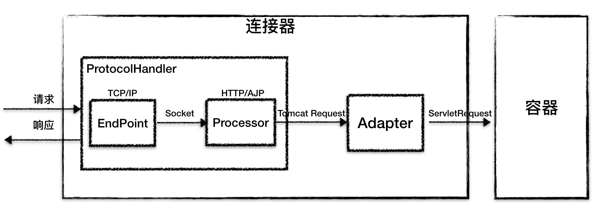
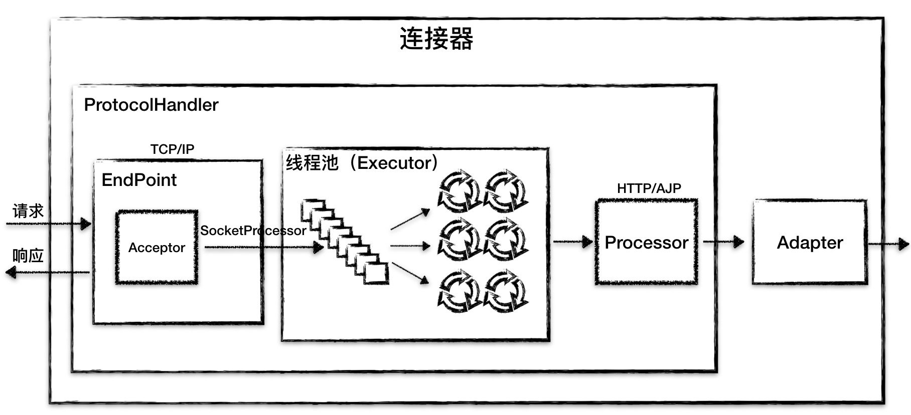
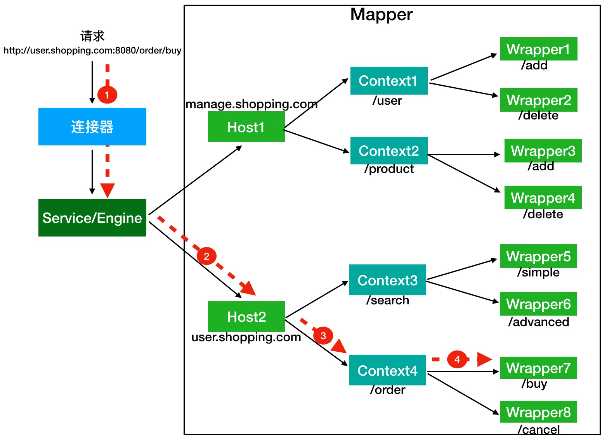

## 服务器

### **Tomcat 常见面试题总结**

> 本文内容主要整理自：
>
> - 《深入拆解 Tomcat & Jetty》
> - 《Tomcat 架构解析》
>
> 感谢这两份资料，尤其是《深入拆解 Tomcat & Jetty》，写的非常赞，看了之后收货颇多。
>
> 虽然这篇文章的内容大部分都不是我的原创，但整理重要的知识点和面试题同样花了不少心思，希望对你有帮助！

#### **Tomcat 介绍**

##### 什么是 Web 容器？

早期的 Web 应用主要用于浏览新闻等静态页面，HTTP 服务器（比如 Apache、Nginx）向浏览器返回静态 HTML，浏览器负责解析
HTML，将结果呈现给用户。

随着互联网的发展，我们已经不满足于仅仅浏览静态页面，还希望通过一些交互操作，来获取动态结果，因此也就需要一些扩展机制能够让
HTTP 服务器调用服务端程序。

于是 Sun 公司推出了 Servlet 技术。你可以把 Servlet 简单理解为运行在服务端的 Java 小程序，但是 Servlet 没有 main
方法，不能独立运行，因此必须把它部署到 Servlet 容器中，由容器来实例化并调用 Servlet。

Tomcat 就是 一个 Servlet 容器。为了方便使用，Tomcat 同时具有 HTTP 服务器的功能。

因此 Tomcat 就是一个“HTTP 服务器 + Servlet 容器”，我们也叫它 Web 容器。

##### 什么是 Tomcat?

简单来说，Tomcat 就是一个“HTTP 服务器 + Servlet 容器”，我们通常也称呼 Tomcat 为 Web 容器。

- HTTP 服务器 ：处理 HTTP 请求并响应结果。

- Servlet 容器 ：HTTP 服务器将请求交给 Servlet 容器处理，Servlet 容器会将请求转发到具体的 Servlet（Servlet 容器用来加载和管理业务类）。

##### **HTTP 服务器工作原理了解吗？**


1. 用户通过浏览器进行了一个操作，比如输入网址并回车，或者是点击链接，接着浏览器获取了这个事件。
2. 浏览器向服务端发出 TCP 连接请求。
3. 服务程序接受浏览器的连接请求，并经过 TCP 三次握手建立连接。
4. 浏览器将请求数据打包成一个 HTTP 协议格式的数据包。
5. 浏览器将该数据包推入网络，数据包经过网络传输，最终达到端服务程序。
6. 服务端程序拿到这个数据包后，同样以 HTTP 协议格式解包，获取到客户端的意图。
7. 得知客户端意图后进行处理，比如提供静态文件或者调用服务端程序获得动态结果。
8. 服务器将响应结果（可能是 HTML 或者图片等）按照 HTTP 协议格式打包。
9. 服务器将响应数据包推入网络，数据包经过网络传输最终达到到浏览器。
10. 浏览器拿到数据包后，以 HTTP 协议的格式解包，然后解析数据，假设这里的数据是 HTML。
11. 浏览器将 HTML 文件展示在页面上。

##### 什么是 Servlet?有什么作用？

Servlet 指的是任何实现了 `Servlet` 接口的类。Servlet 主要用于处理客户端传来的 HTTP 请求，并返回一个响应。

Servlet 接口定义了下面五个方法：

```java
public interface Servlet {
    void init(ServletConfig config) throws ServletException;
    
    ServletConfig getServletConfig();
    
    void service(ServletRequest req, ServletResponse res）throws ServletException, IOException;
    
    String getServletInfo();
    
    void destroy();
}
```

其中最重要是的` service `方法，具体业务类在这个方法里实现业务的具体处理逻辑。

Servlet 容器会根据 `web.xml` 文件中的映射关系，调用相应的 Servlet，Servlet 将处理的结果返回给 Servlet 容器，并通过 HTTP
服务器将响应传输给客户端。


几乎所有的 Java Web 框架（比如 Spring）都是基于 Servlet 的封装。

##### Tomcat 是如何创建 Servlet 的？

当容器启动时，会读取在 webapps 目录下所有的 web 应用中的 web.xml 文件，然后对 xml 文件进行解析，并读取 servlet
注册信息。然后，将每个应用中注册的 Servlet 类都进行加载，并通过 反射的方式实例化。（有时候也是在第一次请求时实例化）。

`<load-on-startup>`元素是 `<servlet>`元素的一个子元素，它用于指定 Servlet 被加载的时机和顺序。在 `<load-on-startup> `
元素中，设置的值必须是一个整数。如果这个值是一个负数，或者没有设定这个元素，Servlet 容器将在客户端首次请求这个 Servlet
时加载它;如果这个值是正整数或 0，Servlet 容器将在 Web 应用启动时加载并初始化 Servlet，并且 `<load-on-startup> `的值越小，它对应的
Servlet 就越先被加载。

具体配置方式如下所示：

```xml

<servlet>
    <servlet-name>HelloWorldServlet</servlet-name>
    <servlet-class>
        cn.itcast.firstapp.servlet.HelloWorldServlet
    </servlet-class>
    <!--设置Servlet在Web应用启动时初始化-->
    <load-on-startup>1</load-on-startup>
</servlet>
<servlet-mapping>
<!--HelloWorldServlet在Tomcat启动时就被自动加载并且初始化了。-->
<servlet-name>HelloWorldServlet</servlet-name>
<url-pattern>/helloWorldServlet</url-pattern>
</servlet-mapping>
```

#### **Tomcat 文件夹**


- /bin：存放 Windows 或 Linux 平台上启动和关闭 Tomcat 的脚本文件。
- /conf：存放 Tomcat 的各种全局配置文件，其中最重要的是 server.xml。
- /lib：存放 Tomcat 以及所有 Web 应用都可以访问的 JAR 文件。
- /logs：存放 Tomcat 执行时产生的日志文件。
- /work：存放 JSP 编译后产生的 Class 文件。
- /webapps：Tomcat 的 Web 应用目录，默认情况下把 Web 应用放在这个目录下。

##### **bin 目录有什么作用？**

```bash
$ ls tomcat/bin
bootstrap.jar                 configtest.bat  setclasspath.bat  tcnative-1.dll*       tool-wrapper.sh*
catalina.bat                  configtest.sh*  setclasspath.sh*  tomcat8.exe*          version.bat
catalina.sh*                  daemon.sh*      shutdown.bat      tomcat8w.exe*         version.sh*
catalina-tasks.xml            digest.bat      shutdown.sh*      tomcat-juli.jar
commons-daemon.jar            digest.sh*      startup.bat       tomcat-native.tar.gz
commons-daemon-native.tar.gz  service.bat     startup.sh*       tool-wrapper.bat
```

bin 目录保存了对 Tomcat 进行控制的相关可执行程序。

上面的文件中，主要分为两类：.bat 和 .sh。.bat 是 window 平台的批处理文件，用于在 window 中执行。而 .sh 则是在 Linux 或者 Unix
上执行的。

比较常用的是下面两个：

- startup.sh（startup.bat）用来启动 Tomcat 服务器。
- shutdown.sh（shutdown.bat）用来关闭已经运行的 Tomcat 服务器。

##### webapps 目录有什么作用？

webapps 目录用来存放应用程序，当 Tomcat 启动时会去加载 webapps 目录下的应用程序。可以以文件夹、war 包、jar 包的形式发布应用。

当然，你也可以把应用程序放置在磁盘的任意位置，在配置文件中映射好就行。

#### Tomcat 总体架构

Tomcat 要实现 2 个核心功能：

1. 处理 Socket 连接，负责网络字节流与 Request 和 Response 对象的转化。
2. 加载和管理 Servlet，以及具体处理 Request 请求。

因此 Tomcat 设计了两个核心组件 **连接器（Connector）** 和 **容器（Container）** 来分别做这两件事情。


##### 连接器有什么作用?

连接器对 Servlet 容器屏蔽了协议及 I/O 模型等的区别，无论是 HTTP 还是 AJP，在容器中获取到的都是一个标准的` ServletRequest `
对象。

我们可以把连接器的功能需求进一步细化，比如：

- 监听网络端口。
- 接受网络连接请求。
- 读取网络请求字节流。
- 根据具体应用层协议（HTTP/AJP）解析字节流，生成统一的 Tomcat Request 对象。
- 将 Tomcat Request 对象转成标准的 ServletRequest。
- 调用 Servlet 容器，得到 ServletResponse。
- 将 ServletResponse 转成 Tomcat Response 对象。
- 将 Tomcat Response 转成网络字节流。
- 将响应字节流写回给浏览器。

通过分析连接器的详细功能列表，我们发现连接器需要完成 3 个高内聚的功能：

- **网络通信。**
- **应用层协议解析。**
- **Tomcat Request/Response 与 ServletRequest/ServletResponse 的转化。**

因此 Tomcat 的设计者设计了 3 个组件来实现这 3 个功能，分别是 **Endpoint、Processor 和 Adapter (适配器模式)**。

**Endpoint 负责提供字节流给 Processor，Processor 负责提供 Tomcat Request 对象给 Adapter，Adapter 负责提供 ServletRequest
对象给容器。**



连接器用 `ProtocolHandler` 接口来封装通信协议和 I/O 模型的差异，`ProtocolHandler` 内部又分为` Endpoint` 和 `Processor`
模块，`Endpoint `负责底层 `Socket` 通信，`Processor` 负责应用层协议解析。连接器通过适配器 `Adapter `调用容器。



如果要支持新的 I/O 方案、新的应用层协议，只需要实现相关的具体子类，上层通用的处理逻辑是不变的。

##### 容器是怎么设计的？

Tomcat 设计了 4 种容器，分别是 **Engine、Host、Context 和 Wrapper**。这 4 种容器不是平行关系，而是父子关系。


- **Context** 表示一个 Web 应用程序；
- **Wrapper** 表示一个 Servlet，一个 Web 应用程序中可能会有多个 Servlet；
- **Host** 代表的是一个虚拟主机，或者说一个站点，可以给 Tomcat 配置多个虚拟主机地址，而一个虚拟主机下可以部署多个 Web 应用程序；
- **Engine** 表示引擎，用来管理多个虚拟站点，一个 Service 最多只能有一个 Engine。

你可以再通过 Tomcat 的 `server.xml `配置文件来加深对 Tomcat 容器的理解。Tomcat 采用了组件化的设计，它的构成组件都是可配置的，其中最外层的是
Server，其他组件按照一定的格式要求配置在这个顶层容器中。


##### 请求是如何定位到 Servlet 的？

Tomcat 是怎么确定请求是由哪个 Wrapper 容器里的 Servlet 来处理的呢？

Mapper`组件的功能就是将用户请求的 URL 定位到一个 Servlet。它的工作原理是：Mapper 组件里保存了 Web
应用的配置信息，其实就是容器组件与访问路径的映射关系，比如 Host 容器里配置的域名、Context 容器里的 Web 应用路径，以及
Wrapper 容器里 Servlet 映射的路径，你可以想象这些配置信息就是一个多层次的 Map。

注意：**一个请求 URL 最后只会定位到一个 Wrapper 容器，也就是一个 Servlet。**

举个例子：有一个网购系统，有面向网站管理人员的后台管理系统，还有面向终端客户的在线购物系统。这两个系统跑在同一个 Tomcat
上，为了隔离它们的访问域名，配置了两个虚拟域名：manage.shopping.com 和 user.shopping.com 。



假如有用户访问一个 URL，比如图中的http://user.shopping.com:8080/order/buy，Tomcat 如何将这个 URL 定位到一个 Servlet 呢？

1. **根据协议和端口号选定 Service 和 Engine :** URL 访问的是 8080 端口，因此这个请求会被 HTTP 连接器接收，而一个连接器是属于一个
   Service 组件的，这样 Service 组件就确定了
2. **根据域名选定 Host :** 域名是 user.shopping.com，因此 Mapper 会找到 Host2 这个容器。
3. **根据 URL 路径找到 Context 组件 。**
4. **根据 URL 路径找到 Wrapper（Servlet） :** Context 确定后，Mapper 再根据 web.xml 中配置的 Servlet 映射路径来找到具体的
   Wrapper 和 Servlet。

##### Tomcat 为什么要打破双亲委托机制？

Tomcat 自定义类加载器打破双亲委托机制的目的是为了优先加载 Web 应用目录下的类，然后再加载其他目录下的类，这也是 Servlet
规范的推荐做法。

要打破双亲委托机制，需要继承 ClassLoader 抽象类，并且需要重写它的 loadClass 方法，因为 ClassLoader 的默认实现就是双亲委托。

##### Tomcat 如何隔离 Web 应用？

首先让我们思考这一下这几个问题：

1. 假如我们在 Tomcat 中运行了两个 Web 应用程序，两个 Web 应用中有同名的 Servlet，但是功能不同，Tomcat 需要同时加载和管理这两个同名的
   Servlet 类，保证它们不会冲突，因此 Web 应用之间的类需要隔离。

2. 假如两个 Web 应用都依赖同一个第三方的 JAR 包，比如 Spring，那 Spring 的 JAR 包被加载到内存后，Tomcat 要保证这两个 Web
   应用能够共享，也就是说 Spring 的 JAR 包只被加载一次，否则随着依赖的第三方 JAR 包增多，JVM 的内存会膨胀。

3. 跟 JVM 一样，我们需要隔离 Tomcat 本身的类和 Web 应用的类。

为了解决上面这些问题，Tomcat 设计了类加载器的层次结构。


**我们先来看第 1 个问题: Web 应用之间的类之间如何隔离？**

假如我们使用 JVM 默认` AppClassLoader` 来加载 Web 应用，`AppClassLoader` 只能加载一个` Servlet`
类，在加载第二个同名` Servlet`类时，`AppClassLoader` 会返回第一个` Servlet` 类的 `Class `实例，这是因为在 `AppClassLoader`
看来，同名的 `Servlet `类只被加载一次。

**Tomcat 的解决方案是自定义一个类加载器 `WebAppClassLoader`， 并且给每个 Web 应用创建一个类加载器实例**。 我们知道，Context
容器组件对应一个 Web 应用，因此，**每个 Context 容器负责创建和维护一个 WebAppClassLoader 加载器实例**
。这背后的原理是，不同的加载器实例加载的类被认为是不同的类，即使它们的类名相同。这就相当于在 Java 虚拟机内部创建了一个个相互隔离的
Java 类空间，每一个 Web 应用都有自己的类空间，Web 应用之间通过各自的类加载器互相隔离。

**我们再来看第 2 个问题: 两个 Web 应用之间怎么共享库类，并且不能重复加载相同的类?**

我们知道，在双亲委托机制里，各个子加载器都可以通过父加载器去加载类，那么把需要共享的类放到父加载器的加载路径下不就行了吗，应用程序也正是通过这种方式共享
JRE 的核心类。因此 Tomcat 的设计者又加了一个类加载器 SharedClassLoader，作为 WebAppClassLoader 的父加载器，专门来加载 Web
应用之间共享的类。如果 WebAppClassLoader 自己没有加载到某个类，就会委托父加载器 SharedClassLoader 去加载这个类，*
*SharedClassLoader 会在指定目录下加载共享类，之后返回给 WebAppClassLoader，这样共享的问题就解决了。**

**我们再来看第 3 个问题:如何隔离 Tomcat 本身的类和 Web 应用的类？**

我们知道，要共享可以通过父子关系，要隔离那就需要兄弟关系了。兄弟关系就是指两个类加载器是平行的，它们可能拥有同一个父加载器，但是两个兄弟类加载器加载的类是隔离的。基于此
Tomcat 又设计一个类加载器 CatalinaClassLoader，专门来加载 Tomcat 自身的类。这样设计有个问题，那 Tomcat 和各 Web
应用之间需要共享一些类时该怎么办呢？

老办法，还是再增加一个 `CommonClassLoader`，作为` CatalinaClassLoader `和 `SharedClassLoader`
的父加载器。`CommonClassLoader` 能加载的类都可以被 `CatalinaClassLoader` 和 `SharedClassLoader`
使用，而 `CatalinaClassLoader` 和 `SharedClassLoader` 能加载的类则与对方相互隔离。`WebAppClassLoader`
可以使用 `SharedClassLoader `加载到的类，但各个 `WebAppClassLoader `实例之间相互隔离。

#### 性能优化

##### 如何监控 Tomcat 性能？

Tomcat 的关键的性能指标主要有 **吞吐量、响应时间、错误数、线程池、CPU 以及 JVM 内存**。

1. 通过 JConsole 监控 Tomcat

2. 命令行查看 Tomcat 指标

3. prometheus + grafana

##### JVM GC 原理及调优的基本思路

**Tomcat 基于 Java，也是跑在 JVM 中，因此，我们要对 Tomcat 进行调优的话，先要了解 JVM 调优的原理。**

**JVM 调优主要是对 JVM 垃圾收集的优化。**一般来说是因为有问题才需要优化，所以对于 JVM GC 来说，如果你观察到 Tomcat 进程的
CPU 使用率比较高，并且在 GC 日志中发现 GC 次数比较频繁、GC 停顿时间长，这表明你需要对 GC 进行优化了。

**在对 GC 调优的过程中，我们不仅需要知道 GC 的原理，更重要的是要熟练使用各种监控和分析工具，具备 GC 调优的实战能力。**

**CMS 和 G1 是时下使用率比较高的两款垃圾收集器，从 Java 9 开始，采用 G1 作为默认垃圾收集器，**而 G1 的目标也是逐步取代 CMS。

##### 如何选择 IO 模型？

I/O 调优实际上是连接器类型的选择，一般情况下默认都是 NIO，在绝大多数情况下都是够用的，除非你的 Web 应用用到了 TLS
加密传输，而且对性能要求极高，这个时候可以考虑 APR，因为 APR 通过 OpenSSL 来处理 TLS 握手和加 / 解密。OpenSSL 本身用 C
语言实现，它还对 TLS 通信做了优化，所以性能比 Java 要高。

**那你可能会问那什么时候考虑选择 NIO.2？**

- 如果你的 Tomcat 跑在 Windows 平台上，并且 HTTP 请求的数据量比较大，可以考虑 NIO.2，这是因为 Windows 从操作系统层面实现了真正意义上的异步
  I/O，如果传输的数据量比较大，异步 I/O 的效果就能显现出来。

- 如果你的 Tomcat 跑在 Linux 平台上，建议使用 NIO，这是因为 Linux 内核没有很完善地支持异步 I/O 模型，因此 JVM 并没有采用原生的
  Linux 异步 I/O，而是在应用层面通过 epoll 模拟了异步 I/O 模型，只是 Java NIO 的使用者感觉不到而已。因此可以这样理解，在
  Linux 平台上，Java NIO 和 Java NIO.2 底层都是通过 epoll 来实现的，但是 Java NIO 更加简单高效。

### **Nginx 常见面试题总结**

#### 什么是 Nginx ？

俄罗斯的工程师 Igor Sysoev，在 Rambler Media 工作期间使用 C 语言开发并开源了 Nginx。

Nginx 同 Apache 一样都是 WEB 服务器，不过，Nginx 更加轻量级，它的内存占用少，启动极快，高并发能力强，在互联网项目中广泛应用。并且，Nginx
可以作为反向代理服务器使用，支持 IMAP/POP3/SMTP 服务。

> Web 服务器：负责处理和响应用户请求，一般也称为 HTTP 服务器。

官网：https://nginx.org/

#### Nginx 的特点是有哪些？

1. 内存占用非常少 ：一般情况下，10000 个非活跃的 HTTP Keep-Alive 连接在 Nginx 中仅消耗 2.5MB 的内存，这是 Nginx 支持高并发连接的基础。

2. 高并发 : 单机支持 10 万以上的并发连接

3. 跨平台 :可以运行在 Linux，Windows，FreeBSD，Solaris，AIX，Mac OS 等操作系统上。

4. 扩展性好 ：第三方插件非常多！

5. 安装使用简单 ：对于简单的应用场景，我们很快就能够上手使用。

6. 稳定性好 ：bug 少，不会遇到各种奇葩的问题。

7. 免费 ：开源软件，免费使用。

8. ......

#### Nginx 能用来做什么？

##### 静态资源服务器

Nginx 是一个 HTTP 服务器，可以将服务器上的静态文件（如 HTML、图片）通过 HTTP 协议展现给客户端。因此，我们可以使用 Nginx 搭建静态资源
Web 服务器

不过，记得使用 gzip 压缩静态资源来减少网络传输。

举个例子：我们来使用 Nginx 搭建一个静态网页服务。先将静态网页上传到服务器，然后修改`/nginx/conf `目录下的 `nginx.conf `
文件(Nginx 配置文件)。修改完成之后，重启 Nginx，再请求对应 `ip/域名 + 端口 + 资源 `地址就可以访问到网页。

```nginx
server {
	// 监听的端口号
	listen       80;
	// server 名称
	server_name  localhost;

	// 匹配 api，将所有 :80/api 的请求指到指定文件夹
	location /api {
		root   /mnt/web/;
		// 默认打开 index.html
		index  index.html index.htm;
	}
}
```

##### 反向代理

客户端将请求发送到反向代理服务器，由反向代理服务器去选择目标服务器，获取数据后再返回给客户端。对外暴露的是反向代理服务器地址，隐藏了真实服务器
IP 地址。反向代理“代理”的是目标服务器，这一个过程对于客户端而言是透明的。

举个例子：公司内网部署了 3 台服务器，客户端请求直接经过代理服务器，由代理服务器将请求转发到内网服务器并最终决定哪一台服务器处理客户端请求。


反向代理隐藏了真实的服务器，为服务器收发请求，使真实服务器对客户端不可见。一般在处理跨域请求的时候比较常用。现在基本上所有的大型网站都设置了反向代理。

Nginx 支持配置反向代理，通过反向代理实现网站的负载均衡。

##### 正向代理

> 提示 ：想要理解正确理解和区分正向代理和反向代理，你要关注的是代理对象，正向代理“代理”的是客户端，反向代理“代理”的是目标服务器。
>
> 一位大佬说的一句话挺精辟的：代理其实就是一个中介，A 和 B 本来可以直连，中间插入一个 C，C 就是中介。刚开始的时候，代理多数是帮助内网
> client 访问外网 server 用的（比如 HTTP 代理），从内到外 . 后来出现了反向代理，"反向"这个词在这儿的意思其实是指方向相反，即代理将来自外网
> client 的请求 forward 到内网 server，从外到内

Nginx 主要被作为反向代理服务器使用，不过，其同样也是正向代理服务器的一个选择。

客户端通过正向代理服务器访问目标服务器。正向代理“代理”的是客户端，目标服务器不知道客户端是谁，也就是说客户端对目标服务器的这次访问是透明的。

为了实现正向代理，客户端需要设置正向代理服务器的 IP 地址以及代理程序的端口。

举个例子：我们无法直接访问外网，但是可以借助科学上网工具 VPN 来访问。VPN
会把访问外网服务器（目标服务器）的客户端请求代理到一个可以直接访问外网的代理服务器上去。代理服务器会把外网服务器返回的内容再转发给客户端。


外网服务器并不知道客户端是通过 VPN 访问的

简单来说： **你可以将正向代理看作是一个位于客户端和目标服务器之间的代理服务器，其主要作用就是转达客户端请求从目标服务器上获取指定的内容。
**

**相关阅读：**

- [使用 Nginx 作为 HTTPS 正向代理服务器](https://developer.aliyun.com/article/706196)
- [图解及代码实现正向代理、反向代理及负载均衡](https://bbs.huaweicloud.com/blogs/301714)

##### 负载均衡

如果一台服务器处理用户请求处理不过来的话，一个简单的办法就是增加多台服务器（服务器集群）部署相同的服务来处理用户请求。

Nginx 可以将接收到的客户端请求以一定的规则（负载均衡策略）均匀地分配到这个服务器集群中所有的服务器上，这个就叫做 **负载均衡
**。

可以看出，Nginx 在其中充当的就是反向代理服务器的作用，负载均衡正是 Nginx 作为反向代理服务器最常见的一个应用。

除此之外，Nginx 还带有**健康检查**（服务器心跳检查）功能，会定期轮询向集群里的所有服务器发送健康检查请求，来检查集群中是否有服务器处于异常状态。


##### 动静分离

动静分离就是把动态请求和静态请求分开，不是讲动态页面和静态页面物理分离，可以理解为 Nginx 处理静态页面，Tomcat 或者其他 Web
服务器处理动态页面。

动静分离可以减轻 Tomcat 或者其他 Web 服务器的压力，提高网站响应速度。

#### **Nginx 有哪些负载均衡策略？**

> 相关参考：
>
> - [五分钟看懂 Nginx 负载均衡](https://www.zoo.team/article/nginx)
> - [Nginx 官方文档](https://docs.nginx.com/nginx/admin-guide/load-balancer/http-load-balancer/)
>
> Nginx 的负载均衡策略不止下面介绍的这四种，我这里只是列举几个比较常用的负载均衡策略。

##### 轮询（Round Robin，默认）

轮询为负载均衡中较为基础也较为简单的算法。

如果没有配置权重的话，每个请求按时间顺序逐一分配到不同的服务器处理。

```nginx
upstream backserver {
  server 172.27.26.174:8099;
  server 172.27.26.175:8099;
  server 172.27.26.176:8099;
}
```

如果配置权重的话，权重越高的服务器被访问的概率就越大。

```nginx
upstream backserver {
  server 172.27.26.174:8099 weight=6;
  server 172.27.26.175:8099 weight=2;
  server 172.27.26.176:8099 weight=3;
}
```

未加权重的轮询算法适合于服务器性能相近的集群，其中每个服务器承载相同的负载。加权轮询算法适合于服务器性能不等的集群，权重的存在可以使请求分配更加合理化。

##### IP 哈希

根据发出请求的和护短 ip 的 hash 值来分配服务器，可以保证同 IP 发出的请求映射到同一服务器，或者具有相同 hash 值的不同 IP
映射到同一服务器。

```nginx
upstream backserver {
  ip_hash;
  server 172.27.26.174:8099;
  server 172.27.26.175:8099;
  server 172.27.26.176:8099;
}
```

和轮询一样，IP 哈希也可以配置权重，如果有两个活动连接数相同的服务器，权重大的被访问的概率就越大。

该算法在一定程度上解决了集群部署环境下 Session 不共享的问题。

##### 最小连接数

当有新的请求出现时，遍历服务器节点列表并选取其中活动连接数最小的一台服务器来响应当前请求。活动连接数可以理解为当前正在处理的请求数。

```nginx
upstream backserver {
  least_conn;
  server 172.27.26.174:8099;
  server 172.27.26.175:8099;
  server 172.27.26.176:8099;
}
```

#### Nginx 常用命令有哪些？

- 启动 nginx 。
- 停止 nginx -s stop 或 nginx -s quit 。
- 重载配置 ./sbin/nginx -s reload(平滑重启) 或 service nginx reload 。
- 重载指定配置文件 .nginx -c /usr/local/nginx/conf/nginx.conf 。
- 查看 nginx 版本 nginx -v 。
- 检查配置文件是否正确 nginx -t 。
- 显示帮助信息 nginx -h 。

#### Nginx 性能优化的常见方式？

- 设置 Nginx 运行工作进程个数 ：一般设置 CPU 的核心数或者核心数 x2；

- 开启 Gzip 压缩 ：这样可以使网站的图片、CSS、JS 等文件在传输时进行压缩，提高访问速度, 优化 Nginx
  性能。详细介绍可以参考[Nginx 性能优化功能- Gzip 压缩(大幅度提高页面加载速度)](https://www.cnblogs.com/kevingrace/p/10018914.html)
  这篇文章；

- 设置单个 worker 进程允许客户端最大连接数 ：一般设置为 65535 就足够了；

- 连接超时时间设置 ：避免在建立无用连接上消耗太多资源；

- 设置缓存 ：像图片、CSS、JS 等这类一般不会经常修改的文件，我们完全可以设置图片在浏览器本地缓存，提高访问速度，优化 Nginx 性能。

- ......

#### LVS、Nginx、HAproxy 有什么区别？

LVS、Nginx、HAProxy 是目前使用最广泛的三种软件负载均衡软件。

- LVS 是 Linux Virtual Server 的简称，也就是 Linux 虚拟服务器。LVS 是四层负载均衡，建立在 OSI 模型的第四层（传输层）之上，性能非常强大。

- HAProxy 可以工作在四层和七层（传输层和应用层），是专门用来做代理服务器的。

- Nginx 负载均衡主要是对七层网络通信模型中的第七层应用层上的 HTTP、HTTPS 进行支持。Nginx 是以反向代理的方式进行负载均衡的。

#### Nginx 如何实现后端服务健康检查？

我们可以利用第三方模块 upstream_check_module 来检测后端服务的健康状态，如果后端服务器不可用，则所有的请求不转发到这台服务器。

upstream_check_module 是一款阿里的一位大佬开源的，使用 Perl 和 C 编写而成，Github
地址 ：https://github.com/yaoweibin/nginx_upstream_check_module 。

关于 upstream_check_module
实现后端服务健康检查的具体做法可以参考[Nginx 负载均衡健康检查功能](https://cloud.tencent.com/developer/article/1700001)
这篇文章。


#### 如何保证 Nginx 服务的高可用？

Nginx 可以结合 Keepalived 来实现高可用。

**什么是 Keepalived ？** 根据官网介绍：

> Keepalived 是一个用 C 语言编写的开源路由软件，是 Linux 下一个轻量级别的负载均衡和高可用解决方案。Keepalived
> 的负载均衡依赖于众所周知且广泛使用的 Linux 虚拟服务器 (IPVS 即 IP Virtual Server，内置在 Linux 内核中的传输层负载均衡器)
> 内核模块，提供第 4 层负载平衡。Keepalived 实现了一组检查器用于根据服务器节点的健康状况动态维护和管理服务器集群。
>
> Keepalived 的高可用性是通过虚拟路由冗余协议（VRRP 即 Virtual Router Redundancy Protocol，实现路由器高可用的协议）实现的，可以用来解决单点故障。
>
> Github 地址：https://github.com/acassen/keepalived

Keepalived 不仅仅可以和 Nginx
搭配使用，还可以和 [LVS](https://wsgzao.github.io/post/lvs-keepalived/)、[MySQL](https://programmer.group/high-availability-scheme-implementation-of-mysql-master-replication-keepalived.html)、[HAProxy](https://docs.oracle.com/cd/E37670_01/E41138/html/section_sm3_svy_4r.html)
等软件配合使用。

再来简单介绍一下 Keepalived+Nginx 实现高可用的常见方法：

1. 准备 2 台 Nginx 服务器，一台为主服务，一台为备用服务；
2. 在两台 Nginx 服务器上安装并配置 Keepalived；
3. 为两台 Nginx 服务器绑定同一个虚拟 IP；
4. 编写 Nginx 检测脚本用于通过 Keepalived 检测 Nginx 主服务器的状态是否正常；

如果 Nginx 主服务器宕机的话，会自动进行故障转移，备用 Nginx 主服务器升级为主服务。并且，这个切换对外是透明的，因为使用的虚拟
IP，虚拟 IP 不会改变。

相关阅读：

- [Nginx 系列教程（五）| 利用 Nginx+Keepalived 实现高可用技术 |](https://juejin.cn/post/6970093569096810526)
- [搭建 Keepalived Nginx 高可用 Web 集群 - 华为云](https://support.huaweicloud.com/bestpractice-vpc/bestpractice_0010.html)

> 📄友情提示 ：下面的内容属于 Nginx 的进阶指点，主要是一些 Nginx 底层原理相关的知识。你可以根据自身情况选择是否掌握这部分内容，如果你的简历没有写熟练掌握
> Nginx 使用及原理的话，面试官一般不会问这么深入。

#### Nginx 总体架构了解吗？

> 关于 Nginx 总结架构的详细解答，请看这篇文章：[最近和 Nginx 杠上了！](https://mp.weixin.qq.com/s/CxapDUkSdqBbuJU4JrQ8Aw)

对于传统的 HTTP 和反向代理服务器而言，在处理并发请求的时候会使用单进程或线程的模式处理，同时会止网络或输入/输出操作。

这种方式会消耗大量的内存和 CPU 资源。因为每产生一个单独的进程或线程需要准备一套新的运行时环境，包括分配堆和堆栈内存，以及创建新的执行上下文。

可以想象在处理多请求时会生成对应数目的线程或进程，导致由于线程在不断上下文切换上耗费大量资源。

由于上面的原因，Nginx 在设计之初就使用了模块化、事件驱动、异步处理，非阻塞的架构。

一张图来了解 Nginx 的总结架构:


#### Nginx 进程模型了解么？

> 关于进程模型的详细解答，请看这篇文章：[Nginx 工作模式和进程模型](https://learnku.com/articles/38414)

Nginx 启动后，会产生一个 master 主进程，主进程执行一系列的工作后会产生一个或者多个工作进程 worker 进程。master 进程用来管理
worker 进程， worker 进程负责处理网络请求。也就是说 Nginx 采用的是经典的 master-worker 模型的多进程模型 。

#### Nginx 如何处理 HTTP 请求？

- [Nginx 是如何处理 HTTP 头部的？](https://segmentfault.com/a/1190000022348375)

- [Nginx 处理 HTTP 请求的 11 个阶段](https://segmentfault.com/a/1190000022709975)

#### 系统学习

Guide 整理了下面一些文章和书籍帮助你系统学习 Nginx。

##### 文章推荐

- [连前端都看得懂的《Nginx 入门指南》](https://juejin.cn/post/6844904129987526663)

- [Nginx 入门教程，敲简单，10 分钟搞定](https://juejin.cn/post/7046190661015437325)

- [Nginx 最全操作总结 - 腾讯技术工程](https://mp.weixin.qq.com/s?src=11&timestamp=1644900743&ver=3621&signature=kF*VLvQFEeSVlGkPxn542LNLa7S1gQpIZrgywwvQR5EH*p3jwU*HW0GeyQYOeQ3HrPJag8mIjHQg3C0PW72Y-JyGFgsUh-yUiIbrxwnzsHE02e4Plp8vyYINJfb-3WYW&new=1)

- [Nginx 系列：Nginx 原理](http://ningg.top/nginx-series-principle/)

- [Nginx 流量复制](https://www.cnblogs.com/cjsblog/p/12163207.html)

##### 书籍推荐

[《深入理解 Nginx（第 2 版）》](https://book.douban.com/subject/26745255/) 这本书是初学者学习 Nginx 的首选，讲的非常细致！
