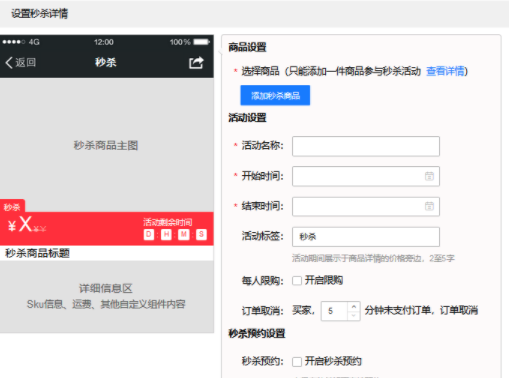
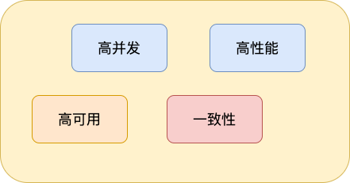
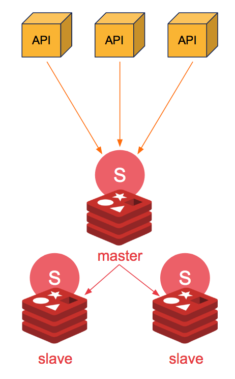
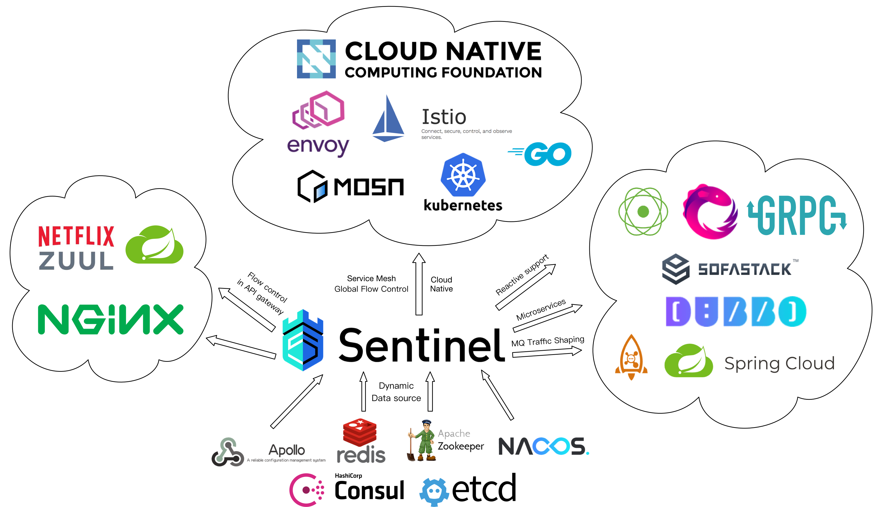
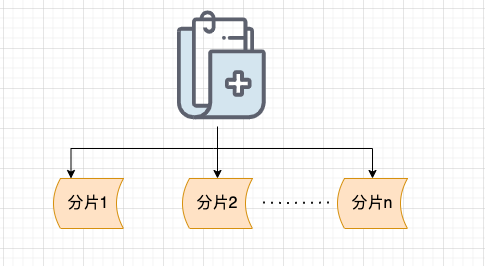
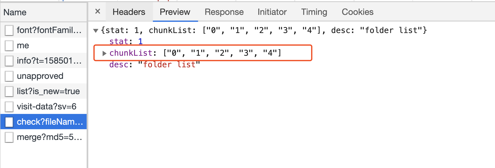
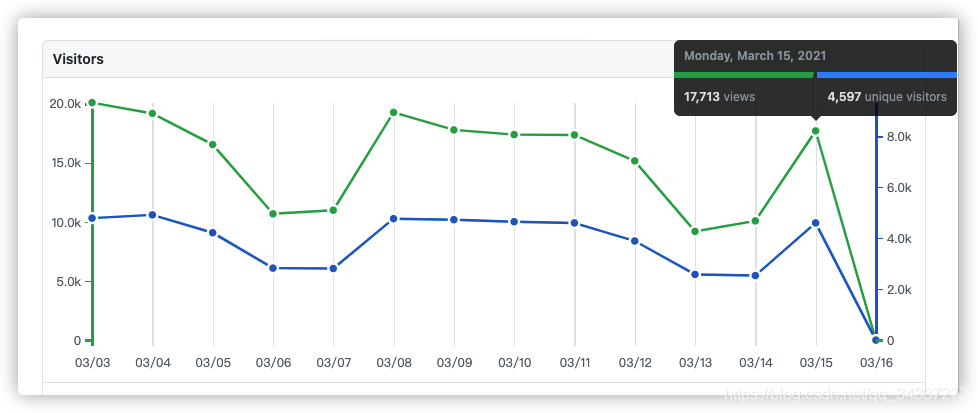

## 系统设计

### 如何准备系统设计面试

**系统设计在面试中一定是最让面试者头疼的事情之一**
。因为系统设计相关的问题通常是开放式的,所以没有标准答案。你在和面试官思想的交流碰撞中会慢慢优化自己的系统设计方案。理论上来说,系统设计面试官一起一步一步改进原有系统设计方案的过程。

系统设计题往往也非常能考察岀面试者的综合能力,回答好的话,很易就能在面试中脱颖而岀。不论是对于参加社招还是校招的小伙伴,都很有必要重视起来接下来。

我会带着小伙伴们从我的角度出发来谈谈:**如何准备面试中的系统设计**

由于文章篇幅有限,就不列举实际例子了,可能会在后面的文章中单独提一些具体的例子

**系统设计面试一般怎么问**

我简单总下系统设计面试相关问题的问法个

1. 设计某某系统比如秒杀系统、微博系统、抢红包系统、短网址系统
2. 设计某某系统中一个功能比如哔哩哔哩点赞功能
3. 设计一个框架比如RPC框架、消息队列、缓存框架、分布式文件系统等等
4. 某某系统的技术选型比如缓存用`Redis`还是`Memcached`、网关用`Spring Cloud Gateway`还是`Netflix Zuul2`

#### **系统设计怎么做？**

我们将步骤总结成了以下 4 步。

##### **Step1:问清楚系统具体要求**

**当面试官给出了系统设计题目之后，一定不要立即开始设计解决方案**。 你需要先理解系统设计的需求：功能性需求和非功能性需求。

为了避免自己曲解题目所想要解决的问题，你可以先简要地给面试官说说自己的理解，

**为啥要询问清楚系统的功能性需求也就是说系统包含哪些功能呢？**

毕竟，如果面试官冷不丁地直接让你设计一个微博系统，你不可能把微博系统涵盖的功能比如推荐信息流、会员机制等一个一个都列举出来，然后再去设计吧！你需要筛选出系统所提供的核心功能（
**缩小边界范围**）！

**为啥要询问清楚系统的非功能性需求或者说约束条件比如系统需要达到多少QPS呢？**

让你设计一个1w人用的微博系统和100w人用的微博系统能一样么？不同的约束系统对应的系统设计方案肯定是不一样的。

##### **Step2:对系统进行抽象设计**

我们需要在一个 High Level 的层面对系统进行设计。

你可以画出系统的抽象架构图，这个抽象架构图中包含了系统的一些组件以及这些组件之间的连接。

##### *
*Step3:考虑系统目前需要优化的点**

对系统进行抽象设计之后，你需要思考当前抽象的系统设计有哪些需要优化的点，比如说：

1. 当前系统部署在一台机器够吗？是否需要部署在多台机器然后进行负载均衡呢？
2. 数据库处理速度能否支撑业务需求？是否需要给指定字段加索引？是否需要读写分离？是否需要缓存？
3. 数据量是否大到需要分库分表？
4. 是否存在安全隐患？
5. 系统是否需要分布式文件系统？
6. ......

##### **Step4:优化你的系统抽象设计**

根据 Step 3 中的“系统需要优化的点” 对系统的抽象设计做进一步完善。

#### **系统设计该如何准备？**

##### 知识储备

系统设计面试非常考察你的知识储备，系统设计能力的提高需要大量的理论知识储备。比如说你要知道大型网站架构设计必备的三板斧：

**1.高性能架构设计：** 熟悉系统常见性能优化手段比如引入 读写分离、缓存、负载均衡、异步 等等。

**2.高可用架构设计 ：**CAP理论和BASE理论、通过集群来提高系统整体稳定性、超时和重试机制、应对接口级故障：降级、熔断、限流、排队。

**3.高扩展架构设计 ：**说白了就是懂得如何拆分系统。你按照不同的思路来拆分软件系统，就会得到不同的架构。

##### 实战

虽然懂得了理论，但是自己没有进行实践的话，很多东西是无法体会到的！

因此，你还要**不断通过实战项目锻炼自己的系统设计能力**。

##### 保持好奇心

多思考自己经常浏览的网站是怎么做的。比如：

1你刷微博的时候可以思考一下微博是如何记录点赞数量的？

2你看哔哩哔哩的时候可以思考一下消息提醒系统是如何做的？

3你使用短链系统的时候可以考虑一下短链系统是如何做的？

4......

##### 技术选型

实现同样的功能，一般会有多种技术选择方案，比如缓存用Redis 还是 `Memcached`、网关用` Spring Cloud Gateway `
还是`Netflix Zuul2` 。 很多时候，面试官在系统设计面过程中会具体到技术的选型，因而，你需要区分不同技术的优缺点。

#### 系统设计面试必知

> 系统设计的时候必然离不开描述性能相关的指标比如 QPS。

##### 性能相关的指标

###### 响应时间

**响应时间RT(Response-time)就是用户发出请求到用户收到系统处理结果所需要的时间。**

RT是一个非常重要且直观的指标，RT数值大小直接反应了系统处理用户请求速度的快慢。

###### 并发数

**并发数可以简单理解为系统能够同时供多少人访问使用也就是说系统同时能处理的请求数量。**

并发数反应了系统的负载能力。

###### QPS 和 TPS

- **QPS（Query Per Second）** ：服务器每秒可以执行的查询次数；

- **TPS（Transaction Per Second）** ：服务器每秒处理的事务数（这里的一个事务可以理解为客户发出请求到收到服务器的过程）；

书中是这样描述 QPS 和 TPS 的区别的。

> QPS vs TPS：QPS 基本类似于
> TPS，但是不同的是，对于一个页面的一次访问，形成一个TPS；但一次页面请求，可能产生多次对服务器的请求，服务器对这些请求，就可计入“QPS”之中。如，访问一个页面会请求服务器2次，一次访问，产生一个“T”，产生2个“Q”。

###### 吞吐量

**吞吐量指的是系统单位时间内系统处理的请求数量。**

一个系统的吞吐量与请求对系统的资源消耗等紧密关联。请求对系统资源消耗越多，系统吞吐能力越低，反之则越高。

TPS、QPS都是吞吐量的常用量化指标。

- QPS（TPS） = 并发数/平均响应时间(RT)

- 并发数 = QPS * 平均响应时间(RT)

##### 系统活跃度

介绍几个描述系统活跃度的常见名词，建议牢牢记住。你不光会在回答系统设计面试题的时候碰到，日常工作中你也会经常碰到这些名词。

###### PV(Page View)

访问量, 即页面浏览量或点击量，衡量网站用户访问的网页数量；在一定统计周期内用户每打开或刷新一个页面就记录1次，多次打开或刷新同一页面则浏览量累计。UV
从网页打开的数量/刷新的次数的角度来统计的。

###### UV(Unique Visitor)

独立访客，统计1天内访问某站点的用户数。1天内相同访客多次访问网站，只计算为1个独立访客。UV 是从用户个体的角度来统计的。

###### DAU(Daily Active User)

日活跃用户数量。

###### MAU(monthly active users)

月活跃用户人数。

举例：某网站 DAU为 1200w， 用户日均使用时长 1 小时，RT为0.5s，求并发量和QPS。

平均并发量 = DAU（1200w）* 日均使用时长（1 小时，3600秒） /一天的秒数（86400）=1200w/24 = 50w

真实并发量（考虑到某些时间段使用人数比较少） = DAU（1200w）* 日均使用时长（1 小时，3600秒）
/一天的秒数-访问量比较小的时间段假设为8小时（57600）=1200w/16 = 75w

峰值并发量 = 平均并发量 * 6 = 300w

QPS = 真实并发量/RT = 75W/0.5=150w/s

##### 常用性能测试工具

###### 后端常用

既然系统设计涉及到系统性能方面的问题，那在面试的时候，面试官就很可能会问：**你是如何进行性能测试的？**

推荐 4 个比较常用的性能测试工具：

1. Jmeter ：Apache JMeter 是 JAVA 开发的性能测试工具。

2. LoadRunner：一款商业的性能测试工具。

3. Galtling ：一款基于Scala 开发的高性能服务器性能测试工具。

4. ab ：全称为 Apache Bench 。Apache 旗下的一款测试工具，非常实用。

没记错的话，除了 **LoadRunner** 其他几款性能测试工具都是开源免费的。

###### 前端常用

1. Fiddler：抓包工具，它可以修改请求的数据，甚至可以修改服务器返回的数据，功能非常强大，是Web 调试的利器。

2. HttpWatch: 可用于录制HTTP请求信息的工具。

##### 常见软件的QPS

这里给出的 QPS 仅供参考，实际项目需要进行压测来计算。

- Nginx ：一般情况下，系统的性能瓶颈基本不会是 Nginx。单机 Nginx 可以达到 30w +。

- Redis:  Redis 官方的性能测试报告：https://redis.io/topics/benchmarks  。从报告中，我们可以得出 Redis 的单机 QPS 可以达到
  8w+（CPU性能有关系，也和执行的命令也有关系比如执行 SET 命令甚至可以达到10w+QPS）。

- MySQL:  MySQL 单机的 QPS 为 大概在 4k 左右。

- Tomcat ：单机 Tomcat 的QPS 在 2w左右。这个和你的 Tomcat 配置有很大关系，举个例子Tomcat 支持的连接器有 NIO、NIO.2 和 APR。
  AprEndpoint 是通过 JNI 调用 APR 本地库而实现非阻塞 I/O 的，性能更好，Tomcat 配置 APR 为 连接器的话，QPS 可以达到
  3w左右。更多相关内容可以自行搜索 Tomcat 性能优化。

##### 系统设计原则

**合适优于先进 > 演化优于一步到位 > 简单优于复杂**

##### 常见的性能优化策略

性能优化之前我们需要对请求经历的各个环节进行分析，排查出可能出现性能瓶颈的地方，定位问题。

下面是一些性能优化时，我经常拿来自问的一些问题：

1. 当前系统的SQL语句是否存在问题？

2. 当前系统是否需要升级硬件？

3. 系统是否需要缓存？

4. 系统架构本身是不是就有问题？

5. 系统是否存在死锁的地方？

6. 数据库索引使用是否合理？

7. 系统是否存在内存泄漏？（Java 的自动回收内存虽然很方便，但是，有时候代码写的不好真的会造成内存泄漏）

8. 系统的耗时操作进行了异步处理？

9. ……

##### 性能优化必知法则

**SQL优化，JVM、DB，Tomcat参数调优 > 硬件性能优化（内存升级、CPU核心数增加、机械硬盘—>固态硬盘等等）> 业务逻辑优化/缓存 >
读写分离、集群等 > 分库分表**

#### 系统设计面试的注意事项

##### 想好再说

没必要面试官刚问了问题之后，你没准备好就开始回答。这样不会给面试官带来好印象的！系统设计本就需要面试者结合自己的以往的经验进行思考，这个过程是需要花费一些时间的。

##### 没有绝对的答案

系统设计没有标准答案。重要的是你和面试官一起交流的过程。

一般情况下，你会在和面试官的交流过程中，一步一步完成系统设计。这个过程中，你会在面试官的引导下不断完善自己的系统设计方案。

因此，你不必要在系统设计面试之前找很多题目，然后只是单纯记住他们的答案。

##### 勿要绝对

系统设计没有最好的设计方案，只有最合适的设计方案。这就类比架构设计了：**软件开发没有银弹，架构设计的目的就是选择合适的解决方案。
何为银弹？** 狼人传说中，只有银弹(银质子弹)才能制服这些猛兽。对应到软件开发活动中，银弹特指开发者们寻求的一种克服软件开发这个难缠的猛兽的“万能钥匙🔑”。

##### 权衡利弊

知道使用某个技术可能会为系统带来的利弊。比如使用消息队列的好处是解耦和削峰，但是，同样也让系统可用性降低、复杂性提高，同时还会存在一致性问题（消息丢失或者消息未被消费咋办）。

##### 慢慢优化

刚开始设计的系统不需要太完美，可以慢慢优化。

##### 不追新技术

使用稳定的、适合业务的技术，不必要过于追求新技术。

##### 追简避杂

系统设计应当追求简单避免复杂。KISS（ Keep It Simple, Stupid）原则——保持简单，易于理解。

#### 总结

这篇文章简单带着小伙伴们分析了一下系统设计面试。如果你还想要深入学习的话，可以参考： https://github.com/donnemartin/system-design-primer  。

### 如何设计一个秒杀系统

大家好，我是 Guide哥！

今天这篇文章咱们就开始从后端的角度来谈谈：“如何设计秒杀系统？”。

在你看这篇文章之前，我想说的是系统设计没有一个标准答案，你需要结合自己的过往经验来回答，我这篇文章也是简单说说自己的看法。

**下面是正文！**

设计秒杀系统之前，我们首先需要对秒杀系统有一个清晰的认识。

秒杀系统主要为商品（往往是爆款商品）秒杀活动提供支持，这个秒杀活动会限制商品的个数以及秒杀持续时间。



**为什么秒杀系统的设计是一个难点呢？** 是因为它的业务复杂么？ 当然不是！

秒杀系统的业务逻辑非常简单，一般就是下订单减库存，难点在于我们如何保障秒杀能够顺利进行。



- 秒杀开始的时候，会有大量用户同时参与进来，因此秒杀系统一定要满足 高并发 和 高性能 。
- 为了保证秒杀整个流程的顺利进行，整个秒杀系统必须要满足 高可用 。
- 除此之外，由于商品的库存有限，在面对大量订单的情况下，一定不能超卖，我们还需要保证 一致性 。

> 很多小伙伴可能不太了解当代三高互联网架构：高并发、高性能、高可用。
>
> 我这里简单解释一下：高并发简单来说就是能够同时处理很多用户请求。高性能简单来说就是处理用户的请求速度要快。高可用简单来说就是我们的系统要在趋近
> 100% 的时间内都能正确提供服务。

知道了秒杀系统的特点之后，我们站在技术层面来思考一下：“设计秒杀系统的过程中需要重点关注哪些问题”。

1. 参与秒杀的商品属于热点数据，我们该如何处理热点数据？
2. 商品的库存有限，在面对大量订单的情况下，如何解决超卖的问题？
3. 如果系统用了消息队列，如何保证消息队列不丢失消息？
4. 如何保证秒杀系统的高可用？
5. 如何对项目进行压测？有哪些工具？
6. ......

好的，废话不多说！正式开始！

#### 高并发&高性能

##### 热点数据处理

**何为热点数据？** 热点数据指的就是某一时间段内被大量访问的数据，比如爆款商品的数据、新闻热点。

**为什么要关注热点数据？** 热点数据可能仅仅占据系统所有数据的 0.1% ，但是其访问量可能是比其他所有数据之和还要多。不重点处理热点数据，势必会给系统资源消耗带来严峻的挑战。

**热点数据的分类？** 根据热点数据的特点，我们通常将其分为两类：

- 静态热点数据 ：可以提前预测到的热点数据比如要秒杀的商品。

- 动态热点数据 ： 不能够提前预测到的热点数据，需要通过一些手段动态检测系统运行情况产生。

另外，处理热点数据的问题的关键就在于 **我们如何找到这些热点数据（或者说热 key），然后将它们存在 jvm 内存里**。
对于并发量非常一般的系统直接将热点数据存放进缓存比如 Redis 中就可以了，不过像淘宝、京东这种级别的并发量，如果把某些热点数据放在
Redis 中，直接可能就将整个 Redis 集群给干掉了。

**如何检测热点数据？**

我了解到的是市面上也有一些类似的中间件，比如京东零售的 [hotkey](https://gitee.com/jd-platform-opensource/hotkey)
就是一款专门用于检测热点数据的中间件，它可以毫秒级探测热点数据，毫秒级推送至服务器集群内存。相关阅读：[京东毫秒级热 key 探测框架设计与实践，已完美支撑 618 大促](https://mp.weixin.qq.com/s/xOzEj5HtCeh_ezHDPHw6Jw) 。

另外，我们平时使用 Redis 做缓存比较多，关于如何快速定位 Redis
热点数据，可以看下[如何快速定位 Redis 热 key](https://www.infoq.cn/article/3l3zaq4h8xpnom2glsyi)这篇文章。


**如何处理热点数据？** 热点数据一定要放在缓存中，并且最好可以写入到 jvm 内存一份（多级缓存），并设置个过期时间。需要注意写入到
jvm 的热点数据不宜过多，避免内存占用过大，一定要设置到淘汰策略。

**为什么还要放在 jvm 内存一份？** 因为放在 jvm 内存中的数据访问速度是最快的，不存在什么网络开销。

##### 流量削峰

**消息队列**

秒杀开始之后的流量不是很大，我处理不了嘛！那我就先把这些请求放到消息队列中去。然后，咱后端服务再慢慢根据自己的能力去消费这些消息，这样就避免直接把后端服务打垮掉。


消息队列是一种非常实用的流量削峰手段。只要是涉及到流量削峰，那必然不可缺少消息队列。

**回答问题/验证码**

我们可以在用户发起秒杀请求之前让其进行答题或者输入验证码。

这种方式一方面可以避免用户请求过于集中，另一方面可以有效解决用户使用脚本作弊。

回答问题/验证码这一步建议除了对答案的正确性做校验，还需要对用户的提交时间做校验，比如提交时间过短（<1s）的话，大概就是使用脚本来处理的。

#### 高可用

##### 集群化

如果我们想要保证系统中某一个组件的高可用，往往需要搭建集群来避免单点风险，比如说 Nginx 集群、Kafka 集群、Redis 集群。

我们拿 Redis 来举例说明。**如果我们需要保证 Redis 高可用的话，该怎么做呢？**

你直接通过 Redis replication（异步复制） 搞个一主(master)多从(slave)来提高可用性和读吞吐量，slave 的多少取决于你的读吞吐量。


这样的方式有一个问题：一旦 master 宕机，slave 晋升成 master，同时需要修改应用方的主节点地址，还需要命令所有从节点去复制新的主节点，整个过程需要人工干预。

不过，这个问题我们可以通过 Sentinel（哨兵） 来解决。Redis Sentinel 是 Redis 官方推荐的高可用性(HA)解决方案。

Sentinel 是 Redis 的一种运行模式 ，它主要的作用就是对 Redis 运行节点进行监控。当 master 节点出现故障的时候， Sentinel
会帮助我们实现故障转移，确保整个 Redis 系统的可用性。整个过程完全自动，不需要人工介入!



Sentinel 也是一个 Redis 进程，只是不对外提供读写服务，通常哨兵要配置成单数。

##### 限流

限流是从用户访问压力的角度来考虑如何应对系统故障。限流为了对服务端的接口接受请求的频率进行限制，防止服务挂掉。

🌰 举个例子：我们的秒杀接口一秒只能处理 10w 个请求，结果秒杀活动刚开始一下子来了 15w 个请求。这肯定不行啊！我们只能通过限流把
5w 个请求给拦截住，不然系统直接就给整挂掉了！

限流的话可以直接用 Redis 来做（建议基于 Lua 脚本），也可以使用现成的流量控制组件比如 Sentinel 、Hystrix 、Resilience4J 。

[Hystrix](https://github.com/Netflix/Hystrix) 是 Netflix 开源的熔断降级组件。

[Sentinel](https://github.com/alibaba/Sentinel) 是阿里巴巴体提供的面向分布式服务架构的流量控制组件，经历了淘宝近10年双11（11.11）购物节的所有核心场景（比如秒杀活动）的考验。

Sentinel 主要以流量为切入点，提供 **流量控制、熔断降级、系统自适应保护**等功能来保护系统的稳定性和可用性。


个人比较建议使用 Sentinel ，更新维护频率更高，功能更强大，并且生态也更丰富（Sentinel 提供与 Spring Cloud、Dubbo 和 gRPC
等常用框架和库的开箱即用集成， Sentinel 未来还会对更多常用框架进行适配，并且会为 Service Mesh 提供集群流量防护的能力）。



##### 排队

你可以把排队看作是限流的一个变种。限流是直接拒绝了用户的请求，而排队则是让用户等待一定的时间（类比现实世界的排队）。

排队虽然没有直接拒绝用户，但用户等了很长时间后进入系统，体验并不一定比限流好。

🌰 举个例子：当请求量达到一个阈值的时候，我们就通知用户让它们排队。等到系统可以继续处理请求之后，再慢慢来处理。

##### 降级

降级是从系统功能优先级的角度考虑如何应对系统故障。

服务降级指的是当服务器压力剧增的情况下，根据当前业务情况及流量对一些服务和页面有策略的降级，以此释放服务器资源以保证核心任务的正常运行。降级的核心思想就是丢车保帅，优先保证核心业务。例

🌰 举个例子：当请求量达到一个阈值的时候，我们对系统中一些非核心的功能直接关闭或者让它们功能降低。这样的话，系统就有更多的资源留给秒杀功能了！

##### 熔断

熔断和降级是两个比较容易混淆的概念，两者的含义并不相同。降级的目的在于应对系统自身的故障，而熔断的目的在于应对当前系统依赖的外部系统或者第三方系统的故障。

熔断可以防止因为秒杀交易影响到其他正常服务的提供

🌰 举个例子： 秒杀功能位于服务 A 上，服务 A 上同时还有其他的一些功能比如商品管理。如果服务 A 上的商品管理接口响应非常慢的话，其他服务直接不再请求服务
A 上的商品管理这个接口，从而有效避免其他服务被拖慢甚至拖死。

#### 一致性

##### 减库存方案

常见的减库存方案有：

- 下单即减库存 ：只要用户下单了，即使不付款，我们就扣库存。

- 付款再减库存 ：当用户付款了之后，我们在减库存。不过， 这种情况可能会造成用户下订单成功，但是付款失败。

一般情况下都是 **下单减扣库存** ，像现在的购物网站比如京东都是这样来做的。

不过，我们还会对业务逻辑做进一步优化，比如说对超过一定时间不付款的订单特殊处理，释放库存。

对应到代码层面，我们应该如何保证不会超卖呢？

我们上面也说，我们一般会提前将秒杀商品的信息放到缓存中去。我们可以通过 Redis 对库存进行原子操作。伪代码如下：

```java
// 第一步：先检查 库存是否充足
Integer stockNum = (Integer)redisTemplate.get(key);
if(stockNum<1){
    ...
}
// 第二步：如果库存充足，减少库存（假设只能购买一件）
Long count = redisTemplate.increment(key,-1);
if(count>=0){
    ...
}else{
    ...
}
```

你也可以通过 Lua 脚本来减少多个命令的网络开销并保证多个命令整体的原子性。伪代码如下：

```Lua
-- 第一步：先检查 库存是否充足，库存不足，返回0
local stockNum=tonumber(redis.call("get",key));
if stockNum<1 then
    return 0;
-- 第二部：如果库存充足，减少库存（假设只能购买一件），返回1
else
    redis.call('DECRBY',key,1);
    return 1;
end
```

##### 接口幂等

**什么是幂等呢?** 在分布式系统中，幂等(idempotency)是对请求操作结果的一个描述，这个描述就是不论执行多少次相同的请求，产生的效果和返回的结果都和发出单个请求是一样的。

🌰 举个例子：假如咱们的前后端没有保证接口幂等性，我作为用户在秒杀商品的时候，我同时点击了多次秒杀商品按钮，后端处理了多次相同的订单请求，结果导致一个人秒杀了多个商品。这个肯定是不能出现的，属于非常严重的
bug 了！

保证分布式接口的幂等性对于数据的一致性至关重要，特别是像支付这种涉及到钱的接口。保证幂等性**这个操作并不是说前端做了就可以的，后端同样要做。
**

前端保证幂等性的话比较简单，一般通过当用户提交请求后将按钮致灰来做到。后端保证幂等性就稍微麻烦一点，方法也是有很多种，比如：

1. 同步锁；

2. 分布式锁；

3. 业务字段的唯一索性约束，防止重复数据产生。

4. ......

拿分布式锁来说，我们通过加锁的方式限制用户在第一次请求未结束之前，无法进行第二次请求。

分布式锁一般基于 Redis 来做比较多一些，这也是我比较推荐的一种方式。另外，如果使用 Redis 来实现分布式锁的话，比较推荐基于
Redisson。相关阅读：[分布式锁中的王者方案 - Redisson](https://mp.weixin.qq.com/s?__biz=Mzg2OTA0Njk0OA==&mid=2247505586&idx=2&sn=7e9c7739b1a2c56849d371144556ff80&chksm=cea19979f9d6106f9b5fdce34a285e31d61981bdd58fe6b3a2fc9da23f21a9b01123d715dd96&token=1297266129&lang=zh_CN#rd) 。

```java
// 1.设置分布式锁
RLock lock = redisson.getLock("lock");
// 2.占用锁
lock.lock();
// 3.执行业务
...
// 4.释放锁
lock.unlock();
```

当然了，除了 Redis 之外，像 ZooKeeper 等中间也可以拿来做分布式锁。

#### 性能测试

上线之前压力测试是必不可少的。推荐 4 个比较常用的性能测试工具：

1. **Jmeter ：**Apache JMeter 是 JAVA 开发的性能测试工具。
2. **LoadRunner：**一款商业的性能测试工具。
3. **Galtling ：**一款基于 Scala 开发的高性能服务器性能测试工具。
4. **ab ：**全称为 Apache Bench 。Apache 旗下的一款测试工具，非常实用。

没记错的话，除了 **LoadRunner** 其他几款性能测试工具都是开源免费的。

#### 总结

我简单画了一张图来总结一下上面涉及到的一些技术。


另外，上面涉及到知识点还蛮多的，如果面试官单独挑出一个来深挖还是能够问出很多问题的。

比如面试官想在消息队里上进行深挖，可能会问：

- 常见消息队列的对比
- 如何保证消息的消费顺序？
- 如何保证消息不丢失？
- 如何保证消息不重复消费？
- 如何设计一个消息队列？
- ......

再比如面试官想在 Redis 上深挖的话，可能会问：

- Redis 常用的数据结构了解么？
- Redis 如何保证数据不丢失？
- Redis 内存占用过大导致响应速度变慢怎么解决？
- 缓存穿透、缓存雪崩了解么？怎么解决？
- ......

因此，要想要真正搞懂秒杀系统的设计，你还需要将其涉及到的一些技术给研究透！

### 如何自己实现一个RPC框架

像设计一个 RPC 框架/消息队列这类问题在面试中还是非常常见的。这是一道你花点精力稍微准备一下就能回答上来的一个问题。如果你回答的比较好的话，那面试官肯定会对你印象非常不错！

消息队列的设计实际上和 RPC 框架/非常类似，我这里就先拿 RPC 框架开涮。

#### 如果让你自己设计 RPC 框架你会如何设计？

一般情况下， RPC 框架不仅要提供服务发现功能，还要提供负载均衡、容错等功能，这样的 RPC 框架才算真正合格的。

为了便于小伙伴们理解，我们先从一个最简单的 RPC
框架使用示意图开始。这也是 [guide-rpc-framework](https://github.com/Snailclimb/guide-rpc-framework) 目前的架构 。


从上图我们可以看出：**服务提供端 Server 向注册中心注册服务，服务消费者 Client 通过注册中心拿到服务相关信息，然后再通过网络请求服务提供端
Server。**

作为 RPC 框架领域的佼佼者[Dubbo](https://github.com/apache/dubbo)的架构如下图所示,和我们上面画的大体也是差不多的。


下面我们再来看一个比较完整的 RPC 框架使用示意图如下：


**参考上面这张图，我们简单说一下设计一个最基本的 RPC 框架的思路或者说实现一个最基本的 RPC 框架需要哪些东西：**

##### 注册中心

注册中心首先是要有的。比较推荐使用 Zookeeper 作为注册中心。
ZooKeeper 为我们提供了高可用、高性能、稳定的分布式数据一致性解决方案，通常被用于实现诸如数据发布/订阅、负载均衡、命名服务、分布式协调/通知、集群管理、Master
选举、分布式锁和分布式队列等功能。并且，ZooKeeper 将数据保存在内存中，性能是非常棒的。
在“读”多于“写”的应用程序中尤其地高性能，因为“写”会导致所有的服务器间同步状态。（“读”多于“写”是协调服务的典型场景）。

关于 ZooKeeper
的更多介绍可以看我总结的这篇文章：[《ZooKeeper 相关概念总结》](https://javaguide.cn/distributed-system/distributed-process-coordination/zookeeper/zookeeper-intro.html)

当然了，如果你想通过文件来存储服务地址的话也是没问题的，不过性能会比较差。

注册中心负责服务地址的注册与查找，相当于目录服务。 服务端启动的时候将服务名称及其对应的地址(ip+port)
注册到注册中心，服务消费端根据服务名称找到对应的服务地址。有了服务地址之后，服务消费端就可以通过网络请求服务端了。

我们再来结合 Dubbo 的架构图来理解一下！


上述节点简单说明：

- Provider： 暴露服务的服务提供方
- Consumer： 调用远程服务的服务消费方
- Registry： 服务注册与发现的注册中心
- Monitor： 统计服务的调用次数和调用时间的监控中心
- Container： 服务运行容器

调用关系说明：

1. 服务容器负责启动，加载，运行服务提供者。
2. 服务提供者在启动时，向注册中心注册自己提供的服务。
3. 服务消费者在启动时，向注册中心订阅自己所需的服务。
4. 注册中心返回服务提供者地址列表给消费者，如果有变更，注册中心将基于长连接推送变更数据给消费者。
5. 服务消费者，从提供者地址列表中，基于软负载均衡算法，选一台提供者进行调用，如果调用失败，再选另一台调用。
6. 服务消费者和提供者，在内存中累计调用次数和调用时间，定时每分钟发送一次统计数据到监控中心。

##### 网络传输

**既然我们要调用远程的方法，就要发送网络请求来传递目标类和方法的信息以及方法的参数等数据到服务提供端。**

网络传输具体实现你可以使用 **Socket** （ Java 中最原始、最基础的网络通信方式。但是，Socket 是阻塞 IO、性能低并且功能单一）。

你也可以使用同步非阻塞的 I/O 模型 **NIO** ，但是用它来进行网络编程真的太麻烦了。不过没关系，你可以使用基于 NIO 的网络编程框架
Netty ，它将是你最好的选择！

我先简单介绍一下 Netty ，后面的文章中我会详细介绍到。

1. **Netty 是一个基于 NIO 的 client-server(客户端服务器)框架，使用它可以快速简单地开发网络应用程序。**
2. 它极大地简化并简化了 TCP 和 UDP 套接字服务器等网络编程,并且性能以及安全性等很多方面甚至都要更好。
3. 支持多种协议如 FTP，SMTP，HTTP 以及各种二进制和基于文本的传统协议。

##### 序列化和反序列化

要在网络传输数据就要涉及到**序列化。为什么需要序列化和反序列化呢？**
因为网络传输的数据必须是二进制的。因此，我们的 Java 对象没办法直接在网络中传输。为了能够让 Java 对象在网络中传输我们需要将其
**序列化**为二进制的数据。我们最终需要的还是目标 Java 对象，因此我们还要将二进制的数据“解析”为目标 Java 对象，也就是对二进制数据再进行一次
**反序列化**。

另外，不仅网络传输的时候需要用到序列化和反序列化，将对象存储到文件、数据库等场景都需要用到序列化和反序列化。


JDK 自带的序列化，只需实现 java.io.Serializable接口即可，不过这种方式不推荐，因为不支持跨语言调用并且性能比较差。

现在比较常用序列化的有 **hessian、kyro、protostuff** ......。我会在下一篇文章中简单对比一下这些序列化方式。

##### 动态代理

动态代理也是需要的。很多人可能不清楚为啥需要动态代理？我来简单解释一下吧！

我们知道代理模式就是： 我们给某一个对象提供一个代理对象，并由代理对象来代替真实对象做一些事情。你可以把代理对象理解为一个幕后的工具人。
举个例子：我们真实对象调用方法的时候，我们可以通过代理对象去做一些事情比如安全校验、日志打印等等。但是，这个过程是完全对真实对象屏蔽的。

讲完了代理模式，再来说动态代理在 RPC 框架中的作用。

前面第一节的时候，我们就已经提到 ：**RPC 的主要目的就是让我们调用远程方法像调用本地方法一样简单，我们不需要关心远程方法调用的细节比如网络传输。
**

**怎样才能屏蔽程方法调用的底层细节呢？**

**答案就是动态代理。**简单来说，当你调用远程方法的时候，实际会通过代理对象来传输网络请求，不然的话，怎么可能直接就调用到远程方法。

相关文章： [代理模式详解：静态代理+JDK/CGLIB 动态代理实战](https://javaguide.cn/java/basis/proxy.html)

##### 负载均衡

负载均衡也是需要的。为啥？

举个例子：我们的系统中的某个服务的访问量特别大，我们将这个服务部署在了多台服务器上，当客户端发起请求的时候，多台服务器都可以处理这个请求。那么，如何正确选择处理该请求的服务器就很关键。假如，你就要一台服务器来处理该服务的请求，那该服务部署在多台服务器的意义就不复存在了。负载均衡就是为了避免单个服务器响应同一请求，容易造成服务器宕机、崩溃等问题，我们从负载均衡的这四个字就能明显感受到它的意义。

##### 传输协议

我们还需要设计一个私有的 RPC 协议，这个协议是客户端（服务消费方）和服务端（服务提供方）交流的基础。

简单来说：**通过设计协议，我们定义需要传输哪些类型的数据， 并且还会规定每一种类型的数据应该占多少字节。这样我们在接收到二进制数据之后，就可以正确的解析出我们需要的数据
**。这有一点像密文传输的感觉。

通常一些标准的 RPC 协议包含下面这些内容：

- 魔数 ： 通常是 4
  个字节。这个魔数主要是为了筛选来到服务端的数据包，有了这个魔数之后，服务端首先取出前面四个字节进行比对，能够在第一时间识别出这个数据包并非是遵循自定义协议的，也就是无效数据包，为了安全考虑可以直接关闭连接以节省资源。

- 序列化器编号 ：标识序列化的方式，比如是使用 Java 自带的序列化，还是 json，kyro 等序列化方式。

- 消息体长度 ： 运行时计算出来。

- ......

如果你想看 [guide-rpc-framework](https://github.com/Snailclimb/guide-rpc-framework) 的 RPC 协议设计的话，可以在 Netty
编解码器相关的类中找到。

#### 实现一个最基本的 RPC 框架需要哪些技术？

刚刚我们已经聊了如何实现一个 RPC 框架，下面我们就来看看实现一个最基本的 RPC 框架需要哪些技术吧！

按照我实现的这一款基于 Netty+Kyro+Zookeeper 实现的 RPC 框架来说的话，你需要下面这些技术支撑：

##### Java

1. 动态代理机制；

2. 序列化机制以及各种序列化框架的对比，比如 hession2、kyro、protostuff；

3. 线程池的使用；

4. CompletableFuture 的使用；

5. ......

##### Netty

1. 使用 Netty 进行网络传输；

2. ByteBuf 介绍；

3. Netty 粘包拆包；

4. Netty 长连接和心跳机制；

5. ......

##### Zookeeper

1. 基本概念；

2. 数据结构；

3. 如何使用 Netflix 公司开源的 zookeeper 客户端框架 Curator 进行增删改查；

4. ......

#### 总结

实现一个最基本的 RPC 框架应该至少包括下面几部分:

1. **注册中心 ：**注册中心负责服务地址的注册与查找，相当于目录服务。

2. **网络传输 ：**既然我们要调用远程的方法，就要发送网络请求来传递目标类和方法的信息以及方法的参数等数据到服务提供端。

3. **序列化和反序列化 ：**要在网络传输数据就要涉及到**序列化**。

4. **动态代理 ：**屏蔽程方法调用的底层细节。

5. **负载均衡 ：** 避免单个服务器响应同一请求，容易造成服务器宕机、崩溃等问题。

6. **传输协议 ：**这个协议是客户端（服务消费方）和服务端（服务提供方）交流的基础。

更完善的一点的 RPC 框架可能还有监控模块（拓展：你可以研究一下 Dubbo 的监控模块的设计）。

### 如何设计一个排行榜

排行榜到处可见，比如直播间送礼物的排行榜、朋友圈的微信步数排行榜、王者荣耀中的段位排行榜等等。


今天让我们从程序设计的角度，来看看如何设计一个排行榜！

我们先从最基础的实现方式来说起。

#### MySQL 的 ORDER BY 关键字

第一种要介绍的实现方式就是直接使用 MySQL 的 ORDER BY 关键字。 ORDER BY 关键字可以对查询出来的数据按照指定的字段进行排序。

我相信但凡是学过 MySQL 的人，一定都用过 ORDER BY 关键字！没用过的，先不要看下面的文章了，麻烦默默反思 3 分钟。

```sql
SELECT column1, column2, ...
FROM table_name
ORDER BY column1, column2, ... ASC/DESC;
```

我之前在一个用户数据量不大（6w 用户左右）并且排序需求并不复杂的项目中使用的就是这种方法。

这种方式的优缺点也比较明显。**好处是比较简单，不需要引入额外的组件，成本比较低。坏处就是每次生成排行榜都比较耗时，对数据库的性能消耗非常之大，数据量一大，业务场景稍微复杂一点就顶不住了。
**

我们这里创建一个名为 cus_order 的表，来实际测试一下这种排序方式。为了测试方便， cus_order 这张表只有 id、score、name这 3 个字段。

```sql
CREATE TABLE `cus_order` (
  `id` int(11) unsigned NOT NULL AUTO_INCREMENT,
  `score` int(11) NOT NULL,
  `name` varchar(11) NOT NULL DEFAULT '',
  PRIMARY KEY (`id`)
) ENGINE=InnoDB AUTO_INCREMENT=100000 DEFAULT CHARSET=utf8mb4;
```

我们定义一个简单的存储过程（PROCEDURE）来插入 100w 测试数据。

```sql
DELIMITER ;;
CREATE DEFINER=`root`@`%`PROCEDURE `BatchinsertDataToCusOder`(IN start_num INT, IN max_num INT)
BEGIN
	DECLARE i INT default start_num;
	WHILE i < max_num DO
		insert into `cus_order`(`id`,`score`,`name`)
		values (i,RAND()*1000000,CONCAT(`user`,i));
		SET i=i+1;
	END WHILE;
END;;
DELIMITER;
```

存储过程定义完成之后，我们执行存储过程即可！

```SQL
CALL BatchinsertDataToCusOder(1, 1000000); # 插入100w+的随机数据
```

等待一会，100w 的测试数据就插入完成了！

为了能够对这 100w 数据按照 score 进行排序，我们需要执行下面的 SQL 语句。

```SQL
SELECT `score`,`name` FROM `cus_order` ORDER BY `score` DESC;#降序排序
```

为了能够查看这套 SQL 语句的执行时间，我们需要通过show profiles命令。

不过，请确保你的 profiling 是开启（on）的状态（可以通过 show variables 命令查看）。

默认情况下， profiling 是关闭（off）的状态，你直接通过set @@profiling=1命令即可开启。

然后，我们就查询到了具体的执行速度。

```json
{
  "Query_ID": 6,
  "Duration": 3.63526325,
  "Query": "SELECT `score`,`name` FROM `cus_order` ORDER BY `score` DESC"
}
```

可以看到，一共耗时了接近 4 s。

**如何优化呢？ 加索引并且限制排序数据量** 是一种比较常见的优化方式。

我们对 score 字段加索引，并限制只排序 score 排名前 500 的数据。

这个时候，我们再执行下面的 SQL 语句，速度就快了很多，只需要 0.01 秒就排序了前 500 名的数据。

```json
{
  "Query_ID": 38,
  "Duration": 0.0102915,
  "Query": "SELECT `score`,`name` FROM `cus_order` ORDER BY `score` DESC LIMIT 500"
}
```

当然了，这只是一个最简单的场景，实际项目中的复杂度要比我这里列举的例子复杂很多，执行速度也会慢很多。

不过，**能不用 MySQL 的 ORDER BY 关键字还是要看具体的业务场景。如果说你的项目需要排序数据量比较小并且业务场景不复杂的话（比如你对你博客的所有文章按照阅读量来排序），我觉得直接使用
MySQL 的 ORDER BY 关键字就可以了。**

#### Redis 的 sorted set


了解过 Redis 常见数据结构的小伙伴，都知道 Redis 中有一个叫做 `sorted set `的数据结构经常被用在各种排行榜的场景下。

通过 `sorted set` ，我们能够轻松应对百万级别的用户数据排序。这简直就是专门为排行榜设计的数据结构啊！

Redis 中 sorted set 有点类似于 Java 中的 `TreeSet `和` HashMap` 的结合体，`sorted set `中的数据会按照权重参数` score`
的值进行排序。

| User  | Score |
|-------|-------|
| user1 | 112.0 |
| user2 | 100.0 |
| user3 | 123.0 |
| user4 | 100.0 |
| user5 | 33.0  |
| user6 | 993.0 |

我们这里简单来演示一下。我们把上表中的数据添加到`sorted set`中。

```bash
# 通过 zadd 命令添加了 6 个元素到 cus_order_set 中
127.0.0.1:6379> ZADD cus_order_set 112.0 user1 100.0 user2 123.0 user3 100.0 user4 33.0 user5 993.0 user6
(integer) 6
```


`sorted set `基本可以满足大部分排行榜的场景。

**如果我们要查看包含所有用户的排行榜怎么办？** 通过 ZRANGE (从小到大排序) / ZREVRANGE （从大到小排序）

```bash
# -1 代表的是全部的用户数据，
127.0.0.1:6379> ZREVRANGE cus_order_set 0 -1
1) "user6"
2) "user3"
3) "user1"
4) "user4"
5) "user2"
6) "user5"
```

**如果我们要查看只包含前 3 名的排行榜怎么办？** 限定范围区间即可。

```bash
# 0 为 start  2 为 stop
127.0.0.1:6379> ZREVRANGE cus_order_set 0 2
1) "user6"
2) "user3"
3) "user1"
```

**如果我们需要查询某个用户的分数怎么办呢？** 通过 `ZSCORE `命令即可。

```bash
127.0.0.1:6379> ZSCORE  cus_order_set "user1"
"112"
```

**如果我们需要查询某个用户的排名怎么办呢？** 通过` ZREVRANK `命令即可。

```bahs
127.0.0.1:6379> ZREVRANK  cus_order_set "user3"
(integer) 1 # user3 排名第2
```

**如何对用户的排名数据进行更新呢？** 通过` ZINCRBY`命令即可。

```bash
# 对 user1 的分数加2
127.0.0.1:6379> ZINCRBY cus_order_set +2 "user1"
"114"
# 对 user1 的分数减1
127.0.0.1:6379> ZINCRBY cus_order_set -1 "user1"
"113"
# 查看 user1 的分数
127.0.0.1:6379> ZSCORE  cus_order_set "user1"
"113"
```

除了我上面提到的之外，还有一些其他的命令来帮助你解决更多排行榜场景的需求，想要深入研究的小伙伴可以仔细学习哦！

不过，需要注意的一点是：**Redis 中只保存了排行榜展示所需的数据，需要用户的具体信息数据的话，还是需要去对应的数据库（比如
MySQL）中查。**

你以为这样就完事了？ 不存在的！还有一些无法仅仅通过 Redis 提供的命令解决的场景。

比如，**如何实现多条件排序？** 其实，答案也比较简单，对于大部分场景，我们直接对 score 值做文章即可。

更具体点的话就是，我们根据特定的条件来拼接 score 值即可。比如我们还要加上时间先后条件的话，直接在score 值添加上时间戳即可。

再比如，**如何实现指定日期（比如最近 7 天）的用户数据排序？**

我说一种比较简单的方法：我们把每一天的数据都按照日期为名字，比如 20350305 就代表 2035 年 3 月 5 号。

如果我们需要查询最近 n 天的排行榜数据的话，直接 ZUNIONSTORE来求 n 个 `sorted set `的并集即可。

```bash
ZUNIONSTORE last_n_days n 20350305 20350306....
```

我不知道大家看懂了没有，我这里还是简单地造一些数据模拟一下吧！

```bash
# 分别添加了 3 天的数据
127.0.0.1:6379> ZADD 20350305 112.0 user1 100.0 user2 123.0 user3
(integer) 3
127.0.0.1:6379> ZADD 20350306 100.0 user4
(integer) 1
127.0.0.1:6379> ZADD 20350307 33.0 user5 993.0 user6
(integer) 2
```

通过 ZUNIONSTORE 命令来查看最近 3 天的排行榜情况：

```bash
127.0.0.1:6379> ZUNIONSTORE last_n_days 3 20350305 20350306 20350307
(integer) 6
```

现在，这 3 天的数据都集中在了 last_n_days 中。

```bash
127.0.0.1:6379> ZREVRANGE last_n_days 0 -1
1) "user6"
2) "user3"
3) "user1"
4) "user4"
5) "user2"
6) "user5"
```

如果一个用户同时在多个` sorted set` 中的话，它最终的` score `值就等于这些` sorted set `中该用户的 `score `值之和。

既然可以求并集，那必然也可以求交集。你可以通过 `ZINTERSTORE `命令来求多个 n 个 `sorted set` 的交集。

**有哪些场景可以用到多个`sorted set` 的交集呢？** 比如每日打卡的场景，你对某一段时间每天打卡的人进行排序。

这个命令还有一个常用的权重参数` weights `（默认为
1）。在进行并集/交集的过程中，每个集合中的元素会将自己的 `score` *`weights` 。

我下面演示一下这个参数的作用。

```bash
# staff_set 存放员工的排名信息
127.0.0.1:6379> ZADD staff_set 3.0 staff1 4.0 staff2
(integer) 2
# staff_set 存放管理者的排名信息
127.0.0.1:6379> ZADD manager_set 1.0 manager1 2.0 manager2
(integer) 2
```

如果，我们需要将员工和管理者放在一起比较，不过，两者权重分别为 1 和 3。

```bash
# staff_set 的权重为1 manager_set的权重为3
127.0.0.1:6379> ZUNIONSTORE all_user_set 2 staff_set manager_set WEIGHTS 1 3
(integer) 4
```

最终排序的结果如下：

```bash
127.0.0.1:6379> ZREVRANGE all_user_set 0 -1
1)"manager2"
2)"staff2"
3)"staff1"
4)"manager1"
```

#### 总结

上面我一共提到了两种设计排行榜的方法：

1. MySQL 的 ORDER BY 关键字
2. Redis 的 sorted set

其实，这两种没有孰好孰坏，还是要看具体的业务场景。如果说你的项目需要排序数据量比较小并且业务场景不复杂的话（比如你对你博客的所有文章按照阅读量来排序），我觉得直接使用
MySQL 的 ORDER BY 关键字就可以了，没必要为了排行榜引入一个 Redis。

另外，在没有分页并且数据量不大的情况下，直接在前端拿到所有需要用到的数据之后再进行排序也是可以的。

### 如何设计微博Feed流/信息流系统

“如何设计微博 Feed 流/信息流系统？ ”是一道比较常见的系统设计问题，面试中比较常见。

这篇文章简单谈谈我的看法。个人能力有限，有些地方大家可以结合自己的经验自行扩展！爱你们哦！

**下面是正文！**

Feed 流是社交和资讯平台不可缺少的重要组成。TimeLine 时期，Feed 流推送的机制完全基于时间，比如朋友圈动态、几年前的微信订阅号就是这种机制。

现在的 Feed
流主要是基于智能化/个性化的推荐，简单来说，就是你喜欢什么我就给你推荐什么。这样的话，人们被推送的信息会极大地由自己的个人兴趣主导，你自己所处的信息世界就像桎梏于蚕茧一般的“茧房”中一样。这也就是“信息茧房”所表达的意思。

#### Feed 流基础

##### 何为 Feed 流？

简单来说就是能够实时/智能推送信息的数据流。像咱们的朋友圈动态（timeline）、知乎的推荐（智能化推荐 ）、你订阅的 Up
主的动态（timeline）都属于 **Feed 流**。

##### 几种常见的 Feed 流形式

我总结了 3 种常见的 Feed 流形式。

###### 纯智能推荐

你看到的内容完全是基于你看过的内容而推荐的，比较典型的产品有头条首页推荐、知乎首页推荐。


智能推荐需要依赖 **推荐系统** ，推荐质量的好坏和推荐算法有非常大的关系。

推荐系统的相关文献把它们分成三类：**协同过滤**（仅使用用户与商品的交互信息生成推荐）系统、**基于内容**（利用用户偏好和／或商品偏好）的系统和
混合推荐模型（使用交互信息、用户和商品的元数据）的系统。

另外，随着深度学习应用的爆发式发展，特别是在计算机视觉、自然语言处理和语音方面的进展，基于深度学习的推荐系统越来越引发大家的关注。循环神经网络（RNN）理论上能够有效地对用户偏好和物品属性的动态性进行建模，基于当前的趋势，预测未来的行为。

###### 纯 Timeline

你看到的内容完全按照时间来排序，比较典型的产品有微信朋友圈、QQ 空间、微博关注者动态。

微信朋友圈：


微博关注者动态：


纯 Timeline 这种方式实现起来最简单，直接按照时间排序就行了。

纯 Timeline 这种形式更适用于好友社交领域，用户关注更多的是人发出的内容，而不仅仅是内容。

###### 智能推荐+Timeline

智能推荐+Timeline 这个也是目前我觉得比较好的一种方式，实现起来比较简单，同时又能一定程度地避免 “信息茧房” 的问题。

##### 设计 Feed 流系统的注意事项

1. 实时性 ：你关注的人发了微博信息之后，信息需要在短时间之内出现在你的信息流中。
2. 高并发 ：信息流是微博的主体模块，是用户进入到微博之后最先看到的模块，因此它的并发请求量是最高的，可以达到每秒几十万次请求。
3. 性能 ： 信息流拉取性能直接影响用户的使用体验。微博信息流系统中需要聚合的数据非常多。聚合这么多的数据就需要查询多次缓存、数据库、计数器，而在每秒几十万次的请求下，如何保证在
   100ms 之内完成这些查询操作，展示微博的信息流呢？这是微博信息流系统最复杂之处，也是技术上最大的挑战。
4. ......

#### Feed 流架构设计

我们这里以 微博关注者动态 为例。

##### Feed 流的 3 种推送模式

###### 推模式

当一个用户发送一个动态（比如微博、视频）之后，主动将这个动态推送给其他相关用户（比如粉丝）。

推模式下，我们需要将这个动态插入到每位粉丝对应的 feed 表中，这个存储成本是比较高的。尤其是对于粉丝数量比较多的大 V
来说，每发一条动态，需要存储的数据量实在太大。

假如狗蛋，有 n 个粉丝 1、2 ~ n。那么，狗蛋发一条微博时，我们需要执行的 SQL 语句如下：

```sql
insert into outbox(userId, feedId, create_time) values("goudan", $feedId, $current_time); //写入用户狗蛋的发件箱
insert into inbox(userId, feedId, create_time) values("1", $feedId, $current_time); //写入用户2的收件箱
......
insert into inbox(userId, feedId, create_time) values("n", $feedId, $current_time); //写入用户n的收件箱
```

当我们要查询用户 n 的信息流时，只需要执行下面这条 SQL 就可以了：

```sql
select feedId from inbox where userId = "n";
```

可以很明显的看出，推模式最大的问题就是写入数据库的操作太多。

正常情况下，一个微博用户的粉丝大概在 150 左右，挨个写入也还好。不过，微博大 V
的粉丝可能在几百万，几千万，如果挨个给每个写入一条数据的话，是肯定不能接受的！因此，推模式不适合关注者粉丝过多的场景。

###### 拉模式

不同于推模式，拉模式下我们是自己主动去拉取动态（拉取你关注的人的动态），然后将这些动态根据相关指标（比如时间、热度）进行实时聚合。

拉模式存储成本虽然降低，但是查询和聚合这两个操作的成本会比较高。尤其是对于单个用户关注了很多人的情况来说，你需要定时获取他关注的所有人的动态然后再做聚合，这个成本可想而知。

另外，拉模式下的数据流的实时性要比推模式差的。

###### 推垃结合模式

推拉结合的核心是针对微博大 V 和不活跃用户特殊处理。

首先，我们需要区分出系统哪些用户属于微博大 V（10w 粉丝以上？）。其次，我们需要根据登录行为来判断哪些用户属于不活跃用户。

有了这些数据之后，就好办了！当微博大 V 发送微博的时候，我们仅仅将这条微博写入到活跃用户，不活跃的用户自己去拉取。示意图如下（图片来自：《高并发系统设计
40 问》）：


推拉结合非常适合用户粉丝数比较大的场景。

##### 存储

我们的存储的数据量会比较大，所以，存储库必须要满足可以水平扩展。

一般情况，通用的存储方案就是 **MySQL + Redis** 。MySQL 永久保存数据， Redis 作为缓存提高热点数据的访问速度。


**如果缓存的数据量太大怎么办?** 我们可以考虑使用**Redis Cluster**，也就是 Redis 集群。Redis Cluster 可以帮助我们解决 Redis
大数据量缓存的问题，并且，也方便我们进行横向拓展（增加 Redis 机器）。

为了提高系统的并发，我们可以考虑对数据进行 **读写分离** 和 **分库分表** 。

读写分离主要是为了将数据库的读和写操作分不到不同的数据库节点上。主服务器负责写，从服务器负责读。另外，一主一从或者一主多从都可以。读写分离可以大幅提高读性能，小幅提高写的性能。因此，读写分离更适合单机并发读请求比较多的场景。


分库分表是为了解决由于库、表数据量过大，而导致数据库性能持续下降的问题。常见的分库分表工具有：sharding-jdbc（当当）、TSharding（蘑菇街）、MyCAT（基于
Cobar）、Cobar（阿里巴巴）...。 推荐使用 sharding-jdbc。 因为，sharding-jdbc 是一款轻量级 Java 框架，以 jar
包形式提供服务，不要我们做额外的运维工作，并且兼容性也很好。

[《从零开始学架构》](https://time.geekbang.org/column/intro/100006601?code=i00Nq3pHUcUj04ZWy70NCRl%2FD2Lfj8GVzcGzZ3Wf5Ug%3D)
中的有一张图片对于垂直拆分和水平拆分的描述还挺直观的。


另外，如果觉得分库分表比较麻烦的话，可以考虑使用 [TiDB](https://docs.pingcap.com/zh/tidb/stable) 这类分布式数据库。TiDB 是国内
PingCAP 团队开发的一个分布式 SQL 数据库。其灵感来自于 Google 的 F1, TiDB 支持包括传统 RDBMS 和 NoSQL
的特性，具备水平扩容或者缩容、金融级高可用。


#### 参考

- [Feed 流系统设计-总纲](https://developer.aliyun.com/article/706808) ：写的真心不错！

- [feed 流设计：那些谋杀你时间 APP](http://www.woshipm.com/pd/773523.html) ：可以让你从产品层面明白 Feed 流的一些概念。

#### 相关问题

[微博和知乎中的 feed 流是如何实现的？](https://www.zhihu.com/question/19645686) ：知乎的相关提问

### 如何设计一个短链系统

我平时经常看极客时间上的专栏，上面的每一个专栏 URL 地址都有一个短链与之对应。比如你使用下面两个链接打开的都是 《MySQL 实战
45 讲》这门课程。

- 原始链接：https://time.geekbang.org/column/intro/100020801
- 短链 ：http://gk.link/a/10q2I

有了长链，为什么还要再弄一个短链呢?

1. 短链更简洁，更方便传播：过长的链接不利于在互联网传播；
2. 方便对链接的点击情况做后续追踪：比如查看短链最近一周的访问量、访客数、访问来源......；
3. 对于短信等限制字数的场景来说更加友好：很多社交平台发表动态是有字数限制的，如果你直接使用长链的话，那留给你自己想表达的其他内容的文字就少了很多；
4. ......

#### 短链原理

短链的具体原理其实比较简单，说白了就是： **通过短链找到长链（原始链接），然后再重定向到长链地址即可！**

我画了一个简单的示意图：


🌰 举个例子：我们来访问 “http://gk.link/a/10q2I” 这个链接，从 HTTP 请求信息可以看到请求被重定向了，返回的状态码为 “302”。


另外还有一个比较常用的重定向状态 “301” ， **我们应该用“301” 还是“302”作为状态码更好呢？**

答案是：“302” ，绝大部分短链系统也都是使用的 “302” 作为状态码。

这是因为 “301” 状态码代表永久重定向，只要浏览器拿到长链之后就会对其缓存，下次再请求短链就直接从缓存中拿对应的长链地址。这样的话，我们就没办法对短链进行相关分析了。

而“302” 状态码代表资源被临时重定向了，不会存在上面说的这种问题。

🌰 举个例子：你的活动链接通过短链发送给了 10w+用户，你想知道短链后续的点击情况的话，你使用 “301” 状态码就不行了。

#### 唯一短链生成

原始链接必定是唯一的，我们也要确保生成的短链唯一。

如何生成唯一的短链呢？换言之就是我们如何通过唯一的字符串来表示长链。

比较常见的一种方法就是: 通过哈希算法对长链去哈希。

一般建议使用用非加密型哈希算法比如 MurmurHash 。因为，相比于 MD5，SHA 等加密型哈希算法，非加密型哈希算法往往效率更高！

我们拿 MurmurHash 来说，MurmurHash 当前最新的版本是 MurmurHash3，它能够产生出 32-bit 或 128-bit 哈希值。对于绝大部分场景来说，32-bit
的一般就已经够用了。

```java
//Guava 自带的 MurmurHash 算法实现
String url = "https://time.geekbang.org/column/intro/100020801";
long s = Hashing.murmur3_32().hashUnencodedChars(url).padToLong();// 3394174629
```

生成的哈希值是 10 进制的，为了缩短它的长度，我们可以将其转变为 62 进制即可。10 进制的 3394174629 转换为 62 进制就是 3HHBS5。

我们将 3HHBS5 作为短链的唯一标识拼接即可。

既然使用了哈希算法，那不可避免会出现哈希冲突（不同的长链生成的短链是一样的），虽然概率比较小，但是我们也还是要解决。

**如何判断是否发生了哈希冲突呢？**

判断是否发生哈希冲突也就是看我们生成的短链是否是唯一的。

如果我们使用的是 MySQL，PostgreSQL 这类关系型数据库的话，我们可以给存放短链的字段 sort_url 添加唯一索引。

不过，为了提高性能以及应对高并发，还是建议利用布隆过滤器解决这个问题。

如何解决哈希冲突呢？

解决办法其实也很简单。如果发生哈希冲突，我们就在长链后拼接一个随机字符串。如果拼接了随机字符串还是发生哈希冲突那就再拼接一个随机字符串。

并且，我们要将拼接之后得到的字符串和拼接的字符串都存储起来，通过这两者可以获取长链（原始链接）。

**一个长链对应一个短链还是多个短链呢？**

这个还是要看具体的业务需求。个人建议是一个长链可以在不同的条件（比如生成短链的用户不同）下对应上不同的短链。这样的话，我们可以更好地对短链进行相关分析。

🌰 举个例子：通过小码短连接后台，我们可以看到短连接的访问次数、访问人数等信息。


这样的话，我们对长网址取哈希的时候加上对应的条件信息即可（比如生成短链的用户 ID）。

#### 短链存储

如果我们使用 MySQL，PostgreSQL 这类关系型数据库存储的话，表结构大概是下面这样：

```sql
CREATE TABLE `url_map` (
  `id` int(11) unsigned NOT NULL AUTO_INCREMENT,
  `long_url` varchar(160) DEFAULT NULL COMMENT '长链',
  `sort_url` varchar(10) DEFAULT NULL COMMENT '短链',
  PRIMARY KEY (`id`)
) ENGINE=InnoDB DEFAULT CHARSET=utf8;
```

当然了，也可以使用 Redis 这类 K-V 内存数据库来做，这样性能也会更好！并且，存放在 Redis 中存放的本就是键值对的数据，刚好满足我们的需求。

当我们存放一个长链的时候，我们首先判断一下这个长链是否已经被转换过短链。

如果需要对长链就行区分的话（比如不同的用户使用同一个长链生成的短链不同），我们在判断的时候加上对应的条件即可（比如这个长链对应的用户）。

这里不能直接根据长链哈希之后得到的短链来判断长链是否已经被转换过短链，因为不同的长链生成的短链可能是一样的（哈希冲突，不过，概率很低）。

我个人建议不论是否使用 Redis 数据库，都要将最近比较活跃的短连接存放在缓存中。为了避免缓存过大，我们可以为这些放在缓存中的短连接设置一个过期时间。

### 如何设计一个站内消息系统

> 这篇文章是一位朋友投稿给我的，我简单完善了一下。

各位使用过简书，知乎或 B 站的小伙伴应该都有这样的使用体验：当有其他用户关注我们或者私信我们的行为时，我们会收到相关的消息。

虽然这些功能看上去简单，但其背后的设计是非常复杂的，几乎是一个完成的系统，可以称之为 站内消息系统。

我以 B 站举例（个人认为 B 站的消息系统是我见过的非常完美的，UI 也最为人性化的）：


可以看到 B 站把消息大致分为了三类：

1. 系统推送的通知(System Notice)；
2. 回复、@、点赞等用户行为产生的提醒(Remind)；
3. 用户之间的私信(Chat)。

这样设计不仅分类明确，且处于同一个主体的事件提醒还会做一个聚合，极大的提高了用户体验，不让用户收到太多分散的消息。

举个例子：比如你在某个视频或某篇文章下发表了评论，有 100 个人给你的评论点了赞，那么你希望消息页面呈现的是一个一个用户给你点赞的提醒，还是像以下聚合之后的提醒：


我相信你大概率会选择后者。

我认为对于很多应用来说，这样的设计都是非常合理的，接下来我写写我对于消息系统的设计。

#### 系统通知(System Notice)

系统通知一般是由后台管理员发出，然后指定某一类（全体，个人等）用户接收。基于此设想，可以把系统通知大致分为两张表：

1. **t_manager_system_notice（管理员系统通知表） ：**记录管理员发出的通知 ；
2. **t_user_system_notice（用户系统通知表） ：** 存储用户接受的通知。

t_manager_system_notice（管理员系统通知表） 表结构如下：

| 字段名              | 类型        | 描述                                                              |
|------------------|-----------|-----------------------------------------------------------------|
| system_notice_id | LONG      | 系统通知 ID                                                         |
| title            | VARCHAR   | 标题                                                              |
| content          | TEXT      | 内容                                                              |
| type             | VARCHAR   | 发给哪些用户：单用户 single；全体用户 all，vip 用户，具体类型各位小伙伴可以根据自己的需求选择          |
| state            | BOOLEAN   | 是否已被拉取过，如果已经拉取过，就无需再次拉取                                         |
| recipient_id     | LONG      | 接受通知的用户的 ID，如果 type 为单用户，那么 recipient 为该用户的 ID;否则 recipient 为 0 |
| manager_id       | LONG      | 发布通知的管理员 ID                                                     |
| publish_time     | TIMESTAMP | 发布时间                                                            |

t_user_system_notice（用户系统通知表）结构如下：

| 字段名              | 类型        | 描述          |
|------------------|-----------|-------------|
| user_notice_id   | LONG      | 主键 ID       |
| state            | BOOLEAN   | 是否已读        |
| system_notice_id | LONG      | 系统通知的 ID    |
| recipient_id     | LONG      | 接受通知的用户的 ID |
| pull_time        | TIMESTAMP | 拉取通知的时间     |

**当管理员发布一条通知后，将通知插入 t_manager_system_notice 表中，然后系统定时的从 t_manager_system_notice 表中拉取通知，然后根据通知的
type 将通知插入 t_user_system_notice 表中。**

如果通知的 type 是 single 的，那就只需要插入一条记录到 t_user_system_notice 中。如果是全体用户，那么就需要将一个通知批量根据不同的用户
ID 插入到 t_user_system_notice 中，这个数据量就需要根据平台的用户量来计算。

🌰 举个例子：管理员 A 发布了一个活动的通知，他需要将这个通知发布给全体用户，当拉取时间到来时，系统会将这一条通知取出。随后系统到用户表中查询选取所有用户的
ID，然后将这一条通知的信息根据所有用户的 ID，批量插入 t_user_system_notice 中。用户需要查看系统通知时，从
t_user_system_notice 表中查询就行了。

👉 需要注意的是：

1. 因为一次拉取的数据量可能很大，所以两次拉取的时间间隔可以设置的长一些。
2. 拉取 t_manager_system_notice 表中的通知时，需要判断 state，如果已经拉取过，就不需要重复拉取，否则会造成重复消费。
3. 有的小伙伴可能有疑问： 某条通知已经被拉取过的话，在其后注册的用户是不是不能再接收到这条通知？是的。但如果你想将已拉取过的通知推送给那些后注册的用户，也不是特别大的问题。只需要再写一个定时任务，这个
   **定时任务可以将通知的 push_time 与用户的注册时间比较一下，重新推送即可。**

认真思考的小伙伴应该也发现了，当用户量比较大比如上千万的时候，如果发送一个全体用户的通知需要挨个插入数据到一张表的话，是不靠谱的！

常见的解决办法，有两种方式:

1. 每位用户单独有一张或者几张专门用来存放站内消息的表，根据 hash(userId)作为表名后缀。
2. 对于系统通知类型，只存放一条数据到 t_user_system_notice 表，用户自己拉取数据然后再判断消息是否已经读取过即可。

并且，当一条通知需要发布给全体用户时，我们还应该考虑到用户的活跃度。因为如果有些用户长期不活跃，我们还将通知推送给他（她），这显然会造成空间的浪费。
所以在选取用户 ID 时，我们可以将用户上次登录的时间与推送时间做一个比较，如果用户一年未登陆或几个月未登录，我们就不选取其
ID，进而避免无谓的推送。

以上就是系统通知的设计了，接下来再看看较难的提醒类型的消息。

#### 事件提醒(EventRemind)

之所以称提醒类型的消息为事件提醒，是因为此类消息均是通过用户的行为产生的，如下：

- xxx 在某个评论中@了你；
- xxx 点赞了你的文章；
- xxx 点赞了你的评论；
- xxx 回复了你的文章；
- xxx 回复了你的评论；
- ......

诸如此类事件，我们以单词 action 形容不同的事件（点赞，回复，@（at））。 可以看到除了事件之外，我们还需要了解用户是在哪个地方产生的事件，以便当我们收到提醒时，
点击这条消息就可以去到事件现场，从而增强用户体验，我以事件源 source 来形容事件发生的地方。

- 当 action 为点赞，source 为文章时，我就知道：有用户点赞了我的某篇文章；
- 当 action 为点赞，source 为评论时，我就知道：有用户点赞了我的某条评论；
- 当 action 为@（at）， source 为评论时，我就知道：有用户在某条评论里@了我；
- 当 action 为回复，source 为文章时，我就知道：有用户回复了我的某篇文章；
- 当 action 为回复，source 为评论时，我就知道：有用户回复了我的某条评论；

由此可以设计出事件提醒表 t_event_remind，其结构如下：

| 字段名             | 类型        | 描述                      |
|-----------------|-----------|-------------------------|
| event_remind_id | LONG      | 消息 ID                   |
| action          | VARCHAR   | 动作类型，如点赞、at(@)、回复等      |
| source_id       | LONG      | 事件源 ID，如评论 ID、文章 ID 等   |
| source_type     | VARCHAR   | 事件源类型："Comment"、"Post"等 |
| source_content  | VARCHAR   | 事件源的内容，比如回复的内容，回复的评论等等  |
| url             | VARCHAR   | 事件所发生的地点链接 url          |
| state           | BOOLEAN   | 是否已读                    |
| sender_id       | LONG      | 操作者的 ID，即谁关注了你，at 了你    |
| recipient_id    | LONG      | 接受通知的用户的 ID             |
| remind_time     | TIMESTAMP | 提醒的时间                   |

##### 消息聚合

消息聚合只适用于事件提醒，以聚合之后的点赞消息来说：

- 100 人 {点赞} 了你的 {文章 ID = 1} ：《A》；
- 100 人 {点赞} 了你的 {文章 ID = 2} ：《B》；
- 100 人 {点赞} 了你的 {评论 ID = 3} ：《C》；

聚合之后的消息明显有两个特征，即： **action** 和 **source type**，这是系统消息和私信都不具备的，
所以我个人认为事件提醒的设计要稍微比系统消息和私信复杂。

##### 如何聚合？

稍稍观察下聚合的消息就可以发现：某一类的聚合消息之间是按照 source type 和 source id 来分组的， 因此我们可以得出以下伪 SQL：

```sql
SELECT * FROM t_event_remind WHERE recipient_id = 用户ID
AND action = 点赞 AND state = FALSE GROUP BY source_id , source_type;
```

当然，SQL 层面的结果集处理还是很麻烦的，所以我的想法先把用户所有的点赞消息先查出来， 然后在程序里面进行分组，这样会简单不少。

##### 拓展

其实还有一种设计提醒表的做法，即按业务分类，不同的提醒存入不同的表，这样可以分为:

1. 点赞提醒表

2. 回复提醒表

3. at(@)提醒表。

我认为这种设计比第一种的更松耦合，不必所有类型的提醒都挤在一张表里，但是这也会带来表数量的膨胀。 所以各位小伙伴可以自行选择方案。

#### 私信

站内私信一般都是点到点的，且要求是实时的，服务端可以采用 Netty 等高性能网络通信框架完成请求。 我们还是以 B 站为例，看看它是怎么设计的：


B 站的私信部分可以分为两部分：

1. 左边的与不同用户的聊天室；
2. 与当前正在对话的用户的对话框，显示了当前用户与目标用户的所有消息。

按照这个设计，我们可以先设计出聊天室表 t_private_chat，因为是一对一，所以聊天室表会包含对话的两个用户的信息：

| 字段名             | 类型      | 描述        |
|-----------------|---------|-----------|
| private_chat_id | LONG    | 聊天室 ID    |
| user1_id        | LONG    | 用户 1 的 ID |
| user2_id        | LONG    | 用户 2 的 ID |
| last_message    | VARCHAR | 最后一条消息的内容 |

这里 user1_id 和 user2_id 代表两个用户的 ID，并无特定的先后顺序。

接下来是私信表 t_private_message 了，私信自然和所属的聊天室有联系，且考虑到私信可以在记录中删除（删除了只是不显示记录，但是对方会有记录，撤回才是真正的删除），就还需要记录私信的状态，以下是我的设计：

| 字段名                | 类型        | 描述                     |
|--------------------|-----------|------------------------|
| private_message_id | LONG      | 私信 ID                  |
| content            | TEXT      | 私信内容                   |
| state              | BOOLEAN   | 是否已读                   |
| sender_remove      | BOOLEAN   | 发送消息的人是否把这条消息从聊天记录中删除了 |
| recipient_remove   | BOOLEAN   | 接受人是否把这条消息从聊天记录删除了     |
| sender_id          | LONG      | 发送者 ID                 |
| recipient_id       | LONG      | 接受者 ID                 |
| send_time          | TIMESTAMP | 发送时间                   |

#### 消息设置

消息设置一般都是针对提醒类型的消息的，且肯定是由用户自己设置的。所以我想到一般有以下设置选项：

1. 是否开启点赞提醒；
2. 是否开启回复提醒；
3. 是否开启@提醒；

下面是 B 站的消息设置：


可以看到 B 站还添加了陌生人选项，也就是说如果给你发送私信的用户不是你关注的用户，那么视之为陌生人私信，就不接受。

以下是我对于消息设置的设计：

| 字段名              | 类型      | 描述         |
|------------------|---------|------------|
| user_id          | LONG    | 用户 ID      |
| like_message     | BOOLEAN | 是否接收点赞消息   |
| reply_message    | BOOLEAN | 是否接收回复消息   |
| at_message       | BOOLEAN | 是否接收 at 消息 |
| stranger_message | BOOLEAN | 是否接收陌生人的私信 |

##### 总结

以上就是我对于整个站内消息系统的大概设计了，我参考了很多文章的内容以及很多网站的设计，但实际项目的需求肯定与我所介绍的有很多出入，所以各位小伙伴可以酌情参考。

### 如何解决大文件上传问题

如果你的项目涉及到文件上传的话，面试官很可能会问你这个问题。

我们先看第一个场景：**大文件上传中途，突然失败！**

试想一个，你想上传一个 5g 的视频，上传进度到 99% 的时候，特么的，突然网络断了，这个时候，你发现自己竟然需要重新上传。我就问你抓狂不？

**有没有解决办法呢？** 答案就是：**分片上传！**

**什么是分片上传呢？** 简单来说，我们只需要先将文件切分成多个文件分片（就像我下面绘制的图片所展示的那样），然后再上传这些小的文件分片。



前端发送了所有文件分片之后，服务端再将这些文件分片进行合并即可。

使用分片上传主要有下面 2 点好处：

1. **断点续传 ：**上传文件中途暂停或失败（比如遇到网络问题）之后，不需要重新上传，只需要上传那些未成功上传的文件分片即可。所以，分片上传是断点续传的基础。

2. **多线程上传 ：**我们可以通过多线程同时对一个文件的多个文件分片进行上传，这样的话就大大加快的文件上传的速度。

**前端怎么生成文件分片呢？后端如何合并文件分片呢？**

前端可以通过 **Blob.slice()** 方法来对文件进行切割（File 对象是继承 Blob 对象的，因此 File 对象也有 slice() 方法）。

生成文件切片的示例代码如下：


`RandomAccessFile` 类可以帮助我们合并文件分片，示例代码如下：


**何为秒传？**

秒传说的就是我们在上传某个文件的时候，首先根据文件的唯一标识判断一下服务端是否已经上传过该文件，如果上传过的话，直接就返回给用户文件上传成功即可。

一般情况下，这个唯一标识都是通过对文件的名称、最后修改时间等信息取 MD5 值得到的，这个可以通过使用 spark-md5 这个库来生成。

需要注意的是：你不能根据文件名就决定文件是否已经上传到服务端，因为很可能存在文件名相同，但是，内容不同的情况。另外，体验更好的是文件内容不变，唯一标识就不应该改变。因此，我们可以根据文件的内容来计算
MD5 值。

另外，还存在一种情况是我们要上传的文件已经上传了部分文件切片到服务端。这个时候，我们直接返回已上传的切片列表给前端即可。



然后，前端再将剩余未上传的分片上传到服务端。

我简单画了一张图描述一下断点续传和秒传。


相关阅读：

- [大规格文件的上传优化](https://aotu.io/notes/2020/05/12/file-upload/)
- [一个 Java 实现的，多线程，断点续传下载器](https://github.com/niumoo/down-bit)

### 如何统计网站Uv

我们先来聊聊描述系统活跃度常用的一些指标。

#### 系统活跃度常用指标

我们先来看几个经常用来描述系统活跃度的名词：PV、UV、VV、IP。

🌰 举个栗子：假如你在家用 ADSL 拨号上网，早上 9 点访问了 [JavaGuide](https://github.com/Snailclimb/JavaGuide)下的 2 个页面，下午
2 点又访问了 JavaGuide 下的 3 个页面。那么，对于 JavaGuide 来说，今天的 PV、UV、VV、IP 各项指标该如何计算？

- PV 等于上午浏览的 2 个页面和下午浏览的 3 个页面之和，即 PV = 2 + 3

- UV 指独立访客数，一天内同一访客的多次访问只计为 1 个 UV，即 UV = 1

- VV 指访客的访问次数，上午和下午分别有一次访问行为，即 VV = 2

- IP 为独立 IP 数，由于 ADSL 拨号上网每次都 IP 不同，即 IP = 2

##### PV(Page View)

**PV(Page View)** 即 **页面浏览量**。每当一个页面被打开或者被刷新，都会产生一次 PV。一般来说，PV 与来访者的数量成正比，但是
PV 并不直接决定页面的真实来访者数量，如果一个来访者通过不断的刷新页面或是使用爬虫访问，也可以制造出非常高的 PV 。

我上面介绍的只是最普通的一个 PV 的计算方式。实际上，PV
的计算规则有很多种。就比如微信公众号的一篇文章，在一段时间内，即使你多次刷新也不会增加阅读量。这样做的好处就是：更能反映出点开文章的真实用户群体的数量了。

**总结 ：PV 能够反映出网站的页面被网站用户浏览/刷新的次数。**

##### UV(Unique Visitor)

**UV(Unique Visitor)** 即 **独立访客**。1 天内相同访客多次访问网站，只计算为 1 个独立访客。UV 是从用户个体的角度来统计的。

**总结：UV 主要用来统计 1 天内访问某站点的用户数。**

##### VV (Visit View)

**VV (Visit View)** 即 **访客访问的次数**。当访客完成所有的浏览并最终关掉该网站的所有页面时，便完成了一次访问。

总结：**VV 主要用来记录网站用户在一天内访问你的站点的次数。**

##### IP

IP 即 **独立 IP 访问数**。一天内使用不同 IP 地址的用户访问网站的次数，同一 IP 多次访问计数均为 1。

#### 为什么要进行 PV&UV 统计？

大部分网站都会进行 PV&UV 的统计。就比如说咱们的 Github 的项目就自带 PV&UV 统计。下面这张图就是 JavaGuide 这个开源项目最近这段时间的
PV 和 UV 的趋势图。



通过这张图，我可以清楚地知道我的项目访问量的真实情况。

简单来说，网站进行 PV&UV 统计有下面这些好处：

- PV 和 UV
  的结合更能反映项目的真实访问量，有助于我们更了解自己的网站，对于我们改进网站有指导意义。比如咱们网站的某个网页访问量最大，那我们就可以对那个网页进行优化改进。再比如我们的网站在周末访问量比较大，那我们周末就可以多部署一个服务来提高网站的稳定性和性能。
- PV 和 UV 的结合可以帮助广告主预计投放广告可以带来的流量。

#### 如何基于 Redis 统计 UV？

PV 的统计不涉及到数据的去重，而 UV 的计算需要根据 IP 地址或者当前登录的用户来作为去重标准。因此，PV 的统计相对于 UV
的统计来说更为简单一些。

因此我会重点介绍 UV 的统计。

最简单的办法就是：为每一个网页维护一个哈希表，网页 ID +日期 为 Key, Value 为看过这篇文章的所有用户 ID 或者 IP（Set
类型的数据结构）。

当我们需要为指定的网页增加 UV ，首先需要判断对应的用户 ID 或者 IP 是否已经存在于对应的 Set 中。

示意图如下：


当我们需要计算对应页面的 UV 的话，直接计算出页面对应的 Set 集合的大小即可！

这种方式在访问量不是特别大的网站，还是可以满足基本需求的。

但是，如果网站的访问量比较大，这种方式就不能够满足我们的需求了！

试想一下：如果网站的一个页面在一天之内就有接近 100w +不同用户访问的话，维护一个包含 100w+ 用户 ID 或者 用户 IP 的 Set
在内存中，还要不断的判断指定的用户 ID 或者 用户 IP 是否在其中，消耗还是比较大的，更何况这还是一个页面！

有没有对内存消耗比较小，又有类似` Set `功能的数据结构呢？

答案是有的！这个时候我们就需要用到 `HyperLogLog `了！

其实，`HyperLogLog `是一种基数计数概率算法 ,并不是 Redis 特有的。Redis 只是实现了这个算法并提供了一些开箱即用的 API。

Redis 提供的 HyperLogLog 占用空间非常非常小（基于稀疏矩阵存储）， 12k 的空间就能存储接近2^64个不同元素。

不过，` HyperLogLog `的计算结果并不是一个精确值，存在一定的误差，这是由于它本质上是用概率算法导致的。

但是，一般我们在统计 UV 这种数据的时候，是能够容忍一定范围内的误差的（标准误差是 0.81%，这对于 UV
的统计影响不大，可以忽略不计）。我们更关注的是这种方法能够为我们节省宝贵的服务器资源。

使用 Redis` Hyperloglog `进行 UV 统计，我们主要会使用到以下三个命令：

- `PFADD key values` : 用于数据添加，可以一次性添加多个。添加过程中，重复的记录会自动去重。
- `PFCOUNT key `: 对 key 进行统计。
- `PFMERGE destkey sourcekey1 sourcekey2` : 合并多个统计结果，在合并的过程中，会自动去重多个集合中重复的元素。

**具体是怎么做的呢？**

1、将访问指定页面的每个用户 ID 添加到 HyperLogLog 中。

```tex
PFADD PAGE_1:UV USER1 USER2 ...... USERn
```

2、统计指定页面的 UV。

```bash
PFCOUNT PAGE_1:UV
```

HyperLogLog 除了上面的 PFADD 和 PFCOIUNT 命令外，还提供了 PFMERGE ，将多个 HyperLogLog 合并在一起形成一个新的 HyperLogLog
值。

```bash
PFMERGE destkey sourcekey [sourcekey ...]
```

我们来用 Java 写一个简单的程序来实际体验一下，顺便来对比一下 Set 和 HyperLogLog 这两种方式。

我们这里使用 [Jedis](https://github.com/redis/jedis) 提供的相关 API。

直接在项目中引入 Jedis 相关的依赖即可：

```xml

<dependency>
    <groupId>redis.clients</groupId>
    <artifactId>jedis</artifactId>
    <version>3.6.0</version>
</dependency>
```

代码如下，我们循环添加了 10w 个用户到指定 `Set `和 `HyperLogLog `中。

```java
public class HyperLogLogTest {
    private Jedis jedis;
    private final String SET_KEY = "SET:PAGE1:2021-12-19";
    private final String PF_KEY = "PF:PAGE2:2021-12-19";
    private final long NUM = 10000 * 10L;

    @BeforeEach
    void connectToRedis() {
        jedis = new Jedis(new HostAndPort("localhost", 6379));
    }

    @Test
    void initData() {
        for (int i = 0; i < NUM; ++i) {
            System.out.println(i);
            jedis.sadd(SET_KEY, "USER" + i);
            jedis.pfadd(PF_KEY, "USER" + i);
        }
    }

    @Test
    void getData() {
        DecimalFormat decimalFormat = new DecimalFormat("##.00%");
        Long setCount = jedis.scard(SET_KEY);
        System.out.println(decimalFormat.format((double) setCount / (double)NUM));
        long pfCount = jedis.pfcount(PF_KEY);
        System.out.println(decimalFormat.format((double) pfCount / (double)NUM));

    }

}
```

输出结果：

```bash
100.00%
99.27%
```

从输出结果可以看出 Set 可以非常精确的存储这 10w 个用户，而 HyperLogLog 有一点点误差，误差率大概在 0.73% 附近。

我们再来对比一下两者的存储使用空间。

```bash
127.0.0.1:6379>  debug object PF:PAGE2:2021-12-19
Value at:0x7f7e81c77ec0 refcount:1 encoding:raw serializedlength:10523 lru:14343834 lru_seconds_idle:1288
127.0.0.1:6379> debug object SET:PAGE1:2021-12-19
Value at:0x7f7e81c77eb0 refcount:1 encoding:hashtable serializedlength:988895 lru:14344138 lru_seconds_idle:1009
```

> 我们可以通过 `debug object key` 命令来查看某个 key 序列化后的长度。输出的项的说明：
>
> - Value at ：key 的内存地址
> - refcount ：引用次数
> - encoding ：编码类型
> - serializedlength：序列化长度(单位是 Bytes)
> - lru_seconds_idle：空闲时间
>
> 不过，你需要注意的是 serializedlength 仅仅代表 key 序列化后的长度（持久化本地的时候会用到），并不是 key
> 在内存中实际占用的长度。不过，它也侧面反应了一个 key 所占用的内存，可以用来比较两个 key 消耗内存的大小。

从上面的结果可以看出内存占用上，Hyperloglog 消耗了 10523 bytes ≈ 10kb，而 Set 消耗了

988895 bytes ≈ 965kb （粗略估计，两者实际占用内存大小会更大）。

可以看出，仅仅是 10w 的数据，两者消耗的内存差别就这么大，如果数据量更大的话，两者消耗的内存的差距只会更大！

我们这里再拓展一下： **假如我们需要获取指定天数的 UV 怎么办呢？**

其实，思路很简单！我们在 key 上添加日期作为标识即可！

```java
PFADD PAGE_1:UV:2021-12-19 USER1 USER2 ...... USERn
```

**那假如我们需要获取指定时间（精确到小时）的 UV 怎么办呢？**

思路也一样，我们在 key 上添加指定时间作为标识即可！

```bash
PFADD PAGE_1:UV:2021-12-19-12 USER1 USER2 ...... USERn
```

#### 后记

除了上面介绍到的方案之外，Doris 、ClickHouse 等用于联机分析(OLAP)的列式数据库管理系统(DBMS)
现在也经常用在统计相关的场景。比如说百度的百度统计（网站流量分析）就是基于 Doris 做的，再比如说
Yandex（俄罗斯的一家做搜索引擎的公司）的在线流量分析产品就是用自家的 ClickHouse 做的。
