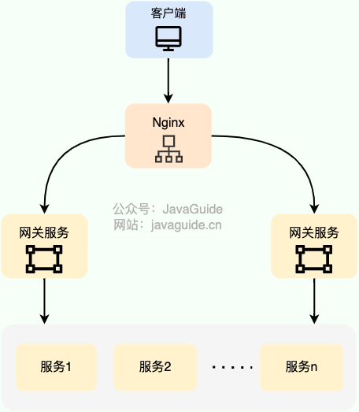
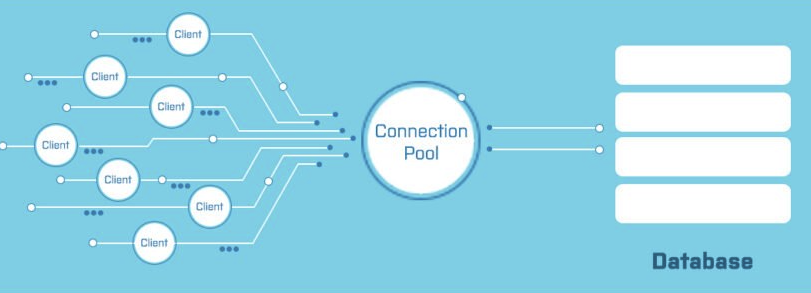
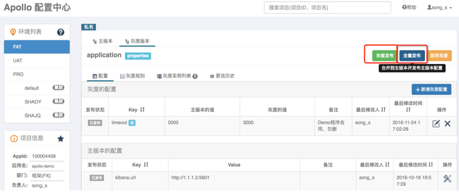
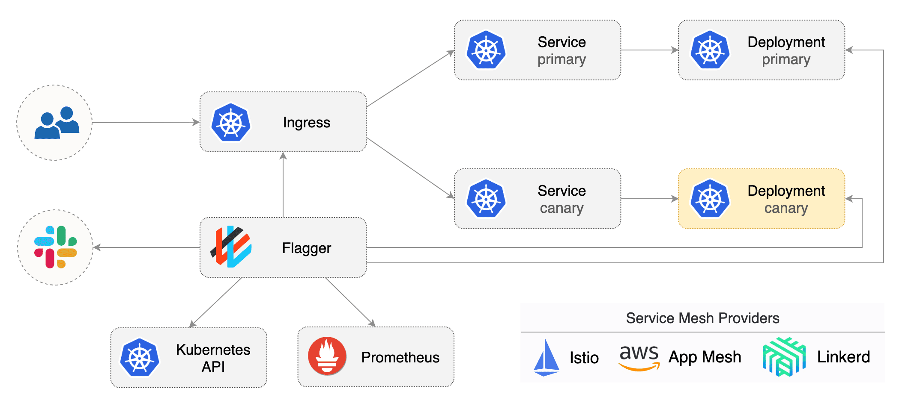

## 高并发

### **高可用：如何设计一个高可用系统？**

一篇短小的文章，面试经常遇到的这个问题。本文主要包括下面这些内容：

1. 高可用的定义

2. 哪些情况可能会导致系统不可用？

3. 有些提高系统可用性的方法？只是简单的提一嘴，更具体内容在后续的文章中介绍，就拿限流来说，你需要搞懂：何为限流？如何限流？为什么要限流？如何做呢？说一下原理？。

#### 什么是高可用？可用性的判断标准是啥？

高可用描述的是一个系统在大部分时间都是可用的，可以为我们提供服务的。高可用代表系统即使在发生硬件故障或者系统升级的时候，服务仍然是可用的。

一般情况下，我们使用多少个 9 来评判一个系统的可用性，比如 99.9999% 就是代表该系统在所有的运行时间中只有 0.0001%
的时间是不可用的，这样的系统就是非常非常高可用的了！当然，也会有系统如果可用性不太好的话，可能连 9 都上不了。

#### 哪些情况会导致系统不可用？

1. 黑客攻击；

2. 硬件故障，比如服务器坏掉。

3. 并发量/用户请求量激增导致整个服务宕掉或者部分服务不可用。

4. 代码中的坏味道导致内存泄漏或者其他问题导致程序挂掉。

5. 网站架构某个重要的角色比如 Nginx 或者数据库突然不可用。

6. 自然灾害或者人为破坏。

7. ......

#### 有哪些提高系统可用性的方法？

##### 1. 注重代码质量，测试严格把关

我觉得这个是最最最重要的，代码质量有问题比如比较常见的内存泄漏、循环依赖都是对系统可用性极大的损害。大家都喜欢谈限流、降级、熔断，但是我觉得从代码质量这个源头把关是首先要做好的一件很重要的事情。如何提高代码质量？比较实际可用的就是
CodeReview，不要在乎每天多花的那 1 个小时左右的时间，作用可大着呢！

另外，安利这个对提高代码质量有实际效果的宝贝：

1. sonarqube ：保证你写出更安全更干净的代码！（ps: 目前所在的项目基本都会用到这个插件）。

2. Alibaba 开源的 Java 诊断工具 Arthas 也是很不错的选择。

3. IDEA 自带的代码分析等工具进行代码扫描也是非常非常棒的。

##### 2.使用集群，减少单点故障

先拿常用的 Redis 举个例子！我们如何保证我们的 Redis 缓存高可用呢？答案就是使用集群，避免单点故障。当我们使用一个 Redis
实例作为缓存的时候，这个 Redis 实例挂了之后，整个缓存服务可能就挂了。使用了集群之后，即使一台 Redis 实例，不到一秒就会有另外一台
Redis 实例顶上。

##### 3.限流

流量控制（flow control），其原理是监控应用流量的 QPS 或并发线程数等指标，当达到指定的阈值时对流量进行控制，以避免被瞬时的流量高峰冲垮，从而保障应用的高可用性。——来自
alibaba-[Sentinel](https://github.com/alibaba/Sentinel) 的 wiki。

##### 4.超时和重试机制设置

一旦用户请求超过某个时间的得不到响应，就抛出异常。这个是非常重要的，很多线上系统故障都是因为没有进行超时设置或者超时设置的方式不对导致的。我们在读取第三方服务的时候，尤其适合设置超时和重试机制。一般我们使用一些
RPC 框架的时候，这些框架都自带的超时重试的配置。如果不进行超时设置可能会导致请求响应速度慢，甚至导致请求堆积进而让系统无法在处理请求。重试的次数一般设为
3 次，再多次的重试没有好处，反而会加重服务器压力（部分场景使用失败重试机制会不太适合）。

##### 5.熔断机制

超时和重试机制设置之外，熔断机制也是很重要的。
熔断机制说的是系统自动收集所依赖服务的资源使用情况和性能指标，当所依赖的服务恶化或者调用失败次数达到某个阈值的时候就迅速失败，让当前系统立即切换依赖其他备用服务。
比较常用的是流量控制和熔断降级框架是 Netflix 的 Hystrix 和 alibaba 的 Sentinel。

##### 6.异步调用

异步调用的话我们不需要关心最后的结果，这样我们就可以用户请求完成之后就立即返回结果，具体处理我们可以后续再做，秒杀场景用这个还是蛮多的。但是，使用异步之后我们可能需要
**适当修改业务流程进行配合，比如用户在提交订单之后，不能立即返回用户订单提交成功，需要在消息队列的订单消费者进程真正处理完该订单之后，甚至出库后，再通过电子邮件或短信通知用户订单成功
**。除了可以在程序中实现异步之外，我们常常还使用消息队列，消息队列可以通过异步处理提高系统性能（削峰、减少响应所需时间）并且可以降低系统耦合性。

##### 7.使用缓存

如果我们的系统属于并发量比较高的话，如果我们单纯使用数据库的话，当大量请求直接落到数据库可能数据库就会直接挂掉。使用缓存缓存热点数据，因为缓存存储在内存中，所以速度相当地快！

##### 8.其他

1. 核心应用和服务优先使用更好的硬件

2. 监控系统资源使用情况增加报警设置。

3. 注意备份，必要时候回滚。

4. 灰度发布： 将服务器集群分成若干部分，每天只发布一部分机器，观察运行稳定没有故障，第二天继续发布一部分机器，持续几天才把整个集群全部发布完毕，期间如果发现问题，只需要回滚已发布的一部分服务器即可

5. 定期检查/更换硬件： 如果不是购买的云服务的话，定期还是需要对硬件进行一波检查的，对于一些需要更换或者升级的硬件，要及时更换或者升级。

6. .....(想起来再补充！也欢迎各位欢迎补充！)

### **高可用：负载均衡的常见算法有哪些？**

> 相关面试题 ：
>
> - 服务端负载均衡一般怎么做？
> - 四层负载均衡和七层负载均衡的区别？
> - 负载均衡的常见算法有哪些？
> - 七层负载均衡常见解决方案有哪些？
> - 客户端负载均衡的常见解决方案有哪些？

#### 什么是负载均衡？

**负载均衡** 指的是将用户请求分摊到不同的服务器上处理，以提高系统整体的并发处理能力以及可靠性。负载均衡服务可以有由专门的软件或者硬件来完成，一般情况下，硬件的性能更好，软件的价格更便宜（后文会详细介绍到）。

下图是[《Java 面试指北》](https://mp.weixin.qq.com/s?__biz=Mzg2OTA0Njk0OA==&mid=2247519384&idx=1&sn=bc7e71af75350b755f04ca4178395b1a&chksm=cea1c353f9d64a458f797696d4144b4d6e58639371a4612b8e4d106d83a66d2289e7b2cd7431&token=660789642&lang=zh_CN&scene=21#wechat_redirect)
「高并发篇」中的一篇文章的配图，从图中可以看出，系统的商品服务部署了多份在不同的服务器上，为了实现访问商品服务请求的分流，我们用到了负载均衡。


负载均衡是一种比较常用且实施起来较为简单的提高系统并发能力和可靠性的手段，不论是单体架构的系统还是微服务架构的系统几乎都会用到。

#### 负载均衡通常分为哪两种？

负载均衡可以简单分为 **服务端负载均衡** 和 **客户端负载均衡** 这两种。

服务端负载均衡涉及到的知识点更多，工作中遇到的也比较多，因为，我会花更多时间来介绍。

##### 服务端负载均衡

服务端负载均衡 主要应用在 系统外部请求 和 网关层 之间，可以使用 软件 或者 硬件 实现。

下图是我画的一个简单的基于 Nginx 的服务端负载均衡示意图：



**硬件负载均衡** 通过专门的硬件设备（比如 **F5、A10、Array** ）实现负载均衡功能。

硬件负载均衡的优势是性能很强且稳定，缺点就是实在是太贵了。像基础款的 F5 最低也要 20
多万，绝大部分公司是根本负担不起的，业务量不大的话，真没必要非要去弄个硬件来做负载均衡，用软件负载均衡就足够了！

在我们日常开发中，一般很难接触到硬件负载均衡，接触的比较多的还是 **软件负载均衡** 。软件负载均衡通过软件（比如 *
*LVS、Nginx、HAproxy** ）实现负载均衡功能，性能虽然差一些，但价格便宜啊！像基础款的 Linux 服务器也就几千，性能好一点的 2~3
万的就很不错了。

根据 OSI 模型，服务端负载均衡还可以分为：

- 二层负载均衡
- 三层负载均衡
- 四层负载均衡
- 七层负载均衡

最常见的是四层和七层负载均衡，因此，本文也是重点介绍这两种负载均衡。


- **四层负载均衡** 工作在 OSI 模型第四层，也就是传输层，这一层的主要协议是
  TCP/UDP，负载均衡器在这一层能够看到数据包里的源端口地址以及目的端口地址，会基于这些信息通过一定的负载均衡算法将数据包转发到后端真实服务器。
- **七层负载均衡** 工作在 OSI 模型第七层，也就是应用层，这一层的主要协议是 HTTP
  。这一层的负载均衡比四层负载均衡路由网络请求的方式更加复杂，它会读取报文的数据部分（比如说我们的 HTTP
  部分的报文），然后根据读取到的数据内容（如 URL、Cookie）做出负载均衡决策。

七层负载均衡比四层负载均衡会消耗更多的性能，不过，也相对更加灵活，能够更加智能地路由网络请求，比如说你可以根据请求的内容进行优化如缓存、压缩、加密。

简单来说，**四层负载均衡性能更强，七层负载均衡功能更强！**

在工作中，我们通常会使用 **Nginx** 来做七层负载均衡，LVS(Linux Virtual Server 虚拟服务器， Linux 内核的 4 层负载均衡)
来做四层负载均衡。关于 Nginx
的常见知识点总结，[《Java 面试指北》](https://mp.weixin.qq.com/s?__biz=Mzg2OTA0Njk0OA==&mid=2247519384&idx=1&sn=bc7e71af75350b755f04ca4178395b1a&chksm=cea1c353f9d64a458f797696d4144b4d6e58639371a4612b8e4d106d83a66d2289e7b2cd7431&token=660789642&lang=zh_CN&scene=21#wechat_redirect)
中「技术面试题篇」中已经有对应的内容了，感兴趣的小伙伴可以去看看。


不过，LVS 这个绝大部分公司真用不上，像阿里、百度、腾讯、eBay 等大厂才会使用到，用的最多的还是 Nginx。

##### 客户端负载均衡

**客户端负载均衡** 主要应用于系统内部的不同的服务之间，可以使用现成的负载均衡组件来实现。

在客户端负载均衡中，客户端会自己维护一份服务器的地址列表，发送请求之前，客户端会根据对应的负载均衡算法来选择具体某一台服务器处理请求。

客户端负载均衡器和服务运行在同一个进程或者说 Java 程序里，不存在额外的网络开销。不过，客户端负载均衡的实现会受到编程语言的限制，比如说
Spring Cloud Load Balancer 就只能用于 Java 语言。

Java 领域主流的微服务框架 Dubbo、Spring Cloud 等都内置了开箱即用的客户端负载均衡实现。Dubbo 属于是默认自带了负载均衡功能，Spring
Cloud 是通过组件的形式实现的负载均衡，属于可选项，比较常用的是 Spring Cloud Load Balancer（官方，推荐） 和
Ribbon（Netflix，已被启用）。

下图是我画的一个简单的基于 Spring Cloud Load Balancer（Ribbon 也类似） 的客户端负载均衡示意图：


#### 负载均衡常见的算法有哪些？

##### 随机法

**随机法** 是最简单粗暴的负载均衡算法。

如果没有配置权重的话，所有的服务器被访问到的概率都是相同的。如果配置权重的话，权重越高的服务器被访问的概率就越大。

未加权重的随机算法适合于服务器性能相近的集群，其中每个服务器承载相同的负载。加权随机算法适合于服务器性能不等的集群，权重的存在可以使请求分配更加合理化。

不过，随机算法有一个比较明显的缺陷：部分机器在一段时间之内无法被随机到，毕竟是概率算法，就算是大家权重一样， 也可能会出现这种情况。

于是，**轮询法** 来了！

##### 轮询法

轮询法是挨个轮询服务器处理，也可以设置权重。

如果没有配置权重的话，每个请求按时间顺序逐一分配到不同的服务器处理。如果配置权重的话，权重越高的服务器被访问的次数就越多。

未加权重的轮询算法适合于服务器性能相近的集群，其中每个服务器承载相同的负载。加权轮询算法适合于服务器性能不等的集群，权重的存在可以使请求分配更加合理化。

##### 一致性 Hash 法

相同参数的请求总是发到同一台服务器处理，比如同个 IP 的请求。

##### 最小连接法

当有新的请求出现时，遍历服务器节点列表并选取其中活动连接数最小的一台服务器来响应当前请求。活动连接数可以理解为当前正在处理的请求数。

最小连接法可以尽可能最大地使请求分配更加合理化，提高服务器的利用率。不过，这种方法实现起来也最复杂，需要监控每一台服务器处理的请求连接数。

#### 七层负载均衡可以怎么做？

简单介绍两种项目中常用的七层负载均衡解决方案：DNS 解析和反向代理。

除了我介绍的这两种解决方案之外，HTTP 重定向等手段也可以用来实现负载均衡，不过，相对来说，还是 DNS 解析和反向代理用的更多一些，也更推荐一些。

##### DNS 解析

DNS 解析是比较早期的七层负载均衡实现方式，非常简单。

DNS 解析实现负载均衡的原理是这样的：在 DNS 服务器中为同一个主机记录配置多个 IP 地址，这些 IP 地址对应不同的服务器。当用户请求域名的时候，DNS
服务器采用轮询算法返回 IP 地址，这样就实现了轮询版负载均衡。


现在的 DNS 解析几乎都支持 IP 地址的权重配置，这样的话，在服务器性能不等的集群中请求分配会更加合理化。像我自己目前正在用的阿里云
DNS 就支持权重配置。

##### 反向代理

客户端将请求发送到反向代理服务器，由反向代理服务器去选择目标服务器，获取数据后再返回给客户端。对外暴露的是反向代理服务器地址，隐藏了真实服务器
IP 地址。反向代理“代理”的是目标服务器，这一个过程对于客户端而言是透明的。

Nginx 就是最常用的反向代理服务器，它可以将接收到的客户端请求以一定的规则（负载均衡策略）均匀地分配到这个服务器集群中所有的服务器上。

反向代理负载均衡同样属于七层负载均衡。

#### 客户端负载均衡通常是怎么做的？

我们上面也说了，客户端负载均衡可以使用现成的负载均衡组件来实现。

**Netflix Ribbon** 和 **Spring Cloud Load Balancer** 就是目前 Java 生态最流行的两个负载均衡组件。

我更建议你使用 Spring 官方的 Spring Cloud LoadBalancer。Spring Cloud 2020.0.0 版本移除了 Netflix 除 Eureka 外的所有组件。Spring
Cloud Hoxton.M2 是第一个支持 Spring Cloud Load Balancer 来替代 Netfix Ribbon 的版本。

我们早期学习微服务，肯定接触过 Netflix 公司开源的 Feign、Ribbon、Zuul、Hystrix、Eureka
等知名的微服务系统构建所必须的组件，直到现在依然有非常非常多的公司在使用这些组件。不夸张地说，Netflix 公司引领了 Java
技术栈下的微服务发展。


**那为什么 Spring Cloud 这么急着移除 Netflix 的组件呢？** 主要是因为在 2018 年的时候，Netflix 宣布其开源的核心组件
Hystrix、Ribbon、Zuul、Eureka 等进入维护状态，不再进行新特性开发，只修 BUG。于是，Spring 官方不得不考虑移除 Netflix 的组件。

**Spring Cloud Alibaba** 是一个不错的选择，尤其是对于国内的公司和个人开发者来说。

#### 参考

- 干货 | eBay 的 4 层软件负载均衡实现：https://mp.weixin.qq.com/s/bZMxLTECOK3mjdgiLbHj-g

- HTTP Load Balancing（Nginx 官方文档）：https://docs.nginx.com/nginx/admin-guide/load-balancer/http-load-balancer/

- 深入浅出负载均衡 - vivo 互联网技术：https://www.cnblogs.com/vivotech/p/14859041.html

### **高性能：池化技术的应用场景**

#### 池化技术简介

简单来说，池化技术就是将可重复利用的对象比如连接、线程统一管理起来。线程池、数据库连接池、HTTP、Redis 连接池等等都是对池化技术的应用。

通常来说，池化技术所管理的对象，无论是连接还是线程，**它们的创建过程都比较耗时，也比较消耗系统资源**
。所以，我们把它们放在一个池子里统一管理起来，以达到 **提升性能和资源复用的目的** 。

从上面对池化技术的介绍，我们可以得出池化技术的核心思想是空间换时间。它的核心策略是使用已经创建好的对象来减少频繁创建对象的性能开销，同时还可以对对象进行统一的管理。

不过，池化技术也不是并非没有缺点的。如果池子中的对象没有被充分利用的话，也会造成多余的内存浪费（相对于池化技术的优点来说的话，这个缺点几乎可以被忽略）。

#### 池化技术常见应用

线程池和数据库连接池我们平时开发过程中应该接触的非常多。因此，我会以线程池和数据库连接池为例来介绍池化技术的实际应用。

##### 线程池

正如其名，线程池主要负责创建和管理线程。

没有线程池的时候，我们每次用到线程就需要单独创建，用完了之后再销毁。然而，创建线程和销毁线程是比较耗费资源和时间的操作。

有了线程池之后，我们可以重复利用已创建的线程降低线程创建和销毁造成的消耗。并且，线程池还可以方便我们对线程进行统一的管理。

我们拿 JDK 1.5 中引入的原生线程池 ThreadPoolExecutor 来举例说明。

**ThreadPoolExecutor 有 3 个最重要的参数：**

- **corePoolSize :** 核心线程数线程数定义了最小可以同时运行的线程数量。

- **maximumPoolSize :** 当队列中存放的任务达到队列容量的时候，当前可以同时运行的线程数量变为最大线程数。

- **workQueue:** 当新任务来的时候会先判断当前运行的线程数量是否达到核心线程数，如果达到的话，新任务就会被存放在队列中。


> 线程池 `ThreadPoolExecutor` 不是上来就是直接初始化 `corePoolSize `个线程，而是有任务来了才创建线程处理任务。

假如我们需要提交任务给线程池执行的话，整个步骤是这样的：

1. 提交新任务
2. 判断线程池线程数是否少于 coreThreadCount ，是的话就创新线程处理任务，否则的话就将任务丢到队列中等待执行。
3. 当队列中的任务满了之后，继续创建线程，直到线程数量达到 maxThreadCount。
4. 当线程数量达到 maxThreadCount还是有任务提交，那我们就直接按照拒绝策略处理。

可以看出，JDK 自带的线程池 ThreadPoolExecutor 会优先将处理不过来的任务放到队列中去，而不是创建更多的线程来处理任务。只有当队列中的等待执行的任务满了之后，线程池才会创建线程，直到线程数达到
maximumPoolSize 。如果任务执行时间过长的话，还会很容易造成队列中的任务堆积。

并且，当线程数大于核心线程数时，如果线程等待 keepAliveTime 没有任务处理的话，该线程会被回收，直到线程数缩小到核心线程数才不会继续对线程进行回收。

可以看出，JDK 自带的的这个线程池 ThreadPoolExecutor 比较适合执行 CPU 密集型的任务，不太适合执行 I/O 密集型任务。

**为什么这样说呢？** 因此执行 CPU 密集型的任务时 CPU 比较繁忙，只需要创建和 CPU 核数相当的线程就好了，多了反而会造成线程上下文切换。

**如何判断是 CPU 密集任务还是 IO 密集任务？** CPU 密集型简单理解就是利用 CPU 计算能力的任务比如你在内存中对大量数据进行排序。但凡涉及到网络读取，文件读取这类都是
IO 密集型，这类任务的特点是 CPU 计算耗费时间相比于等待 IO 操作完成的时间来说很少，大部分时间都花在了等待 IO 操作完成上。

在看极客时间的专栏[《深入拆解 Tomcat & Jetty》](http://gk.link/a/10r1C)的时候，我了解到：**Tomcat 扩展了原生的 Java 线程池，来满足
Web 容器高并发的需求。**

简单来说，Tomcat 自定义线程池继承了 JDK 线程池 java.util.concurrent.ThreadPoolExecutor 重写了部分方法的逻辑（主要是
execute() 方法）。Tomcat 还通过继承 LinkedBlockingQueue 重写 offer() 方法实现了自定义的队列。

这些改变使得 Tomcat 的线程池在任务量大的情况下会优先创建线程，而不是直接将不能处理的任务放到队列中。

Tomcat 自定义线程池的使用方法如下：

```java
//创建定制版的任务队列
TaskQueue taskqueue = new TaskQueue(maxQueueSize);

//创建定制版的线程工厂
TaskThreadFactory tf = new TaskThreadFactory(namePrefix,daemon,getThreadPriority());

//创建定制版的线程池
ThreadPoolExecutor executor = new ThreadPoolExecutor(getMinSpareThreads(), getMaxThreads(), maxIdleTime, TimeUnit.MILLISECONDS,taskqueue, tf);
```

下面我们来详细看看 Tomcat 的线程池做了哪些改变。

Tomcat 的线程池通过重写 `ThreadPoolExecutor` 的 `execute() `方法实现了自己的任务处理逻辑。Tomcat
的线程池在线程总数达到最大时，不是立即执行拒绝策略，而是再尝试向自定义的任务队列添加任务，添加失败后再执行拒绝策略。那具体如何实现呢，其实很简单，我们来看一下
Tomcat 线程池的` execute()`方法的核心代码。

```java
public class ThreadPoolExecutor extends java.util.concurrent.ThreadPoolExecutor {

  ...

  public void execute(Runnable command, long timeout, TimeUnit unit) {
      submittedCount.incrementAndGet();
      try {
          //调用Java原生线程池的execute去执行任务
          super.execute(command);
      } catch (RejectedExecutionException rx) {
         //如果总线程数达到maximumPoolSize，Java原生线程池执行拒绝策略
          if (super.getQueue() instanceof TaskQueue) {
              final TaskQueue queue = (TaskQueue)super.getQueue();
              try {
                  //继续尝试把任务放到Tomcat自定义的任务队列中去
                  if (!queue.force(command, timeout, unit)) {
                      submittedCount.decrementAndGet();
                      //如果这个队列也满了，插入失败，执行拒绝策略。
                      throw new RejectedExecutionException("...");
                  }
              }
          }
      }
}
```

到重点的地方了！Tomcat 自定义队列`TaskQueue` 重写了 `LinkedBlockingQueue` 的` offer `方法，这是关键所在！

当提交的任务数量大于当前的线程数的时候，`offer() `会返回 false，线程池会去创建新的线程，而不是等到任务队列满了之后再创建线程。

```java
public class TaskQueue extends LinkedBlockingQueue<Runnable> {

  ...

   @Override
  //线程池调用任务队列的方法时，当前线程数肯定已经大于核心线程数了
  public boolean offer(Runnable o) {
     // 没有找到 Tomcat 扩展线程池的话，直接调用父类的offer方法
      if (this.parent == null)
            return super.offer(o);
      //如果线程数已经到了最大值，不能创建新线程了，只能把任务添加到任务队列。
      if (parent.getPoolSize() == parent.getMaximumPoolSize())
          return super.offer(o);
      //执行到这里，表明当前线程数大于核心线程数，并且小于最大线程数。
      //表明是可以创建新线程的，那到底要不要创建呢？分两种情况：

      //1. 如果已提交的任务数小于当前线程数，表示还有空闲线程，无需创建新线程
      if (parent.getSubmittedCount()<=(parent.getPoolSize()))
          return super.offer(o);

      //2. 如果已提交的任务数大于当前线程数，线程不够用了，返回false去创建新线程
      if (parent.getPoolSize()<parent.getMaximumPoolSize())
          return false;

      //默认情况下总是把任务添加到任务队列
      return super.offer(o);
  }

}
```

`LinkedBlockingQueue` 默认情况下长度是没有限制的，Tomcat 自定义队列定义了一个` capacity `变量来限制队列长度。

```java
public class TaskQueue extends LinkedBlockingQueue<Runnable> {

  public TaskQueue(int capacity) {
      super(capacity);
  }
  ...
}
```

`TaskQueue` 的 `capacity `的默认值是 `Integer.MAX_VALUE` ，也就是说默认情况下 Tomcat
的任务队列是没有长度限制的。不过，你可以通过设置 `maxQueueSize `参数来限制任务队列的长度。

如果你想要获取更多关于线程的介绍的话，建议阅读我写的下面这几篇文章：

- [Java 线程池详解](https://javaguide.cn/java/concurrent/java-thread-pool-summary.html)
- [Java 线程池最佳实践](https://javaguide.cn/java/concurrent/java-thread-pool-best-practices.html)

##### **数据库连接池**



数据库连接池属于连接池，类似于 HTTP、Redis
连接池，它们的实现原理类似。连接池的结构示意图，如下所示（图片来自：[《Java 业务开发常见错误 100 例》](http://gk.link/a/10u4d)）：


连接池负责连接的管理包括连接的建立、空闲连接回收等工作。

我们这里以数据库连接池为例来详细介绍。

没有数据库线程池之前，我们接收到一个需要用到数据库的请求，通常是这样来访问数据库的：

1. 装载数据库驱动程序；
2. 通过 JDBC 建立数据库连接；
3. 访问数据库，执行 SQL 语句；
4. 断开数据库连接。

假如我们为每一个请求都建立一次数据库连接然后再断开连接是非常耗费资源和时间的。因为，**建立和断开数据库连接本身就是比较耗费资源和时间的操作
**。

如果我们频繁进行数据库连接的建立和断开操作的话，势必会影响到系统的性能。当请求太多的话，系统甚至会因为创建太多数据库连接而直接宕机。

因此，有了数据库连接池来管理我们的数据库连接。当有请求的时候，我们现在数据库连接池中检查是否有空闲的数据库连接，如果有的话，直接分配给它。

如果我们需要获取数据库连接，整个步骤是这样的：

1. 系统首先检查空闲池内有没有空闲的数据库连接。
2. 如果有的话，直接获取。
3. 如果没有的话，先检查数据库连接池的是否达到所允许的最大连接数，没达到的话就新建一个数据库连接，否则就等待一定的时间（timeout）看是否有数据库连接被释放。
4. 如果等待时间超过一定的时间（timeout）还是没有数据库连接被释放的话，就会获取数据库连接失败。

实际开发中，我们使用 HikariCP 这个线程的数据库连接池比较多，SpringBoot 2.0 将它设置为默认的数据源连接池。

HikariCP 为了性能的提升（号称是史上性能最好的数据库连接池），做了非常多的优化，比如 HikariCP 自定义 FastStatementList 来代替
ArrayList 、自定义 ConcurrentBag 来提高并发读写的效率，再比如 HikariCP 通过 Javassist 来优化并精简字节码。

想要继续深入了解 HikariCP 原理的小伙伴，可以看看下面这两篇文章：

- [SpringBoot 2.0 中 HikariCP 数据库连接池原理解析 - vivo 互联网技术](https://mp.weixin.qq.com/s/4ty3MrsymRsdz0BSB_lfyw)
- [HikariCP 的这波优化，太炸裂了！](https://mp.weixin.qq.com/s/xM4r8fHQAwmgpX02F51N2A)

HikariCP 是性能超强，在监控方面的话，数据库连接池 Druid 做的不错。

#### 池化技术注意事项

- 池子的最大值和最小值的设置很重要，初期可以依据经验来设置，后面还是需要根据实际运行情况做调整。

- 池子中的对象需要在使用之前预先初始化完成，这叫做池子的预热，比方说使用线程池时就需要预先初始化所有的核心线程。如果池子未经过预热可能会导致系统重启后产生比较多的慢请求。

#### 参考

- [《Java 业务开发常见错误 100 例：04 | 连接池：别让连接池帮了倒忙》](http://gk.link/a/10u4d)

- [《深入拆解 Tomcat & Jetty》：17 | Executor 组件：Tomcat 如何扩展 Java 线程池？](http://gk.link/a/10r1C)

### **高性能：零拷贝为什么能提升性能？**

> **相关面试题** ：
>
> - 简单描述一下传统的 IO 执行流程，有什么缺陷？
> - 什么是零拷贝？
> - 零拷贝实现的几种方式
> - Java 提供的零拷贝方式
>
> 作者：程序员田螺 ，公众号：捡田螺的小男孩
>
> 《Java 面试指北》已获授权并对其内容进行了完善。

零拷贝算是一个老生常谈的问题啦，很多顶级框架都用到了零拷贝来提升性能，比如我们经常接触到的 Kafka 、RocketMQ、Netty 。

搞懂零拷贝不仅仅可以让自己对这些框架的认识更进一步，还可以让自己在面试中更游刃有余。毕竟，面试中对于零拷贝的考察非常常见，尤其是大厂。

通常情况下，面试官不会直接提问零拷贝，他会先问你 Kafka/RocketMQ/Netty 为什么快，然后你回答到了零拷贝之后，他再去挖掘你对零拷贝的认识。

#### 1.什么是零拷贝

零拷贝字面上的意思包括两个，“零”和“拷贝”：

- **“拷贝” ：**就是指数据从一个存储区域转移到另一个存储区域。

- **“零” ：**表示次数为 0，它表示拷贝数据的次数为 0。

合起来，那 **零拷贝** 就是不需要将数据从一个存储区域复制到另一个存储区域。

> 零拷贝是指计算机执行 IO 操作时，CPU 不需要将数据从一个存储区域复制到另一个存储区域，从而可以减少上下文切换以及 CPU
> 的拷贝时间。它是一种I/O操作优化技术。

#### 2. 传统 IO 的执行流程

做服务端开发的小伙伴，文件下载功能应该实现过不少了吧。如果你实现的是一个 Web 程序，前端请求过来，服务端的任务就是：将服务端主机磁盘中的文件从已连接的
socket 发出去。关键实现代码如下：

```java
while((n = read(diskfd, buf, BUF_SIZE)) > 0)
    write(sockfd, buf , n);
```

传统的 IO 流程，包括 read 和 write 的过程。

- `read`：把数据从磁盘读取到内核缓冲区，再拷贝到用户缓冲区。
- `write`：先把数据写入到 socket 缓冲区，最后写入网卡设备。

流程图如下：


- 用户应用进程调用 read 函数，向操作系统发起 IO 调用，**上下文从用户态转为内核态（切换 1）**
- DMA 控制器把数据从磁盘中，读取到内核缓冲区。
- CPU 把内核缓冲区数据，拷贝到用户应用缓冲区，**上下文从内核态转为用户态（切换 2）**，read 函数返回
- 用户应用进程通过 write 函数，发起 IO 调用，**上下文从用户态转为内核态（切换 3）**
- CPU 将应用缓冲区中的数据，拷贝到 socket 缓冲区
- DMA 控制器把数据从 socket 缓冲区，拷贝到网卡设备，**上下文从内核态切换回用户态（切换 4）**，write 函数返回

从流程图可以看出，传统 IO 的读写流程，包括了 4 次上下文切换（4 次用户态和内核态的切换），4 次数据拷贝**（两次 CPU 拷贝以及两次的
DMA 拷贝)**，什么是 DMA 拷贝呢？我们一起来回顾下，零拷贝涉及的**操作系统知识点**哈。

#### 3. 零拷贝相关的知识点回顾

##### 3.1 内核空间和用户空间

我们电脑上跑着的应用程序，其实是需要经过**操作系统**，才能做一些特殊操作，如磁盘文件读写、内存的读写等等。因为这些都是比较危险的操作，
**不可以由应用程序乱来**，只能交给底层操作系统来。

因此，操作系统为每个进程都分配了内存空间，一部分是用户空间，一部分是内核空间。*
*内核空间是操作系统内核访问的区域，是受保护的内存空间，而用户空间是用户应用程序访问的内存区域**。 以 32
位操作系统为例，它会为每一个进程都分配了**4G**(2 的 32 次方)的内存空间。

- **内核空间** ：主要提供进程调度、内存分配、连接硬件资源等功能

- **用户空间** ：提供给各个程序进程的空间，它不具有访问内核空间资源的权限，如果应用程序需要使用到内核空间的资源，则需要通过系统调用来完成。进程从用户空间切换到内核空间，完成相关操作后，再从内核空间切换回用户空间。

##### 3.2 什么是用户态、内核态

- 如果进程运行于内核空间，被称为进程的内核态

- 如果进程运行于用户空间，被称为进程的用户态。

##### 3.3 什么是上下文切换

什么是上下文？

> 它是指，先把前一个任务的 CPU 上下文（也就是 CPU 寄存器和程序计数器）保存起来，然后加载新任务的上下文到这些寄存器和程序计数器，最后再跳转到程序计数器所指的新位置，运行新任务。

一般我们说的**上下文切换**，就是指内核（操作系统的核心）在 CPU 上对进程或者线程进行切换。进程从用户态到内核态的转变，需要通过系统调用来完成。
**系统调用**的过程，会发生**CPU 上下文的切换**。

> CPU 寄存器里原来用户态的指令位置，需要先保存起来。接着，为了执行内核态代码，CPU 寄存器需要更新为内核态指令的新位置。最后才是跳转到内核态运行内核任务。


##### 3.4 虚拟内存

现代操作系统使用虚拟内存，即虚拟地址取代物理地址，使用虚拟内存可以有 2 个好处：

- 虚拟内存空间可以远远大于物理内存空间
- 多个虚拟内存可以指向同一个物理地址

正是**多个虚拟内存可以指向同一个物理地址**，可以把内核空间和用户空间的虚拟地址映射到同一个物理地址，这样的话，就可以减少 IO
的数据拷贝次数啦，示意图如下


##### 3.5 DMA 技术

DMA，英文全称是 **Direct Memory Access**，即直接内存访问。**DMA**本质上是一块主板上独立的芯片，允许外设设备和内存存储器之间直接进行
IO 数据传输，其过程**不需要 CPU 的参与**。

我们一起来看下 IO 流程，DMA 帮忙做了什么事情.


- 用户应用进程调用 read 函数，向操作系统发起 IO 调用，进入阻塞状态，等待数据返回。
- CPU 收到指令后，对 DMA 控制器发起指令调度。
- DMA 收到 IO 请求后，将请求发送给磁盘；
- 磁盘将数据放入磁盘控制缓冲区，并通知 DMA
- DMA 将数据从磁盘控制器缓冲区拷贝到内核缓冲区。
- DMA 向 CPU 发出数据读完的信号，把工作交换给 CPU，由 CPU 负责将数据从内核缓冲区拷贝到用户缓冲区。
- 用户应用进程由内核态切换回用户态，解除阻塞状态

可以发现，DMA 做的事情很清晰啦，它**主要就是帮忙 CPU 转发一下 IO 请求，以及拷贝数据**。为什么需要它的？

> 主要就是效率，它帮忙 CPU 做事情，这时候，CPU 就可以闲下来去做别的事情，提高了 CPU 的利用效率。大白话解释就是，CPU
> 老哥太忙太累啦，所以他找了个小弟（名叫 DMA） ，替他完成一部分的拷贝工作，这样 CPU 老哥就能着手去做其他事情。

#### 4. 零拷贝实现的几种方式

零拷贝并不是没有拷贝数据，而是减少用户态/内核态的切换次数以及 CPU 拷贝的次数。零拷贝实现有多种方式，分别是

- mmap+write

- sendfile

- 带有 DMA 收集拷贝功能的 sendfile

##### 4.1 mmap+write 实现的零拷贝

mmap 的函数原型如下：

```c
void *mmap(void *addr, size_t length, int prot, int flags, int fd, off_t offset);
```

- `addr` ：指定映射的虚拟内存地址
- `length` ：映射的长度
- `prot` ：映射内存的保护模式
- `flags` ：指定映射的类型
- `fd` : 进行映射的文件句柄
- `offset` : 文件偏移量

前面一小节，零拷贝相关的知识点回顾，我们介绍了**虚拟内存**，可以把内核空间和用户空间的虚拟地址映射到同一个物理地址，从而减少数据拷贝次数！mmap
就是用了虚拟内存这个特点，它将内核中的读缓冲区与用户空间的缓冲区进行映射，所有的 IO 都在内核中完成。

`mmap+write`实现的零拷贝流程如下：


- 用户进程通过mmap方法向操作系统内核发起 IO 调用，上下文从用户态切换为内核态。
- CPU 利用 DMA 控制器，把数据从硬盘中拷贝到内核缓冲区。
- 上下文从内核态切换回用户态，mmap 方法返回。
- 用户进程通过write方法向操作系统内核发起 IO 调用，上下文从用户态切换为内核态。
- CPU 将内核缓冲区的数据拷贝到的 socket 缓冲区。
- CPU 利用 DMA 控制器，把数据从 socket 缓冲区拷贝到网卡，上下文从内核态切换回用户态，write 调用返回。

可以发现，mmap+write实现的零拷贝，I/O 发生了**4**次用户空间与内核空间的上下文切换，以及 3 次数据拷贝。其中 3 次数据拷贝中，包括了
**2 次 DMA 拷贝和 1 次 CPU 拷贝**。

mmap是将读缓冲区的地址和用户缓冲区的地址进行映射，内核缓冲区和应用缓冲区共享，所以节省了一次 CPU 拷贝‘’并且用户进程内存是*
*虚拟的**，只是**映射**到内核的读缓冲区，可以节省一半的内存空间。

##### 4.2 sendfile 实现的零拷贝

sendfile是 Linux2.1 内核版本后引入的一个系统调用函数，API 如下：

```c
ssize_t sendfile(int out_fd, int in_fd, off_t *offset, size_t count);
```

- `out_fd` :为待写入内容的文件描述符，一个 socket 描述符。，
- `in_fd` :为待读出内容的文件描述符，必须是真实的文件，不能是 socket 和管道。
- `offset` ：指定从读入文件的哪个位置开始读，如果为 NULL，表示文件的默认起始位置。
- `count `：指定在 fdout 和 fdin 之间传输的字节数。

`sendfile `表示在两个文件描述符之间传输数据，它是在**操作系统内核中**操作的，**避免了数据从内核缓冲区和用户缓冲区之间的拷贝操作
**，因此可以使用它来实现零拷贝。

`sendfile `实现的零拷贝流程如下：


1. 用户进程发起 sendfile 系统调用，**上下文（切换 1）从用户态转向内核态**
2. DMA 控制器，把数据从硬盘中拷贝到内核缓冲区。
3. CPU 将读缓冲区中数据拷贝到 socket 缓冲区
4. DMA 控制器，异步把数据从 socket 缓冲区拷贝到网卡，
5. **上下文（切换 2）从内核态切换回用户态，**sendfile 调用返回。

可以发现，sendfile实现的零拷贝，I/O 发生了2次用户空间与内核空间的上下文切换，以及 3 次数据拷贝。其中 3 次数据拷贝中，包括了*
*2 次 DMA 拷贝和 1 次 CPU 拷贝**。那能不能把 CPU 拷贝的次数减少到 0 次呢？有的，即带有DMA收集拷贝功能的sendfile！

##### 4.3 sendfile+DMA scatter/gather 实现的零拷贝

linux 2.4 版本之后，对sendfile做了优化升级，引入 SG-DMA 技术，其实就是对 DMA
拷贝加入了scatter/gather操作，它可以直接从内核空间缓冲区中将数据读取到网卡。使用这个特点搞零拷贝，即还可以多省去一次 **CPU
拷贝**。

sendfile+DMA scatter/gather 实现的零拷贝流程如下：


1. 用户进程发起 sendfile 系统调用，**上下文（切换 1）从用户态转向内核态**
2. DMA 控制器，把数据从硬盘中拷贝到内核缓冲区。
3. CPU 把内核缓冲区中的**文件描述符信息**（包括内核缓冲区的内存地址和偏移量）发送到 socket 缓冲区
4. DMA 控制器根据文件描述符信息，直接把数据从内核缓冲区拷贝到网卡
5. **上下文（切换 2）从内核态切换回用户态**，sendfile 调用返回。

可以发现，sendfile+DMA scatter/gather实现的零拷贝，I/O 发生了2次用户空间与内核空间的上下文切换，以及 2 次数据拷贝。其中 2
次数据拷贝都是包**DMA 拷贝**。这就是真正的 **零拷贝（Zero-copy)** 技术，全程都没有通过 CPU 来搬运数据，所有的数据都是通过
DMA 来进行传输的。

#### 5. java 提供的零拷贝方式

- Java NIO 对 mmap 的支持

- Java NIO 对 sendfile 的支持

##### 5.1 Java NIO 对 mmap 的支持

Java NIO 有一个MappedByteBuffer的类，可以用来实现内存映射。它的底层是调用了 Linux 内核的**mmap**的 API。

**mmap** 的小 **demo**如下：

```java
public class MmapTest {

    public static void main(String[] args) {
        try {
            FileChannel readChannel = FileChannel.open(Paths.get("./jay.txt"), StandardOpenOption.READ);
            MappedByteBuffer data = readChannel.map(FileChannel.MapMode.READ_ONLY, 0, 1024 * 1024 * 40);
            FileChannel writeChannel = FileChannel.open(Paths.get("./siting.txt"), StandardOpenOption.WRITE, StandardOpenOption.CREATE);
            //数据传输
            writeChannel.write(data);
            readChannel.close();
            writeChannel.close();
        }catch (Exception e){
            System.out.println(e.getMessage());
        }
    }
}
```

##### 5.2 Java NIO 对 sendfile 的支持

FileChannel 的`transferTo()/transferFrom()`，底层就是 sendfile() 系统调用函数。Kafka
这个开源项目就用到它，平时面试的时候，回答面试官为什么这么快，就可以提到零拷贝`sendfile`这个点。

```java
@Override
public long transferFrom(FileChannel fileChannel, long position, long count) throws IOException {
   return fileChannel.transferTo(position, count, socketChannel);
}
```

**sendfile 的小 demo**如下：

```java
public class SendFileTest {
    public static void main(String[] args) {
        try {
            FileChannel readChannel = FileChannel.open(Paths.get("./jay.txt"), StandardOpenOption.READ);
            long len = readChannel.size();
            long position = readChannel.position();

            FileChannel writeChannel = FileChannel.open(Paths.get("./siting.txt"), StandardOpenOption.WRITE, StandardOpenOption.CREATE);
            //数据传输
            readChannel.transferTo(position, len, writeChannel);
            readChannel.close();
            writeChannel.close();
        } catch (Exception e) {
            System.out.println(e.getMessage());
        }
    }
}
```

#### 参考与感谢

- [框架篇：小白也能秒懂的 Linux 零拷贝原理](https://juejin.cn/post/6887469050515947528)
- [深入剖析 Linux IO 原理和几种零拷贝机制的实现](https://juejin.cn/post/6844903949359644680#heading-11)
- [阿里二面：什么是 mmap？](https://mp.weixin.qq.com/s/sG0rviJlhVtHzGfd5NoqDQ)

### **高性能：有哪些常见的 SQL 优化手段？**

#### 避免使用 SELECT * 

- SELECT * 会消耗更多的 CPU。

- SELECT * 无用字段增加网络带宽资源消耗，增加数据传输时间，尤其是大字段（如 varchar、blob、text）。

- SELECT * 无法使用 MySQL 优化器覆盖索引的优化（基于 MySQL 优化器的“覆盖索引”策略又是速度极快，效率极高，业界极为推荐的查询优化方式）

- SELECT <字段列表> 可减少表结构变更带来的影响。

#### 分页优化

普通的分页在数据量小的时候耗费时间还是比较短的。

```sql
SELECT `score`,`name` FROM `cus_order` ORDER BY `score` DESC LIMIT 10000, 10;
```

如果数据量变大，达到百万甚至是千万级别，普通的分页耗费的时间就非常长了。

```sql
SELECT `score`,`name` FROM `cus_order` ORDER BY `score` DESC LIMIT 1000000, 10
SELECT `score`,`name` FROM `cus_order` ORDER BY `score` DESC LIMIT 10, 1000000
```

**如何优化呢？** 可以将上述 SQL 语句修改为子查询。

```sql
SELECT `score`,`name` FROM `cus_order` WHERE id >= (SELECT id FROM `cus_order` LIMIT 1000000, 1) LIMIT 10
```

我们先查询出 limit 第一个参数对应的主键值，再根据这个主键值再去过滤并 limit，这样效率会更快。

阿里巴巴《Java 开发手册》中也有对应的描述：

> 利用延迟关联或者子查询优化超多分页场景。


不过，子查询的结果会产生一张新表，会影响性能，应该尽量避免大量使用子查询。

除了子查询之外，还以采用延迟查询的方式来优化。

```sql
SELECT `score`,`name` FROM `cus_order` a, (SELECT id from `cus_order` ORDER BY `score` DESC LIMIT 1000000, 10) b where a.id = b.id
```

我们先提取对应的主键，再将这个主键表与原数据表关联。

相关阅读：

- [面试官：一千万数据，怎么快速查询？](https://juejin.cn/post/6863668253898735629)

- [【得物技术】MySQL 深分页优化](https://juejin.cn/post/6985478936683610149)

#### 尽量避免多表做 join

阿里巴巴《Java 开发手册》中有这样一段描述：

> 【强制】超过三个表禁止 join。需要 join 的字段，数据类型保持绝对一致;多表关联查询时，保证被关联 的字段需要有索引。


join 的效率比较低，主要原因是因为其使用嵌套循环（Nested Loop）来实现关联查询，三种不同的实现效率都不是很高：

- **Simple Nested-Loop Join ：**没有进过优化，直接使用笛卡尔积实现 join，逐行遍历/全表扫描，效率最低。
- **Block Nested-Loop Join ：**利用 JOIN BUFFER 进行优化，性能受到 JOIN BUFFER 大小的影响，相比于 Simple Nested-Loop Join
  性能有所提升。不过，如果两个表的数据过大的话，无论如何优化，Block Nested-Loop Join 对性能的提升都非常有限。
- **Index Nested-Loop Join ：**在必要的字段上增加索引，使 join 的过程中可以使用到这个索引，这样可以让 Block Nested-Loop
  Join 转换为 Index Nested-Loop Join，性能得到进一步提升。

实际业务场景避免多表 join 常见的做法有两种：

1. **单表查询后在内存中自己做关联 ：**对数据库做单表查询，再根据查询结果进行二次查询，以此类推，最后再进行关联。
2. **数据冗余**，把一些重要的数据在表中做冗余，尽可能地避免关联查询。很笨的一张做法，表结构比较稳定的情况下才会考虑这种做法。进行冗余设计之前，思考一下自己的表结构设计的是否有问题。

更加推荐第一种，这种在实际项目中的使用率比较高，除了性能不错之外，还有如下优势：

1. **拆分后的单表查询代码可复用性更高 ：**join 联表 SQL 基本不太可能被复用。
2. **单表查询更利于后续的维护 ：**不论是后续修改表结构还是进行分库分表，单表查询维护起来都更容易。

不过，如果系统要求的并发量不大的话，我觉得多表 join 也是没问题的。很多公司内部复杂的系统，要求的并发量不高，很多数据必须 join
5 张以上的表才能查出来。

知乎上也有关于这个问题的讨论：[MySQL 多表关联查询效率高点还是多次单表查询效率高，为什么？](https://www.zhihu.com/question/68258877)
，感兴趣的可以看看。

#### 建议不要使用外键与级联

阿里巴巴《Java 开发手册》中有这样一段描述：

> 不得使用外键与级联，一切外键概念必须在应用层解决。


网络上已经有非常多分析外键与级联缺陷的文章了，个人认为不建议使用外键主要是因为对分库分表不友好，性能方面的影响其实是比较小的。

#### 选择合适的字段类型

存储字节越小，占用也就空间越小，性能也越好。

**a.某些字符串可以转换成数字类型存储比如可以将 IP 地址转换成整形数据。**

数字是连续的，性能更好，占用空间也更小。

MySQL 提供了两个方法来处理 ip 地址

- INET_ATON() ： 把 ip 转为无符号整型 (4-8 位)
- INET_NTOA() :把整型的 ip 转为地址

插入数据前，先用 INET_ATON() 把 ip 地址转为整型，显示数据时，使用 INET_NTOA() 把整型的 ip 地址转为地址显示即可。

**b.对于非负型的数据 (如自增 ID,整型 IP，年龄) 来说,要优先使用无符号整型来存储。**

无符号相对于有符号可以多出一倍的存储空间

```sql
SIGNED INT -2147483648~2147483647
UNSIGNED INT 0~4294967295
```

**c.小数值类型（比如年龄、状态表示如 0/1）优先使用 TINYINT 类型。**

**d.对于日期类型来说， DateTime 类型耗费空间更大且没有时区信息，建议使用 Timestamp。**


**e.金额字段用 decimal，避免精度丢失。**

**f.尽量使用自增 id 作为主键。**

如果主键为自增 id 的话，每次都会将数据加在 B+树尾部（本质是双向链表），时间复杂度为 O(1)。在写满一个数据页的时候，直接申请另一个新数据页接着写就可以了。

如果主键是非自增 id 的话，为了让新加入数据后 B+树的叶子节点还能保持有序，它就需要往叶子结点的中间找，查找过程的时间复杂度是
O(lgn)。如果这个也被写满的话，就需要进行页分裂。页分裂操作需要加悲观锁，想能非常低。

不过， 像分库分表这类场景就不建议使用自增 id 作为主键，应该使用分布式 ID 比如 uuid 。

相关阅读：[数据库主键一定要自增吗？有哪些场景不建议自增？](https://mp.weixin.qq.com/s/vNRIFKjbe7itRTxmq-bkAA)。

#### 尽量用 UNION ALL 代替 UNION

UNION 会把两个结果集的所有数据放到临时表中后再进行去重操作，更耗时，更消耗 CPU 资源。

UNION ALL 不会再对结果集进行去重操作，获取到的数据包含重复的项。

不过，如果实际业务场景中不允许产生重复数据的话，还是可以使用 UNION。

#### 批量操作

对于数据库中的数据更新，如果能使用批量操作就要尽量使用，减少请求数据库的次数，提高性能。

```sql
# 反例
INSERT INTO `cus_order` (`id`, `score`, `name`) VALUES (1, 426547, 'user1');
INSERT INTO `cus_order` (`id`, `score`, `name`) VALUES (1, 33, 'user2');
INSERT INTO `cus_order` (`id`, `score`, `name`) VALUES (1, 293854, 'user3');

# 正例
INSERT into `cus_order` (`id`, `score`, `name`) values(1, 426547, 'user1'),(1, 33, 'user2'),(1, 293854, 'user3');
```

#### Show Profile 分析 SQL 执行性能

为了更精准定位一条 SQL 语句的性能问题，需要清楚地知道这条 SQL
语句运行时消耗了多少系统资源。 [SHOW PROFILE](https://dev.mysql.com/doc/refman/5.7/en/show-profile.html)
和 [SHOW PROFILES](https://dev.mysql.com/doc/refman/5.7/en/show-profiles.html) 展示 SQL 语句的资源使用情况，展示的消息包括
CPU 的使用，CPU 上下文切换，IO 等待，内存使用等。

MySQL 在 5.0.37 版本之后才支持 Profiling，`select @@have_profiling` 命令返回 `YES` 表示该功能可以使用。

```sql
 mysql> SELECT @@have_profiling;
+------------------+
| @@have_profiling |
+------------------+
| YES              |
+------------------+
1 row in set (0.00 sec)
```

> **注意 ：**`SHOW PROFILE `和 `SHOW PROFILES `已经被弃用，未来的 MySQL
> 版本中可能会被删除，取而代之的是使用 [Performance Schema](https://dev.mysql.com/doc/refman/8.0/en/performance-schema.html)
> 。在该功能被删除之前，我们简单介绍一下其基本使用方法。

想要使用 `Profiling`，请确保你的 `profiling` 是开启（on）的状态。

你可以通过` SHOW VARIABLES `命令查看其状态：


也可以通过 `SELECT @@profiling`命令进行查看：

```sql
mysql> SELECT @@profiling;
+-------------+
| @@profiling |
+-------------+
|           0 |
+-------------+
1 row in set (0.00 sec)
```

默认情况下，` Profiling `是关闭（off）的状态，你直接通过`SET @@profiling=1`命令即可开启。

开启成功之后，我们执行几条 SQL 语句。执行完成之后，使用 SHOW PROFILES 可以展示当前 Session 下所有 SQL 语句的简要的信息包括
Query_ID（SQL 语句的 ID 编号） 和 Duration（耗时）。

具体能收集多少个 SQL，由参数` profiling_history_size `决定，默认值为 15，最大值为 100。如果设置为 0，等同于关闭 Profiling。


如果想要展示一个 SQL 语句的执行耗时细节，可以使用`SHOW PROFILE` 命令。

`SHOW PROFILE `命令的具体用法如下：

```sql
SHOW PROFILE [type [, type] ... ]
    [FOR QUERY n]
    [LIMIT row_count [OFFSET offset]]

type: {
    ALL
  | BLOCK IO
  | CONTEXT SWITCHES
  | CPU
  | IPC
  | MEMORY
  | PAGE FAULTS
  | SOURCE
  | SWAPS
}
```

在执行`SHOW PROFILE `命令时，可以加上类型子句，比如 CPU、IPC、MEMORY 等，查看具体某类资源的消耗情况：

```sql
SHOW PROFILE CPU,IPC FOR QUERY 8;
```

如果不加 `FOR QUERY {n}`子句，默认展示最新的一次 SQL 的执行情况，加了 `FOR QUERY {n}`，表示展示 Query_ID 为 n 的 SQL 的执行情况。


#### 优化慢 SQL

为了优化慢 SQL ，我们首先要找到哪些 SQL 语句执行速度比较慢。

MySQL 慢查询日志是用来记录 MySQL 在执行命令中，响应时间超过预设阈值的 SQL 语句。因此，通过分析慢查询日志我们就可以找出执行速度比较慢的
SQL 语句。

出于性能层面的考虑，慢查询日志功能默认是关闭的，你可以通过以下命令开启：

```sql
# 开启慢查询日志功能
SET GLOBAL slow_query_log = 'ON';
# 慢查询日志存放位置
SET GLOBAL slow_query_log_file = '/var/lib/mysql/ranking-list-slow.log';
# 无论是否超时，未被索引的记录也会记录下来。
SET GLOBAL log_queries_not_using_indexes = 'ON';
# 慢查询阈值（秒），SQL 执行超过这个阈值将被记录在日志中。
SET SESSION long_query_time = 1;
# 慢查询仅记录扫描行数大于此参数的 SQL
SET SESSION min_examined_row_limit = 100;
```

设置成功之后，使用` show variables like 'slow%';` 命令进行查看。

```sql
| Variable_name       | Value                                |
+---------------------+--------------------------------------+
| slow_launch_time    | 2                                    |
| slow_query_log      | ON                                   |
| slow_query_log_file | /var/lib/mysql/ranking-list-slow.log |
+---------------------+--------------------------------------+
3 rows in set (0.01 sec)
```

我们故意在百万数据量的表(未使用索引)中执行一条排序的语句：

```sql
SELECT `score`,`name` FROM `cus_order` ORDER BY `score` DESC;
```

确保自己有对应目录的访问权限：

```bash
chmod 755 /var/lib/mysql/
```

查看对应的慢查询日志：

```bash
cat /var/lib/mysql/ranking-list-slow.log
```

我们刚刚故意执行的 SQL 语句已经被慢查询日志记录了下来：

```tex
# Time: 2022-10-09T08:55:37.486797Z
# User@Host: root[root] @  [172.17.0.1]  Id:    14
# Query_time: 0.978054  Lock_time: 0.000164 Rows_sent: 999999  Rows_examined: 1999998
SET timestamp=1665305736;
SELECT `score`,`name` FROM `cus_order` ORDER BY `score` DESC;
```

这里对日志中的一些信息进行说明：

- Time ：被日志记录的代码在服务器上的运行时间。
- User@Host：谁执行的这段代码。
- Query_time：这段代码运行时长。
- Lock_time：执行这段代码时，锁定了多久。
- Rows_sent：慢查询返回的记录。
- Rows_examined：慢查询扫描过的行数。

实际项目中，慢查询日志通常会比较复杂，我们需要借助一些工具对其进行分析。像 MySQL 内置的 mysqldumpslow 工具就可以把相同的
SQL 归为一类，并统计出归类项的执行次数和每次执行的耗时等一系列对应的情况。

找到了慢 SQL 之后，我们可以通过 `EXPLAIN `命令分析对应的 `SELECT` 语句：

```sql
mysql> EXPLAIN SELECT `score`,`name` FROM `cus_order` ORDER BY `score` DESC;
+----+-------------+-----------+------------+------+---------------+------+---------+------+--------+----------+----------------+
| id | select_type | table     | partitions | type | possible_keys | key  | key_len | ref  | rows   | filtered | Extra          |
+----+-------------+-----------+------------+------+---------------+------+---------+------+--------+----------+----------------+
|  1 | SIMPLE      | cus_order | NULL       | ALL  | NULL          | NULL | NULL    | NULL | 997572 |   100.00 | Using filesort |
+----+-------------+-----------+------------+------+---------------+------+---------+------+--------+----------+----------------+
1 row in set, 1 warning (0.00 sec)
```

比较重要的字段说明：

- select_type ：查询的类型，常用的取值有 SIMPLE（普通查询，即没有联合查询、子查询）、PRIMARY（主查询）、UNION（UNION
  中后面的查询）、SUBQUERY（子查询）等。
- table ：表示查询涉及的表或衍生表。
- type ：执行方式，判断查询是否高效的重要参考指标，结果值从差到好依次是：ALL < index < range ~ index_merge < ref < eq_ref <
  const < system。
- rows : SQL 要查找到结果集需要扫描读取的数据行数，原则上 rows 越少越好。
- ......

关于 Explain
的详细介绍，请看这篇文章：[MySQL 性能优化神器 Explain 使用分析 - 永顺](https://segmentfault.com/a/1190000008131735)。

#### 正确使用索引

正确使用索引可以大大加快数据的检索速度（大大减少检索的数据量）。

##### 选择合适的字段创建索引

- **不为 NULL 的字段 ：**索引字段的数据应该尽量不为 NULL，因为对于数据为 NULL 的字段，数据库较难优化。如果字段频繁被查询，但又避免不了为
  NULL，建议使用 0,1,true,false 这样语义较为清晰的短值或短字符作为替代。

- **被频繁查询的字段 ：**我们创建索引的字段应该是查询操作非常频繁的字段。

- **被作为条件查询的字段 ：**被作为 WHERE 条件查询的字段，应该被考虑建立索引。

- **频繁需要排序的字段 ：**索引已经排序，这样查询可以利用索引的排序，加快排序查询时间。

- **被经常频繁用于连接的字段 ：**经常用于连接的字段可能是一些外键列，对于外键列并不一定要建立外键，只是说该列涉及到表与表的关系。对于频繁被连接查询的字段，可以考虑建立索引，提高多表连接查询的效率。

##### 被频繁更新的字段应该慎重建立索引

虽然索引能带来查询上的效率，但是维护索引的成本也是不小的。 如果一个字段不被经常查询，反而被经常修改，那么就更不应该在这种字段上建立索引了。

##### 尽可能的考虑建立联合索引而不是单列索引

因为索引是需要占用磁盘空间的，可以简单理解为每个索引都对应着一颗
B+树。如果一个表的字段过多，索引过多，那么当这个表的数据达到一个体量后，索引占用的空间也是很多的，且修改索引时，耗费的时间也是较多的。如果是联合索引，多个字段在一个索引上，那么将会节约很大磁盘空间，且修改数据的操作效率也会提升。

##### 注意避免冗余索引

冗余索引指的是索引的功能相同，能够命中索引(a, b)就肯定能命中索引(a) ，那么索引(a)就是冗余索引。如（name,city ）和（name
）这两个索引就是冗余索引，能够命中前者的查询肯定是能够命中后者的 在大多数情况下，都应该尽量扩展已有的索引而不是创建新索引。

##### 考虑在字符串类型的字段上使用前缀索引代替普通索引

前缀索引仅限于字符串类型，较普通索引会占用更小的空间，所以可以考虑使用前缀索引带替普通索引。

##### 避免索引失效

索引失效也是慢查询的主要原因之一，常见的导致索引失效的情况有下面这些：

- 使用 SELECT * 进行查询;

- 创建了组合索引，但查询条件未准守最左匹配原则;

- 在索引列上进行计算、函数、类型转换等操作;

- % 开头的 LIKE 查询比如 like '%abc';;

- 查询条件中使用 or，且 or 的前后条件中有一个列没有索引，涉及的索引都不会被使用到;

- 发生[隐式转换](https://javaguide.cn/database/mysql/index-invalidation-caused-by-implicit-conversion.html);

- ......

##### 删除长期未使用的索引

删除长期未使用的索引，不用的索引的存在会造成不必要的性能损耗 MySQL 5.7 可以通过查询 sys 库的 schema_unused_indexes
视图来查询哪些索引从未被使用

#### 参考

- MySQL 8.2 Optimizing SQL Statements：https://dev.mysql.com/doc/refman/8.0/en/statement-optimization.html

- 为什么阿里巴巴禁止数据库中做多表 join - Hollis：https://mp.weixin.qq.com/s/GSGVFkDLz1hZ1OjGndUjZg

- MySQL 的 COUNT 语句，竟然都能被面试官虐的这么惨 - Hollis：https://mp.weixin.qq.com/s/IOHvtel2KLNi-Ol4UBivbQ

- MySQL 性能优化神器 Explain 使用分析：https://segmentfault.com/a/1190000008131735

- 如何使用 MySQL
  慢查询日志进行性能优化 ：https://kalacloud.com/blog/how-to-use-mysql-slow-query-log-profiling-mysqldumpslow/

### **高可用：降级和熔断有什么区别？**

#### 什么是降级？

降级是从系统功能优先级的角度考虑如何应对系统故障。

服务降级指的是当服务器压力剧增的情况下，根据当前业务情况及流量对一些服务和页面有策略的降级，以此释放服务器资源以保证核心任务的正常运行。

降级服务的特征如下 ：

1. 原因：整体负荷超出整体负载承受能力。

2. 目的：保证重要或基本服务正常运行，非重要服务延迟使用或暂停使用

3. 大小：降低服务粒度，要考虑整体模块粒度的大小，将粒度控制在合适的范围内

4. 可控性：在服务粒度大小的基础上增加服务的可控性，后台服务开关的功能是一项必要配置（单机可配置文件，其他可领用数据库和缓存），可分为手动控制和自动控制。

5. 次序：一般从外围延伸服务开始降级，需要有一定的配置项，重要性低的优先降级，比如可以分组设置等级 1-10，当服务需要降级到某一个级别时，进行相关配置

##### 降级方式有哪些？

- 延迟服务：比如发表了评论，重要服务，比如在文章中显示正常，但是延迟给用户增加积分，只是放到一个缓存中，等服务平稳之后再执行。

- 在粒度范围内关闭服务（片段降级或服务功能降级）：比如关闭相关文章的推荐，直接关闭推荐区

- 页面异步请求降级：比如商品详情页上有推荐信息/配送至等异步加载的请求，如果这些信息响应慢或者后端服务有问题，可以进行降级；

- 页面跳转（页面降级）：比如可以有相关文章推荐，但是更多的页面则直接跳转到某一个地址

- 写降级：比如秒杀抢购，我们可以只进行 Cache 的更新，然后异步同步扣减库存到 DB，保证最终一致性即可，此时可以将 DB 降级为
  Cache。

- 读降级：比如多级缓存模式，如果后端服务有问题，可以降级为只读缓存，这种方式适用于对读一致性要求不高的场景。

##### 服务降级有哪些分类？

降级按照是否自动化可分为：

- 自动开关降级（超时、失败次数、故障、限流）

- 人工开关降级（秒杀、电商大促等）

自动降级分类又分为 :

1. 超时降级：主要配置好超时时间和超时重试次数和机制，并使用异步机制探测回复情况

2. 失败次数降级：主要是一些不稳定的 api，当失败调用次数达到一定阀值自动降级，同样要使用异步机制探测回复情况

3. 故障降级：比如要调用的远程服务挂掉了（网络故障、DNS 故障、http 服务返回错误的状态码、rpc
   服务抛出异常），则可以直接降级。降级后的处理方案有：默认值（比如库存服务挂了，返回默认现货）、兜底数据（比如广告挂了，返回提前准备好的一些静态页面）、缓存（之前暂存的一些缓存数据）

4.
限流降级：当我们去秒杀或者抢购一些限购商品时，此时可能会因为访问量太大而导致系统崩溃，此时开发者会使用限流来进行限制访问量，当达到限流阀值，后续请求会被降级；降级后的处理方案可以是：排队页面（将用户导流到排队页面等一会重试）、无货（直接告知用户没货了）、错误页（如活动太火爆了，稍后重试）

#### 大规模分布式系统如何降级？

在大规模分布式系统中，经常会有成百上千的服务。在大促前往往会根据业务的重要程度和业务间的关系批量降级。这就需要技术和产品提前对业务和系统进行梳理，根据梳理结果确定哪些服务可以降级，哪些服务不可以降级，降级策略是什么，降级顺序怎么样。大型互联网公司基本都会有自己的降级平台，大部分降级都在平台上操作，比如手动降级开关，批量降级顺序管理，熔断阈值动态设置，限流阈值动态设置等等。

#### 什么是熔断？

熔断是应对微服务雪崩效应的一种链路保护机制，类似股市、保险丝

微服务之间的数据交互是通过远程调用来完成的。服务 A 调用服务 B，服务 B 调用服务 C，某一时间链路上对服务 C 的调用响应时间过长或者服务
C 不可用，随着时间的增长，对服务 C 的调用也越来越多，然后服务 C 崩溃了，但是链路调用还在，对服务 B 的调用也在持续增多，然后服务
B 崩溃，随之 A 也崩溃，导致雪崩效应

服务熔断是应对雪崩效应的一种微服务链路保护机制。例如在高压电路中，如果某个地方的电压过高，熔断器就会熔断，对电路进行保护。同样，在微服务架构中，熔断机制也是起着类似的作用。当调用链路的某个微服务不可用或者响应时间太长时，会进行服务熔断，不再有该节点微服务的调用，快速返回错误的响应信息。当检测到该节点微服务调用响应正常后，恢复调用链路。

服务熔断的作用类似于我们家用的保险丝，当某服务出现不可用或响应超时的情况时，为了防止整个系统出现雪崩，暂时停止对该服务的调用。

#### 降级和熔断有什么区别？

熔断和降级是两个比较容易混淆的概念，两者的含义并不相同。

降级的目的在于应对系统自身的故障，而熔断的目的在于应对当前系统依赖的外部系统或者第三方系统的故障。

#### 有哪些现成解决方案？

Spring Cloud 官方目前推荐的熔断器组件如下：

- Hystrix

- Resilience4J

- Sentinel

- Spring Retry

我们单独拎出 Sentinel 和 Hystrix 来说一下（没记错的话，Hystrix 目前已经没有维护了。）。

Hystrix 是 Netflix 开源的熔断降级组件，[Sentinel](https://github.com/alibaba/Sentinel)
是阿里中间件团队开源的一款不光具有熔断降级功能，同时还支持系统负载保护的组件。

简单来说，两者都是主要做熔断降级的 ，那么两者到底有啥异同呢？该如何选择呢？

Sentinel 的 wiki 中已经详细描述了其与 Hystrix
的区别，地址：https://github.com/alibaba/Sentinel/wiki/Sentinel-与-Hystrix-的对比。

下面这个详细的表格就来自 Sentinel 的 wiki。

|         | Sentinel                          | Hystrix                      |
|---------|-----------------------------------|------------------------------|
| 隔离策略    | 信号量隔离                             | 线程池隔离/信号量隔离                  |
| 熔断降级策略  | 基于响应时间或失败比率                       | 基于失败比率                       |
| 实时指标实现  | 滑动窗口                              | 滑动窗口（基于 RxJava）              |
| 规则配置    | 支持多种数据源                           | 支持多种数据源                      |
| 扩展性     | 多个扩展点                             | 插件的形式                        |
| 基于注解的支持 | 支持                                | 支持                           |
| 限流      | 基于 QPS，支持基于调用关系的限流                | 有限的支持                        |
| 流量整形    | 支持慢启动、匀速器模式                       | 不支持                          |
| 系统负载保护  | 支持                                | 不支持                          |
| 控制台     | 开箱即用，可配置规则、查看秒级监控、机器发现等           | 不完善                          |
| 常见框架的适配 | Servlet、Spring Cloud、Dubbo、gRPC 等 | Servlet、Spring Cloud Netflix |

如果你想了解 Sentinel、Hystrix、resilience4j 三者的对比的话，可以查看 Sentinel 的相关
wiki ：https://github.com/alibaba/Sentinel/wiki/Guideline:-从-Hystrix-迁移到-Sentinel#功能对比。

#### 推荐阅读

- [服务降级方案](https://www.maro.ink/2018/06/08/fu-wu-jiang-ji-fang-an/)

- [服务熔断处理](https://gudaoxuri.gitbook.io/microservices-architecture/wei-fu-wu-hua-zhi-ji-shu-jia-gou/services-circuit)

#### 参考

- [高并发之服务降级与熔断](https://suprisemf.github.io/2018/08/03/高并发之服务降级与熔断/)

- [揭开服务降级的面纱！！！](https://www.modb.pro/db/43433)

### **高可用：灰度发布和回滚有什么用？**

> 这部分内容为可选内容，你也可以选择不进行学习。
>
> 相关面试题 ：
>
> - 什么是灰度发布？有什么好处？
> - 你的项目是如何做灰度发布的？
> - 为什么灰度发布又被称为金丝雀发布呢？
> - 回滚通常的做法是怎样的呢？

#### 灰度发布与回滚（可选）

线上的系统通常情况下会一直迭代更新下去，这意味着我们需要不断发布新版本来替换老版本。**如何保证新版本稳定运行呢**？
必要的测试必不可少，但灰度发布与回滚也是两个制胜法宝！

##### 灰度发布

###### 灰度发布介绍

**灰度发布（又名金丝雀发布）** 是一种平滑发布新版本系统的方式。

我举一个简单的例子，大家一看应该就明白灰度发布的思想了。

假如我们有一个服务器集群，每个用户固定访问服务器集群中的某一台服务器，当我们需要发布新版本或者上新功能的时候，我们可以将服务器集群分成若干部分，每天只发布新版本到一部分服务器，这样的话，就有一部分用户可以使用最新版本。发布之后，我们需要观察新版本的服务器运行是否稳定且没有故障。如果没问题的话，我们第二天继续发布一部分服务器，通常需要持续几天才把整个集群全部发布完毕。期间如果发现有问题的话，只需要回滚已发布的那部分服务器即可。


上面列举的这个例子其实是灰度发布常用的一种方式 - **AB 测试**。AB 测试的思想就是就是把用户分成两组，一组用户使用 A
方案（新版本），一组用户使用 B 方案（老版本）。

-166609094571574.png)

另外，这个例子是通过服务器来区分的用户，比较粗暴，而且在一些情况下无法使用。一般情况下，我们是建议在进行灰度发布之前对系统用户进行筛选，根据用户的相关信息和各项指标（比如活跃度，违规次数）来筛选出一批可以优先使用新版的用户。我们只需要通过一些手段将这些用户的请求定向到新版本服务即可！为了直观对新版本服务的稳定性进行观测，灰度发布的正确完成还需要依赖可靠的
监控系统 。

好了！相信前面的介绍已经让你搞清了灰度发布是个什么东西。下面，我们来简单总结一下灰度发布的思想： *
*简单来说，灰度发布的思想就是先分配一小部分请求流量到新版本，看看有没有问题，没问题的话，再一点点地增加流量，最终让所有流量都切换到新版本。
**

**为什么灰度发布又被称为金丝雀发布呢？**

金丝雀也被称为瓦斯报警鸟，对于有毒气体非常敏感，在 90
年代的时候经常被拿来检测毒气（有点残忍，后来被禁止了）。为了避免金丝雀直接被毒死了，人们想到了一个办法，把金丝雀放在一个可以控制通气口气体流量的笼子，需要金丝雀预警的时候把通气口慢慢打开，如果笼子中的金丝雀被毒气毒晕，关闭通气口然后让往笼子里充氧气抢救一下金丝雀。


金丝雀预警毒气通过控制通气口气体流量来减小潜在的毒气对金丝雀的影响，金丝雀发布通过控制发布的新版本的使用范围来减小潜在的问题对整体服务的影响，两者思想非常类似。

很多程序员有可能也是为了纪念那些因为毒气而牺牲的金丝雀才把这种发布方式冠上了金丝雀的名称。

###### 灰度发布常见方案

这里介绍几种比较常见的方案，对于 Java 后端开发来说，我觉得了解就行了，一般在公司里这种事情一般是由 Devops 团队来做的。

1、基于 Nginx+OpenResty+Redis+Lua
实现流量动态分流来实现灰度发布，新浪的 [ABTestingGateway](https://github.com/CNSRE/ABTestingGateway) 就是这种基于这种方案的一个开源项目。

-166609100201077.png)

2、使用 Jenkins + Nginx
实现灰度发布策，具体做法可以参考：[手把手教你搭建一个灰度发布环境](https://juejin.cn/post/6844904110601273357)
。这种方案的原理和第一种类似，都是通过对 Nginx 文件的修改来实现流量的定向分流。类似地，如果你用到了其他网关比如 Spring Cloud
Gateway 的话，思路也是一样的。另外， Spring Cloud Gateway 配合 Spring Cloud LoadBalancer（官方推荐）/Ribbon
也可以实现简单的灰度发布，核心思想也还是自定义负载均衡策略来分流。

3、基于 [Apollo](https://www.apolloconfig.com/) 动态更新配置加上其自带的灰度发布策略来实现灰度发布。

这种方法也是通过修改灰度发布配置的方式来实现灰度发布，如果灰度的配置测试没问题的话，再全量发布配置。



具体做法可以参考：

- [灰度发布使用指南 - 官方文档](https://www.apolloconfig.com/#/zh/usage/apollo-user-guide?id=五、灰度发布使用指南)
- [灰度实战基础之 Apollo](https://github.com/dangnianchuntian/gray)

-166609102389080.png)

4、通过一些现成的工具来做，比如说 [Rainbond](https://www.rainbond.com/)（云原生应用管理平台）就自带了灰度发布解决方案并且还支持滚动发布和蓝绿发布。

-166609103233882.png)

5、Flagger

这是之前看马若飞老师的《Service Mesh 实战》这门课的时候看到的一个方法。

Flagger 是一种渐进式交付工具，可自动控制 Kubernetes 上应用程序的发布过程。通过指标监控和运行一致性测试，将流量逐渐切换到新版本，降低在生产环境中发布新软件版本导致的风险。

Flagger 可以使用 Service Mesh（App Mesh，Istio，Linkerd）或 Ingress Controller（Contour，Gloo，Nginx）来实现多种部署策略（金丝雀发布，A/B
测试，蓝绿发布）。



##### 回滚机制

光有灰度发布还不够，如果在灰度发布过程中（灰度期）发现了新版本有问题，我们还需要有回滚机制来应对。类似于数据库事务回滚，系统发布回滚就是将新版本回退到老版本。

**回滚通常的做法是怎样的呢？**

1. 提前备份老版本，新版本遇到问题之后，重新部署老版本。
2. 同时部署一套新版本，一套旧版本，两者规模相同新版本出问题之后，流量全部走老版本（蓝绿发布）。

正如余春龙老师在《软件架构设计：大型网站技术架构与业务架构融合之道》这本书中写道：

> 既然无法避免系统变更，我们能做的就是让这个过程尽可能平滑、受控，这就是灰度与回滚策略。

不过， **灰度发布和回滚也不是银弹，毕竟计算机世界压根不存在银弹。**

在一些要求非常严格的系统（如交易系统、消防系统、医疗系统）中，灰度发布和回滚使用不当就会带来非常严重的生产问题。

#### 参考

- [漫谈金丝雀部署-Thoughtworks 洞见](https://insights.thoughtworks.cn/canary-deployment/)

- [金丝雀发布、滚动发布、蓝绿发布到底有什么差别？关键点是什么？](https://mp.weixin.qq.com/s?__biz=MzI4MTY5NTk4Ng==&mid=2247489100&idx=1&sn=eab291eb345c074114d946b732e037eb&source=41#wechat_redirect)

- [基于 Flagger 和 Nginx-Ingress 实现金丝雀发布](https://mp.weixin.qq.com/s/Qbr3TEif_ZiD9tBpIwwdNw)

#### 文章推荐

- [有赞灰度发布与蓝绿发布实践 - 有赞技术](https://tech.youzan.com/gray-deloyments-and-blue-green-deployments-practices-in-youzan/)

- [如何设计可靠的灰度方案 - 阿里技术](https://developer.aliyun.com/article/787754)

- [什么是灰度发布，以及灰度发布 A/B 测试](https://testerhome.com/topics/15746?order_by=like&)

- [美团收银灰度发布设计与实践](https://tool.lu/en_US/deck/jw/detail)
