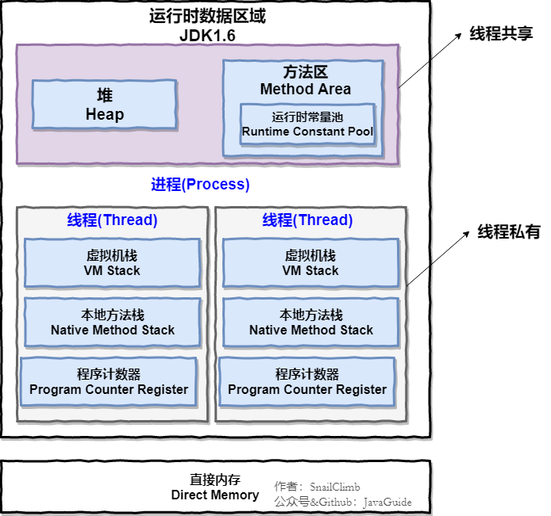

## **JVM**

> 如非特殊说明，本文主要针对的就是 HotSpot VM 。

**运行时数据区中包含哪些区域？哪些线程共享？哪些线程独享？哪些区域可能会出现OutOfMemoryError？哪些区域不会出现OutOfMemoryError?【⭐⭐⭐⭐⭐】**

💡 提示：把下面两张图记在心里！并且，你还要搞懂这些区域大概的作用是什么。

**JDK 1.8 之前：**



**JDK 1.8 ：**


线程私有的：程序计数器、虚拟机栈、本地方法栈

线程共享的：堆、方法区、直接内存 (非运行时数据区的一部分)

**说一下方法区和永久代的关系。【⭐⭐⭐】**

💡 提示：其实就有点像 Java 中接口和类的关系。

**Java 对象的创建过程。【⭐⭐⭐⭐】**

💡 提示：下图便是 Java 对象的创建过程，我建议最好是能默写出来，并且要掌握每一步在做什么。


**对象的访问定位的两种方式知道吗？各有什么优缺点。【⭐⭐⭐⭐】**

💡 提示：句柄和直接指针。

**如何判断对象是否死亡（两种方法）。 讲一下可达性分析算法的流程。 【⭐⭐⭐⭐】**

**JDK 中有几种引用类型？分别的特点是什么？【⭐⭐】**

💡 提示：JDK1.2 以后，Java 对引用的概念进行了扩充，将引用分为强引用、软引用、弱引用、虚引用四种（引用强度逐渐减弱）。对这些概念简单了解，有印象就可以了。

**堆空间的基本结构了解吗？什么情况下对象会进入老年代？【⭐⭐⭐⭐⭐】**

提示：

1. 大部分情况，对象都会首先在 Eden 区域分配。
2. 长期存活的对象将进入老年代。
3. 大对象直接进入老年代。

🌈 拓展：动态对象年龄判定。

**垃圾收集有哪些算法，各自的特点？【⭐⭐⭐⭐⭐】**

💡 提示：


**有哪些常见的 GC?谈谈你对 Minor GC、还有 Full GC 的理解。Minor GC 与 Full GC 分别在什么时候发生？ Minor GC 会发生 stop the world 现象吗？【⭐⭐⭐⭐⭐】**

💡 提示：

针对 HotSpot VM 的实现，它里面的 GC 其实准确分类只有两大种：

部分收集 (Partial GC)：

- 新生代收集（Minor GC / Young GC）：只对新生代进行垃圾收集；
- 老年代收集（Major GC / Old GC）：只对老年代进行垃圾收集。需要注意的是 Major GC 在有的语境中也用于指代整堆收集；
- 混合收集（Mixed GC）：对整个新生代和部分老年代进行垃圾收集。

整堆收集 (Full GC)：收集整个 Java 堆和方法区。

**讲一下 CMS 垃圾收集器的四个步骤。CMS 有什么缺点？【⭐⭐⭐⭐】**

💡 提示：初始标记、并发标记、重新标记、并发清除。

**并发标记要解决什么问题？并发标记带来了什么问题？如何解决并发扫描时对象消失问题？【⭐⭐⭐⭐】**

相关阅读：[面试官:你说你熟悉 jvm?那你讲一下并发的可达性分析](https://juejin.cn/post/6844904070788939790) 。

**G1 垃圾收集器的步骤。有什么缺点？【⭐⭐⭐⭐】**

💡 提示：和 CMS 类似。

**ZGC 了解吗？【⭐⭐⭐⭐】**

💡 提示： [新一代垃圾回收器 ZGC 的探索与实践(opens new window)](https://tech.meituan.com/2020/08/06/new-zgc-practice-in-meituan.html)

**JVM 中的安全点和安全区各代表什么？写屏障你了解吗？【⭐⭐⭐】**

**虚拟机基础故障处理工具有哪些？【⭐⭐⭐】**

💡 提示： 简单了解几个最重要的即可！

**什么是字节码？类文件结构的组成了解吗？【⭐⭐⭐⭐】**

💡 提示：在 Java 中，JVM 可以理解的代码就叫做字节码（即扩展名为 .class 的文件）。

ClassFile 的结构如下：

```clojure
ClassFile {
    u4             magic; //Class 文件的标志
    u2             minor_version;//Class 的小版本号
    u2             major_version;//Class 的大版本号
    u2             constant_pool_count;//常量池的数量
    cp_info        constant_pool[constant_pool_count-1];//常量池
    u2             access_flags;//Class 的访问标记
    u2             this_class;//当前类
    u2             super_class;//父类
    u2             interfaces_count;//接口
    u2             interfaces[interfaces_count];//一个类可以实现多个接口
    u2             fields_count;//Class 文件的字段属性
    field_info     fields[fields_count];//一个类会可以有多个字段
    u2             methods_count;//Class 文件的方法数量
    method_info    methods[methods_count];//一个类可以有个多个方法
    u2             attributes_count;//此类的属性表中的属性数
    attribute_info attributes[attributes_count];//属性表集合
}
```

**类的生命周期？类加载的过程了解么？加载这一步主要做了什么事情？初始化阶段中哪几种情况必须对类初始化？【⭐⭐⭐⭐⭐】**

💡 提示：


**双亲委派模型了解么？如果我们不想用双亲委派模型怎么办？【⭐⭐⭐⭐⭐】**

💡 提示：可以参考 Tomcat 的自定义类加载器 WebAppClassLoader

**双亲委派模型有什么好处？双亲委派模型是为了保证一个 Java 类在 JVM 中是唯一的？ 【⭐⭐⭐⭐⭐】**

**JDK 中有哪些默认的类加载器？ 【⭐⭐⭐⭐】**

💡 提示：

JVM 中内置了三个重要的 ClassLoader，除了 BootstrapClassLoader 其他类加载器均由 Java 实现且全部继承自java.lang.ClassLoader：

1. BootstrapClassLoader(启动类加载器) ：最顶层的加载类，由 C++实现，负责加载 %JAVA_HOME%/lib目录下的 jar 包和类或者被 -Xbootclasspath参数指定的路径中的所有类。
2. ExtensionClassLoader(扩展类加载器) ：主要负责加载 %JRE_HOME%/lib/ext 目录下的 jar 包和类，或被 java.ext.dirs 系统变量所指定的路径下的 jar 包。
3. AppClassLoader(应用程序类加载器) ：面向我们用户的加载器，负责加载当前应用 classpath 下的所有 jar 包和类。

**堆内存相关的 JVM 参数有哪些？你在项目中实际配置过了吗？ 【⭐⭐⭐⭐⭐】**

💡 提示：一定要自己动手操作一下。

相关问题：

- 如何设置年轻代和老年代的大小？
- 如何调整调整新生代和老年代的比值？
- ......

**如何对栈进行参数调优？【⭐⭐⭐⭐】**

**你在项目中遇到过 GC 问题吗？怎么分析和解决的？【⭐⭐⭐⭐⭐】**

💡 提示：比较有含金量的问题！比较能反映出求职者的水平，应该重点准备。

相关阅读：[Java 中 9 种常见的 CMS GC 问题分析与解决](https://tech.meituan.com/2020/11/12/java-9-cms-gc.html)

**GC 性能指标了解吗？调优原则呢？【⭐⭐⭐⭐⭐】**

- GC 性能指标通常关注吞吐量、停顿时间和垃圾回收频率。
- GC 优化的目标就是降低 Full GC 的频率以及减少 Full GC 的执行时间。

**如何降低 Full GC 的频率？【⭐⭐⭐⭐⭐】**

💡 提示： 可以通过减少进入老年代的对象数量可以显著降低 Full GC 的频率。如何减少进入老年代的对象数量呢？JVM 垃圾回收这部分有提到过。
