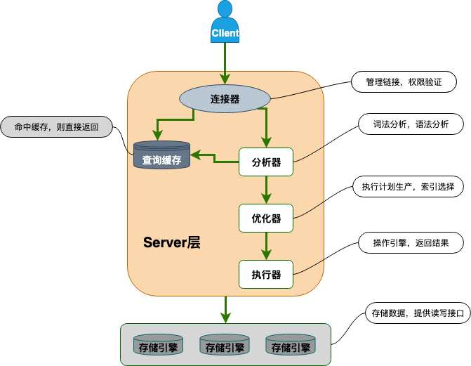

## **MySQL**

> 注意!!! ：下面这些问题的参考答案你几乎都可以在 [JavaGuide 在线阅读网站](https://javaguide.cn/database/mysql/mysql-questions-01.html) 和 《JavaGuide 面试指北》中找到。并且，这两个参考资料没有给出解答的问题，我也都给了对应的参考文章。
>
> 建议你先阅读学习了对应的内容之后再进行自测。

### MySQL 基础架构

#### 说说 MySQL 的架构？

👉 重要程度：⭐⭐⭐⭐

💡 提示：面试官一般不会直接问你 MySQL 基础架构，通常会由“一个 SQL 语句在 MySQL 中的执行流程”类似的问题引出。

你需要搞懂下图每一个组件所提供的主要功能。

#### 一条 SQL语句在MySQL中的执行过程

👉 重要程度：⭐⭐⭐⭐

💡 提示：结合 MySQL 的基础架构来回答这个问题。

### MySQL 存储引擎

#### MySQL 提供了哪些存储引擎？

👉 重要程度：⭐⭐

💡 提示：可以通过 show engines; 命令查看 MySQL 提供的所有存储引擎。

#### MySQL 存储引擎架构了解吗？

👉 重要程度：⭐⭐⭐

💡 提示：MySQL 存储引擎采用的是插件式架构，支持多种存储引擎，我们甚至可以为不同的数据库表设置不同的存储引擎以适应不同场景的需要。存储引擎是基于表的，而不是数据库。

#### MyISAM 和 InnoDB 的区别

👉 重要程度：⭐⭐⭐⭐⭐

💡 提示：从是否支持行级锁、事务、外键、数据库异常崩溃后的安全恢复、MVCC 等方面回答。

### MySQL 事务

#### 何谓事务？

👉 重要程度：⭐⭐⭐⭐

💡 提示：转账的案例。

#### 何谓数据库事务？

👉 重要程度：⭐⭐⭐⭐

💡 提示：数据库事务可以保证多个对数据库的操作（也就是 SQL 语句）构成一个逻辑上的整体。构成这个逻辑上的整体的这些数据库操作遵循：要么全部执行成功,要么全部不执行 。关系型数据库（例如：MySQL、SQL Server、Oracle 等）事务都有 ACID 特性。

#### ACID 特性指的是什么？

👉 重要程度：⭐⭐⭐⭐⭐

💡 提示：ACID 特性大家都知道，但是，这里有一个绝大部分人可能会理解错误的地方：只有保证了事务的持久性、原子性、隔离性之后，一致性才能得到保障。也就是说 A、I、D 是手段，C 是目的！

面试官可能还会顺便问你：“持久性是如何保证的？”、“原子性是如何保证的？”巴拉巴拉。这个时候你就需要结合 MySQL 日志、MySQL 锁以及 MVCC 来回答。

#### 并发事务带来了哪些问题?

👉 重要程度：⭐⭐⭐⭐⭐

💡 提示：脏读（Dirty read）、丢失修改（Lost to modify）、不可重复读（Unrepeatable read）、幻读（Phantom read）。

#### 不可重复读和幻读区别

👉 重要程度：⭐⭐⭐⭐⭐

💡 提示：

- 不可重复读的重点是内容修改或者记录减少比如多次读取一条记录发现其中某些记录的值被修改；
- 幻读的重点在于记录新增比如多次执行同一条查询语句（DQL）时，发现查到的记录增加了。

幻读其实可以看作是不可重复读的一种特殊情况，单独把区分幻读的原因主要是解决幻读和不可重复读的方案不一样。

举个例子：执行 delete 和 update 操作的时候，可以直接对记录加锁，保证事务安全。而执行 insert 操作的时候，由于记录锁（Record Lock）只能锁住已经存在的记录，为了避免插入新记录，需要依赖间隙锁（Gap Lock）。也就是说执行 insert 操作的时候需要依赖 Next-Key Lock（Record Lock+Gap Lock） 进行加锁来保证不出现幻读。

#### SQL 标准定义了哪些事务隔离级别?

👉 重要程度：⭐⭐⭐⭐⭐

💡 提示：READ-UNCOMMITTED(读取未提交)、READ-COMMITTED(读取已提交)、REPEATABLE-READ(可重复读)、SERIALIZABLE(可串行化)。

#### MySQL 的默认隔离级别是什么?能解决幻读问题么？

👉 重要程度：⭐⭐⭐⭐⭐

💡 提示：默认隔离级别是 REPEATABLE-READ（可重读），可以解决幻读问题（两种情况，快照读和当前读）。

#### 什么是 MVCC？有什么用？原理了解么？

👉 重要程度：⭐⭐⭐⭐⭐

💡 提示：RC（Read Committed，读提交）和 RR（Repeatable Read，可重复读）这两个隔离级别的实现都离不开 MVCC。

#### InnoDB 事务隔离级别实现原理

👉 重要程度：⭐⭐⭐

💡 提示：这个问题研究的比较深入，一般的面试不会问，难度有点大，需要结合 MySQL 锁和 MVCC 来回答。学有余力的朋友，可以通过下面这两篇文章来准备这个问题：

- [MySQL 事务的隔离性是如何实现的？](https://cloud.tencent.com/developer/article/1884107)
- [深入理解 MySQL 中事务隔离级别的实现原理](https://segmentfault.com/a/1190000025156465)

### MySQL 锁

####  表级锁和行级锁了解吗？有什么区别？

👉 重要程度：⭐⭐⭐⭐

💡 提示：表级锁(table-level locking)一锁就锁整张表。行级锁的粒度更小，仅对相关的记录上锁即可（对一行或者多行记录加锁）

#### 行级锁的使用有什么注意事项？

👉 重要程度：⭐⭐⭐⭐

💡 提示：InnoDB 的行锁是针对索引字段加的锁，表级锁是针对非索引字段加的锁。当我们执行 UPDATE、DELETE 语句时，如果 WHERE条件中字段没有命中索引或者索引失效的话，就会导致扫描全表对表中的所有记录进行加锁。

#### 共享锁和排他锁呢？

👉 重要程度：⭐⭐⭐⭐

💡 提示：不论是表级锁还是行级锁，都存在共享锁（Share Lock，S 锁）和排他锁（Exclusive Lock，X 锁）这两类

####   意向锁有什么作用？

👉 重要程度：⭐⭐⭐⭐

💡 提示：快速判断是否可以对某个表使用表锁。意向锁是表级锁，共有两种。并且，意向锁之间是互相兼容的。

#### InnoDB 有哪几类行锁？

👉 重要程度：⭐⭐⭐⭐⭐

💡 提示：记录锁（Record Lock）、间隙锁（Gap Lock）、临键锁（Next-key Lock）。

### MySQL 索引

#### 何为索引？有什么作用？

👉 重要程度：⭐⭐⭐

💡 提示：索引的作用就相当于书的目录。

#### 索引的优缺点

👉 重要程度：⭐⭐⭐⭐

💡 提示：索引并不都是好的，创建索引和维护索引也需要耗费资源和时间。

#### 索引的底层数据结构

👉 重要程度：⭐⭐⭐⭐

💡 提示：在 MySQL 中，MyISAM 引擎和 InnoDB 引擎都是使用 B+Tree 作为索引结构，但是，两者的实现方式不太一样。

#### MySQL 的索引结构为什么使用 B+树？

👉 重要程度：⭐⭐⭐⭐

💡 提示：结合二叉查找树、平衡二叉树、红黑树、B 树存在的缺陷来回答这个问题。

#### 主键索引和二级索引

👉 重要程度：⭐⭐⭐⭐

💡 提示：数据表的主键列使用的就是主键索引。二级索引又称为辅助索引，是因为二级索引的叶子节点存储的数据是主键。也就是说，通过二级索引，可以定位主键的位置。唯一索引，普通索引，前缀索引等索引属于二级索引。

#### 聚集索引与非聚集索引

👉 重要程度：⭐⭐⭐⭐

💡 提示：聚集索引即索引结构和数据一起存放的索引。主键索引属于聚集索引。非聚集索引即索引结构和数据分开存放的索引。

#### 覆盖索引

👉 重要程度：⭐⭐⭐⭐

💡 提示：覆盖索引即需要查询的字段正好是索引的字段，那么直接根据该索引，就可以查到数据了，而无需回表查询。

#### 联合索引

👉 重要程度：⭐⭐⭐⭐

💡 提示：MySQL 中的索引可以以一定顺序引用多列。

#### 最左前缀匹配原则

👉 重要程度：⭐⭐⭐⭐⭐

💡 提示：在 MySQL 建立联合索引时会遵守最左前缀匹配原则，即最左优先，在检索数据时从联合索引的最左边开始匹配。

#### 创建索引的注意事项有哪些？

👉 重要程度：⭐⭐⭐⭐

💡 提示：选择合适的字段创建索引、尽可能的考虑建立联合索引而不是单列索引......。

### MySQL 日志

#### MySQL 中常见的日志有哪些？

👉 重要程度：⭐⭐⭐

💡 提示：错误日志（error log）、二进制日志（binary log）、一般查询日志（general query log）、慢查询日志（slow query log） 、事务日志(redo log 和 undo log) ......。

#### 慢查询日志有什么用？

👉 重要程度：⭐⭐⭐

💡 提示：慢查询日志记录了执行时间超过 long_query_time（默认是 10s）的所有查询，在我们解决 SQL 慢查询（SQL 执行时间过长）问题的时候经常会用到。

#### binlog 主要记录了什么？有什么用？

👉 重要程度：⭐⭐⭐⭐⭐

💡 提示：MySQL binlog(binary log 即二进制日志文件) 主要记录了 MySQL 数据库中数据的所有变化(数据库执行的所有 DDL 和 DML 语句)。

#### redo log 如何保证事务的持久性？

👉 重要程度：⭐⭐⭐⭐⭐

💡 提示：redo log 主要做的事情就是记录页的修改，比如某个页面某个偏移量处修改了几个字节的值以及具体被修改的内容是什么。在事务提交时，我们会将 redo log 按照刷盘策略刷到磁盘上去，这样即使 MySQL 宕机了，重启之后也能恢复未能写入磁盘的数据，从而保证事务的持久性。

#### 页修改之后为什么不直接刷盘呢？

👉 重要程度：⭐⭐⭐⭐

💡 提示：性能非常差！InnoDB 页的大小一般为 16KB，而页又是磁盘和内存交互的基本单位。这就导致即使我们只修改了页中的几个字节数据，一次刷盘操作也需要将 16KB 大小的页整个都刷新到磁盘中。而且，这些修改的页可能并不相邻，也就是说这还是随机 IO。

#### binlog 和 redolog 有什么区别？

👉 重要程度：⭐⭐⭐⭐

💡 提示：可以从用途、写入方式、是否是 InnoDB 引擎特有的这几个方面来回答。

#### undo log 如何保证事务的原子性？

👉 重要程度：⭐⭐⭐⭐⭐

💡 提示：每一个事务对数据的修改都会被记录到 undo log ，当执行事务过程中出现错误或者需要执行回滚操作的话，MySQL 可以利用 undo log 将数据恢复到事务开始之前的状态。

### 性能优化

#### SQL 优化

👉 重要程度：⭐⭐⭐⭐⭐

💡 提示：SQL 优化涵盖的内容非常多，像正确使用索引、数据结构、数据库函数等等都属于 SQL 优化的范畴。另外，问到 SQL 优化的时候一定离不开 Explain 命令的使用！你可以参考下面这两篇文章来准备这个问题：

- [聊聊 SQL 优化的 15 个小技巧 -苏三聊技术](https://cloud.tencent.com/developer/article/1899907)

- [SQL 高性能优化指南！35+条优化建议立马 GET! - 码海](https://mp.weixin.qq.com/s?__biz=Mzg2OTA0Njk0OA==&mid=2247488618&idx=1&sn=e70a31865b5eadcb151f439004a4dd72&chksm=cea25ba1f9d5d2b795222ba90e0326618d649e858ec23e9c7360f90fbfc23a7786c33bff9556&token=1647609083&lang=zh_CN#rd)

尽量要结合自己的项目来聊，具体说明自己是如何进行 SQL 优化的，具体带来了什么效果。

#### 慢查询问题排查

👉 重要程度：⭐⭐⭐⭐⭐

💡 提示：记几个导致慢查询的常见原因，知道遇到慢查询问题了如何排查。具体做法可以参考这篇[那些年我们一起优化的 SQL](https://mp.weixin.qq.com/s/sPO-6ULwIfUexLY3V4acBg)这篇文章。

这个也要尽量结合自己的项目来聊，具体说明自己如何解决慢查询问题的。
