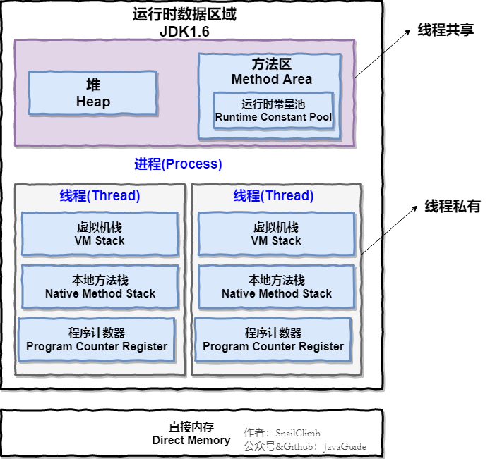
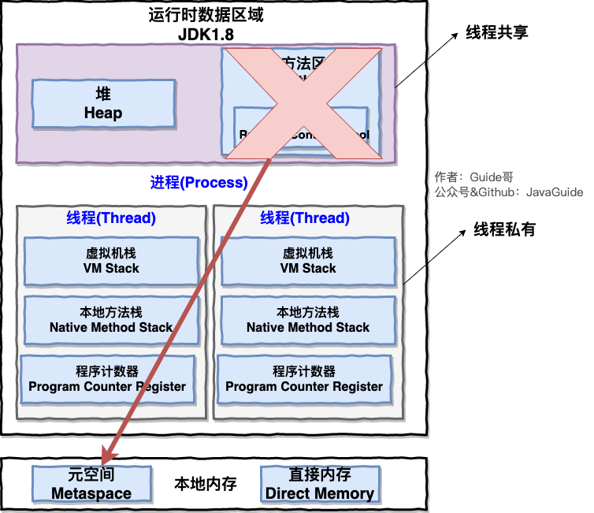
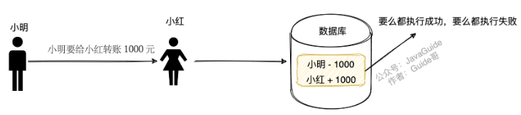

# 三、技术面试题自测篇

## Java基础

>  可选标题：面了一个应届生，我问了这些 Java 基础问题。

**Java 中有哪 8 种基本数据类型？它们的默认值和占用的空间大小知道不？ 说说这 8 种基本数据类型对应的包装类型。**

💡 提示：Java 中有 8 种基本数据类型，分别为：

1. 6 种数字类型 ：byte、short、int、long、float、double
2. 1 种字符类型：char
3. 1 种布尔型：boolean。

**包装类型的常量池技术了解么？**

💡 提示：Java 基本类型的包装类的大部分（Byte,Short,Integer,Long ,Character,Boolean）都实现了常量池技术。

🌈 拓展：整型包装类对象之间值的比较应该使用 equals 方法

**为什么要有包装类型？**

💡 提示： 基本类型有默认值、泛型参数不能是基本类型

**什么是自动拆装箱？原理？**

💡 提示：基本类型和包装类型之间的互转。装箱其实就是调用了 包装类的valueOf()方法，拆箱其实就是调用了 xxxValue()方法。

**遇到过自动拆箱引发的 NPE 问题吗？**

💡 提示：两个常见的场景：

- 数据库的查询结果可能是 null，因为自动拆箱，用基本数据类型接收有 NPE 风险
- 三目运算符使用不当会导致诡异的 NPE 异常

**String、StringBuffer 和 StringBuilder 的区别是什么? String 为什么是不可变的?**

💡 提示：可以从可变性、线程安全性、性能这几个角度来回答。

**重载和重写的区别？**

💡 提示：可以从下面几个角度来回答：

- 发生范围
- 参数列表
- 返回值类型
- 异常
- 访问修饰符
- 发生阶段

**== 和 equals() 的区别**

💡 提示：== 对于基本类型和引用类型的作用效果是不同的，equals() 不能用于判断基本数据类型的变量，只能用来判断两个对象是否相等。equals() 方法存在两种使用情况：

- 类没有重写 equals()方法 ：通过equals()比较该类的两个对象时，等价于通过“==”比较这两个对象，使用的默认是 Object类equals()方法。
- 类重写了 equals()方法 ：一般我们都重写 equals()方法来比较两个对象中的属性是否相等；若它们的属性相等，则返回 true(即，认为这两个对象相等)。

**Java 反射？反射有什么优点/缺点？你是怎么理解反射的（为什么框架需要反射）？**

💡 提示： 想想你平时使用框架为啥能够如此方便。想想动态代理以及注解和反射之间的关系。

**谈谈对 Java 注解的理解，解决了什么问题？**

💡 提示： 想想你平时使用框架为啥能够如此方便。另外，需要注意注解的解析依赖于反射机制，务必要提前把反射机制搞懂。

**Java 泛型了解么？泛型的作用？什么是类型擦除？泛型有哪些限制？介绍一下常用的通配符？**

💡 提示：

- 好处：编译期间的类型检测（安全）、可读性更好
- Java 的泛型是伪泛型

**内部类了解吗？匿名内部类了解吗？**

内部类分为下面 4 种：

- 成员内部类
- 静态内部类
- 局部（方法）内部类
- 匿名内部类

**BIO,NIO,AIO 有什么区别?**

IO 模型这块挺难理解的，需要很多计算机底层知识。建议小伙伴们克服困难，一定要把这个点搞明白。

## **Java 集合**

**说说 List,Set,Map 三者的区别？**

💡 提示：可以从这些数据结构中的元素是否有序、是否可以重复、存储的元素类型（比如 Map 存储的就是键值对）等方面来回答。

**List,Set,Map 在 Java 中分别由哪些对应的实现类？底层的数据结构？**

💡 提示：拿 List 来举例， List 的常见实现类以及它们的数据结构 ：

- ArrayList： Object[]数组
- Vector：Object[]数组
- LinkedList： 双向链表(JDK1.6 之前为循环链表，JDK1.7 取消了循环)

**有哪些集合是线程不安全的？怎么解决呢？**

💡 提示：这块比较常问的是 Arraylist 和 Vector 、HashMap 和 ConcurrentHashMap（高频问题，重要） 。被问到 Vector 的时候， 你紧接着可能会被问到 Arraylist 和 Vector 的区别。被问到 ConcurrentHashMap 的时候，你紧接着就可能会被问到 ConcurrentHashMap 相关的问题比如 ConcurrentHashMap 是如何保证线程安全的。

**HashMap 查询，删除的时间复杂度**

💡 提示：

- 没有哈希冲突的情况
- 转链表的情况
- 链表转红黑树的情况

**HashMap 的底层实现**

💡 提示：

- JDK1.8 之前 ： 数组和链表
- JDK1.8 之后 ： 多了红黑树

**HashMap 的长度为什么是 2 的幂次方**

💡 提示：提高运算效率。

**比较 HashSet、LinkedHashSet 和 TreeSet 三者的异同**

💡 提示：

- HashSet、LinkedHashSet 和 TreeSet 都是 Set 接口的实现类，都能保证元素唯一，并且都不是线程安全的。
- HashSet、LinkedHashSet 和 TreeSet 的主要区别在于底层数据结构不同（底层数据结构不同又导致这三者的应用场景不同）。

**HashMap 和 Hashtable 的区别？HashMap 和 HashSet 区别？HashMap 和 TreeMap 区别？**

**ConcurrentHashMap 和 Hashtable 的区别？**

💡 提示：

- 底层数据结构
- 实现线程安全的方式的区别

**ConcurrentHashMap 线程安全的具体实现方式/底层具体实现**

💡 提示：

- JDK 1.7 ：Segment 分段锁
- JDK 1.8 ： CAS 和 synchronized

## **Java并发**

**什么是线程和进程?线程与进程的关系,区别及优缺点？⭐⭐⭐⭐**

💡 提示：可以从从 JVM 角度说进程和线程之间的关系

**为什么要使用多线程呢? ⭐⭐⭐**

💡 提示：从计算机角度来说主要是为了充分利用多核 CPU 的能力，从项目角度来说主要是为了提升系统的性能。

**说说线程的生命周期和状态? ⭐⭐⭐⭐**

💡 提示： 6 种状态（NEW、RUNNABLE、BLOCKED、WAITING、TIME_WAITING、TERMINATED）。

🌈 拓展：在操作系统中层面线程有 READY 和 RUNNING 状态，而在 JVM 层面只能看到 RUNNABLE 状态。

**什么是线程死锁?如何避免死锁?如何预防和避免线程死锁? ⭐⭐⭐⭐**

💡 提示： 这里最好能够结合代码来聊，你要确保自己可以写出有死锁问题的代码。

🌈 拓展：项目中遇到死锁问题是比较常见的，除了要搞懂上面这些死锁的基本概念之外，你还要知道线上项目遇到死锁问题该如何排查和解决。

**synchronized 关键字 ⭐⭐⭐⭐⭐**

💡 提示：synchronized 关键字几乎是面试必问，你需要搞懂下面这些 synchronized 关键字相关的问题：

- synchronized 关键字的作用，自己是怎么使用的。
-  synchronized 关键字的底层原理（重点！！！）
-  JDK1.6 之后的 synchronized 关键字底层做了哪些优化。synchronized 锁升级流程。
-  synchronized 和 ReentrantLock 的区别。
-  synchronized 和 volatile 的区别。

**并发编程的三个重要特性 ⭐⭐⭐⭐⭐**

💡 提示： 原子性、可见性、有序性

**JMM（Java Memory Model，Java 内存模型）和 happens-before 原则。 ⭐⭐⭐⭐⭐**

**volatile 关键字 ⭐⭐⭐⭐⭐**

💡 提示：volatile 关键字同样是一个重点！结合 JMM（Java Memory Model，Java 内存模型）和 happens-before 原则来回答就行了。

**ThreadLocal 关键字 ⭐⭐⭐⭐⭐**

💡 提示：关注ThreadLocal的底层原理、内存泄露问题以及自己是如何在项目中使用ThreadLocal关键字的。

**线程池 ⭐⭐⭐⭐⭐**

💡 提示：线程池有哪几种，各种线程池的优缺点，线程池的重要参数、线程池的执行流程、线程池的饱和策略、如何设置线程池的大小等等。

**ReentrantLock 和 AQS ⭐⭐⭐⭐⭐**

💡 提示： ReentrantLock 的特性、实现原理（基于 AQS）。可以从 ReentrantLock 的实现来理解 AQS。

**乐观锁和悲观锁的区别 ⭐⭐⭐⭐⭐**

**CAS 了解么？原理？什么是 ABA 问题？ABA 问题怎么解决？ ⭐⭐⭐⭐⭐**

💡 提示：多地方都用到了 CAS 比如 ConcurrentHashMap 采用 CAS 和 synchronized 来保证并发安全，再比如java.util.concurrent.atomic包中的类通过 volatile+CAS 重试保证线程安全性。和面试官聊 CAS 的时候，你可以结合 CAS 的一些实际应用来说。

**Atomic 原子类 ⭐⭐**

## **JVM**

> 如非特殊说明，本文主要针对的就是 HotSpot VM 。

**运行时数据区中包含哪些区域？哪些线程共享？哪些线程独享？哪些区域可能会出现OutOfMemoryError？哪些区域不会出现OutOfMemoryError?【⭐⭐⭐⭐⭐】**

💡 提示：把下面两张图记在心里！并且，你还要搞懂这些区域大概的作用是什么。

**JDK 1.8 之前：**



**JDK 1.8 ：**



线程私有的：程序计数器、虚拟机栈、本地方法栈

线程共享的：堆、方法区、直接内存 (非运行时数据区的一部分)

**说一下方法区和永久代的关系。【⭐⭐⭐】**

💡 提示：其实就有点像 Java 中接口和类的关系。

**Java 对象的创建过程。【⭐⭐⭐⭐】**

💡 提示：下图便是 Java 对象的创建过程，我建议最好是能默写出来，并且要掌握每一步在做什么。


**对象的访问定位的两种方式知道吗？各有什么优缺点。【⭐⭐⭐⭐】**

💡 提示：句柄和直接指针。

**如何判断对象是否死亡（两种方法）。 讲一下可达性分析算法的流程。 【⭐⭐⭐⭐】**

**JDK 中有几种引用类型？分别的特点是什么？【⭐⭐】**

💡 提示：JDK1.2 以后，Java 对引用的概念进行了扩充，将引用分为强引用、软引用、弱引用、虚引用四种（引用强度逐渐减弱）。对这些概念简单了解，有印象就可以了。

**堆空间的基本结构了解吗？什么情况下对象会进入老年代？【⭐⭐⭐⭐⭐】**

提示：

1. 大部分情况，对象都会首先在 Eden 区域分配。
2. 长期存活的对象将进入老年代。
3. 大对象直接进入老年代。

🌈 拓展：动态对象年龄判定。

**垃圾收集有哪些算法，各自的特点？【⭐⭐⭐⭐⭐】**

💡 提示：


**有哪些常见的 GC?谈谈你对 Minor GC、还有 Full GC 的理解。Minor GC 与 Full GC 分别在什么时候发生？ Minor GC 会发生 stop the world 现象吗？【⭐⭐⭐⭐⭐】**

💡 提示：

针对 HotSpot VM 的实现，它里面的 GC 其实准确分类只有两大种：

部分收集 (Partial GC)：

- 新生代收集（Minor GC / Young GC）：只对新生代进行垃圾收集；
- 老年代收集（Major GC / Old GC）：只对老年代进行垃圾收集。需要注意的是 Major GC 在有的语境中也用于指代整堆收集；
- 混合收集（Mixed GC）：对整个新生代和部分老年代进行垃圾收集。

整堆收集 (Full GC)：收集整个 Java 堆和方法区。

**讲一下 CMS 垃圾收集器的四个步骤。CMS 有什么缺点？【⭐⭐⭐⭐】**

💡 提示：初始标记、并发标记、重新标记、并发清除。

**并发标记要解决什么问题？并发标记带来了什么问题？如何解决并发扫描时对象消失问题？【⭐⭐⭐⭐】**

相关阅读：[面试官:你说你熟悉 jvm?那你讲一下并发的可达性分析](https://juejin.cn/post/6844904070788939790) 。

**G1 垃圾收集器的步骤。有什么缺点？【⭐⭐⭐⭐】**

💡 提示：和 CMS 类似。

**ZGC 了解吗？【⭐⭐⭐⭐】**

💡 提示： [新一代垃圾回收器 ZGC 的探索与实践(opens new window)](https://tech.meituan.com/2020/08/06/new-zgc-practice-in-meituan.html)

**JVM 中的安全点和安全区各代表什么？写屏障你了解吗？【⭐⭐⭐】**

**虚拟机基础故障处理工具有哪些？【⭐⭐⭐】**

💡 提示： 简单了解几个最重要的即可！

**什么是字节码？类文件结构的组成了解吗？【⭐⭐⭐⭐】**

💡 提示：在 Java 中，JVM 可以理解的代码就叫做字节码（即扩展名为 .class 的文件）。

ClassFile 的结构如下：

```clojure
ClassFile {
    u4             magic; //Class 文件的标志
    u2             minor_version;//Class 的小版本号
    u2             major_version;//Class 的大版本号
    u2             constant_pool_count;//常量池的数量
    cp_info        constant_pool[constant_pool_count-1];//常量池
    u2             access_flags;//Class 的访问标记
    u2             this_class;//当前类
    u2             super_class;//父类
    u2             interfaces_count;//接口
    u2             interfaces[interfaces_count];//一个类可以实现多个接口
    u2             fields_count;//Class 文件的字段属性
    field_info     fields[fields_count];//一个类会可以有多个字段
    u2             methods_count;//Class 文件的方法数量
    method_info    methods[methods_count];//一个类可以有个多个方法
    u2             attributes_count;//此类的属性表中的属性数
    attribute_info attributes[attributes_count];//属性表集合
}
```

**类的生命周期？类加载的过程了解么？加载这一步主要做了什么事情？初始化阶段中哪几种情况必须对类初始化？【⭐⭐⭐⭐⭐】**

💡 提示：


**双亲委派模型了解么？如果我们不想用双亲委派模型怎么办？【⭐⭐⭐⭐⭐】**

💡 提示：可以参考 Tomcat 的自定义类加载器 WebAppClassLoader

**双亲委派模型有什么好处？双亲委派模型是为了保证一个 Java 类在 JVM 中是唯一的？ 【⭐⭐⭐⭐⭐】**

**JDK 中有哪些默认的类加载器？ 【⭐⭐⭐⭐】**

💡 提示：

JVM 中内置了三个重要的 ClassLoader，除了 BootstrapClassLoader 其他类加载器均由 Java 实现且全部继承自java.lang.ClassLoader：

1. BootstrapClassLoader(启动类加载器) ：最顶层的加载类，由 C++实现，负责加载 %JAVA_HOME%/lib目录下的 jar 包和类或者被 -Xbootclasspath参数指定的路径中的所有类。
2. ExtensionClassLoader(扩展类加载器) ：主要负责加载 %JRE_HOME%/lib/ext 目录下的 jar 包和类，或被 java.ext.dirs 系统变量所指定的路径下的 jar 包。
3. AppClassLoader(应用程序类加载器) ：面向我们用户的加载器，负责加载当前应用 classpath 下的所有 jar 包和类。

**堆内存相关的 JVM 参数有哪些？你在项目中实际配置过了吗？ 【⭐⭐⭐⭐⭐】**

💡 提示：一定要自己动手操作一下。

相关问题：

- 如何设置年轻代和老年代的大小？
- 如何调整调整新生代和老年代的比值？
- ......

**如何对栈进行参数调优？【⭐⭐⭐⭐】**

**你在项目中遇到过 GC 问题吗？怎么分析和解决的？【⭐⭐⭐⭐⭐】**

💡 提示：比较有含金量的问题！比较能反映出求职者的水平，应该重点准备。

相关阅读：[Java 中 9 种常见的 CMS GC 问题分析与解决](https://tech.meituan.com/2020/11/12/java-9-cms-gc.html)

**GC 性能指标了解吗？调优原则呢？【⭐⭐⭐⭐⭐】**

- GC 性能指标通常关注吞吐量、停顿时间和垃圾回收频率。
- GC 优化的目标就是降低 Full GC 的频率以及减少 Full GC 的执行时间。

**如何降低 Full GC 的频率？【⭐⭐⭐⭐⭐】**

💡 提示： 可以通过减少进入老年代的对象数量可以显著降低 Full GC 的频率。如何减少进入老年代的对象数量呢？JVM 垃圾回收这部分有提到过。

## **MySQL**

> 注意!!! ：下面这些问题的参考答案你几乎都可以在 [JavaGuide 在线阅读网站](https://javaguide.cn/database/mysql/mysql-questions-01.html) 和 《JavaGuide 面试指北》中找到。并且，这两个参考资料没有给出解答的问题，我也都给了对应的参考文章。
>
> 建议你先阅读学习了对应的内容之后再进行自测。

### MySQL 基础架构

#### 说说 MySQL 的架构？

👉 重要程度：⭐⭐⭐⭐

💡 提示：面试官一般不会直接问你 MySQL 基础架构，通常会由“一个 SQL 语句在 MySQL 中的执行流程”类似的问题引出。

你需要搞懂下图每一个组件所提供的主要功能。


#### 一条 SQL语句在MySQL中的执行过程

👉 重要程度：⭐⭐⭐⭐

💡 提示：结合 MySQL 的基础架构来回答这个问题。

### MySQL 存储引擎

#### MySQL 提供了哪些存储引擎？

👉 重要程度：⭐⭐

💡 提示：可以通过 show engines; 命令查看 MySQL 提供的所有存储引擎。

#### MySQL 存储引擎架构了解吗？

👉 重要程度：⭐⭐⭐

💡 提示：MySQL 存储引擎采用的是插件式架构，支持多种存储引擎，我们甚至可以为不同的数据库表设置不同的存储引擎以适应不同场景的需要。存储引擎是基于表的，而不是数据库。

#### MyISAM 和 InnoDB 的区别

👉 重要程度：⭐⭐⭐⭐⭐

💡 提示：从是否支持行级锁、事务、外键、数据库异常崩溃后的安全恢复、MVCC 等方面回答。

### MySQL 事务

#### 何谓事务？

👉 重要程度：⭐⭐⭐⭐

💡 提示：转账的案例。



#### 何谓数据库事务？

👉 重要程度：⭐⭐⭐⭐

💡 提示：数据库事务可以保证多个对数据库的操作（也就是 SQL 语句）构成一个逻辑上的整体。构成这个逻辑上的整体的这些数据库操作遵循：要么全部执行成功,要么全部不执行 。关系型数据库（例如：MySQL、SQL Server、Oracle 等）事务都有 ACID 特性。

#### ACID 特性指的是什么？

👉 重要程度：⭐⭐⭐⭐⭐

💡 提示：ACID 特性大家都知道，但是，这里有一个绝大部分人可能会理解错误的地方：只有保证了事务的持久性、原子性、隔离性之后，一致性才能得到保障。也就是说 A、I、D 是手段，C 是目的！


面试官可能还会顺便问你：“持久性是如何保证的？”、“原子性是如何保证的？”巴拉巴拉。这个时候你就需要结合 MySQL 日志、MySQL 锁以及 MVCC 来回答。

#### 并发事务带来了哪些问题?

👉 重要程度：⭐⭐⭐⭐⭐

💡 提示：脏读（Dirty read）、丢失修改（Lost to modify）、不可重复读（Unrepeatable read）、幻读（Phantom read）。

#### 不可重复读和幻读区别

👉 重要程度：⭐⭐⭐⭐⭐

💡 提示：

- 不可重复读的重点是内容修改或者记录减少比如多次读取一条记录发现其中某些记录的值被修改；
- 幻读的重点在于记录新增比如多次执行同一条查询语句（DQL）时，发现查到的记录增加了。

幻读其实可以看作是不可重复读的一种特殊情况，单独把区分幻读的原因主要是解决幻读和不可重复读的方案不一样。

举个例子：执行 delete 和 update 操作的时候，可以直接对记录加锁，保证事务安全。而执行 insert 操作的时候，由于记录锁（Record Lock）只能锁住已经存在的记录，为了避免插入新记录，需要依赖间隙锁（Gap Lock）。也就是说执行 insert 操作的时候需要依赖 Next-Key Lock（Record Lock+Gap Lock） 进行加锁来保证不出现幻读。

#### SQL 标准定义了哪些事务隔离级别?

👉 重要程度：⭐⭐⭐⭐⭐

💡 提示：READ-UNCOMMITTED(读取未提交)、READ-COMMITTED(读取已提交)、REPEATABLE-READ(可重复读)、SERIALIZABLE(可串行化)。

#### MySQL 的默认隔离级别是什么?能解决幻读问题么？

👉 重要程度：⭐⭐⭐⭐⭐

💡 提示：默认隔离级别是 REPEATABLE-READ（可重读），可以解决幻读问题（两种情况，快照读和当前读）。

#### 什么是 MVCC？有什么用？原理了解么？

👉 重要程度：⭐⭐⭐⭐⭐

💡 提示：RC（Read Committed，读提交）和 RR（Repeatable Read，可重复读）这两个隔离级别的实现都离不开 MVCC。

#### InnoDB 事务隔离级别实现原理

👉 重要程度：⭐⭐⭐

💡 提示：这个问题研究的比较深入，一般的面试不会问，难度有点大，需要结合 MySQL 锁和 MVCC 来回答。学有余力的朋友，可以通过下面这两篇文章来准备这个问题：

- [MySQL 事务的隔离性是如何实现的？](https://cloud.tencent.com/developer/article/1884107)
- [深入理解 MySQL 中事务隔离级别的实现原理](https://segmentfault.com/a/1190000025156465)

### MySQL 锁

####  表级锁和行级锁了解吗？有什么区别？

👉 重要程度：⭐⭐⭐⭐

💡 提示：表级锁(table-level locking)一锁就锁整张表。行级锁的粒度更小，仅对相关的记录上锁即可（对一行或者多行记录加锁）

#### 行级锁的使用有什么注意事项？

👉 重要程度：⭐⭐⭐⭐

💡 提示：InnoDB 的行锁是针对索引字段加的锁，表级锁是针对非索引字段加的锁。当我们执行 UPDATE、DELETE 语句时，如果 WHERE条件中字段没有命中索引或者索引失效的话，就会导致扫描全表对表中的所有记录进行加锁。

#### 共享锁和排他锁呢？

👉 重要程度：⭐⭐⭐⭐

💡 提示：不论是表级锁还是行级锁，都存在共享锁（Share Lock，S 锁）和排他锁（Exclusive Lock，X 锁）这两类

####   意向锁有什么作用？

👉 重要程度：⭐⭐⭐⭐

💡 提示：快速判断是否可以对某个表使用表锁。意向锁是表级锁，共有两种。并且，意向锁之间是互相兼容的。

#### InnoDB 有哪几类行锁？

👉 重要程度：⭐⭐⭐⭐⭐

💡 提示：记录锁（Record Lock）、间隙锁（Gap Lock）、临键锁（Next-key Lock）。

### MySQL 索引

#### 何为索引？有什么作用？

👉 重要程度：⭐⭐⭐

💡 提示：索引的作用就相当于书的目录。

#### 索引的优缺点

👉 重要程度：⭐⭐⭐⭐

💡 提示：索引并不都是好的，创建索引和维护索引也需要耗费资源和时间。

#### 索引的底层数据结构

👉 重要程度：⭐⭐⭐⭐

💡 提示：在 MySQL 中，MyISAM 引擎和 InnoDB 引擎都是使用 B+Tree 作为索引结构，但是，两者的实现方式不太一样。

#### MySQL 的索引结构为什么使用 B+树？

👉 重要程度：⭐⭐⭐⭐

💡 提示：结合二叉查找树、平衡二叉树、红黑树、B 树存在的缺陷来回答这个问题。

#### 主键索引和二级索引

👉 重要程度：⭐⭐⭐⭐

💡 提示：数据表的主键列使用的就是主键索引。二级索引又称为辅助索引，是因为二级索引的叶子节点存储的数据是主键。也就是说，通过二级索引，可以定位主键的位置。唯一索引，普通索引，前缀索引等索引属于二级索引。

#### 聚集索引与非聚集索引

👉 重要程度：⭐⭐⭐⭐

💡 提示：聚集索引即索引结构和数据一起存放的索引。主键索引属于聚集索引。非聚集索引即索引结构和数据分开存放的索引。

#### 覆盖索引

👉 重要程度：⭐⭐⭐⭐

💡 提示：覆盖索引即需要查询的字段正好是索引的字段，那么直接根据该索引，就可以查到数据了，而无需回表查询。

#### 联合索引

👉 重要程度：⭐⭐⭐⭐

💡 提示：MySQL 中的索引可以以一定顺序引用多列。

#### 最左前缀匹配原则

👉 重要程度：⭐⭐⭐⭐⭐

💡 提示：在 MySQL 建立联合索引时会遵守最左前缀匹配原则，即最左优先，在检索数据时从联合索引的最左边开始匹配。

#### 创建索引的注意事项有哪些？

👉 重要程度：⭐⭐⭐⭐

💡 提示：选择合适的字段创建索引、尽可能的考虑建立联合索引而不是单列索引......。

### MySQL 日志

#### MySQL 中常见的日志有哪些？

👉 重要程度：⭐⭐⭐

💡 提示：错误日志（error log）、二进制日志（binary log）、一般查询日志（general query log）、慢查询日志（slow query log） 、事务日志(redo log 和 undo log) ......。

#### 慢查询日志有什么用？

👉 重要程度：⭐⭐⭐

💡 提示：慢查询日志记录了执行时间超过 long_query_time（默认是 10s）的所有查询，在我们解决 SQL 慢查询（SQL 执行时间过长）问题的时候经常会用到。

#### binlog 主要记录了什么？有什么用？

👉 重要程度：⭐⭐⭐⭐⭐

💡 提示：MySQL binlog(binary log 即二进制日志文件) 主要记录了 MySQL 数据库中数据的所有变化(数据库执行的所有 DDL 和 DML 语句)。

#### redo log 如何保证事务的持久性？

👉 重要程度：⭐⭐⭐⭐⭐

💡 提示：redo log 主要做的事情就是记录页的修改，比如某个页面某个偏移量处修改了几个字节的值以及具体被修改的内容是什么。在事务提交时，我们会将 redo log 按照刷盘策略刷到磁盘上去，这样即使 MySQL 宕机了，重启之后也能恢复未能写入磁盘的数据，从而保证事务的持久性。

#### 页修改之后为什么不直接刷盘呢？

👉 重要程度：⭐⭐⭐⭐

💡 提示：性能非常差！InnoDB 页的大小一般为 16KB，而页又是磁盘和内存交互的基本单位。这就导致即使我们只修改了页中的几个字节数据，一次刷盘操作也需要将 16KB 大小的页整个都刷新到磁盘中。而且，这些修改的页可能并不相邻，也就是说这还是随机 IO。

#### binlog 和 redolog 有什么区别？

👉 重要程度：⭐⭐⭐⭐

💡 提示：可以从用途、写入方式、是否是 InnoDB 引擎特有的这几个方面来回答。

#### undo log 如何保证事务的原子性？

👉 重要程度：⭐⭐⭐⭐⭐

💡 提示：每一个事务对数据的修改都会被记录到 undo log ，当执行事务过程中出现错误或者需要执行回滚操作的话，MySQL 可以利用 undo log 将数据恢复到事务开始之前的状态。

### 性能优化

#### SQL 优化

👉 重要程度：⭐⭐⭐⭐⭐

💡 提示：SQL 优化涵盖的内容非常多，像正确使用索引、数据结构、数据库函数等等都属于 SQL 优化的范畴。另外，问到 SQL 优化的时候一定离不开 Explain 命令的使用！你可以参考下面这两篇文章来准备这个问题：

- [聊聊 SQL 优化的 15 个小技巧 -苏三聊技术](https://cloud.tencent.com/developer/article/1899907)

- [SQL 高性能优化指南！35+条优化建议立马 GET! - 码海](https://mp.weixin.qq.com/s?__biz=Mzg2OTA0Njk0OA==&mid=2247488618&idx=1&sn=e70a31865b5eadcb151f439004a4dd72&chksm=cea25ba1f9d5d2b795222ba90e0326618d649e858ec23e9c7360f90fbfc23a7786c33bff9556&token=1647609083&lang=zh_CN#rd)

尽量要结合自己的项目来聊，具体说明自己是如何进行 SQL 优化的，具体带来了什么效果。

#### 慢查询问题排查

👉 重要程度：⭐⭐⭐⭐⭐

💡 提示：记几个导致慢查询的常见原因，知道遇到慢查询问题了如何排查。具体做法可以参考这篇[那些年我们一起优化的 SQL](https://mp.weixin.qq.com/s/sPO-6ULwIfUexLY3V4acBg)这篇文章。

这个也要尽量结合自己的项目来聊，具体说明自己如何解决慢查询问题的。

## Redis

> 注意!!! ：下面这些问题的参考答案你几乎都可以在 [JavaGuide 在线阅读网站](https://javaguide.cn/database/mysql/mysql-questions-01.html) 和 《JavaGuide 面试指北》中找到。并且，这两个参考资料没有给出解答的问题，我也都给了对应的参考文章。
>
> 建议你先阅读学习了对应的内容之后再进行自测。

### Redis 基础

#### Redis 有什么作用?为什么要用 Redis/为什么要用缓存？

👉 重要程度：⭐⭐⭐

💡 提示：内存数据库，高并发，常用来做缓存。

#### Redis 除了做缓存，还能做什么？

👉 重要程度：⭐⭐⭐⭐

💡 提示：分布式锁、限流、消息队列（不推荐）。另外，利用 Redis 自带的数据结构我们可以很方便地完成很多复杂的业务场景比如通过 sorted set 维护一份排行榜。

#### Redis 可以做消息队列么？

👉 重要程度：⭐⭐⭐

💡 提示：Redis 5.0 新增加的一个数据结构 Stream 可以用来做消息队列。不过，和专业的消息对象相比还是有很多欠缺的地方。

#### 分布式缓存常见的技术选型方案有哪些？

👉 重要程度：⭐⭐⭐

💡 提示：Memcached 和 Redis。紧接着面试官可能会让你简单对比一下 Memcached 和 Redis 。

### Redis 数据结构

#### Redis 常用的数据结构有哪些？

👉 重要程度：⭐⭐⭐⭐

💡 提示：

- 5 种基础数据类型：String（字符串）、List（列表）、Set（集合）、Hash（散列）、Zset（有序集合）。

- 3 种特殊数据类型：HyperLogLogs（基数统计）、Bitmap （位存储）、geospatial (地理位置)。

面试官问到 Redis 常用的数据结构之后，可以会顺带问你 Redis 底层数据结构。

#### 使用 Redis 统计网站 UV 怎么做？

👉 重要程度：⭐⭐⭐⭐⭐

💡 提示：可以借助 HyperLogLog 来做，占用空间非常非常小。

#### 使用 Redis 实现一个排行榜怎么做？

👉 重要程度：⭐⭐⭐⭐⭐

💡 提示：Redis 中有一个叫做 sorted set 的数据结构经常被用在各种排行榜的场景下。

### Redis 线程模型

#### Redis 单线程模型了解吗？

👉 重要程度：⭐⭐⭐⭐⭐

💡 提示：Redis 通过 IO 多路复用程序 来监听来自客户端的大量连接（或者说是监听多个 socket），它会将感兴趣的事件及类型（读、写）注册到内核中并监听每个事件是否发生。

类似问题：既然是单线程，那怎么监听大量的客户端连接呢？、为什么 Redis 这么快？

#### Redis6.0 之前为什么不使用多线程？

👉 重要程度：⭐⭐⭐

💡 提示：单线程编程容易并且更容易维护、Redis 的性能瓶颈不在 CPU 。

#### Redis6.0 之后为何引入了多线程？

👉 重要程度：⭐⭐⭐⭐

💡 提示：Redis6.0 引入多线程主要是为了提高网络 IO 读写性能。

### Redis 内存管理

#### Redis 给缓存数据设置过期时间有啥用？

👉 重要程度：⭐⭐⭐⭐

💡 提示：内存是有限的，如果缓存中的所有数据都是一直保存的话，分分钟直接 Out of memory。

#### Redis 是如何判断数据是否过期的呢？

👉 重要程度：⭐⭐⭐⭐

💡 提示：Redis 通过一个叫做过期字典（可以看作是 hash 表）来保存数据过期的时间。

#### 过期的数据的删除策略了解么？

👉 重要程度：⭐⭐⭐⭐

💡 提示：定期删除对内存更加友好，惰性删除对 CPU 更加友好。两者各有千秋，所以 Redis 采用的是 定期删除+惰性/懒汉式删除 。

#### Redis 内存淘汰机制了解么？

👉 重要程度：⭐⭐⭐⭐

💡 提示：Redis 提供 6 种数据淘汰策略。

类似问题：MySQL 里有 2000w 数据，Redis 中只存 20w 的数据，如何保证 Redis 中的数据都是热点数据?

### Redis 持久化机制

#### 怎么保证 Redis 挂掉之后再重启数据可以进行恢复？

👉 重要程度：⭐⭐⭐⭐⭐

💡 提示：依赖持久化机制。

#### 什么是 RDB 持久化？

👉 重要程度：⭐⭐⭐⭐⭐

💡 提示：Redis 可以通过创建快照来获得存储在内存里面的数据在某个时间点上的副本。

#### 什么是 AOF 持久化？

👉 重要程度：⭐⭐⭐⭐⭐

💡 提示：开启 AOF 持久化后每执行一条会更改 Redis 中的数据的命令，Redis 就会将该命令写入到内存缓存 server.aof_buf 中，然后再根据 appendfsync 配置来决定何时将其同步到硬盘中的 AOF 文件。

#### Redis 4.0 对于持久化机制做了什么优化？

👉 重要程度：⭐⭐⭐⭐

💡 提示：Redis 4.0 开始支持 RDB 和 AOF 的混合持久化（默认关闭，可以通过配置项 aof-use-rdb-preamble 开启）。

### Redis 事务

#### 如何使用 Redis 事务？

👉 重要程度：⭐⭐⭐⭐

💡 提示：Redis 可以通过 MULTI，EXEC，DISCARD 和 WATCH 等命令来实现事务(transaction)功能。

#### Redis 事务支持原子性吗？

👉 重要程度：⭐⭐⭐⭐

💡 提示：Redis 事务在运行错误的情况下，除了执行过程中出现错误的命令外，其他命令都能正常执行。并且，Redis 是不支持回滚（roll back）操作的。因此，Redis 事务其实是不满足原子性的（而且不满足持久性）。

#### Redis 事务还有什么缺陷？

👉 重要程度：⭐⭐⭐⭐

💡 提示：除了不满足原子性之外，事务中的每条命令都会与 Redis 服务器进行网络交互，这是比较浪费资源的行为。明明一次批量执行多个命令就可以了，这种操作实在是看不懂。

#### 如何解决 Redis 事务的缺陷？

👉 重要程度：⭐⭐⭐⭐

💡 提示：Lua 脚本、 [Redis functions](https://redis.io/docs/manual/programmability/functions-intro/)。

### Redis 性能优化

#### 什么是 bigkey？有什么危害？

👉 重要程度：⭐⭐⭐

💡 提示：一个 key 对应的 value 所占用的内存比较大。bigkey 会消耗更多的内存空间，也会影响到性能。

#### 如何发现 bigkey？

👉 重要程度：⭐⭐⭐

💡 提示：使用 Redis 自带的 --bigkeys 参数来查找或者分析 RDB 文件。

#### 如何避免大量 key 集中过期？

👉 重要程度：⭐⭐⭐⭐⭐

💡 提示：给 key 设置随机过期时间 + 开启 lazy-free（惰性删除/延迟释放）。

#### 什么是 Redis 内存碎片?为什么会有 Redis 内存碎片?

👉 重要程度：⭐⭐⭐⭐

💡 提示：内存碎片简单地理解为那些不可用的空闲内存。

### Redis 生产问题

#### 什么是缓存穿透？怎么解决？

👉 重要程度：⭐⭐⭐⭐⭐

💡 提示：大量请求的 key 根本不存在于缓存中，导致请求直接到了数据库上。常见的解决办法如下：

- 缓存无效 key

- 布隆过滤器

#### 什么是缓存雪崩？怎么解决？

👉 重要程度：⭐⭐⭐⭐⭐

💡 提示：缓存在同一时间大面积的失效，后面的请求都直接落到了数据库上，造成数据库短时间内承受大量请求。 如果是 Redis 服务不可用的情况的话，我们应该搭建 Redis 集群来避免单点风险。如果是缓存过期的话，参考“如何避免大量 key 集中过期？”这个问题。

#### 如何保证缓存和数据库数据的一致性？

👉 重要程度：⭐⭐⭐⭐⭐

💡 提示：3 种常见的缓存读写策略。

### Redis 集群

#### 如何保证 Redis 服务高可用？

👉 重要程度：⭐⭐⭐⭐⭐

💡 提示：Redis Sentinel 集群。

#### Sentinel（哨兵） 有什么作用？

👉 重要程度：⭐⭐⭐⭐

💡 提示：监控 Redis 节点的运行状态并自动实现故障转移。

#### Redis 缓存的数据量太大怎么办?

👉 重要程度：⭐⭐⭐⭐⭐

💡 提示：Redis Cluster。

#### Redis Cluster 虚拟槽分区有什么优点？

👉 重要程度：⭐⭐⭐⭐

💡 提示：解耦了数据和节点之间的关系，提升了集群的横向扩展性和容错性。

#### Redis Cluster 中的各个节点是如何实现数据一致性的？

👉 重要程度：⭐⭐⭐⭐

💡 提示：Gossip 协议
